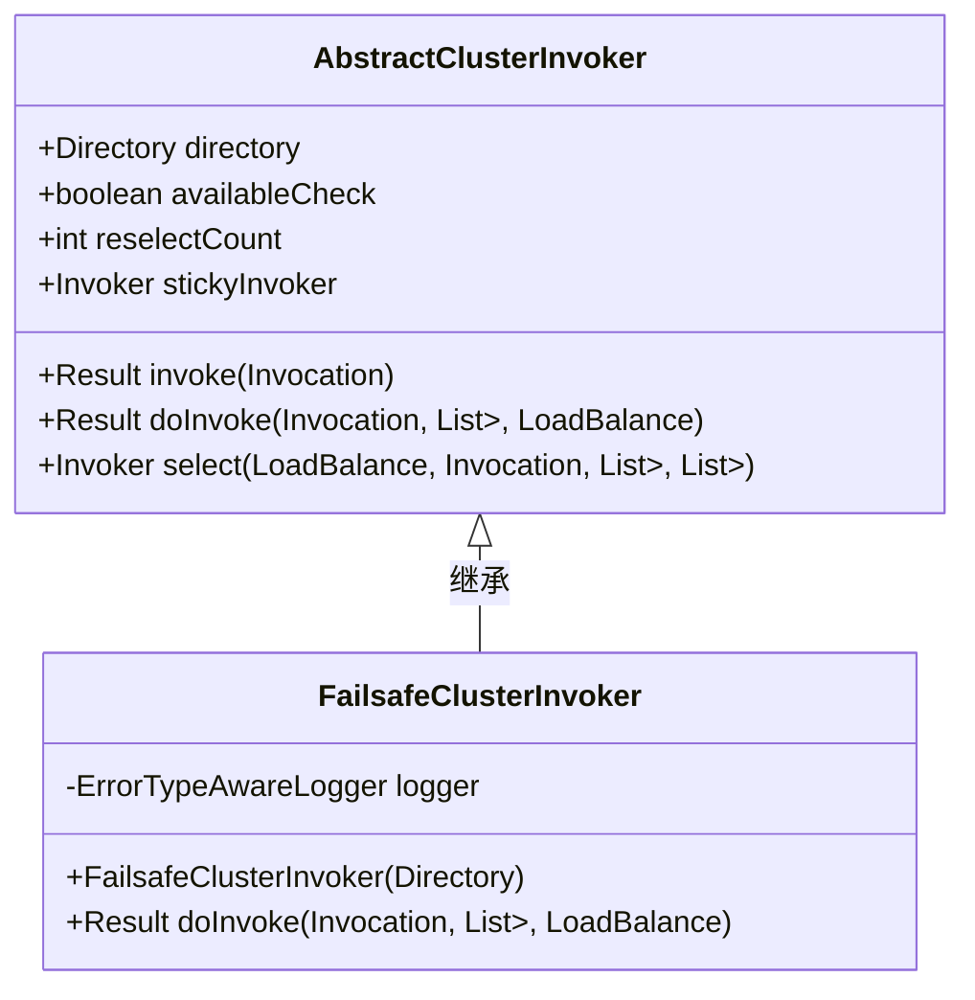
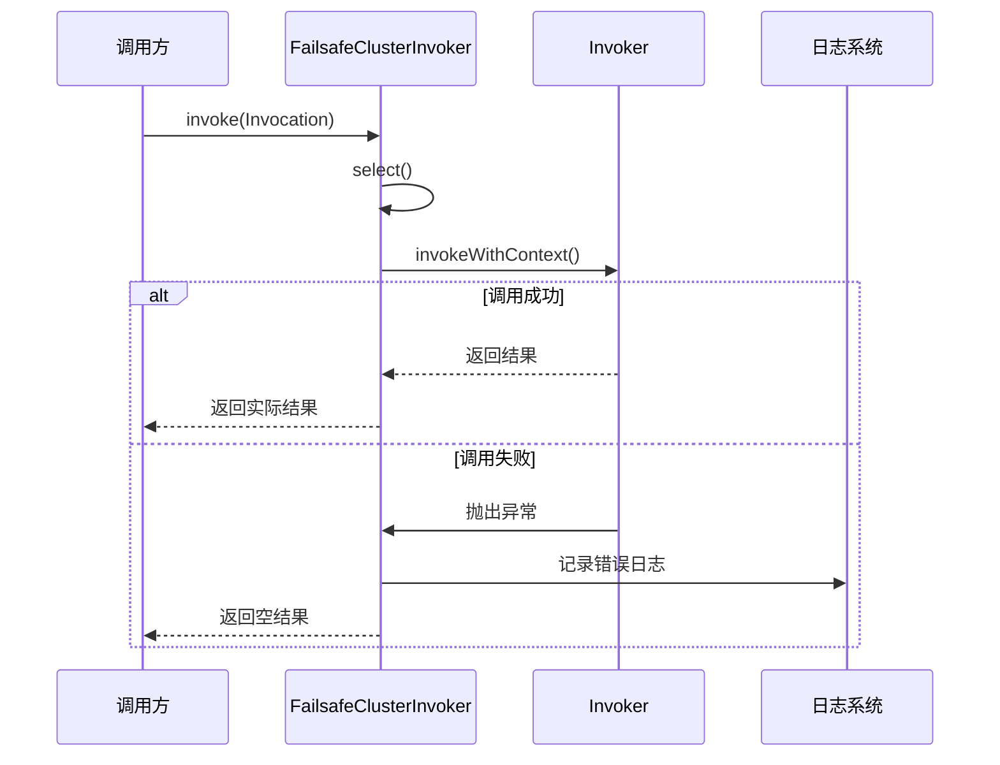

# 失败安全模式

<cite>
**本文档中引用的文件**  
- [FailsafeClusterInvoker.java](file://dubbo-cluster\src\main\java\org\apache\dubbo\rpc\cluster\support\FailsafeClusterInvoker.java)
- [FailsafeCluster.java](file://dubbo-cluster\src\main\java\org\apache\dubbo\rpc\cluster\support\FailsafeCluster.java)
- [AbstractClusterInvoker.java](file://dubbo-cluster\src\main\java\org\apache\dubbo\rpc\cluster\support\AbstractClusterInvoker.java)
- [AsyncRpcResult.java](file://dubbo-rpc\dubbo-rpc-api\src\main\java\org\apache\dubbo\rpc\AsyncRpcResult.java)
- [FailSafeClusterInvokerTest.java](file://dubbo-cluster\src\test\java\org\apache\dubbo\rpc\cluster\support\FailSafeClusterInvokerTest.java)
</cite>

## 目录
1. [引言](#引言)
2. [失败安全模式概述](#失败安全模式概述)
3. [核心实现原理](#核心实现原理)
4. [配置与使用](#配置与使用)
5. [应用场景分析](#应用场景分析)
6. [风险与监控](#风险与监控)
7. [总结](#总结)

## 引言
失败安全模式（Failsafe）是Dubbo框架中一种重要的容错机制，它在远程调用失败时能够自动忽略异常并返回空结果，从而保证系统的整体可用性。这种模式特别适用于对可靠性要求不高的场景，如日志记录、统计上报等。本文将深入解析FailsafeClusterInvoker的实现原理，探讨其在系统降级和容灾方案中的作用，并分析可能带来的数据丢失风险及相应的监控补偿机制。

## 失败安全模式概述
失败安全模式是一种在分布式系统中处理服务调用失败的策略。当服务调用出现异常时，该模式不会将异常抛给调用方，而是记录错误日志后返回一个空的结果，确保调用链不会因为单个服务的故障而中断。这种设计思想来源于“故障安全”（Fail-safe）原则，即系统在遇到故障时应尽可能地继续运行，而不是立即崩溃。

在Dubbo中，失败安全模式通过`FailsafeClusterInvoker`类实现，它是`AbstractClusterInvoker`的一个具体实现。与其他集群容错策略（如Failover、Failfast等）相比，Failsafe模式更加注重系统的可用性而非数据的一致性。

**Section sources**
- [FailsafeClusterInvoker.java](file://dubbo-cluster\src\main\java\org\apache\dubbo\rpc\cluster\support\FailsafeClusterInvoker.java#L33-L64)

## 核心实现原理
### 类结构与继承关系
`FailsafeClusterInvoker`继承自`AbstractClusterInvoker`，并重写了`doInvoke`方法来实现特定的容错逻辑。其核心思想是在调用过程中捕获所有异常，记录日志后返回一个默认的空结果。



**Diagram sources**
- [FailsafeClusterInvoker.java](file://dubbo-cluster\src\main\java\org\apache\dubbo\rpc\cluster\support\FailsafeClusterInvoker.java#L40-L64)
- [AbstractClusterInvoker.java](file://dubbo-cluster\src\main\java\org\apache\dubbo\rpc\cluster\support\AbstractClusterInvoker.java#L62-L501)

### 调用流程分析
`FailsafeClusterInvoker`的调用流程如下：
1. 通过`select`方法选择一个合适的Invoker实例
2. 调用`invokeWithContext`方法执行实际的服务调用
3. 如果调用过程中发生任何异常，则捕获异常，记录错误日志
4. 返回一个空的AsyncResult结果

关键代码片段展示了这一过程：



**Diagram sources**
- [FailsafeClusterInvoker.java](file://dubbo-cluster\src\main\java\org\apache\dubbo\rpc\cluster\support\FailsafeClusterInvoker.java#L48-L63)
- [AbstractClusterInvoker.java](file://dubbo-cluster\src\main\java\org\apache\dubbo\rpc\cluster\support\AbstractClusterInvoker.java#L402-L418)

### 异常处理机制
`FailsafeClusterInvoker`在异常处理方面采用了简洁而有效的方式。它使用try-catch块包裹整个调用过程，一旦发生异常，就会通过`logger.error`记录详细的错误信息，然后创建并返回一个默认的异步结果。

```java
return AsyncRpcResult.newDefaultAsyncResult(null, null, invocation); // ignore
```

这里使用的`AsyncRpcResult.newDefaultAsyncResult`方法会创建一个包含空值和空异常的默认结果对象，确保调用方能够正常接收响应，即使实际调用已经失败。

**Section sources**
- [FailsafeClusterInvoker.java](file://dubbo-cluster\src\main\java\org\apache\dubbo\rpc\cluster\support\FailsafeClusterInvoker.java#L54-L62)
- [AsyncRpcResult.java](file://dubbo-rpc\dubbo-rpc-api\src\main\java\org\apache\dubbo\rpc\AsyncRpcResult.java#L348-L374)

## 配置与使用
### SPI配置
在Dubbo中，`FailsafeCluster`通过SPI机制注册为集群策略之一。其配置位于`META-INF/dubbo/internal/org.apache.dubbo.rpc.cluster.Cluster`文件中：

```
failsafe=org.apache.dubbo.rpc.cluster.support.FailsafeCluster
```

这使得用户可以通过简单的配置来启用失败安全模式。

### 配置示例
用户可以在服务提供者或消费者的配置中指定使用失败安全模式：

```xml
<dubbo:service cluster="failsafe" />
<!-- 或者 -->
<dubbo:reference cluster="failsafe" />
```

也可以通过URL参数进行配置：
```
dubbo://127.0.0.1:20880/com.example.DemoService?cluster=failsafe
```

**Section sources**
- [FailsafeCluster.java](file://dubbo-cluster\src\main\java\org\apache\dubbo\rpc\cluster\support\FailsafeCluster.java#L27-L35)
- [org.apache.dubbo.rpc.cluster.Cluster](file://dubbo-cluster\src\main\resources\META-INF\dubbo\internal\org.apache.dubbo.rpc.cluster.Cluster#L5)

## 应用场景分析
### 日志记录与统计上报
失败安全模式非常适合用于日志记录和统计上报这类对可靠性要求不高的场景。例如，在微服务架构中，每个服务节点都需要向中央日志系统发送日志信息。如果日志系统暂时不可用，使用失败安全模式可以确保业务服务不会因此受到影响，同时日志信息的丢失也不会造成严重后果。

### 系统降级与容灾
在高并发场景下，当某些非核心服务出现故障时，可以采用失败安全模式进行系统降级。这样既能保证核心业务流程的畅通，又能避免因局部故障导致整个系统瘫痪。例如，在电商系统中，商品推荐服务的暂时不可用不应影响用户的下单流程。

### 监控与告警
对于监控和告警系统来说，偶尔的数据丢失是可以接受的。使用失败安全模式可以让监控系统在目标服务不可用时继续运行，而不是直接中断。后续可以通过数据补偿机制来弥补丢失的数据。

**Section sources**
- [FailSafeClusterInvokerTest.java](file://dubbo-cluster\src\test\java\org\apache\dubbo\rpc\cluster\support\FailSafeClusterInvokerTest.java#L84-L123)

## 风险与监控
### 数据丢失风险
尽管失败安全模式提高了系统的可用性，但也带来了数据丢失的风险。由于调用失败时直接返回空结果，可能导致重要的业务数据无法写入目标系统。这种风险在金融交易、订单处理等对数据一致性要求较高的场景中尤为突出。

### 监控建议
为了降低数据丢失带来的影响，建议采取以下监控措施：
1. **异常日志监控**：实时监控`FailsafeClusterInvoker`记录的错误日志，及时发现服务调用异常
2. **调用量对比**：定期对比生产者和消费者的调用量，发现潜在的数据丢失问题
3. **健康检查**：对依赖的服务进行定期健康检查，提前预警可能的故障

### 补偿机制
针对可能的数据丢失，可以设计以下补偿机制：
1. **异步重试**：将失败的调用记录到消息队列中，由后台任务进行异步重试
2. **数据核对**：定期运行数据核对程序，发现并修复不一致的数据
3. **人工干预**：对于关键业务数据，建立人工审核和补录流程

**Section sources**
- [FailsafeClusterInvoker.java](file://dubbo-cluster\src\main\java\org\apache\dubbo\rpc\cluster\support\FailsafeClusterInvoker.java#L55-L60)
- [FailSafeClusterInvokerTest.java](file://dubbo-cluster\src\test\java\org\apache\dubbo\rpc\cluster\support\FailSafeClusterInvokerTest.java#L116-L121)

## 总结
失败安全模式是Dubbo框架中一种重要的容错机制，它通过忽略调用异常并返回空结果的方式来保证系统的整体可用性。这种模式特别适用于日志记录、统计上报等对可靠性要求不高的场景。然而，使用者也需要注意其可能带来的数据丢失风险，并通过完善的监控和补偿机制来确保业务数据的完整性。在实际应用中，应根据具体的业务需求权衡可用性和一致性，合理选择和配置集群容错策略。