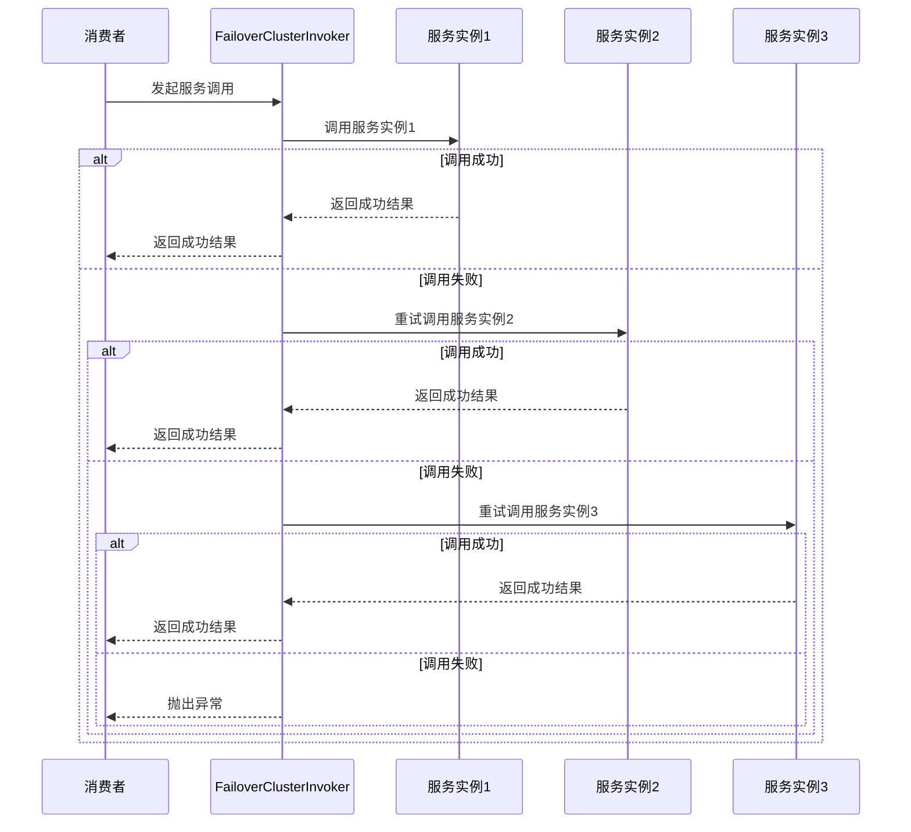
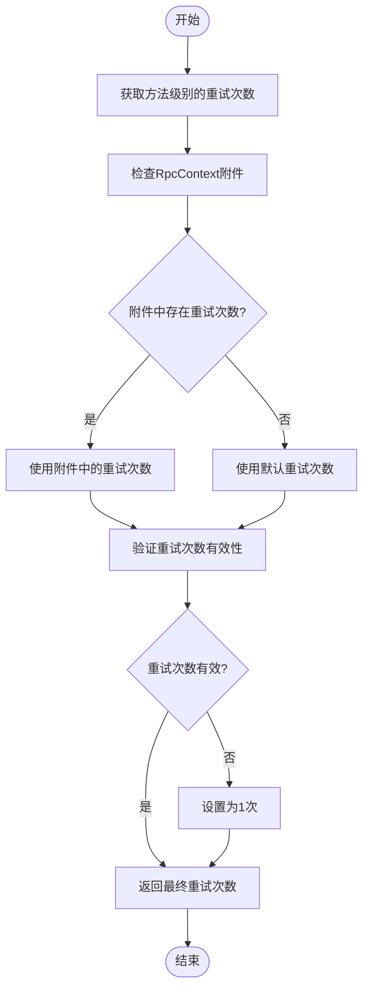
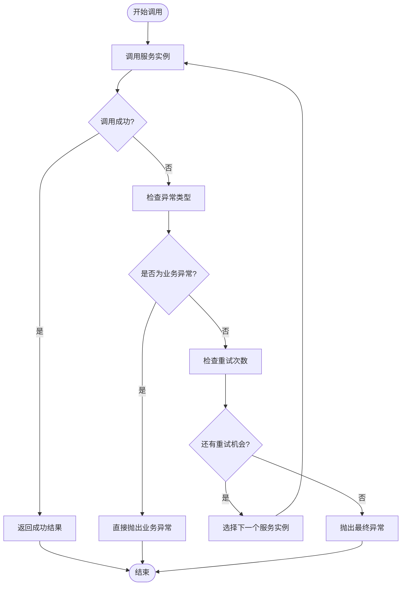

# 失败重试模式

<cite>
**本文档引用文件**   
- [FailoverClusterInvoker.java](file://dubbo-cluster\src\main\java\org\apache\dubbo\rpc\cluster\support\FailoverClusterInvoker.java)
- [AbstractClusterInvoker.java](file://dubbo-cluster\src\main\java\org\apache\dubbo\rpc\cluster\support\AbstractClusterInvoker.java)
- [CommonConstants.java](file://dubbo-common\src\main\java\org\apache\dubbo\common\constants\CommonConstants.java)
- [FailoverClusterInvokerTest.java](file://dubbo-cluster\src\test\java\org\apache\dubbo\rpc\cluster\support\FailoverClusterInvokerTest.java)
</cite>

## 目录
1. [引言](#引言)
2. [核心实现原理](#核心实现原理)
3. [重试次数控制机制](#重试次数控制机制)
4. [异常处理机制](#异常处理机制)
5. [调用链路追踪](#调用链路追踪)
6. [高可用场景优势与性能开销](#高可用场景优势与性能开销)
7. [配置示例](#配置示例)
8. [幂等性操作最佳实践](#幂等性操作最佳实践)
9. [实际应用案例](#实际应用案例)
10. [性能优化建议](#性能优化建议)
11. [常见问题解决方案](#常见问题解决方案)

## 引言
失败重试模式是分布式系统中保障服务高可用性的关键机制之一。在 Dubbo 框架中，`FailoverClusterInvoker` 类实现了这一模式，当服务调用失败时，能够自动切换到其他可用的服务实例进行重试。该机制通过在客户端层面实现故障转移，有效提升了系统的容错能力和稳定性。本文将深入分析 `FailoverClusterInvoker` 的实现原理，探讨其在高可用场景下的优势与潜在的性能开销，并提供配置示例和最佳实践。

## 核心实现原理
`FailoverClusterInvoker` 是 Dubbo 集群容错机制的核心组件之一，继承自 `AbstractClusterInvoker`。其主要职责是在服务调用失败时，自动选择其他可用的服务实例进行重试，从而实现故障转移。该类通过 `doInvoke` 方法实现了核心的重试逻辑，该方法在调用失败时会循环尝试其他服务实例，直到成功或达到最大重试次数。

**Diagram sources**
- [FailoverClusterInvoker.java](file://dubbo-cluster\src\main\java\org\apache\dubbo\rpc\cluster\support\FailoverClusterInvoker.java#L56-L126)

**Section sources**
- [FailoverClusterInvoker.java](file://dubbo-cluster\src\main\java\org\apache\dubbo\rpc\cluster\support\FailoverClusterInvoker.java#L47-L143)

## 重试次数控制机制
`FailoverClusterInvoker` 的重试次数由 `calculateInvokeTimes` 方法计算得出，该方法首先从 URL 中获取方法级别的 `retries` 参数，如果未设置则使用默认值 `DEFAULT_RETRIES`（默认为2次）。此外，还可以通过 `RpcContext` 的附件（attachment）动态设置重试次数，这为在运行时动态调整重试策略提供了灵活性。

**Diagram sources**
- [FailoverClusterInvoker.java](file://dubbo-cluster\src\main\java\org\apache\dubbo\rpc\cluster\support\FailoverClusterInvoker.java#L128-L141)

**Section sources**
- [FailoverClusterInvoker.java](file://dubbo-cluster\src\main\java\org\apache\dubbo\rpc\cluster\support\FailoverClusterInvoker.java#L128-L141)
- [CommonConstants.java](file://dubbo-common\src\main\java\org\apache\dubbo\common\constants\CommonConstants.java#L417)

## 异常处理机制
`FailoverClusterInvoker` 的异常处理机制具有明确的区分策略。对于业务异常（`BizException`），会直接抛出，不再进行重试，因为这通常表示业务逻辑上的错误，重试无法解决问题。而对于超时异常（`TIMEOUT_EXCEPTION`）或网络异常等非业务异常，则会进行重试，尝试调用其他服务实例。这种机制确保了在面对临时性故障时能够自动恢复，同时避免了对业务错误的无效重试。

**Diagram sources**
- [FailoverClusterInvoker.java](file://dubbo-cluster\src\main\java\org\apache\dubbo\rpc\cluster\support\FailoverClusterInvoker.java#L103-L105)

**Section sources**
- [FailoverClusterInvoker.java](file://dubbo-cluster\src\main\java\org\apache\dubbo\rpc\cluster\support\FailoverClusterInvoker.java#L103-L105)
- [FailoverClusterInvokerTest.java](file://dubbo-cluster\src\test\java\org\apache\dubbo\rpc\cluster\support\FailoverClusterInvokerTest.java#L170-L190)

## 调用链路追踪
`FailoverClusterInvoker` 在重试过程中维护了详细的调用链路信息。通过 `invoked` 列表记录所有已调用的服务实例，并通过 `providers` 集合记录所有失败的服务提供者地址。当最终调用成功时，会以警告级别记录日志，说明虽然最终成功，但之前有服务实例失败。当所有重试都失败时，会抛出包含详细信息的 `RpcException`，包括失败的服务实例列表、重试次数和最终错误信息，便于问题排查。

**Section sources**
- [FailoverClusterInvoker.java](file://dubbo-cluster\src\main\java\org\apache\dubbo\rpc\cluster\support\FailoverClusterInvoker.java#L65-L67)
- [FailoverClusterInvoker.java](file://dubbo-cluster\src\main\java\org\apache\dubbo\rpc\cluster\support\FailoverClusterInvoker.java#L82-L98)

## 高可用场景优势与性能开销
失败重试模式在高可用场景下具有显著优势。它能够有效应对服务实例的临时性故障（如网络抖动、短暂的GC停顿等），通过自动切换到健康的实例，保证了服务的整体可用性。然而，该模式也带来了潜在的性能开销。每次重试都会增加调用的延迟，尤其是在网络状况不佳时，多次重试可能导致整体响应时间显著增加。此外，重试请求会给其他服务实例带来额外的负载压力。

**Section sources**
- [FailoverClusterInvoker.java](file://dubbo-cluster\src\main\java\org\apache\dubbo\rpc\cluster\support\FailoverClusterInvoker.java#L63-L64)

## 配置示例
可以通过多种方式配置失败重试模式的参数。在服务提供者或消费者的 URL 中，可以设置 `retries` 参数来指定重试次数。例如，`dubbo://127.0.0.1:20880/org.apache.dubbo.demo.DemoService?retries=3` 表示最多重试3次（即总共尝试4个实例）。超时时间可以通过 `timeout` 参数设置，例如 `timeout=5000` 表示超时时间为5秒。这些配置也可以在 Spring 配置文件或注解中进行设置。

**Section sources**
- [CommonConstants.java](file://dubbo-common\src\main\java\org\apache\dubbo\common\constants\CommonConstants.java#L413)
- [CommonConstants.java](file://dubbo-common\src\main\java\org\apache\dubbo\common\constants\CommonConstants.java#L145)

## 幂等性操作最佳实践
失败重试模式应仅用于幂等性操作。幂等性意味着多次执行同一操作的结果与执行一次相同。例如，查询订单、获取用户信息等读操作是天然幂等的。对于写操作，如创建订单，则必须确保其幂等性，通常通过引入唯一请求ID（如 `X-Request-ID`）来实现。服务端需要检查该ID是否已处理过，避免重复创建。在非幂等操作上使用失败重试可能导致数据不一致或重复。

**Section sources**
- [FailoverClusterInvoker.java](file://dubbo-cluster\src\main\java\org\apache\dubbo\rpc\cluster\support\FailoverClusterInvoker.java#L103-L105)

## 实际应用案例
在订单查询场景中，失败重试模式非常适用。假设一个电商系统有多个订单服务实例，当用户发起订单查询请求时，若某个实例因短暂的网络问题或高负载而超时，`FailoverClusterInvoker` 会自动将请求转发到另一个健康的实例。由于查询操作是幂等的，重试不会产生副作用。最终，用户能够成功获取订单信息，整个过程对用户透明，体现了系统的高可用性。

**Section sources**
- [FailoverClusterInvoker.java](file://dubbo-cluster\src\main\java\org\apache\dubbo\rpc\cluster\support\FailoverClusterInvoker.java#L56-L126)

## 性能优化建议
为了优化失败重试模式的性能，建议采取以下措施：首先，合理设置重试次数，避免过多的重试导致延迟累积，通常2-3次重试是合理的。其次，结合熔断机制（如 Hystrix），当某个服务实例连续失败达到阈值时，将其熔断，避免无效的重试。最后，可以考虑使用更高级的负载均衡策略，如 `p2c`（Power of Two Choices），优先选择负载较低的实例，减少失败的概率。

**Section sources**
- [FailoverClusterInvoker.java](file://dubbo-cluster\src\main\java\org\apache\dubbo\rpc\cluster\support\FailoverClusterInvoker.java#L62-L63)

## 常见问题解决方案
常见问题包括重试导致的延迟增加和非幂等操作的重复执行。对于延迟问题，应监控服务的 P99 延迟，如果发现因重试导致延迟显著增加，应调整重试次数或优化服务性能。对于非幂等操作的重复执行，必须在业务层面实现幂等性控制，如使用数据库唯一约束、Redis 分布式锁或请求ID去重等机制，确保即使发生重试也不会产生错误的数据状态。

**Section sources**
- [FailoverClusterInvoker.java](file://dubbo-cluster\src\main\java\org\apache\dubbo\rpc\cluster\support\FailoverClusterInvoker.java#L103-L105)
- [FailoverClusterInvoker.java](file://dubbo-cluster\src\main\java\org\apache\dubbo\rpc\cluster\support\FailoverClusterInvoker.java#L115-L125)