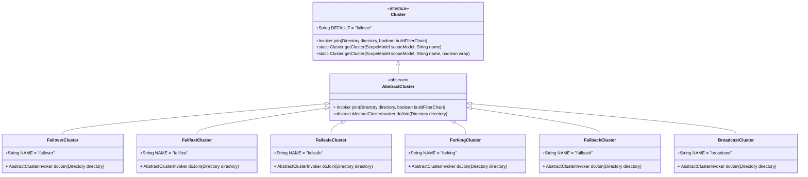
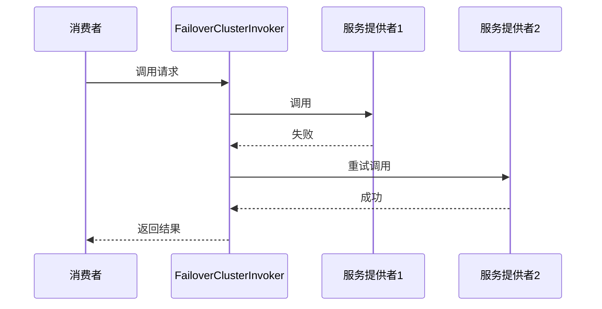
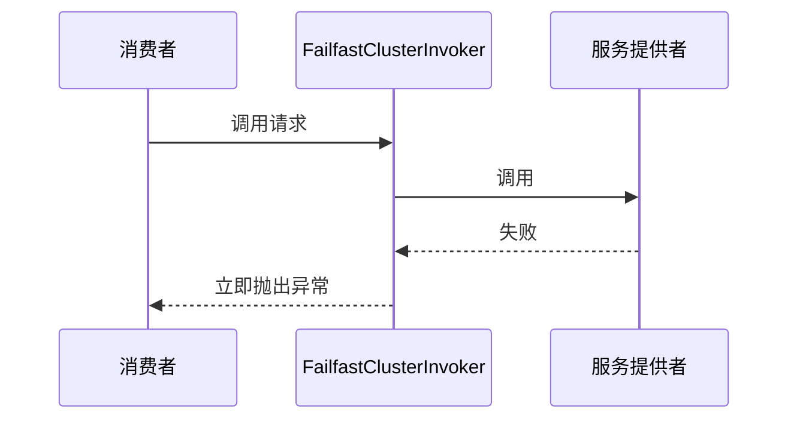
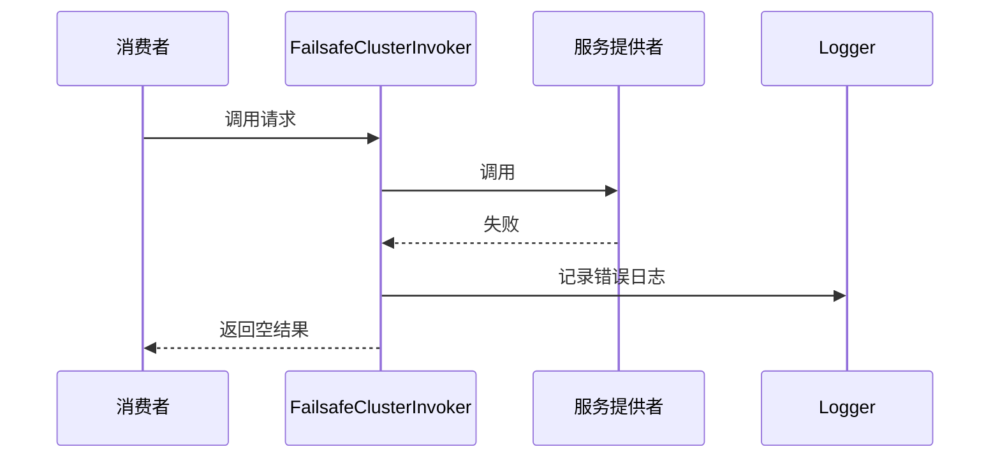
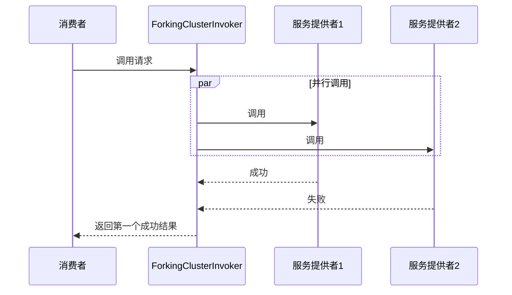
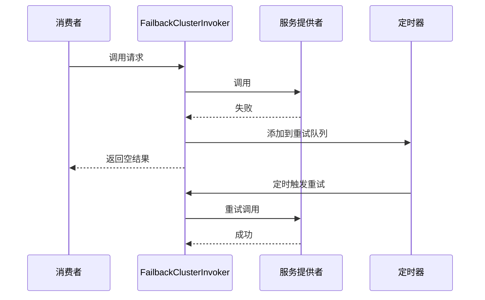
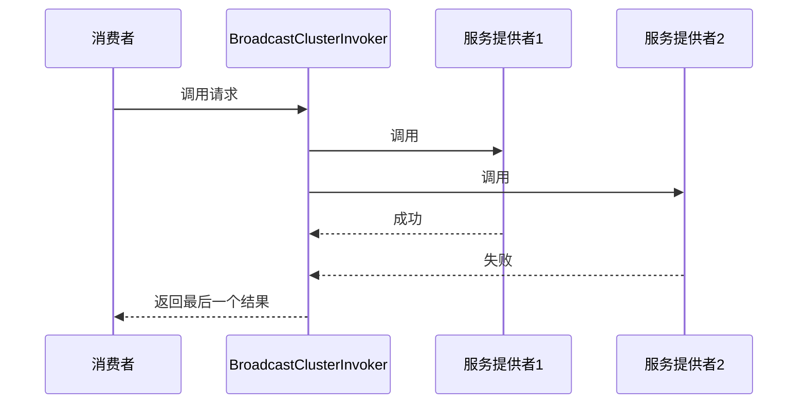

# 容错机制

<cite>
**本文档中引用的文件**   
- [Cluster.java](file://dubbo-cluster\src\main\java\org\apache\dubbo\rpc\cluster\Cluster.java)
- [FailoverClusterInvoker.java](file://dubbo-cluster\src\main\java\org\apache\dubbo\rpc\cluster\support\FailoverClusterInvoker.java)
- [FailfastClusterInvoker.java](file://dubbo-cluster\src\main\java\org\apache\dubbo\rpc\cluster\support\FailfastClusterInvoker.java)
- [FailsafeClusterInvoker.java](file://dubbo-cluster\src\main\java\org\apache\dubbo\rpc\cluster\support\FailsafeClusterInvoker.java)
- [ForkingClusterInvoker.java](file://dubbo-cluster\src\main\java\org\apache\dubbo\rpc\cluster\support\ForkingClusterInvoker.java)
- [FailbackClusterInvoker.java](file://dubbo-cluster\src\main\java\org\apache\dubbo\rpc\cluster\support\FailbackClusterInvoker.java)
- [BroadcastClusterInvoker.java](file://dubbo-cluster\src\main\java\org\apache\dubbo\rpc\cluster\support\BroadcastClusterInvoker.java)
- [AbstractClusterInvoker.java](file://dubbo-cluster\src\main\java\org\apache\dubbo\rpc\cluster\support\AbstractClusterInvoker.java)
- [Constants.java](file://dubbo-cluster\src\main\java\org\apache\dubbo\rpc\cluster\Constants.java)
- [org.apache.dubbo.rpc.cluster.Cluster](file://dubbo-cluster\src\main\resources\META-INF\dubbo\internal\org.apache.dubbo.rpc.cluster.Cluster)
</cite>

## 目录
1. [引言](#引言)
2. [Cluster接口设计](#cluster接口设计)
3. [容错策略实现](#容错策略实现)
   1. [失败重试（Failover）](#失败重试failover)
   2. [快速失败（Failfast）](#快速失败failfast)
   3. [失败安全（Failsafe）](#失败安全failsafe)
   4. [并行调用（Forking）](#并行调用forking)
   5. [失败自动恢复（Failback）](#失败自动恢复failback)
   6. [广播调用（Broadcast）](#广播调用broadcast)
4. [容错策略配置方法](#容错策略配置方法)
5. [容错策略选择与业务场景](#容错策略选择与业务场景)
6. [性能影响分析与优化建议](#性能影响分析与优化建议)
7. [自定义扩展方法](#自定义扩展方法)
8. [最佳实践](#最佳实践)

## 引言
Dubbo作为一款高性能的Java RPC框架，其容错机制是保障分布式系统稳定性的关键组件。在分布式环境中，网络波动、服务节点故障等问题难以避免，因此设计合理的容错策略对于保证服务的可用性和可靠性至关重要。Dubbo的容错机制通过Cluster接口和多种容错策略实现，为开发者提供了灵活的选择来应对不同的业务场景。

Dubbo的容错机制主要在dubbo-cluster模块中实现，该模块负责将多个服务提供者聚合成一个虚拟的服务调用者，并根据配置的容错策略处理调用过程中的异常情况。本文档将深入分析dubbo-cluster模块中的容错机制，全面介绍Cluster接口的设计和各种容错策略的实现原理，帮助开发者更好地理解和使用Dubbo的容错功能。

**本节内容主要基于对dubbo-cluster模块的整体结构和核心概念的理解，未直接分析具体源文件。**

## Cluster接口设计

Dubbo的容错机制核心是`Cluster`接口，该接口定义了将多个服务调用者（Invoker）聚合成一个虚拟调用者的方法。`Cluster`接口是一个SPI（Service Provider Interface）接口，采用扩展点机制，允许用户自定义实现。



**图源**
- [Cluster.java](file://dubbo-cluster\src\main\java\org\apache\dubbo\rpc\cluster\Cluster.java)
- [AbstractCluster.java](file://dubbo-cluster\src\main\java\org\apache\dubbo\rpc\cluster\support\wrapper\AbstractCluster.java)
- [FailoverCluster.java](file://dubbo-cluster\src\main\java\org\apache\dubbo\rpc\cluster\support\FailoverCluster.java)
- [FailfastCluster.java](file://dubbo-cluster\src\main\java\org\apache\dubbo\rpc\cluster\support\FailfastCluster.java)
- [FailsafeCluster.java](file://dubbo-cluster\src\main\java\org\apache\dubbo\rpc\cluster\support\FailsafeCluster.java)
- [ForkingCluster.java](file://dubbo-cluster\src\main\java\org\apache\dubbo\rpc\cluster\support\ForkingCluster.java)
- [FailbackCluster.java](file://dubbo-cluster\src\main\java\org\apache\dubbo\rpc\cluster\support\FailbackCluster.java)
- [BroadcastCluster.java](file://dubbo-cluster\src\main\java\org\apache\dubbo\rpc\cluster\support\BroadcastCluster.java)

`Cluster`接口的核心方法是`join`，它接收一个`Directory`对象和一个布尔值`buildFilterChain`，返回一个`Invoker`对象。`Directory`代表服务目录，包含了所有可用的服务提供者列表；`buildFilterChain`表示是否构建过滤器链。`join`方法的作用是将目录中的多个服务调用者合并为一个虚拟的调用者，对外提供统一的调用接口。

`Cluster`接口的默认实现是`AbstractCluster`抽象类，它实现了`join`方法的基本逻辑，并定义了一个抽象方法`doJoin`，由具体的容错策略类来实现。每个具体的容错策略类（如`FailoverCluster`、`FailfastCluster`等）都继承自`AbstractCluster`，并实现`doJoin`方法，返回对应的`AbstractClusterInvoker`实现类实例。

通过SPI机制，Dubbo可以在运行时根据配置动态加载不同的`Cluster`实现。在`META-INF/dubbo/internal/org.apache.dubbo.rpc.cluster.Cluster`文件中，定义了各种容错策略的名称和对应的实现类：

```
mock=org.apache.dubbo.rpc.cluster.support.wrapper.MockClusterWrapper
scope=org.apache.dubbo.rpc.cluster.support.wrapper.ScopeClusterWrapper
failover=org.apache.dubbo.rpc.cluster.support.FailoverCluster
failfast=org.apache.dubbo.rpc.cluster.support.FailfastCluster
failsafe=org.apache.dubbo.rpc.cluster.support.FailsafeCluster
failback=org.apache.dubbo.rpc.cluster.support.FailbackCluster
forking=org.apache.dubbo.rpc.cluster.support.ForkingCluster
available=org.apache.dubbo.rpc.cluster.support.AvailableCluster
mergeable=org.apache.dubbo.rpc.cluster.support.MergeableCluster
broadcast=org.apache.dubbo.rpc.cluster.support.BroadcastCluster
zone-aware=org.apache.dubbo.rpc.cluster.support.registry.ZoneAwareCluster
```

**本节源码**
- [Cluster.java](file://dubbo-cluster\src\main\java\org\apache\dubbo\rpc\cluster\Cluster.java#L1-L80)
- [org.apache.dubbo.rpc.cluster.Cluster](file://dubbo-cluster\src\main\resources\META-INF\dubbo\internal\org.apache.dubbo.rpc.cluster.Cluster#L1-L12)

## 容错策略实现

Dubbo提供了多种容错策略，每种策略都有其特定的应用场景和工作原理。这些策略都继承自`AbstractClusterInvoker`抽象类，该类定义了容错调用的基本框架。

### 失败重试（Failover）

失败重试策略是Dubbo的默认容错策略，当调用失败时，会自动切换到其他服务提供者进行重试，直到成功或达到最大重试次数。这种策略适用于读操作或幂等的写操作，可以有效提高服务的可用性。



**图源**
- [FailoverClusterInvoker.java](file://dubbo-cluster\src\main\java\org\apache\dubbo\rpc\cluster\support\FailoverClusterInvoker.java#L1-L144)

`FailoverClusterInvoker`的`doInvoke`方法实现了失败重试的核心逻辑。首先通过`calculateInvokeTimes`方法计算重试次数，然后在循环中尝试调用不同的服务提供者。每次调用前都会重新选择服务提供者，以应对服务列表的变化。如果调用成功，则直接返回结果；如果调用失败且不是业务异常，则记录异常并继续下一次重试。当所有重试都失败后，抛出最后一次的异常。

重试次数可以通过`retries`参数配置，默认为2次（加上首次调用共3次）。重试次数也可以通过RPC上下文动态设置，优先级高于配置文件中的设置。

**本节源码**
- [FailoverClusterInvoker.java](file://dubbo-cluster\src\main\java\org\apache\dubbo\rpc\cluster\support\FailoverClusterInvoker.java#L1-L144)

### 快速失败（Failfast）

快速失败策略在调用失败时立即抛出异常，不会进行重试。这种策略适用于非幂等的写操作，如数据库插入、订单创建等，避免因重试导致数据重复。



**图源**
- [FailfastClusterInvoker.java](file://dubbo-cluster\src\main\java\org\apache\dubbo\rpc\cluster\support\FailfastClusterInvoker.java#L1-L66)

`FailfastClusterInvoker`的实现非常简单，它首先通过负载均衡策略选择一个服务提供者，然后直接调用。如果调用过程中抛出异常，会判断是否为业务异常，如果是则直接抛出；如果不是，则包装成`RpcException`抛出。由于不进行重试，所以性能开销最小。

**本节源码**
- [FailfastClusterInvoker.java](file://dubbo-cluster\src\main\java\org\apache\dubbo\rpc\cluster\support\FailfastClusterInvoker.java#L1-L66)

### 失败安全（Failsafe）

失败安全策略在调用失败时会记录错误日志，但不会抛出异常，而是返回一个空结果。这种策略适用于写入审计日志、记录操作日志等对结果不敏感的操作。



**图源**
- [FailsafeClusterInvoker.java](file://dubbo-cluster\src\main\java\org\apache\dubbo\rpc\cluster\support\FailsafeClusterInvoker.java#L1-L65)

`FailsafeClusterInvoker`的`doInvoke`方法首先尝试调用服务提供者，如果调用成功则返回结果；如果调用失败，则记录错误日志并返回一个空的异步结果。由于不会抛出异常，所以调用方不会感知到调用失败，需要通过日志来监控失败情况。

**本节源码**
- [FailsafeClusterInvoker.java](file://dubbo-cluster\src\main\java\org\apache\dubbo\rpc\cluster\support\FailsafeClusterInvoker.java#L1-L65)

### 并行调用（Forking）

并行调用策略会同时向多个服务提供者发起调用，只要有一个调用成功就立即返回结果。这种策略适用于对实时性要求很高的操作，但会消耗更多的服务资源。



**图源**
- [ForkingClusterInvoker.java](file://dubbo-cluster\src\main\java\org\apache\dubbo\rpc\cluster\support\ForkingClusterInvoker.java#L1-L139)

`ForkingClusterInvoker`使用线程池来并发执行多个调用。它首先根据`forks`参数确定并发调用的数量，然后为每个选中的服务提供者提交一个异步任务。所有任务共享一个阻塞队列，第一个完成的任务会将结果放入队列，其他任务完成后会检查队列是否已有结果，如果有则直接返回。通过`timeout`参数可以设置最大等待时间，避免无限等待。

**本节源码**
- [ForkingClusterInvoker.java](file://dubbo-cluster\src\main\java\org\apache\dubbo\rpc\cluster\support\ForkingClusterInvoker.java#L1-L139)

### 失败自动恢复（Failback）

失败自动恢复策略在调用失败时会记录失败请求，并定时重试，直到成功。这种策略适用于消息通知、事件广播等最终一致性要求的场景。



**图源**
- [FailbackClusterInvoker.java](file://dubbo-cluster\src\main\java\org\apache\dubbo\rpc\cluster\support\FailbackClusterInvoker.java#L1-L234)

`FailbackClusterInvoker`使用`HashedWheelTimer`定时器来管理重试任务。当调用失败时，会创建一个`RetryTimerTask`并添加到定时器中，定时器会按照`RETRY_FAILED_PERIOD`（默认5秒）的间隔执行重试。重试次数由`retries`参数控制，超过重试次数后会放弃重试。由于重试是在后台线程中执行的，所以不会影响主调用流程。

**本节源码**
- [FailbackClusterInvoker.java](file://dubbo-cluster\src\main\java\org\apache\dubbo\rpc\cluster\support\FailbackClusterInvoker.java#L1-L234)

### 广播调用（Broadcast）

广播调用策略会向所有服务提供者发起调用，直到所有调用完成或达到失败阈值。这种策略适用于通知所有节点刷新缓存、更新配置等场景。



**图源**
- [BroadcastClusterInvoker.java](file://dubbo-cluster\src\main\java\org\apache\dubbo\rpc\cluster\support\BroadcastClusterInvoker.java#L1-L158)

`BroadcastClusterInvoker`会遍历所有服务提供者依次调用。通过`broadcast.fail.percent`参数可以设置失败阈值，当失败比例达到阈值时会提前终止调用并抛出异常。默认情况下，只有当所有调用都失败时才会抛出异常。

**本节源码**
- [BroadcastClusterInvoker.java](file://dubbo-cluster\src\main\java\org\apache\dubbo\rpc\cluster\support\BroadcastClusterInvoker.java#L1-L158)

## 容错策略配置方法

Dubbo提供了多种方式来配置容错策略，开发者可以根据实际需求选择合适的方式。

### XML配置方式
```xml
<dubbo:reference id="demoService" interface="org.apache.dubbo.api.demo.DemoService" cluster="failover" retries="3" />
```

### 注解配置方式
```java
@DubboReference(cluster = "failover", retries = 3)
private DemoService demoService;
```

### 属性文件配置方式
```properties
dubbo.reference.org.apache.dubbo.api.demo.DemoService.cluster=failover
dubbo.reference.org.apache.dubbo.api.demo.DemoService.retries=3
```

### API编程方式
```java
ReferenceConfig<DemoService> reference = new ReferenceConfig<>();
reference.setInterface(DemoService.class);
reference.setCluster("failover");
reference.setRetries(3);
```

### 方法级配置
除了服务级配置，Dubbo还支持方法级配置，可以为不同的方法设置不同的容错策略：
```xml
<dubbo:reference id="demoService" interface="org.apache.dubbo.api.demo.DemoService">
    <dubbo:method name="createOrder" cluster="failfast" />
    <dubbo:method name="queryOrder" cluster="failover" retries="2" />
</dubbo:reference>
```

### 动态配置
通过RPC上下文，可以在运行时动态修改容错策略的参数：
```java
RpcContext.getContext().setAttachment("retries", "3");
demoService.sayHello("world");
```

**本节源码**
- [Constants.java](file://dubbo-cluster\src\main\java\org\apache\dubbo\rpc\cluster\Constants.java#L1-L153)
- [AbstractClusterInvoker.java](file://dubbo-cluster\src\main\java\org\apache\dubbo\rpc\cluster\support\AbstractClusterInvoker.java#L1-L501)

## 容错策略选择与业务场景

选择合适的容错策略对于系统的稳定性和性能至关重要。不同的业务场景需要不同的容错策略：

### 读操作场景
对于查询类的读操作，推荐使用**失败重试（Failover）**策略。因为读操作通常是幂等的，即使重试多次也不会产生副作用。通过重试可以有效应对网络抖动、服务节点临时不可用等问题，提高服务的可用性。

### 非幂等写操作场景
对于创建订单、支付等非幂等的写操作，必须使用**快速失败（Failfast）**策略。这类操作如果重试可能导致数据重复，造成严重的业务问题。快速失败可以确保在第一次调用失败后立即返回错误，由业务层决定是否重试。

### 日志记录场景
对于写入审计日志、操作日志等场景，推荐使用**失败安全（Failsafe）**策略。这类操作对结果的准确性要求不高，即使失败也不会影响核心业务流程。使用失败安全策略可以避免因日志服务不可用而导致核心业务失败。

### 实时性要求高的场景
对于股票行情、实时报价等对实时性要求极高的场景，可以使用**并行调用（Forking）**策略。通过同时向多个服务节点发起调用，可以显著降低响应时间，提高用户体验。但需要注意这种策略会成倍增加服务端的压力。

### 最终一致性场景
对于消息通知、事件广播等最终一致性要求的场景，适合使用**失败自动恢复（Failback）**策略。这类操作不需要立即成功，只要最终能够完成即可。失败自动恢复策略可以在后台持续重试，直到成功为止。

### 全局通知场景
对于刷新缓存、更新配置等需要通知所有节点的场景，应该使用**广播调用（Broadcast）**策略。通过向所有服务节点广播消息，可以确保所有节点的状态保持一致。

## 性能影响分析与优化建议

不同的容错策略对系统性能有不同的影响，需要根据实际情况进行权衡和优化。

### 性能影响分析
| 容错策略 | 延迟 | 吞吐量 | 资源消耗 | 适用场景 |
|---------|------|--------|---------|---------|
| Failover | 中等 | 中等 | 中等 | 读操作、幂等写操作 |
| Failfast | 低 | 高 | 低 | 非幂等写操作 |
| Failsafe | 低 | 高 | 低 | 日志记录、审计 |
| Forking | 低 | 低 | 高 | 实时性要求高的操作 |
| Failback | 低 | 高 | 中等 | 消息通知、事件广播 |
| Broadcast | 高 | 低 | 高 | 全局通知、配置更新 |

### 优化建议
1. **合理设置重试次数**：对于Failover策略，重试次数不宜设置过高，一般2-3次即可。过多的重试会增加系统延迟和压力。
2. **避免在高并发场景使用Forking**：Forking策略会成倍增加服务端的负载，在高并发场景下可能导致服务雪崩。
3. **监控Failback的重试队列**：需要监控Failback策略的重试队列长度，避免队列无限增长导致内存溢出。
4. **合理设置Broadcast的失败阈值**：通过`broadcast.fail.percent`参数可以控制广播调用的容忍度，避免因个别节点故障导致整个调用失败。
5. **使用异步调用配合容错策略**：对于耗时较长的操作，可以结合异步调用和合适的容错策略，提高系统的响应速度。

## 自定义扩展方法

Dubbo的容错机制基于SPI设计，支持用户自定义扩展。要实现自定义的容错策略，需要遵循以下步骤：

1. 创建自定义的Cluster实现类，继承`AbstractCluster`：
```java
public class CustomCluster extends AbstractCluster {
    public static final String NAME = "custom";
    
    @Override
    public <T> AbstractClusterInvoker<T> doJoin(Directory<T> directory) throws RpcException {
        return new CustomClusterInvoker<>(directory);
    }
}
```

2. 创建自定义的ClusterInvoker实现类，继承`AbstractClusterInvoker`：
```java
public class CustomClusterInvoker<T> extends AbstractClusterInvoker<T> {
    public CustomClusterInvoker(Directory<T> directory) {
        super(directory);
    }
    
    @Override
    public Result doInvoke(Invocation invocation, List<Invoker<T>> invokers, LoadBalance loadbalance) throws RpcException {
        // 自定义的容错逻辑
        Invoker<T> invoker = select(loadbalance, invocation, invokers, null);
        return invokeWithContext(invoker, invocation);
    }
}
```

3. 在`META-INF/dubbo/org.apache.dubbo.rpc.cluster.Cluster`文件中注册自定义实现：
```
custom=com.example.CustomCluster
```

4. 在配置中使用自定义的容错策略：
```xml
<dubbo:reference id="demoService" interface="org.apache.dubbo.api.demo.DemoService" cluster="custom" />
```

通过这种方式，开发者可以根据业务需求实现更加复杂的容错逻辑，如基于机器学习的智能重试、基于业务规则的条件重试等。

**本节源码**
- [AbstractClusterInvoker.java](file://dubbo-cluster\src\main\java\org\apache\dubbo\rpc\cluster\support\AbstractClusterInvoker.java#L1-L501)

## 最佳实践

1. **根据业务特性选择合适的容错策略**：不要盲目使用默认的Failover策略，要根据操作的幂等性、实时性要求等因素选择最合适的策略。
2. **合理配置重试参数**：对于需要重试的场景，要合理设置重试次数和超时时间，避免过度重试导致系统雪崩。
3. **监控容错策略的执行情况**：通过监控系统观察各种容错策略的执行频率、失败率等指标，及时发现潜在问题。
4. **避免在核心链路使用高风险策略**：如Forking策略会显著增加服务端压力，不适合在核心交易链路使用。
5. **定期评估容错策略的有效性**：随着业务的发展，原有的容错策略可能不再适用，需要定期评估和调整。
6. **结合熔断机制使用**：容错策略应与熔断机制配合使用，在服务持续不可用时及时熔断，避免无效的重试消耗系统资源。
7. **做好异常处理和日志记录**：无论使用哪种容错策略，都要做好异常处理和日志记录，便于问题排查和系统优化。

通过合理使用和配置Dubbo的容错机制，可以显著提高分布式系统的稳定性和可用性，为业务的持续发展提供有力保障。

**本节内容总结了容错机制的最佳实践，未直接分析具体源文件。**