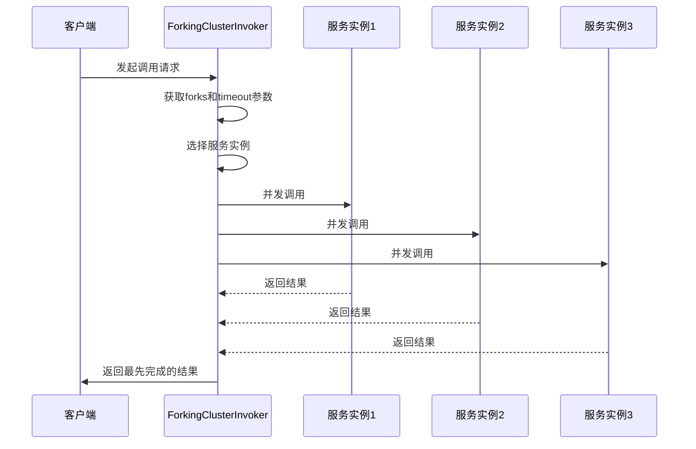
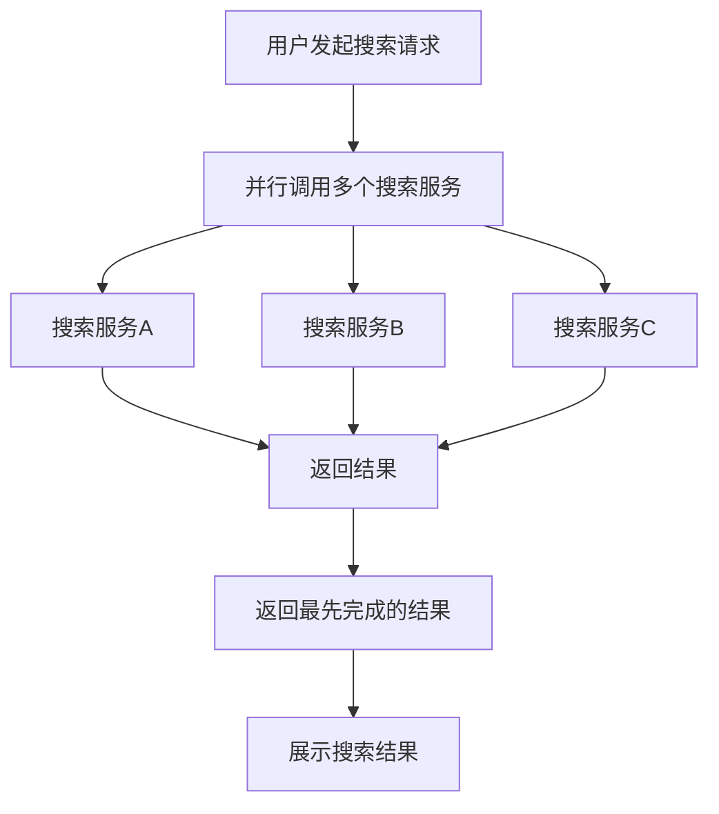
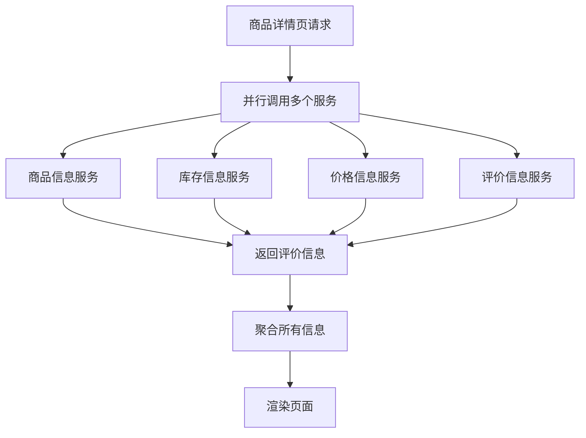
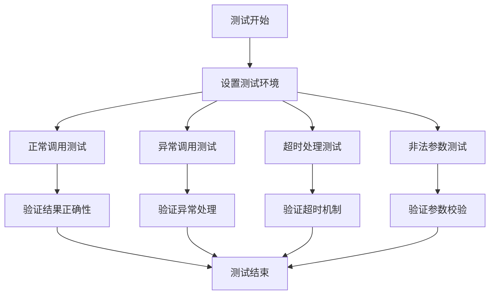

# 并行调用模式

<cite>
**本文档引用文件**  
- [ForkingClusterInvoker.java](file://dubbo-cluster\src\main\java\org\apache\dubbo\rpc\cluster\support\ForkingClusterInvoker.java)
- [ForkingCluster.java](file://dubbo-cluster\src\main\java\org\apache\dubbo\rpc\cluster\support\ForkingCluster.java)
- [ForkingClusterInvokerTest.java](file://dubbo-cluster\src\test\java\org\apache\dubbo\rpc\cluster\support\ForkingClusterInvokerTest.java)
- [CommonConstants.java](file://dubbo-common\src\main\java\org\apache\dubbo\common\constants\CommonConstants.java)
- [Constants.java](file://dubbo-cluster\src\main\java\org\apache\dubbo\rpc\cluster\Constants.java)
</cite>

## 目录
1. [引言](#引言)
2. [并行调用模式概述](#并行调用模式概述)
3. [ForkingClusterInvoker工作机制](#forkingclusterinvoker工作机制)
4. [配置方法](#配置方法)
5. [应用场景](#应用场景)
6. [性能监控与优化建议](#性能监控与优化建议)
7. [结论](#结论)

## 引言
并行调用模式是一种提高系统响应速度和降低延迟的重要机制。在分布式系统中，当需要从多个服务实例获取数据时，传统的串行调用方式可能会导致整体响应时间较长。而并行调用模式通过同时向多个服务实例发起调用，并返回最先完成的结果，有效提升了系统的实时性和可用性。本文将详细介绍Dubbo框架中的ForkingClusterInvoker实现，探讨其工作原理、配置方法以及在实际场景中的应用。

## 并行调用模式概述
并行调用模式（Forking）是一种集群调用策略，它允许客户端同时向多个服务提供者发起请求，并在收到第一个成功响应后立即返回结果。这种模式特别适用于对实时性要求较高的操作，如搜索服务、数据聚合等场景。虽然这种方式会消耗更多的服务资源，但能够显著降低响应延迟，提高用户体验。

在Dubbo框架中，并行调用模式由ForkingCluster和ForkingClusterInvoker两个核心组件实现。ForkingCluster负责创建ForkingClusterInvoker实例，而ForkingClusterInvoker则具体执行并行调用逻辑。

**本节来源**
- [ForkingCluster.java](file://dubbo-cluster\src\main\java\org\apache\dubbo\rpc\cluster\support\ForkingCluster.java#L17-L35)

## ForkingClusterInvoker工作机制
ForkingClusterInvoker是并行调用模式的核心实现类，继承自AbstractClusterInvoker。其主要功能是并发地向多个服务实例发送请求，并返回最先完成的响应结果。

### 核心参数
ForkingClusterInvoker使用以下关键参数控制并行调用行为：
- **forks**：并行调用的实例数量，默认值为2
- **timeout**：调用超时时间，默认值为1000毫秒

这些参数可以通过URL配置进行设置，其中FORKS_KEY和TIMEOUT_KEY分别对应"forks"和"timeout"参数名。

### 执行流程
ForkingClusterInvoker的执行流程如下：
1. 从URL中获取forks和timeout参数值
2. 根据forks参数选择指定数量的服务实例
3. 使用共享线程池异步并发调用所有选中的服务实例
4. 通过阻塞队列接收最先完成的响应结果
5. 在指定超时时间内等待结果，若超时则抛出异常

在实现上，ForkingClusterInvoker利用CompletableFuture实现异步调用，并通过LinkedBlockingQueue作为结果容器，确保只能有一个结果被成功放入队列。当某个调用先完成时，其他仍在执行的调用即使后续完成也不会影响已返回的结果。



**图示来源**
- [ForkingClusterInvoker.java](file://dubbo-cluster\src\main\java\org\apache\dubbo\rpc\cluster\support\ForkingClusterInvoker.java#L52-L138)

**本节来源**
- [ForkingClusterInvoker.java](file://dubbo-cluster\src\main\java\org\apache\dubbo\rpc\cluster\support\ForkingClusterInvoker.java#L52-L138)
- [CommonConstants.java](file://dubbo-common\src\main\java\org\apache\dubbo\common\constants\CommonConstants.java#L414)
- [Constants.java](file://dubbo-cluster\src\main\java\org\apache\dubbo\rpc\cluster\Constants.java#L24)

## 配置方法
在Dubbo中配置并行调用模式主要有以下几种方式：

### XML配置方式
```xml
<dubbo:reference id="demoService" 
                 interface="com.example.DemoService" 
                 cluster="forking" 
                 forks="3" 
                 timeout="2000" />
```

### 注解配置方式
```java
@DubboReference(cluster = "forking", forks = 3, timeout = 2000)
private DemoService demoService;
```

### 属性文件配置
在dubbo.properties文件中添加：
```properties
dubbo.reference.forks=3
dubbo.reference.timeout=2000
```

### 编程式配置
```java
ReferenceConfig<DemoService> reference = new ReferenceConfig<>();
reference.setCluster("forking");
reference.setForks(3);
reference.setTimeout(2000);
```

### 参数说明
| 参数名 | 默认值 | 说明 |
|-------|-------|------|
| cluster | failover | 集群模式，设置为"forking"启用并行调用 |
| forks | 2 | 并行调用的服务实例数量 |
| timeout | 1000 | 调用超时时间（毫秒） |

需要注意的是，当forks参数值小于等于0或大于等于可用服务实例总数时，系统将默认调用所有可用的服务实例。

**本节来源**
- [ForkingClusterInvoker.java](file://dubbo-cluster\src\main\java\org\apache\dubbo\rpc\cluster\support\ForkingClusterInvoker.java#L75-L77)
- [CommonConstants.java](file://dubbo-common\src\main\java\org\apache\dubbo\common\constants\CommonConstants.java#L145-L147)

## 应用场景
并行调用模式在多种业务场景下都能发挥重要作用，特别是在对响应速度有严格要求的情况下。

### 搜索服务
在电商网站的商品搜索功能中，可能需要从多个索引服务中获取数据。通过并行调用多个搜索服务实例，可以显著降低搜索响应时间，提升用户体验。



**图示来源**
- [ForkingClusterInvoker.java](file://dubbo-cluster\src\main\java\org\apache\dubbo\rpc\cluster\support\ForkingClusterInvoker.java#L90-L113)

### 数据聚合
在数据报表系统中，需要从多个数据源收集信息进行汇总。采用并行调用模式可以同时从各个数据服务获取数据，大大缩短数据聚合的总耗时。

### 电商商品详情页加载
在电商商品详情页的加载过程中，需要获取商品基本信息、库存信息、价格信息、评价信息等多个数据。这些数据通常由不同的微服务提供。通过并行调用这些服务，可以显著提升页面加载速度。



**图示来源**
- [ForkingClusterInvoker.java](file://dubbo-cluster\src\main\java\org\apache\dubbo\rpc\cluster\support\ForkingClusterInvoker.java#L90-L113)

### 资源消耗与网络开销权衡
尽管并行调用模式能有效降低响应延迟，但也带来了额外的资源消耗和网络开销。每次调用都会同时向多个服务实例发送请求，这会增加服务器的CPU和内存使用率，以及网络带宽消耗。

在实际应用中，需要根据业务需求和系统负载情况合理设置forks参数。对于高并发场景，建议适当降低forks值以避免过度消耗系统资源；而对于对响应时间要求极高的场景，则可以适当增加forks值以获得更好的性能表现。

**本节来源**
- [ForkingClusterInvoker.java](file://dubbo-cluster\src\main\java\org\apache\dubbo\rpc\cluster\support\ForkingClusterInvoker.java#L74-L136)
- [ForkingClusterInvokerTest.java](file://dubbo-cluster\src\test\java\org\apache\dubbo\rpc\cluster\support\ForkingClusterInvokerTest.java#L40-L166)

## 性能监控与优化建议
为了确保并行调用模式的稳定运行，需要建立完善的性能监控体系，并根据监控数据进行持续优化。

### 监控指标
建议监控以下关键指标：
- 并行调用成功率
- 平均响应时间
- 超时率
- 系统资源使用率（CPU、内存、网络）

### 优化建议
1. **合理设置forks参数**：根据服务实例的数量和系统负载情况，选择合适的并行度。一般建议forks值不超过服务实例总数的50%。
2. **调整超时时间**：根据业务需求设置合理的超时时间。过短的超时可能导致调用失败率上升，过长的超时则会影响整体响应速度。
3. **服务实例健康检查**：定期检查服务实例的健康状态，避免向不可用实例发起调用。
4. **线程池配置**：根据并发量调整共享线程池的大小，避免线程资源不足。
5. **熔断机制**：当某个服务实例连续失败达到阈值时，暂时将其从调用列表中移除。

### 测试验证
通过单元测试可以验证ForkingClusterInvoker的正确性。测试用例应覆盖正常调用、异常处理、超时处理等场景。



**图示来源**
- [ForkingClusterInvokerTest.java](file://dubbo-cluster\src\test\java\org\apache\dubbo\rpc\cluster\support\ForkingClusterInvokerTest.java#L40-L166)

**本节来源**
- [ForkingClusterInvokerTest.java](file://dubbo-cluster\src\test\java\org\apache\dubbo\rpc\cluster\support\ForkingClusterInvokerTest.java#L40-L166)
- [ForkingClusterInvoker.java](file://dubbo-cluster\src\main\java\org\apache\dubbo\rpc\cluster\support\ForkingClusterInvoker.java#L134-L135)

## 结论
并行调用模式通过ForkingClusterInvoker的实现，为Dubbo框架提供了强大的实时性保障能力。该模式通过同时向多个服务实例发起调用并返回最先完成的结果，有效降低了系统响应延迟，特别适用于搜索服务、数据聚合等对实时性要求较高的场景。

在实际应用中，需要根据业务需求合理配置forks和timeout参数，在提升响应速度的同时注意控制资源消耗。通过建立完善的性能监控体系和实施相应的优化措施，可以充分发挥并行调用模式的优势，为用户提供更流畅的服务体验。

未来可以进一步探索自适应并行度调整机制，根据系统负载和网络状况动态调整forks参数，实现性能和资源消耗的最佳平衡。