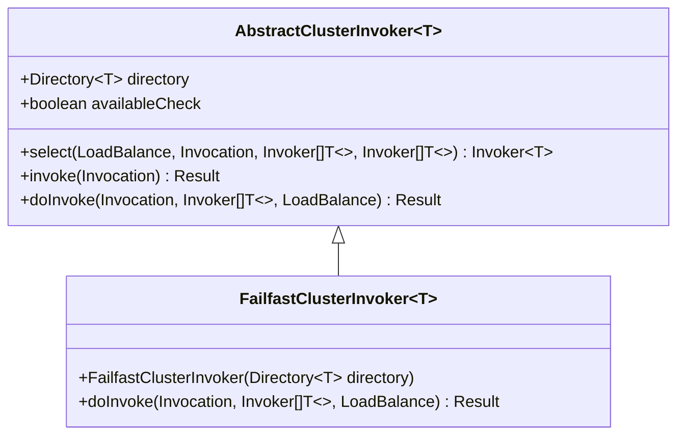
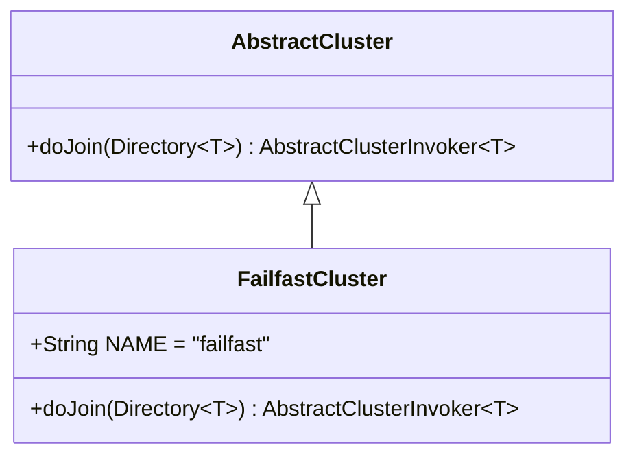
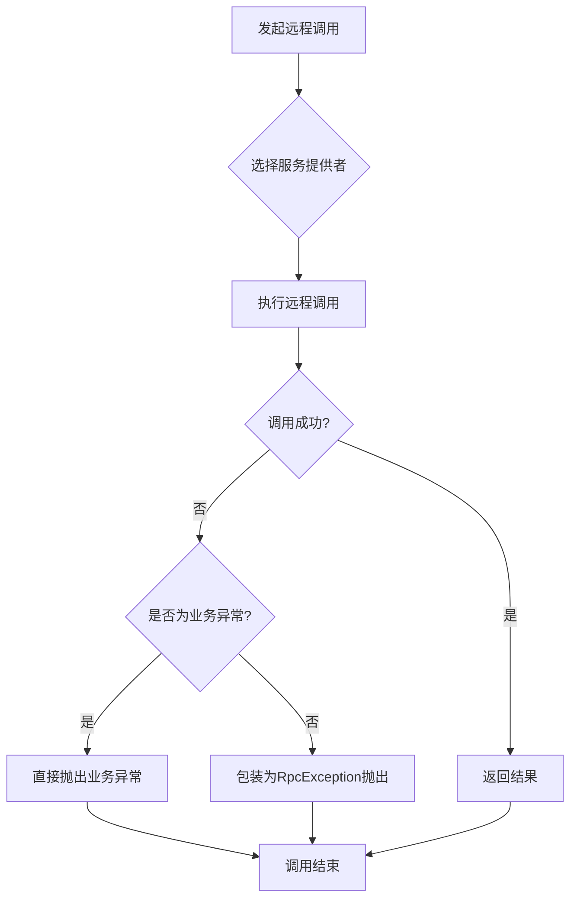
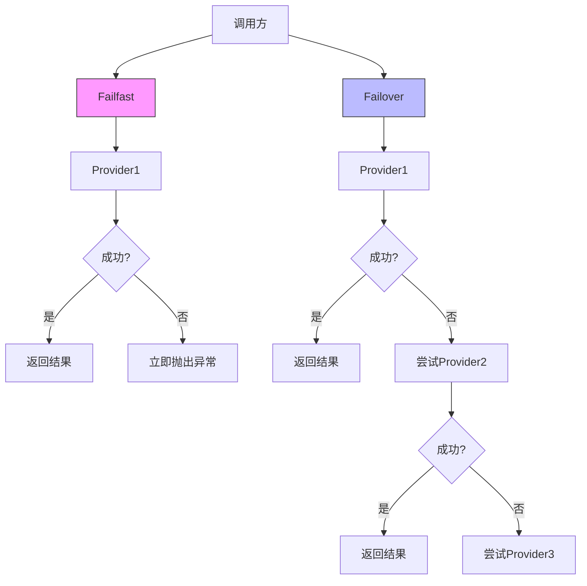
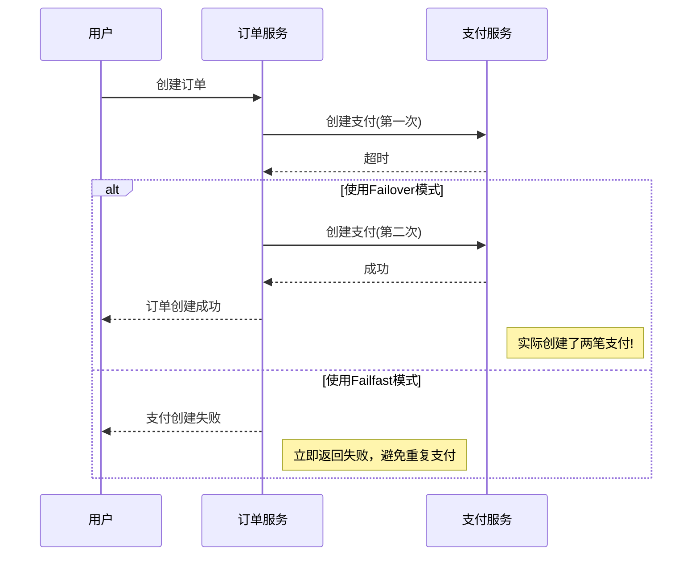
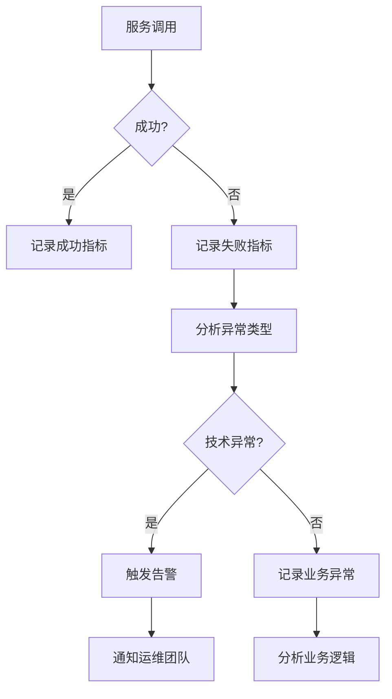

# 快速失败模式

<cite>
**本文档中引用的文件**   
- [FailfastClusterInvoker.java](file://dubbo-cluster\src\main\java\org\apache\dubbo\rpc\cluster\support\FailfastClusterInvoker.java)
- [FailfastCluster.java](file://dubbo-cluster\src\main\java\org\apache\dubbo\rpc\cluster\support\FailfastCluster.java)
- [ClusterRules.java](file://dubbo-common\src\main\java\org\apache\dubbo\common\constants\ClusterRules.java)
- [DubboReference.java](file://dubbo-common\src\main\java\org\apache\dubbo\config\annotation\DubboReference.java)
- [FailfastClusterInvokerTest.java](file://dubbo-cluster\src\test\java\org\apache\dubbo\rpc\cluster\support\FailfastClusterInvokerTest.java)
</cite>

## 目录
1. [简介](#简介)
2. [核心设计与实现](#核心设计与实现)
3. [工作原理分析](#工作原理分析)
4. [配置与使用方法](#配置与使用方法)
5. [与其他容错模式的对比](#与其他容错模式的对比)
6. [适用场景分析](#适用场景分析)
7. [监控与告警建议](#监控与告警建议)
8. [总结](#总结)

## 简介

快速失败模式（Failfast）是一种在分布式系统中常用的容错策略，其核心理念是在调用失败时立即抛出异常，而不是进行重试或忽略错误。这种模式特别适用于非幂等性操作和对实时性要求较高的场景，如订单创建、支付请求等关键业务操作。

在Apache Dubbo框架中，快速失败模式通过`FailfastClusterInvoker`类实现，属于集群容错策略的一种。当服务调用出现异常时，该模式不会尝试调用其他可用的服务提供者，而是立即向调用方抛出异常，使问题能够快速暴露，便于开发人员及时发现和定位故障。

与其他容错模式相比，快速失败模式强调"快速暴露问题"而非"尽力完成调用"，这使得系统在出现问题时能够更快地反馈给上游调用者，避免了因重试机制导致的问题掩盖和延迟发现。

**本节来源**
- [FailfastClusterInvoker.java](file://dubbo-cluster\src\main\java\org\apache\dubbo\rpc\cluster\support\FailfastClusterInvoker.java#L31-L35)

## 核心设计与实现

### FailfastClusterInvoker设计理念

`FailfastClusterInvoker`的设计理念是"一次调用，立即失败"。其核心思想是：对于非幂等性的写操作，如果第一次调用失败，则不应该进行重试，因为重试可能会导致数据不一致或其他不可预知的副作用。

该类继承自`AbstractClusterInvoker<T>`，实现了集群调用器的基本功能。其主要特点是在调用失败时不会进行任何重试操作，而是立即将异常抛出给调用方。



**图示来源**
- [FailfastClusterInvoker.java](file://dubbo-cluster\src\main\java\org\apache\dubbo\rpc\cluster\support\FailfastClusterInvoker.java#L37-L64)

### FailfastCluster实现机制

`FailfastCluster`是快速失败模式的集群实现类，它实现了`AbstractCluster`抽象类。该类的主要作用是创建`FailfastClusterInvoker`实例。



`FailfastCluster`类中定义了常量`NAME = "failfast"`，这个值在配置中用于指定使用快速失败模式。当框架解析到cluster="failfast"时，就会使用`FailfastCluster`来创建相应的调用器。

**图示来源**
- [FailfastCluster.java](file://dubbo-cluster\src\main\java\org\apache\dubbo\rpc\cluster\support\FailfastCluster.java#L27-L34)

## 工作原理分析

### 调用流程分析

快速失败模式的工作流程如下：



**图示来源**
- [FailfastClusterInvoker.java](file://dubbo-cluster\src\main\java\org\apache\dubbo\rpc\cluster\support\FailfastClusterInvoker.java#L43-L63)

### 异常处理机制

`FailfastClusterInvoker`的异常处理机制非常直接：捕获所有异常，并根据异常类型进行处理。

- 如果是业务异常（BizException），则直接抛出原始异常
- 如果是其他类型的异常，则包装成`RpcException`后抛出

这种处理方式确保了异常能够立即传递给调用方，不会因为框架层的处理而被隐藏或延迟。

```java
@Override
public Result doInvoke(Invocation invocation, List<Invoker<T>> invokers, LoadBalance loadbalance)
        throws RpcException {
    Invoker<T> invoker = select(loadbalance, invocation, invokers, null);
    try {
        return invokeWithContext(invoker, invocation);
    } catch (Throwable e) {
        if (e instanceof RpcException && ((RpcException) e).isBiz()) { // 业务异常
            throw (RpcException) e;
        }
        throw new RpcException(
                e instanceof RpcException ? ((RpcException) e).getCode() : 0,
                "Failfast invoke providers " + invoker.getUrl() + " " +
                loadbalance.getClass().getSimpleName() +
                " for service " + getInterface().getName() +
                " method " + RpcUtils.getMethodName(invocation) + " on consumer " +
                NetUtils.getLocalHost() +
                " use dubbo version " + Version.getVersion() +
                ", but no luck to perform the invocation. Last error is: " + e.getMessage(),
                e.getCause() != null ? e.getCause() : e);
    }
}
```

**本节来源**
- [FailfastClusterInvoker.java](file://dubbo-cluster\src\main\java\org\apache\dubbo\rpc\cluster\support\FailfastClusterInvoker.java#L43-L63)

## 配置与使用方法

### 配置方式

在Dubbo中，可以通过多种方式配置使用快速失败模式：

1. **注解方式**：
```java
@DubboReference(cluster = "failfast")
private DemoService demoService;
```

2. **XML配置方式**：
```xml
<dubbo:reference id="demoService" interface="com.example.DemoService" cluster="failfast"/>
```

3. **属性文件方式**：
```properties
dubbo.reference.cluster=failfast
```

### 使用示例

以下是一个使用快速失败模式的完整示例：

```java
@Service
public class OrderService {
    
    @DubboReference(cluster = "failfast", timeout = 3000)
    private PaymentService paymentService;
    
    @DubboReference(cluster = "failfast", timeout = 2000)
    private InventoryService inventoryService;
    
    public OrderResult createOrder(Order order) {
        try {
            // 扣减库存（非幂等操作）
            boolean inventoryDeducted = inventoryService.deduct(order.getItems());
            if (!inventoryDeducted) {
                throw new BusinessException("库存不足");
            }
            
            // 创建支付（非幂等操作）
            PaymentResult paymentResult = paymentService.createPayment(order.getAmount());
            if (!paymentResult.isSuccess()) {
                throw new BusinessException("支付创建失败");
            }
            
            // 创建订单
            return orderRepository.create(order);
            
        } catch (RpcException e) {
            // 快速失败：立即捕获远程调用异常
            log.error("订单创建失败", e);
            throw new OrderCreationException("订单创建失败: " + e.getMessage());
        }
    }
}
```

**本节来源**
- [DubboReference.java](file://dubbo-common\src\main\java\org\apache\dubbo\config\annotation\DubboReference.java#L170-L174)
- [ClusterRules.java](file://dubbo-common\src\main\java\org\apache\dubbo\common\constants\ClusterRules.java#L30-L33)

## 与其他容错模式的对比

### 容错模式对比表

| 容错模式 | 重试机制 | 异常处理 | 适用场景 | Dubbo配置值 |
|---------|--------|--------|--------|----------|
| 快速失败(failfast) | 无重试，立即失败 | 立即抛出异常 | 非幂等性操作，实时性要求高 | failfast |
| 失败重试(failover) | 可配置重试次数 | 重试其他节点 | 幂等性操作，读操作 | failover |
| 失败安全(failsafe) | 无重试 | 记录日志并返回空结果 | 写入审计日志等 | failsafe |
| 失败自动恢复(failback) | 定时重试 | 记录失败请求，后台重试 | 消息通知类操作 | failback |
| 并行调用(forking) | 并行调用多个节点 | 只要一个成功即返回 | 实时性要求极高 | forking |

**本节来源**
- [ClusterRules.java](file://dubbo-common\src\main\java\org\apache\dubbo\common\constants\ClusterRules.java#L28-L48)

### 对比分析

与其他容错模式相比，快速失败模式具有以下特点：

1. **无重试机制**：与其他模式最大的区别是完全没有重试逻辑，一旦失败立即抛出异常。
2. **快速反馈**：能够在最短时间内将故障信息反馈给调用方，避免了因重试导致的延迟。
3. **简单直接**：实现逻辑简单，没有复杂的重试调度和状态管理。
4. **风险明确**：调用方必须处理可能的失败情况，不能依赖框架的重试机制。



**图示来源**
- [FailfastClusterInvoker.java](file://dubbo-cluster\src\main\java\org\apache\dubbo\rpc\cluster\support\FailfastClusterInvoker.java#L43-L63)
- [FailoverClusterInvoker.java](file://dubbo-cluster\src\main\java\org\apache\dubbo\rpc\cluster\support\FailoverClusterInvoker.java)

## 适用场景分析

### 非幂等性操作场景

快速失败模式特别适用于非幂等性操作，因为这些操作的重复执行可能会导致数据不一致或业务逻辑错误。

**典型场景包括**：
- 订单创建
- 支付请求
- 库存扣减
- 账户转账
- 优惠券领取

在这些场景中，如果第一次调用失败，重试可能会导致：
- 重复创建订单
- 重复扣款
- 库存超卖
- 账户余额错误
- 优惠券重复领取



**图示来源**
- [FailfastClusterInvokerTest.java](file://dubbo-cluster\src\test\java\org\apache\dubbo\rpc\cluster\support\FailfastClusterInvokerTest.java#L83-L88)

### 实时性要求高的场景

对于实时性要求高的场景，快速失败模式能够提供最快的故障反馈速度。

**典型场景包括**：
- 实时交易系统
- 在线支付网关
- 股票交易系统
- 游戏服务器
- 实时通信系统

在这些场景中，系统的响应时间至关重要，任何延迟都可能导致用户体验下降或业务损失。快速失败模式能够在检测到故障的第一时间就返回错误，而不是花费时间进行重试。

## 监控与告警建议

### 服务可用性监控

使用快速失败模式时，必须建立完善的服务可用性监控体系：

1. **调用成功率监控**：实时监控服务调用的成功率，设置合理的告警阈值。
2. **异常类型分析**：区分业务异常和技术异常，针对性地进行处理。
3. **调用链追踪**：通过分布式追踪系统定位故障点。
4. **服务健康检查**：定期检查服务提供者的健康状态。



### 告警机制

建议设置多级告警机制：

1. **一级告警**：当调用失败率超过5%时，发送邮件告警
2. **二级告警**：当调用失败率超过20%时，发送短信告警
3. **三级告警**：当调用失败率超过50%时，电话告警

同时，建议结合以下指标进行综合判断：
- 服务提供者数量
- 网络延迟
- 系统负载
- 错误日志

**本节来源**
- [FailfastClusterInvoker.java](file://dubbo-cluster\src\main\java\org\apache\dubbo\rpc\cluster\support\FailfastClusterInvoker.java#L53-L62)

## 总结

快速失败模式是一种简单而有效的容错策略，其核心价值在于"快速暴露问题"而非"尽力完成调用"。通过立即抛出异常的方式，使系统故障能够在第一时间被发现和处理，避免了因重试机制导致的问题掩盖和延迟。

该模式特别适用于非幂等性操作和对实时性要求高的场景，如订单创建、支付请求等关键业务。在这些场景中，快速失败模式能够有效防止因重试导致的数据不一致问题。

然而，使用快速失败模式也带来了更高的可靠性要求，需要配合完善的监控和告警体系，确保在服务出现故障时能够及时发现和处理。同时，调用方需要具备处理失败情况的能力，不能依赖框架的重试机制。

总的来说，快速失败模式是一种"宁可失败，不可错乱"的设计哲学体现，它牺牲了一定的可用性来保证数据的一致性和系统的可预测性，是构建高可靠分布式系统的重要工具之一。