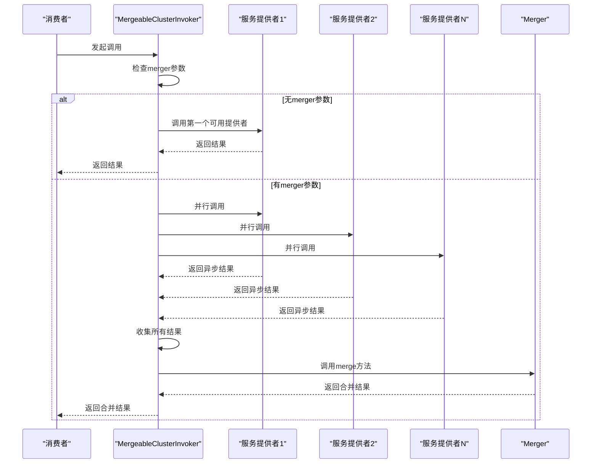
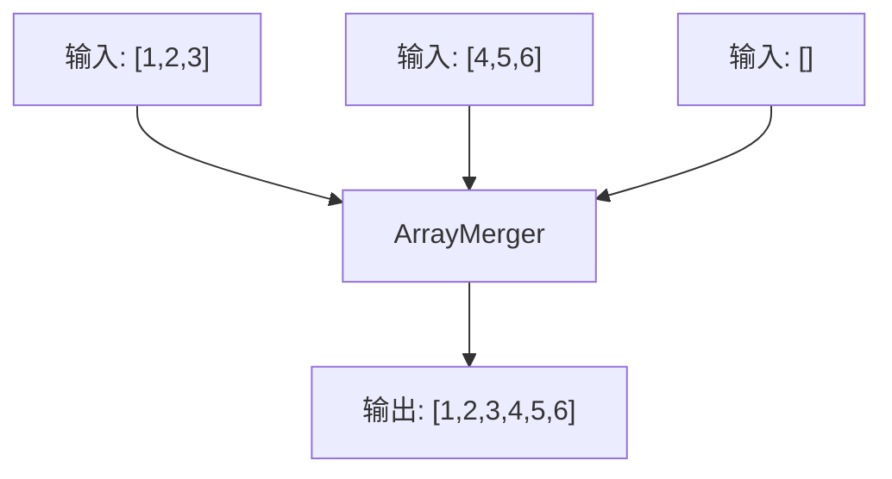
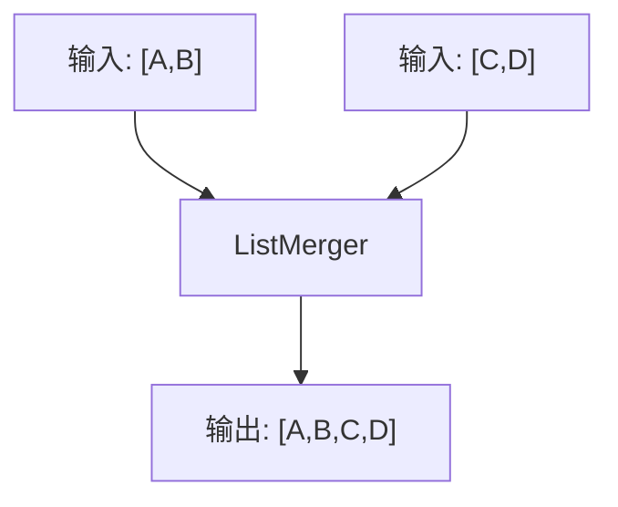
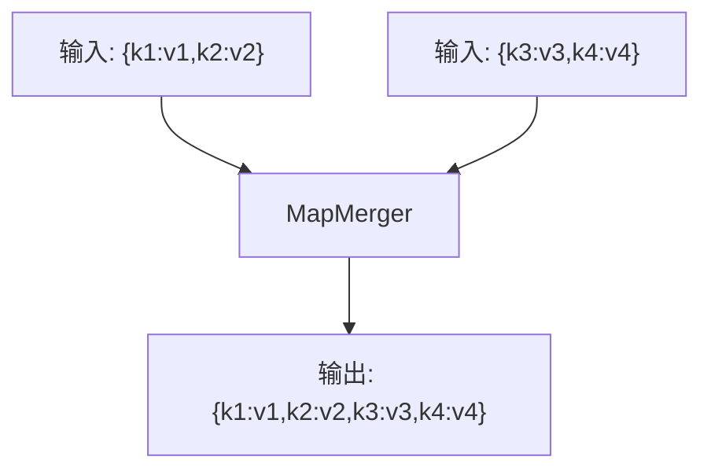
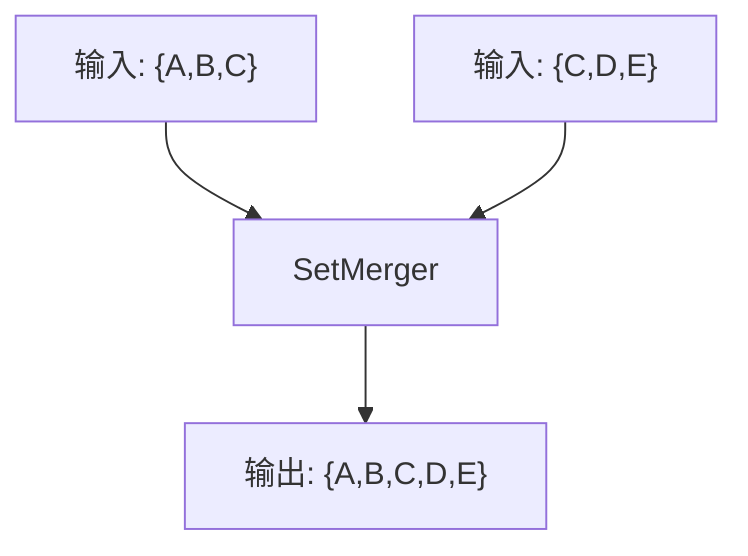
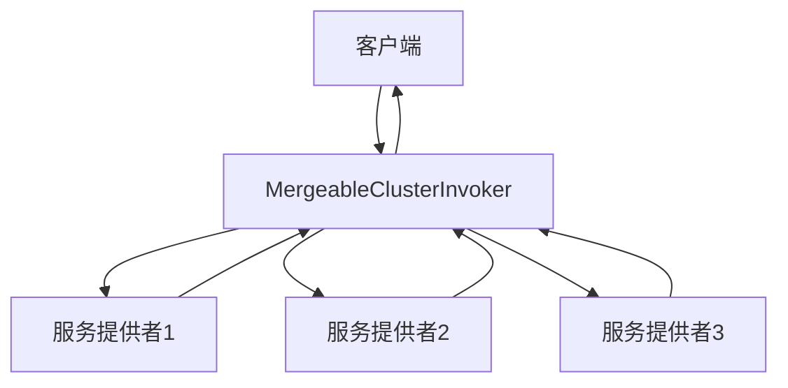

# 结果合并

<cite>
**本文档中引用的文件**  
- [Merger.java](file://dubbo-cluster/src/main/java/org/apache/dubbo/rpc/cluster/Merger.java)
- [MergeableCluster.java](file://dubbo-cluster/src/main/java/org/apache/dubbo/rpc/cluster/support/MergeableCluster.java)
- [MergeableClusterInvoker.java](file://dubbo-cluster/src/main/java/org/apache/dubbo/rpc/cluster/support/MergeableClusterInvoker.java)
- [MergerFactory.java](file://dubbo-cluster/src/main/java/org/apache/dubbo/rpc/cluster/merger/MergerFactory.java)
- [ArrayMerger.java](file://dubbo-cluster/src/main/java/org/apache/dubbo/rpc/cluster/merger/ArrayMerger.java)
- [ListMerger.java](file://dubbo-cluster/src/main/java/org/apache/dubbo/rpc/cluster/merger/ListMerger.java)
- [MapMerger.java](file://dubbo-cluster/src/main/java/org/apache/dubbo/rpc/cluster/merger/MapMerger.java)
- [org.apache.dubbo.rpc.cluster.Merger](file://dubbo-cluster/src/main/resources/META-INF/dubbo/internal/org.apache.dubbo.rpc.cluster.Merger)
- [Constants.java](file://dubbo-rpc/dubbo-rpc-api/src/main/java/org/apache/dubbo/rpc/Constants.java)
- [ResultMergerTest.java](file://dubbo-cluster/src/test/java/org/apache/dubbo/rpc/cluster/merger/ResultMergerTest.java)
- [IntSumMerger.java](file://dubbo-cluster/src/test/java/org/apache/dubbo/rpc/cluster/merger/IntSumMerger.java)
</cite>

## 目录
1. [引言](#引言)
2. [Merger接口详解](#merger接口详解)
3. [结果合并工作流程](#结果合并工作流程)
4. [内置合并器](#内置合并器)
5. [配置与使用](#配置与使用)
6. [自定义合并逻辑](#自定义合并逻辑)
7. [应用场景](#应用场景)
8. [性能优化建议](#性能优化建议)
9. [常见问题解决方案](#常见问题解决方案)
10. [结论](#结论)

## 引言

Dubbo框架中的结果合并功能是集群调用的重要组成部分，它允许将多个服务提供者的调用结果合并为单一结果。这一功能在并行调用、数据聚合等场景下具有重要应用价值。通过Merger接口和MergeableCluster实现，Dubbo提供了灵活的结果合并机制，支持内置合并器和自定义合并逻辑，满足不同业务场景的需求。

**Section sources**
- [Merger.java](file://dubbo-cluster/src/main/java/org/apache/dubbo/rpc/cluster/Merger.java)
- [MergeableCluster.java](file://dubbo-cluster/src/main/java/org/apache/dubbo/rpc/cluster/support/MergeableCluster.java)

## Merger接口详解

Merger接口是Dubbo结果合并功能的核心，定义了合并多个结果的基本契约。该接口通过SPI（Service Provider Interface）机制实现扩展，允许用户根据需要提供自定义的合并逻辑。

Merger接口定义如下：
```java
@SPI
public interface Merger<T> {
    T merge(T... items);
}
```

接口特点：
- 使用@SPI注解标记，表明这是一个可扩展的接口
- 泛型T表示合并结果的类型
- merge方法接收可变参数，将多个同类型的结果合并为单个结果

Merger接口的设计遵循了Dubbo的扩展性原则，通过SPI机制实现了合并策略的可插拔。用户可以通过实现Merger接口并注册到SPI配置文件中，来添加自定义的合并器。

**Section sources**
- [Merger.java](file://dubbo-cluster/src/main/java/org/apache/dubbo/rpc/cluster/Merger.java)

## 结果合并工作流程

结果合并的工作流程主要由MergeableClusterInvoker实现，其核心逻辑包括：方法参数检查、并行调用、结果收集和合并处理。



**Diagram sources**
- [MergeableClusterInvoker.java](file://dubbo-cluster/src/main/java/org/apache/dubbo/rpc/cluster/support/MergeableClusterInvoker.java)

**Section sources**
- [MergeableClusterInvoker.java](file://dubbo-cluster/src/main/java/org/apache/dubbo/rpc/cluster/support/MergeableClusterInvoker.java)

## 内置合并器

Dubbo提供了多种内置合并器，覆盖了常见的数据类型和合并需求。这些合并器通过SPI配置文件注册，可以在不编写代码的情况下直接使用。

### 数组合并器

数组合并器将多个数组合并为一个数组，保持元素的原始顺序。支持基本类型数组和对象数组。



**Diagram sources**
- [ArrayMerger.java](file://dubbo-cluster/src/main/java/org/apache/dubbo/rpc/cluster/merger/ArrayMerger.java)

### 集合合并器

集合合并器支持List、Set和Map等集合类型的合并。

#### ListMerger
将多个List合并为一个List，保持元素的添加顺序。



**Diagram sources**
- [ListMerger.java](file://dubbo-cluster/src/main/java/org/apache/dubbo/rpc/cluster/merger/ListMerger.java)

#### MapMerger
将多个Map合并为一个Map，使用putAll方法进行合并。



**Diagram sources**
- [MapMerger.java](file://dubbo-cluster/src/main/java/org/apache/dubbo/rpc/cluster/merger/MapMerger.java)

#### SetMerger
将多个Set合并为一个Set，自动去重。



**Section sources**
- [ListMerger.java](file://dubbo-cluster/src/main/java/org/apache/dubbo/rpc/cluster/merger/ListMerger.java)
- [MapMerger.java](file://dubbo-cluster/src/main/java/org/apache/dubbo/rpc/cluster/merger/MapMerger.java)
- [SetMerger.java](file://dubbo-cluster/src/main/java/org/apache/dubbo/rpc/cluster/merger/SetMerger.java)

## 配置与使用

结果合并功能通过merger参数进行配置，可以在服务级别或方法级别指定合并策略。

### SPI配置

内置合并器通过SPI配置文件注册：

```
map=org.apache.dubbo.rpc.cluster.merger.MapMerger
set=org.apache.dubbo.rpc.cluster.merger.SetMerger
list=org.apache.dubbo.rpc.cluster.merger.ListMerger
byte=org.apache.dubbo.rpc.cluster.merger.ByteArrayMerger
char=org.apache.dubbo.rpc.cluster.merger.CharArrayMerger
short=org.apache.dubbo.rpc.cluster.merger.ShortArrayMerger
int=org.apache.dubbo.rpc.cluster.merger.IntArrayMerger
long=org.apache.dubbo.rpc.cluster.merger.LongArrayMerger
float=org.apache.dubbo.rpc.cluster.merger.FloatArrayMerger
double=org.apache.dubbo.rpc.cluster.merger.DoubleArrayMerger
boolean=org.apache.dubbo.rpc.cluster.merger.BooleanArrayMerger
```

**Section sources**
- [org.apache.dubbo.rpc.cluster.Merger](file://dubbo-cluster/src/main/resources/META-INF/dubbo/internal/org.apache.dubbo.rpc.cluster.Merger)

### 配置方式

#### XML配置
```xml
<dubbo:reference id="demoService" interface="com.example.DemoService" cluster="mergeable">
    <dubbo:method name="getData" merger="list"/>
</dubbo:reference>
```

#### 注解配置
```java
@DubboReference(cluster = "mergeable", methods = {
    @Method(name = "getData", merger = "list")
})
private DemoService demoService;
```

#### API配置
```java
ReferenceConfig<DemoService> reference = new ReferenceConfig<>();
reference.setCluster("mergeable");
reference.setInterface(DemoService.class);
MethodConfig method = new MethodConfig();
method.setName("getData");
method.setMerger("list");
reference.setMethods(Arrays.asList(method));
```

**Section sources**
- [Constants.java](file://dubbo-rpc/dubbo-rpc-api/src/main/java/org/apache/dubbo/rpc/Constants.java)

## 自定义合并逻辑

除了使用内置合并器，Dubbo还支持自定义合并逻辑，满足特定业务需求。

### 实现自定义Merger

```java
public class IntSumMerger implements Merger<Integer> {
    @Override
    public Integer merge(Integer... items) {
        return Arrays.stream(items)
                .filter(Objects::nonNull)
                .mapToInt(Integer::intValue)
                .sum();
    }
}
```

### 注册自定义Merger

将自定义Merger添加到SPI配置文件：

```
intsum=com.example.IntSumMerger
```

### 使用自定义Merger

```xml
<dubbo:reference id="demoService" interface="com.example.DemoService" cluster="mergeable">
    <dubbo:method name="getSum" merger="intsum"/>
</dubbo:reference>
```

**Section sources**
- [IntSumMerger.java](file://dubbo-cluster/src/test/java/org/apache/dubbo/rpc/cluster/merger/IntSumMerger.java)

## 应用场景

结果合并功能在多种业务场景下具有重要应用价值。

### 并行调用

当多个服务提供者提供相同功能时，可以通过并行调用提高响应速度，并将结果合并返回。



**Diagram sources**
- [MergeableClusterInvoker.java](file://dubbo-cluster/src/main/java/org/apache/dubbo/rpc/cluster/support/MergeableClusterInvoker.java)

### 数据聚合

在微服务架构中，不同服务可能提供部分数据，通过结果合并可以将分散的数据聚合为完整结果。

### 缓存合并

当使用多级缓存时，可以将不同缓存层的结果合并，提高缓存命中率。

**Section sources**
- [ResultMergerTest.java](file://dubbo-cluster/src/test/java/org/apache/dubbo/rpc/cluster/merger/ResultMergerTest.java)

## 性能优化建议

### 合理选择合并策略

根据业务需求选择合适的合并器，避免不必要的合并操作。

### 控制并行度

通过forks参数控制并行调用的并发数，避免对服务提供者造成过大压力。

### 异步处理

对于耗时较长的合并操作，考虑使用异步处理，避免阻塞主线程。

### 缓存合并结果

对于不经常变化的合并结果，可以考虑缓存，减少重复计算。

## 常见问题解决方案

### 合并器未找到

问题：指定的合并器无法找到
解决方案：检查SPI配置文件，确保合并器已正确注册

### 类型不匹配

问题：合并的数组类型不一致
解决方案：确保所有提供者返回相同类型的数组

### 性能瓶颈

问题：合并操作成为性能瓶颈
解决方案：优化合并逻辑，考虑异步合并或结果缓存

### 空指针异常

问题：合并过程中出现空指针异常
解决方案：在合并器中添加空值检查

## 结论

Dubbo的结果合并功能通过Merger接口和MergeableCluster实现，提供了灵活强大的结果合并机制。通过内置合并器和自定义合并逻辑，可以满足各种业务场景的需求。合理使用结果合并功能，可以提高系统性能，简化业务逻辑，是Dubbo集群调用的重要特性之一。