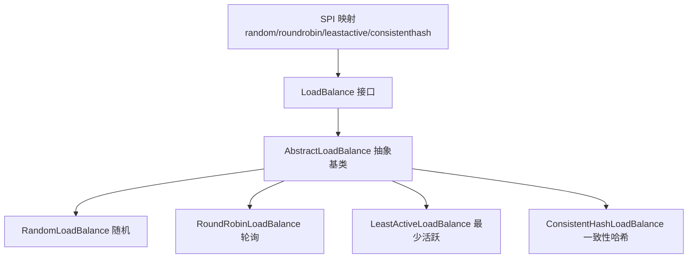
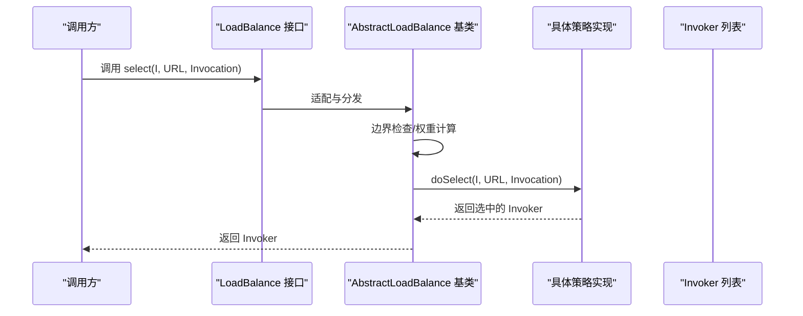
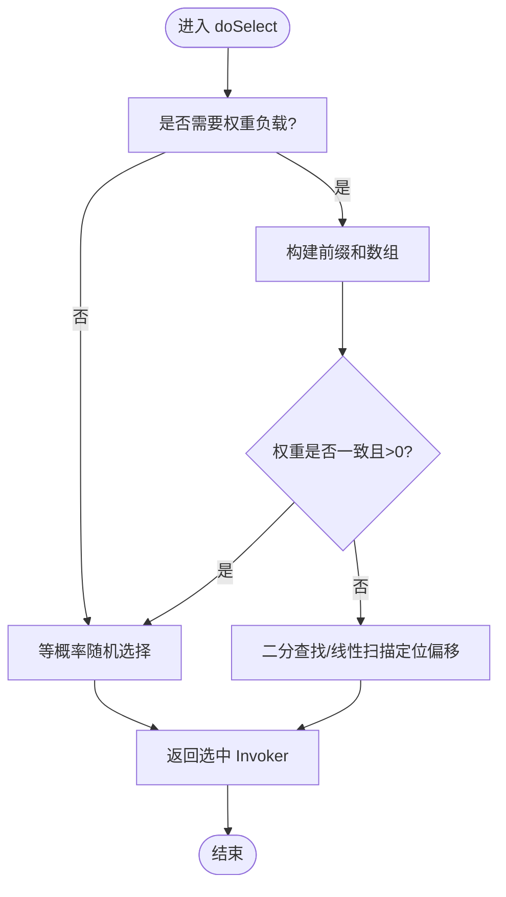
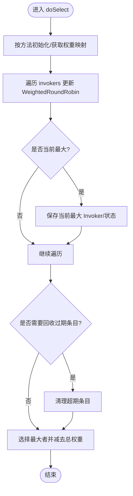
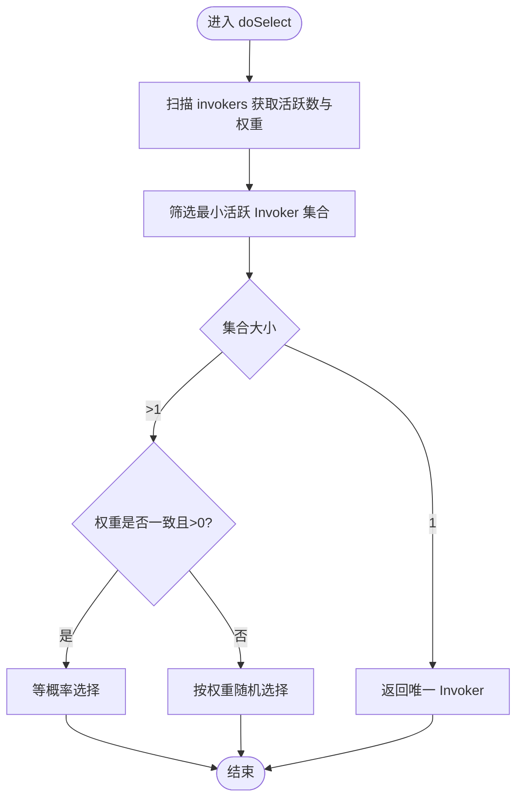
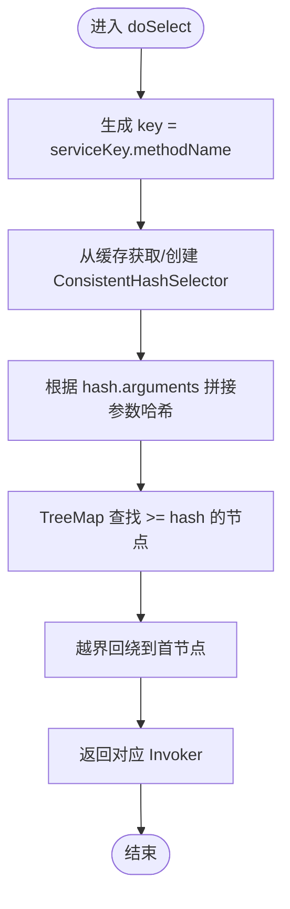
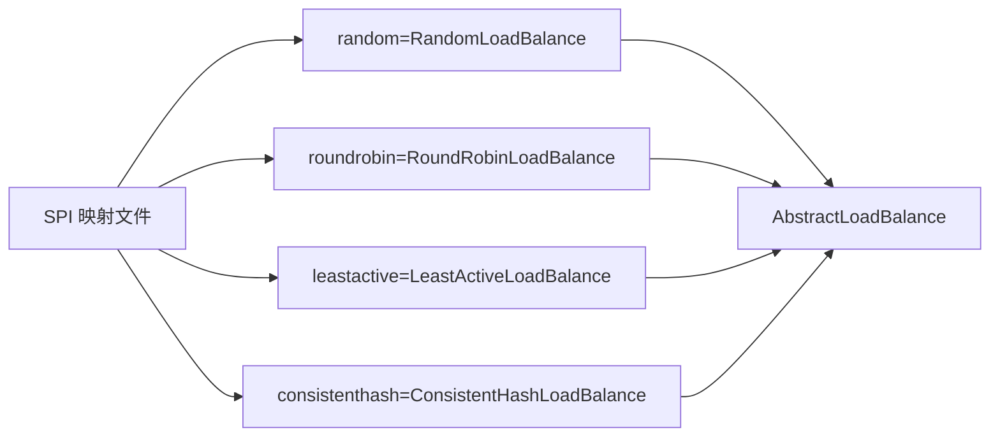

# 负载均衡

<cite>
**本文引用的文件列表**
- [LoadBalance.java](file://dubbo-cluster/src/main/java/org/apache/dubbo/rpc/cluster/LoadBalance.java)
- [AbstractLoadBalance.java](file://dubbo-cluster/src/main/java/org/apache/dubbo/rpc/cluster/loadbalance/AbstractLoadBalance.java)
- [RandomLoadBalance.java](file://dubbo-cluster/src/main/java/org/apache/dubbo/rpc/cluster/loadbalance/RandomLoadBalance.java)
- [RoundRobinLoadBalance.java](file://dubbo-cluster/src/main/java/org/apache/dubbo/rpc/cluster/loadbalance/RoundRobinLoadBalance.java)
- [LeastActiveLoadBalance.java](file://dubbo-cluster/src/main/java/org/apache/dubbo/rpc/cluster/loadbalance/LeastActiveLoadBalance.java)
- [ConsistentHashLoadBalance.java](file://dubbo-cluster/src/main/java/org/apache/dubbo/rpc/cluster/loadbalance/ConsistentHashLoadBalance.java)
- [org.apache.dubbo.rpc.cluster.LoadBalance](file://dubbo-cluster/src/main/resources/META-INF/dubbo/internal/org.apache.dubbo.rpc.cluster.LoadBalance)
- [LoadBalanceBaseTest.java](file://dubbo-cluster/src/test/java/org/apache/dubbo/rpc/cluster/loadbalance/LoadBalanceBaseTest.java)
- [RandomLoadBalanceTest.java](file://dubbo-cluster/src/test/java/org/apache/dubbo/rpc/cluster/loadbalance/RandomLoadBalanceTest.java)
- [LeastActiveBalanceTest.java](file://dubbo-cluster/src/test/java/org/apache/dubbo/rpc/cluster/loadbalance/LeastActiveBalanceTest.java)
- [AppMultiServices.yml](file://dubbo-cluster/src/test/resources/AppMultiServices.yml)
</cite>

## 目录
1. [简介](#简介)
2. [项目结构与定位](#项目结构与定位)
3. [核心组件](#核心组件)
4. [架构总览](#架构总览)
5. [详细组件分析](#详细组件分析)
6. [依赖关系分析](#依赖关系分析)
7. [性能与特性](#性能与特性)
8. [配置与使用示例](#配置与使用示例)
9. [故障排查](#故障排查)
10. [结论](#结论)

## 简介
本文件系统性梳理 dubbo-cluster 模块中的负载均衡子功能，围绕 LoadBalance 接口设计、扩展机制与 SPI 注册、以及随机、轮询、最少活跃调用、一致性哈希等策略的实现细节与算法逻辑展开。文档同时提供配置与使用示例、适用场景与性能特点说明、以及在高并发场景下的优化建议与故障排查要点。

## 项目结构与定位
- LoadBalance 接口位于集群层，作为 SPI 扩展点，面向 Invoker 列表进行选择，返回一个具体的 Invoker 以执行远程调用。
- 具体策略实现均继承抽象基类 AbstractLoadBalance，统一处理权重与预热（warmup）逻辑，并在 doSelect 中实现各自选择算法。
- SPI 配置文件集中注册了默认可用的负载均衡实现名称与全限定类名映射。

图表来源
- [LoadBalance.java](file://dubbo-cluster/src/main/java/org/apache/dubbo/rpc/cluster/LoadBalance.java#L1-L50)
- [AbstractLoadBalance.java](file://dubbo-cluster/src/main/java/org/apache/dubbo/rpc/cluster/loadbalance/AbstractLoadBalance.java#L1-L101)
- [RandomLoadBalance.java](file://dubbo-cluster/src/main/java/org/apache/dubbo/rpc/cluster/loadbalance/RandomLoadBalance.java#L1-L130)
- [RoundRobinLoadBalance.java](file://dubbo-cluster/src/main/java/org/apache/dubbo/rpc/cluster/loadbalance/RoundRobinLoadBalance.java#L1-L135)
- [LeastActiveLoadBalance.java](file://dubbo-cluster/src/main/java/org/apache/dubbo/rpc/cluster/loadbalance/LeastActiveLoadBalance.java#L1-L118)
- [ConsistentHashLoadBalance.java](file://dubbo-cluster/src/main/java/org/apache/dubbo/rpc/cluster/loadbalance/ConsistentHashLoadBalance.java#L1-L136)
- [org.apache.dubbo.rpc.cluster.LoadBalance](file://dubbo-cluster/src/main/resources/META-INF/dubbo/internal/org.apache.dubbo.rpc.cluster.LoadBalance#L1-L7)

章节来源
- [LoadBalance.java](file://dubbo-cluster/src/main/java/org/apache/dubbo/rpc/cluster/LoadBalance.java#L1-L50)
- [org.apache.dubbo.rpc.cluster.LoadBalance](file://dubbo-cluster/src/main/resources/META-INF/dubbo/internal/org.apache.dubbo.rpc.cluster.LoadBalance#L1-L7)

## 核心组件
- LoadBalance 接口：定义 select(List<Invoker>, URL, Invocation) 方法，@SPI 默认值为随机策略；@Adaptive("loadbalance") 表示可通过 URL 参数动态切换策略。
- AbstractLoadBalance 抽象基类：
  - 统一处理空集合、单个 Invoker 的边界情况。
  - 提供 getWeight(...) 计算权重，考虑预热时间与权重参数。
  - 提供 calculateWarmupWeight(...) 预热权重计算。
  - 将具体选择逻辑下沉到 doSelect(...)，由各策略实现。
- 各策略实现：
  - 随机：支持按权重随机选择，或等概率选择。
  - 轮询：基于加权轮询，维护每个方法的权重状态，周期回收过期条目。
  - 最少活跃：优先选择活跃数最少的 Invoker，若权重不同则按权重随机，否则等概率。
  - 一致性哈希：对方法级参数进行哈希，保证相同参数落到同一节点，支持虚拟节点与方法级参数选择。

章节来源
- [LoadBalance.java](file://dubbo-cluster/src/main/java/org/apache/dubbo/rpc/cluster/LoadBalance.java#L1-L50)
- [AbstractLoadBalance.java](file://dubbo-cluster/src/main/java/org/apache/dubbo/rpc/cluster/loadbalance/AbstractLoadBalance.java#L1-L101)
- [RandomLoadBalance.java](file://dubbo-cluster/src/main/java/org/apache/dubbo/rpc/cluster/loadbalance/RandomLoadBalance.java#L1-L130)
- [RoundRobinLoadBalance.java](file://dubbo-cluster/src/main/java/org/apache/dubbo/rpc/cluster/loadbalance/RoundRobinLoadBalance.java#L1-L135)
- [LeastActiveLoadBalance.java](file://dubbo-cluster/src/main/java/org/apache/dubbo/rpc/cluster/loadbalance/LeastActiveLoadBalance.java#L1-L118)
- [ConsistentHashLoadBalance.java](file://dubbo-cluster/src/main/java/org/apache/dubbo/rpc/cluster/loadbalance/ConsistentHashLoadBalance.java#L1-L136)

## 架构总览
下图展示了从调用方到具体负载均衡策略的调用链路与关键依赖：

图表来源
- [LoadBalance.java](file://dubbo-cluster/src/main/java/org/apache/dubbo/rpc/cluster/LoadBalance.java#L1-L50)
- [AbstractLoadBalance.java](file://dubbo-cluster/src/main/java/org/apache/dubbo/rpc/cluster/loadbalance/AbstractLoadBalance.java#L1-L101)
- [RandomLoadBalance.java](file://dubbo-cluster/src/main/java/org/apache/dubbo/rpc/cluster/loadbalance/RandomLoadBalance.java#L1-L130)
- [RoundRobinLoadBalance.java](file://dubbo-cluster/src/main/java/org/apache/dubbo/rpc/cluster/loadbalance/RoundRobinLoadBalance.java#L1-L135)
- [LeastActiveLoadBalance.java](file://dubbo-cluster/src/main/java/org/apache/dubbo/rpc/cluster/loadbalance/LeastActiveLoadBalance.java#L1-L118)
- [ConsistentHashLoadBalance.java](file://dubbo-cluster/src/main/java/org/apache/dubbo/rpc/cluster/loadbalance/ConsistentHashLoadBalance.java#L1-L136)

## 详细组件分析

### 随机负载均衡（RandomLoadBalance）
- 设计要点
  - 当不需要权重负载时，直接等概率随机选择。
  - 当存在权重差异时，采用前缀和偏移的方式进行加权随机选择；当 invokers 数量较多时使用二分查找加速。
  - 支持多注册中心场景下的权重判断逻辑。
- 关键流程
  - needWeightLoadBalance(...) 判断是否需要按权重选择。
  - doSelect(...) 实现加权随机选择。
- 复杂度
  - 时间复杂度：O(n) 或 O(log n)，取决于是否使用二分搜索。
  - 空间复杂度：O(n) 存储前缀和数组。
- 适用场景
  - 通用场景，简单高效；当各节点性能相近时尤为合适。
- 性能特点
  - 低开销；在大量 invokers 时二分查找提升性能。

图表来源
- [RandomLoadBalance.java](file://dubbo-cluster/src/main/java/org/apache/dubbo/rpc/cluster/loadbalance/RandomLoadBalance.java#L1-L130)

章节来源
- [RandomLoadBalance.java](file://dubbo-cluster/src/main/java/org/apache/dubbo/rpc/cluster/loadbalance/RandomLoadBalance.java#L1-L130)
- [RandomLoadBalanceTest.java](file://dubbo-cluster/src/test/java/org/apache/dubbo/rpc/cluster/loadbalance/RandomLoadBalanceTest.java#L1-L120)

### 轮询负载均衡（RoundRobinLoadBalance）
- 设计要点
  - 基于加权轮询，为每个方法维护一个权重状态对象，记录当前累计值与最后更新时间。
  - 每次选择时取当前累计值最大的 Invoker，并将其累计值减去总权重，实现“加权轮询”。
  - 定期回收长时间未更新的条目，避免内存膨胀。
- 关键流程
  - doSelect(...) 遍历 invokers，更新 WeightedRoundRobin 状态，选择最大者。
  - 回收超期条目，确保内存占用可控。
- 复杂度
  - 时间复杂度：O(n)。
  - 空间复杂度：O(n)（按方法维度缓存）。
- 适用场景
  - 需要稳定分配且对权重敏感的场景；适合长期运行的服务池。
- 性能特点
  - 低开销；适合高并发但 invokers 数量适中的场景。

图表来源
- [RoundRobinLoadBalance.java](file://dubbo-cluster/src/main/java/org/apache/dubbo/rpc/cluster/loadbalance/RoundRobinLoadBalance.java#L1-L135)

章节来源
- [RoundRobinLoadBalance.java](file://dubbo-cluster/src/main/java/org/apache/dubbo/rpc/cluster/loadbalance/RoundRobinLoadBalance.java#L1-L135)

### 最少活跃调用（LeastActiveLoadBalance）
- 设计要点
  - 优先选择活跃请求数最少的 Invoker；若多个 Invoker 活跃数相同，则按权重或等概率选择。
  - 使用 RpcStatus 获取活跃数，结合权重与预热权重参与选择。
- 关键流程
  - 遍历 invokers，统计最小活跃数与对应索引集合。
  - 若仅一个最小活跃 Invoker，直接返回；否则按权重或等概率选择。
- 复杂度
  - 时间复杂度：O(n)。
  - 空间复杂度：O(n)（存储索引与权重数组）。
- 适用场景
  - 服务端性能差异较大，希望将请求优先分配给更空闲的节点。
- 性能特点
  - 对活跃度敏感，有助于削峰填谷；适合异构节点环境。

图表来源
- [LeastActiveLoadBalance.java](file://dubbo-cluster/src/main/java/org/apache/dubbo/rpc/cluster/loadbalance/LeastActiveLoadBalance.java#L1-L118)

章节来源
- [LeastActiveLoadBalance.java](file://dubbo-cluster/src/main/java/org/apache/dubbo/rpc/cluster/loadbalance/LeastActiveLoadBalance.java#L1-L118)
- [LeastActiveBalanceTest.java](file://dubbo-cluster/src/test/java/org/apache/dubbo/rpc/cluster/loadbalance/LeastActiveBalanceTest.java#L1-L120)

### 一致性哈希（ConsistentHashLoadBalance）
- 设计要点
  - 对方法级参数进行哈希，保证相同参数总是落到同一节点，提升缓存命中与会话粘性。
  - 支持虚拟节点（replicaNumber），减少分布不均问题。
  - 可配置哈希参数索引（hash.arguments）与节点数量（hash.nodes）。
- 关键流程
  - doSelect(...) 依据服务键与方法名生成 selector 缓存键，复用已存在的 selector。
  - ConsistentHashSelector 内部使用 TreeMap 维护虚拟节点环，按哈希值查找第一个大于等于目标值的节点。
- 复杂度
  - 选择复杂度：O(log N)（TreeMap ceilingEntry）。
  - 初始化复杂度：O(M·R)（M 为 invokers 数，R 为虚拟节点数/4）。
- 适用场景
  - 需要会话粘性、缓存友好的场景；如用户态、订单号等参数驱动的路由。
- 性能特点
  - 一致性好，但初始化成本较高；适合 invokers 相对稳定的场景。

图表来源
- [ConsistentHashLoadBalance.java](file://dubbo-cluster/src/main/java/org/apache/dubbo/rpc/cluster/loadbalance/ConsistentHashLoadBalance.java#L1-L136)

章节来源
- [ConsistentHashLoadBalance.java](file://dubbo-cluster/src/main/java/org/apache/dubbo/rpc/cluster/loadbalance/ConsistentHashLoadBalance.java#L1-L136)

### 权重与预热（AbstractLoadBalance）
- 权重来源
  - 方法级参数 weight；若无则回退到默认权重。
  - 多注册中心场景下，权重来自注册中心 URL。
- 预热权重
  - 根据启动时长与预热时间计算权重比例，避免新节点刚上线即承担全部流量。
- 关键方法
  - getWeight(...) 统一入口。
  - calculateWarmupWeight(...) 预热权重计算。

章节来源
- [AbstractLoadBalance.java](file://dubbo-cluster/src/main/java/org/apache/dubbo/rpc/cluster/loadbalance/AbstractLoadBalance.java#L1-L101)
- [LoadBalanceBaseTest.java](file://dubbo-cluster/src/test/java/org/apache/dubbo/rpc/cluster/loadbalance/LoadBalanceBaseTest.java#L1-L320)

## 依赖关系分析
- SPI 注册
  - SPI 文件将策略名称映射到具体实现类，便于运行时按名称加载。
- 继承关系
  - 所有策略均继承 AbstractLoadBalance，共享权重与预热逻辑。
- 测试覆盖
  - 单测验证权重分配、预热权重、活跃度选择等行为。

图表来源
- [org.apache.dubbo.rpc.cluster.LoadBalance](file://dubbo-cluster/src/main/resources/META-INF/dubbo/internal/org.apache.dubbo.rpc.cluster.LoadBalance#L1-L7)
- [AbstractLoadBalance.java](file://dubbo-cluster/src/main/java/org/apache/dubbo/rpc/cluster/loadbalance/AbstractLoadBalance.java#L1-L101)
- [RandomLoadBalance.java](file://dubbo-cluster/src/main/java/org/apache/dubbo/rpc/cluster/loadbalance/RandomLoadBalance.java#L1-L130)
- [RoundRobinLoadBalance.java](file://dubbo-cluster/src/main/java/org/apache/dubbo/rpc/cluster/loadbalance/RoundRobinLoadBalance.java#L1-L135)
- [LeastActiveLoadBalance.java](file://dubbo-cluster/src/main/java/org/apache/dubbo/rpc/cluster/loadbalance/LeastActiveLoadBalance.java#L1-L118)
- [ConsistentHashLoadBalance.java](file://dubbo-cluster/src/main/java/org/apache/dubbo/rpc/cluster/loadbalance/ConsistentHashLoadBalance.java#L1-L136)

章节来源
- [org.apache.dubbo.rpc.cluster.LoadBalance](file://dubbo-cluster/src/main/resources/META-INF/dubbo/internal/org.apache.dubbo.rpc.cluster.LoadBalance#L1-L7)

## 性能与特性
- 随机
  - 优点：实现简单、开销低、天然均衡。
  - 缺点：对节点异构不敏感。
- 轮询
  - 优点：稳定、可按权重分配。
  - 缺点：对瞬时活跃度不敏感。
- 最少活跃
  - 优点：对活跃度敏感，有利于削峰。
  - 缺点：需要访问活跃度指标。
- 一致性哈希
  - 优点：参数一致性好，适合缓存/会话粘性。
  - 缺点：初始化成本高，节点变化影响大。

[本节为通用性能讨论，无需列出具体文件来源]

## 配置与使用示例
- 应用级配置示例（YAML）
  - 在应用级配置中设置 loadbalance 参数为策略名称，即可全局生效。
  - 示例路径：[AppMultiServices.yml](file://dubbo-cluster/src/test/resources/AppMultiServices.yml#L1-L32)
- 运行时按 URL 参数切换
  - 由于 @Adaptive("loadbalance")，可在 URL 上指定 loadbalance 参数动态切换策略。
- SPI 自定义扩展
  - 实现 LoadBalance 接口并提供 SPI 映射文件，即可被运行时加载。
  - SPI 映射文件位置参考：[org.apache.dubbo.rpc.cluster.LoadBalance](file://dubbo-cluster/src/main/resources/META-INF/dubbo/internal/org.apache.dubbo.rpc.cluster.LoadBalance#L1-L7)

章节来源
- [AppMultiServices.yml](file://dubbo-cluster/src/test/resources/AppMultiServices.yml#L1-L32)
- [LoadBalance.java](file://dubbo-cluster/src/main/java/org/apache/dubbo/rpc/cluster/LoadBalance.java#L1-L50)
- [org.apache.dubbo.rpc.cluster.LoadBalance](file://dubbo-cluster/src/main/resources/META-INF/dubbo/internal/org.apache.dubbo.rpc.cluster.LoadBalance#L1-L7)

## 故障排查
- 权重未生效
  - 检查方法级参数 weight 是否正确传递；确认 URL 中是否存在权重参数。
  - 参考：[AbstractLoadBalance.getWeight(...)](file://dubbo-cluster/src/main/java/org/apache/dubbo/rpc/cluster/loadbalance/AbstractLoadBalance.java#L1-L101)
- 预热权重异常
  - 检查 timestamp 与 warmup 参数是否正确；确认预热权重计算逻辑。
  - 参考：[LoadBalanceBaseTest.testLoadBalanceWarmup](file://dubbo-cluster/src/test/java/org/apache/dubbo/rpc/cluster/loadbalance/LoadBalanceBaseTest.java#L1-L320)
- 一致性哈希命中异常
  - 检查 hash.arguments 与 hash.nodes 配置；确认参数拼接顺序与内容。
  - 参考：[ConsistentHashLoadBalance.doSelect](file://dubbo-cluster/src/main/java/org/apache/dubbo/rpc/cluster/loadbalance/ConsistentHashLoadBalance.java#L1-L136)
- 节点变化后分配不均
  - 一致性哈希在节点变化时可能产生抖动，建议固定节点或使用虚拟节点策略。
  - 参考：[ConsistentHashLoadBalance.ConsistentHashSelector](file://dubbo-cluster/src/main/java/org/apache/dubbo/rpc/cluster/loadbalance/ConsistentHashLoadBalance.java#L1-L136)

章节来源
- [AbstractLoadBalance.java](file://dubbo-cluster/src/main/java/org/apache/dubbo/rpc/cluster/loadbalance/AbstractLoadBalance.java#L1-L101)
- [LoadBalanceBaseTest.java](file://dubbo-cluster/src/test/java/org/apache/dubbo/rpc/cluster/loadbalance/LoadBalanceBaseTest.java#L1-L320)
- [ConsistentHashLoadBalance.java](file://dubbo-cluster/src/main/java/org/apache/dubbo/rpc/cluster/loadbalance/ConsistentHashLoadBalance.java#L1-L136)

## 结论
- LoadBalance 接口通过 SPI 与 @Adaptive 机制实现了灵活的策略选择与扩展。
- 各策略在实现上各有侧重：随机简单高效、轮询稳定可控、最少活跃对活跃度敏感、一致性哈希强调参数一致性。
- 在生产环境中，应结合业务特征（节点异构程度、参数粘性需求、稳定性要求）选择合适的策略，并配合权重与预热参数进行精细化调优。