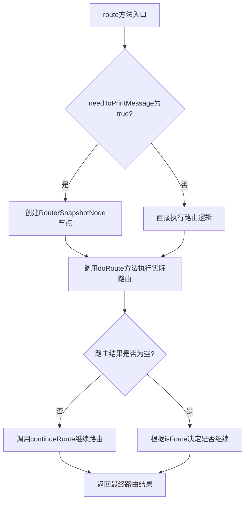
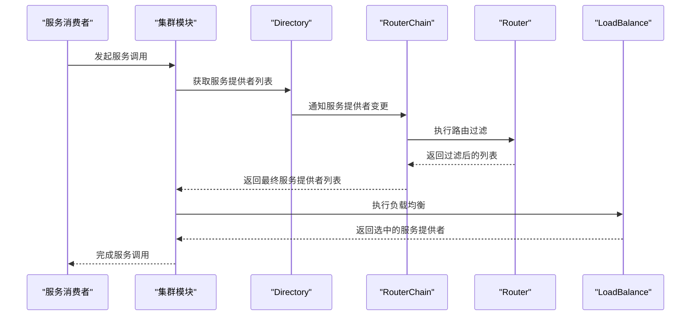
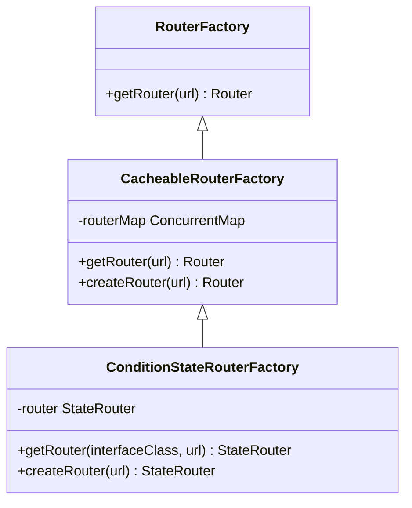
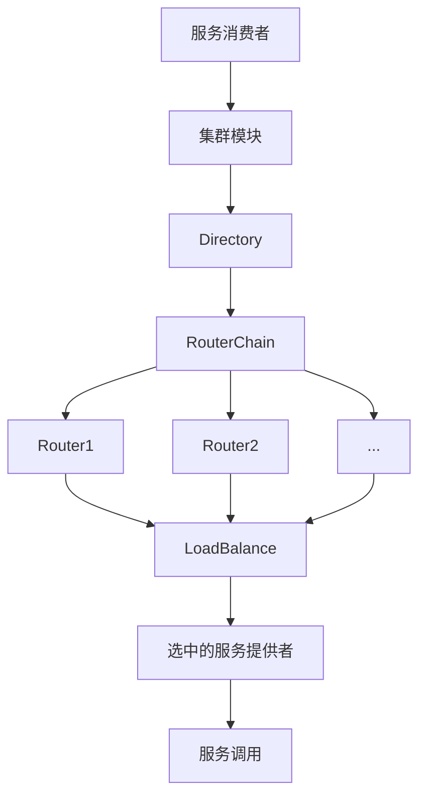

# Router接口

<cite>
**本文档引用的文件**
- [Router.java](file://dubbo-cluster\src\main\java\org\apache\dubbo\rpc\cluster\Router.java)
- [RouterFactory.java](file://dubbo-cluster\src\main\java\org\apache\dubbo\rpc\cluster\RouterFactory.java)
- [AbstractRouter.java](file://dubbo-cluster\src\main\java\org\apache\dubbo\rpc\cluster\router\AbstractRouter.java)
- [ConditionStateRouter.java](file://dubbo-cluster\src\main\java\org\apache\dubbo\rpc\cluster\router\condition\ConditionStateRouter.java)
- [RouterChain.java](file://dubbo-cluster\src\main\java\org\apache\dubbo\rpc\cluster\RouterChain.java)
- [AbstractStateRouter.java](file://dubbo-cluster\src\main\java\org\apache\dubbo\rpc\cluster\router\state\AbstractStateRouter.java)
- [Directory.java](file://dubbo-cluster\src\main\java\org\apache\dubbo\rpc\cluster\Directory.java)
</cite>

## 目录
1. [Router接口设计概述](#router接口设计概述)
2. [核心方法详解](#核心方法详解)
3. [集群调用中的作用时机与执行流程](#集群调用中的作用时机与执行流程)
4. [RouterFactory工厂接口](#routerfactory工厂接口)
5. [与其他集群组件的协作关系](#与其他集群组件的协作关系)
6. [自定义Router实现最佳实践](#自定义router实现最佳实践)

## Router接口设计概述

Router接口是Dubbo集群模块中的核心组件之一，用于实现服务调用的路由功能。该接口继承自Comparable接口，允许通过优先级进行排序。Router接口的主要职责是在服务消费者调用服务提供者时，根据特定的路由规则从可用的服务提供者列表中筛选出符合要求的实例。

Router接口的设计遵循了SPI（Service Provider Interface）扩展机制，允许用户根据业务需求自定义路由策略。接口中定义了获取路由URL、路由优先级、是否强制执行等基本属性，以及核心的路由方法。从Dubbo 2.7.0版本开始，Router接口的行为发生了变化，每种类型的Router对于每个服务只会有一个实例，这通过CacheableRouterFactory和RouterChain来实现。

**Section sources**
- [Router.java](file://dubbo-cluster\src\main\java\org\apache\dubbo\rpc\cluster\Router.java)
- [RouterFactory.java](file://dubbo-cluster\src\main\java\org\apache\dubbo\rpc\cluster\RouterFactory.java)

## 核心方法详解

Router接口定义了多个核心方法，其中最重要的方法是`route`方法。该方法有两个重载版本：一个已过时的版本和一个返回RouterResult的新版本。新版本的`route`方法接收一个布尔参数`needToPrintMessage`，用于指示是否需要打印路由状态信息，如"使用路由分支a"。

**Diagram sources**
- [AbstractStateRouter.java](file://dubbo-cluster\src\main\java\org\apache\dubbo\rpc\cluster\router\state\AbstractStateRouter.java)

`isRuntime`方法用于决定该路由是否需要在每次RPC调用时都执行，还是仅在地址或规则发生变化时才执行。`isForce`方法则决定当没有服务提供者匹配路由规则时，该路由是否仍应生效。`getPriority`方法返回路由的优先级，用于对多个路由进行排序。

**Section sources**
- [Router.java](file://dubbo-cluster\src\main\java\org\apache\dubbo\rpc\cluster\Router.java)
- [AbstractStateRouter.java](file://dubbo-cluster\src\main\java\org\apache\dubbo\rpc\cluster\router\state\AbstractStateRouter.java)

## 集群调用中的作用时机与执行流程

Router在集群调用过程中的作用时机主要在服务消费者发起调用时。当消费者需要调用远程服务时，集群模块会通过Directory获取所有可用的服务提供者列表，然后通过RouterChain对这些提供者进行过滤和路由。

执行流程如下：首先，Directory会从注册中心获取最新的服务提供者列表，并通过`notify`方法通知Router。然后，在每次RPC调用时，RouterChain会按照优先级顺序依次调用各个Router的`route`方法，对服务提供者列表进行过滤。最终，经过所有Router处理后的服务提供者列表将被传递给LoadBalance组件进行负载均衡选择。

**Diagram sources**
- [RouterChain.java](file://dubbo-cluster\src\main\java\org\apache\dubbo\rpc\cluster\RouterChain.java)
- [Directory.java](file://dubbo-cluster\src\main\java\org\apache\dubbo\rpc\cluster\Directory.java)

**Section sources**
- [RouterChain.java](file://dubbo-cluster\src\main\java\org\apache\dubbo\rpc\cluster\RouterChain.java)
- [Directory.java](file://dubbo-cluster\src\main\java\org\apache\dubbo\rpc\cluster\Directory.java)

## RouterFactory工厂接口

RouterFactory是用于创建和管理Router实例的工厂接口。该接口通过@SPI注解标记，支持SPI扩展机制。`getRouter`方法是其核心方法，接收一个URL参数并返回相应的Router实例。

**Diagram sources**
- [RouterFactory.java](file://dubbo-cluster\src\main\java\org\apache\dubbo\rpc\cluster\RouterFactory.java)
- [CacheableRouterFactory.java](file://dubbo-cluster\src\main\java\org\apache\dubbo\rpc\cluster\CacheableRouterFactory.java)
- [ConditionStateRouter.java](file://dubbo-cluster\src\main\java\org\apache\dubbo\rpc\cluster\router\condition\ConditionStateRouter.java)

CacheableRouterFactory作为抽象基类，提供了基于服务键的Router实例缓存机制，确保每个服务的每种Router类型只有一个实例。具体的Router实现类（如ConditionStateRouter）通过继承CacheableRouterFactory来获得实例缓存能力。

**Section sources**
- [RouterFactory.java](file://dubbo-cluster\src\main\java\org\apache\dubbo\rpc\cluster\RouterFactory.java)
- [CacheableRouterFactory.java](file://dubbo-cluster\src\main\java\org\apache\dubbo\rpc\cluster\CacheableRouterFactory.java)

## 与其他集群组件的协作关系

Router接口与Directory、LoadBalance等集群组件紧密协作，共同完成服务调用的路由和负载均衡过程。Directory负责管理服务提供者的列表，当服务提供者列表发生变化时，会通过`notify`方法通知Router。Router则根据配置的路由规则对服务提供者列表进行过滤。

**Diagram sources**
- [Directory.java](file://dubbo-cluster\src\main\java\org\apache\dubbo\rpc\cluster\Directory.java)
- [RouterChain.java](file://dubbo-cluster\src\main\java\org\apache\dubbo\rpc\cluster\RouterChain.java)

RouterChain作为Router的容器，负责管理多个Router实例的执行顺序。它按照Router的优先级对Router进行排序，并依次执行它们的路由逻辑。最终，经过RouterChain处理后的服务提供者列表将被传递给LoadBalance组件，由其根据负载均衡策略选择最终的服务提供者。

**Section sources**
- [Directory.java](file://dubbo-cluster\src\main\java\org\apache\dubbo\rpc\cluster\Directory.java)
- [RouterChain.java](file://dubbo-cluster\src\main\java\org\apache\dubbo\rpc\cluster\RouterChain.java)

## 自定义Router实现最佳实践

实现自定义Router时，建议继承AbstractRouter或AbstractStateRouter基类，而不是直接实现Router接口。这样可以复用基类中提供的通用功能，如优先级管理、强制执行标志等。在实现`route`方法时，应注意处理空列表的情况，并根据`isForce`方法的返回值决定是否继续路由。

创建自定义RouterFactory时，应继承CacheableRouterFactory以获得实例缓存能力。在`createRouter`方法中，可以根据URL中的参数创建相应的Router实例。同时，应在META-INF/dubbo/internal目录下创建org.apache.dubbo.rpc.cluster.RouterFactory文件，注册自定义的RouterFactory实现。

**Section sources**
- [AbstractRouter.java](file://dubbo-cluster\src\main\java\org\apache\dubbo\rpc\cluster\router\AbstractRouter.java)
- [CacheableRouterFactory.java](file://dubbo-cluster\src\main\java\org\apache\dubbo\rpc\cluster\CacheableRouterFactory.java)