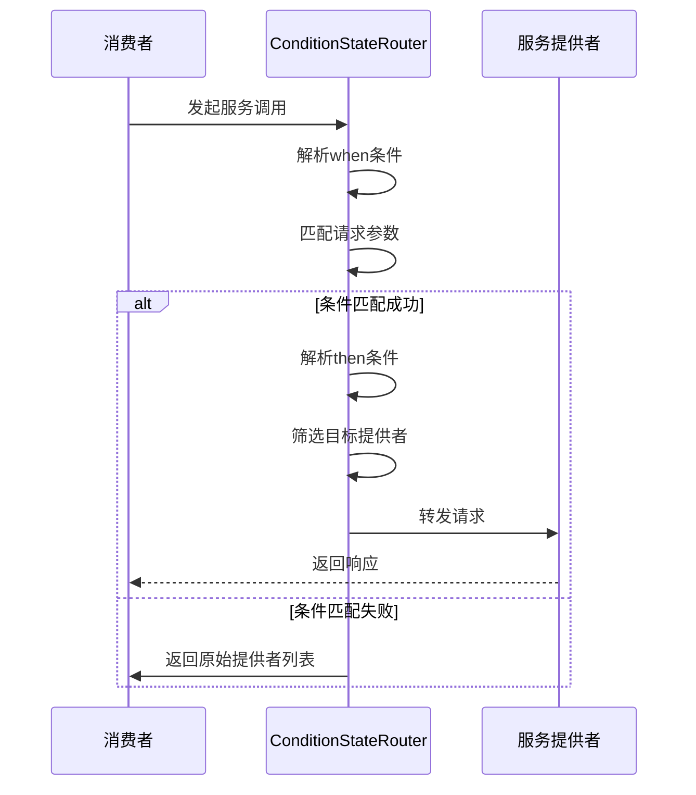
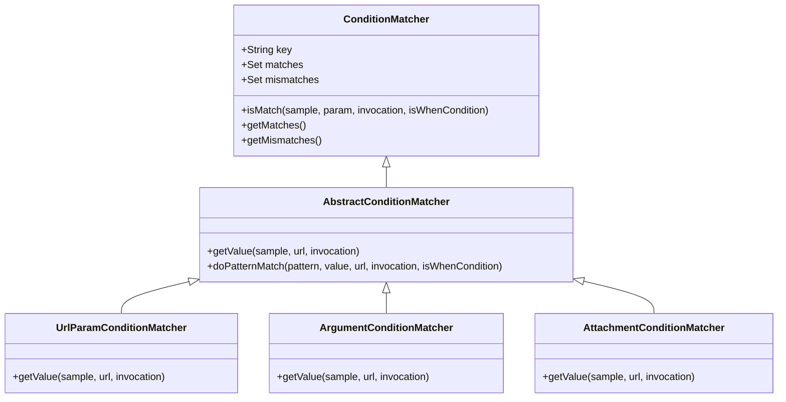
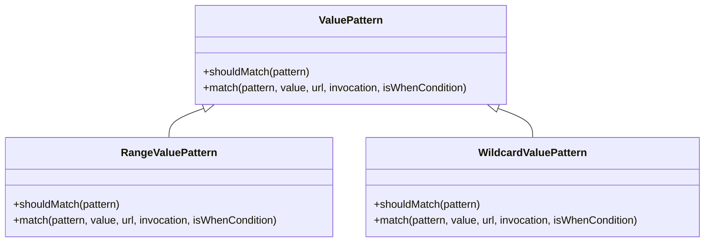
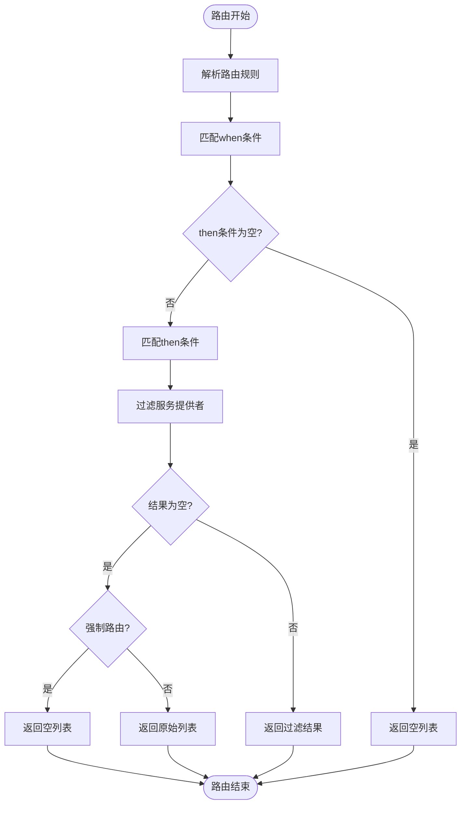
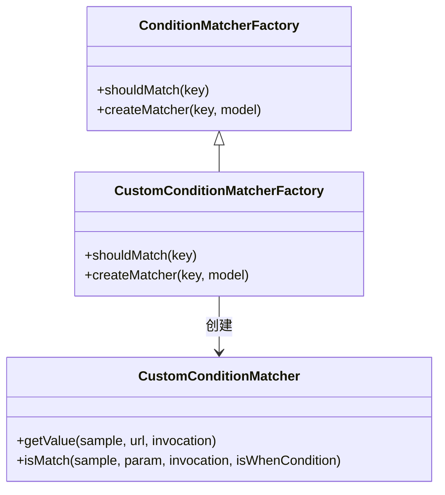

# 条件路由

<cite>
**本文档引用的文件**
- [ConditionStateRouter.java](file://dubbo-cluster\src\main\java\org\apache\dubbo\rpc\cluster\router\condition\ConditionStateRouter.java)
- [AbstractConditionMatcher.java](file://dubbo-cluster\src\main\java\org\apache\dubbo\rpc\cluster\router\condition\matcher\AbstractConditionMatcher.java)
- [ConditionRule.yml](file://dubbo-cluster\src\test\resources\ConditionRule.yml)
- [RangeValuePattern.java](file://dubbo-cluster\src\main\java\org\apache\dubbo\rpc\cluster\router\condition\matcher\pattern\range\RangeValuePattern.java)
- [WildcardValuePattern.java](file://dubbo-cluster\src\main\java\org\apache\dubbo\rpc\cluster\router\condition\matcher\pattern\wildcard\WildcardValuePattern.java)
- [ArgumentConditionMatcher.java](file://dubbo-cluster\src\main\java\org\apache\dubbo\rpc\cluster\router\condition\matcher\argument\ArgumentConditionMatcher.java)
- [AttachmentConditionMatcher.java](file://dubbo-cluster\src\main\java\org\apache\dubbo\rpc\cluster\router\condition\matcher\attachment\AttachmentConditionMatcher.java)
- [UrlParamConditionMatcher.java](file://dubbo-cluster\src\main\java\org\apache\dubbo\rpc\cluster\router\condition\matcher\param\UrlParamConditionMatcher.java)
- [ConditionMatcherFactory.java](file://dubbo-cluster\src\main\java\org\apache\dubbo\rpc\cluster\router\condition\matcher\ConditionMatcherFactory.java)
- [ScriptRule.yaml](file://dubbo-cluster\src\test\resources\ScriptRule.yaml)
</cite>

## 目录
1. [简介](#简介)
2. [条件路由实现原理](#条件路由实现原理)
3. [条件路由语法规范](#条件路由语法规范)
4. [配置示例](#配置示例)
5. [性能影响与优化建议](#性能影响与优化建议)
6. [扩展机制](#扩展机制)

## 简介
条件路由是Dubbo服务治理中的核心功能之一，它允许根据请求的特定条件（如参数、Header、方法名等）将流量分发到不同的服务提供者。这种机制在灰度发布、A/B测试、多版本控制等场景中具有重要作用。本文档将全面阐述ConditionRouter的实现原理，详细解释基于条件表达式的路由规则匹配机制，并提供具体的配置示例和性能优化建议。

## 条件路由实现原理

条件路由的核心实现位于`ConditionStateRouter`类中，它通过解析条件表达式来决定请求的路由目标。路由规则采用"when=>then"的格式，其中"when"部分定义了匹配条件，"then"部分定义了路由目标。



**图示来源**
- [ConditionStateRouter.java](file://dubbo-cluster\src\main\java\org\apache\dubbo\rpc\cluster\router\condition\ConditionStateRouter.java#L204-L278)

**本节来源**
- [ConditionStateRouter.java](file://dubbo-cluster\src\main\java\org\apache\dubbo\rpc\cluster\router\condition\ConditionStateRouter.java#L72-L332)

## 条件路由语法规范

### 基本语法结构
条件路由规则的基本语法结构为：`[匹配条件] => [路由目标]`，其中：
- `=>` 左侧为"when"条件，用于匹配请求
- `=>` 右侧为"then"条件，用于指定路由目标
- 多个条件之间使用`&`连接
- 相同键的多个值使用`,`分隔

### 条件表达式类型
条件路由支持多种类型的表达式，通过不同的匹配器（Matcher）来处理：



**图示来源**
- [AbstractConditionMatcher.java](file://dubbo-cluster\src\main\java\org\apache\dubbo\rpc\cluster\router\condition\matcher\AbstractConditionMatcher.java#L40-L148)
- [UrlParamConditionMatcher.java](file://dubbo-cluster\src\main\java\org\apache\dubbo\rpc\cluster\router\condition\matcher\param\UrlParamConditionMatcher.java#L30-L40)
- [ArgumentConditionMatcher.java](file://dubbo-cluster\src\main\java\org\apache\dubbo\rpc\cluster\router\condition\matcher\argument\ArgumentConditionMatcher.java#L40-L77)
- [AttachmentConditionMatcher.java](file://dubbo-cluster\src\main\java\org\apache\dubbo\rpc\cluster\router\condition\matcher\attachment\AttachmentConditionMatcher.java#L40-L77)

### 值匹配模式
条件路由支持多种值匹配模式，通过`ValuePattern`接口实现：



**图示来源**
- [ValuePattern.java](file://dubbo-cluster\src\main\java\org\apache\dubbo\rpc\cluster\router\condition\matcher\pattern\ValuePattern.java#L24-L31)
- [RangeValuePattern.java](file://dubbo-cluster\src\main\java\org\apache\dubbo\rpc\cluster\router\condition\matcher\pattern\range\RangeValuePattern.java#L33-L93)
- [WildcardValuePattern.java](file://dubbo-cluster\src\main\java\org\apache\dubbo\rpc\cluster\router\condition\matcher\pattern\wildcard\WildcardValuePattern.java#L31-L41)

**本节来源**
- [ConditionStateRouter.java](file://dubbo-cluster\src\main\java\org\apache\dubbo\rpc\cluster\router\condition\ConditionStateRouter.java#L76-L202)
- [AbstractConditionMatcher.java](file://dubbo-cluster\src\main\java\org\apache\dubbo\rpc\cluster\router\condition\matcher\AbstractConditionMatcher.java#L123-L141)

## 配置示例

### YAML配置示例
以下是在YAML文件中定义条件路由的示例：

```yaml
# 应用级别，适用于所有服务
---
scope: application
force: true
runtime: false
enabled: true
priority: 1
key: demo-consumer
conditions:
- method!=sayHello => address=30.5.120.16:20880
- method=routeMethod1 =>
...

# 服务级别，仅适用于特定服务
---
scope: service
force: true
runtime: false
enabled: true
priority: 1
key: org.apache.dubbo.demo.DemoService
conditions:
- method!=sayHello =>
- method=routeMethod1 => address=30.5.120.16:20880
...
```

**本节来源**
- [ConditionRule.yml](file://dubbo-cluster\src\test\resources\ConditionRule.yml#L20-L56)

### Java代码配置示例
通过Java代码配置条件路由：

```java
// 创建条件路由URL
URL url = URL.valueOf("condition://0.0.0.0/org.apache.dubbo.demo.DemoService?" +
    "router=condition&" +
    "rule=" + URLEncoder.encode("method=sayHello => address=10.20.3.3:20880", "UTF-8"));

// 创建条件路由器
StateRouter router = new ConditionStateRouterFactory().getRouter(String.class, url);
```

### 常见表达式写法
#### 基于请求参数的路由
```yaml
conditions:
- version=2.0 => version=2.0
- version=1.0 => version=1.0
```

#### 基于Header的路由
```yaml
conditions:
- attachments[region]=hangzhou => address=10.20.3.3:20880
- attachments[region]=beijing => address=10.20.3.4:20880
```

#### 基于方法参数的路由
```yaml
conditions:
- arguments[0]=vip => address=10.20.3.3:20880
- arguments[0]=normal => address=10.20.3.4:20880
```

#### 范围匹配
```yaml
conditions:
- age=18~25 => address=10.20.3.3:20880
- age=~18 => address=10.20.3.4:20880
- age=25~ => address=10.20.3.5:20880
```

#### 通配符匹配
```yaml
conditions:
- host=10.20.3.* => address=10.20.3.3:20880
- host=*.example.com => address=10.20.3.4:20880
```

### 场景配置示例

#### 灰度发布
```yaml
---
scope: service
force: false
runtime: true
enabled: true
key: org.apache.dubbo.demo.DemoService
conditions:
- version=1.0.1 => version=1.0.1
- version=1.0.0 => version=1.0.0
- attachments[env]=gray => version=1.0.1
...
```

#### A/B测试
```yaml
---
scope: service
force: false
runtime: true
enabled: true
key: org.apache.dubbo.demo.DemoService
conditions:
- attachments[experiment]=A => address=10.20.3.3:20880
- attachments[experiment]=B => address=10.20.3.4:20880
- attachments[region]=hangzhou => address=10.20.3.3:20880
- attachments[region]=beijing => address=10.20.3.4:20880
...
```

**本节来源**
- [ConditionRule.yml](file://dubbo-cluster\src\test\resources\ConditionRule.yml#L20-L56)
- [ScriptRule.yaml](file://dubbo-cluster\src\test\resources\ScriptRule.yaml#L20-L35)

## 性能影响与优化建议

### 性能影响分析
条件路由的性能影响主要体现在以下几个方面：



**图示来源**
- [ConditionStateRouter.java](file://dubbo-cluster\src\main\java\org\apache\dubbo\rpc\cluster\router\condition\ConditionStateRouter.java#L204-L278)

### 性能优化建议
1. **减少规则复杂度**：避免使用过多的嵌套条件和复杂的正则表达式
2. **合理设置优先级**：将最常用的规则放在前面，减少匹配次数
3. **启用缓存**：对于不经常变化的路由规则，可以设置`runtime=false`以启用缓存
4. **避免频繁更新**：频繁更新路由规则会导致缓存失效，影响性能
5. **合理使用force**：`force=true`时，即使匹配结果为空也会强制路由，可能影响服务可用性

**本节来源**
- [ConditionStateRouter.java](file://dubbo-cluster\src\main\java\org\apache\dubbo\rpc\cluster\router\condition\ConditionStateRouter.java#L204-L278)
- [ConditionRule.yml](file://dubbo-cluster\src\test\resources\ConditionRule.yml#L20-L56)

## 扩展机制

### 条件匹配器扩展
Dubbo提供了灵活的扩展机制，可以通过实现`ConditionMatcherFactory`接口来扩展条件匹配器：



**图示来源**
- [ConditionMatcherFactory.java](file://dubbo-cluster\src\main\java\org\apache\dubbo\rpc\cluster\router\condition\matcher\ConditionMatcherFactory.java#L26-L43)

### 值匹配模式扩展
可以通过实现`ValuePattern`接口来扩展值匹配模式：

```java
@Activate(order = 100)
public class CustomValuePattern implements ValuePattern {
    @Override
    public boolean shouldMatch(String pattern) {
        return pattern.startsWith("custom:");
    }
    
    @Override
    public boolean match(String pattern, String value, URL url, Invocation invocation, boolean isWhenCondition) {
        // 自定义匹配逻辑
        return value.equals(pattern.substring(7));
    }
}
```

然后在`META-INF/dubbo/internal/org.apache.dubbo.rpc.cluster.router.condition.matcher.pattern.ValuePattern`文件中注册：
```
custom=org.apache.dubbo.rpc.cluster.router.condition.matcher.pattern.custom.CustomValuePattern
```

**本节来源**
- [ConditionMatcherFactory.java](file://dubbo-cluster\src\main\java\org\apache\dubbo\rpc\cluster\router\condition\matcher\ConditionMatcherFactory.java#L26-L43)
- [ValuePattern.java](file://dubbo-cluster\src\main\java\org\apache\dubbo\rpc\cluster\router\condition\matcher\pattern\ValuePattern.java#L24-L31)