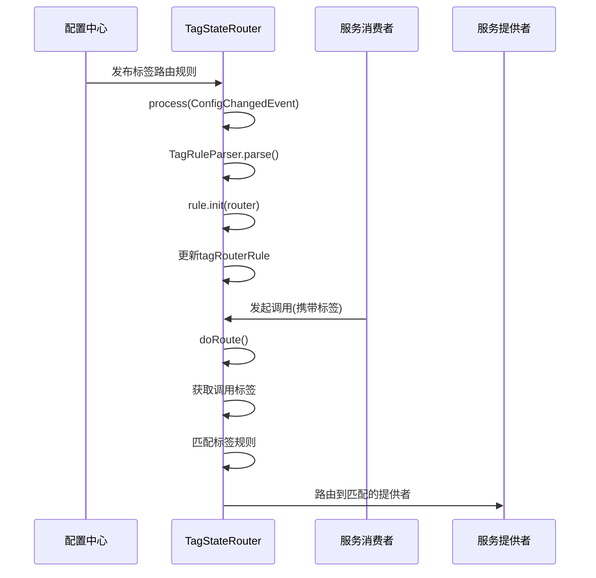
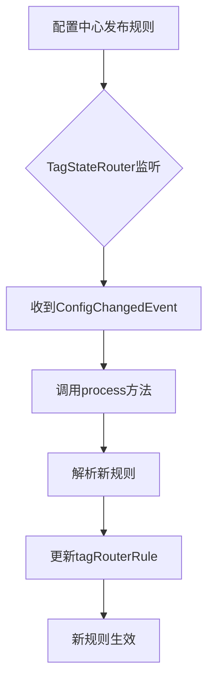
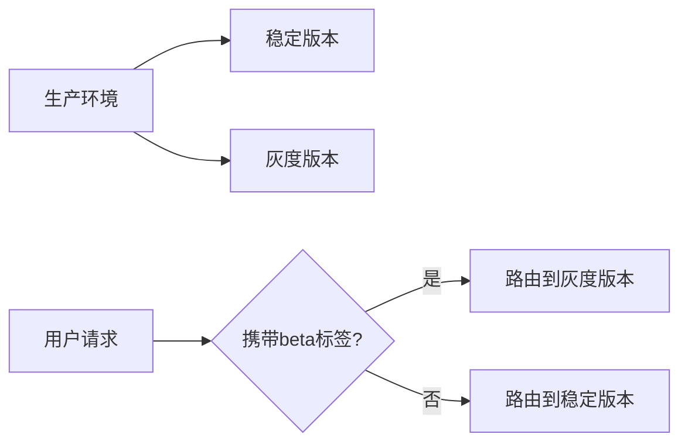

# 标签路由

<cite>
**本文档引用的文件**   
- [TagStateRouter.java](file://dubbo-cluster\src\main\java\org\apache\dubbo\rpc\cluster\router\tag\TagStateRouter.java)
- [TagStateRouterFactory.java](file://dubbo-cluster\src\main\java\org\apache\dubbo\rpc\cluster\router\tag\TagStateRouterFactory.java)
- [TagRouterRule.java](file://dubbo-cluster\src\main\java\org\apache\dubbo\rpc\cluster\router\tag\model\TagRouterRule.java)
- [TagRuleParser.java](file://dubbo-cluster\src\main\java\org\apache\dubbo\rpc\cluster\router\tag\model\TagRuleParser.java)
- [Tag.java](file://dubbo-cluster\src\main\java\org\apache\dubbo\rpc\cluster\router\tag\model\Tag.java)
- [TagStateRouterTest.java](file://dubbo-cluster\src\test\java\org\apache\dubbo\rpc\cluster\router\tag\TagStateRouterTest.java)
- [TagRule.yml](file://dubbo-cluster\src\test\resources\TagRule.yml)
- [AbstractStateRouter.java](file://dubbo-cluster\src\main\java\org\apache\dubbo\rpc\cluster\router\state\AbstractStateRouter.java)
</cite>

## 目录
1. [引言](#引言)
2. [核心组件](#核心组件)
3. [工作流程](#工作流程)
4. [标签路由规则](#标签路由规则)
5. [动态配置与监听](#动态配置与监听)
6. [多级标签匹配机制](#多级标签匹配机制)
7. [灰度发布应用案例](#灰度发布应用案例)
8. [与其他治理规则的协同](#与其他治理规则的协同)
9. [总结](#总结)

## 引言
标签路由是Dubbo服务治理中的核心功能之一，它通过为服务实例分配标签属性，实现基于标签的流量隔离和路由策略。该机制支持金丝雀发布、多版本隔离等高级场景，允许通过配置中心动态调整服务实例的标签，从而精确控制流量的走向。标签路由不仅支持基于IP地址的静态标签分配，还支持基于参数匹配的动态标签规则，为微服务架构提供了灵活的流量管理能力。

## 核心组件

标签路由功能由多个核心组件构成，包括路由工厂、路由实现、规则模型和解析器。`TagStateRouterFactory`作为路由工厂，负责创建`TagStateRouter`实例。`TagStateRouter`是标签路由的核心实现，继承自`AbstractStateRouter`并实现了`ConfigurationListener`接口，能够监听配置变化。`TagRouterRule`定义了标签路由的规则结构，包含标签名称、地址列表和匹配条件等信息。`TagRuleParser`负责将YAML格式的原始规则解析为结构化的`TagRouterRule`对象。

**组件来源**
- [TagStateRouterFactory.java](file://dubbo-cluster\src\main\java\org\apache\dubbo\rpc\cluster\router\tag\TagStateRouterFactory.java#L1-L36)
- [TagStateRouter.java](file://dubbo-cluster\src\main\java\org\apache\dubbo\rpc\cluster\router\tag\TagStateRouter.java#L1-L373)
- [TagRouterRule.java](file://dubbo-cluster\src\main\java\org\apache\dubbo\rpc\cluster\router\tag\model\TagRouterRule.java#L1-L145)
- [TagRuleParser.java](file://dubbo-cluster\src\main\java\org\apache\dubbo\rpc\cluster\router\tag\model\TagRuleParser.java#L1-L44)

## 工作流程



**图示来源**
- [TagStateRouter.java](file://dubbo-cluster\src\main\java\org\apache\dubbo\rpc\cluster\router\tag\TagStateRouter.java#L92-L185)
- [TagRuleParser.java](file://dubbo-cluster\src\main\java\org\apache\dubbo\rpc\cluster\router\tag\model\TagRuleParser.java#L32-L42)

## 标签路由规则

标签路由规则采用YAML格式定义，包含强制路由、运行时生效、启用状态、优先级、服务键和标签列表等属性。每个标签可以定义名称、地址列表或匹配条件。地址列表用于静态标签分配，直接指定服务实例的IP地址；匹配条件用于动态标签规则，通过参数匹配来确定哪些服务实例属于该标签。

```yaml
---
force: true
runtime: false
enabled: true
priority: 1
key: demo-provider
tags:
- name: tag1
  addresses: [30.5.120.16:20880]
- name: tag2
  addresses: [30.5.120.16:20881]
...
```

**规则来源**
- [TagRule.yml](file://dubbo-cluster\src\test\resources\TagRule.yml#L20-L31)
- [TagRouterRule.java](file://dubbo-cluster\src\main\java\org\apache\dubbo\rpc\cluster\router\tag\model\TagRouterRule.java#L35-L49)

## 动态配置与监听

标签路由支持通过配置中心动态更新路由规则。`TagStateRouter`实现了`ConfigurationListener`接口，能够监听配置变化事件。当配置中心发布新的标签路由规则时，`TagStateRouter`会接收到`ConfigChangedEvent`，并调用`process`方法处理事件。在`process`方法中，使用`TagRuleParser`解析新的规则，并更新内部的`tagRouterRule`，从而实现路由规则的热更新。



**监听来源**
- [TagStateRouter.java](file://dubbo-cluster\src\main\java\org\apache\dubbo\rpc\cluster\router\tag\TagStateRouter.java#L67-L90)
- [AbstractStateRouter.java](file://dubbo-cluster\src\main\java\org\apache\dubbo\rpc\cluster\router\state\AbstractStateRouter.java#L88-L91)

## 多级标签匹配机制

标签路由支持多级标签匹配机制，允许使用竖线（|）分隔的标签选择器进行层级匹配。当请求携带多级标签时，系统会从最长的标签路径开始匹配，逐级降级直到找到匹配的地址列表。这种机制支持复杂的标签继承和覆盖场景，例如`beta|team1|partner1`可以匹配`beta|team1`或`beta`的地址列表。

```mermaid
flowchart TD
A[请求标签: beta|team1|partner1] --> B{匹配beta|team1|partner1?}
B --> |是| C[返回对应地址]
B --> |否| D{匹配beta|team1?}
D --> |是| E[返回对应地址]
D --> |否| F{匹配beta?}
F --> |是| G[返回对应地址]
F --> |否| H[返回空]
```

**匹配来源**
- [TagStateRouter.java](file://dubbo-cluster\src\main\java\org\apache\dubbo\rpc\cluster\router\tag\TagStateRouter.java#L357-L370)
- [TagStateRouterTest.java](file://dubbo-cluster\src\test\java\org\apache\dubbo\rpc\cluster\router\tag\TagStateRouterTest.java#L263-L291)

## 灰度发布应用案例

在灰度发布场景中，标签路由可以精确控制新版本服务的流量比例。首先，为新版本服务实例分配特定标签（如`beta`），然后通过配置中心发布标签路由规则，将特定用户或请求的流量路由到带标签的服务实例。随着测试的进行，可以逐步扩大标签匹配的范围，最终将所有流量切换到新版本。



**案例来源**
- [TagStateRouterTest.java](file://dubbo-cluster\src\test\java\org\apache\dubbo\rpc\cluster\router\tag\TagStateRouterTest.java#L64-L87)
- [TagRouterRule.java](file://dubbo-cluster\src\main\java\org\apache\dubbo\rpc\cluster\router\tag\model\TagRouterRule.java#L72-L115)

## 与其他治理规则的协同

标签路由与其他治理规则（如条件路由、应用路由）协同工作，形成完整的服务治理策略。在路由链中，标签路由的优先级由配置决定，可以与其他路由规则组合使用。当多个路由规则同时生效时，系统会按照优先级顺序依次执行，确保流量按照预期的策略进行路由。

**协同来源**
- [TagStateRouter.java](file://dubbo-cluster\src\main\java\org\apache\dubbo\rpc\cluster\router\tag\TagStateRouter.java#L109-L115)
- [AbstractStateRouter.java](file://dubbo-cluster\src\main\java\org\apache\dubbo\rpc\cluster\router\state\AbstractStateRouter.java#L126-L136)

## 总结
标签路由是Dubbo服务治理中强大的流量管理工具，通过灵活的标签机制实现了精细化的流量控制。它支持静态和动态标签规则，能够与配置中心集成实现动态更新，并通过多级标签匹配机制支持复杂的业务场景。在灰度发布、多版本隔离等场景中，标签路由提供了可靠的技术支持，是构建高可用微服务架构的重要组成部分。