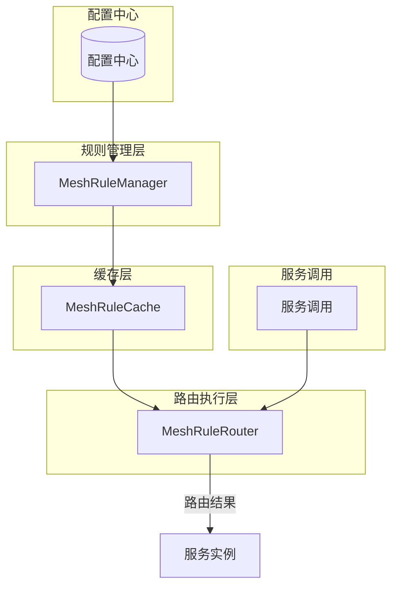
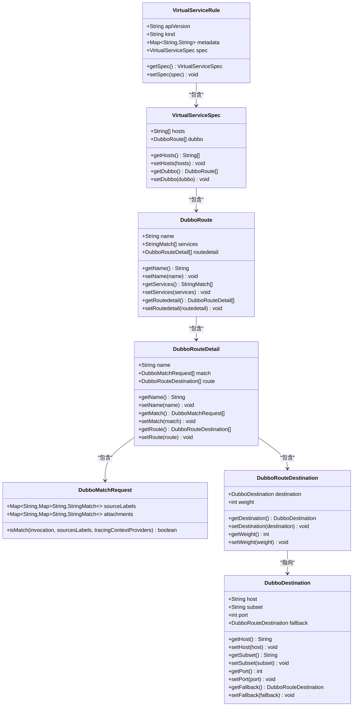
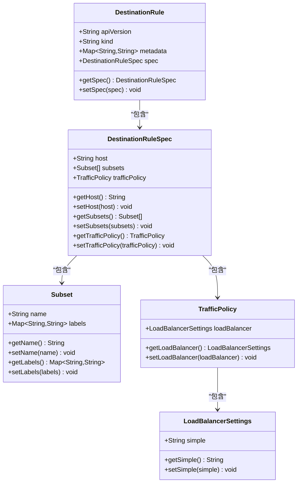
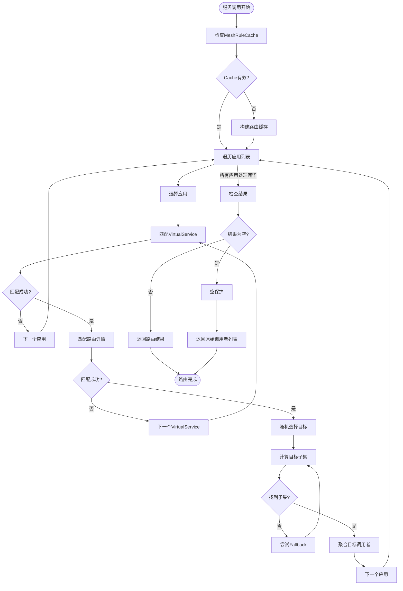
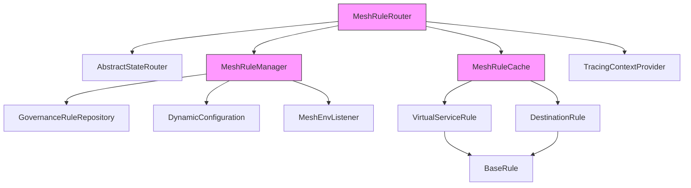

# 网格路由

<cite>
**本文档引用的文件**   
- [MeshRuleRouter.java](file://dubbo-cluster\src\main\java\org\apache\dubbo\rpc\cluster\router\mesh\route\MeshRuleRouter.java)
- [MeshRuleManager.java](file://dubbo-cluster\src\main\java\org\apache\dubbo\rpc\cluster\router\mesh\route\MeshRuleManager.java)
- [VirtualServiceRule.java](file://dubbo-cluster\src\main\java\org\apache\dubbo\rpc\cluster\router\mesh\rule\virtualservice\VirtualServiceRule.java)
- [DestinationRule.java](file://dubbo-cluster\src\main\java\org\apache\dubbo\rpc\cluster\router\mesh\rule\destination\DestinationRule.java)
- [MeshRuleCache.java](file://dubbo-cluster\src\main\java\org\apache\dubbo\rpc\cluster\router\mesh\route\MeshRuleCache.java)
- [VirtualServiceTest.yaml](file://dubbo-cluster\src\test\resources\VirtualServiceTest.yaml)
- [DestinationRuleTest.yaml](file://dubbo-cluster\src\test\resources\DestinationRuleTest.yaml)
</cite>

## 目录
1. [引言](#引言)
2. [项目结构](#项目结构)
3. [核心组件](#核心组件)
4. [架构概述](#架构概述)
5. [详细组件分析](#详细组件分析)
6. [依赖分析](#依赖分析)
7. [性能考虑](#性能考虑)
8. [故障排除指南](#故障排除指南)
9. [结论](#结论)

## 引言
网格路由是Dubbo服务网格架构中的核心组件，负责实现高级流量治理功能。本文档全面阐述了MeshRouter在服务网格中的作用，详细解释了基于VirtualService和DestinationRule的流量管理机制。通过具体案例展示了如何配置权重路由、超时重试、熔断降级等高级流量治理策略，并说明了网格路由与Istio等服务网格平台的集成方式以及在混合部署环境中的应用场景。

## 项目结构
Dubbo的网格路由功能主要位于dubbo-cluster模块中，其核心组件分布在特定的包结构下。该结构体现了清晰的分层设计，将路由规则、匹配逻辑和执行策略分离，便于维护和扩展。

```mermaid
graph TD
subgraph "dubbo-cluster"
subgraph "路由核心"
MeshRuleRouter[MeshRuleRouter]
MeshRuleManager[MeshRuleManager]
MeshRuleCache[MeshRuleCache]
end
subgraph "规则定义"
VirtualServiceRule[VirtualServiceRule]
DestinationRule[DestinationRule]
BaseRule[BaseRule]
end
subgraph "虚拟服务"
VirtualServiceSpec[VirtualServiceSpec]
DubboRoute[DubboRoute]
DubboRouteDetail[DubboRouteDetail]
DubboMatchRequest[DubboMatchRequest]
end
subgraph "目标规则"
DestinationRuleSpec[DestinationRuleSpec]
Subset[Subset]
TrafficPolicy[TrafficPolicy]
LoadBalancerSettings[LoadBalancerSettings]
end
MeshRuleRouter --> MeshRuleManager
MeshRuleManager --> MeshRuleCache
MeshRuleCache --> VirtualServiceRule
MeshRuleCache --> DestinationRule
VirtualServiceRule --> VirtualServiceSpec
VirtualServiceSpec --> DubboRoute
DubboRoute --> DubboRouteDetail
DubboRouteDetail --> DubboMatchRequest
DestinationRule --> DestinationRuleSpec
DestinationRuleSpec --> Subset
DestinationRuleSpec --> TrafficPolicy
TrafficPolicy --> LoadBalancerSettings
```

**图源**
- [MeshRuleRouter.java](file://dubbo-cluster\src\main\java\org\apache\dubbo\rpc\cluster\router\mesh\route\MeshRuleRouter.java)
- [MeshRuleManager.java](file://dubbo-cluster\src\main\java\org\apache\dubbo\rpc\cluster\router\mesh\route\MeshRuleManager.java)
- [VirtualServiceRule.java](file://dubbo-cluster\src\main\java\org\apache\dubbo\rpc\cluster\router\mesh\rule\virtualservice\VirtualServiceRule.java)
- [DestinationRule.java](file://dubbo-cluster\src\main\java\org\apache\dubbo\rpc\cluster\router\mesh\rule\destination\DestinationRule.java)

**节源**
- [MeshRuleRouter.java](file://dubbo-cluster\src\main\java\org\apache\dubbo\rpc\cluster\router\mesh\route\MeshRuleRouter.java)
- [MeshRuleManager.java](file://dubbo-cluster\src\main\java\org\apache\dubbo\rpc\cluster\router\mesh\route\MeshRuleManager.java)

## 核心组件
网格路由的核心组件包括MeshRuleRouter、MeshRuleManager和MeshRuleCache。MeshRuleRouter是主要的路由决策组件，负责根据VirtualService和DestinationRule规则对服务调用进行路由。MeshRuleManager负责管理应用级别的路由规则，从配置中心获取并监听规则变化。MeshRuleCache则缓存了经过计算的路由结果，以提高路由性能。

**节源**
- [MeshRuleRouter.java](file://dubbo-cluster\src\main\java\org\apache\dubbo\rpc\cluster\router\mesh\route\MeshRuleRouter.java)
- [MeshRuleManager.java](file://dubbo-cluster\src\main\java\org\apache\dubbo\rpc\cluster\router\mesh\route\MeshRuleManager.java)
- [MeshRuleCache.java](file://dubbo-cluster\src\main\java\org\apache\dubbo\rpc\cluster\router\mesh\route\MeshRuleCache.java)

## 架构概述
Dubbo网格路由采用分层架构设计，实现了路由规则的动态管理和高效执行。整个架构分为规则定义层、规则管理层、路由执行层和缓存层。规则定义层基于Istio的VirtualService和DestinationRule概念，定义了服务间的流量路由和目标策略。规则管理层负责从配置中心获取规则并通知路由组件。路由执行层根据当前调用上下文和规则进行决策，而缓存层则优化了频繁的路由计算。



**图源**
- [MeshRuleRouter.java](file://dubbo-cluster\src\main\java\org\apache\dubbo\rpc\cluster\router\mesh\route\MeshRuleRouter.java)
- [MeshRuleManager.java](file://dubbo-cluster\src\main\java\org\apache\dubbo\rpc\cluster\router\mesh\route\MeshRuleManager.java)
- [MeshRuleCache.java](file://dubbo-cluster\src\main\java\org\apache\dubbo\rpc\cluster\router\mesh\route\MeshRuleCache.java)

## 详细组件分析

### VirtualService分析
VirtualService是网格路由中的流量路由规则定义，用于描述如何将流量路由到不同的服务版本。它通过匹配条件（match）和路由目标（route）来实现灵活的流量分配策略。



**图源**
- [VirtualServiceRule.java](file://dubbo-cluster\src\main\java\org\apache\dubbo\rpc\cluster\router\mesh\rule\virtualservice\VirtualServiceRule.java)
- [VirtualServiceSpec.java](file://dubbo-cluster\src\main\java\org\apache\dubbo\rpc\cluster\router\mesh\rule\virtualservice\VirtualServiceSpec.java)
- [DubboRoute.java](file://dubbo-cluster\src\main\java\org\apache\dubbo\rpc\cluster\router\mesh\rule\virtualservice\DubboRoute.java)

### DestinationRule分析
DestinationRule是网格路由中的目标规则定义，用于描述服务实例的子集划分和流量策略。它定义了如何根据标签选择服务实例，并配置负载均衡、熔断等策略。



**图源**
- [DestinationRule.java](file://dubbo-cluster\src\main\java\org\apache\dubbo\rpc\cluster\router\mesh\rule\destination\DestinationRule.java)
- [DestinationRuleSpec.java](file://dubbo-cluster\src\main\java\org\apache\dubbo\rpc\cluster\router\mesh\rule\destination\DestinationRuleSpec.java)
- [Subset.java](file://dubbo-cluster\src\main\java\org\apache\dubbo\rpc\cluster\router\mesh\rule\destination\Subset.java)

### 路由执行流程分析
网格路由的执行流程是一个复杂的决策过程，涉及多个步骤的匹配和计算。从接收到服务调用开始，到最终确定目标服务实例，整个流程需要高效且准确。



**图源**
- [MeshRuleRouter.java](file://dubbo-cluster\src\main\java\org\apache\dubbo\rpc\cluster\router\mesh\route\MeshRuleRouter.java#L83-L140)
- [MeshRuleCache.java](file://dubbo-cluster\src\main\java\org\apache\dubbo\rpc\cluster\router\mesh\route\MeshRuleCache.java#L90-L147)

**节源**
- [MeshRuleRouter.java](file://dubbo-cluster\src\main\java\org\apache\dubbo\rpc\cluster\router\mesh\route\MeshRuleRouter.java)
- [MeshRuleCache.java](file://dubbo-cluster\src\main\java\org\apache\dubbo\rpc\cluster\router\mesh\route\MeshRuleCache.java)

## 依赖分析
网格路由组件依赖于Dubbo的核心模块和扩展机制，形成了一个松耦合但功能完整的系统。这些依赖关系确保了网格路由能够无缝集成到现有的Dubbo生态系统中。



**图源**
- [MeshRuleRouter.java](file://dubbo-cluster\src\main\java\org\apache\dubbo\rpc\cluster\router\mesh\route\MeshRuleRouter.java)
- [MeshRuleManager.java](file://dubbo-cluster\src\main\java\org\apache\dubbo\rpc\cluster\router\mesh\route\MeshRuleManager.java)
- [MeshRuleCache.java](file://dubbo-cluster\src\main\java\org\apache\dubbo\rpc\cluster\router\mesh\route\MeshRuleCache.java)

**节源**
- [MeshRuleRouter.java](file://dubbo-cluster\src\main\java\org\apache\dubbo\rpc\cluster\router\mesh\route\MeshRuleRouter.java)
- [MeshRuleManager.java](file://dubbo-cluster\src\main\java\org\apache\dubbo\rpc\cluster\router\mesh\route\MeshRuleManager.java)

## 性能考虑
网格路由在设计时充分考虑了性能因素。通过MeshRuleCache机制，避免了每次调用都重新计算路由规则，大大提高了路由效率。同时，使用BitList数据结构进行调用者列表的高效操作，减少了内存分配和垃圾回收的开销。规则匹配采用短路评估策略，一旦找到匹配的规则就立即返回，避免不必要的计算。

## 故障排除指南
当网格路由出现问题时，可以通过以下步骤进行排查：首先检查MeshRuleCache是否已正确构建，如果缓存为空，可能是规则未正确加载；其次验证VirtualService和DestinationRule的配置是否正确，特别是host和subset的匹配；然后检查服务实例的标签是否与规则中的标签匹配；最后查看日志中是否有规则解析错误或匹配失败的信息。

**节源**
- [MeshRuleRouter.java](file://dubbo-cluster\src\main\java\org\apache\dubbo\rpc\cluster\router\mesh\route\MeshRuleRouter.java#L92-L96)
- [MeshRuleManager.java](file://dubbo-cluster\src\main\java\org\apache\dubbo\rpc\cluster\router\mesh\route\MeshRuleManager.java#L62-L73)

## 结论
Dubbo的网格路由功能提供了一套完整的服务网格流量治理解决方案。通过借鉴Istio的设计理念，实现了VirtualService和DestinationRule等标准的流量管理机制。该系统具有良好的扩展性和灵活性，能够满足复杂的微服务架构需求。通过合理的规则配置，可以实现灰度发布、金丝雀部署、故障注入等高级场景，为微服务架构的稳定运行提供了有力保障。