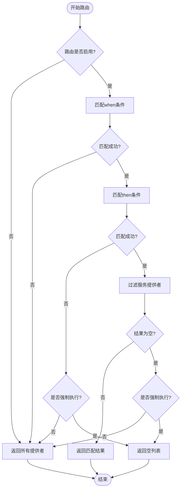
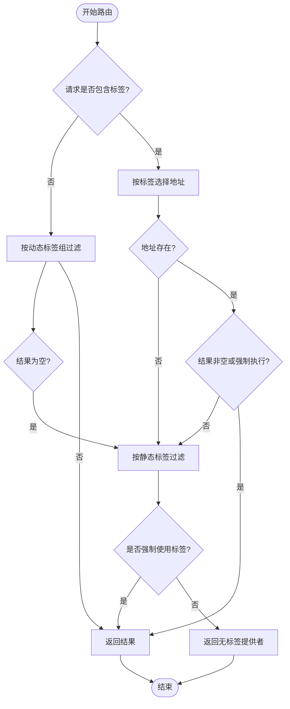
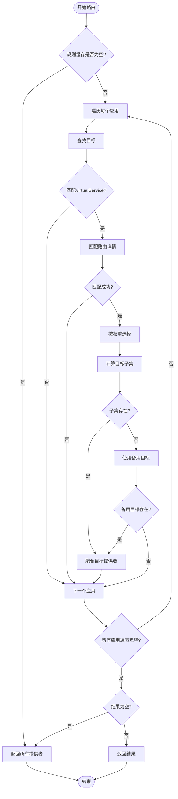
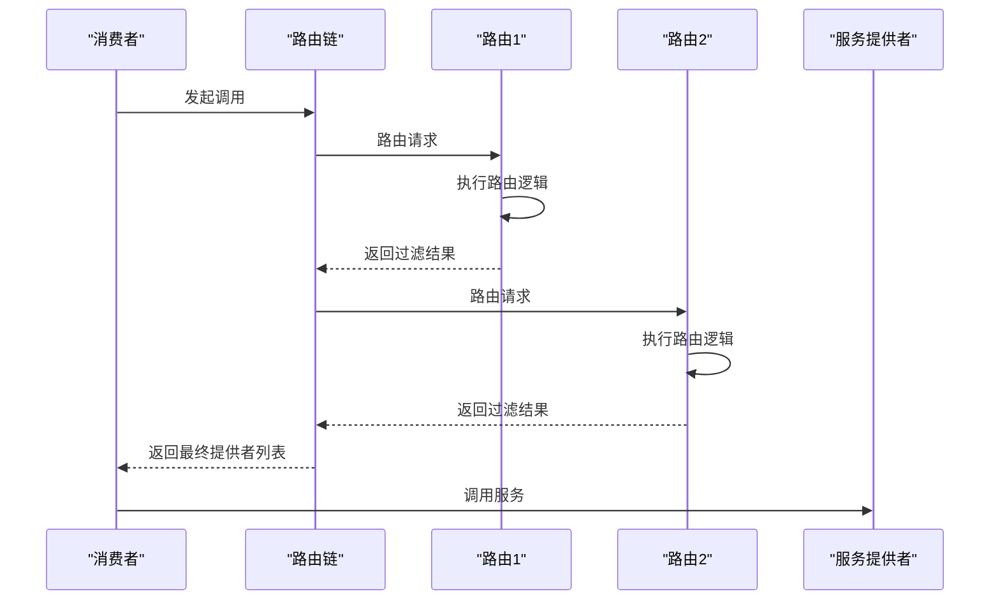
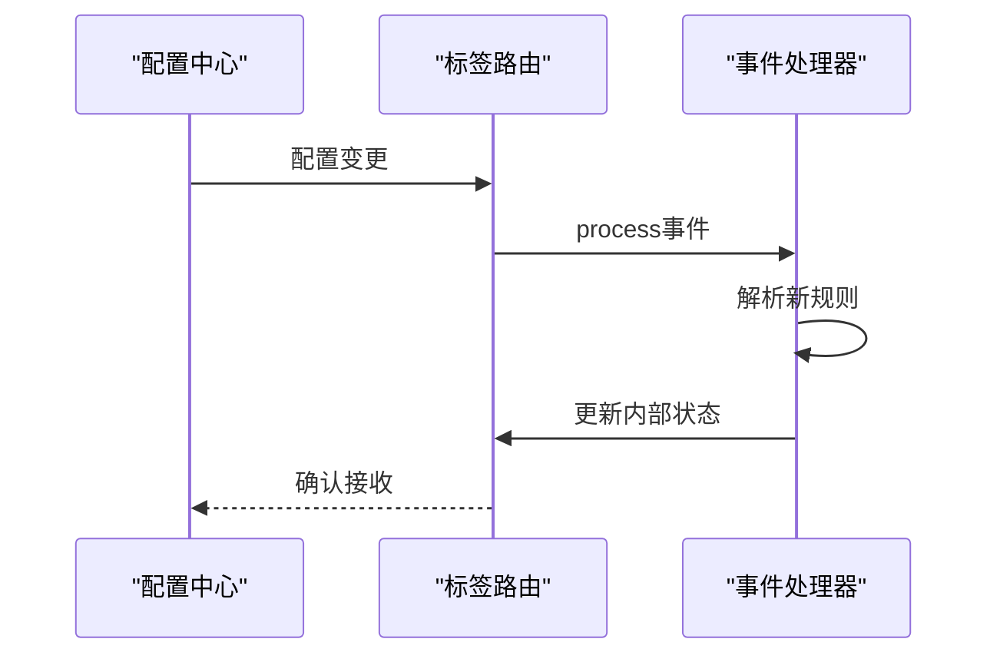
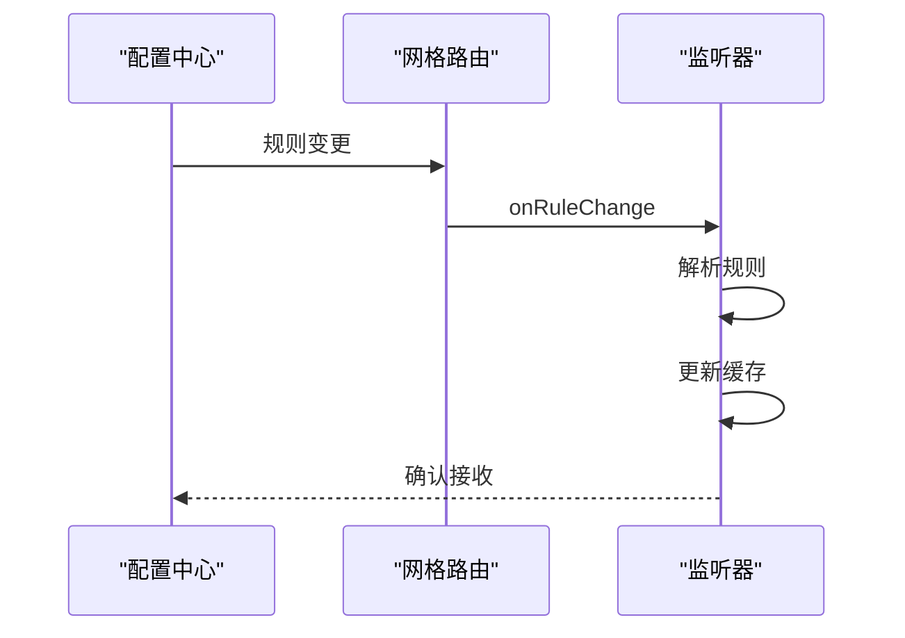
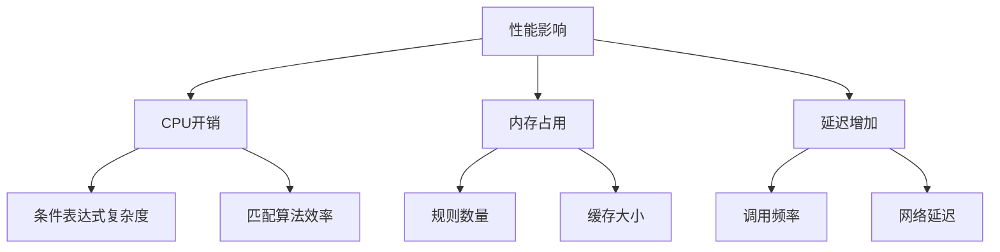

# 路由机制

<cite>
**本文档引用的文件**   
- [ConditionStateRouter.java](file://dubbo-cluster\src\main\java\org\apache\dubbo\rpc\cluster\router\condition\ConditionStateRouter.java)
- [TagStateRouter.java](file://dubbo-cluster\src\main\java\org\apache\dubbo\rpc\cluster\router\tag\TagStateRouter.java)
- [MeshRuleRouter.java](file://dubbo-cluster\src\main\java\org\apache\dubbo\rpc\cluster\router\mesh\route\MeshRuleRouter.java)
- [AbstractStateRouter.java](file://dubbo-cluster\src\main\java\org\apache\dubbo\rpc\cluster\router\state\AbstractStateRouter.java)
- [ConditionMatcher.java](file://dubbo-cluster\src\main\java\org\apache\dubbo\rpc\cluster\router\condition\matcher\ConditionMatcher.java)
- [ValuePattern.java](file://dubbo-cluster\src\main\java\org\apache\dubbo\rpc\cluster\router\condition\matcher\pattern\ValuePattern.java)
- [TagRuleParser.java](file://dubbo-cluster\src\main\java\org\apache\dubbo\rpc\cluster\router\tag\model\TagRuleParser.java)
- [ConditionRuleParser.java](file://dubbo-cluster\src\main\java\org\apache\dubbo\rpc\cluster\router\condition\config\model\ConditionRuleParser.java)
- [StandardMeshRuleRouter.java](file://dubbo-cluster\src\main\java\org\apache\dubbo\rpc\cluster\router\mesh\route\StandardMeshRuleRouter.java)
- [MeshRuleConstants.java](file://dubbo-cluster\src\main\java\org\apache\dubbo\rpc\cluster\router\mesh\route\MeshRuleConstants.java)
- [ConditionRule.yml](file://dubbo-cluster\src\test\resources\ConditionRule.yml)
- [TagRule.yml](file://dubbo-cluster\src\test\resources\TagRule.yml)
- [DestinationRuleTest.yaml](file://dubbo-cluster\src\test\resources\DestinationRuleTest.yaml)
</cite>

## 目录
1. [引言](#引言)
2. [核心组件](#核心组件)
3. [条件路由](#条件路由)
4. [标签路由](#标签路由)
5. [网格路由](#网格路由)
6. [路由规则配置](#路由规则配置)
7. [路由执行流程](#路由执行流程)
8. [动态更新机制](#动态更新机制)
9. [性能影响分析](#性能影响分析)
10. [调试与问题排查](#调试与问题排查)

## 引言
Dubbo的路由机制是服务治理的核心组件之一，它允许开发者根据各种条件将服务调用请求路由到特定的服务提供者。路由机制通过实现`Router`接口，提供了灵活的流量控制能力，支持灰度发布、金丝雀发布等高级功能。Dubbo的路由机制主要分为条件路由、标签路由和网格路由三种策略，每种策略都有其特定的应用场景和配置方式。

## 核心组件

Dubbo路由机制的核心组件包括`Router`接口的实现类、路由规则解析器和匹配器。`ConditionStateRouter`、`TagStateRouter`和`MeshRuleRouter`是三种主要的路由实现，分别对应条件路由、标签路由和网格路由。这些路由实现都继承自`AbstractStateRouter`抽象类，该类提供了路由的基本框架和公共功能。

路由规则通过`ConditionRuleParser`和`TagRuleParser`等解析器从YAML或Java代码中解析成结构化的规则对象。匹配器（`ConditionMatcher`）负责具体的条件匹配逻辑，支持多种匹配模式，如范围匹配、通配符匹配等。

**核心组件来源**
- [ConditionStateRouter.java](file://dubbo-cluster\src\main\java\org\apache\dubbo\rpc\cluster\router\condition\ConditionStateRouter.java)
- [TagStateRouter.java](file://dubbo-cluster\src\main\java\org\apache\dubbo\rpc\cluster\router\tag\TagStateRouter.java)
- [MeshRuleRouter.java](file://dubbo-cluster\src\main\java\org\apache\dubbo\rpc\cluster\router\mesh\route\MeshRuleRouter.java)
- [AbstractStateRouter.java](file://dubbo-cluster\src\main\java\org\apache\dubbo\rpc\cluster\router\state\AbstractStateRouter.java)

## 条件路由

条件路由是Dubbo中最基础的路由策略，它通过定义"when-then"条件表达式来控制流量。当请求满足"when"条件时，将被路由到满足"then"条件的服务提供者。条件路由支持多种匹配方式，包括方法名、参数、附件等。

条件路由的实现类是`ConditionStateRouter`，它通过`parseRule`方法解析路由规则，并使用`ConditionMatcher`进行条件匹配。路由规则可以配置为强制执行（force=true）或运行时动态计算（runtime=true）。



**流程图来源**
- [ConditionStateRouter.java](file://dubbo-cluster\src\main\java\org\apache\dubbo\rpc\cluster\router\condition\ConditionStateRouter.java#L204-L278)

## 标签路由

标签路由通过为服务提供者打标签来实现流量隔离和灰度发布。消费者可以通过指定标签来调用特定的提供者，或者在没有指定标签时调用无标签的提供者。标签路由支持动态更新，可以通过配置中心实时修改路由规则。

标签路由的实现类是`TagStateRouter`，它实现了`ConfigurationListener`接口，可以监听配置中心的变更事件。当路由规则发生变化时，`TagStateRouter`会重新解析规则并更新内部状态。



**流程图来源**
- [TagStateRouter.java](file://dubbo-cluster\src\main\java\org\apache\dubbo\rpc\cluster\router\tag\TagStateRouter.java#L93-L185)

## 网格路由

网格路由是Dubbo为服务网格场景设计的高级路由策略，它支持基于Istio风格的VirtualService和DestinationRule配置。网格路由可以实现复杂的流量管理功能，如金丝雀发布、A/B测试、故障注入等。

网格路由的实现类是`MeshRuleRouter`，它通过`onRuleChange`方法接收路由规则变更，并使用`MeshRuleCache`缓存解析后的规则。`StandardMeshRuleRouter`是网格路由的具体实现，它支持标准的网格路由规则。



**流程图来源**
- [MeshRuleRouter.java](file://dubbo-cluster\src\main\java\org\apache\dubbo\rpc\cluster\router\mesh\route\MeshRuleRouter.java#L83-L139)
- [StandardMeshRuleRouter.java](file://dubbo-cluster\src\main\java\org\apache\dubbo\rpc\cluster\router\mesh\route\StandardMeshRuleRouter.java)

## 路由规则配置

### 条件路由配置
条件路由规则可以通过YAML文件或Java代码定义。YAML配置示例如下：

```yaml
---
scope: application
force: true
runtime: false
enabled: true
priority: 1
key: demo-consumer
conditions:
- method!=sayHello => address=30.5.120.16:20880
- method=routeMethod1 => 
```

### 标签路由配置
标签路由配置示例如下：

```yaml
---
force: true
runtime: false
enabled: true
priority: 1
key: demo-provider
tags:
- name: tag1
  addresses: [30.5.120.16:20880]
- name: tag2
  addresses: [30.5.120.16:20881]
```

### 网格路由配置
网格路由使用Istio风格的YAML配置：

```yaml
apiVersion: service.dubbo.apache.org/v1alpha1
kind: DestinationRule
metadata: { name: demo-route }
spec:
  host: demo
  subsets:
    - labels: { env-sign: xxx, tag1: hello }
      name: isolation
    - labels: { env-sign: yyy }
      name: testing-trunk
  trafficPolicy:
    loadBalancer: { simple: ROUND_ROBIN }
```

**配置来源**
- [ConditionRule.yml](file://dubbo-cluster\src\test\resources\ConditionRule.yml)
- [TagRule.yml](file://dubbo-cluster\src\test\resources\TagRule.yml)
- [DestinationRuleTest.yaml](file://dubbo-cluster\src\test\resources\DestinationRuleTest.yaml)

## 路由执行流程

Dubbo的路由执行流程遵循责任链模式，多个路由规则按优先级顺序依次执行。每个路由规则都会对服务提供者列表进行过滤，最终得到的列表是所有路由规则过滤后的结果。

路由执行流程包括以下几个步骤：
1. 检查路由是否启用
2. 匹配"when"条件（对于条件路由）
3. 根据匹配结果过滤服务提供者
4. 处理空结果情况（根据force配置决定是否返回空列表）
5. 将结果传递给下一个路由规则



**序列图来源**
- [AbstractStateRouter.java](file://dubbo-cluster\src\main\java\org\apache\dubbo\rpc\cluster\router\state\AbstractStateRouter.java#L94-L148)

## 动态更新机制

Dubbo的路由规则支持动态更新，可以通过配置中心实时修改路由规则而无需重启应用。标签路由和网格路由都实现了动态更新机制。

标签路由通过实现`ConfigurationListener`接口监听配置变更：



网格路由通过`MeshRuleListener`接口接收规则变更：



**动态更新来源**
- [TagStateRouter.java](file://dubbo-cluster\src\main\java\org\apache\dubbo\rpc\cluster\router\tag\TagStateRouter.java#L67-L90)
- [MeshRuleRouter.java](file://dubbo-cluster\src\main\java\org\apache\dubbo\rpc\cluster\router\mesh\route\MeshRuleRouter.java#L318-L354)

## 性能影响分析

路由机制对系统性能有一定影响，主要体现在以下几个方面：

1. **CPU开销**：每次服务调用都需要执行路由规则匹配，复杂的条件表达式会增加CPU消耗。
2. **内存占用**：路由规则和缓存会占用额外内存，特别是当有大量服务和复杂规则时。
3. **延迟增加**：路由计算会增加服务调用的延迟，尤其是在高并发场景下。

为了减少性能影响，建议：
- 尽量使用简单的路由规则
- 合理设置`runtime`参数，避免不必要的运行时计算
- 使用缓存机制减少重复计算
- 定期监控路由性能指标



**性能分析来源**
- [ConditionStateRouter.java](file://dubbo-cluster\src\main\java\org\apache\dubbo\rpc\cluster\router\condition\ConditionStateRouter.java)
- [TagStateRouter.java](file://dubbo-cluster\src\main\java\org\apache\dubbo\rpc\cluster\router\tag\TagStateRouter.java)

## 调试与问题排查

### 常见问题
1. **路由规则不生效**：检查`enabled`和`force`参数配置，确认规则格式正确。
2. **服务调用失败**：检查路由结果是否为空，确认`force`参数设置。
3. **性能下降**：监控路由执行时间，优化复杂规则。

### 调试技巧
1. 启用路由日志，查看详细的路由执行过程
2. 使用`needToPrintMessage`参数获取路由决策信息
3. 检查配置中心的规则推送是否成功
4. 验证服务提供者的标签配置是否正确

### 监控指标
- 路由执行时间
- 路由规则匹配率
- 空结果返回次数
- 配置更新频率

**调试来源**
- [ConditionStateRouter.java](file://dubbo-cluster\src\main\java\org\apache\dubbo\rpc\cluster\router\condition\ConditionStateRouter.java#L213-L278)
- [TagStateRouter.java](file://dubbo-cluster\src\main\java\org\apache\dubbo\rpc\cluster\router\tag\TagStateRouter.java#L67-L90)