# SPI扩展机制

<cite>
**本文档引用文件**   
- [ExtensionLoader.java](file://dubbo-common\src\main\java\org\apache\dubbo\common\extension\ExtensionLoader.java)
- [SPI.java](file://dubbo-common\src\main\java\org\apache\dubbo\common\extension\SPI.java)
- [Adaptive.java](file://dubbo-common\src\main\java\org\apache\dubbo\common\extension\Adaptive.java)
- [Activate.java](file://dubbo-common\src\main\java\org\apache\dubbo\common\extension\Activate.java)
- [ExtensionFactory.java](file://dubbo-common\src\main\java\org\apache\dubbo\common\extension\ExtensionFactory.java)
- [AdaptiveExtensionInjector.java](file://dubbo-common\src\main\java\org\apache\dubbo\common\extension\inject\AdaptiveExtensionInjector.java)
</cite>

## 目录
1. [SPI扩展机制概述](#spi扩展机制概述)
2. [ExtensionLoader实现原理](#extensionloader实现原理)
3. [核心注解详解](#核心注解详解)
4. [扩展点加载与缓存机制](#扩展点加载与缓存机制)
5. [依赖注入机制](#依赖注入机制)
6. [自适应扩展（Adaptive）](#自适应扩展adaptive)
7. [自动激活机制（Activate）](#自动激活机制activate)
8. [扩展工厂（ExtensionFactory）](#扩展工厂extensionfactory)
9. [SPI机制应用案例](#spi机制应用案例)
10. [自定义扩展点示例](#自定义扩展点示例)
11. [扩展机制类图与时序图](#扩展机制类图与时序图)

## SPI扩展机制概述

SPI（Service Provider Interface）扩展机制是Dubbo框架的核心特性之一，它提供了一种基于接口的插件化架构。Dubbo通过自定义的SPI机制替代了Java原生的SPI，实现了更强大的扩展能力。该机制允许开发者在不修改框架源码的情况下，通过配置文件或注解的方式动态替换或扩展框架功能。

Dubbo的SPI机制具有以下特点：
- **扩展点标识**：通过@SPI注解标记接口为扩展点
- **扩展实现加载**：从多个位置（META-INF/dubbo、META-INF/services等）加载扩展实现
- **扩展实例缓存**：对加载的扩展实例进行缓存，提高性能
- **依赖注入**：自动注入扩展实例的依赖
- **AOP支持**：通过Wrapper模式实现扩展的装饰器模式
- **自适应扩展**：根据运行时参数动态选择扩展实现
- **自动激活**：根据条件自动激活特定扩展

**本文档引用文件**   
- [ExtensionLoader.java](file://dubbo-common\src\main\java\org\apache\dubbo\common\extension\ExtensionLoader.java)
- [SPI.java](file://dubbo-common\src\main\java\org\apache\dubbo\common\extension\SPI.java)

## ExtensionLoader实现原理

ExtensionLoader是Dubbo SPI机制的核心实现类，负责扩展点的加载、缓存和管理。每个扩展点接口都有一个对应的ExtensionLoader实例，通过该实例可以获取扩展实现。

ExtensionLoader的主要功能包括：
- 加载Dubbo扩展实现
- 自动注入依赖扩展（IOC）
- 自动包装扩展（AOP）
- 管理自适应扩展实例
- 支持扩展的自动激活

ExtensionLoader的创建遵循单例模式，通过ExtensionDirector进行管理。当需要获取某个扩展点的ExtensionLoader时，系统会首先检查缓存中是否存在，如果不存在则创建新的实例并缓存。

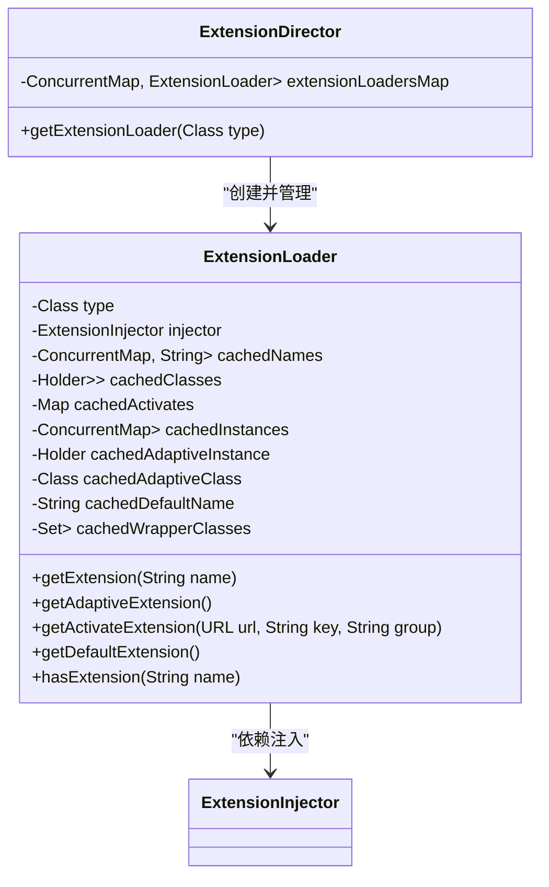

**图源**
- [ExtensionLoader.java](file://dubbo-common\src\main\java\org\apache\dubbo\common\extension\ExtensionLoader.java#L141-L1818)
- [ExtensionDirector.java](file://dubbo-common\src\main\java\org\apache\dubbo\common\extension\ExtensionDirector.java#L189-L308)

## 核心注解详解

### @SPI注解

@SPI注解用于标记一个接口为Dubbo的扩展点。被标记的接口可以通过ExtensionLoader加载其实现类。该注解是Dubbo SPI机制的基础，所有的扩展接口必须使用此注解标记。

@SPI注解的主要属性：
- **value**：指定默认的扩展实现名称，当未指定具体扩展时使用
- **scope**：定义扩展的作用域，包括FRAMEWORK（框架级）、APPLICATION（应用级）、MODULE（模块级）和SELF（自身作用域）

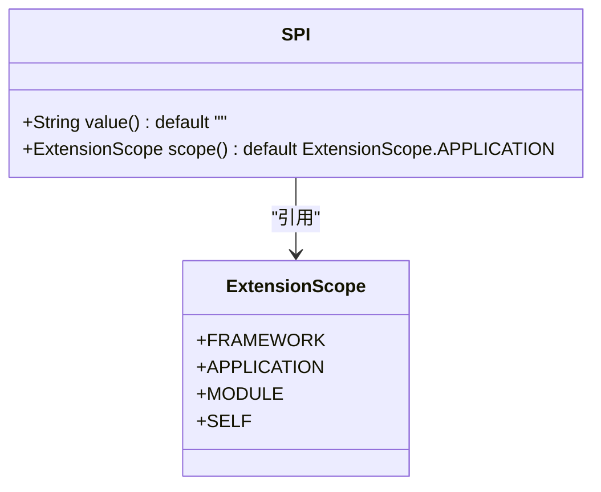

**图源**
- [SPI.java](file://dubbo-common\src\main\java\org\apache\dubbo\common\extension\SPI.java#L25-L154)

### @Adaptive注解

@Adaptive注解用于标记自适应扩展。自适应扩展是一种特殊的扩展实现，它可以根据运行时参数动态选择具体的扩展实现。这种机制在Dubbo中被广泛用于协议、序列化等需要根据配置动态选择实现的场景。

@Adaptive注解可以应用于类或方法：
- **类级别**：标记一个类为自适应扩展实现
- **方法级别**：标记一个方法为自适应方法，框架会为该方法生成代理代码

```mermaid
classDiagram
class Adaptive {
+String[] value() default {}
}
class URL {
+getParameter(String key)
+getAnyMethodParameter(String key)
}
Adaptive --> URL : "依赖参数"
```

**图源**
- [Adaptive.java](file://dubbo-common\src\main\java\org\apache\dubbo\common\extension\Adaptive.java#L27-L80)

### @Activate注解

@Activate注解用于标记一个扩展实现为可自动激活的扩展。当满足特定条件时，该扩展会自动被加载和使用。这在过滤器（Filter）、监听器（Listener）等场景中非常有用，可以根据配置自动启用相应的功能。

@Activate注解的主要属性：
- **group**：指定组条件，框架SPI定义了有效的组值
- **value**：指定URL参数中的键，当这些键存在时激活扩展
- **order**：指定扩展的优先级顺序
- **onClass**：当指定的类存在时才激活扩展

```mermaid
classDiagram
class Activate {
+String[] group() default {}
+String[] value() default {}
+int order() default 0
+String[] onClass() default {}
}
class ExtensionLoader {
+getActivateExtension(URL url, String key, String group)
}
Activate --> ExtensionLoader : "控制激活"
```

**图源**
- [Activate.java](file://dubbo-common\src\main\java\org\apache\dubbo\common\extension\Activate.java#L27-L140)

## 扩展点加载与缓存机制

### 扩展点加载流程

ExtensionLoader的扩展点加载流程如下：
1. 首先检查缓存中是否已加载过扩展类
2. 如果未加载，则通过加锁保证线程安全地加载扩展类
3. 从多个位置（META-INF/dubbo、META-INF/services等）读取扩展配置文件
4. 解析配置文件中的键值对，加载对应的扩展实现类
5. 缓存加载的扩展类信息

加载策略（LoadingStrategy）决定了扩展配置文件的位置和加载顺序。Dubbo支持多种加载策略，包括：
- DubboInternalLoadingStrategy：加载META-INF/dubbo/internal/目录下的配置
- DubboLoadingStrategy：加载META-INF/dubbo/目录下的配置
- ServicesLoadingStrategy：加载META-INF/services/目录下的配置

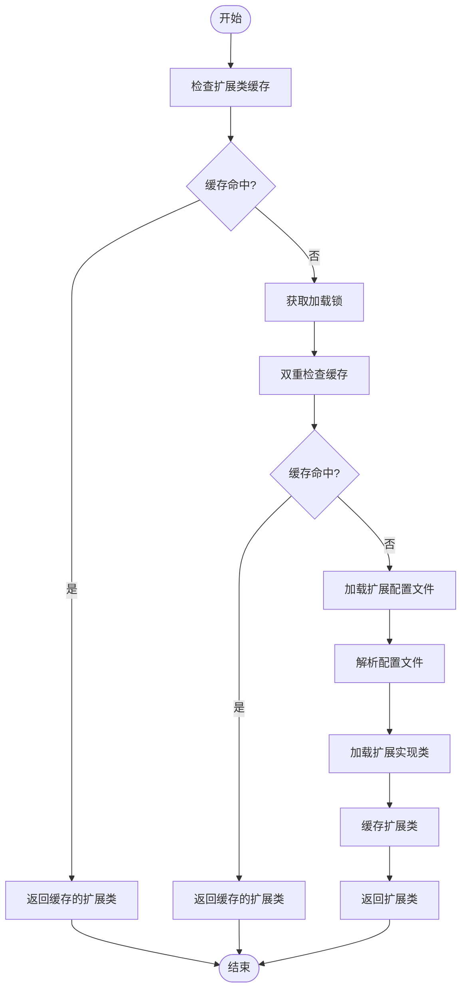

**图源**
- [ExtensionLoader.java](file://dubbo-common\src\main\java\org\apache\dubbo\common\extension\ExtensionLoader.java#L1250-L1349)

### 扩展实例缓存

ExtensionLoader对扩展实例进行了多级缓存，以提高性能：
- **类缓存**：缓存扩展实现类的Class对象
- **实例缓存**：缓存已创建的扩展实例
- **自适应实例缓存**：缓存自适应扩展实例
- **包装类缓存**：缓存扩展的包装类（Wrapper）

缓存机制确保了同一个扩展点的同一个实现只会被实例化一次，避免了重复创建对象的开销。

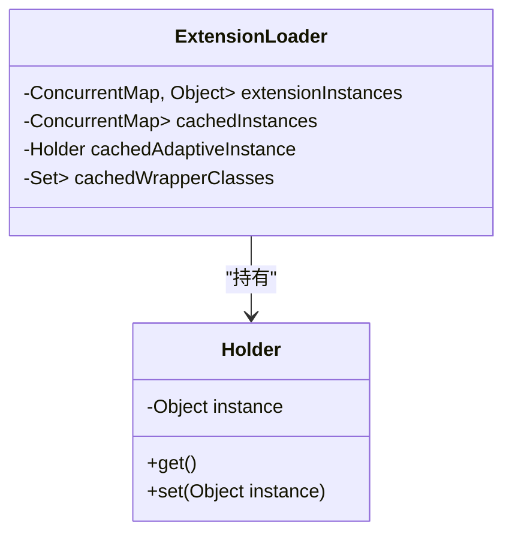

**图源**
- [ExtensionLoader.java](file://dubbo-common\src\main\java\org\apache\dubbo\common\extension\ExtensionLoader.java#L161-L224)

## 依赖注入机制

### 依赖注入实现

Dubbo的SPI机制支持自动依赖注入（IOC），即在创建扩展实例时，自动为其注入所需的依赖。依赖注入通过ExtensionInjector接口实现，ExtensionLoader在创建扩展实例后会调用injectExtension方法进行依赖注入。

依赖注入的实现原理：
1. 遍历扩展实例的所有方法
2. 找到setter方法（以set开头，有一个参数，且为public）
3. 检查方法是否被@DisableInject注解标记，如果是则跳过
4. 获取setter方法对应的属性名
5. 通过ExtensionInjector获取依赖实例
6. 调用setter方法注入依赖

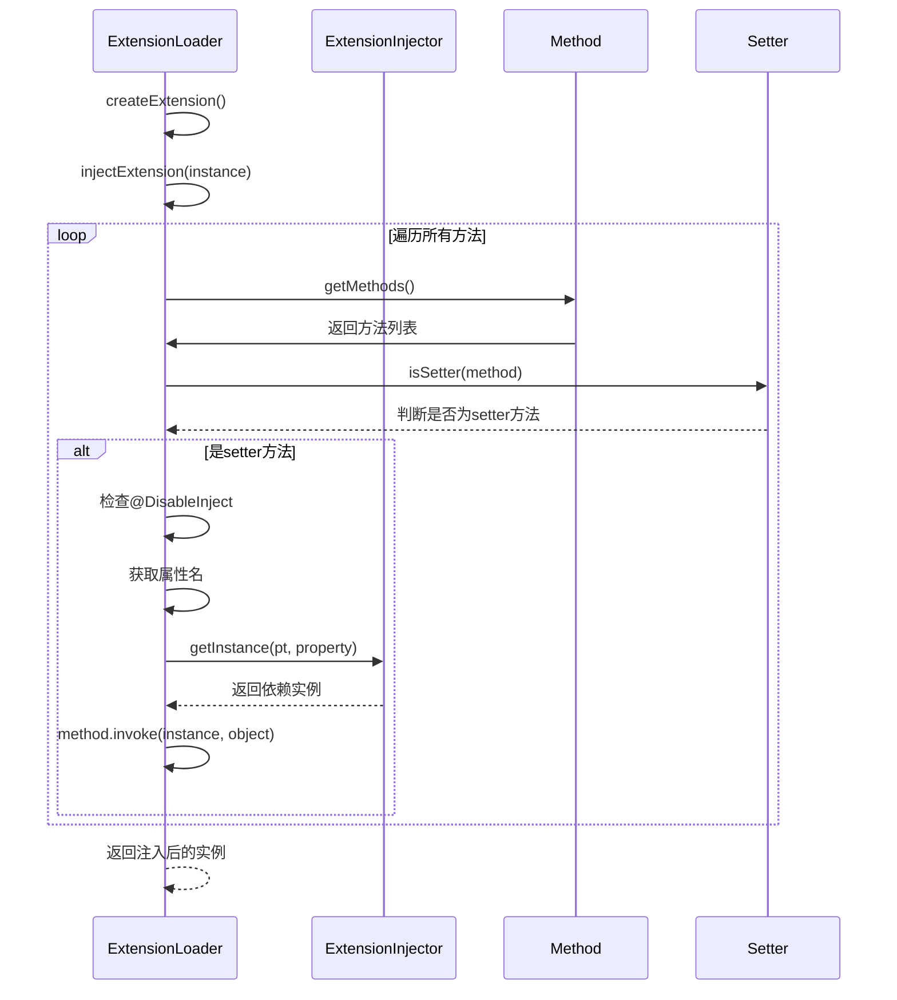

**图源**
- [ExtensionLoader.java](file://dubbo-common\src\main\java\org\apache\dubbo\common\extension\ExtensionLoader.java#L1151-L1204)

### 扩展后处理器

ExtensionLoader支持扩展后处理器（ExtensionPostProcessor），可以在扩展实例创建前后进行自定义处理。后处理器通过postProcessBeforeInitialization和postProcessAfterInitialization方法实现。

常见的后处理器功能包括：
- 设置扩展访问器（ExtensionAccessor）
- 进行AOP代理
- 执行初始化逻辑
- 进行资源注入

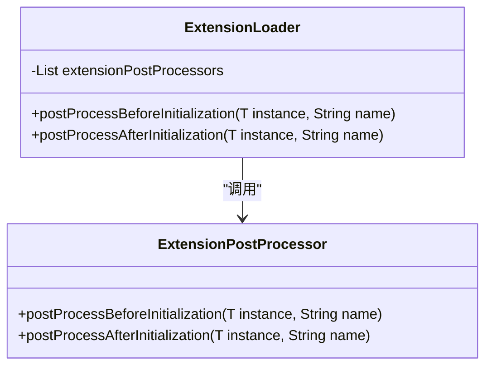

**图源**
- [ExtensionLoader.java](file://dubbo-common\src\main\java\org\apache\dubbo\common\extension\ExtensionLoader.java#L1124-L1145)

## 自适应扩展（Adaptive）

### 自适应扩展原理

自适应扩展是Dubbo SPI机制中最重要的特性之一。它允许在运行时根据参数动态选择具体的扩展实现，实现了"一次编写，处处适用"的设计理念。

自适应扩展的实现原理：
1. 当调用getAdaptiveExtension()方法时，ExtensionLoader会检查是否存在标记为@Adaptive的类
2. 如果存在，则直接返回该类的实例
3. 如果不存在，ExtensionLoader会动态生成一个代理类
4. 代理类的逻辑是根据URL中的参数值选择具体的扩展实现

自适应扩展的生成过程：
1. 创建AdaptiveClassCodeGenerator实例
2. 生成代理类的Java代码
3. 使用Compiler编译生成的代码
4. 加载编译后的类并创建实例

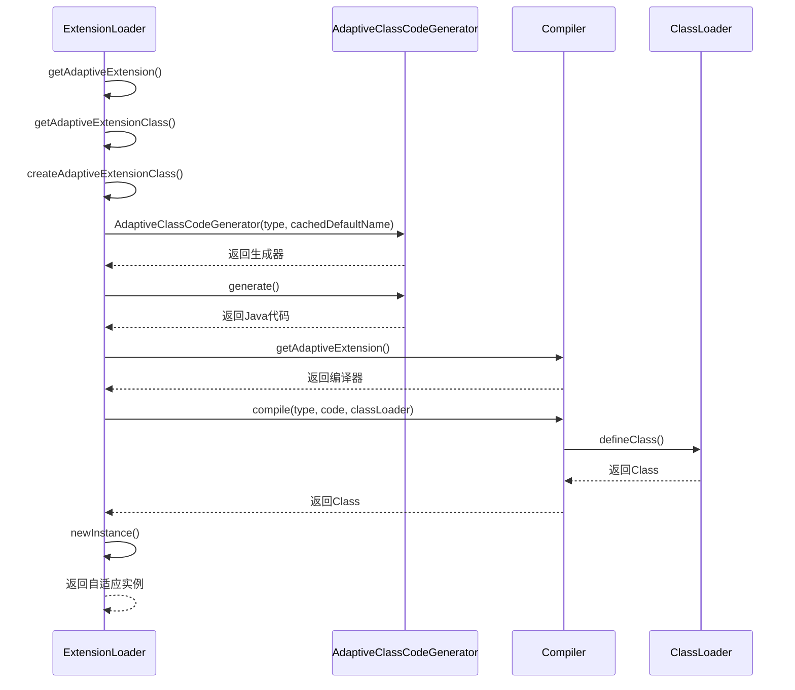

**图源**
- [ExtensionLoader.java](file://dubbo-common\src\main\java\org\apache\dubbo\common\extension\ExtensionLoader.java#L1729-L1767)

### 自适应扩展应用

自适应扩展在Dubbo中有广泛的应用，典型的例子包括：
- **Protocol**：根据URL中的协议参数选择具体的协议实现
- **Cluster**：根据集群策略选择具体的集群实现
- **LoadBalance**：根据负载均衡策略选择具体的负载均衡算法
- **Serialization**：根据序列化类型选择具体的序列化实现

例如，当调用Protocol的自适应扩展时，系统会检查URL中的"protocol"参数，然后选择对应的协议实现（如dubbo、http、rest等）。

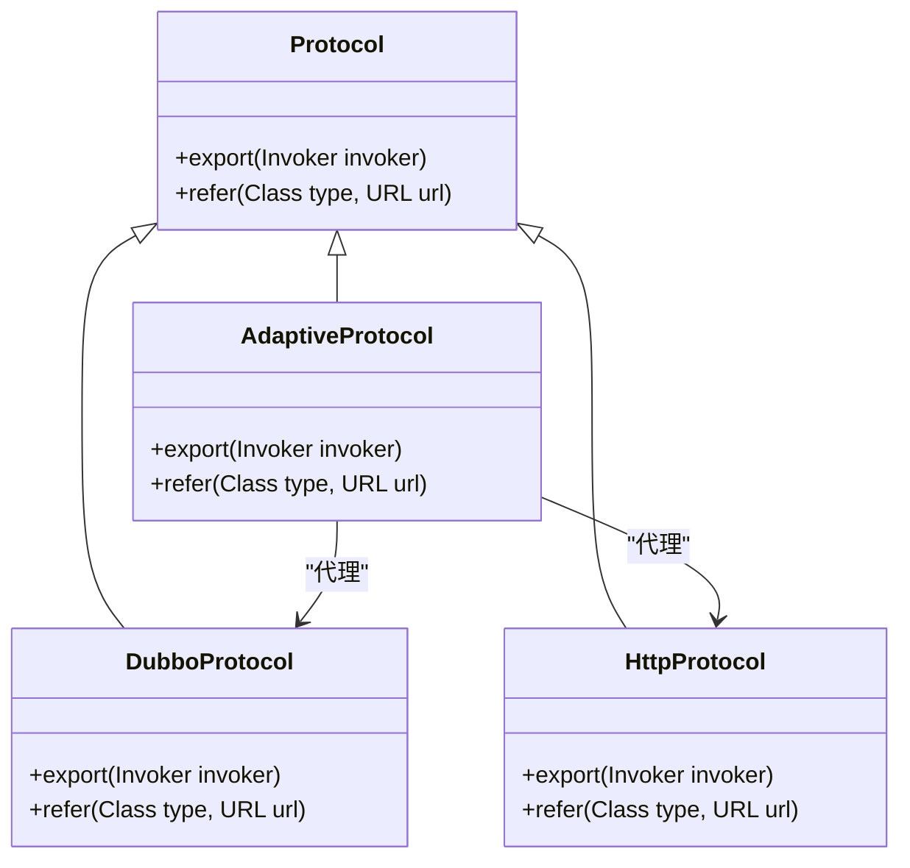

**图源**
- [ExtensionLoader.java](file://dubbo-common\src\main\java\org\apache\dubbo\common\extension\ExtensionLoader.java#L1015-L1041)

## 自动激活机制（Activate）

### 自动激活原理

@Activate注解用于实现扩展的自动激活机制。当满足特定条件时，标记为@Activate的扩展会自动被加载和使用。这种机制在需要根据配置动态启用功能的场景中非常有用。

自动激活的判断条件包括：
- **group条件**：检查扩展的group属性是否与当前组匹配
- **value条件**：检查URL中是否包含指定的参数键
- **onClass条件**：检查指定的类是否存在于类路径中

ExtensionLoader通过getActivateExtension方法获取所有满足条件的激活扩展，这些扩展会按照优先级顺序进行排序。

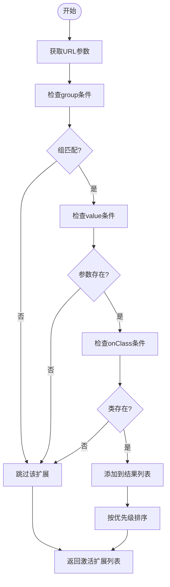

**图源**
- [ExtensionLoader.java](file://dubbo-common\src\main\java\org\apache\dubbo\common\extension\ExtensionLoader.java#L574-L668)

### 优先级排序

自动激活的扩展会根据优先级进行排序，排序规则如下：
1. 首先按照@Activate注解的order属性进行升序排序
2. 对于order相同的扩展，按照类的自然顺序排序
3. 可以通过@Activate的before和after属性指定相对顺序（已废弃）

优先级排序确保了扩展的执行顺序是可预测和可控的，这对于过滤器链、拦截器等需要特定执行顺序的场景非常重要。

```mermaid
classDiagram
    class Activate {
        +int order() default 0
        +String[] before() default {}
        +String[] after() default {}
    }
    class ActivateComparator {
        +compare(Class~<?> c1, Class~<?> c2)
    }
    class ExtensionLoader {
        -ActivateComparator activateComparator
        +getActivateExtension(URL url, String key, String group)
    }
    ActivateComparator --> Activate : "使用order"
    ExtensionLoader --> ActivateComparator : "用于排序"
```

**图源**
- [ExtensionLoader.java](file://dubbo-common\src\main\java\org\apache\dubbo\common\extension\ExtensionLoader.java#L670-L688)

## 扩展工厂（ExtensionFactory）

### ExtensionFactory与ExtensionInjector

ExtensionFactory是Dubbo早期版本中用于扩展注入的接口，但在新版本中已被ExtensionInjector取代。ExtensionFactory继承自ExtensionInjector，并提供了默认的getInstance实现。

ExtensionInjector是当前推荐使用的扩展注入接口，它提供了更灵活的注入机制。系统会通过AdaptiveExtensionInjector来协调多个ExtensionInjector的实现，按照优先级顺序尝试获取实例。

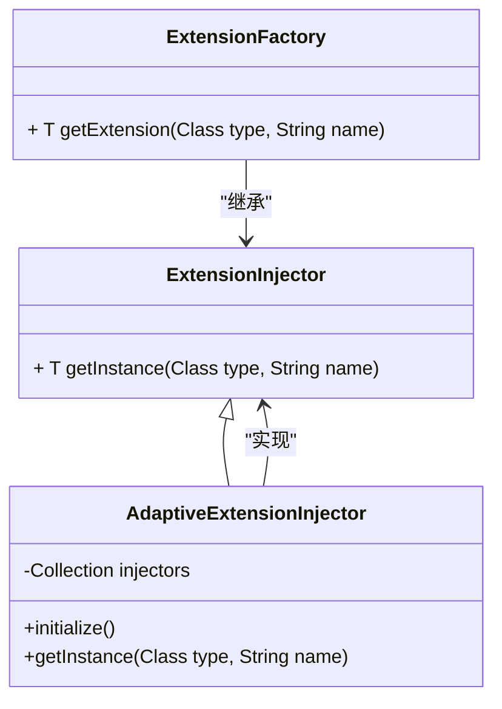

**图源**
- [ExtensionFactory.java](file://dubbo-common\src\main\java\org\apache\dubbo\common\extension\ExtensionFactory.java#L19-L48)
- [AdaptiveExtensionInjector.java](file://dubbo-common\src\main\java\org\apache\dubbo\common\extension\inject\AdaptiveExtensionInjector.java#L37-L85)

### 扩展注入流程

扩展注入的完整流程如下：
1. 创建AdaptiveExtensionInjector实例
2. 调用initialize方法初始化
3. 获取所有支持的ExtensionInjector实现
4. 按照顺序尝试通过每个ExtensionInjector获取实例
5. 返回第一个成功获取的实例

这种设计模式提供了很好的扩展性，允许开发者自定义扩展注入逻辑，同时保持了向后兼容性。

```mermaid
sequenceDiagram
participant AEI as AdaptiveExtensionInjector
participant EL as ExtensionLoader
participant EI as ExtensionInjector
EL->>AEI : injectExtension(instance)
AEI->>AEI : initialize()
AEI->>EL : getExtensionLoader(ExtensionInjector.class)
EL-->>AEI : 返回加载器
AEI->>EL : getSupportedExtensions()
EL-->>AEI : 返回扩展列表
loop 遍历每个ExtensionInjector
AEI->>EI : getInstance(type, name)
alt 成功获取实例
EI-->>AEI : 返回实例
AEI-->>AEI : 返回实例
break
end
end
AEI-->>EL : 返回注入结果
```

**图源**
- [AdaptiveExtensionInjector.java](file://dubbo-common\src\main\java\org\apache\dubbo\common\extension\inject\AdaptiveExtensionInjector.java#L62-L85)

## SPI机制应用案例

### 协议扩展

Dubbo的协议扩展是SPI机制的典型应用。通过Protocol扩展点，Dubbo支持多种通信协议，如Dubbo协议、HTTP协议、REST协议等。

协议扩展的实现方式：
1. Protocol接口标记为@SPI注解，指定默认实现为"dubbo"
2. 各种协议实现类（如DubboProtocol、HttpProtocol）通过配置文件注册
3. 使用@Adaptive注解实现自适应协议选择
4. 在运行时根据URL中的协议参数选择具体的协议实现

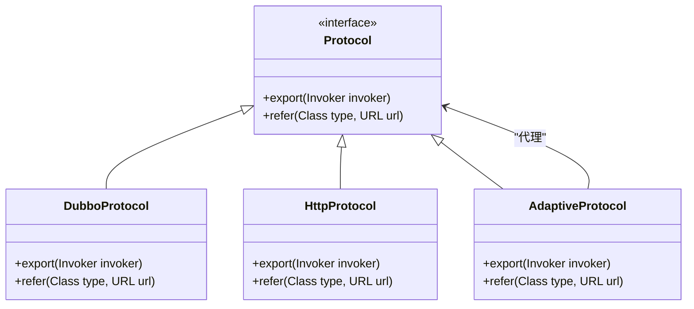

**图源**
- [ExtensionLoader.java](file://dubbo-common\src\main\java\org\apache\dubbo\common\extension\ExtensionLoader.java)
- [SPI.java](file://dubbo-common\src\main\java\org\apache\dubbo\common\extension\SPI.java)

### 序列化扩展

序列化扩展是另一个重要的SPI应用。Dubbo支持多种序列化方式，如Hessian2、JSON、Protobuf等，开发者可以根据需要选择合适的序列化方式。

序列化扩展的特点：
- 通过Serialization扩展点实现
- 每种序列化方式都有对应的实现类
- 使用自适应扩展根据配置动态选择序列化方式
- 支持自定义序列化实现

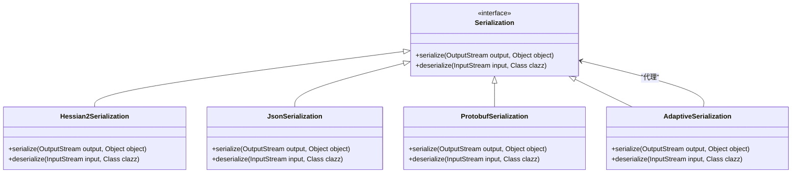

**图源**
- [ExtensionLoader.java](file://dubbo-common\src\main\java\org\apache\dubbo\common\extension\ExtensionLoader.java)
- [SPI.java](file://dubbo-common\src\main\java\org\apache\dubbo\common\extension\SPI.java)

## 自定义扩展点示例

### 接口定义

创建自定义扩展点的第一步是定义扩展接口。接口需要使用@SPI注解标记，并指定默认实现。

```java
@SPI("default")
public interface MyExtension {
    void execute(String param);
}
```

### 实现类编写

编写扩展接口的具体实现类。每个实现类对应一个扩展名称。

```java
public class DefaultMyExtension implements MyExtension {
    @Override
    public void execute(String param) {
        System.out.println("Default implementation: " + param);
    }
}

public class CustomMyExtension implements MyExtension {
    @Override
    public void execute(String param) {
        System.out.println("Custom implementation: " + param);
    }
}
```

### 配置文件创建

在META-INF/dubbo目录下创建配置文件，文件名为扩展接口的全限定名，内容为键值对格式。

```
# 文件: META-INF/dubbo/org.apache.dubbo.MyExtension
default=com.example.DefaultMyExtension
custom=com.example.CustomMyExtension
```

### 使用扩展

通过ExtensionLoader获取并使用扩展实例。

```java
ExtensionLoader<MyExtension> loader = ExtensionLoader.getExtensionLoader(MyExtension.class);
MyExtension defaultExt = loader.getDefaultExtension();
MyExtension customExt = loader.getExtension("custom");

defaultExt.execute("hello");
customExt.execute("world");
```

**本文档引用文件**   
- [ExtensionLoader.java](file://dubbo-common\src\main\java\org\apache\dubbo\common\extension\ExtensionLoader.java)
- [SPI.java](file://dubbo-common\src\main\java\org\apache\dubbo\common\extension\SPI.java)

## 扩展机制类图与时序图

### ExtensionLoader类图

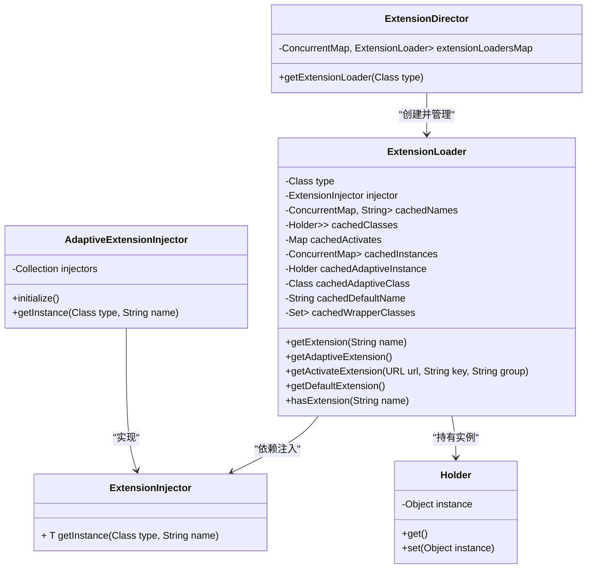

**图源**
- [ExtensionLoader.java](file://dubbo-common\src\main\java\org\apache\dubbo\common\extension\ExtensionLoader.java#L141-L1818)
- [ExtensionDirector.java](file://dubbo-common\src\main\java\org\apache\dubbo\common\extension\ExtensionDirector.java#L189-L308)
- [AdaptiveExtensionInjector.java](file://dubbo-common\src\main\java\org\apache\dubbo\common\extension\inject\AdaptiveExtensionInjector.java#L37-L85)

### 扩展点加载时序图

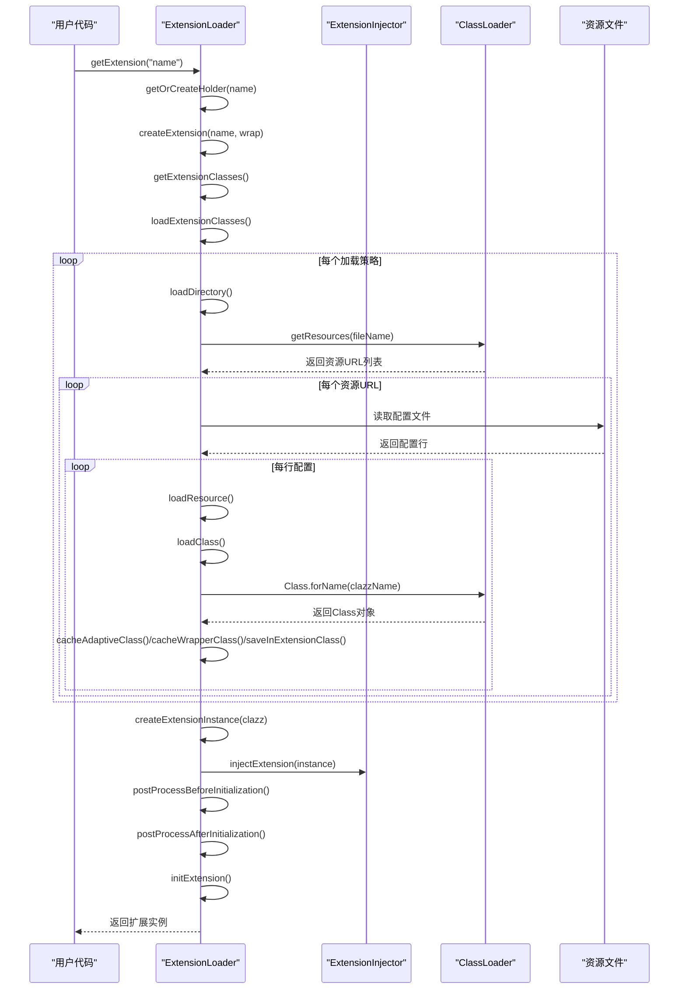

**图源**
- [ExtensionLoader.java](file://dubbo-common\src\main\java\org\apache\dubbo\common\extension\ExtensionLoader.java#L785-L1118)