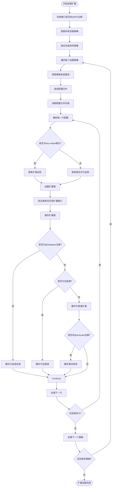
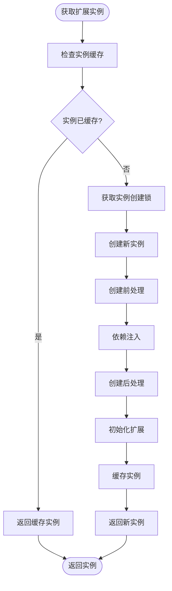
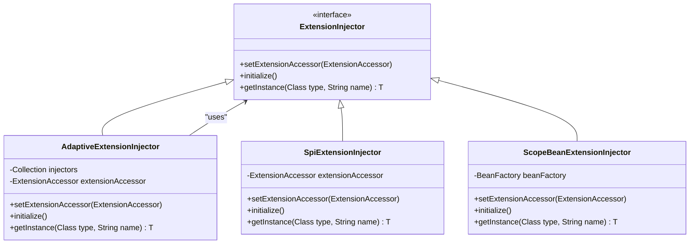
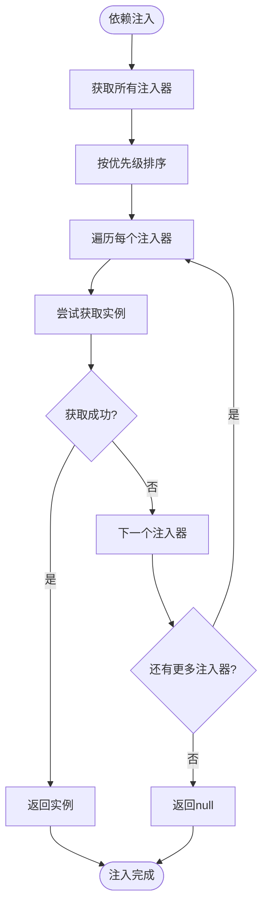
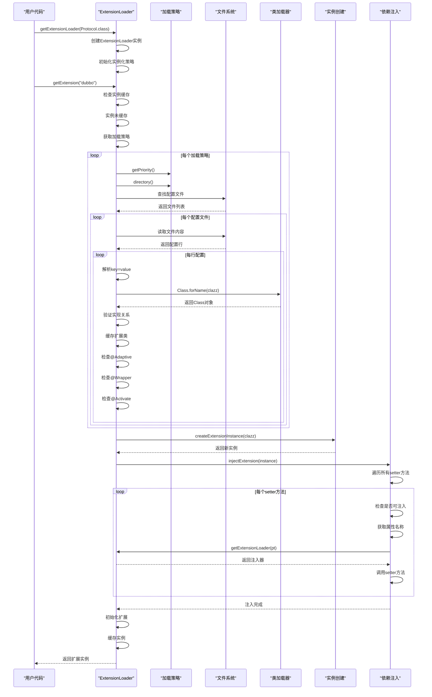

# 扩展加载机制

<cite>
**本文档引用的文件**   
- [ExtensionLoader.java](file://dubbo-common\src\main\java\org\apache\dubbo\common\extension\ExtensionLoader.java)
- [SPI.java](file://dubbo-common\src\main\java\org\apache\dubbo\common\extension\SPI.java)
- [LoadingStrategy.java](file://dubbo-common\src\main\java\org\apache\dubbo\common\extension\LoadingStrategy.java)
- [DubboInternalLoadingStrategy.java](file://dubbo-common\src\main\java\org\apache\dubbo\common\extension\DubboInternalLoadingStrategy.java)
- [DubboLoadingStrategy.java](file://dubbo-common\src\main\java\org\apache\dubbo\common\extension\DubboLoadingStrategy.java)
- [ServicesLoadingStrategy.java](file://dubbo-common\src\main\java\org\apache\dubbo\common\extension\ServicesLoadingStrategy.java)
- [AdaptiveExtensionInjector.java](file://dubbo-common\src\main\java\org\apache\dubbo\common\extension\inject\AdaptiveExtensionInjector.java)
- [ExtensionScope.java](file://dubbo-common\src\main\java\org\apache\dubbo\common\extension\ExtensionScope.java)
- [special_spi.properties](file://dubbo-common\src\test\resources\special_spi.properties)
- [org.apache.dubbo.common.extension.ExtensionInjector](file://dubbo-common\src\main\resources\META-INF\dubbo\internal\org.apache.dubbo.common.extension.ExtensionInjector)
</cite>

## 目录
1. [引言](#引言)
2. [扩展点接口规范](#扩展点接口规范)
3. [扩展加载流程](#扩展加载流程)
4. [扩展实例创建与管理](#扩展实例创建与管理)
5. [扩展依赖注入机制](#扩展依赖注入机制)
6. [扩展加载时序图](#扩展加载时序图)
7. [扩展加载状态图](#扩展加载状态图)
8. [扩展加载调试方法](#扩展加载调试方法)
9. [结论](#结论)

## 引言
Dubbo的扩展加载机制是其核心特性之一，通过ExtensionLoader实现了灵活的SPI（Service Provider Interface）扩展点加载。该机制允许开发者在不修改框架源码的情况下，通过配置文件定义和加载自定义的扩展实现。ExtensionLoader负责管理扩展点的加载、实例化、依赖注入和生命周期管理，为Dubbo提供了强大的可扩展性。

**扩展加载机制的核心特点包括：**
- 支持多种配置文件目录（META-INF/dubbo、META-INF/dubbo/internal、META-INF/services）
- 基于@SPI注解的扩展点声明
- 单例模式和原型模式的实例管理
- 自动依赖注入（IOC）
- AOP式的包装器机制
- 自适应扩展（Adaptive）的动态生成

## 扩展点接口规范
在Dubbo中，扩展点接口必须遵循特定的规范才能被ExtensionLoader正确识别和加载。

### @SPI注解要求
扩展点接口必须使用@SPI注解进行标记，该注解定义了扩展点的基本属性：

```java
@Documented
@Retention(RetentionPolicy.RUNTIME)
@Target({ElementType.TYPE})
public @interface SPI {
    /**
     * 默认扩展名称
     * 指定该扩展接口的默认实现，当未指定具体扩展时使用
     * 
     * @return 默认扩展名称，默认为空字符串
     * default extension name
     */
    String value() default "";

    /**
     * SPI的作用域
     * 定义扩展实例的生命周期和可见性范围
     * 
     * @return 扩展作用域，默认为应用级作用域
     * scope of SPI, default value is application scope.
     */
    ExtensionScope scope() default ExtensionScope.APPLICATION;
}
```

**@SPI注解的关键属性：**
- **value**: 指定默认扩展名称，当未明确指定扩展时使用该默认实现
- **scope**: 定义扩展的作用域，包括FRAMEWORK、APPLICATION、MODULE和SELF四种级别

### 扩展作用域
ExtensionScope枚举定义了扩展实例的生命周期范围：

```java
public enum ExtensionScope {
    /**
     * 框架作用域
     * 扩展实例在框架级别共享，所有应用程序共享同一个实例
     */
    FRAMEWORK,

    /**
     * 应用作用域
     * 扩展实例在应用程序级别共享，不同应用程序有独立的实例
     */
    APPLICATION,

    /**
     * 模块作用域
     * 扩展实例在模块级别使用，不同模块创建不同的扩展实例
     */
    MODULE,

    /**
     * 自给自足作用域
     * 为每个作用域创建一个实例，用于特殊的SPI扩展
     */
    SELF
}
```

**作用域选择原则：**
- **FRAMEWORK**: 适用于框架级别的全局服务，如编译器、日志适配器等
- **APPLICATION**: 适用于应用级别的服务，如协议、序列化等
- **MODULE**: 适用于模块级别的服务，实现模块间隔离
- **SELF**: 适用于需要为每个作用域创建独立实例的特殊扩展

**Section sources**
- [SPI.java](file://dubbo-common\src\main\java\org\apache\dubbo\common\extension\SPI.java#L99-L153)
- [ExtensionScope.java](file://dubbo-common\src\main\java\org\apache\dubbo\common\extension\ExtensionScope.java#L91-L124)

## 扩展加载流程
ExtensionLoader的扩展加载流程是一个复杂但高效的过程，涉及多个步骤和策略。

### 加载策略
Dubbo定义了三种主要的加载策略，通过LoadingStrategy接口实现：

```java
public interface LoadingStrategy extends Prioritized {
    /**
     * 获取目录路径
     * 
     * @return 目录路径
     */
    String directory();

    /**
     * 是否优先使用扩展类加载器
     * 
     * @return 如果优先使用扩展类加载器返回true，否则返回false
     */
    default boolean preferExtensionClassLoader() {
        return false;
    }

    /**
     * 指示当前{@link LoadingStrategy}是否支持覆盖其他优先级较低的实例。
     * 
     * @return 如果支持返回<code>true</code>，否则返回<code>false</code>
     */
    default boolean overridden() {
        return false;
    }

    /**
     * 获取名称
     * 
     * @return 类名
     */
    default String getName() {
        return this.getClass().getSimpleName();
    }
}
```

**三种内置加载策略：**

1. **DubboInternalLoadingStrategy**
   - 目录路径：META-INF/dubbo/internal/
   - 优先级：MAX_PRIORITY（最高优先级）
   - 用途：加载Dubbo内部核心扩展
   - 名称：DUBBO_INTERNAL

2. **DubboLoadingStrategy**
   - 目录路径：META-INF/dubbo/
   - 优先级：NORMAL_PRIORITY（正常优先级）
   - 用途：加载用户自定义扩展
   - 名称：DUBBO

3. **ServicesLoadingStrategy**
   - 目录路径：META-INF/services/
   - 优先级：MIN_PRIORITY（最低优先级）
   - 用途：兼容Java标准的SPI机制
   - 名称：SERVICES

### 配置文件加载
ExtensionLoader按照优先级顺序从不同目录加载扩展配置文件：



**配置文件格式：**
- 旧格式（已废弃）：
```
com.foo.XxxProtocol
com.foo.YyyProtocol
```

- 新格式（推荐）：
```
xxx=com.foo.XxxProtocol
yyy=com.foo.YyyProtocol
```

**新格式的优势：**
1. 避免因第三方库缺失导致的类初始化失败
2. 提供更清晰的扩展名称映射
3. 支持多个名称映射到同一个实现类
4. 便于调试和错误定位

### 特殊SPI加载策略
Dubbo通过special_spi.properties文件优化特定SPI的加载性能：

```properties
org.apache.dubbo.common.extension.SPI1=ALL
org.apache.dubbo.common.extension.SPI2=DUBBO_INTERNAL
org.apache.dubbo.common.extension.SPI3=DUBBO_INTERNAL
org.apache.dubbo.common.extension.SPI4=SERVICES
```

该配置文件指定了特定SPI接口的加载策略，避免扫描多个类加载器资源，提高启动速度。

**Section sources**
- [LoadingStrategy.java](file://dubbo-common\src\main\java\org\apache\dubbo\common\extension\LoadingStrategy.java#L1-L144)
- [DubboInternalLoadingStrategy.java](file://dubbo-common\src\main\java\org\apache\dubbo\common\extension\DubboInternalLoadingStrategy.java#L1-L65)
- [DubboLoadingStrategy.java](file://dubbo-common\src\main\java\org\apache\dubbo\common\extension\DubboLoadingStrategy.java#L1-L79)
- [ServicesLoadingStrategy.java](file://dubbo-common\src\main\java\org\apache\dubbo\common\extension\ServicesLoadingStrategy.java#L1-L79)
- [special_spi.properties](file://dubbo-common\src\test\resources\special_spi.properties#L1-L4)

## 扩展实例创建与管理
ExtensionLoader不仅负责加载扩展类，还管理扩展实例的创建、缓存和生命周期。

### 实例创建流程
扩展实例的创建遵循严格的流程，确保线程安全和正确性：



### 单例模式与原型模式
ExtensionLoader支持两种实例管理模式：

**单例模式（默认）：**
- 每个扩展名称对应一个实例
- 实例在第一次获取时创建，之后重复使用
- 通过ConcurrentMap缓存实例
- 适用于无状态或共享状态的扩展

**原型模式：**
- 每次获取都创建新实例
- 通过传递wrap=false参数实现
- 适用于有状态或需要独立实例的扩展

```java
public T getExtension(String name, boolean wrap) {
    checkDestroyed();
    if (StringUtils.isEmpty(name)) {
        throw new IllegalArgumentException("Extension name == null");
    }
    if ("true".equals(name)) {
        return getDefaultExtension();
    }
    String cacheKey = name;
    if (!wrap) {
        cacheKey += "_origin";
    }
    final Holder<Object> holder = getOrCreateHolder(cacheKey);
    Object instance = holder.get();
    if (instance == null) {
        synchronized (holder) {
            instance = holder.get();
            if (instance == null) {
                instance = createExtension(name, wrap);
                holder.set(instance);
            }
        }
    }
    return (T) instance;
}
```

### 包装器机制
ExtensionLoader支持AOP式的包装器机制，允许在不修改原始实现的情况下增强功能：

```java
private T createExtension(String name, boolean wrap) {
    Class<?> clazz = getExtensionClasses().get(name);
    if (clazz == null || unacceptableExceptions.contains(name)) {
        throw findException(name);
    }
    try {
        T instance = (T) extensionInstances.get(clazz);
        if (instance == null) {
            extensionInstances.putIfAbsent(clazz, createExtensionInstance(clazz));
            instance = (T) extensionInstances.get(clazz);
            instance = postProcessBeforeInitialization(instance, name);
            injectExtension(instance);
            instance = postProcessAfterInitialization(instance, name);
        }

        if (wrap) {
            List<Class<?>> wrapperClassesList = new ArrayList<>();
            if (cachedWrapperClasses != null) {
                wrapperClassesList.addAll(cachedWrapperClasses);
                wrapperClassesList.sort(WrapperComparator.COMPARATOR);
                Collections.reverse(wrapperClassesList);
            }

            if (CollectionUtils.isNotEmpty(wrapperClassesList)) {
                for (Class<?> wrapperClass : wrapperClassesList) {
                    Wrapper wrapper = wrapperClass.getAnnotation(Wrapper.class);
                    boolean match = (wrapper == null)
                            || ((ArrayUtils.isEmpty(wrapper.matches())
                                            || ArrayUtils.contains(wrapper.matches(), name))
                                    && !ArrayUtils.contains(wrapper.mismatches(), name));
                    if (match) {
                        instance = (T) wrapperClass.getConstructor(type).newInstance(instance);
                        instance = postProcessBeforeInitialization(instance, name);
                        injectExtension(instance);
                        instance = postProcessAfterInitialization(instance, name);
                    }
                }
            }
        }

        initExtension(instance);
        return instance;
    } catch (Throwable t) {
        throw new IllegalStateException(
                "Extension instance (name: " + name + ", class: " + type + ") couldn't be instantiated: "
                        + t.getMessage(),
                t);
    }
}
```

**包装器匹配规则：**
- 无@Wrapper注解：匹配所有扩展
- matches属性：只匹配指定名称的扩展
- mismatches属性：排除指定名称的扩展
- 同时存在matches和mismatches：满足matches且不满足mismatches

**包装器排序：**
- 按照@Wrapper注解的order属性排序
- order值小的先应用
- 最终形成包装器链

**Section sources**
- [ExtensionLoader.java](file://dubbo-common\src\main\java\org\apache\dubbo\common\extension\ExtensionLoader.java#L800-L1182)

## 扩展依赖注入机制
ExtensionLoader提供了强大的依赖注入功能，支持setter注入和构造函数注入。

### 依赖注入实现
依赖注入主要通过injectExtension方法实现：

```java
private T injectExtension(T instance) {
    if (injector == null) {
        return instance;
    }

    try {
        for (Method method : instance.getClass().getMethods()) {
            if (!isSetter(method)) {
                continue;
            }
            /**
             * Check {@link DisableInject} to see if we need auto-injection for this property
             */
            if (method.isAnnotationPresent(DisableInject.class)) {
                continue;
            }

            // When spiXXX implements ScopeModelAware, ExtensionAccessorAware,
            // the setXXX of ScopeModelAware and ExtensionAccessorAware does not need to be injected
            if (method.getDeclaringClass() == ScopeModelAware.class) {
                continue;
            }
            if (instance instanceof ScopeModelAware || instance instanceof ExtensionAccessorAware) {
                if (ignoredInjectMethodsDesc.contains(ReflectUtils.getDesc(method))) {
                    continue;
                }
            }

            Class<?> pt = method.getParameterTypes()[0];
            if (ReflectUtils.isPrimitives(pt)) {
                continue;
            }

            try {
                String property = getSetterProperty(method);
                Object object = injector.getInstance(pt, property);
                if (object != null) {
                    method.invoke(instance, object);
                }
            } catch (Exception e) {
                logger.error(
                        COMMON_ERROR_LOAD_EXTENSION,
                        "",
                        "",
                        "Failed to inject via method " + method.getName() + " of interface " + type.getName() + ": "
                                + e.getMessage(),
                        e);
            }
        }
    } catch (Exception e) {
        logger.error(COMMON_ERROR_LOAD_EXTENSION, "", "", e.getMessage(), e);
    }
    return instance;
}
```

### 注入器链
Dubbo使用注入器链模式实现依赖注入，支持多种注入源：



**注入器类型：**
- **AdaptiveExtensionInjector**: 自适应注入器，组合其他注入器
- **SpiExtensionInjector**: SPI注入器，通过ExtensionLoader获取实例
- **ScopeBeanExtensionInjector**: 作用域Bean注入器，从BeanFactory获取实例

### 注入流程
依赖注入遵循特定的优先级顺序：



### 配置示例
在META-INF/dubbo/internal目录下配置ExtensionInjector：

```
adaptive=org.apache.dubbo.common.extension.inject.AdaptiveExtensionInjector
spi=org.apache.dubbo.common.extension.inject.SpiExtensionInjector
scopeBean=org.apache.dubbo.common.beans.ScopeBeanExtensionInjector
```

**注入规则：**
1. 只注入public的setter方法
2. 忽略基本类型参数
3. 支持通过@DisableInject注解禁用特定属性的注入
4. 忽略ScopeModelAware和ExtensionAccessorAware接口的方法

**Section sources**
- [ExtensionLoader.java](file://dubbo-common\src\main\java\org\apache\dubbo\common\extension\ExtensionLoader.java#L1151-L1204)
- [AdaptiveExtensionInjector.java](file://dubbo-common\src\main\java\org\apache\dubbo\common\extension\inject\AdaptiveExtensionInjector.java#L37-L85)
- [org.apache.dubbo.common.extension.ExtensionInjector](file://dubbo-common\src\main\resources\META-INF\dubbo\internal\org.apache.dubbo.common.extension.ExtensionInjector#L1-L4)

## 扩展加载时序图
以下是ExtensionLoader加载扩展的完整时序图：



**时序图关键步骤：**
1. **初始化阶段**：创建ExtensionLoader实例，初始化相关组件
2. **加载策略阶段**：获取并排序所有加载策略
3. **配置文件扫描阶段**：按策略顺序扫描配置文件
4. **类加载阶段**：加载并验证扩展类
5. **元数据处理阶段**：处理@Adaptive、@Wrapper、@Activate等注解
6. **实例创建阶段**：创建扩展实例
7. **依赖注入阶段**：自动注入依赖的扩展
8. **初始化阶段**：调用扩展的初始化方法
9. **缓存阶段**：将实例缓存以供后续使用

## 扩展加载状态图
以下是ExtensionLoader的完整状态图：

```mermaid
stateDiagram-v2
[*] --> 初始化
state 初始化 {
[*] --> 创建实例
创建实例 --> 设置作用域
设置作用域 --> 初始化完成
}
初始化完成 --> 加载扩展类
state 加载扩展类 {
[*] --> 获取加载策略
获取加载策略 --> 排序策略
排序策略 --> 处理策略
state 处理策略 {
[*] --> 获取目录
获取目录 --> 查找文件
查找文件 --> 读取内容
读取内容 --> 解析配置
state 解析配置 {
[*] --> 读取行
读取行 --> 检查格式
检查格式 --> |key=value| 提取名称
检查格式 --> |仅类名| 使用类名
提取名称 --> 加载类
使用类名 --> 加载类
加载类 --> 验证实现
验证实现 --> 缓存类
缓存类 --> 处理注解
state 处理注解 {
[*] --> 检查Adaptive
检查Adaptive --> |是| 缓存自适应
检查Adaptive --> |否| 检查Wrapper
检查Wrapper --> |是| 缓存包装
检查Wrapper --> |否| 检查Activate
检查Activate --> |是| 缓存激活
检查Activate --> |否| 完成
缓存自适应 --> 完成
缓存包装 --> 完成
缓存激活 --> 完成
}
完成 --> 下一行
下一行 --> 是否结束
是否结束 --> |否| 读取行
是否结束 --> |是| 结束
}
结束 --> 下一策略
下一策略 --> 是否结束
是否结束 --> |否| 处理策略
是否结束 --> |是| 结束
}
结束 --> 加载完成
}
加载完成 --> 创建实例
state 创建实例 {
[*] --> 检查缓存
检查缓存 --> |已缓存| 返回缓存
检查缓存 --> |未缓存| 获取锁
获取锁 --> 创建新实例
创建新实例 --> 前处理
前处理 --> 依赖注入
依赖注入 --> 后处理
后处理 --> 初始化
初始化 --> 缓存实例
缓存实例 --> 返回实例
}
创建实例 --> 实例使用
state 实例使用 {
[*] --> 方法调用
方法调用 --> 包装器链
包装器链 --> 原始方法
原始方法 --> 返回结果
}
实例使用 --> 销毁
state 销毁 {
[*] --> 清理缓存
清理缓存 --> 销毁实例
销毁实例 --> 完成
}
销毁 --> [*]
```

**状态图说明：**
- **初始化阶段**：创建ExtensionLoader实例并设置作用域
- **加载扩展类阶段**：扫描配置文件并加载扩展类
- **创建实例阶段**：创建扩展实例并进行依赖注入
- **实例使用阶段**：通过包装器链调用扩展方法
- **销毁阶段**：清理缓存并销毁实例

## 扩展加载调试方法
当遇到扩展加载问题时，可以使用以下方法进行调试。

### 常见问题诊断
**1. 扩展未找到问题**
```java
private IllegalStateException findException(String name) {
    StringBuilder buf = new StringBuilder("No such extension " + type.getName() + " by name " + name);

    int i = 1;
    for (Map.Entry<String, IllegalStateException> entry : exceptions.entrySet()) {
        if (entry.getKey().toLowerCase().startsWith(name.toLowerCase())) {
            if (i == 1) {
                buf.append(", possible causes: ");
            }
            buf.append("\r\n(");
            buf.append(i++);
            buf.append(") ");
            buf.append(entry.getKey());
            buf.append(":\r\n");
            buf.append(StringUtils.toString(entry.getValue()));
        }
    }

    if (i == 1) {
        buf.append(", no related exception was found, please check whether related SPI module is missing.");
    }
    return new IllegalStateException(buf.toString());
}
```

**诊断步骤：**
1. 检查扩展接口是否有@SPI注解
2. 确认配置文件路径和名称正确
3. 验证类名拼写是否正确
4. 检查类路径是否包含实现类

**2. 类加载失败问题**
```java
private void loadResource(
        Map<String, Class<?>> extensionClasses,
        ClassLoader classLoader,
        java.net.URL resourceURL,
        boolean overridden,
        String[] includedPackages,
        String[] excludedPackages,
        String[] onlyExtensionClassLoaderPackages) {
    try {
        List<String> newContentList = getResourceContent(resourceURL);
        String clazz;
        for (String line : newContentList) {
            try {
                // ... 配置解析
                loadClass(
                        classLoader,
                        extensionClasses,
                        resourceURL,
                        Class.forName(clazz, true, classLoader),
                        name,
                        overridden);
            } catch (Throwable t) {
                IllegalStateException e = new IllegalStateException(
                        "Failed to load extension class (interface: " + type + ", class line: " + line + ") in "
                                + resourceURL + ", cause: " + t.getMessage(),
                        t);
                exceptions.put(line, e);
            }
        }
    } catch (Throwable t) {
        logger.error(
                COMMON_ERROR_LOAD_EXTENSION,
                "",
                "",
                "Exception occurred when loading extension class (interface: " + type + ", class file: "
                        + resourceURL + ") in " + resourceURL,
                t);
    }
}
```

**诊断步骤：**
1. 检查类路径是否正确
2. 验证依赖的第三方库是否存在
3. 确认类加载器是否有权限加载类
4. 检查类是否被正确编译

### 调试工具
**1. 日志调试**
启用DEBUG级别日志查看详细的加载过程：

```properties
logging.level.org.apache.dubbo.common.extension=DEBUG
```

**2. API调试**
使用ExtensionLoader提供的API检查扩展状态：

```java
// 检查是否包含特定扩展
boolean hasExtension = extensionLoader.hasExtension("dubbo");

// 获取支持的扩展名称
Set<String> supportedExtensions = extensionLoader.getSupportedExtensions();

// 获取已加载的扩展实例
Set<T> loadedInstances = extensionLoader.getSupportedExtensionInstances();

// 获取默认扩展名称
String defaultName = extensionLoader.getDefaultExtensionName();
```

**3. 配置验证**
使用以下命令验证配置文件：

```bash
# 查看META-INF/dubbo目录下的所有配置文件
find . -path "*/META-INF/dubbo/*" -type f -exec echo "=== {} ===" \; -exec cat {} \;

# 检查类路径中是否存在实现类
javap -cp your-classpath com.example.YourExtensionImpl
```

### 调试最佳实践
1. **启用详细日志**：在开发环境中启用DEBUG日志
2. **使用正确的配置格式**：优先使用key=value格式
3. **验证类路径**：确保实现类在类路径中
4. **检查依赖关系**：确认所有依赖的库都已正确引入
5. **测试隔离**：在独立的测试环境中验证扩展加载
6. **使用IDE调试**：在关键方法上设置断点进行调试

**Section sources**
- [ExtensionLoader.java](file://dubbo-common\src\main\java\org\apache\dubbo\common\extension\ExtensionLoader.java#L1043-L1065)

## 结论
Dubbo的扩展加载机制通过ExtensionLoader实现了强大而灵活的SPI扩展功能。该机制的核心特点包括：

1. **多级加载策略**：支持META-INF/dubbo/internal、META-INF/dubbo和META-INF/services三种配置目录，按优先级加载
2. **注解驱动**：通过@SPI、@Adaptive、@Wrapper和@Activate等注解声明扩展特性
3. **实例管理**：支持单例模式和原型模式的实例管理，以及AOP式的包装器机制
4. **依赖注入**：自动注入setter方法依赖，支持多种注入源
5. **作用域控制**：通过ExtensionScope控制扩展实例的生命周期和可见性范围

ExtensionLoader的设计体现了Dubbo框架的可扩展性和灵活性，为开发者提供了强大的自定义能力。通过理解其内部机制，开发者可以更好地利用这一特性，构建可维护和可扩展的分布式系统。