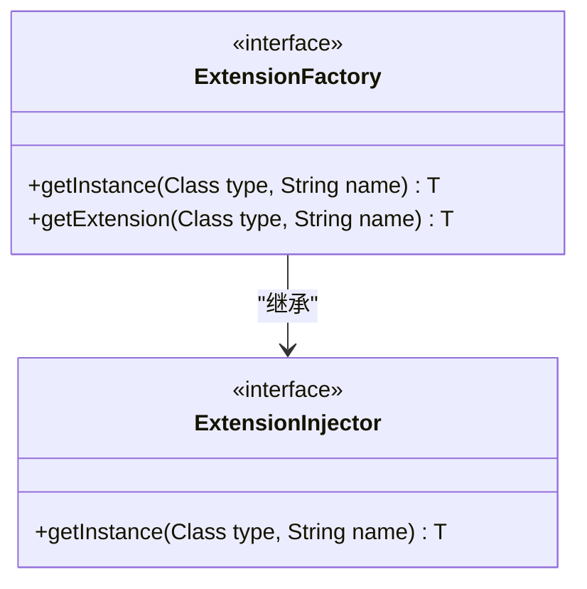
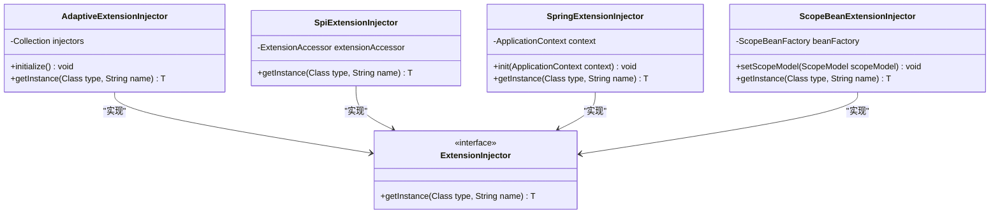
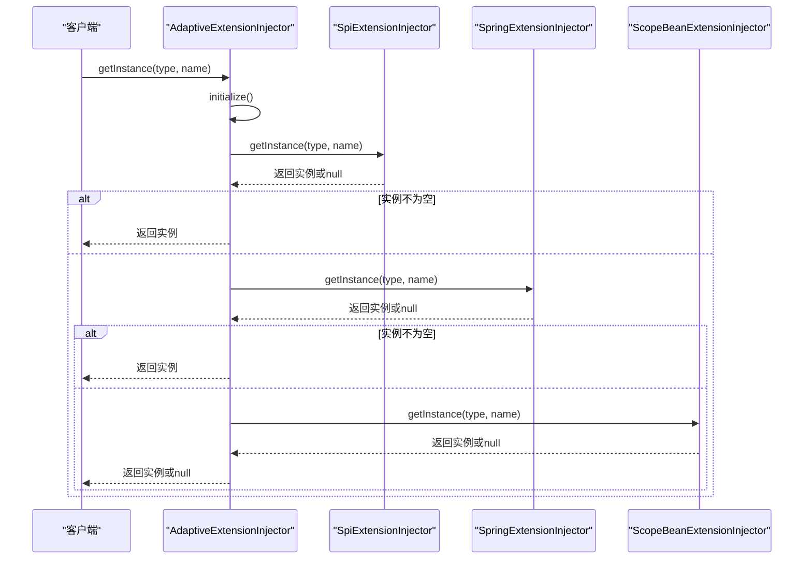
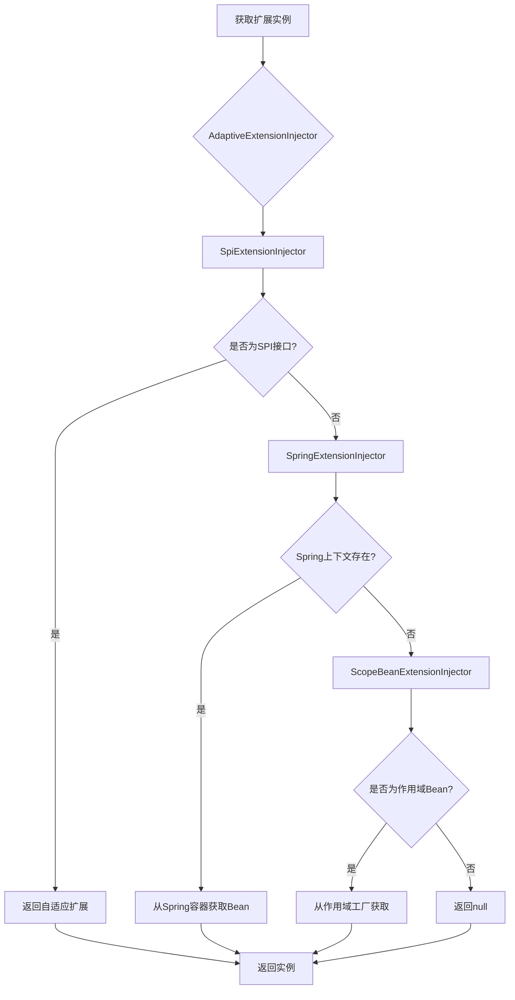
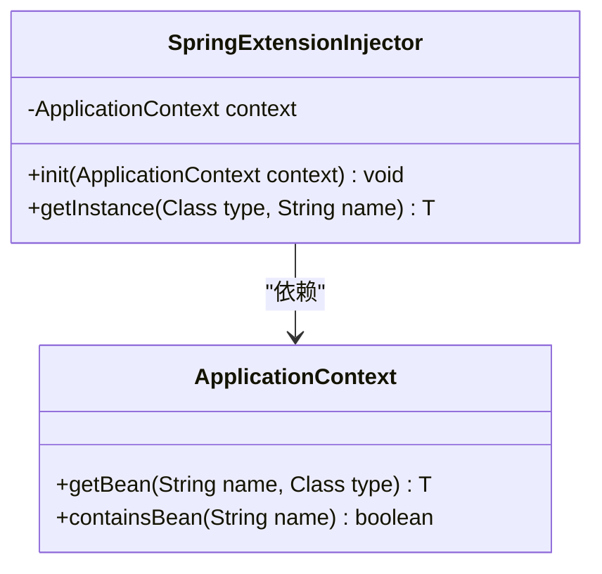
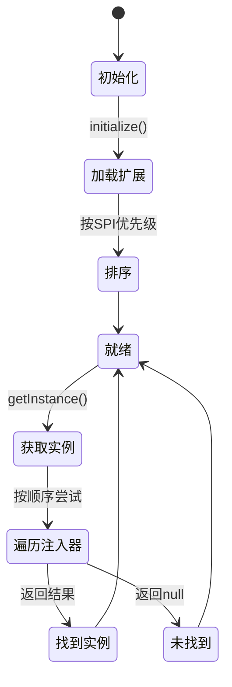
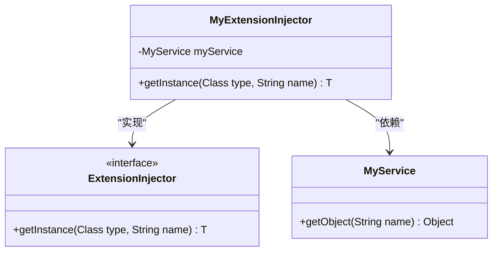

# 扩展工厂

<cite>
**本文档引用的文件**
- [ExtensionFactory.java](file://dubbo-common\src\main\java\org\apache\dubbo\common\extension\ExtensionFactory.java)
- [ExtensionInjector.java](file://dubbo-common\src\main\java\org\apache\dubbo\common\extension\ExtensionInjector.java)
- [AdaptiveExtensionInjector.java](file://dubbo-common\src\main\java\org\apache\dubbo\common\extension\inject\AdaptiveExtensionInjector.java)
- [SpiExtensionInjector.java](file://dubbo-common\src\main\java\org\apache\dubbo\common\extension\inject\SpiExtensionInjector.java)
- [SpringExtensionInjector.java](file://dubbo-config\dubbo-config-spring\src\main\java\org\apache\dubbo\config\spring\extension\SpringExtensionInjector.java)
- [ScopeBeanExtensionInjector.java](file://dubbo-common\src\main\java\org\apache\dubbo\common\beans\ScopeBeanExtensionInjector.java)
- [ExtensionLoader.java](file://dubbo-common\src\main\java\org\apache\dubbo\common\extension\ExtensionLoader.java)
</cite>

## 目录
1. [引言](#引言)
2. [扩展工厂设计原理](#扩展工厂设计原理)
3. [核心扩展工厂实现](#核心扩展工厂实现)
4. [扩展工厂协同工作机制](#扩展工厂协同工作机制)
5. [优先级排序与委派模式](#优先级排序与委派模式)
6. [Spring扩展工厂集成](#spring扩展工厂集成)
7. [自适应扩展工厂特性](#自适应扩展工厂特性)
8. [自定义扩展工厂示例](#自定义扩展工厂示例)
9. [调试方法与最佳实践](#调试方法与最佳实践)
10. [结论](#结论)

## 引言
扩展工厂是Dubbo框架中实现SPI（Service Provider Interface）扩展机制的核心组件。它负责创建和管理各种扩展实例，为框架提供了强大的可扩展性。随着框架的发展，ExtensionFactory接口已被ExtensionInjector接口取代，但其核心设计理念和工作机制仍然保持一致。本文档将深入分析扩展工厂的设计原理、实现方式以及各种扩展工厂的协同工作机制。

## 扩展工厂设计原理

扩展工厂的设计基于依赖注入和工厂模式，通过统一的接口来获取各种扩展实例。ExtensionFactory接口继承自ExtensionInjector接口，提供了获取扩展实例的统一方法。扩展工厂的核心职责是根据类型和名称创建相应的实例，同时支持多种实现方式的协同工作。

**图示来源**
- [ExtensionFactory.java](file://dubbo-common\src\main\java\org\apache\dubbo\common\extension\ExtensionFactory.java#L26-L47)
- [ExtensionInjector.java](file://dubbo-common\src\main\java\org\apache\dubbo\common\extension\ExtensionInjector.java#L23-L38)

**本节来源**
- [ExtensionFactory.java](file://dubbo-common\src\main\java\org\apache\dubbo\common\extension\ExtensionFactory.java#L1-L48)

## 核心扩展工厂实现

Dubbo框架提供了多种扩展工厂实现，每种实现都有其特定的用途和场景。主要的扩展工厂实现包括AdaptiveExtensionInjector、SpiExtensionInjector、SpringExtensionInjector和ScopeBeanExtensionInjector。

**图示来源**
- [AdaptiveExtensionInjector.java](file://dubbo-common\src\main\java\org\apache\dubbo\common\extension\inject\AdaptiveExtensionInjector.java#L34-L103)
- [SpiExtensionInjector.java](file://dubbo-common\src\main\java\org\apache\dubbo\common\extension\inject\SpiExtensionInjector.java#L24-L48)
- [SpringExtensionInjector.java](file://dubbo-config\dubbo-config-spring\src\main\java\org\apache\dubbo\config\spring\extension\SpringExtensionInjector.java#L29-L79)
- [ScopeBeanExtensionInjector.java](file://dubbo-common\src\main\java\org\apache\dubbo\common\beans\ScopeBeanExtensionInjector.java#L27-L40)

**本节来源**
- [AdaptiveExtensionInjector.java](file://dubbo-common\src\main\java\org\apache\dubbo\common\extension\inject\AdaptiveExtensionInjector.java#L1-L103)
- [SpiExtensionInjector.java](file://dubbo-common\src\main\java\org\apache\dubbo\common\extension\inject\SpiExtensionInjector.java#L1-L48)

## 扩展工厂协同工作机制

扩展工厂的协同工作机制基于委派模式和优先级排序。AdaptiveExtensionInjector作为主要的协调者，管理着其他扩展工厂的实例。当需要获取一个扩展实例时，AdaptiveExtensionInjector会按照一定的顺序依次尝试各个扩展工厂，直到找到合适的实例。

**图示来源**
- [AdaptiveExtensionInjector.java](file://dubbo-common\src\main\java\org\apache\dubbo\common\extension\inject\AdaptiveExtensionInjector.java#L79-L85)
- [SpiExtensionInjector.java](file://dubbo-common\src\main\java\org\apache\dubbo\common\extension\inject\SpiExtensionInjector.java#L33-L47)
- [SpringExtensionInjector.java](file://dubbo-config\dubbo-config-spring\src\main\java\org\apache\dubbo\config\spring\extension\SpringExtensionInjector.java#L50-L69)
- [ScopeBeanExtensionInjector.java](file://dubbo-common\src\main\java\org\apache\dubbo\common\beans\ScopeBeanExtensionInjector.java#L37-L39)

**本节来源**
- [AdaptiveExtensionInjector.java](file://dubbo-common\src\main\java\org\apache\dubbo\common\extension\inject\AdaptiveExtensionInjector.java#L62-L85)

## 优先级排序与委派模式

扩展工厂的优先级排序由AdaptiveExtensionInjector的初始化过程决定。在initialize方法中，AdaptiveExtensionInjector会获取所有支持的ExtensionInjector扩展，并按照SPI配置的顺序进行排序。委派模式确保了扩展工厂可以灵活地组合和扩展，每个扩展工厂只关注特定类型的实例创建。

**图示来源**
- [AdaptiveExtensionInjector.java](file://dubbo-common\src\main\java\org\apache\dubbo\common\extension\inject\AdaptiveExtensionInjector.java#L64-L67)
- [SpiExtensionInjector.java](file://dubbo-common\src\main\java\org\apache\dubbo\common\extension\inject\SpiExtensionInjector.java#L35-L43)
- [SpringExtensionInjector.java](file://dubbo-config\dubbo-config-spring\src\main\java\org\apache\dubbo\config\spring\extension\SpringExtensionInjector.java#L56-L63)
- [ScopeBeanExtensionInjector.java](file://dubbo-common\src\main\java\org\apache\dubbo\common\beans\ScopeBeanExtensionInjector.java#L38-L39)

**本节来源**
- [AdaptiveExtensionInjector.java](file://dubbo-common\src\main\java\org\apache\dubbo\common\extension\inject\AdaptiveExtensionInjector.java#L62-L85)

## Spring扩展工厂集成

SpringExtensionInjector负责集成Spring容器的Bean管理功能。它通过持有ApplicationContext引用来访问Spring容器中的Bean。当需要获取一个实例时，SpringExtensionInjector会首先检查Spring上下文是否存在，然后尝试从容器中获取对应的Bean。

**图示来源**
- [SpringExtensionInjector.java](file://dubbo-config\dubbo-config-spring\src\main\java\org\apache\dubbo\config\spring\extension\SpringExtensionInjector.java#L31-L79)

**本节来源**
- [SpringExtensionInjector.java](file://dubbo-config\dubbo-config-spring\src\main\java\org\apache\dubbo\config\spring\extension\SpringExtensionInjector.java#L1-L79)

## 自适应扩展工厂特性

AdaptiveExtensionInjector具有自适应特性，能够动态地适应不同的扩展注入需求。它在初始化时会加载所有可用的ExtensionInjector实现，并按照优先级顺序组织它们。这种设计使得框架可以灵活地添加新的扩展注入方式，而无需修改核心代码。

**图示来源**
- [AdaptiveExtensionInjector.java](file://dubbo-common\src\main\java\org\apache\dubbo\common\extension\inject\AdaptiveExtensionInjector.java#L62-L85)

**本节来源**
- [AdaptiveExtensionInjector.java](file://dubbo-common\src\main\java\org\apache\dubbo\common\extension\inject\AdaptiveExtensionInjector.java#L34-L103)

## 自定义扩展工厂示例

创建自定义扩展工厂需要实现ExtensionInjector接口，并通过SPI机制进行注册。以下是一个简单的自定义扩展工厂示例：

**图示来源**
- [ExtensionInjector.java](file://dubbo-common\src\main\java\org\apache\dubbo\common\extension\ExtensionInjector.java#L23-L38)

**本节来源**
- [ExtensionInjector.java](file://dubbo-common\src\main\java\org\apache\dubbo\common\extension\ExtensionInjector.java#L1-L43)

## 调试方法与最佳实践

调试扩展工厂时，可以通过查看ExtensionLoader的缓存状态和扩展实例的创建过程来定位问题。最佳实践包括合理配置SPI优先级、避免循环依赖、正确管理扩展实例的生命周期等。

**本节来源**
- [ExtensionLoader.java](file://dubbo-common\src\main\java\org\apache\dubbo\common\extension\ExtensionLoader.java#L1026-L1772)

## 结论
扩展工厂是Dubbo框架可扩展性的核心。通过AdaptiveExtensionInjector的委派模式和优先级排序机制，框架能够灵活地整合多种扩展注入方式。理解扩展工厂的工作原理对于开发和调试Dubbo应用具有重要意义。