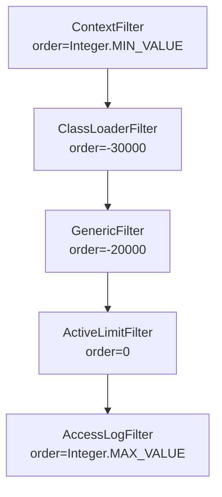
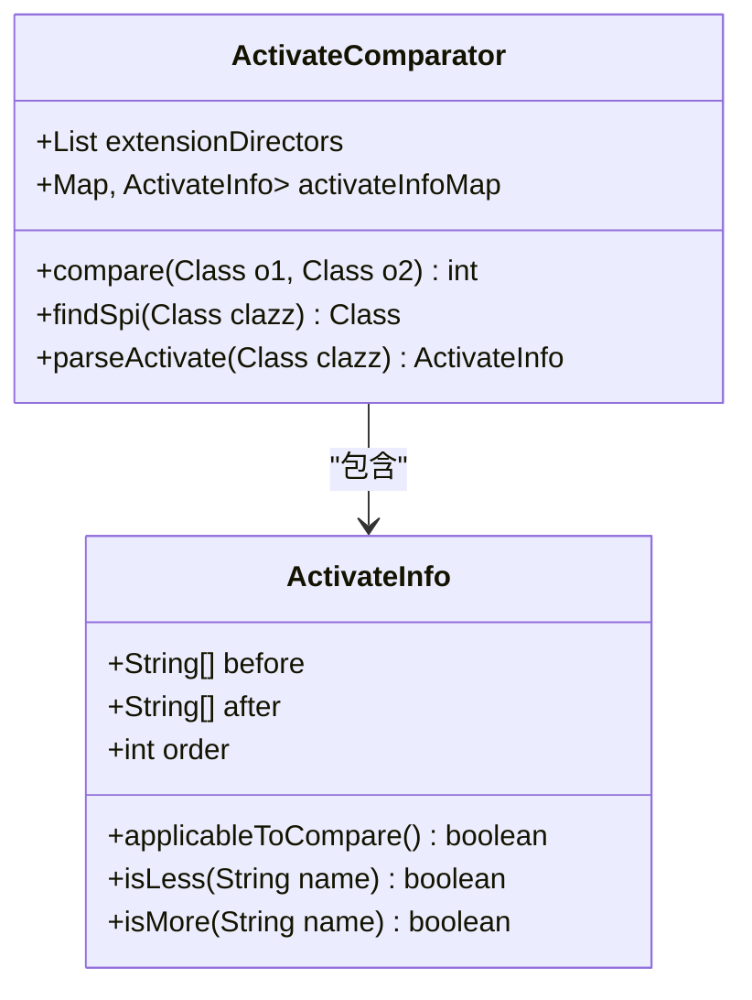
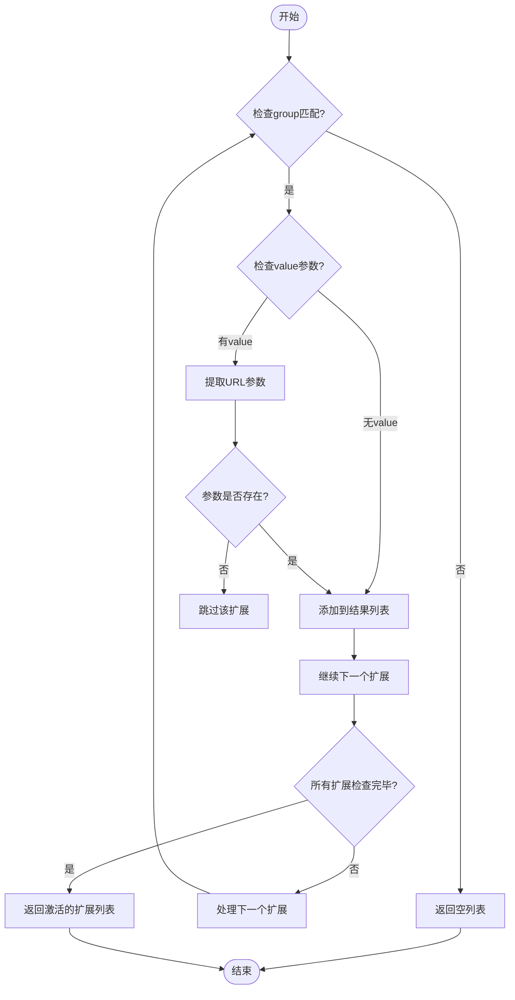
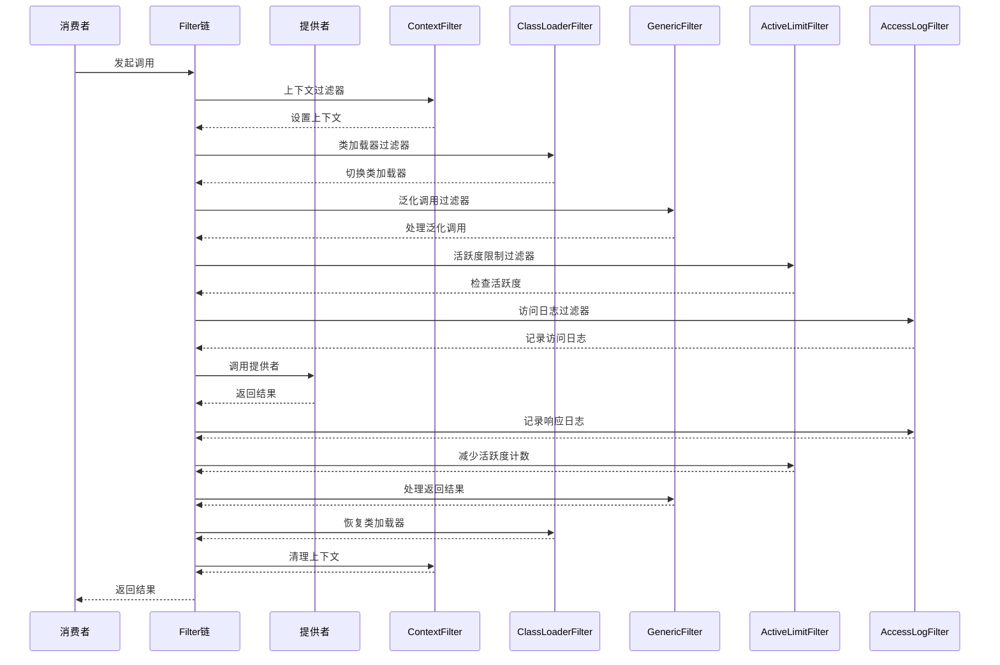

# 自动激活机制

<cite>
**本文档引用的文件**   
- [Activate.java](file://dubbo-common\src\main\java\org\apache\dubbo\common\extension\Activate.java)
- [ExtensionLoader.java](file://dubbo-common\src\main\java\org\apache\dubbo\common\extension\ExtensionLoader.java)
- [ActivateComparator.java](file://dubbo-common\src\main\java\org\apache\dubbo\common\extension\support\ActivateComparator.java)
- [DefaultFilterChainBuilder.java](file://dubbo-cluster\src\main\java\org\apache\dubbo\rpc\cluster\filter\DefaultFilterChainBuilder.java)
- [ExtensionLoaderTest.java](file://dubbo-common\src\test\java\org\apache\dubbo\common\extension\ExtensionLoaderTest.java)
</cite>

## 目录
1. [引言](#引言)
2. [@Activate注解详解](#activate注解详解)
3. [自动激活扩展的排序机制](#自动激活扩展的排序机制)
4. [条件激活实现方式](#条件激活实现方式)
5. [自动激活扩展协同工作示例](#自动激活扩展协同工作示例)
6. [自动激活扩展在Dubbo中的实际应用](#自动激活扩展在dubbo中的实际应用)
7. [自定义自动激活扩展指南](#自定义自动激活扩展指南)
8. [结论](#结论)

## 引言
自动激活机制是Dubbo框架中一个核心的扩展点激活机制，它允许开发者基于特定条件自动激活相应的扩展实现。通过@Activate注解，Dubbo实现了灵活的扩展管理，使得各种过滤器、路由、协议等组件能够根据运行时条件自动加载和执行。本文档将深入分析@Activate注解的使用方法和实现原理，详细阐述自动激活扩展的排序机制、条件激活实现方式，并提供多个实际应用示例和自定义指南。

## @Activate注解详解

@Activate注解是Dubbo自动激活机制的核心，它定义了扩展实现的激活条件和排序规则。该注解可以应用于类或方法上，用于标记哪些扩展实现应该在特定条件下被自动激活。

### group属性
group属性用于指定扩展激活的组条件。当调用ExtensionLoader的getActivateExtension方法时，传入的group参数将与扩展上的group属性进行匹配。只有当group匹配时，该扩展才会被激活。

```java
@Activate(group = CommonConstants.CONSUMER)
public class ConsumerSignFilter implements Filter {
    // 消费者端签名过滤器实现
}
```

在上述示例中，ConsumerSignFilter将在消费者端（CONSUMER组）被激活。常见的组值包括CONSUMER（消费者端）和PROVIDER（提供者端），这些值由框架SPI定义。

### value属性
value属性用于指定URL参数条件。当指定的参数键出现在URL中时，对应的扩展将被激活。这使得扩展的激活可以基于配置参数动态控制。

```java
@Activate(group = CommonConstants.CONSUMER, value = Constants.AUTH_KEY)
public class ConsumerSignFilter implements Filter {
    // 当URL中包含auth参数时激活
}
```

在该示例中，只有当URL中包含auth参数时，ConsumerSignFilter才会被激活。这种机制使得开发者可以通过配置文件或运行时参数来控制哪些过滤器需要启用。

### order属性
order属性用于定义扩展的绝对排序信息。排序采用升序方式，较小的值会排在列表前面。这对于需要特定执行顺序的扩展（如过滤器链）至关重要。

```java
@Activate(group = CommonConstants.PROVIDER, order = Integer.MIN_VALUE)
public class ContextFilter implements Filter {
    // 上下文过滤器，需要最先执行
}
```

在该示例中，ContextFilter被赋予了最小的排序值，确保它在所有过滤器中第一个执行，从而为后续过滤器提供必要的上下文信息。

### onClass属性
onClass属性用于基于类存在性进行条件激活。当指定的类在类路径中存在时，对应的扩展将被激活。这使得扩展的激活可以依赖于特定库或框架的存在。

```java
@Activate(onClass = "org.springframework.web.bind.annotation.RequestMapping")
public class SpringMvcRequestMappingResolver implements RequestMappingResolver {
    // 当Spring MVC存在时激活
}
```

该机制常用于实现框架集成，如Spring、JAX-RS等，只有当相应的框架库存在时，相关的集成扩展才会被激活，避免了不必要的依赖和类加载。

**Section sources**
- [Activate.java](file://dubbo-common\src\main\java\org\apache\dubbo\common\extension\Activate.java)

## 自动激活扩展的排序机制

自动激活扩展的排序机制是确保扩展按正确顺序执行的关键。Dubbo通过ActivateComparator类实现了复杂的排序逻辑，支持基于order属性的绝对排序和基于before/after属性的相对排序。

### 绝对排序（order属性）
绝对排序是最常用的排序方式，通过order属性指定扩展的执行顺序。排序值越小，优先级越高，执行顺序越靠前。



**Diagram sources **
- [ContextFilter.java](file://dubbo-rpc\dubbo-rpc-api\src\main\java\org\apache\dubbo\rpc\filter\ContextFilter.java)
- [ClassLoaderFilter.java](file://dubbo-rpc\dubbo-rpc-api\src\main\java\org\apache\dubbo\rpc\filter\ClassLoaderFilter.java)
- [GenericFilter.java](file://dubbo-rpc\dubbo-rpc-api\src\main\java\org\apache\dubbo\rpc\filter\GenericFilter.java)
- [ActiveLimitFilter.java](file://dubbo-rpc\dubbo-rpc-api\src\main\java\org\apache\dubbo\rpc\filter\ActiveLimitFilter.java)
- [AccessLogFilter.java](file://dubbo-rpc\dubbo-rpc-api\src\main\java\org\apache\dubbo\rpc\filter\AccessLogFilter.java)

### 相对排序（before/after属性）
相对排序允许扩展指定相对于其他扩展的执行位置。虽然before和after属性在2.7.0版本后已被废弃，但它们的实现原理仍然值得了解。

```java
@Activate(before = "cache", after = "validation")
public class CustomFilter implements Filter {
    // 在validation之后，在cache之前执行
}
```

### 排序实现原理
排序的核心实现位于ActivateComparator类中，它实现了Comparator接口，用于比较两个扩展类的执行顺序。



**Diagram sources **
- [ActivateComparator.java](file://dubbo-common\src\main\java\org\apache\dubbo\common\extension\support\ActivateComparator.java)
- [ActivateInfo.java](file://dubbo-common\src\main\java\org\apache\dubbo\common\extension\support\ActivateComparator.java#L170-L186)

排序逻辑如下：
1. 首先检查扩展是否具有before或after属性（相对排序）
2. 如果没有相对排序，则比较order属性值（绝对排序）
3. 如果order值相同，则按类名的字典序排序，确保排序的一致性

**Section sources**
- [ActivateComparator.java](file://dubbo-common\src\main\java\org\apache\dubbo\common\extension\support\ActivateComparator.java)

## 条件激活实现方式

条件激活是自动激活机制的核心功能，它允许扩展基于运行时条件动态激活。Dubbo支持多种条件激活方式，包括基于URL参数、协议类型、类存在性等条件。

### 基于URL参数的激活
基于URL参数的激活是最常见的条件激活方式。通过value属性指定的参数键，只有当这些参数出现在URL中时，对应的扩展才会被激活。

```java
@Activate(group = PROVIDER, value = TPS_LIMIT_RATE_KEY)
public class TpsLimitFilter implements Filter {
    // 当URL中包含tps.limit.rate参数时激活
}
```

在ExtensionLoader中，URL参数条件的检查逻辑如下：



**Diagram sources **
- [ExtensionLoader.java](file://dubbo-common\src\main\java\org\apache\dubbo\common\extension\ExtensionLoader.java#L624-L633)

### 基于协议类型的激活
基于协议类型的激活通常通过URL的协议部分来实现。不同的协议可能需要不同的处理逻辑，通过协议类型来激活相应的扩展。

```java
@Activate(value = "dubbo")
public class DubboProtocolFilter implements Filter {
    // 仅在dubbo协议下激活
}
```

### 基于类存在性的激活
基于类存在性的激活通过onClass属性实现。只有当指定的类在类路径中存在时，对应的扩展才会被激活。

```java
@Activate(onClass = "com.fasterxml.jackson.databind.json.JsonMapper")
public class JacksonImpl extends AbstractJsonUtilImpl {
    // 当Jackson库存在时激活
}
```

在ExtensionLoader中，类存在性检查的实现如下：

```java
private boolean loadClassIfActive(ClassLoader classLoader, Class<?> clazz) {
    Activate activate = clazz.getAnnotation(Activate.class);
    
    if (activate == null) {
        return true;
    }
    
    String[] onClass = ((Activate) activate).onClass();
    
    boolean isActive = true;
    if (null != onClass && onClass.length > 0) {
        isActive = Arrays.stream(onClass)
                .filter(StringUtils::isNotBlank)
                .allMatch(className -> ClassUtils.isPresent(className, classLoader));
    }
    return isActive;
}
```

该方法首先获取扩展类上的@Activate注解，然后检查onClass属性指定的类是否存在于类加载器中。只有当所有指定的类都存在时，扩展才会被激活。

**Section sources**
- [ExtensionLoader.java](file://dubbo-common\src\main\java\org\apache\dubbo\common\extension\ExtensionLoader.java#L1604-L1627)

## 自动激活扩展协同工作示例

自动激活扩展的协同工作是Dubbo框架灵活性的重要体现。通过多个扩展的组合和链式调用，可以实现复杂的功能逻辑。

### 多个Filter的链式调用
Filter是自动激活扩展最典型的应用场景。多个Filter通过链式调用的方式协同工作，形成一个完整的处理管道。



**Diagram sources **
- [DefaultFilterChainBuilder.java](file://dubbo-cluster\src\main\java\org\apache\dubbo\rpc\cluster\filter\DefaultFilterChainBuilder.java)
- [ContextFilter.java](file://dubbo-rpc\dubbo-rpc-api\src\main\java\org\apache\dubbo\rpc\filter\ContextFilter.java)
- [ClassLoaderFilter.java](file://dubbo-rpc\dubbo-rpc-api\src\main\java\org\apache\dubbo\rpc\filter\ClassLoaderFilter.java)
- [GenericFilter.java](file://dubbo-rpc\dubbo-rpc-api\src\main\java\org\apache\dubbo\rpc\filter\GenericFilter.java)
- [ActiveLimitFilter.java](file://dubbo-rpc\dubbo-rpc-api\src\main\java\org\apache\dubbo\rpc\filter\ActiveLimitFilter.java)
- [AccessLogFilter.java](file://dubbo-rpc\dubbo-rpc-api\src\main\java\org\apache\dubbo\rpc\filter\AccessLogFilter.java)

Filter链的构建过程如下：

```java
public <T> Invoker<T> buildInvokerChain(final Invoker<T> originalInvoker, String key, String group) {
    Invoker<T> last = originalInvoker;
    URL url = originalInvoker.getUrl();
    List<Filter> filters = ScopeModelUtil.getExtensionLoader(Filter.class, null)
            .getActivateExtension(url, key, group);

    if (!CollectionUtils.isEmpty(filters)) {
        for (int i = filters.size() - 1; i >= 0; i--) {
            final Filter filter = filters.get(i);
            final Invoker<T> next = last;
            last = new CopyOfFilterChainNode<>(originalInvoker, next, filter);
        }
        return new CallbackRegistrationInvoker<>(last, filters);
    }

    return last;
}
```

该方法首先获取所有激活的Filter，然后从后往前构建Filter链。这种反向构建的方式确保了Filter的执行顺序与添加顺序一致。

### 多个Router的协同工作
路由扩展也是自动激活机制的重要应用场景。多个Router可以协同工作，实现复杂的路由策略。

```java
@Activate(order = 100)
public class TagStateRouterFactory implements StateRouterFactory {
    // 标签路由
}

@Activate(order = 130)
public class AffinityServiceStateRouterFactory extends CacheableStateRouterFactory {
    // 亲和性路由
}

@Activate(order = 140)
public class ServiceStateRouterFactory extends CacheableStateRouterFactory {
    // 服务状态路由
}
```

这些Router按照order属性定义的顺序执行，形成一个路由链。每个Router可以根据自己的策略对调用进行路由决策。

**Section sources**
- [DefaultFilterChainBuilder.java](file://dubbo-cluster\src\main\java\org\apache\dubbo\rpc\cluster\filter\DefaultFilterChainBuilder.java)

## 自动激活扩展在Dubbo中的实际应用

自动激活扩展在Dubbo框架中有广泛的实际应用，涵盖了过滤器、协议包装、路由等多个方面。

### ProtocolFilterWrapper的自动包装
ProtocolFilterWrapper是自动激活扩展在协议层包装的典型应用。它通过自动激活机制，将各种Filter自动包装到Protocol实现中。

```java
@Activate(order = 100)
public class ProtocolFilterWrapper implements Protocol {
    private final Protocol protocol;

    public ProtocolFilterWrapper(Protocol protocol) {
        this.protocol = protocol;
    }

    @Override
    public <T> Exporter<T> export(Invoker<T> invoker) throws RpcException {
        return protocol.export(buildInvokerChain(invoker, Constants.SERVICE_FILTER_KEY, Constants.PROVIDER));
    }

    @Override
    public <T> Invoker<T> refer(Class<T> type, URL url) throws RpcException {
        return buildInvokerChain(protocol.refer(type, url), Constants.REFERENCE_FILTER_KEY, Constants.CONSUMER);
    }

    private static <T> Invoker<T> buildInvokerChain(final Invoker<T> invoker, String key, String group) {
        Invoker<T> last = invoker;
        List<Filter> filters = ExtensionLoader.getExtensionLoader(Filter.class)
                .getActivateExtension(invoker.getUrl(), key, group);
        if (!filters.isEmpty()) {
            for (int i = filters.size() - 1; i >= 0; i--) {
                final Filter filter = filters.get(i);
                final Invoker<T> next = last;
                last = new FilterChainNode<>(invoker, next, filter);
            }
        }
        return last;
    }
}
```

ProtocolFilterWrapper的实现展示了自动激活机制的核心应用：
1. 它本身通过@Activate注解被自动激活
2. 在export和refer方法中，通过getActivateExtension获取所有激活的Filter
3. 构建Filter链并包装到原始的Invoker中
4. 实现了AOP模式，将横切关注点（如日志、监控、安全等）与核心业务逻辑分离

### 其他实际应用
除了ProtocolFilterWrapper，自动激活机制还在以下场景中广泛应用：

- **状态检查器**：各种StatusChecker通过自动激活机制注册，用于检查系统状态
- **Telnet命令处理器**：QoS模块中的Telnet命令处理器通过自动激活机制注册
- **序列化实现**：不同的序列化实现（如JSON、Hessian等）通过onClass条件激活
- **参数解析器**：REST模块中的参数解析器根据框架存在性自动激活

这些应用共同构成了Dubbo灵活的扩展体系，使得框架能够适应各种不同的使用场景和需求。

**Section sources**
- [ProtocolFilterWrapper.java](file://dubbo-cluster\src\main\java\org\apache\dubbo\rpc\cluster\filter\ProtocolFilterWrapper.java)

## 自定义自动激活扩展指南

创建自定义的自动激活扩展是扩展Dubbo功能的重要方式。本节将提供完整的自定义指南，包括实现步骤、配置方法和测试技巧。

### 创建自定义Filter
创建自定义Filter是最常见的扩展需求。以下是创建自定义Filter的完整步骤：

1. **定义Filter接口实现**

```java
@Activate(group = CommonConstants.PROVIDER, value = "custom", order = 100)
public class CustomProviderFilter implements Filter {
    
    @Override
    public Result invoke(Invoker<?> invoker, Invocation invocation) throws RpcException {
        // 前置处理
        beforeInvoke(invocation);
        
        try {
            // 调用下一个Filter或Invoker
            Result result = invoker.invoke(invocation);
            
            // 后置处理
            afterInvoke(invocation, result);
            
            return result;
        } catch (Exception e) {
            // 异常处理
            onError(invocation, e);
            throw e;
        }
    }
    
    private void beforeInvoke(Invocation invocation) {
        // 记录调用开始时间
        invocation.setAttachment("start_time", String.valueOf(System.currentTimeMillis()));
    }
    
    private void afterInvoke(Invocation invocation, Result result) {
        // 计算调用耗时
        long startTime = Long.parseLong(invocation.getAttachment("start_time"));
        long duration = System.currentTimeMillis() - startTime;
        
        // 记录调用耗时
        System.out.println("调用耗时: " + duration + "ms");
    }
    
    private void onError(Invocation invocation, Exception e) {
        // 记录错误信息
        System.err.println("调用失败: " + e.getMessage());
    }
}
```

2. **配置文件注册**

在`META-INF/dubbo/org.apache.dubbo.rpc.Filter`文件中添加：

```
custom=com.example.CustomProviderFilter
```

### 创建条件激活扩展
创建基于条件激活的扩展可以实现更灵活的功能。以下是创建基于Spring MVC存在的条件激活扩展的示例：

```java
@Activate(onClass = "org.springframework.web.bind.annotation.RequestMapping")
public class SpringIntegrationFilter implements Filter {
    
    private boolean springAvailable = false;
    
    public SpringIntegrationFilter() {
        // 检查Spring MVC是否存在
        try {
            Class.forName("org.springframework.web.bind.annotation.RequestMapping");
            springAvailable = true;
        } catch (ClassNotFoundException e) {
            springAvailable = false;
        }
    }
    
    @Override
    public Result invoke(Invoker<?> invoker, Invocation invocation) throws RpcException {
        if (!springAvailable) {
            return invoker.invoke(invocation);
        }
        
        // Spring集成特定逻辑
        enhanceInvocation(invocation);
        
        return invoker.invoke(invocation);
    }
    
    private void enhanceInvocation(Invocation invocation) {
        // 增强调用上下文
        invocation.setAttachment("spring_enabled", "true");
    }
}
```

### 测试自定义扩展
测试自定义扩展是确保其正确性的关键步骤。以下是测试自定义Filter的示例：

```java
@Test
public void testCustomProviderFilter() {
    // 创建测试URL
    URL url = URL.valueOf("dubbo://localhost:20880/test?custom=true");
    
    // 获取激活的扩展
    List<Filter> filters = ExtensionLoader.getExtensionLoader(Filter.class)
            .getActivateExtension(url, Constants.SERVICE_FILTER_KEY, Constants.PROVIDER);
    
    // 验证CustomProviderFilter被激活
    boolean found = false;
    for (Filter filter : filters) {
        if (filter instanceof CustomProviderFilter) {
            found = true;
            break;
        }
    }
    
    assertTrue("CustomProviderFilter should be activated", found);
    
    // 测试Filter链执行
    Invoker<?> mockInvoker = mock(Invoker.class);
    Invocation mockInvocation = mock(Invocation.class);
    
    when(mockInvoker.getUrl()).thenReturn(url);
    when(mockInvocation.getMethodName()).thenReturn("testMethod");
    
    // 创建Filter链
    Invoker<?> chain = new CustomProviderFilter().invoke(mockInvoker, mockInvocation);
    
    assertNotNull(chain);
}
```

### 最佳实践
在创建自定义自动激活扩展时，应遵循以下最佳实践：

1. **合理设置order值**：避免使用过小或过大的order值，建议在-10000到10000之间选择合适的值
2. **明确group条件**：根据扩展的用途明确指定CONSUMER或PROVIDER组
3. **谨慎使用value条件**：value条件应与业务需求紧密相关，避免过度复杂的条件判断
4. **考虑性能影响**：Filter等扩展会增加调用开销，应尽量减少不必要的处理逻辑
5. **提供充分的文档**：为自定义扩展提供详细的使用说明和配置指南

**Section sources**
- [ExtensionLoaderTest.java](file://dubbo-common\src\test\java\org\apache\dubbo\common\extension\ExtensionLoaderTest.java)

## 结论
自动激活机制是Dubbo框架灵活性和可扩展性的核心。通过@Activate注解，Dubbo实现了基于条件的扩展激活，支持group、value、order和onClass等多种激活条件。这一机制使得框架能够根据运行时环境和配置动态加载和执行相应的扩展实现。

自动激活扩展的排序机制确保了扩展按正确的顺序执行，通过ActivateComparator实现了复杂的排序逻辑。条件激活功能使得扩展的激活可以基于URL参数、协议类型、类存在性等多种条件，极大地增强了框架的适应能力。

在实际应用中，自动激活机制被广泛用于Filter链、Protocol包装、路由策略等场景，构成了Dubbo强大的扩展体系。通过自定义自动激活扩展，开发者可以轻松地扩展框架功能，满足特定的业务需求。

总之，深入理解自动激活机制对于掌握Dubbo框架的高级特性至关重要。它不仅提供了强大的扩展能力，还体现了Dubbo设计的灵活性和优雅性。