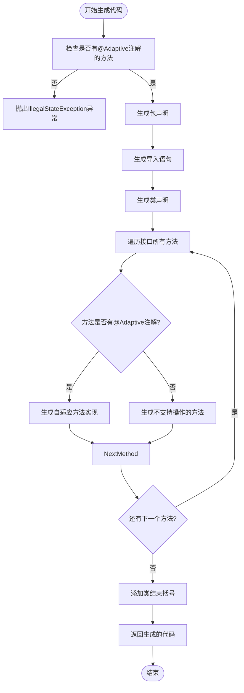
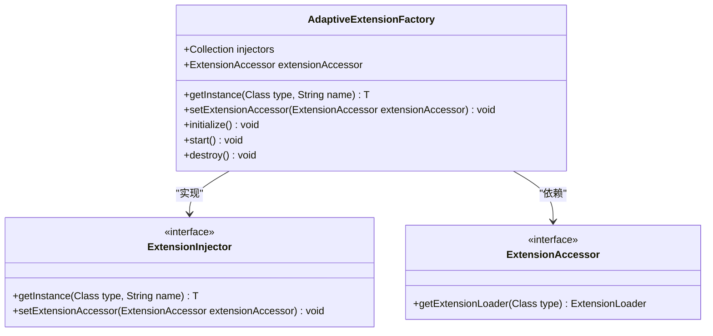
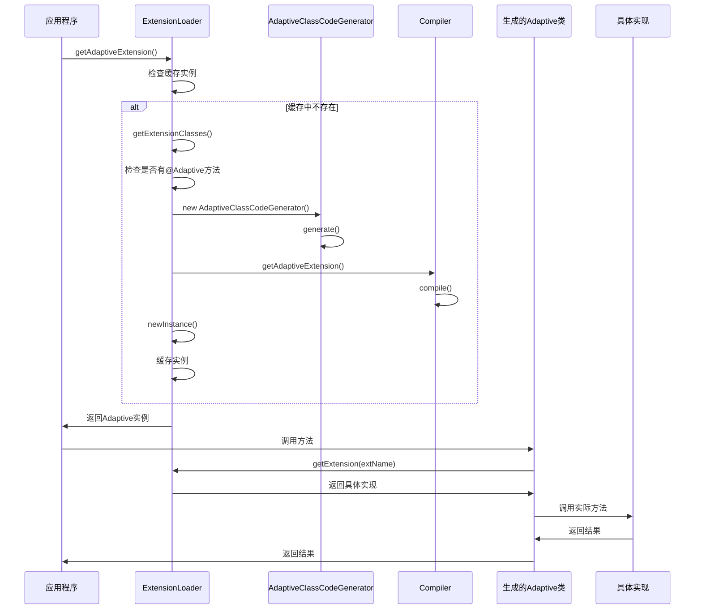

# 自适应扩展

<cite>
**本文档中引用的文件**   
- [Adaptive.java](file://dubbo-common\src\main\java\org\apache\dubbo\common\extension\Adaptive.java)
- [AdaptiveClassCodeGenerator.java](file://dubbo-common\src\main\java\org\apache\dubbo\common\extension\AdaptiveClassCodeGenerator.java)
- [ExtensionLoader.java](file://dubbo-common\src\main\java\org\apache\dubbo\common\extension\ExtensionLoader.java)
- [AdaptiveExtensionInjector.java](file://dubbo-common\src\main\java\org\apache\dubbo\common\extension\inject\AdaptiveExtensionInjector.java)
- [HasAdaptiveExt.java](file://dubbo-common\src\test\java\org\apache\dubbo\common\extension\adaptive\HasAdaptiveExt.java)
- [SimpleExt.java](file://dubbo-common\src\test\java\org\apache\dubbo\common\extension\ext1\SimpleExt.java)
- [Ext2.java](file://dubbo-common\src\test\java\org\apache\dubbo\common\extension\ext2\Ext2.java)
</cite>

## 目录
1. [引言](#引言)
2. [自适应扩展概述](#自适应扩展概述)
3. [Adaptive注解的使用方法](#adaptive注解的使用方法)
4. [自适应扩展的实现原理](#自适应扩展的实现原理)
5. [代码生成机制](#代码生成机制)
6. [URL参数对自适应扩展选择的影响](#url参数对自适应扩展选择的影响)
7. [自定义Adaptive扩展示例](#自定义adaptive扩展示例)
8. [AdaptiveExtensionFactory的作用和实现](#adaptiveextensionfactory的作用和实现)
9. [调试自适应扩展问题的方法](#调试自适应扩展问题的方法)
10. [类图和流程图](#类图和流程图)

## 引言
自适应扩展是Dubbo框架中一个核心的扩展机制，它允许在运行时根据URL参数动态选择合适的扩展实现。这种机制极大地增强了框架的灵活性和可扩展性，使得开发者可以根据不同的运行时条件选择最合适的实现。本文档将深入探讨自适应扩展的各个方面，包括其使用方法、实现原理、代码生成机制以及调试技巧。

## 自适应扩展概述
自适应扩展是Dubbo SPI（Service Provider Interface）机制的重要组成部分。它通过@Adaptive注解标记接口或方法，指示Dubbo在运行时动态生成适配类，根据URL中的参数选择具体的扩展实现。这种机制避免了硬编码的依赖关系，使得系统更加灵活和可配置。

自适应扩展主要应用于Dubbo的各个扩展点，如协议、集群、负载均衡、序列化等。通过URL参数的配置，可以在不修改代码的情况下切换不同的实现，这对于微服务架构中的动态配置和灰度发布非常有用。

**本文档中引用的文件**   
- [Adaptive.java](file://dubbo-common\src\main\java\org\apache\dubbo\common\extension\Adaptive.java)
- [AdaptiveClassCodeGenerator.java](file://dubbo-common\src\main\java\org\apache\dubbo\common\extension\AdaptiveClassCodeGenerator.java)

## Adaptive注解的使用方法
@Adaptive注解可以应用于类级别和方法级别，用于指示Dubbo生成自适应扩展。

### 类级别自适应扩展
当@Adaptive注解应用于类时，表示该类是一个自适应扩展。Dubbo会直接使用这个类作为适配器，而不会生成新的适配类。这种方式适用于需要完全控制适配逻辑的场景。

### 方法级别自适应扩展
当@Adaptive注解应用于方法时，表示该方法需要自适应扩展。Dubbo会在运行时为包含该注解的接口生成一个适配类，该类实现了接口中的所有方法。对于被@Adaptive注解的方法，生成的适配类会根据URL参数选择具体的扩展实现；对于未被注解的方法，会抛出不支持操作的异常。

@Adaptive注解的value属性用于指定URL中用于选择扩展的参数名。如果未指定value属性，Dubbo会根据接口名生成默认的参数名。例如，对于接口SimpleExt，生成的默认参数名为"simple.ext"。

```java
@SPI("impl1")
public interface SimpleExt {
    @Adaptive
    String echo(URL url, String s);
    
    @Adaptive({"key1", "key2"})
    String yell(URL url, String s);
}
```

在上面的例子中，echo方法会使用默认参数名"simple.ext"来选择扩展，而yell方法会依次尝试使用key1和key2参数来选择扩展。

**本文档中引用的文件**   
- [Adaptive.java](file://dubbo-common\src\main\java\org\apache\dubbo\common\extension\Adaptive.java)
- [SimpleExt.java](file://dubbo-common\src\test\java\org\apache\dubbo\common\extension\ext1\SimpleExt.java)

## 自适应扩展的实现原理
自适应扩展的实现主要依赖于ExtensionLoader类。当调用getAdaptiveExtension()方法时，ExtensionLoader会检查是否存在已经缓存的自适应实例。如果不存在，它会创建一个新的自适应扩展实例。

创建自适应扩展的过程包括以下几个步骤：
1. 检查接口是否有@Adaptive注解的方法
2. 如果有，生成自适应类的字节码
3. 使用编译器将字节码编译为Class对象
4. 创建该Class的实例并缓存

如果接口中没有@Adaptive注解的方法，ExtensionLoader会抛出IllegalStateException异常，因为无法确定如何选择具体的扩展实现。

自适应扩展的核心思想是延迟绑定，即在运行时根据实际的URL参数来决定使用哪个具体的扩展实现，而不是在编译时就确定下来。这种机制使得系统更加灵活，能够适应不同的运行时环境。

**本文档中引用的文件**   
- [ExtensionLoader.java](file://dubbo-common\src\main\java\org\apache\dubbo\common\extension\ExtensionLoader.java)
- [AdaptiveClassCodeGenerator.java](file://dubbo-common\src\main\java\org\apache\dubbo\common\extension\AdaptiveClassCodeGenerator.java)

## 代码生成机制
Dubbo的自适应扩展代码生成机制是其核心特性之一。当需要创建自适应扩展时，AdaptiveClassCodeGenerator类负责生成适配类的源代码。

代码生成的主要步骤如下：
1. 首先生成包声明和导入语句
2. 生成类声明，类名通常为原接口名加上"$Adaptive"后缀
3. 对于接口中的每个方法，生成相应的方法实现

对于被@Adaptive注解的方法，生成的代码会包含以下逻辑：
- 检查URL参数是否为空
- 根据@Adaptive注解的value属性或默认规则从URL中获取扩展名
- 使用ExtensionLoader获取具体的扩展实例
- 调用具体扩展实例的方法

对于未被@Adaptive注解的方法，生成的代码会直接抛出UnsupportedOperationException异常，表示该方法不支持自适应调用。

生成的代码最终会被编译器编译成字节码，并加载到JVM中。这个过程完全在运行时完成，无需预先编译。



**图源**
- [AdaptiveClassCodeGenerator.java](file://dubbo-common\src\main\java\org\apache\dubbo\common\extension\AdaptiveClassCodeGenerator.java)

**本文档中引用的文件**   
- [AdaptiveClassCodeGenerator.java](file://dubbo-common\src\main\java\org\apache\dubbo\common\extension\AdaptiveClassCodeGenerator.java)

## URL参数对自适应扩展选择的影响
URL参数在自适应扩展的选择中起着关键作用。Dubbo通过解析URL中的参数来确定使用哪个具体的扩展实现。

当调用一个被@Adaptive注解的方法时，生成的适配类会按照以下顺序从URL中获取扩展名：
1. 首先检查@Adaptive注解的value属性指定的参数
2. 如果有多个参数名，按顺序依次尝试
3. 如果都没有找到，则使用SPI注解中指定的默认扩展名

例如，对于以下接口定义：
```java
@SPI("defaultImpl")
public interface SimpleExt {
    @Adaptive({"key1", "key2"})
    String echo(URL url, String s);
}
```

当调用echo方法时，适配类会按以下顺序查找扩展名：
1. 首先查找URL中的key1参数
2. 如果key1不存在或为空，则查找key2参数
3. 如果key2也不存在，则使用默认的defaultImpl

如果所有途径都无法确定扩展名，将会抛出IllegalStateException异常。

这种机制使得可以通过简单的URL参数配置来切换不同的实现，而无需修改代码。这对于微服务架构中的动态配置、灰度发布和A/B测试非常有用。

**本文档中引用的文件**   
- [AdaptiveClassCodeGenerator.java](file://dubbo-common\src\main\java\org\apache\dubbo\common\extension\AdaptiveClassCodeGenerator.java)
- [SimpleExt.java](file://dubbo-common\src\test\java\org\apache\dubbo\common\extension\ext1\SimpleExt.java)

## 自定义Adaptive扩展示例
下面是一个完整的自定义Adaptive扩展示例：

```java
@SPI("default")
public interface MyService {
    @Adaptive("strategy")
    String execute(URL url, String data);
    
    String fallback(URL url, String data);
}
```

对应的实现类：
```java
public class DefaultServiceImpl implements MyService {
    public String execute(URL url, String data) {
        return "Default: " + data;
    }
    
    public String fallback(URL url, String data) {
        return "Fallback: " + data;
    }
}

public class FastServiceImpl implements MyService {
    public String execute(URL url, String data) {
        return "Fast: " + data;
    }
    
    public String fallback(URL url, String data) {
        return "Fast Fallback: " + data;
    }
}
```

使用方式：
```java
ExtensionLoader<MyService> loader = ExtensionLoader.getExtensionLoader(MyService.class);
MyService adaptive = loader.getAdaptiveExtension();

// 使用默认实现
URL url1 = URL.valueOf("my://127.0.0.1:8080/service");
String result1 = adaptive.execute(url1, "hello");

// 使用Fast实现
URL url2 = URL.valueOf("my://127.0.0.1:8080/service?strategy=fast");
String result2 = adaptive.execute(url2, "hello");
```

在这个例子中，当URL中没有strategy参数时，会使用默认的DefaultServiceImpl；当strategy参数为fast时，会使用FastServiceImpl。

**本文档中引用的文件**   
- [HasAdaptiveExt.java](file://dubbo-common\src\test\java\org\apache\dubbo\common\extension\adaptive\HasAdaptiveExt.java)
- [SimpleExt.java](file://dubbo-common\src\test\java\org\apache\dubbo\common\extension\ext1\SimpleExt.java)

## AdaptiveExtensionFactory的作用和实现
AdaptiveExtensionFactory是Dubbo中用于创建自适应扩展的工厂类。它的主要作用是根据运行时条件动态选择合适的ExtensionFactory实现。

AdaptiveExtensionFactory本身被@Adaptive注解标记，这意味着Dubbo会为它生成一个适配类。这个适配类会根据URL参数选择具体的ExtensionFactory实现，如SpringExtensionFactory、SpiExtensionFactory等。

AdaptiveExtensionFactory的实现相对简单，它维护了一个ExtensionFactory的列表，并按照优先级顺序尝试使用每个工厂来创建扩展实例。当调用getInstance方法时，它会遍历所有注册的ExtensionFactory，直到某个工厂成功创建实例为止。

这种设计模式使得Dubbo能够灵活地支持多种扩展创建机制，同时保持了良好的扩展性。开发者可以很容易地添加新的ExtensionFactory实现，而无需修改核心代码。



**图源**
- [AdaptiveExtensionInjector.java](file://dubbo-common\src\main\java\org\apache\dubbo\common\extension\inject\AdaptiveExtensionInjector.java)

**本文档中引用的文件**   
- [AdaptiveExtensionInjector.java](file://dubbo-common\src\main\java\org\apache\dubbo\common\extension\inject\AdaptiveExtensionInjector.java)

## 调试自适应扩展问题的方法
调试自适应扩展问题时，可以采用以下几种方法：

### 查看生成的Adaptive类字节码
可以通过设置系统属性来查看生成的自适应类源代码：
```java
System.setProperty("dubbo.application.logger", "slf4j");
```
这样可以在日志中看到生成的自适应类代码，有助于理解实际的执行逻辑。

### 使用调试工具
在开发环境中，可以使用IDE的调试功能，在ExtensionLoader的getAdaptiveExtension()方法处设置断点，跟踪自适应扩展的创建过程。

### 检查URL参数
确保URL中包含了正确的参数来选择期望的扩展实现。可以通过打印URL的参数来验证。

### 验证扩展实现
确保所需的扩展实现已经正确配置在META-INF/dubbo目录下的相应文件中。

### 异常分析
当出现IllegalStateException异常时，仔细阅读异常信息，它通常会提供关于为什么无法创建自适应扩展的详细信息。

通过这些方法，可以有效地诊断和解决自适应扩展相关的问题。

**本文档中引用的文件**   
- [ExtensionLoader.java](file://dubbo-common\src\main\java\org\apache\dubbo\common\extension\ExtensionLoader.java)
- [AdaptiveClassCodeGenerator.java](file://dubbo-common\src\main\java\org\apache\dubbo\common\extension\AdaptiveClassCodeGenerator.java)

## 类图和流程图
以下是自适应扩展相关类的类图和代码生成流程图：

```mermaid
classDiagram
class Adaptive {
<<annotation>>
+String[] value() default {}
}
class AdaptiveClassCodeGenerator {
-Class<?> type
-String defaultExtName
+generate() String
+generateMethod(Method method) String
+generateMethodContent(Method method) String
}
class ExtensionLoader {
-Class<T> type
-ConcurrentMap<String, Class<?>> cachedClasses
-AtomicReference<Object> cachedAdaptiveInstance
+getAdaptiveExtension() T
+createAdaptiveExtension() T
+getAdaptiveExtensionClass() Class<?>
+createAdaptiveExtensionClass() Class<?>
}
class AdaptiveExtensionInjector {
-Collection<ExtensionInjector> injectors
-ExtensionAccessor extensionAccessor
+getInstance(Class<T> type, String name) T
}
Adaptive --> AdaptiveClassCodeGenerator : "用于生成代码"
AdaptiveClassCodeGenerator --> ExtensionLoader : "由ExtensionLoader使用"
ExtensionLoader --> AdaptiveExtensionInjector : "用于注入扩展"
ExtensionLoader --> AdaptiveClassCodeGenerator : "创建实例"
```

**图源**
- [Adaptive.java](file://dubbo-common\src\main\java\org\apache\dubbo\common\extension\Adaptive.java)
- [AdaptiveClassCodeGenerator.java](file://dubbo-common\src\main\java\org\apache\dubbo\common\extension\AdaptiveClassCodeGenerator.java)
- [ExtensionLoader.java](file://dubbo-common\src\main\java\org\apache\dubbo\common\extension\ExtensionLoader.java)
- [AdaptiveExtensionInjector.java](file://dubbo-common\src\main\java\org\apache\dubbo\common\extension\inject\AdaptiveExtensionInjector.java)



**图源**
- [ExtensionLoader.java](file://dubbo-common\src\main\java\org\apache\dubbo\common\extension\ExtensionLoader.java)
- [AdaptiveClassCodeGenerator.java](file://dubbo-common\src\main\java\org\apache\dubbo\common\extension\AdaptiveClassCodeGenerator.java)

**本文档中引用的文件**   
- [Adaptive.java](file://dubbo-common\src\main\java\org\apache\dubbo\common\extension\Adaptive.java)
- [AdaptiveClassCodeGenerator.java](file://dubbo-common\src\main\java\org\apache\dubbo\common\extension\AdaptiveClassCodeGenerator.java)
- [ExtensionLoader.java](file://dubbo-common\src\main\java\org\apache\dubbo\common\extension\ExtensionLoader.java)
- [AdaptiveExtensionInjector.java](file://dubbo-common\src\main\java\org\apache\dubbo\common\extension\inject\AdaptiveExtensionInjector.java)