# URL参数管理

<cite>
**本文档引用的文件**   
- [URL.java](file://dubbo-common\src\main\java\org\apache\dubbo\common\URL.java)
- [URLParam.java](file://dubbo-common\src\main\java\org\apache\dubbo\common\url\component\URLParam.java)
- [URLStrParser.java](file://dubbo-common\src\main\java\org\apache\dubbo\common\URLStrParser.java)
- [DynamicParamTable.java](file://dubbo-common\src\main\java\org\apache\dubbo\common\url\component\param\DynamicParamTable.java)
- [Parameters.java](file://dubbo-common\src\main\java\org\apache\dubbo\common\Parameters.java)
- [URLTest.java](file://dubbo-common\src\test\java\org\apache\dubbo\common\URLTest.java)
</cite>

## 目录
1. [引言](#引言)
2. [URL参数存储机制](#url参数存储机制)
3. [参数编码解码过程](#参数编码解码过程)
4. [参数优先级与覆盖机制](#参数优先级与覆盖机制)
5. [API使用示例](#api使用示例)
6. [初学者操作示例](#初学者操作示例)
7. [高级优化建议](#高级优化建议)
8. [配置灵活性支持](#配置灵活性支持)
9. [结论](#结论)

## 引言
Dubbo框架中的URL参数管理机制是其配置系统的核心组成部分。该机制通过URL对象来统一管理服务的各种配置参数，实现了配置的灵活性和动态调整能力。本文档将详细阐述URL参数管理的各个方面，包括参数的存储、编码解码、优先级规则以及API使用方法。

## URL参数存储机制
Dubbo的URL参数管理采用了一种高效的存储机制，主要通过`URLParam`类来实现。该机制的核心是使用`Map`结构来管理参数，并通过`DynamicParamTable`进行参数键的压缩存储。

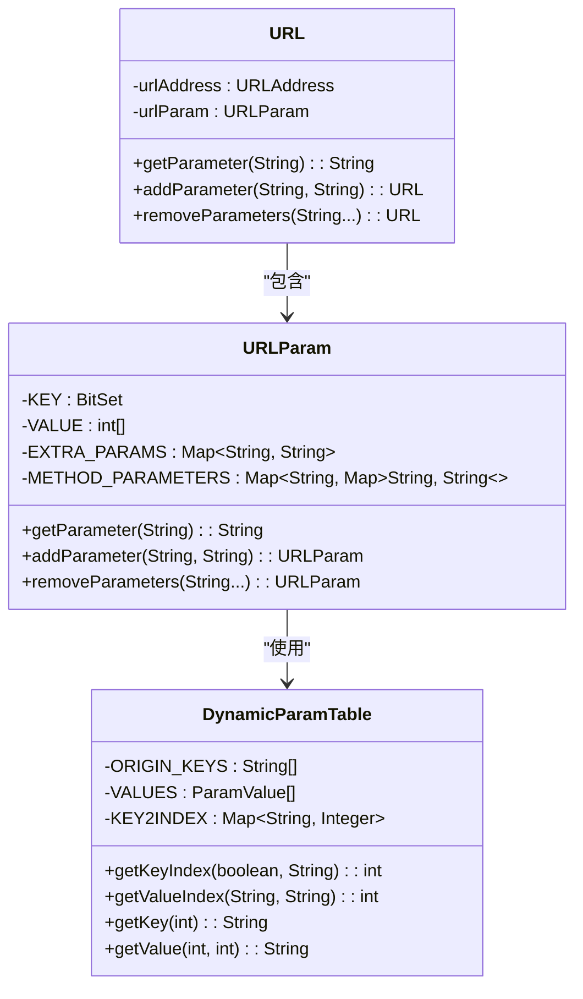

**图源**
- [URL.java](file://dubbo-common\src\main\java\org\apache\dubbo\common\URL.java)
- [URLParam.java](file://dubbo-common\src\main\java\org\apache\dubbo\common\url\component\URLParam.java)
- [DynamicParamTable.java](file://dubbo-common\src\main\java\org\apache\dubbo\common\url\component\param\DynamicParamTable.java)

`URLParam`类使用了多种数据结构来高效存储参数：
- `BitSet KEY`：使用位图来标记存在的参数键
- `int[] VALUE`：存储参数值的偏移量
- `Map<String, String> EXTRA_PARAMS`：存储不在`DynamicParamTable`中的额外参数
- `Map<String, Map<String, String>> METHOD_PARAMETERS`：存储方法级别的参数

这种设计使得常用参数键可以通过整数索引快速访问，提高了参数查找的效率。

**节源**
- [URLParam.java](file://dubbo-common\src\main\java\org\apache\dubbo\common\url\component\URLParam.java#L74-L102)

## 参数编码解码过程
URL参数的编码解码过程是确保参数在传输过程中正确性的关键。Dubbo通过`URLStrParser`类来处理参数的编码和解码。

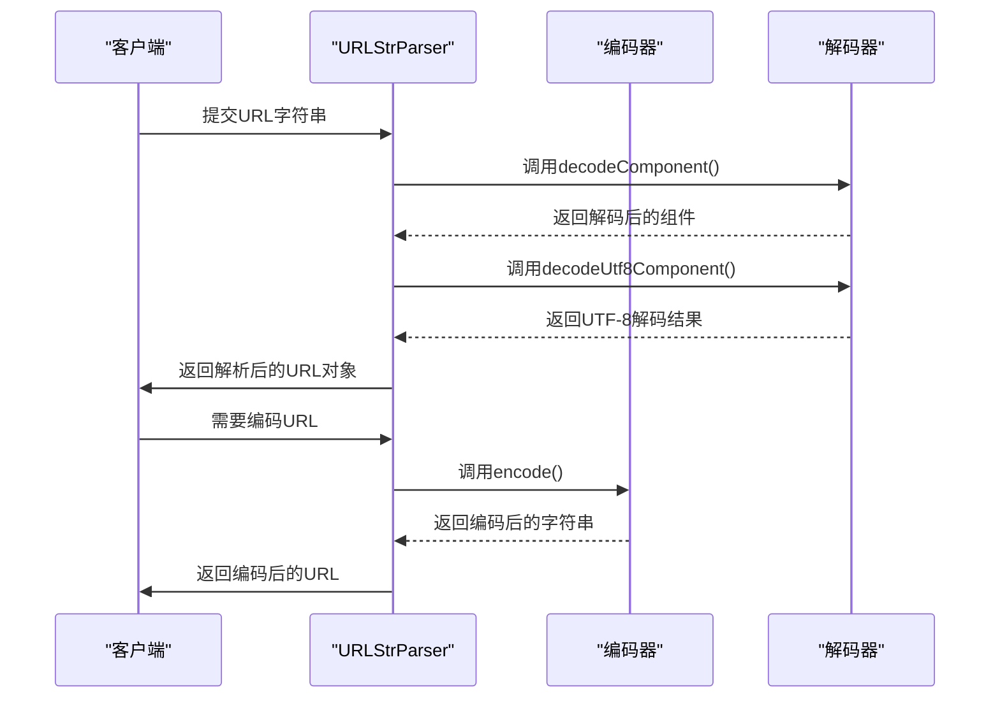

**图源**
- [URLStrParser.java](file://dubbo-common\src\main\java\org\apache\dubbo\common\URLStrParser.java)

编码解码过程主要包括以下步骤：
1. 对特殊字符进行百分号编码（如空格编码为%20）
2. 处理UTF-8字符的编码解码
3. 解析查询字符串中的键值对

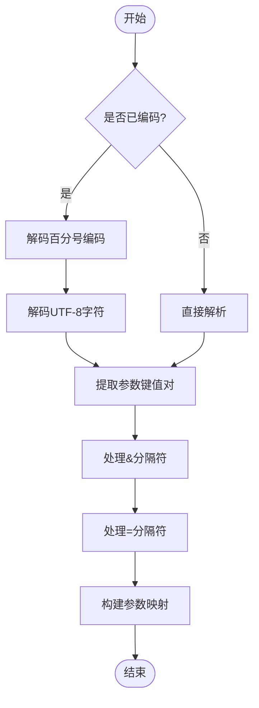

**图源**
- [URLStrParser.java](file://dubbo-common\src\main\java\org\apache\dubbo\common\URLStrParser.java#L373-L446)

对于复杂对象的处理，Dubbo会先将其序列化为字符串，然后再进行编码。特殊字符如中文、空格等都会被正确处理，确保参数的完整性和正确性。

**节源**
- [URLStrParser.java](file://dubbo-common\src\main\java\org\apache\dubbo\common\URLStrParser.java#L373-L446)

## 参数优先级与覆盖机制
Dubbo的URL参数管理实现了灵活的优先级和覆盖机制，确保配置的合理应用。

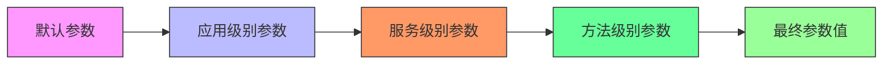

**图源**
- [URL.java](file://dubbo-common\src\main\java\org\apache\dubbo\common\URL.java)

参数的优先级规则如下：
1. 方法级别参数具有最高优先级
2. 服务级别参数次之
3. 应用级别参数再次之
4. 默认参数优先级最低

当存在相同名称的参数时，高优先级的参数会覆盖低优先级的参数。这种机制允许在不同层次上进行配置，实现了配置的精细化管理。

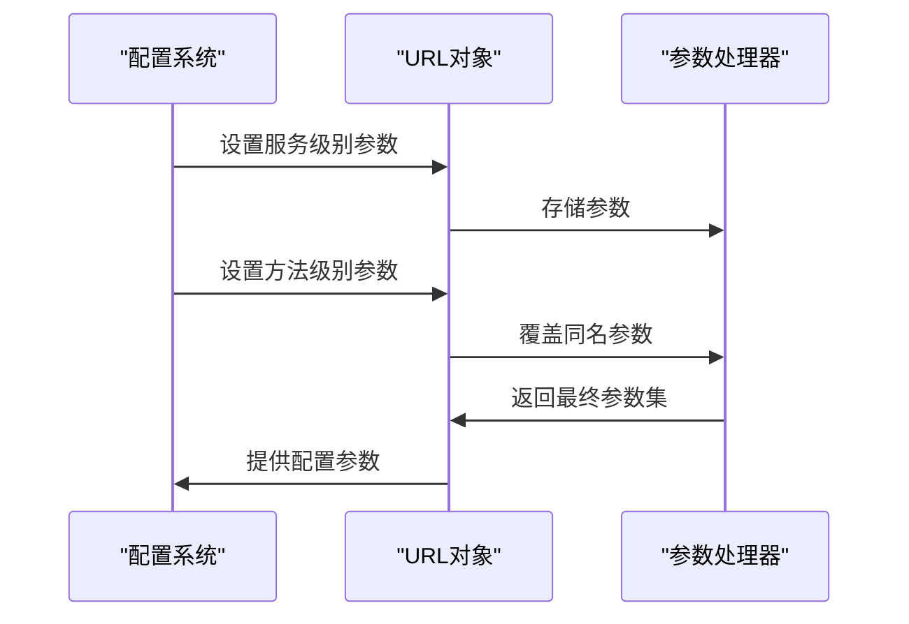

**图源**
- [URL.java](file://dubbo-common\src\main\java\org\apache\dubbo\common\URL.java)

**节源**
- [URL.java](file://dubbo-common\src\main\java\org\apache\dubbo\common\URL.java#L212-L242)

## API使用示例
Dubbo提供了丰富的API来操作URL参数，以下是主要的API使用示例。

### 参数获取操作
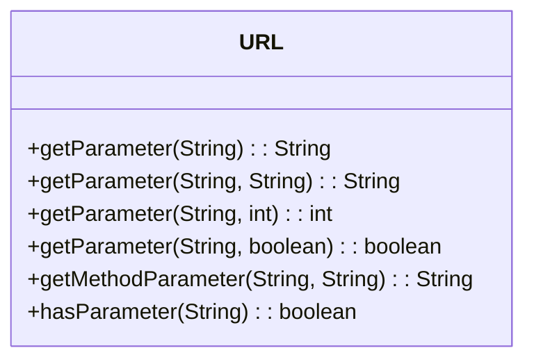

**图源**
- [URL.java](file://dubbo-common\src\main\java\org\apache\dubbo\common\URL.java)

### 参数设置操作
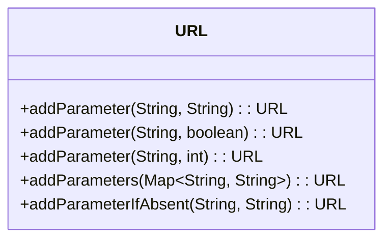

**图源**
- [URL.java](file://dubbo-common\src\main\java\org\apache\dubbo\common\URL.java)

### 参数删除操作
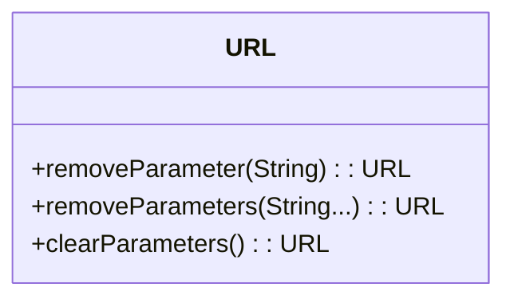

**图源**
- [URL.java](file://dubbo-common\src\main\java\org\apache\dubbo\common\URL.java)

这些API都遵循不可变原则，每次操作都会返回一个新的URL对象，确保了线程安全性。

**节源**
- [URL.java](file://dubbo-common\src\main\java\org\apache\dubbo\common\URL.java#L1770-L1878)

## 初学者操作示例
对于初学者，以下是一些基本的参数操作示例：

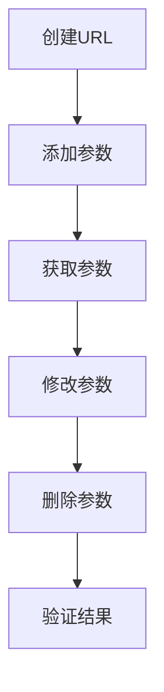

**图源**
- [URLTest.java](file://dubbo-common\src\test\java\org\apache\dubbo\common\URLTest.java)

1. 创建URL并添加参数：
```java
URL url = URL.valueOf("dubbo://127.0.0.1:20880");
url = url.addParameter("timeout", "5000");
```

2. 获取参数值：
```java
String timeout = url.getParameter("timeout");
int timeoutValue = url.getParameter("timeout", 1000);
```

3. 删除参数：
```java
url = url.removeParameter("timeout");
```

这些基本操作可以帮助初学者快速上手Dubbo的参数管理功能。

**节源**
- [URLTest.java](file://dubbo-common\src\test\java\org\apache\dubbo\common\URLTest.java#L66-L73)

## 高级优化建议
对于高级开发者，以下是一些参数管理的优化建议：

### 性能优化


**图源**
- [URLParam.java](file://dubbo-common\src\main\java\org\apache\dubbo\common\url\component\URLParam.java)

1. 尽量减少URL中的参数数量，只保留必要的配置
2. 利用`DynamicParamTable`的压缩特性，使用预定义的参数键
3. 避免频繁创建新的URL对象，可以考虑缓存常用的URL配置

### 内存优化
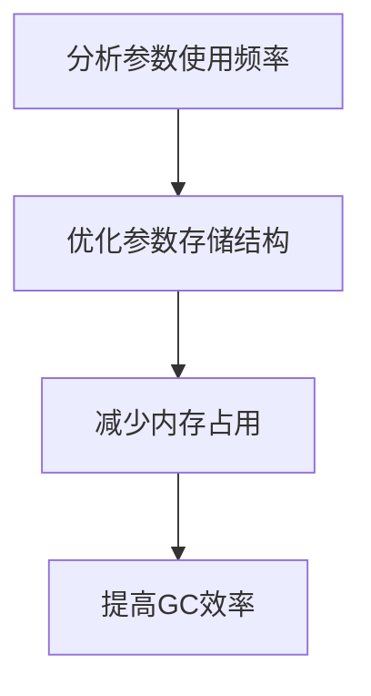

**图源**
- [URLParam.java](file://dubbo-common\src\main\java\org\apache\dubbo\common\url\component\URLParam.java)

通过分析参数的使用频率，可以优化参数的存储结构，减少内存占用，提高垃圾回收效率。

**节源**
- [URLParam.java](file://dubbo-common\src\main\java\org\apache\dubbo\common\url\component\URLParam.java#L559-L644)

## 配置灵活性支持
Dubbo的URL参数管理机制为配置灵活性和动态调整提供了强大的支持。

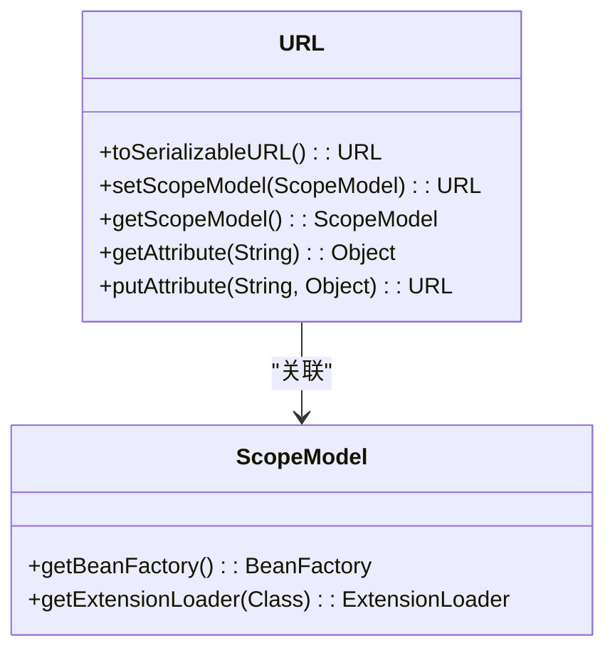

**图源**
- [URL.java](file://dubbo-common\src\main\java\org\apache\dubbo\common\URL.java)

通过`ScopeModel`机制，URL可以与不同的作用域模型关联，实现配置的动态调整。同时，`toSerializableURL()`方法支持URL的序列化，便于在网络间传输配置信息。

**节源**
- [URL.java](file://dubbo-common\src\main\java\org\apache\dubbo\common\URL.java#L949-L960)

## 结论
Dubbo的URL参数管理机制通过高效的存储结构、完善的编码解码过程、灵活的优先级规则和丰富的API，为分布式服务的配置管理提供了强大的支持。该机制不仅满足了基本的配置需求，还为高级优化和动态调整提供了可能，是Dubbo框架灵活性的重要体现。