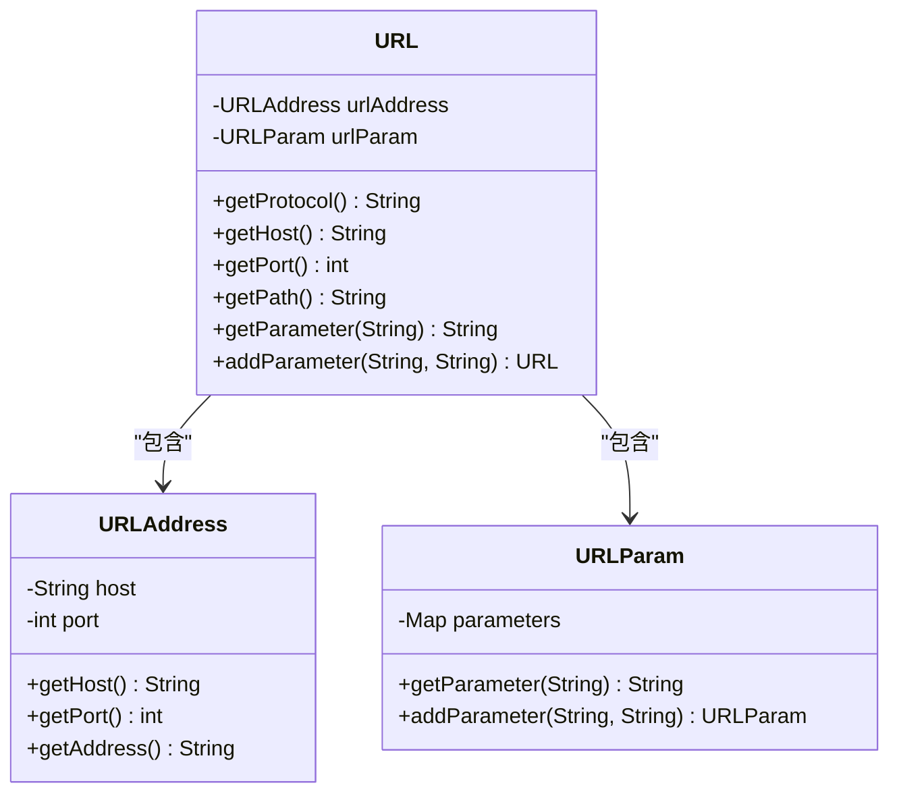
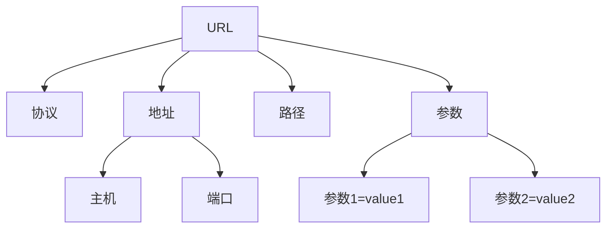
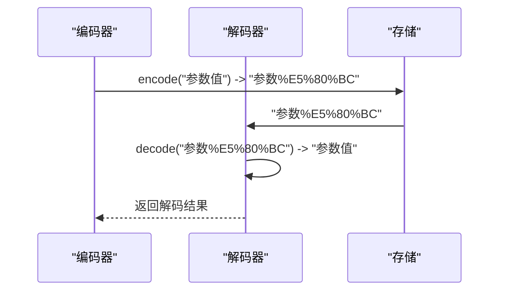
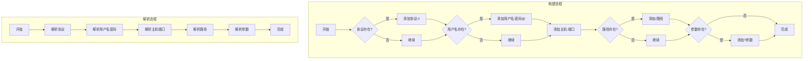
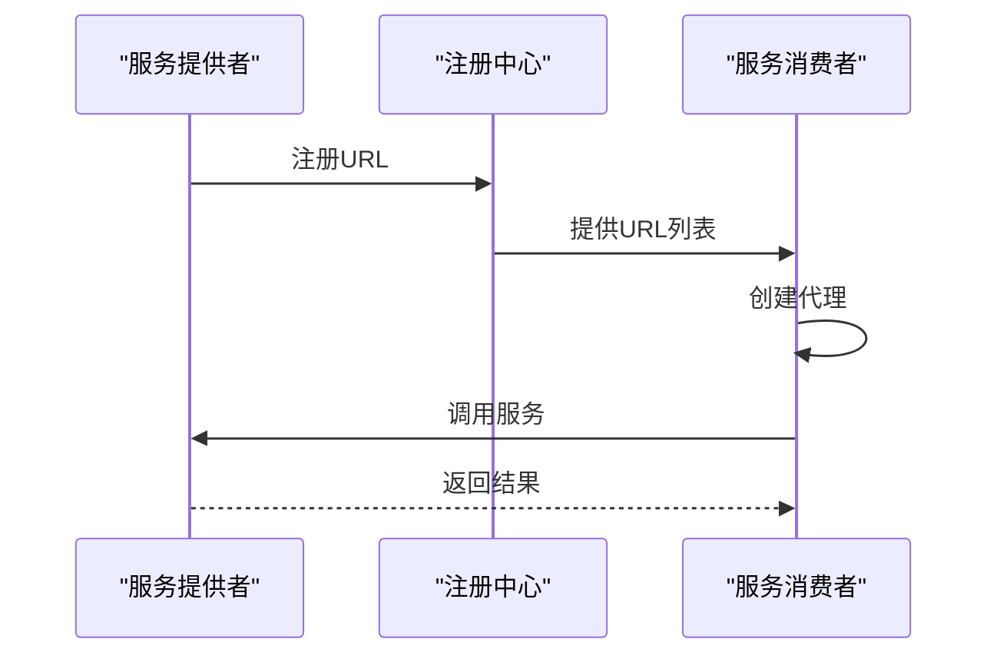
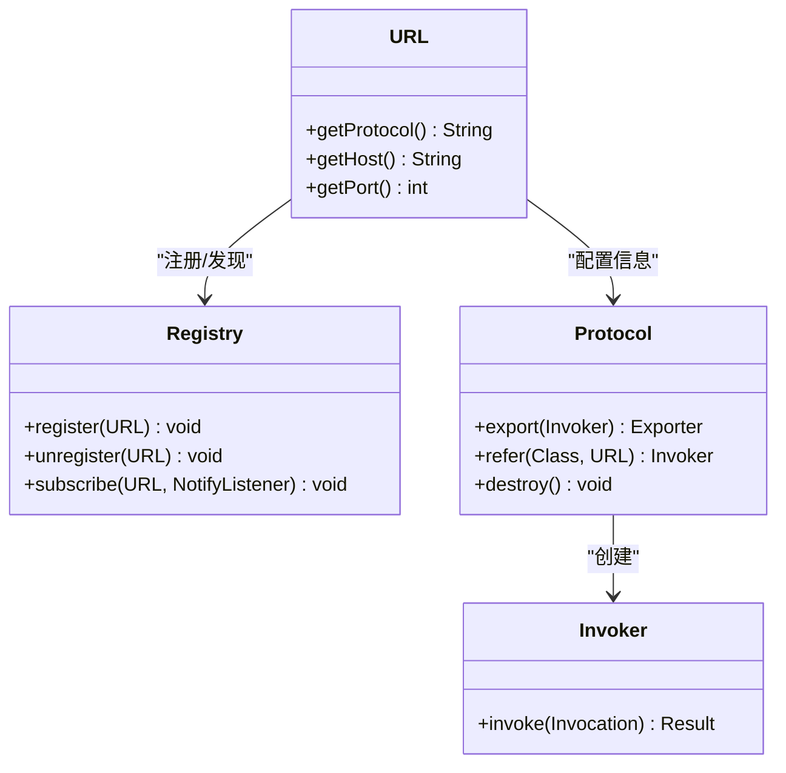
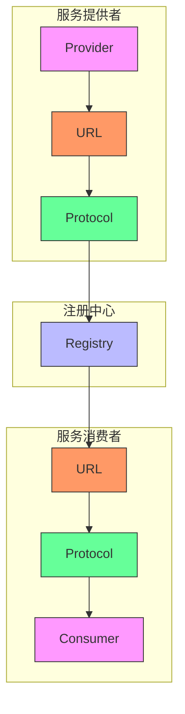

# URL配置总线

<cite>
**本文档引用的文件**   
- [URL.java](file://dubbo-common\src\main\java\org\apache\dubbo\common\URL.java)
- [URLStrParser.java](file://dubbo-common\src\main\java\org\apache\dubbo\common\URLStrParser.java)
- [URLAddress.java](file://dubbo-common\src\main\java\org\apache\dubbo\common\url\component\URLAddress.java)
- [Registry.java](file://dubbo-registry\dubbo-registry-api\src\main\java\org\apache\dubbo\registry\Registry.java)
- [Protocol.java](file://dubbo-rpc\dubbo-rpc-api\src\main\java\org\apache\dubbo\rpc\Protocol.java)
</cite>

## 目录
1. [引言](#引言)
2. [URL设计与实现](#url设计与实现)
3. [URL组成部分](#url组成部分)
4. [参数编码解码机制](#参数编码解码机制)
5. [URL构建与解析流程](#url构建与解析流程)
6. [实际应用示例](#实际应用示例)
7. [与其他组件交互](#与其他组件交互)
8. [使用示例与技巧](#使用示例与技巧)
9. [结构示意图](#结构示意图)

## 引言
URL配置总线是Dubbo框架中的核心组件，用于统一管理和传递配置参数。通过URL对象，Dubbo实现了服务暴露、引用、注册等过程中的配置信息传递。本文档详细阐述URL的设计理念、实现方式、组成部分、编码解码机制、构建解析流程以及实际应用。

**Section sources**
- [URL.java](file://dubbo-common\src\main\java\org\apache\dubbo\common\URL.java#L83-L145)

## URL设计与实现
URL类是Dubbo中用于表示统一资源定位符的核心类，具有不可变性和线程安全特性。它不仅包含了标准的URL组成部分（协议、地址、路径、参数等），还扩展了Dubbo特有的配置参数管理功能。

URL类的设计遵循了单一职责原则，将URL的地址信息和参数信息分别封装在URLAddress和URLParam两个组件中。这种设计使得URL的各个部分可以独立变化和扩展，提高了代码的可维护性和可扩展性。



**Diagram sources **
- [URL.java](file://dubbo-common\src\main\java\org\apache\dubbo\common\URL.java#L146-L2770)
- [URLAddress.java](file://dubbo-common\src\main\java\org\apache\dubbo\common\url\component\URLAddress.java#L29-L263)

**Section sources**
- [URL.java](file://dubbo-common\src\main\java\org\apache\dubbo\common\URL.java#L146-L2770)
- [URLAddress.java](file://dubbo-common\src\main\java\org\apache\dubbo\common\url\component\URLAddress.java#L29-L263)

## URL组成部分
URL对象由多个部分组成，每个部分都有特定的作用和意义：

1. **协议（Protocol）**：表示通信协议，如dubbo、http、registry等。
2. **地址（Address）**：包含主机名和端口号，用于定位服务提供者。
3. **路径（Path）**：表示服务的路径或接口名。
4. **参数（Parameters）**：键值对形式的配置参数，用于传递各种配置信息。

这些组成部分共同构成了一个完整的URL，用于在Dubbo框架中唯一标识一个服务。



**Diagram sources **
- [URL.java](file://dubbo-common\src\main\java\org\apache\dubbo\common\URL.java#L507-L794)

**Section sources**
- [URL.java](file://dubbo-common\src\main\java\org\apache\dubbo\common\URL.java#L507-L794)

## 参数编码解码机制
URL参数的编码解码机制是确保参数值能够正确传输和解析的关键。Dubbo使用UTF-8编码对参数值进行编码和解码，以支持各种字符集。

编码过程使用`URLEncoder.encode()`方法，将特殊字符转换为百分号编码形式；解码过程使用`URLDecoder.decode()`方法，将百分号编码转换回原始字符。这种机制确保了参数值在传输过程中不会被破坏。



**Diagram sources **
- [URL.java](file://dubbo-common\src\main\java\org\apache\dubbo\common\URL.java#L465-L485)
- [URLStrParser.java](file://dubbo-common\src\main\java\org\apache\dubbo\common\URLStrParser.java#L373-L446)

**Section sources**
- [URL.java](file://dubbo-common\src\main\java\org\apache\dubbo\common\URL.java#L465-L485)
- [URLStrParser.java](file://dubbo-common\src\main\java\org\apache\dubbo\common\URLStrParser.java#L373-L446)

## URL构建与解析流程
URL的构建和解析是两个互逆的过程。构建过程将各个组成部分组合成一个完整的URL字符串，而解析过程则将URL字符串分解为各个组成部分。

构建流程：
1. 检查协议是否存在，存在则添加"协议://"
2. 检查用户名和密码，存在则添加"用户名:密码@"
3. 添加主机和端口
4. 检查路径，存在则添加"/路径"
5. 检查参数，存在则添加"?参数"

解析流程：
1. 解析协议部分，提取协议名称
2. 解析用户名和密码部分
3. 解析主机和端口部分
4. 解析路径部分
5. 解析参数部分，构建参数映射



**Diagram sources **
- [URL.java](file://dubbo-common\src\main\java\org\apache\dubbo\common\URL.java#L2078-L2143)
- [URLStrParser.java](file://dubbo-common\src\main\java\org\apache\dubbo\common\URLStrParser.java#L57-L264)

**Section sources**
- [URL.java](file://dubbo-common\src\main\java\org\apache\dubbo\common\URL.java#L2078-L2143)
- [URLStrParser.java](file://dubbo-common\src\main\java\org\apache\dubbo\common\URLStrParser.java#L57-L264)

## 实际应用示例
URL在Dubbo的实际应用中扮演着重要角色，特别是在服务暴露和引用过程中。

在服务暴露时，Provider会创建一个包含服务信息的URL，然后通过Registry注册到注册中心。这个URL包含了服务的接口名、版本号、分组、协议、地址等信息。

在服务引用时，Consumer会从注册中心获取Provider的URL，然后根据URL中的信息创建代理对象，实现远程调用。



**Diagram sources **
- [Registry.java](file://dubbo-registry\dubbo-registry-api\src\main\java\org\apache\dubbo\registry\Registry.java#L31-L48)
- [Protocol.java](file://dubbo-rpc\dubbo-rpc-api\src\main\java\org\apache\dubbo\rpc\Protocol.java#L59-L119)

**Section sources**
- [Registry.java](file://dubbo-registry\dubbo-registry-api\src\main\java\org\apache\dubbo\registry\Registry.java#L31-L48)
- [Protocol.java](file://dubbo-rpc\dubbo-rpc-api\src\main\java\org\apache\dubbo\rpc\Protocol.java#L59-L119)

## 与其他组件交互
URL与Dubbo的其他核心组件有着密切的交互关系，特别是与Registry和Protocol组件。

与Registry的交互：URL作为服务注册和发现的核心载体，Provider通过Registry注册URL，Consumer通过Registry获取URL。Registry接口定义了register和unregister方法，用于管理URL的注册和注销。

与Protocol的交互：Protocol组件负责具体的远程调用实现，它使用URL中的信息来创建Exporter和Invoker。URL中的协议字段决定了使用哪种Protocol实现。



**Diagram sources **
- [Registry.java](file://dubbo-registry\dubbo-registry-api\src\main\java\org\apache\dubbo\registry\Registry.java#L31-L48)
- [Protocol.java](file://dubbo-rpc\dubbo-rpc-api\src\main\java\org\apache\dubbo\rpc\Protocol.java#L59-L119)
- [URL.java](file://dubbo-common\src\main\java\org\apache\dubbo\common\URL.java#L146-L2770)

**Section sources**
- [Registry.java](file://dubbo-registry\dubbo-registry-api\src\main\java\org\apache\dubbo\registry\Registry.java#L31-L48)
- [Protocol.java](file://dubbo-rpc\dubbo-rpc-api\src\main\java\org\apache\dubbo\rpc\Protocol.java#L59-L119)

## 使用示例与技巧
对于初学者，可以使用简单的URL构造方法：

```java
URL url = URL.valueOf("dubbo://192.168.1.100:20880/com.example.DemoService");
```

对于高级开发者，可以利用URL的链式调用特性进行参数优化：

```java
URL url = new URL("dubbo", "192.168.1.100", 20880)
    .addParameter("timeout", "5000")
    .addParameter("retries", "3")
    .addParameter("loadbalance", "roundrobin");
```

调试技巧：
1. 使用toFullString()方法查看完整的URL信息，包括用户名和密码
2. 使用toParameterString()方法只查看参数部分
3. 使用getServiceKey()方法获取服务的唯一标识

**Section sources**
- [URL.java](file://dubbo-common\src\main\java\org\apache\dubbo\common\URL.java#L1974-L2143)

## 结构示意图
以下是URL配置总线的整体结构示意图，展示了URL在Dubbo架构中的位置和作用。



**Diagram sources **
- [URL.java](file://dubbo-common\src\main\java\org\apache\dubbo\common\URL.java#L146-L2770)
- [Registry.java](file://dubbo-registry\dubbo-registry-api\src\main\java\org\apache\dubbo\registry\Registry.java#L31-L48)
- [Protocol.java](file://dubbo-rpc\dubbo-rpc-api\src\main\java\org\apache\dubbo\rpc\Protocol.java#L59-L119)

**Section sources**
- [URL.java](file://dubbo-common\src\main\java\org\apache\dubbo\common\URL.java#L146-L2770)
- [Registry.java](file://dubbo-registry\dubbo-registry-api\src\main\java\org\apache\dubbo\registry\Registry.java#L31-L48)
- [Protocol.java](file://dubbo-rpc\dubbo-rpc-api\src\main\java\org\apache\dubbo\rpc\Protocol.java#L59-L119)