# dubbo-common模块

<cite>
**Referenced Files in This Document**   
- [URL.java](file://dubbo-common/src/main/java/org/apache/dubbo/common/URL.java)
- [ExtensionLoader.java](file://dubbo-common/src/main/java/org/apache/dubbo/common/extension/ExtensionLoader.java)
- [FrameworkModel.java](file://dubbo-common/src/main/java/org/apache/dubbo/rpc/model/FrameworkModel.java)
- [ApplicationModel.java](file://dubbo-common/src/main/java/org/apache/dubbo/rpc/model/ApplicationModel.java)
- [ModuleModel.java](file://dubbo-common/src/main/java/org/apache/dubbo/rpc/model/ModuleModel.java)
- [ScopeModel.java](file://dubbo-common/src/main/java/org/apache/dubbo/rpc/model/ScopeModel.java)
- [Compiler.java](file://dubbo-common/src/main/java/org/apache/dubbo/common/compiler/Compiler.java)
</cite>

## 目录
1. [简介](#简介)
2. [SPI扩展机制](#spi扩展机制)
3. [URL配置总线](#url配置总线)
4. [作用域模型层次](#作用域模型层次)
5. [编译器与字节码生成](#编译器与字节码生成)
6. [公共工具类与通用功能](#公共工具类与通用功能)

## 简介

dubbo-common模块是Dubbo框架的核心基础组件，为整个Dubbo生态系统提供基础功能支持。该模块实现了Dubbo的核心机制，包括SPI扩展机制、URL配置总线、作用域模型层次、编译器与字节码生成等关键功能。作为Dubbo的基石，dubbo-common模块确保了框架的可扩展性、灵活性和高性能。

**Section sources**
- [URL.java](file://dubbo-common/src/main/java/org/apache/dubbo/common/URL.java#L1-L2770)
- [ExtensionLoader.java](file://dubbo-common/src/main/java/org/apache/dubbo/common/extension/ExtensionLoader.java#L1-L1818)

## SPI扩展机制

### ExtensionLoader工作机制

dubbo-common模块的核心是SPI（Service Provider Interface）扩展机制，通过ExtensionLoader类实现。ExtensionLoader是Dubbo SPI扩展点加载机制的核心实现类，负责加载、缓存和管理所有的扩展实现。

ExtensionLoader的主要功能包括：
- 加载Dubbo扩展
- 自动注入依赖扩展（IOC）
- 自动包装扩展（AOP）
- 默认扩展是一个自适应实例（Adaptive）
- 支持扩展激活（Activate）

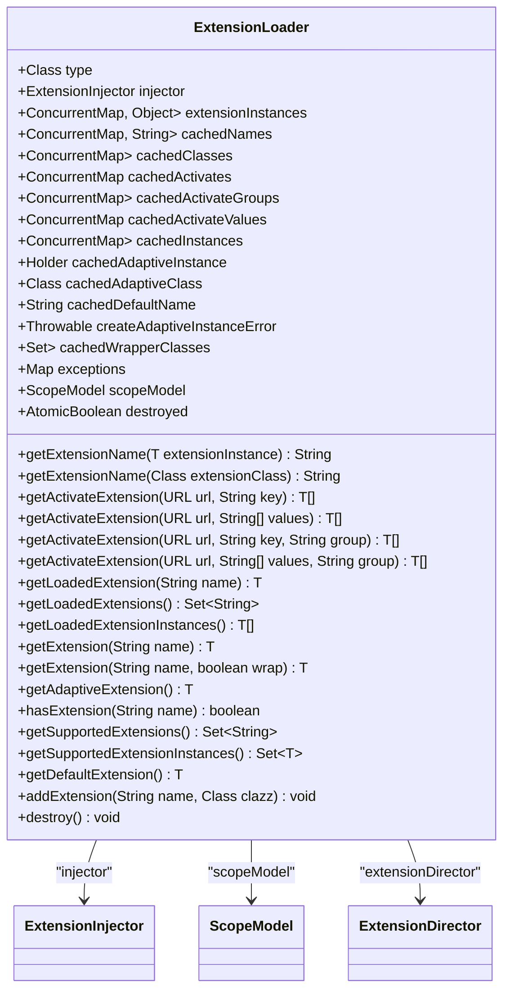

**Diagram sources **
- [ExtensionLoader.java](file://dubbo-common/src/main/java/org/apache/dubbo/common/extension/ExtensionLoader.java#L142-L1818)

### 扩展点加载流程

ExtensionLoader的扩展点加载流程遵循特定的策略，支持多种加载方式：

1. **加载策略**：
   - DubboInternalLoadingStrategy: META-INF/dubbo/internal/
   - DubboLoadingStrategy: META-INF/dubbo/
   - ServicesLoadingStrategy: META-INF/services/

2. **加载过程**：
   - 首先检查缓存中是否存在已加载的扩展类
   - 如果不存在，则通过类加载器从指定路径加载扩展定义文件
   - 解析扩展定义文件中的键值对，获取扩展实现类的全限定名
   - 验证扩展类是否符合要求（如是否为接口的实现类）
   - 将扩展类缓存到内存中，供后续使用

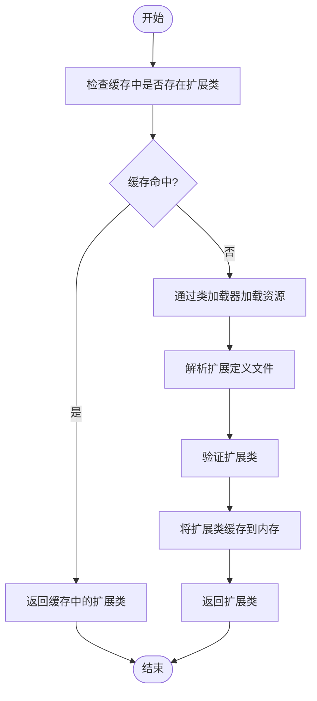

**Diagram sources **
- [ExtensionLoader.java](file://dubbo-common/src/main/java/org/apache/dubbo/common/extension/ExtensionLoader.java#L1434-L1458)

### SPI扩展生命周期

SPI扩展的完整生命周期包括创建、初始化、使用和销毁四个阶段：

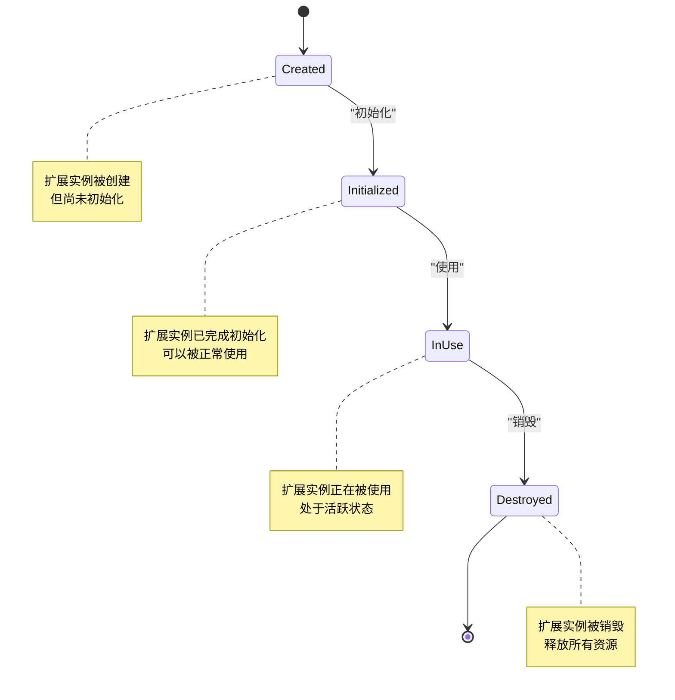

**Diagram sources **
- [ExtensionLoader.java](file://dubbo-common/src/main/java/org/apache/dubbo/common/extension/ExtensionLoader.java#L427-L457)

**Section sources**
- [ExtensionLoader.java](file://dubbo-common/src/main/java/org/apache/dubbo/common/extension/ExtensionLoader.java#L92-L1818)

## URL配置总线

### URL设计理念

URL在Dubbo中扮演着配置总线的角色，作为统一的资源配置和传递机制。URL类是Dubbo中最重要的基础类之一，它不仅表示网络资源定位符，还承载了丰富的配置信息。

URL的设计理念包括：
- **统一性**：所有配置信息都通过URL传递，确保配置的一致性和完整性
- **灵活性**：支持多种协议和格式，适应不同的使用场景
- **可扩展性**：通过参数机制支持自定义配置项
- **线程安全性**：URL对象是不可变的，保证线程安全

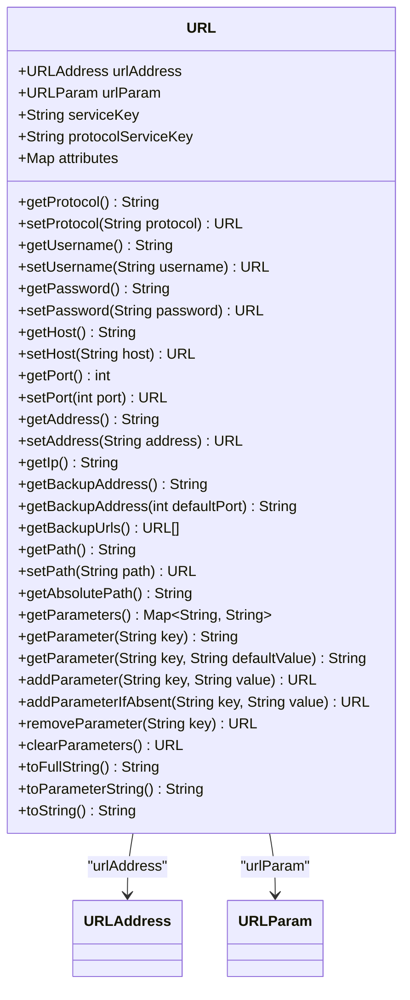

**Diagram sources **
- [URL.java](file://dubbo-common/src/main/java/org/apache/dubbo/common/URL.java#L146-L2770)

### URL参数解析流程

URL参数的解析和处理流程是Dubbo配置管理的核心：

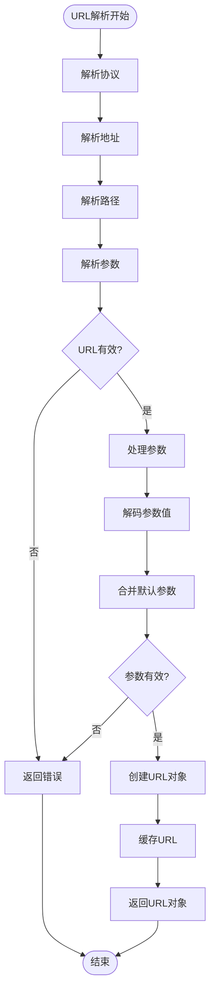

**Diagram sources **
- [URL.java](file://dubbo-common/src/main/java/org/apache/dubbo/common/URL.java#L376-L421)

**Section sources**
- [URL.java](file://dubbo-common/src/main/java/org/apache/dubbo/common/URL.java#L82-L2770)

## 作用域模型层次

### 架构设计

dubbo-common模块采用层次化的作用域模型设计，通过FrameworkModel、ApplicationModel和ModuleModel三个层次来组织和管理Dubbo的组件和配置。

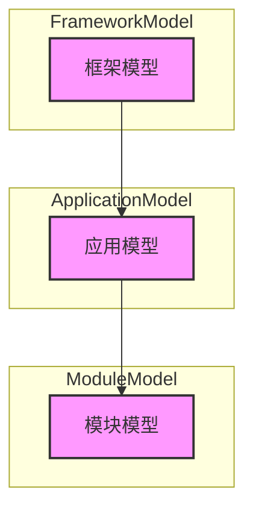

**Diagram sources **
- [FrameworkModel.java](file://dubbo-common/src/main/java/org/apache/dubbo/rpc/model/FrameworkModel.java#L85-L583)
- [ApplicationModel.java](file://dubbo-common/src/main/java/org/apache/dubbo/rpc/model/ApplicationModel.java#L69-L691)
- [ModuleModel.java](file://dubbo-common/src/main/java/org/apache/dubbo/rpc/model/ModuleModel.java#L44-L360)

### 职责划分

各层次模型的职责划分如下：

#### FrameworkModel（框架模型）

FrameworkModel是Dubbo模型层次结构的最顶层，代表整个Dubbo框架实例，可以被多个应用共享。

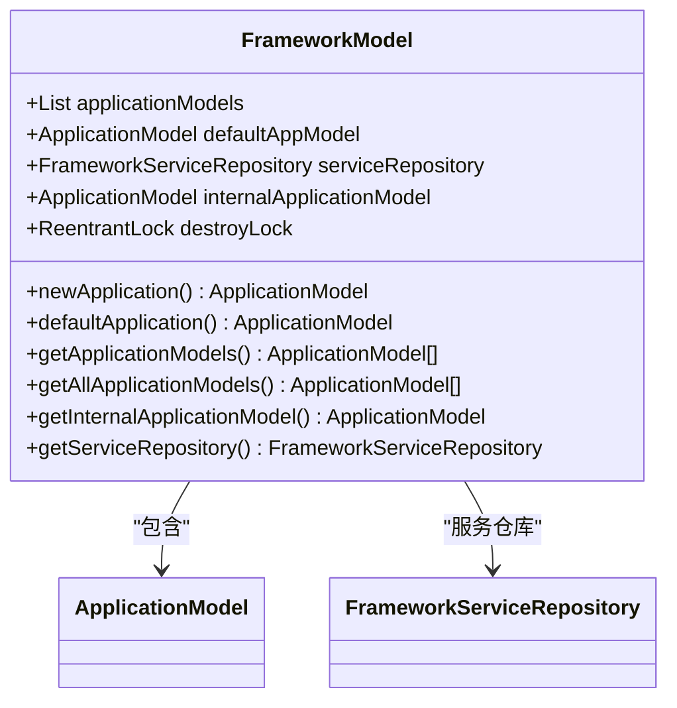

**Diagram sources **
- [FrameworkModel.java](file://dubbo-common/src/main/java/org/apache/dubbo/rpc/model/FrameworkModel.java#L85-L583)

#### ApplicationModel（应用模型）

ApplicationModel代表一个使用Dubbo的应用程序，存储在RPC调用处理期间使用的基本元数据信息。

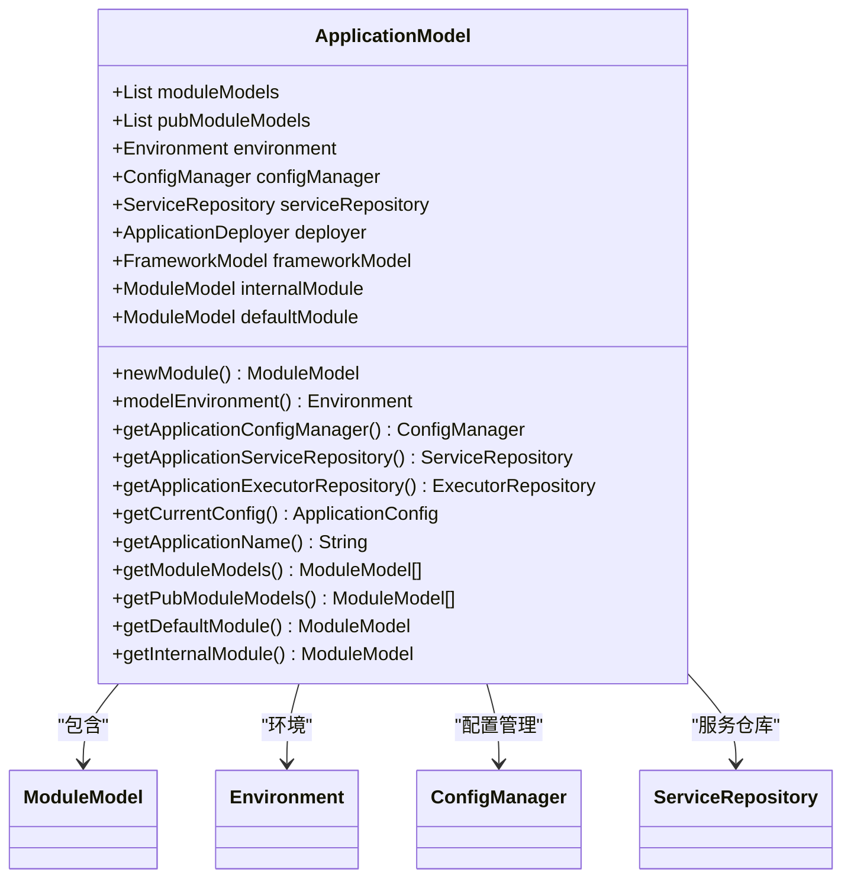

**Diagram sources **
- [ApplicationModel.java](file://dubbo-common/src/main/java/org/apache/dubbo/rpc/model/ApplicationModel.java#L69-L691)

#### ModuleModel（模块模型）

ModuleModel是服务的逻辑分组单位，每个模块可以包含多个服务的提供者和消费者。

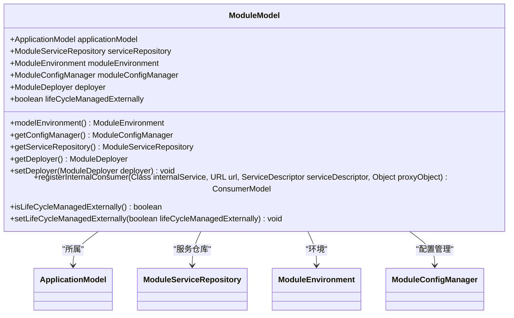

**Diagram sources **
- [ModuleModel.java](file://dubbo-common/src/main/java/org/apache/dubbo/rpc/model/ModuleModel.java#L44-L360)

**Section sources**
- [FrameworkModel.java](file://dubbo-common/src/main/java/org/apache/dubbo/rpc/model/FrameworkModel.java#L85-L583)
- [ApplicationModel.java](file://dubbo-common/src/main/java/org/apache/dubbo/rpc/model/ApplicationModel.java#L69-L691)
- [ModuleModel.java](file://dubbo-common/src/main/java/org/apache/dubbo/rpc/model/ModuleModel.java#L44-L360)
- [ScopeModel.java](file://dubbo-common/src/main/java/org/apache/dubbo/rpc/model/ScopeModel.java#L42-L363)

## 编译器与字节码生成

### 编译器机制

dubbo-common模块提供了灵活的编译器机制，支持在运行时动态编译Java代码。

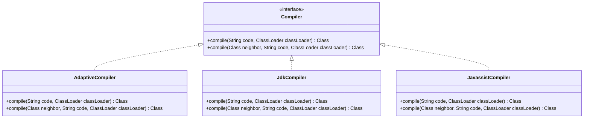

**Diagram sources **
- [Compiler.java](file://dubbo-common/src/main/java/org/apache/dubbo/common/compiler/Compiler.java#L26-L54)

### 字节码生成

字节码生成机制允许Dubbo在运行时动态创建类，提高框架的灵活性和性能。

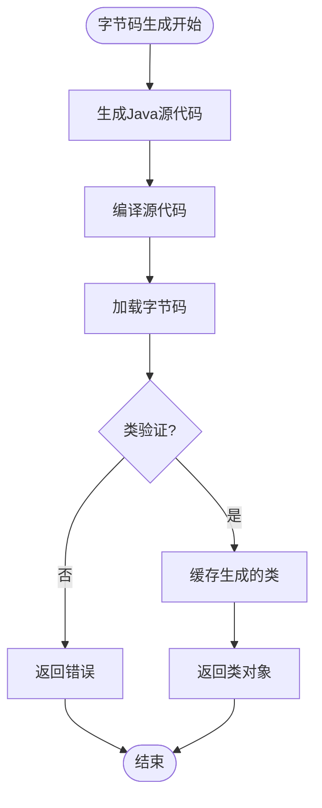

**Diagram sources **
- [Compiler.java](file://dubbo-common/src/main/java/org/apache/dubbo/common/compiler/Compiler.java#L26-L54)

**Section sources**
- [Compiler.java](file://dubbo-common/src/main/java/org/apache/dubbo/common/compiler/Compiler.java#L17-L54)

## 公共工具类与通用功能

dubbo-common模块提供了丰富的公共工具类和通用功能，包括但不限于：

- 配置管理工具
- 线程池管理
- 序列化工具
- 网络工具
- 字符串处理工具
- 集合操作工具
- 反射工具
- 日志工具

这些工具类为Dubbo框架的其他模块提供了基础支持，确保了框架的稳定性和可维护性。

**Section sources**
- [URL.java](file://dubbo-common/src/main/java/org/apache/dubbo/common/URL.java#L1-L2770)
- [ExtensionLoader.java](file://dubbo-common/src/main/java/org/apache/dubbo/common/extension/ExtensionLoader.java#L1-L1818)
- [FrameworkModel.java](file://dubbo-common/src/main/java/org/apache/dubbo/rpc/model/FrameworkModel.java#L1-L583)
- [ApplicationModel.java](file://dubbo-common/src/main/java/org/apache/dubbo/rpc/model/ApplicationModel.java#L1-L691)
- [ModuleModel.java](file://dubbo-common/src/main/java/org/apache/dubbo/rpc/model/ModuleModel.java#L1-L360)
- [ScopeModel.java](file://dubbo-common/src/main/java/org/apache/dubbo/rpc/model/ScopeModel.java#L1-L363)
- [Compiler.java](file://dubbo-common/src/main/java/org/apache/dubbo/common/compiler/Compiler.java#L1-L54)