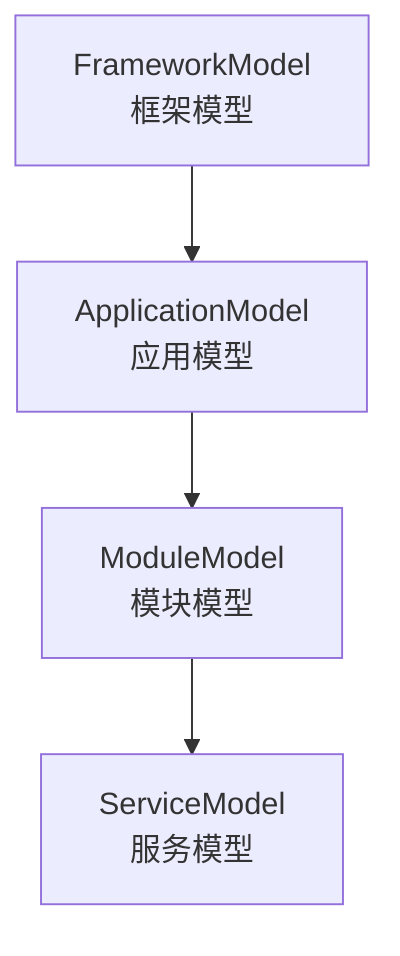
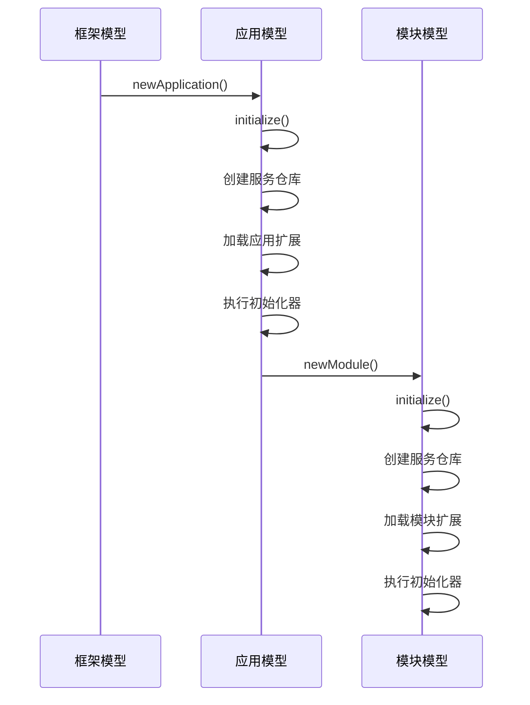
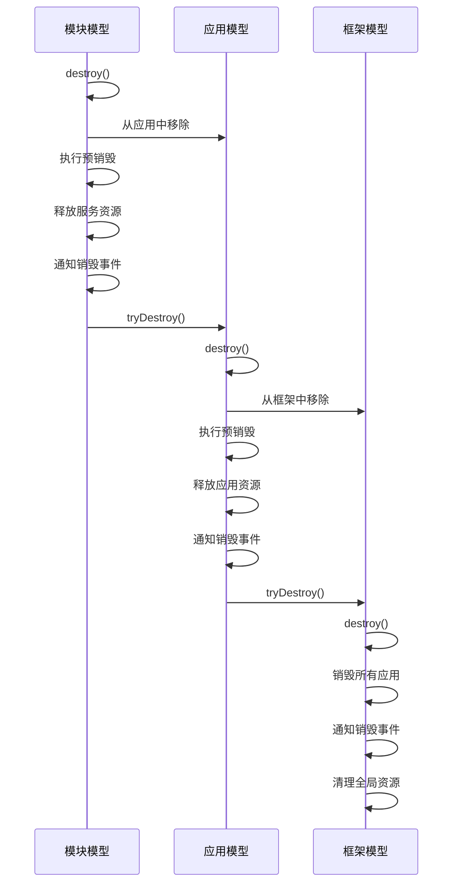

# 作用域模型层次

<cite>
**本文档引用的文件**
- [ScopeModel.java](file://dubbo-common\src\main\java\org\apache\dubbo\rpc\model\ScopeModel.java)
- [FrameworkModel.java](file://dubbo-common\src\main\java\org\apache\dubbo\rpc\model\FrameworkModel.java)
- [ApplicationModel.java](file://dubbo-common\src\main\java\org\apache\dubbo\rpc\model\ApplicationModel.java)
- [ModuleModel.java](file://dubbo-common\src\main\java\org\apache\dubbo\rpc\model\ModuleModel.java)
- [ScopeModelInitializer.java](file://dubbo-common\src\main\java\org\apache\dubbo\rpc\model\ScopeModelInitializer.java)
- [ScopeModelUtil.java](file://dubbo-common\src\main\java\org\apache\dubbo\rpc\model\ScopeModelUtil.java)
- [CommonScopeModelInitializer.java](file://dubbo-common\src\main\java\org\apache\dubbo\common\CommonScopeModelInitializer.java)
- [ConfigScopeModelInitializer.java](file://dubbo-config\dubbo-config-api\src\main\java\org\apache\dubbo\config\ConfigScopeModelInitializer.java)
</cite>

## 目录
1. [引言](#引言)
2. [作用域模型层次结构](#作用域模型层次结构)
3. [模型职责划分](#模型职责划分)
4. [模型生命周期管理](#模型生命周期管理)
5. [数据共享与隔离机制](#数据共享与隔离机制)
6. [多应用多模块场景下的应用](#多应用多模块场景下的应用)
7. [模型使用示例](#模型使用示例)
8. [与其他核心组件的交互](#与其他核心组件的交互)
9. [模型定制与扩展技巧](#模型定制与扩展技巧)
10. [总结](#总结)

## 引言
Dubbo的作用域模型（Scope Model）是框架的核心架构设计，它通过分层的模型结构实现了组件的隔离、复用和管理。作用域模型体系由`FrameworkModel`、`ApplicationModel`和`ModuleModel`三个层次构成，形成了一个树状的层级结构。这种设计不仅支持多应用共享框架实例，还实现了配置和资源的隔离，为复杂应用提供了灵活的架构支持。

## 作用域模型层次结构
Dubbo的作用域模型采用树状层级结构，从上到下依次为`FrameworkModel`、`ApplicationModel`和`ModuleModel`。每个模型都有唯一的内部ID，用于表示其在模型树中的位置，如`1`表示框架模型，`1.1`表示第一个应用模型，`1.1.1`表示第一个模块模型。



**图示来源**
- [FrameworkModel.java](file://dubbo-common\src\main\java\org\apache\dubbo\rpc\model\FrameworkModel.java#L47-L53)
- [ApplicationModel.java](file://dubbo-common\src\main\java\org\apache\dubbo\rpc\model\ApplicationModel.java#L51-L55)
- [ModuleModel.java](file://dubbo-common\src\main\java\org\apache\dubbo\rpc\model\ModuleModel.java#L41-L42)

**本节来源**
- [ScopeModel.java](file://dubbo-common\src\main\java\org\apache\dubbo\rpc\model\ScopeModel.java#L45-L56)
- [FrameworkModel.java](file://dubbo-common\src\main\java\org\apache\dubbo\rpc\model\FrameworkModel.java#L47-L53)

## 模型职责划分
作用域模型的三个层次各有明确的职责划分，形成了清晰的分层架构。

### FrameworkModel（框架模型）
`FrameworkModel`是作用域模型的最顶层，代表整个Dubbo框架实例。它负责管理所有`ApplicationModel`实例，提供全局默认框架模型实例，维护框架级别的服务仓库，并控制框架的生命周期。框架模型还包含一个内部应用模型，用于Dubbo内部使用。

### ApplicationModel（应用模型）
`ApplicationModel`代表一个使用Dubbo的应用程序，存储RPC调用处理期间使用的基本元数据信息。它负责管理多个`ModuleModel`实例，提供应用级别的配置管理器和服务仓库。应用模型还包含一个内部模块和一个默认模块，分别用于框架内部服务和未明确指定模块的服务。

### ModuleModel（模块模型）
`ModuleModel`是服务的逻辑分组单位，每个模块可以包含多个服务的提供者和消费者。它负责管理该模块的服务提供者和消费者，提供模块级别的配置管理器和环境配置。一个应用可以包含多个模块，实现服务的逻辑分组和隔离。

**本节来源**
- [FrameworkModel.java](file://dubbo-common\src\main\java\org\apache\dubbo\rpc\model\FrameworkModel.java#L40-L83)
- [ApplicationModel.java](file://dubbo-common\src\main\java\org\apache\dubbo\rpc\model\ApplicationModel.java#L40-L68)
- [ModuleModel.java](file://dubbo-common\src\main\java\org\apache\dubbo\rpc\model\ModuleModel.java#L38-L42)

## 模型生命周期管理
作用域模型的生命周期管理包括初始化和销毁两个主要过程，通过父子模型间的协作实现。

### 初始化过程
模型的初始化在构造函数中完成，遵循从父到子的顺序。父模型在构造子模型时，会将子模型添加到自己的管理列表中，并触发子模型的初始化。初始化过程包括创建服务仓库、加载扩展实例、执行初始化器等步骤。



**图示来源**
- [FrameworkModel.java](file://dubbo-common\src\main\java\org\apache\dubbo\rpc\model\FrameworkModel.java#L146-L171)
- [ApplicationModel.java](file://dubbo-common\src\main\java\org\apache\dubbo\rpc\model\ApplicationModel.java#L136-L189)
- [ModuleModel.java](file://dubbo-common\src\main\java\org\apache\dubbo\rpc\model\ModuleModel.java#L67-L115)

### 销毁过程
模型的销毁遵循从子到父的顺序，通过`destroy()`方法触发。销毁过程包括从父模型中移除自身、执行预销毁操作、释放资源、通知销毁事件等步骤。当所有子模型都被销毁后，父模型会自动尝试销毁自身。



**图示来源**
- [FrameworkModel.java](file://dubbo-common\src\main\java\org\apache\dubbo\rpc\model\FrameworkModel.java#L193-L240)
- [ApplicationModel.java](file://dubbo-common\src\main\java\org\apache\dubbo\rpc\model\ApplicationModel.java#L207-L256)
- [ModuleModel.java](file://dubbo-common\src\main\java\org\apache\dubbo\rpc\model\ModuleModel.java#L133-L173)

**本节来源**
- [ScopeModel.java](file://dubbo-common\src\main\java\org\apache\dubbo\rpc\model\ScopeModel.java#L117-L141)
- [FrameworkModel.java](file://dubbo-common\src\main\java\org\apache\dubbo\rpc\model\FrameworkModel.java#L193-L240)
- [ApplicationModel.java](file://dubbo-common\src\main\java\org\apache\dubbo\rpc\model\ApplicationModel.java#L207-L256)
- [ModuleModel.java](file://dubbo-common\src\main\java\org\apache\dubbo\rpc\model\ModuleModel.java#L133-L173)

## 数据共享与隔离机制
作用域模型通过继承和隔离机制实现了数据的共享与隔离。

### 数据继承
子模型会继承父模型的部分数据，如类加载器、扩展加载器等。当父模型添加类加载器时，会自动通知所有子模型添加相同的类加载器，确保类加载器的一致性。

### 数据隔离
每个模型都有独立的数据存储，如服务仓库、配置管理器等。这种隔离机制确保了不同应用或模块之间的配置和资源不会相互干扰，实现了真正的隔离。

**本节来源**
- [ScopeModel.java](file://dubbo-common\src\main\java\org\apache\dubbo\rpc\model\ScopeModel.java#L224-L246)
- [ApplicationModel.java](file://dubbo-common\src\main\java\org\apache\dubbo\rpc\model\ApplicationModel.java#L492-L512)
- [ModuleModel.java](file://dubbo-common\src\main\java\org\apache\dubbo\rpc\model\ModuleModel.java#L199-L205)

## 多应用多模块场景下的应用
作用域模型的设计特别适合多应用多模块的复杂场景。

### 多应用共享
多个应用可以共享同一个`FrameworkModel`实例，实现框架资源的共享。每个应用都有独立的`ApplicationModel`，确保配置和资源的隔离。

### 多模块管理
一个应用可以包含多个`ModuleModel`，实现服务的逻辑分组。不同模块可以有不同的配置，满足复杂业务需求。

**本节来源**
- [FrameworkModel.java](file://dubbo-common\src\main\java\org\apache\dubbo\rpc\model\FrameworkModel.java#L67-L73)
- [ApplicationModel.java](file://dubbo-common\src\main\java\org\apache\dubbo\rpc\model\ApplicationModel.java#L40-L45)

## 模型使用示例
### 获取模型实例
```java
// 获取默认框架模型
FrameworkModel frameworkModel = FrameworkModel.defaultModel();

// 获取默认应用模型
ApplicationModel applicationModel = ApplicationModel.defaultModel();

// 获取默认模块模型
ModuleModel moduleModel = ApplicationModel.defaultModel().getDefaultModule();
```

### 注册组件
```java
// 在模块中注册内部消费者
ConsumerModel consumerModel = moduleModel.registerInternalConsumer(
    MyService.class, 
    url, 
    serviceDescriptor, 
    proxyObject
);
```

**本节来源**
- [FrameworkModel.java](file://dubbo-common\src\main\java\org\apache\dubbo\rpc\model\FrameworkModel.java#L284-L297)
- [ApplicationModel.java](file://dubbo-common\src\main\java\org\apache\dubbo\rpc\model\ApplicationModel.java#L124-L127)
- [ModuleModel.java](file://dubbo-common\src\main\java\org\apache\dubbo\rpc\model\ModuleModel.java#L287-L316)

## 与其他核心组件的交互
作用域模型与`ExtensionLoader`、`ConfigManager`等核心组件有紧密的交互。

### 与ExtensionLoader的交互
每个模型都有独立的`ExtensionLoader`实例，用于加载该作用域下的扩展。`ScopeModelUtil`提供了便捷的方法来获取指定作用域的`ExtensionLoader`。

### 与ConfigManager的交互
`ApplicationModel`和`ModuleModel`都包含配置管理器，用于管理该作用域下的配置。配置管理器通过懒加载方式获取，确保按需初始化。

**本节来源**
- [ScopeModelUtil.java](file://dubbo-common\src\main\java\org\apache\dubbo\rpc\model\ScopeModelUtil.java#L100-L118)
- [ApplicationModel.java](file://dubbo-common\src\main\java\org\apache\dubbo\rpc\model\ApplicationModel.java#L298-L305)
- [ModuleModel.java](file://dubbo-common\src\main\java\org\apache\dubbo\rpc\model\ModuleModel.java#L228-L233)

## 模型定制与扩展技巧
### 自定义初始化器
通过实现`ScopeModelInitializer`接口，可以在模型初始化时执行自定义逻辑。

```java
public class MyScopeModelInitializer implements ScopeModelInitializer {
    @Override
    public void initializeFrameworkModel(FrameworkModel frameworkModel) {
        // 自定义框架模型初始化逻辑
    }
    
    @Override
    public void initializeApplicationModel(ApplicationModel applicationModel) {
        // 自定义应用模型初始化逻辑
    }
    
    @Override
    public void initializeModuleModel(ModuleModel moduleModel) {
        // 自定义模块模型初始化逻辑
    }
}
```

### 模型监听器
通过实现`ScopeModelDestroyListener`接口，可以在模型销毁时执行清理操作。

**本节来源**
- [ScopeModelInitializer.java](file://dubbo-common\src\main\java\org\apache\dubbo\rpc\model\ScopeModelInitializer.java#L25-L29)
- [ScopeModelDestroyListener.java](file://dubbo-common\src\main\java\org\apache\dubbo\rpc\model\ScopeModelDestroyListener.java#L19-L25)
- [CommonScopeModelInitializer.java](file://dubbo-common\src\main\java\org\apache\dubbo\common\CommonScopeModelInitializer.java)
- [ConfigScopeModelInitializer.java](file://dubbo-config\dubbo-config-api\src\main\java\org\apache\dubbo\config\ConfigScopeModelInitializer.java)

## 总结
Dubbo的作用域模型通过`FrameworkModel`、`ApplicationModel`和`ModuleModel`三个层次的分层设计，实现了组件的隔离、复用和管理。这种设计不仅支持多应用共享框架实例，还实现了配置和资源的隔离，为复杂应用提供了灵活的架构支持。通过理解模型的层次结构、职责划分、生命周期管理、数据共享与隔离机制，开发者可以更好地利用Dubbo框架构建高性能、可扩展的分布式应用。