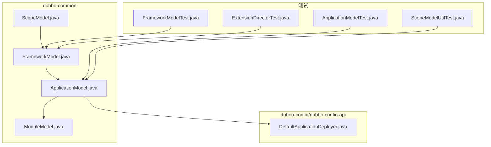
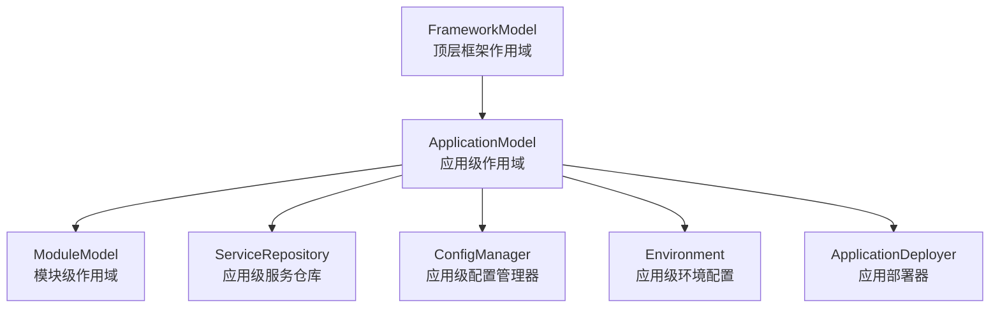
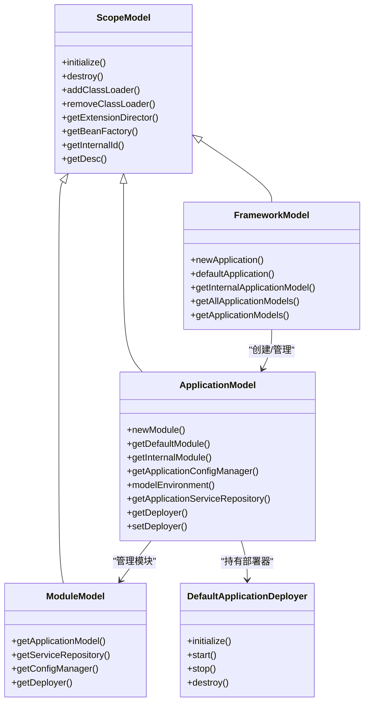
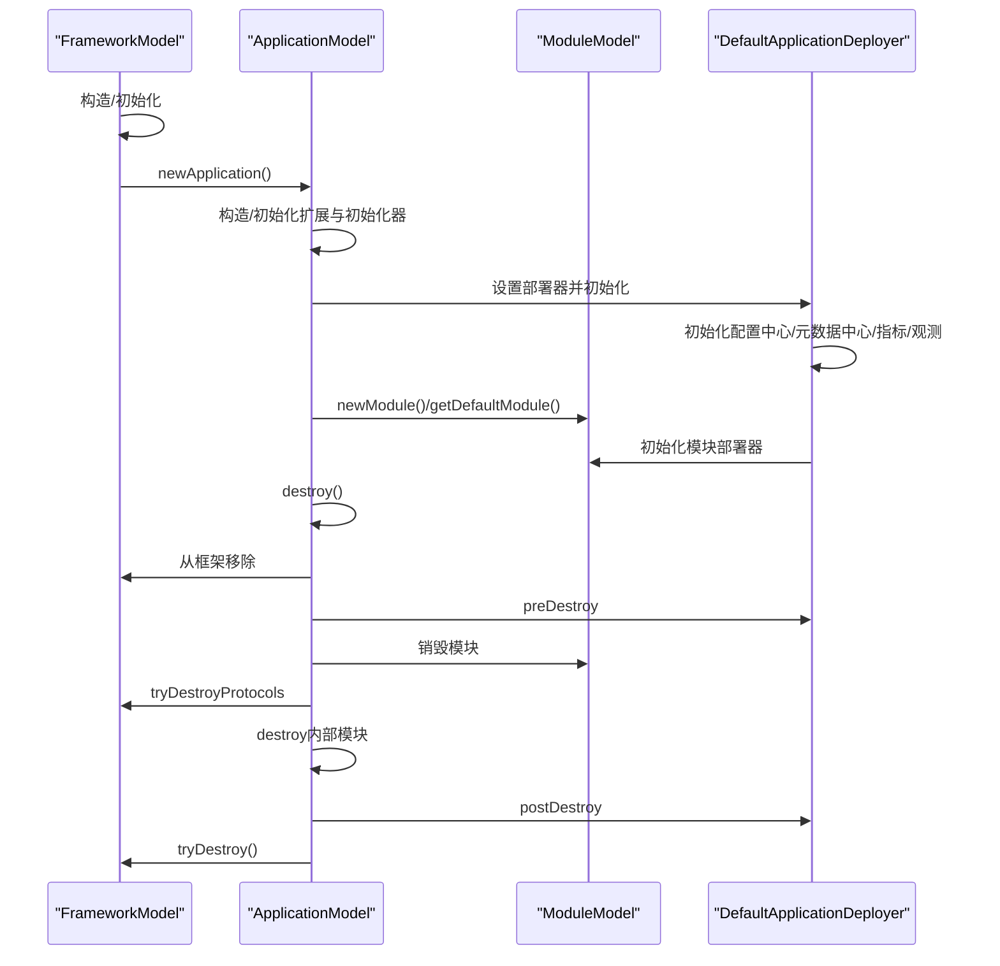
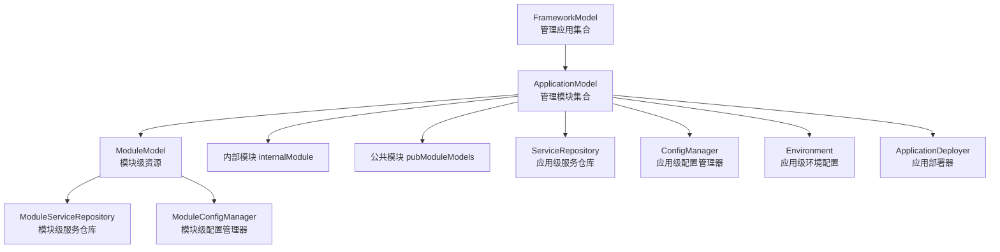
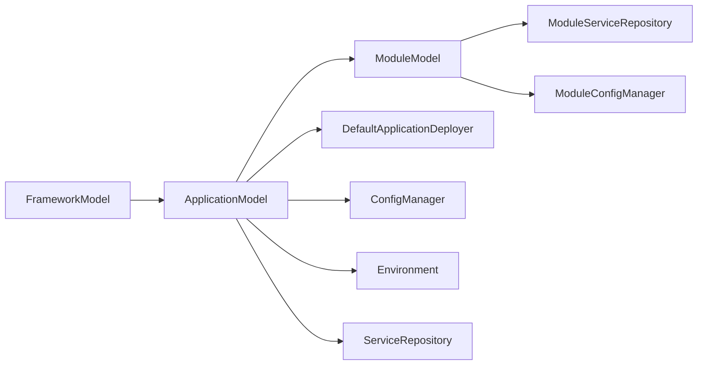
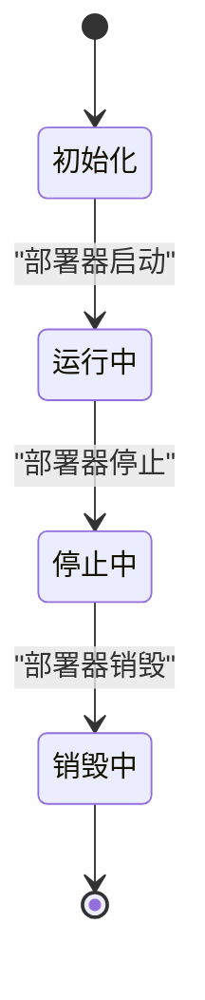

# 应用模型

<cite>
**本文引用的文件**
- [ApplicationModel.java](file://dubbo-common/src/main/java/org/apache/dubbo/rpc/model/ApplicationModel.java)
- [FrameworkModel.java](file://dubbo-common/src/main/java/org/apache/dubbo/rpc/model/FrameworkModel.java)
- [ModuleModel.java](file://dubbo-common/src/main/java/org/apache/dubbo/rpc/model/ModuleModel.java)
- [ScopeModel.java](file://dubbo-common/src/main/java/org/apache/dubbo/rpc/model/ScopeModel.java)
- [DefaultApplicationDeployer.java](file://dubbo-config/dubbo-config-api/src/main/java/org/apache/dubbo/config/deplo/DubboShutdownHook.java)
- [DefaultApplicationDeployer.java](file://dubbo-config/dubbo-config-api/src/main/java/org/apache/dubbo/config/deploy/DefaultApplicationDeployer.java)
- [ApplicationModelTest.java](file://dubbo-common/src/test/java/org/apache/dubbo/rpc/model/ApplicationModelTest.java)
- [FrameworkModelTest.java](file://dubbo-common/src/test/java/org/apache/dubbo/rpc/model/FrameworkModelTest.java)
- [ScopeModelUtilTest.java](file://dubbo-common/src/test/java/org/apache/dubbo/rpc/model/ScopeModelUtilTest.java)
- [ExtensionDirectorTest.java](file://dubbo-common/src/test/java/org/apache/dubbo/common/extension/ExtensionDirectorTest.java)
</cite>

## 目录
1. [简介](#简介)
2. [项目结构](#项目结构)
3. [核心组件](#核心组件)
4. [架构总览](#架构总览)
5. [详细组件分析](#详细组件分析)
6. [依赖分析](#依赖分析)
7. [性能考虑](#性能考虑)
8. [故障排查指南](#故障排查指南)
9. [结论](#结论)
10. [附录](#附录)

## 简介
本文件系统化梳理 Dubbo 的应用级作用域模型 ApplicationModel，围绕其职责边界、生命周期管理、与 FrameworkModel/ModuleModel 的层次关系、以及在微服务架构中的应用方式进行深入说明。文档同时提供可操作的使用示例路径与最佳实践，帮助初学者快速上手，也为高级开发者提供定制与扩展思路。

## 项目结构
ApplicationModel 位于通用模型层，与框架模型、模块模型共同构成 Dubbo 的作用域模型树。下图展示其在代码库中的位置与关键依赖：

图表来源
- [ScopeModel.java](file://dubbo-common/src/main/java/org/apache/dubbo/rpc/model/ScopeModel.java#L1-L120)
- [FrameworkModel.java](file://dubbo-common/src/main/java/org/apache/dubbo/rpc/model/FrameworkModel.java#L1-L120)
- [ApplicationModel.java](file://dubbo-common/src/main/java/org/apache/dubbo/rpc/model/ApplicationModel.java#L1-L120)
- [ModuleModel.java](file://dubbo-common/src/main/java/org/apache/dubbo/rpc/model/ModuleModel.java#L1-L120)
- [DefaultApplicationDeployer.java](file://dubbo-config/dubbo-config-api/src/main/java/org/apache/dubbo/config/deploy/DefaultApplicationDeployer.java#L1-L120)
- [ApplicationModelTest.java](file://dubbo-common/src/test/java/org/apache/dubbo/rpc/model/ApplicationModelTest.java#L1-L60)
- [FrameworkModelTest.java](file://dubbo-common/src/test/java/org/apache/dubbo/rpc/model/FrameworkModelTest.java#L1-L60)
- [ScopeModelUtilTest.java](file://dubbo-common/src/test/java/org/apache/dubbo/rpc/model/ScopeModelUtilTest.java#L1-L60)
- [ExtensionDirectorTest.java](file://dubbo-common/src/test/java/org/apache/dubbo/common/extension/ExtensionDirectorTest.java#L154-L184)

章节来源
- [ScopeModel.java](file://dubbo-common/src/main/java/org/apache/dubbo/rpc/model/ScopeModel.java#L1-L120)
- [FrameworkModel.java](file://dubbo-common/src/main/java/org/apache/dubbo/rpc/model/FrameworkModel.java#L1-L120)
- [ApplicationModel.java](file://dubbo-common/src/main/java/org/apache/dubbo/rpc/model/ApplicationModel.java#L1-L120)
- [ModuleModel.java](file://dubbo-common/src/main/java/org/apache/dubbo/rpc/model/ModuleModel.java#L1-L120)
- [DefaultApplicationDeployer.java](file://dubbo-config/dubbo-config-api/src/main/java/org/apache/dubbo/config/deploy/DefaultApplicationDeployer.java#L1-L120)

## 核心组件
- 作用域基类 ScopeModel：提供扩展加载器、Bean 工厂、类加载器管理、销毁监听、内部 ID 与描述字符串等通用能力。
- 框架模型 FrameworkModel：顶层作用域，管理多个应用模型、内部应用模型、全局资源与销毁流程。
- 应用模型 ApplicationModel：应用级作用域，持有应用级配置、环境、服务仓库、部署器；管理模块集合（含内部模块与公共模块）。
- 模块模型 ModuleModel：服务逻辑分组，承载模块级配置、环境、服务仓库与部署器；与应用模型双向关联。
- 应用部署器 DefaultApplicationDeployer：应用生命周期的编排者，负责初始化、启动、停止、销毁阶段的协调与资源管理。

章节来源
- [ScopeModel.java](file://dubbo-common/src/main/java/org/apache/dubbo/rpc/model/ScopeModel.java#L100-L220)
- [FrameworkModel.java](file://dubbo-common/src/main/java/org/apache/dubbo/rpc/model/FrameworkModel.java#L120-L220)
- [ApplicationModel.java](file://dubbo-common/src/main/java/org/apache/dubbo/rpc/model/ApplicationModel.java#L60-L120)
- [ModuleModel.java](file://dubbo-common/src/main/java/org/apache/dubbo/rpc/model/ModuleModel.java#L40-L120)
- [DefaultApplicationDeployer.java](file://dubbo-config/dubbo-config-api/src/main/java/org/apache/dubbo/config/deploy/DefaultApplicationDeployer.java#L1-L120)

## 架构总览
下图展示 ApplicationModel 在整体模型树中的层级关系与职责边界：

图表来源
- [FrameworkModel.java](file://dubbo-common/src/main/java/org/apache/dubbo/rpc/model/FrameworkModel.java#L120-L220)
- [ApplicationModel.java](file://dubbo-common/src/main/java/org/apache/dubbo/rpc/model/ApplicationModel.java#L60-L120)
- [ModuleModel.java](file://dubbo-common/src/main/java/org/apache/dubbo/rpc/model/ModuleModel.java#L40-L120)
- [DefaultApplicationDeployer.java](file://dubbo-config/dubbo-config-api/src/main/java/org/apache/dubbo/config/deploy/DefaultApplicationDeployer.java#L1-L120)

## 详细组件分析

### ApplicationModel 类结构与职责
- 作用域与继承：继承自 ScopeModel，扩展范围为 APPLICATION，标识应用级作用域。
- 关键职责
  - 应用级资源配置：懒加载 Environment、ConfigManager、ServiceRepository。
  - 应用级组件管理：管理模块集合（内部模块 internalModule 与公共模块 pubModuleModels），提供默认模块与内部模块访问。
  - 生命周期管理：构造时初始化扩展与模型初始化器；销毁时按序清理应用资源、模块与框架模型。
  - 部署器集成：持有 ApplicationDeployer 并在销毁阶段触发 preDestroy/postDestroy。
  - 类加载器隔离：维护类加载器集合，提供添加/移除与一致性校验。
- 关键方法与路径
  - 构造与初始化：[ApplicationModel.java](file://dubbo-common/src/main/java/org/apache/dubbo/rpc/model/ApplicationModel.java#L136-L189)
  - 销毁流程：[ApplicationModel.java](file://dubbo-common/src/main/java/org/apache/dubbo/rpc/model/ApplicationModel.java#L207-L256)
  - 模块管理：[ApplicationModel.java](file://dubbo-common/src/main/java/org/apache/dubbo/rpc/model/ApplicationModel.java#L364-L409)
  - 默认模块与内部模块：[ApplicationModel.java](file://dubbo-common/src/main/java/org/apache/dubbo/rpc/model/ApplicationModel.java#L440-L484)
  - 配置与环境：[ApplicationModel.java](file://dubbo-common/src/main/java/org/apache/dubbo/rpc/model/ApplicationModel.java#L284-L314)
  - 部署器：[ApplicationModel.java](file://dubbo-common/src/main/java/org/apache/dubbo/rpc/model/ApplicationModel.java#L543-L554)

图表来源
- [ScopeModel.java](file://dubbo-common/src/main/java/org/apache/dubbo/rpc/model/ScopeModel.java#L100-L220)
- [FrameworkModel.java](file://dubbo-common/src/main/java/org/apache/dubbo/rpc/model/FrameworkModel.java#L328-L420)
- [ApplicationModel.java](file://dubbo-common/src/main/java/org/apache/dubbo/rpc/model/ApplicationModel.java#L263-L324)
- [ModuleModel.java](file://dubbo-common/src/main/java/org/apache/dubbo/rpc/model/ModuleModel.java#L175-L264)
- [DefaultApplicationDeployer.java](file://dubbo-config/dubbo-config-api/src/main/java/org/apache/dubbo/config/deploy/DefaultApplicationDeployer.java#L256-L348)

章节来源
- [ApplicationModel.java](file://dubbo-common/src/main/java/org/apache/dubbo/rpc/model/ApplicationModel.java#L136-L256)
- [FrameworkModel.java](file://dubbo-common/src/main/java/org/apache/dubbo/rpc/model/FrameworkModel.java#L328-L420)
- [ModuleModel.java](file://dubbo-common/src/main/java/org/apache/dubbo/rpc/model/ModuleModel.java#L175-L264)
- [DefaultApplicationDeployer.java](file://dubbo-config/dubbo-config-api/src/main/java/org/apache/dubbo/config/deploy/DefaultApplicationDeployer.java#L256-L348)

### 生命周期管理机制
- 初始化阶段
  - ApplicationModel 构造时完成扩展初始化、应用扩展初始化、ScopeModelInitializer 初始化。
  - FrameworkModel 构造时创建内部应用模型、初始化类型定义构建器、框架服务仓库与框架级 ScopeModelInitializer。
- 运行阶段
  - ApplicationDeployer 编排应用启动，包括配置中心、元数据中心、指标与链路追踪初始化，模块部署器初始化等。
- 停止阶段
  - ApplicationDeployer 触发 preDestroy，模块执行预销毁；随后尝试销毁协议；最后 postDestroy 释放注册中心资源。
- 销毁阶段
  - ApplicationModel 销毁时，先从 FrameworkModel 移除自身，再销毁所有模块（除内部模块），最后销毁内部模块与应用资源，并尝试销毁 FrameworkModel。
  - FrameworkModel 销毁时，销毁所有应用模型并清理全局静态资源。

图表来源
- [FrameworkModel.java](file://dubbo-common/src/main/java/org/apache/dubbo/rpc/model/FrameworkModel.java#L146-L240)
- [ApplicationModel.java](file://dubbo-common/src/main/java/org/apache/dubbo/rpc/model/ApplicationModel.java#L136-L256)
- [ModuleModel.java](file://dubbo-common/src/main/java/org/apache/dubbo/rpc/model/ModuleModel.java#L117-L173)
- [DefaultApplicationDeployer.java](file://dubbo-config/dubbo-config-api/src/main/java/org/apache/dubbo/config/deploy/DefaultApplicationDeployer.java#L301-L348)

章节来源
- [FrameworkModel.java](file://dubbo-common/src/main/java/org/apache/dubbo/rpc/model/FrameworkModel.java#L146-L240)
- [ApplicationModel.java](file://dubbo-common/src/main/java/org/apache/dubbo/rpc/model/ApplicationModel.java#L136-L256)
- [ModuleModel.java](file://dubbo-common/src/main/java/org/apache/dubbo/rpc/model/ModuleModel.java#L117-L173)
- [DefaultApplicationDeployer.java](file://dubbo-config/dubbo-config-api/src/main/java/org/apache/dubbo/config/deploy/DefaultApplicationDeployer.java#L301-L348)

### 与 FrameworkModel/ModuleModel 的层次关系与数据交互
- 层次关系
  - FrameworkModel 为顶层，管理多个 ApplicationModel；每个 ApplicationModel 管理多个 ModuleModel。
- 数据交互
  - ApplicationModel 通过 FrameworkModel.addApplication/ removeApplication 维护应用集合；内部模块 internalModule 与公共模块 pubModuleModels 分离管理。
  - ModuleModel 通过 ApplicationModel.addModule/ removeModule 与 ApplicationModel 关联；模块销毁时会触发 ApplicationModel.tryDestroy。
  - FrameworkModel.tryDestroyProtocols 与 ApplicationModel.tryDestroy 协同，确保在无公共应用时及时销毁协议资源。

图表来源
- [FrameworkModel.java](file://dubbo-common/src/main/java/org/apache/dubbo/rpc/model/FrameworkModel.java#L334-L420)
- [ApplicationModel.java](file://dubbo-common/src/main/java/org/apache/dubbo/rpc/model/ApplicationModel.java#L364-L409)
- [ModuleModel.java](file://dubbo-common/src/main/java/org/apache/dubbo/rpc/model/ModuleModel.java#L175-L264)

章节来源
- [FrameworkModel.java](file://dubbo-common/src/main/java/org/apache/dubbo/rpc/model/FrameworkModel.java#L334-L420)
- [ApplicationModel.java](file://dubbo-common/src/main/java/org/apache/dubbo/rpc/model/ApplicationModel.java#L364-L409)
- [ModuleModel.java](file://dubbo-common/src/main/java/org/apache/dubbo/rpc/model/ModuleModel.java#L175-L264)

### 使用示例（路径指引）
- 获取应用实例
  - 通过 FrameworkModel.defaultApplication() 或 newApplication() 获取应用模型。
  - 参考：[FrameworkModelTest.java](file://dubbo-common/src/test/java/org/apache/dubbo/rpc/model/FrameworkModelTest.java#L67-L91)
- 注册应用级组件
  - 通过 ApplicationModel.getExtensionLoader(...) 获取扩展加载器，注册/获取应用级扩展。
  - 参考：[ApplicationModel.java](file://dubbo-common/src/main/java/org/apache/dubbo/rpc/model/ApplicationModel.java#L165-L181)
- 监听应用生命周期事件
  - 通过 ApplicationModel.addDestroyListener(...) 注册销毁监听器。
  - 参考：[ApplicationModelTest.java](file://dubbo-common/src/test/java/org/apache/dubbo/rpc/model/ApplicationModelTest.java#L115-L135)
- 创建模块
  - 通过 ApplicationModel.newModule() 创建模块；模块销毁后触发 ApplicationModel.tryDestroy。
  - 参考：[ApplicationModelTest.java](file://dubbo-common/src/test/java/org/apache/dubbo/rpc/model/ApplicationModelTest.java#L82-L100)，[ModuleModel.java](file://dubbo-common/src/main/java/org/apache/dubbo/rpc/model/ModuleModel.java#L130-L173)
- 获取应用配置与环境
  - 通过 ApplicationModel.getCurrentConfig()/modelEnvironment() 获取应用配置与环境。
  - 参考：[ApplicationModel.java](file://dubbo-common/src/main/java/org/apache/dubbo/rpc/model/ApplicationModel.java#L339-L341)，[ApplicationModel.java](file://dubbo-common/src/main/java/org/apache/dubbo/rpc/model/ApplicationModel.java#L284-L291)
- 应用部署器编排
  - 通过 DefaultApplicationDeployer.initialize/start/stop/destroy 控制应用生命周期。
  - 参考：[DefaultApplicationDeployer.java](file://dubbo-config/dubbo-config-api/src/main/java/org/apache/dubbo/config/deploy/DefaultApplicationDeployer.java#L301-L348)

章节来源
- [FrameworkModelTest.java](file://dubbo-common/src/test/java/org/apache/dubbo/rpc/model/FrameworkModelTest.java#L67-L91)
- [ApplicationModelTest.java](file://dubbo-common/src/test/java/org/apache/dubbo/rpc/model/ApplicationModelTest.java#L82-L135)
- [ApplicationModel.java](file://dubbo-common/src/main/java/org/apache/dubbo/rpc/model/ApplicationModel.java#L284-L341)
- [ModuleModel.java](file://dubbo-common/src/main/java/org/apache/dubbo/rpc/model/ModuleModel.java#L130-L173)
- [DefaultApplicationDeployer.java](file://dubbo-config/dubbo-config-api/src/main/java/org/apache/dubbo/config/deploy/DefaultApplicationDeployer.java#L301-L348)

### 在微服务架构中的应用方式与优势
- 多应用隔离：FrameworkModel 支持多个 ApplicationModel 并存，实现多应用/多租户隔离。
- 生命周期可控：通过 DefaultApplicationDeployer 对配置中心、元数据中心、注册中心、模块进行有序编排，便于微服务治理。
- 资源回收：模块销毁触发 ApplicationModel.tryDestroy，应用销毁触发 FrameworkModel.tryDestroy，避免资源泄漏。
- 类加载器隔离：ScopeModel 统一管理类加载器传播与回收，降低模块间耦合风险。

章节来源
- [FrameworkModel.java](file://dubbo-common/src/main/java/org/apache/dubbo/rpc/model/FrameworkModel.java#L120-L220)
- [ApplicationModel.java](file://dubbo-common/src/main/java/org/apache/dubbo/rpc/model/ApplicationModel.java#L207-L256)
- [ModuleModel.java](file://dubbo-common/src/main/java/org/apache/dubbo/rpc/model/ModuleModel.java#L130-L173)
- [ExtensionDirectorTest.java](file://dubbo-common/src/test/java/org/apache/dubbo/common/extension/ExtensionDirectorTest.java#L154-L184)

## 依赖分析
- 组件耦合
  - ApplicationModel 强依赖 FrameworkModel（父子关系）、依赖 DefaultApplicationDeployer（部署编排）。
  - ModuleModel 依赖 ApplicationModel（父关系），并通过 ApplicationModel 的部署器与框架模型协作。
- 外部依赖
  - 配置中心、元数据中心、注册中心、指标与链路追踪等均通过 DefaultApplicationDeployer 在应用启动阶段初始化。
- 循环依赖
  - 通过“先创建后初始化”的策略避免循环依赖；销毁阶段严格遵循“先模块后应用再框架”的顺序。

图表来源
- [FrameworkModel.java](file://dubbo-common/src/main/java/org/apache/dubbo/rpc/model/FrameworkModel.java#L328-L420)
- [ApplicationModel.java](file://dubbo-common/src/main/java/org/apache/dubbo/rpc/model/ApplicationModel.java#L263-L341)
- [ModuleModel.java](file://dubbo-common/src/main/java/org/apache/dubbo/rpc/model/ModuleModel.java#L175-L264)
- [DefaultApplicationDeployer.java](file://dubbo-config/dubbo-config-api/src/main/java/org/apache/dubbo/config/deploy/DefaultApplicationDeployer.java#L301-L348)

章节来源
- [FrameworkModel.java](file://dubbo-common/src/main/java/org/apache/dubbo/rpc/model/FrameworkModel.java#L328-L420)
- [ApplicationModel.java](file://dubbo-common/src/main/java/org/apache/dubbo/rpc/model/ApplicationModel.java#L263-L341)
- [ModuleModel.java](file://dubbo-common/src/main/java/org/apache/dubbo/rpc/model/ModuleModel.java#L175-L264)
- [DefaultApplicationDeployer.java](file://dubbo-config/dubbo-config-api/src/main/java/org/apache/dubbo/config/deploy/DefaultApplicationDeployer.java#L301-L348)

## 性能考虑
- 模块集合采用 CopyOnWriteArrayList，适合读多写少场景，避免并发修改开销。
- 销毁流程采用分阶段与锁配合，确保线程安全与资源有序释放。
- 类加载器管理通过统一传播与回收，减少重复加载与内存占用。

[本节为通用指导，无需具体文件引用]

## 故障排查指南
- 默认模型使用风险
  - 在销毁默认 FrameworkModel 期间，ApplicationModel.defaultModel() 可能返回不稳定实例，应尽量避免使用默认模型。
  - 参考：[ApplicationModel.java](file://dubbo-common/src/main/java/org/apache/dubbo/rpc/model/ApplicationModel.java#L116-L128)，[FrameworkModel.java](file://dubbo-common/src/main/java/org/apache/dubbo/rpc/model/FrameworkModel.java#L272-L297)
- 框架/应用销毁异常
  - FrameworkModel.destroy() 会校验所有应用是否完全销毁，若仍有未销毁应用会抛出异常。
  - 参考：[FrameworkModel.java](file://dubbo-common/src/main/java/org/apache/dubbo/rpc/model/FrameworkModel.java#L242-L258)
- 应用/模块销毁后仍尝试创建
  - ApplicationModel.isDestroyed() 后继续创建模块会抛出异常。
  - 参考：[ApplicationModelTest.java](file://dubbo-common/src/test/java/org/apache/dubbo/rpc/model/ApplicationModelTest.java#L136-L149)
- 类加载器无法移除
  - 当模块仍在使用某 ClassLoader 时，ApplicationModel.checkIfClassLoaderCanRemoved 会阻止移除。
  - 参考：[ApplicationModel.java](file://dubbo-common/src/main/java/org/apache/dubbo/rpc/model/ApplicationModel.java#L521-L536)

章节来源
- [ApplicationModel.java](file://dubbo-common/src/main/java/org/apache/dubbo/rpc/model/ApplicationModel.java#L116-L128)
- [FrameworkModel.java](file://dubbo-common/src/main/java/org/apache/dubbo/rpc/model/FrameworkModel.java#L242-L258)
- [ApplicationModelTest.java](file://dubbo-common/src/test/java/org/apache/dubbo/rpc/model/ApplicationModelTest.java#L136-L149)
- [ApplicationModel.java](file://dubbo-common/src/main/java/org/apache/dubbo/rpc/model/ApplicationModel.java#L521-L536)

## 结论
ApplicationModel 作为应用级作用域模型，承担应用级资源配置、模块管理与生命周期编排的关键职责。它与 FrameworkModel/ModuleModel 形成清晰的层级关系，配合 DefaultApplicationDeployer 实现微服务场景下的稳定启动与优雅停机。通过合理的使用与扩展，可满足多应用隔离、资源回收与类加载器隔离等需求。

[本节为总结性内容，无需具体文件引用]

## 附录

### ApplicationModel 生命周期状态图

图表来源
- [DefaultApplicationDeployer.java](file://dubbo-config/dubbo-config-api/src/main/java/org/apache/dubbo/config/deploy/DefaultApplicationDeployer.java#L301-L348)
- [ApplicationModel.java](file://dubbo-common/src/main/java/org/apache/dubbo/rpc/model/ApplicationModel.java#L207-L256)

### 常用 API 路径索引
- 获取默认应用模型：[FrameworkModel.defaultApplication](file://dubbo-common/src/main/java/org/apache/dubbo/rpc/model/FrameworkModel.java#L340-L358)
- 创建应用模型：[FrameworkModel.newApplication](file://dubbo-common/src/main/java/org/apache/dubbo/rpc/model/FrameworkModel.java#L328-L333)
- 获取默认模块：[ApplicationModel.getDefaultModule](file://dubbo-common/src/main/java/org/apache/dubbo/rpc/model/ApplicationModel.java#L445-L457)
- 获取内部模块：[ApplicationModel.getInternalModule](file://dubbo-common/src/main/java/org/apache/dubbo/rpc/model/ApplicationModel.java#L482-L484)
- 获取应用配置：[ApplicationModel.getCurrentConfig](file://dubbo-common/src/main/java/org/apache/dubbo/rpc/model/ApplicationModel.java#L339-L341)
- 获取应用环境：[ApplicationModel.modelEnvironment](file://dubbo-common/src/main/java/org/apache/dubbo/rpc/model/ApplicationModel.java#L284-L291)
- 设置部署器：[ApplicationModel.setDeployer](file://dubbo-common/src/main/java/org/apache/dubbo/rpc/model/ApplicationModel.java#L552-L554)
- 初始化应用部署器：[DefaultApplicationDeployer.initialize](file://dubbo-config/dubbo-config-api/src/main/java/org/apache/dubbo/config/deploy/DefaultApplicationDeployer.java#L301-L348)

章节来源
- [FrameworkModel.java](file://dubbo-common/src/main/java/org/apache/dubbo/rpc/model/FrameworkModel.java#L328-L358)
- [ApplicationModel.java](file://dubbo-common/src/main/java/org/apache/dubbo/rpc/model/ApplicationModel.java#L339-L341)
- [ApplicationModel.java](file://dubbo-common/src/main/java/org/apache/dubbo/rpc/model/ApplicationModel.java#L445-L484)
- [ApplicationModel.java](file://dubbo-common/src/main/java/org/apache/dubbo/rpc/model/ApplicationModel.java#L552-L554)
- [DefaultApplicationDeployer.java](file://dubbo-config/dubbo-config-api/src/main/java/org/apache/dubbo/config/deploy/DefaultApplicationDeployer.java#L301-L348)