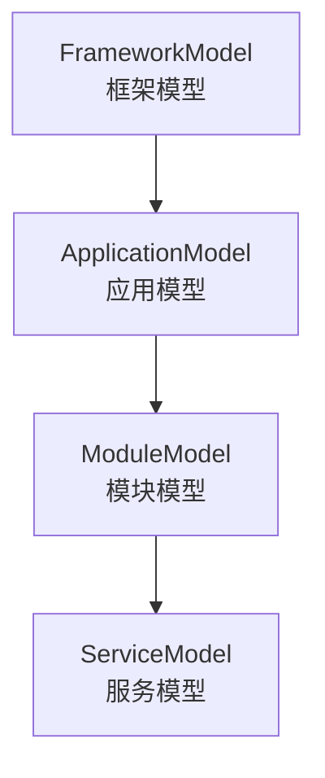
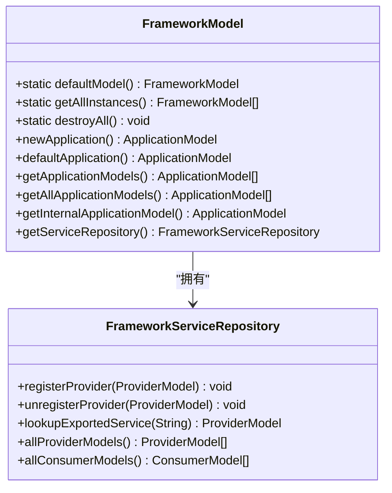
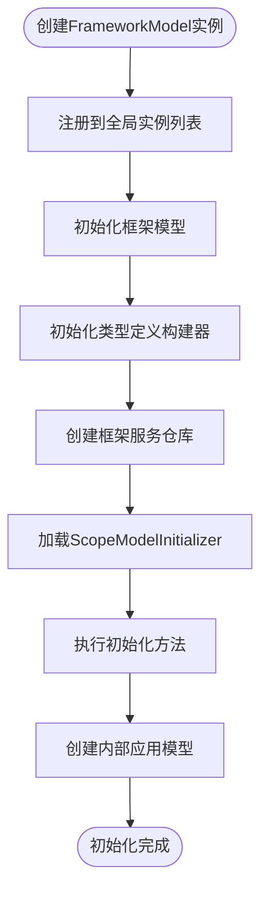
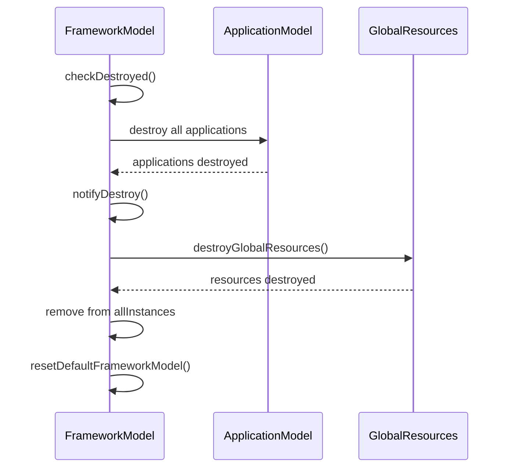
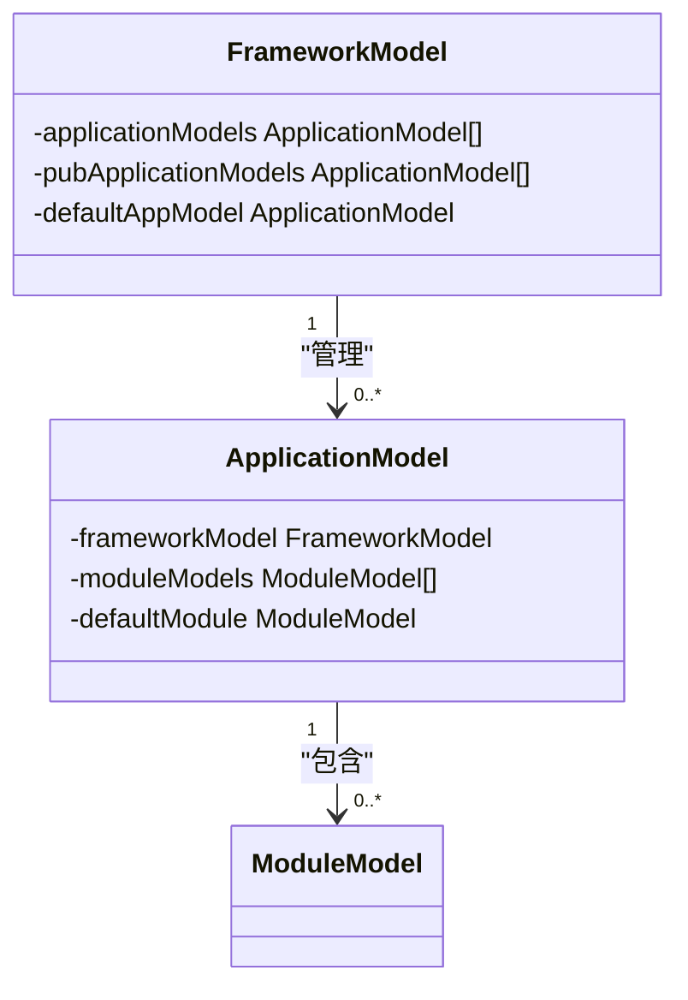
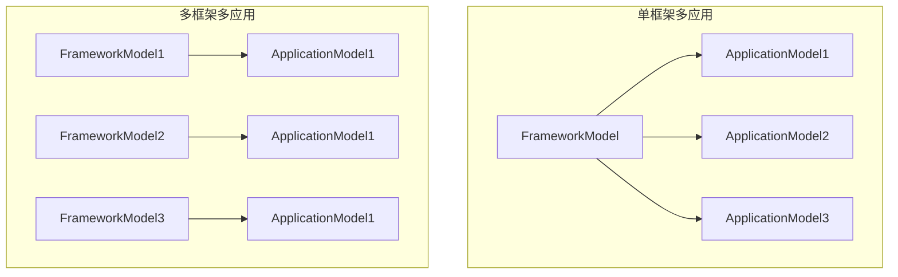
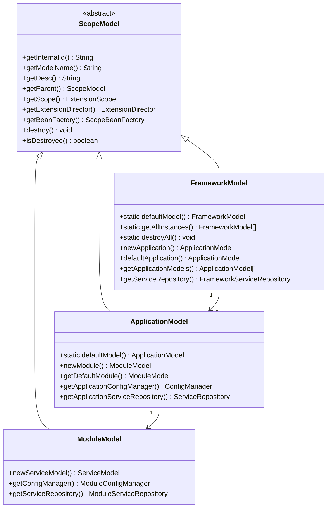
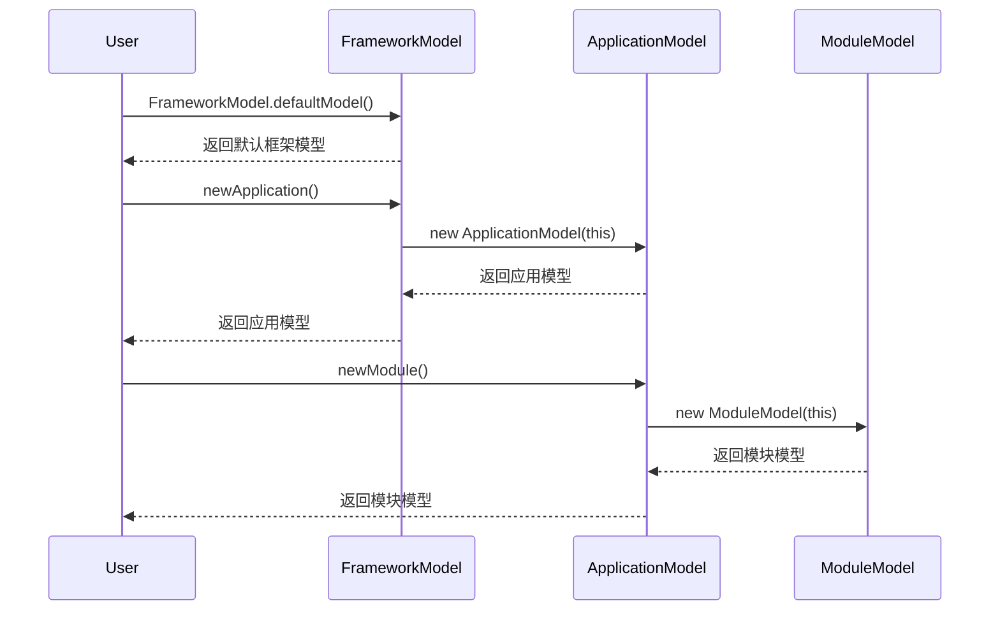

# 框架模型

<cite>
**本文档中引用的文件**  
- [FrameworkModel.java](file://dubbo-common\src\main\java\org\apache\dubbo\rpc\model\FrameworkModel.java)
- [ApplicationModel.java](file://dubbo-common\src\main\java\org\apache\dubbo\rpc\model\ApplicationModel.java)
- [ModuleModel.java](file://dubbo-common\src\main\java\org\apache\dubbo\rpc\model\ModuleModel.java)
- [ScopeModel.java](file://dubbo-common\src\main\java\org\apache\dubbo\rpc\model\ScopeModel.java)
- [FrameworkServiceRepository.java](file://dubbo-common\src\main\java\org\apache\dubbo\rpc\model\FrameworkServiceRepository.java)
- [GlobalResourcesRepository.java](file://dubbo-common\src\main\java\org\apache\dubbo\common\resource\GlobalResourcesRepository.java)
- [FrameworkModelTest.java](file://dubbo-common\src\test\java\org\apache\dubbo\rpc\model\FrameworkModelTest.java)
- [FrameworkModelCleaner.java](file://dubbo-config\dubbo-config-api\src\main\java\org\apache\dubbo\config\deploy\FrameworkModelCleaner.java)
</cite>

## 目录
1. [引言](#引言)
2. [框架模型概述](#框架模型概述)
3. [核心职责与功能](#核心职责与功能)
4. [生命周期管理](#生命周期管理)
5. [与其他模型的关系](#与其他模型的关系)
6. [使用示例](#使用示例)
7. [多应用环境下的作用](#多应用环境下的作用)
8. [类结构图与时序图](#类结构图与时序图)
9. [结论](#结论)

## 引言

框架模型（FrameworkModel）是Apache Dubbo框架中的最顶层作用域模型，作为整个Dubbo框架实例的核心管理单元。它为多个应用提供共享的框架实例，实现了资源隔离和共享的平衡。本文档将深入探讨FrameworkModel的设计理念、核心功能、生命周期管理机制以及与其他模型的交互方式，为开发者提供全面的使用指导。

**本文档中引用的文件**  
- [FrameworkModel.java](file://dubbo-common\src\main\java\org\apache\dubbo\rpc\model\FrameworkModel.java)
- [ApplicationModel.java](file://dubbo-common\src\main\java\org\apache\dubbo\rpc\model\ApplicationModel.java)

## 框架模型概述

框架模型是Dubbo模型层次结构的最顶层，代表整个Dubbo框架实例。它采用树形结构组织，形成了清晰的层级关系：



**图示来源**  
- [FrameworkModel.java](file://dubbo-common\src\main\java\org\apache\dubbo\rpc\model\FrameworkModel.java#L47-L53)

框架模型的主要特点包括：
- **全局作用域**：作为最顶层模型，管理所有下层模型实例
- **资源共享**：多个应用可以共享同一个框架实例，减少资源消耗
- **隔离性**：不同框架实例之间完全隔离，避免相互影响
- **扩展性**：支持框架级别的扩展点管理

**本文档中引用的文件**  
- [FrameworkModel.java](file://dubbo-common\src\main\java\org\apache\dubbo\rpc\model\FrameworkModel.java)

## 核心职责与功能

### 全局资源管理

框架模型负责管理框架级别的全局资源，包括服务仓库、扩展加载器、Bean工厂等。其中，框架服务仓库（FrameworkServiceRepository）是核心组件之一，用于存储和管理所有导出的服务提供者。



**图示来源**  
- [FrameworkModel.java](file://dubbo-common\src\main\java\org\apache\dubbo\rpc\model\FrameworkModel.java)
- [FrameworkServiceRepository.java](file://dubbo-common\src\main\java\org\apache\dubbo\rpc\model\FrameworkServiceRepository.java)

### 跨应用共享组件管理

框架模型支持多个应用共享组件，通过内部应用模型（internalApplicationModel）实现Dubbo内部服务的管理。这种设计使得框架级别的服务可以在多个应用间共享，提高了资源利用率。

```java
// 创建内部应用模型
internalApplicationModel = new ApplicationModel(this, true);
internalApplicationModel
    .getApplicationConfigManager()
    .setApplication(new ApplicationConfig(
        internalApplicationModel, CommonConstants.DUBBO_INTERNAL_APPLICATION));
internalApplicationModel.setModelName(CommonConstants.DUBBO_INTERNAL_APPLICATION);
```

**本文档中引用的文件**  
- [FrameworkModel.java](file://dubbo-common\src\main\java\org\apache\dubbo\rpc\model\FrameworkModel.java#L170-L176)

### 框架级扩展点管理

框架模型通过ExtensionLoader管理框架级别的扩展点，支持SPI（Service Provider Interface）机制。在初始化过程中，会加载所有ScopeModelInitializer的实现，并调用其初始化方法。

```java
// 加载并执行框架模型初始化器
ExtensionLoader<ScopeModelInitializer> initializerExtensionLoader =
    this.getExtensionLoader(ScopeModelInitializer.class);
Set<ScopeModelInitializer> initializers = initializerExtensionLoader.getSupportedExtensionInstances();
for (ScopeModelInitializer initializer : initializers) {
    initializer.initializeFrameworkModel(this);
}
```

**本文档中引用的文件**  
- [FrameworkModel.java](file://dubbo-common\src\main\java\org\apache\dubbo\rpc\model\FrameworkModel.java#L163-L168)

## 生命周期管理

### 初始化过程

框架模型的初始化过程包括以下关键步骤：
1. 注册框架模型实例到全局列表
2. 初始化框架模型自身
3. 初始化类型定义构建器
4. 创建框架服务仓库
5. 执行所有ScopeModelInitializer的初始化
6. 创建内部应用模型



**图示来源**  
- [FrameworkModel.java](file://dubbo-common\src\main\java\org\apache\dubbo\rpc\model\FrameworkModel.java#L146-L176)

### 销毁过程

框架模型的销毁过程是有序且安全的，确保所有资源被正确释放：



**图示来源**  
- [FrameworkModel.java](file://dubbo-common\src\main\java\org\apache\dubbo\rpc\model\FrameworkModel.java#L194-L239)
- [FrameworkModelCleaner.java](file://dubbo-config\dubbo-config-api\src\main\java\org\apache\dubbo\config\deploy\FrameworkModelCleaner.java#L46-L57)

销毁过程的关键步骤包括：
1. 检查是否已销毁
2. 销毁所有应用模型
3. 检查应用模型是否完全销毁
4. 通知销毁事件并清理框架资源
5. 从全局列表中移除当前实例
6. 重置默认框架模型
7. 如果所有框架模型都已销毁，清理全局静态资源

**本文档中引用的文件**  
- [FrameworkModel.java](file://dubbo-common\src\main\java\org\apache\dubbo\rpc\model\FrameworkModel.java#L194-L239)

## 与其他模型的关系

### 与ApplicationModel的关系

框架模型与应用模型之间存在父子关系，一个框架模型可以管理多个应用模型。这种设计支持多应用共享同一个框架实例，同时保持应用间的隔离性。



**图示来源**  
- [FrameworkModel.java](file://dubbo-common\src\main\java\org\apache\dubbo\rpc\model\FrameworkModel.java)
- [ApplicationModel.java](file://dubbo-common\src\main\java\org\apache\dubbo\rpc\model\ApplicationModel.java)

关键交互方法：
- `newApplication()`：在框架模型中创建新的应用模型
- `defaultApplication()`：获取或创建默认的应用模型
- `addApplication()`：将应用模型添加到框架模型中
- `removeApplication()`：从框架模型中移除应用模型

**本文档中引用的文件**  
- [FrameworkModel.java](file://dubbo-common\src\main\java\org\apache\dubbo\rpc\model\FrameworkModel.java)
- [ApplicationModel.java](file://dubbo-common\src\main\java\org\apache\dubbo\rpc\model\ApplicationModel.java)

### 与ModuleModel的关系

虽然框架模型不直接管理模块模型，但通过应用模型间接管理。模块模型是应用模型的子级，用于逻辑分组服务。

```java
// 在ApplicationModel构造函数中创建模块模型
this.internalModule = new ModuleModel(this, true);
```

**本文档中引用的文件**  
- [ApplicationModel.java](file://dubbo-common\src\main\java\org\apache\dubbo\rpc\model\ApplicationModel.java#L160)

## 使用示例

### 基本使用示例

对于初学者，以下是FrameworkModel的基本使用方法：

```java
// 获取默认框架模型实例
FrameworkModel frameworkModel = FrameworkModel.defaultModel();

// 创建新的应用模型
ApplicationModel applicationModel = frameworkModel.newApplication();

// 获取默认应用模型
ApplicationModel defaultAppModel = frameworkModel.defaultApplication();

// 获取框架服务仓库
FrameworkServiceRepository serviceRepository = frameworkModel.getServiceRepository();
```

**本文档中引用的文件**  
- [FrameworkModel.java](file://dubbo-common\src\main\java\org\apache\dubbo\rpc\model\FrameworkModel.java)

### 高级使用技巧

对于高级开发者，可以利用FrameworkModel进行更精细的控制：

```java
// 创建独立的框架模型实例（用于测试或隔离环境）
FrameworkModel customFramework = new FrameworkModel();
ApplicationModel customApp = customFramework.newApplication();

// 注册全局组件
FrameworkModel.defaultModel().getBeanFactory().registerBean("myComponent", myComponentInstance);

// 管理框架级扩展点
ExtensionLoader<MyExtension> loader = FrameworkModel.defaultModel().getExtensionLoader(MyExtension.class);
MyExtension extension = loader.getExtension("myExtension");
```

**本文档中引用的文件**  
- [FrameworkModel.java](file://dubbo-common\src\main\java\org\apache\dubbo\rpc\model\FrameworkModel.java)

## 多应用环境下的作用

在多应用环境下，FrameworkModel发挥着关键作用：

### 资源共享优势



**图示来源**  
- [FrameworkModelTest.java](file://dubbo-common\src\test\java\org\apache\dubbo\rpc\model\FrameworkModelTest.java#L157-L177)

单框架多应用模式的优势：
- **内存效率**：共享框架级别的资源，减少内存占用
- **启动速度**：避免重复加载框架资源，加快应用启动
- **配置一致性**：统一管理框架级别配置，确保一致性
- **资源复用**：网络连接池、线程池等资源可以被多个应用共享

### 隔离性保障

尽管资源共享，但FrameworkModel通过以下机制确保应用间的隔离性：
- 独立的应用配置管理器（ConfigManager）
- 独立的服务仓库（ServiceRepository）
- 独立的扩展加载器（ExtensionLoader）
- 独立的Bean工厂（BeanFactory）

```java
// 每个应用模型都有独立的配置管理器
ApplicationModel app1 = frameworkModel.newApplication();
ApplicationModel app2 = frameworkModel.newApplication();

assertNotSame(app1.getApplicationConfigManager(), app2.getApplicationConfigManager());
```

**本文档中引用的文件**  
- [ApplicationModel.java](file://dubbo-common\src\main\java\org\apache\dubbo\rpc\model\ApplicationModel.java)

## 类结构图与时序图

### 类结构图



**图示来源**  
- [ScopeModel.java](file://dubbo-common\src\main\java\org\apache\dubbo\rpc\model\ScopeModel.java)
- [FrameworkModel.java](file://dubbo-common\src\main\java\org\apache\dubbo\rpc\model\FrameworkModel.java)
- [ApplicationModel.java](file://dubbo-common\src\main\java\org\apache\dubbo\rpc\model\ApplicationModel.java)
- [ModuleModel.java](file://dubbo-common\src\main\java\org\apache\dubbo\rpc\model\ModuleModel.java)

### 使用时序图



**图示来源**  
- [FrameworkModel.java](file://dubbo-common\src\main\java\org\apache\dubbo\rpc\model\FrameworkModel.java#L328-L332)
- [ApplicationModel.java](file://dubbo-common\src\main\java\org\apache\dubbo\rpc\model\ApplicationModel.java#L136-L147)
- [ModuleModel.java](file://dubbo-common\src\main\java\org\apache\dubbo\rpc\model\ModuleModel.java#L67-L78)

## 结论

框架模型作为Dubbo框架的最顶层作用域模型，承担着全局资源管理、跨应用共享组件管理、框架级扩展点管理等重要职责。通过清晰的生命周期管理机制，确保了框架实例的正确初始化和安全销毁。

在多应用环境下，FrameworkModel既实现了资源的高效共享，又保证了应用间的隔离性，为构建复杂分布式系统提供了坚实的基础。对于开发者而言，理解FrameworkModel的设计原理和使用方法，有助于更好地利用Dubbo框架的强大功能，构建高性能、高可用的分布式应用。

**本文档中引用的文件**  
- [FrameworkModel.java](file://dubbo-common\src\main\java\org\apache\dubbo\rpc\model\FrameworkModel.java)
- [ApplicationModel.java](file://dubbo-common\src\main\java\org\apache\dubbo\rpc\model\ApplicationModel.java)
- [ModuleModel.java](file://dubbo-common\src\main\java\org\apache\dubbo\rpc\model\ModuleModel.java)