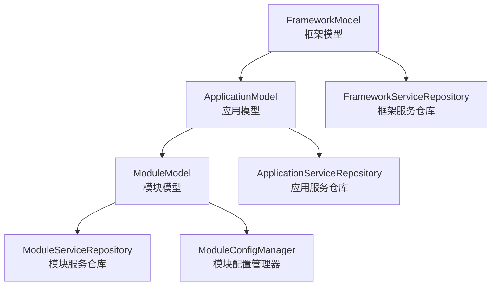
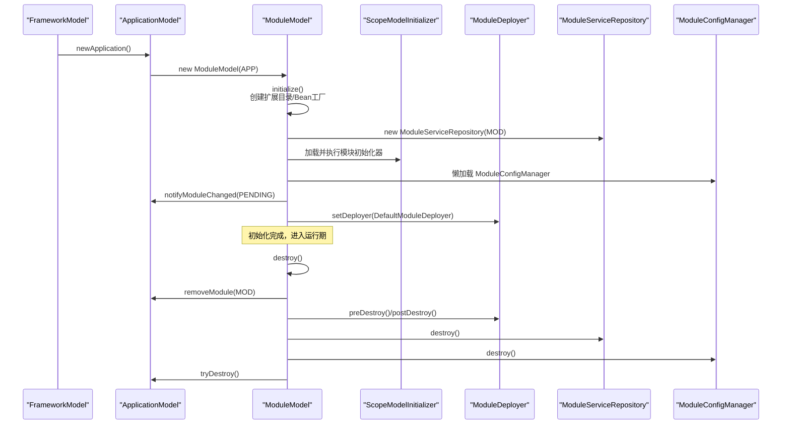
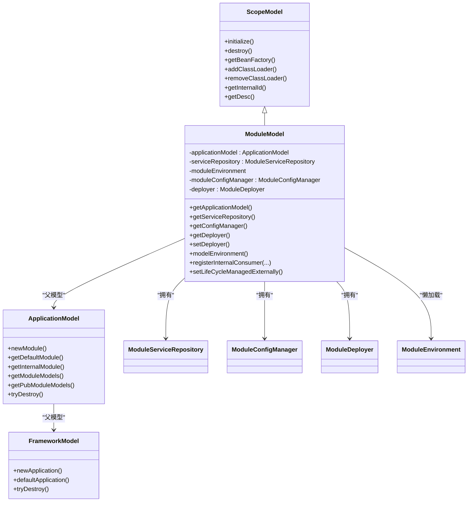
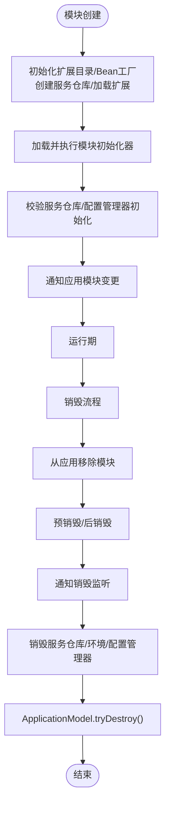
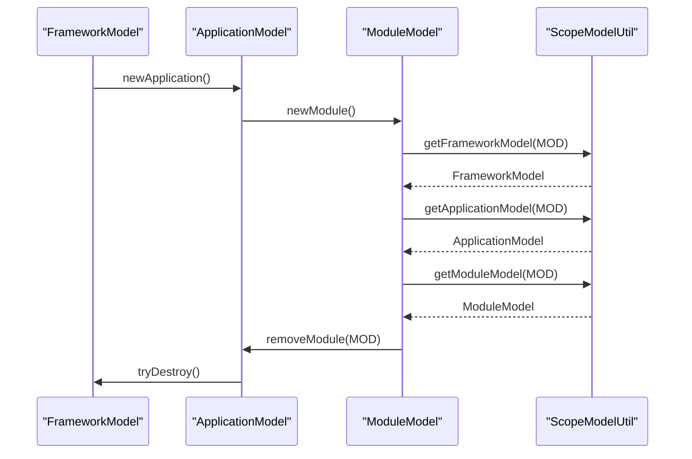
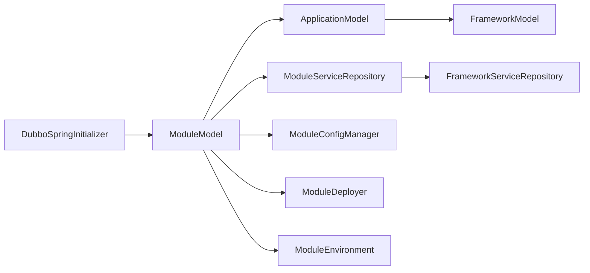

# 模块模型

<cite>
**本文引用的文件**
- [ModuleModel.java](file://dubbo-common/src/main/java/org/apache/dubbo/rpc/model/ModuleModel.java)
- [ApplicationModel.java](file://dubbo-common/src/main/java/org/apache/dubbo/rpc/model/ApplicationModel.java)
- [FrameworkModel.java](file://dubbo-common/src/main/java/org/apache/dubbo/rpc/model/FrameworkModel.java)
- [ScopeModel.java](file://dubbo-common/src/main/java/org/apache/dubbo/rpc/model/ScopeModel.java)
- [ScopeModelUtil.java](file://dubbo-common/src/main/java/org/apache/dubbo/rpc/model/ScopeModelUtil.java)
- [ModuleServiceRepository.java](file://dubbo-common/src/main/java/org/apache/dubbo/rpc/model/ModuleServiceRepository.java)
- [ModuleConfigManager.java](file://dubbo-common/src/main/java/org/apache/dubbo/config/context/ModuleConfigManager.java)
- [ModuleConfig.java](file://dubbo-common/src/main/java/org/apache/dubbo/config/ModuleConfig.java)
- [ModuleModelTest.java](file://dubbo-common/src/test/java/org/apache/dubbo/rpc/model/ModuleModelTest.java)
- [ApplicationModelTest.java](file://dubbo-common/src/test/java/org/apache/dubbo/rpc/model/ApplicationModelTest.java)
- [ScopeModelUtilTest.java](file://dubbo-common/src/test/java/org/apache/dubbo/rpc/model/ScopeModelUtilTest.java)
- [FrameworkServiceRepositoryTest.java](file://dubbo-common/src/test/java/org/apache/dubbo/rpc/model/FrameworkServiceRepositoryTest.java)
- [ModuleServiceRepositoryTest.java](file://dubbo-common/src/test/java/org/apache/dubbo/rpc/model/ModuleServiceRepositoryTest.java)
- [ServiceRepository.java](file://dubbo-common/src/main/java/org/apache/dubbo/rpc/model/ServiceRepository.java)
- [ConfigScopeModelInitializer.java](file://dubbo-config/dubbo-config-api/src/main/java/org/apache/dubbo/config/ConfigScopeModelInitializer.java)
- [DubboSpringInitializer.java](file://dubbo-config/dubbo-config-spring/src/main/java/org/apache/dubbo/config/spring/context/DubboSpringInitializer.java)
</cite>

## 目录
1. [简介](#简介)
2. [项目结构](#项目结构)
3. [核心组件](#核心组件)
4. [架构总览](#架构总览)
5. [详细组件分析](#详细组件分析)
6. [依赖分析](#依赖分析)
7. [性能考虑](#性能考虑)
8. [故障排查指南](#故障排查指南)
9. [结论](#结论)
10. [附录](#附录)

## 简介
本文件系统性阐述 ModuleModel 的职责、功能与使用方式，重点覆盖：
- 模块级作用域模型的职责边界与生命周期管理
- 模块级资源配置与组件管理
- 与 ApplicationModel、FrameworkModel 的层次关系与依赖管理
- 实际使用示例：获取模块实例、注册模块级组件、管理模块间依赖
- 大型应用模块化开发中的应用方式与优势
- 初学者入门与高级开发者定制扩展技巧
- ModuleModel 类结构图与模块依赖关系图

## 项目结构
ModuleModel 位于 Dubbo 的通用模型层，与 ApplicationModel、FrameworkModel 构成三层作用域模型树：
- FrameworkModel：顶层框架实例，可承载多个 ApplicationModel
- ApplicationModel：应用级作用域，包含多个 ModuleModel（含内部模块与公共模块）
- ModuleModel：模块级作用域，负责模块内的服务注册、消费者、配置、部署与销毁

图表来源
- [FrameworkModel.java](file://dubbo-common/src/main/java/org/apache/dubbo/rpc/model/FrameworkModel.java#L40-L74)
- [ApplicationModel.java](file://dubbo-common/src/main/java/org/apache/dubbo/rpc/model/ApplicationModel.java#L40-L70)
- [ModuleModel.java](file://dubbo-common/src/main/java/org/apache/dubbo/rpc/model/ModuleModel.java#L40-L60)
- [ModuleServiceRepository.java](file://dubbo-common/src/main/java/org/apache/dubbo/rpc/model/ModuleServiceRepository.java#L34-L67)
- [ServiceRepository.java](file://dubbo-common/src/main/java/org/apache/dubbo/rpc/model/ServiceRepository.java#L39-L77)

章节来源
- [FrameworkModel.java](file://dubbo-common/src/main/java/org/apache/dubbo/rpc/model/FrameworkModel.java#L40-L74)
- [ApplicationModel.java](file://dubbo-common/src/main/java/org/apache/dubbo/rpc/model/ApplicationModel.java#L40-L70)
- [ModuleModel.java](file://dubbo-common/src/main/java/org/apache/dubbo/rpc/model/ModuleModel.java#L40-L60)

## 核心组件
- ModuleModel：模块级作用域模型，负责模块初始化、扩展加载、配置管理、服务仓库、部署器、生命周期管理与销毁流程。
- ModuleServiceRepository：模块级服务仓库，管理模块内服务、消费者、提供者注册与查询。
- ModuleConfigManager：模块级配置管理器，聚合模块级配置（ModuleConfig、Service/Reference/Provider/Consumer 等），并与应用级配置管理器协同。
- ModuleConfig：模块级配置对象，封装模块名、版本、组织、注册中心、监控、异步导出/引用等参数。
- ScopeModel：抽象基类，提供扩展目录、Bean 工厂、类加载器管理、销毁监听、内部 ID 与描述字符串等通用能力。
- ScopeModelUtil：作用域工具，提供从任意 ScopeModel 推断 FrameworkModel/ApplicationModel/ModuleModel 的能力。
- ApplicationModel/FrameworkModel：应用与框架层级，负责模块集合管理、默认模块与内部模块、销毁传播与全局资源清理。

章节来源
- [ModuleModel.java](file://dubbo-common/src/main/java/org/apache/dubbo/rpc/model/ModuleModel.java#L40-L115)
- [ModuleServiceRepository.java](file://dubbo-common/src/main/java/org/apache/dubbo/rpc/model/ModuleServiceRepository.java#L34-L67)
- [ModuleConfigManager.java](file://dubbo-common/src/main/java/org/apache/dubbo/config/context/ModuleConfigManager.java#L115-L154)
- [ModuleConfig.java](file://dubbo-common/src/main/java/org/apache/dubbo/config/ModuleConfig.java#L1-L120)
- [ScopeModel.java](file://dubbo-common/src/main/java/org/apache/dubbo/rpc/model/ScopeModel.java#L41-L115)
- [ScopeModelUtil.java](file://dubbo-common/src/main/java/org/apache/dubbo/rpc/model/ScopeModelUtil.java#L63-L98)
- [ApplicationModel.java](file://dubbo-common/src/main/java/org/apache/dubbo/rpc/model/ApplicationModel.java#L130-L208)
- [FrameworkModel.java](file://dubbo-common/src/main/java/org/apache/dubbo/rpc/model/FrameworkModel.java#L130-L208)

## 架构总览
ModuleModel 的生命周期与初始化流程如下：
- 构造阶段：绑定 ApplicationModel，加入应用模块列表；初始化扩展目录与 Bean 工厂；创建 ModuleServiceRepository；加载并执行 ScopeModelInitializer；验证必要组件初始化；通知 ApplicationDeployer 模块变更。
- 运行阶段：通过 ModuleConfigManager 管理模块配置；通过 ModuleServiceRepository 管理服务与消费者；通过 ModuleDeployer 控制模块部署。
- 销毁阶段：从 ApplicationModel 移除模块；预销毁与后销毁；通知销毁监听；销毁服务仓库、环境与配置管理器；触发 ApplicationModel.tryDestroy()。

图表来源
- [ModuleModel.java](file://dubbo-common/src/main/java/org/apache/dubbo/rpc/model/ModuleModel.java#L71-L115)
- [ApplicationModel.java](file://dubbo-common/src/main/java/org/apache/dubbo/rpc/model/ApplicationModel.java#L268-L324)
- [ConfigScopeModelInitializer.java](file://dubbo-config/dubbo-config-api/src/main/java/org/apache/dubbo/config/ConfigScopeModelInitializer.java#L31-L54)

章节来源
- [ModuleModel.java](file://dubbo-common/src/main/java/org/apache/dubbo/rpc/model/ModuleModel.java#L71-L115)
- [ApplicationModel.java](file://dubbo-common/src/main/java/org/apache/dubbo/rpc/model/ApplicationModel.java#L268-L324)
- [ConfigScopeModelInitializer.java](file://dubbo-config/dubbo-config-api/src/main/java/org/apache/dubbo/config/ConfigScopeModelInitializer.java#L31-L54)

## 详细组件分析

### ModuleModel 类结构与职责
- 作用域与父模型：继承自 ScopeModel，扩展范围为 MODULE，父模型为 ApplicationModel。
- 初始化流程：创建 ModuleServiceRepository；加载 ModuleExt 扩展；执行 ScopeModelInitializer.initializeModuleModel；校验配置管理器初始化状态；通知 ApplicationDeployer。
- 生命周期管理：实现 ScopeModel.destroy，按序移除模块、预销毁、后销毁、通知销毁监听、销毁服务仓库/环境/配置管理器、触发 ApplicationModel.tryDestroy。
- 模块级资源：
  - ModuleServiceRepository：模块内服务/消费者/提供者注册与查询。
  - ModuleConfigManager：模块级配置聚合与懒加载。
  - ModuleDeployer：模块部署器，用于模块启动/停止。
  - ModuleEnvironment：模块环境（懒加载）。
  - 类加载器管理：支持添加/移除 ClassLoader 并刷新环境。
- 内部消费者注册：registerInternalConsumer 支持动态注册内部消费者模型至 ModuleServiceRepository。

图表来源
- [ScopeModel.java](file://dubbo-common/src/main/java/org/apache/dubbo/rpc/model/ScopeModel.java#L41-L115)
- [ModuleModel.java](file://dubbo-common/src/main/java/org/apache/dubbo/rpc/model/ModuleModel.java#L40-L115)
- [ApplicationModel.java](file://dubbo-common/src/main/java/org/apache/dubbo/rpc/model/ApplicationModel.java#L268-L324)
- [FrameworkModel.java](file://dubbo-common/src/main/java/org/apache/dubbo/rpc/model/FrameworkModel.java#L323-L358)
- [ModuleServiceRepository.java](file://dubbo-common/src/main/java/org/apache/dubbo/rpc/model/ModuleServiceRepository.java#L34-L67)
- [ModuleConfigManager.java](file://dubbo-common/src/main/java/org/apache/dubbo/config/context/ModuleConfigManager.java#L115-L154)

章节来源
- [ModuleModel.java](file://dubbo-common/src/main/java/org/apache/dubbo/rpc/model/ModuleModel.java#L40-L115)
- [ScopeModel.java](file://dubbo-common/src/main/java/org/apache/dubbo/rpc/model/ScopeModel.java#L41-L115)

### 生命周期管理机制
- 初始化阶段：
  - 构造函数中完成扩展目录与 Bean 工厂初始化、创建 ModuleServiceRepository、加载 ModuleExt、执行 ScopeModelInitializer.initializeModuleModel。
  - 校验 ModuleServiceRepository 与 ModuleConfigManager 初始化状态。
  - 通知 ApplicationDeployer 模块状态变更。
- 运行阶段：
  - 通过 ModuleDeployer 管理模块部署。
  - 通过 ModuleConfigManager 管理模块配置。
- 销毁阶段：
  - 从 ApplicationModel 移除模块。
  - 调用 ModuleDeployer.preDestroy/postDestroy。
  - 通知销毁监听。
  - 销毁 ModuleServiceRepository、ModuleEnvironment、ModuleConfigManager。
  - 触发 ApplicationModel.tryDestroy，最终可能触发 FrameworkModel.tryDestroy。

图表来源
- [ModuleModel.java](file://dubbo-common/src/main/java/org/apache/dubbo/rpc/model/ModuleModel.java#L71-L173)
- [ApplicationModel.java](file://dubbo-common/src/main/java/org/apache/dubbo/rpc/model/ApplicationModel.java#L383-L410)
- [FrameworkModel.java](file://dubbo-common/src/main/java/org/apache/dubbo/rpc/model/FrameworkModel.java#L423-L433)

章节来源
- [ModuleModel.java](file://dubbo-common/src/main/java/org/apache/dubbo/rpc/model/ModuleModel.java#L71-L173)
- [ApplicationModel.java](file://dubbo-common/src/main/java/org/apache/dubbo/rpc/model/ApplicationModel.java#L383-L410)
- [FrameworkModel.java](file://dubbo-common/src/main/java/org/apache/dubbo/rpc/model/FrameworkModel.java#L423-L433)

### 模块级资源配置与组件管理
- 模块级配置：
  - ModuleConfig：模块名、版本、组织、注册中心、监控、异步导出/引用、线程池大小、超时等。
  - ModuleConfigManager：聚合模块级配置，与应用级配置管理器关联，支持懒加载。
- 模块级组件：
  - ModuleServiceRepository：模块内服务注册、消费者/提供者注册与查询。
  - ModuleDeployer：模块部署器，由 ConfigScopeModelInitializer 注册 DefaultModuleDeployer。
  - ModuleEnvironment：模块环境（懒加载）。
  - ScopeBeanFactory：模块级 Bean 工厂，支持注册与获取 Bean（如 ConfigurationCache）。

章节来源
- [ModuleConfig.java](file://dubbo-common/src/main/java/org/apache/dubbo/config/ModuleConfig.java#L1-L120)
- [ModuleConfigManager.java](file://dubbo-common/src/main/java/org/apache/dubbo/config/context/ModuleConfigManager.java#L115-L154)
- [ModuleServiceRepository.java](file://dubbo-common/src/main/java/org/apache/dubbo/rpc/model/ModuleServiceRepository.java#L34-L67)
- [ConfigScopeModelInitializer.java](file://dubbo-config/dubbo-config-api/src/main/java/org/apache/dubbo/config/ConfigScopeModelInitializer.java#L31-L54)
- [ModuleModelTest.java](file://dubbo-common/src/test/java/org/apache/dubbo/rpc/model/ModuleModelTest.java#L33-L56)

### 与 ApplicationModel、FrameworkModel 的层次关系与依赖管理
- 层次关系：
  - FrameworkModel.defaultModel()/newApplication() 创建 ApplicationModel。
  - ApplicationModel.newModule() 创建 ModuleModel，并将其加入模块列表（区分内部模块与公共模块）。
  - ModuleModel.getApplicationModel() 获取父模型。
  - ScopeModelUtil 提供从任意 ScopeModel 推断 FrameworkModel/ApplicationModel/ModuleModel 的能力。
- 依赖传播：
  - 模块销毁会触发 ApplicationModel.tryDestroy()，进而可能触发 FrameworkModel.tryDestroy()。
  - 模块环境与配置管理器均通过扩展加载器懒加载，确保初始化顺序与一致性。

图表来源
- [FrameworkModel.java](file://dubbo-common/src/main/java/org/apache/dubbo/rpc/model/FrameworkModel.java#L323-L358)
- [ApplicationModel.java](file://dubbo-common/src/main/java/org/apache/dubbo/rpc/model/ApplicationModel.java#L364-L410)
- [ScopeModelUtil.java](file://dubbo-common/src/main/java/org/apache/dubbo/rpc/model/ScopeModelUtil.java#L63-L98)
- [ModuleModel.java](file://dubbo-common/src/main/java/org/apache/dubbo/rpc/model/ModuleModel.java#L176-L182)

章节来源
- [FrameworkModel.java](file://dubbo-common/src/main/java/org/apache/dubbo/rpc/model/FrameworkModel.java#L323-L358)
- [ApplicationModel.java](file://dubbo-common/src/main/java/org/apache/dubbo/rpc/model/ApplicationModel.java#L364-L410)
- [ScopeModelUtil.java](file://dubbo-common/src/main/java/org/apache/dubbo/rpc/model/ScopeModelUtil.java#L63-L98)

### 使用示例与最佳实践

- 获取模块实例
  - 通过 ApplicationModel.getDefaultModule() 或 ApplicationModel.newModule() 获取模块实例。
  - 通过 ScopeModelUtil.getModuleModel(null) 获取默认模块（无显式传入时）。
  
  章节来源
  - [ApplicationModel.java](file://dubbo-common/src/main/java/org/apache/dubbo/rpc/model/ApplicationModel.java#L445-L474)
  - [ScopeModelUtilTest.java](file://dubbo-common/src/test/java/org/apache/dubbo/rpc/model/ScopeModelUtilTest.java#L60-L71)

- 注册模块级组件
  - 注册服务：通过 ModuleServiceRepository.registerService(...) 注册服务描述符。
  - 注册消费者：通过 ModuleServiceRepository.registerConsumer(...) 注册消费者模型。
  - 注册提供者：通过 ModuleServiceRepository.registerProvider(...) 注册提供者模型。
  - 动态注册内部消费者：ModuleModel.registerInternalConsumer(...)。
  
  章节来源
  - [ModuleServiceRepositoryTest.java](file://dubbo-common/src/test/java/org/apache/dubbo/rpc/model/ModuleServiceRepositoryTest.java#L39-L71)
  - [FrameworkServiceRepositoryTest.java](file://dubbo-common/src/test/java/org/apache/dubbo/rpc/model/FrameworkServiceRepositoryTest.java#L34-L70)
  - [ModuleModel.java](file://dubbo-common/src/main/java/org/apache/dubbo/rpc/model/ModuleModel.java#L287-L340)

- 管理模块间依赖
  - 通过 ApplicationModel.getModuleModels()/getPubModuleModels() 获取模块集合。
  - 通过 ApplicationModel.getDefaultModule()/getInternalModule() 获取默认与内部模块。
  - 通过 ServiceRepository.allProviderModels()/allConsumerModels() 聚合应用内所有模块的服务与消费者。
  
  章节来源
  - [ApplicationModel.java](file://dubbo-common/src/main/java/org/apache/dubbo/rpc/model/ApplicationModel.java#L421-L474)
  - [ServiceRepository.java](file://dubbo-common/src/main/java/org/apache/dubbo/rpc/model/ServiceRepository.java#L39-L77)

- 配置管理
  - 通过 ModuleConfigManager.setModule(...) 设置模块配置。
  - 通过 ModuleConfigManager.addProvider/addConsumer/addReference/addService 等方法添加具体配置。
  
  章节来源
  - [ModuleConfigManager.java](file://dubbo-common/src/main/java/org/apache/dubbo/config/context/ModuleConfigManager.java#L143-L154)
  - [ModuleConfig.java](file://dubbo-common/src/main/java/org/apache/dubbo/config/ModuleConfig.java#L101-L147)

- Spring 集成
  - DubboSpringInitializer 会在 Spring 上下文中绑定模块模型，优先使用默认模块，或为后续上下文创建新的 ApplicationModel。
  
  章节来源
  - [DubboSpringInitializer.java](file://dubbo-config/dubbo-config-spring/src/main/java/org/apache/dubbo/config/spring/context/DubboSpringInitializer.java#L111-L139)

- 高级定制与扩展
  - 自定义 ScopeModelInitializer：在 initializeModuleModel 中注册模块级 Bean 或部署器。
  - 自定义 ModuleExt：在 ModuleModel.initModuleExt 中被加载并初始化。
  - 自定义 ModuleEnvironment：通过 ModuleModel.modelEnvironment() 懒加载。
  
  章节来源
  - [ConfigScopeModelInitializer.java](file://dubbo-config/dubbo-config-api/src/main/java/org/apache/dubbo/config/ConfigScopeModelInitializer.java#L31-L54)
  - [ModuleModel.java](file://dubbo-common/src/main/java/org/apache/dubbo/rpc/model/ModuleModel.java#L118-L127)

## 依赖分析
- 组件耦合与内聚
  - ModuleModel 对 ApplicationModel 强依赖（父模型、模块列表、销毁传播）。
  - ModuleModel 通过扩展加载器与 Bean 工厂解耦具体实现（ModuleExt、ModuleEnvironment、ModuleConfigManager、ModuleDeployer）。
  - ModuleServiceRepository 与框架级服务仓库协作，实现跨模块聚合。
- 直接与间接依赖
  - 直接：ModuleModel -> ApplicationModel -> FrameworkModel。
  - 间接：ModuleModel -> ModuleServiceRepository/FW.getServiceRepository -> Provider/Consumer 聚合。
- 循环依赖
  - 通过懒加载与初始化顺序控制避免循环依赖（先创建 ModuleServiceRepository，再加载扩展与初始化器）。
- 外部依赖与集成点
  - Spring 集成：DubboSpringInitializer 绑定模块模型。
  - 配置中心：ModuleEnvironment.getDynamicConfiguration() 提供动态配置能力。

图表来源
- [ModuleModel.java](file://dubbo-common/src/main/java/org/apache/dubbo/rpc/model/ModuleModel.java#L176-L220)
- [ApplicationModel.java](file://dubbo-common/src/main/java/org/apache/dubbo/rpc/model/ApplicationModel.java#L364-L410)
- [FrameworkModel.java](file://dubbo-common/src/main/java/org/apache/dubbo/rpc/model/FrameworkModel.java#L323-L358)
- [ModuleServiceRepository.java](file://dubbo-common/src/main/java/org/apache/dubbo/rpc/model/ModuleServiceRepository.java#L34-L67)
- [DubboSpringInitializer.java](file://dubbo-config/dubbo-config-spring/src/main/java/org/apache/dubbo/config/spring/context/DubboSpringInitializer.java#L111-L139)

章节来源
- [ModuleModel.java](file://dubbo-common/src/main/java/org/apache/dubbo/rpc/model/ModuleModel.java#L176-L220)
- [ApplicationModel.java](file://dubbo-common/src/main/java/org/apache/dubbo/rpc/model/ApplicationModel.java#L364-L410)
- [FrameworkModel.java](file://dubbo-common/src/main/java/org/apache/dubbo/rpc/model/FrameworkModel.java#L323-L358)
- [ModuleServiceRepository.java](file://dubbo-common/src/main/java/org/apache/dubbo/rpc/model/ModuleServiceRepository.java#L34-L67)
- [DubboSpringInitializer.java](file://dubbo-config/dubbo-config-spring/src/main/java/org/apache/dubbo/config/spring/context/DubboSpringInitializer.java#L111-L139)

## 性能考虑
- 懒加载策略：ModuleEnvironment、ModuleConfigManager、ModuleDeployer 采用懒加载，减少初始化开销。
- 并发安全：模块列表使用 CopyOnWrite 结构，类加载器管理与销毁流程使用锁保护，避免并发问题。
- 资源回收：销毁阶段按序释放资源，避免资源泄漏；销毁监听通知确保外部组件及时感知。
- 配置聚合：ServiceRepository 聚合各模块 Provider/Consumer，便于统一统计与运维。

## 故障排查指南
- 模块初始化失败
  - 检查 ModuleModel.initialize 中的扩展加载与 ScopeModelInitializer 执行结果。
  - 校验 ModuleConfigManager.isInitialized() 与 ModuleServiceRepository 非空。
- 模块销毁异常
  - 关注 ModuleModel.onDestroy 的销毁顺序与异常日志。
  - 确认 ApplicationModel.tryDestroy() 是否被触发，以及 FrameworkModel.tryDestroy() 是否成功。
- 作用域模型推断错误
  - 使用 ScopeModelUtil.getFrameworkModel/getApplicationModel/getModuleModel 进行校验。
- Spring 集成问题
  - 检查 DubboSpringInitializer 是否正确绑定模块模型，以及模块属性注入是否生效。

章节来源
- [ModuleModelTest.java](file://dubbo-common/src/test/java/org/apache/dubbo/rpc/model/ModuleModelTest.java#L33-L90)
- [ApplicationModelTest.java](file://dubbo-common/src/test/java/org/apache/dubbo/rpc/model/ApplicationModelTest.java#L120-L149)
- [ScopeModelUtilTest.java](file://dubbo-common/src/test/java/org/apache/dubbo/rpc/model/ScopeModelUtilTest.java#L38-L79)

## 结论
ModuleModel 作为模块级作用域模型，承担模块初始化、扩展加载、配置与服务管理、部署与销毁等关键职责。它与 ApplicationModel、FrameworkModel 形成清晰的层级关系，通过懒加载与初始化器机制保证模块生命周期可控、资源回收有序。在大型应用模块化开发中，ModuleModel 提供了细粒度的模块隔离、配置与服务管理能力，有助于提升系统的可维护性与可扩展性。

## 附录
- 初学者入门要点
  - 通过 ApplicationModel.getDefaultModule()/newModule() 获取模块实例。
  - 使用 ModuleServiceRepository 注册服务与消费者。
  - 使用 ModuleConfigManager 添加模块级配置。
- 高级开发者扩展技巧
  - 自定义 ScopeModelInitializer.initializeModuleModel 注册模块级 Bean 与部署器。
  - 自定义 ModuleExt 在模块初始化阶段执行特定逻辑。
  - 通过 ScopeModelUtil 在任意层级推断上层模型，简化跨层访问。