# 公共工具类

<cite>
**本文档引用的文件**   
- [CollectionUtils.java](file://dubbo-common\src\main\java\org\apache\dubbo\common\utils\CollectionUtils.java)
- [StringUtils.java](file://dubbo-common\src\main\java\org\apache\dubbo\common\utils\StringUtils.java)
- [ReflectUtils.java](file://dubbo-common\src\main\java\org\apache\dubbo\common\utils\ReflectUtils.java)
- [ArrayUtils.java](file://dubbo-common\src\main\java\org\apache\dubbo\common\utils\ArrayUtils.java)
- [ClassUtils.java](file://dubbo-common\src\main\java\org\apache\dubbo\common\utils\ClassUtils.java)
</cite>

## 目录
1. [引言](#引言)
2. [工具类设计原则与性能优化策略](#工具类设计原则与性能优化策略)
3. [CollectionUtils 详解](#collectionutils-详解)
4. [StringUtils 详解](#stringutils-详解)
5. [ReflectUtils 详解](#reflectutils-详解)
6. [工具类在 Dubbo 核心流程中的应用](#工具类在-dubbo-核心流程中的应用)
7. [最佳实践与使用示例](#最佳实践与使用示例)
8. [线程安全性与性能特征分析](#线程安全性与性能特征分析)
9. [分类结构图与常用方法速查表](#分类结构图与常用方法速查表)
10. [结论](#结论)

## 引言
Dubbo 框架提供了一系列公共工具类，这些工具类是框架内部功能实现的基础，极大地简化了开发者的编码工作。本文档旨在深入解析 Dubbo 中最核心的几个工具类：`CollectionUtils`、`StringUtils` 和 `ReflectUtils`。我们将详细阐述它们的功能、设计原则、性能优化策略，并通过具体示例展示其在 Dubbo 核心流程中的应用场景。本文档既为初学者提供了入门指南，也为高级开发者提供了性能优化和扩展的技巧。

## 工具类设计原则与性能优化策略
Dubbo 的公共工具类遵循了简洁、高效和安全的设计原则。

**设计原则**：
1.  **静态工具类**：所有工具类均被设计为 `final` 类，并且构造函数为私有，确保它们不能被实例化，所有方法均为静态方法，便于直接调用。
2.  **空值安全**：几乎所有方法都对 `null` 值进行了处理，避免了 `NullPointerException`，提高了代码的健壮性。
3.  **语义清晰**：方法命名直观，如 `isNotEmpty`, `isEmptyMap`, `getEmptyObject` 等，使代码意图一目了然。
4.  **功能内聚**：每个工具类都专注于特定领域的操作，如 `CollectionUtils` 处理集合，`StringUtils` 处理字符串，`ReflectUtils` 处理反射。

**性能优化策略**：
1.  **避免不必要的对象创建**：`CollectionUtils` 中的 `ofSet` 方法会根据输入参数的大小动态计算 `LinkedHashSet` 的初始容量和加载因子，以减少哈希冲突和扩容操作。
2.  **利用 JDK 优化**：`StringUtils` 中的 `repeat` 方法针对单个字符和两个字符的重复进行了特殊优化，直接使用字符数组填充，避免了 `StringBuilder` 的循环追加。
3.  **缓存默认值**：`ReflectUtils` 内部维护了一个 `primitiveDefaults` 的 `HashMap`，缓存了所有基本类型对应的默认值（如 `int` 为 `0`，`boolean` 为 `false`），避免了每次调用 `defaultReturn` 时的重复判断。
4.  **高效的集合操作**：`CollectionUtils` 提供了 `newHashMap`, `newLinkedHashMap` 等方法，允许用户指定预期大小，从而在创建 `HashMap` 时直接分配合适的容量，避免了后续的扩容。

**Section sources**
- [CollectionUtils.java](file://dubbo-common\src\main\java\org\apache\dubbo\common\utils\CollectionUtils.java#L46)
- [StringUtils.java](file://dubbo-common\src\main\java\org\apache\dubbo\common\utils\StringUtils.java#L54)
- [ReflectUtils.java](file://dubbo-common\src\main\java\org\apache\dubbo\common\utils\ReflectUtils.java#L59)

## CollectionUtils 详解
`CollectionUtils` 是 Dubbo 中用于处理集合（`Collection` 和 `Map`）的核心工具类，提供了丰富的集合操作方法。

### 核心功能
1.  **空值检查**：提供了 `isEmpty`, `isNotEmpty`, `isEmptyMap`, `isNotEmptyMap` 等方法，用于安全地判断集合或映射是否为空。
2.  **集合创建**：`newHashSet`, `newLinkedHashSet`, `newHashMap`, `newLinkedHashMap`, `newConcurrentHashMap` 等方法允许指定初始容量，优化性能。
3.  **集合转换**：
    *   `ofSet(T... values)`：将可变参数转换为不可变的 `LinkedHashSet`。
    *   `split` / `join`：将 `List<String>` 与 `Map<String, String>` 之间进行键值对转换。
    *   `toStringMap` / `toMap`：将键值对数组转换为 `Map`。
4.  **集合操作**：
    *   `addAll`：将多个值安全地添加到集合中，并返回实际添加的数量。
    *   `first`：安全地获取集合中的第一个元素。
    *   `size`：安全地获取集合的大小，`null` 集合返回 0。
    *   `equals`：安全地比较两个集合是否相等。

### 使用示例
```java
// 创建一个预设容量的HashMap
Map<String, Object> map = CollectionUtils.newHashMap(16);

// 将字符串列表按分隔符":"拆分为Map
List<String> list = Arrays.asList("name:zhangsan", "age:25");
Map<String, String> kvMap = CollectionUtils.split(list, ':');
// kvMap = {"name": "zhangsan", "age": "25"}

// 判断集合是否为空
if (CollectionUtils.isNotEmpty(someList)) {
    // 处理非空集合
}
```

**Section sources**
- [CollectionUtils.java](file://dubbo-common\src\main\java\org\apache\dubbo\common\utils\CollectionUtils.java)

## StringUtils 详解
`StringUtils` 是处理字符串操作的工具类，提供了从基础的空值检查到复杂的字符串解析和格式化功能。

### 核心功能
1.  **空值与空白检查**：`isEmpty`, `isNotEmpty`, `isBlank`, `isNotBlank` 用于检查字符串是否为空或仅包含空白字符。
2.  **字符串拼接与分割**：
    *   `join`：将数组或集合中的元素用指定分隔符连接成字符串。
    *   `split`, `splitToList`, `splitToSet`：将字符串按指定字符分割成数组、列表或集合。
    *   `tokenize`：更高级的分割，支持多个分隔符并自动去除空白。
3.  **字符串操作**：
    *   `replace`, `repeat`：替换和重复字符串。
    *   `stripEnd`, `removeEnd`：移除字符串末尾的指定字符或子串。
    *   `camelToSplitName`, `snakeToSplitName`：在驼峰命名、下划线命名和连字符命名之间进行转换。
4.  **字符串解析**：
    *   `parseQueryString`：将查询字符串（如 `a=1&b=2`）解析为 `Map`。
    *   `parseParameters`：解析类似 `[{a:b},{c:d}]` 的参数字符串。
    *   `toArgumentString`：将方法参数数组转换为可读的字符串表示，内部使用了 `ReflectUtils.isPrimitives` 来判断是否需要 JSON 序列化。

### 使用示例
```java
// 将数组拼接成字符串
String[] arr = {"a", "b", "c"};
String joined = StringUtils.join(arr, ","); // "a,b,c"

// 解析查询字符串
String query = "name=zhangsan&age=25";
Map<String, String> params = StringUtils.parseQueryString(query);
// params = {"name": "zhangsan", "age": "25"}

// 驼峰转连字符
String kebab = StringUtils.camelToSplitName("userName", "-"); // "user-name"
```

**Section sources**
- [StringUtils.java](file://dubbo-common\src\main\java\org\apache\dubbo\common\utils\StringUtils.java)

## ReflectUtils 详解
`ReflectUtils` 是 Dubbo 中处理反射操作的核心工具类，它封装了复杂的反射逻辑，为框架的动态性提供了支持。

### 核心功能
1.  **类型判断与转换**：
    *   `isPrimitive`, `isPrimitives`：判断一个类是否为基本类型、包装类型、`String` 或 `Date` 等。
    *   `getBoxedClass`：获取基本类型的包装类。
    *   `isCompatible`：检查一个对象是否与某个类型兼容。
2.  **描述符操作**：
    *   `getDesc`：获取类、方法或构造函数的 JVM 描述符（如 `Ljava/lang/String;`）。
    *   `name2desc`, `desc2name`：在类名和 JVM 描述符之间进行转换。
    *   `forName`：安全地通过类名加载类。
3.  **方法与属性操作**：
    *   `getName`, `getSignature`：获取方法或构造函数的名称和签名。
    *   `isBeanPropertyReadMethod`, `isBeanPropertyWriteMethod`：判断一个方法是否是 JavaBean 的 getter 或 setter 方法。
    *   `getPropertyNameFromBeanReadMethod`, `getPropertyNameFromBeanWriteMethod`：从 getter/setter 方法名中提取属性名。
4.  **对象创建与默认值**：
    *   `getEmptyObject`：为给定类型创建一个“空”对象，对于 POJO 会递归地为其字段创建空对象。
    *   `defaultReturn`：获取方法或类型的默认返回值（基本类型为 0 或 false，引用类型为 null）。

### 使用示例
```java
// 获取方法描述符
Method method = SomeClass.class.getMethod("getName");
String desc = ReflectUtils.getDesc(method); // "getName()Ljava/lang/String;"

// 判断是否为getter方法
Method getNameMethod = SomeClass.class.getMethod("getName");
boolean isGetter = ReflectUtils.isBeanPropertyReadMethod(getNameMethod); // true

// 获取getter方法对应的属性名
String propertyName = ReflectUtils.getPropertyNameFromBeanReadMethod(getNameMethod); // "name"

// 获取方法的默认返回值
Method voidMethod = SomeClass.class.getMethod("doNothing");
Object defaultValue = ReflectUtils.defaultReturn(voidMethod); // null
```

**Section sources**
- [ReflectUtils.java](file://dubbo-common\src\main\java\org\apache\dubbo\common\utils\ReflectUtils.java)

## 工具类在 Dubbo 核心流程中的应用
这些工具类深度集成在 Dubbo 的核心流程中，是实现其动态代理、服务发现和参数处理等特性的基石。

### 参数处理
在远程方法调用（RPC）中，`StringUtils` 和 `CollectionUtils` 被广泛用于处理 URL 参数和配置。例如，`parseQueryString` 方法用于解析服务 URL 中的查询参数，而 `join` 和 `split` 方法则用于在 `Map` 和字符串表示之间进行转换，便于序列化和传输。

### 反射调用
`ReflectUtils` 是 Dubbo 实现动态代理和泛化调用（Generic Invocation）的关键。当客户端发起一个泛化调用时，服务端需要通过反射来查找并调用实际的方法。`ReflectUtils` 提供的 `findMethodByMethodSignature`、`isCompatible` 等方法确保了方法查找的准确性和参数匹配的正确性。`getEmptyObject` 方法在处理异步调用或异常情况时，用于生成默认的返回值。

### 配置与元数据
`CollectionUtils` 的 `toStringMap` 和 `toMap` 方法常用于将配置项（如 `key1=value1,key2=value2`）快速转换为 `Map` 结构，方便后续的配置解析和使用。`StringUtils` 的 `camelToSplitName` 方法则用于统一不同命名风格的配置项。

### 服务注册与发现
在服务注册时，服务的元数据（如接口名、版本号、分组等）需要被序列化。`StringUtils` 的 `getServiceKey` 方法利用 `isNotEmpty` 等工具方法，安全地构建服务的唯一标识符。

**Section sources**
- [StringUtils.java](file://dubbo-common\src\main\java\org\apache\dubbo\common\utils\StringUtils.java#L1059)
- [ReflectUtils.java](file://dubbo-common\src\main\java\org\apache\dubbo\common\utils\ReflectUtils.java#L897)
- [CollectionUtils.java](file://dubbo-common\src\main\java\org\apache\dubbo\common\utils\CollectionUtils.java#L209)

## 最佳实践与使用示例
### 初学者使用示例
以下是一些基础的使用示例，帮助初学者快速上手：

```java
// 1. 安全地检查集合
List<String> list = null;
if (CollectionUtils.isNotEmpty(list)) {
    System.out.println("List has " + list.size() + " elements.");
} else {
    System.out.println("List is empty or null.");
}

// 2. 安全地处理字符串
String input = "  hello world  ";
String trimmed = StringUtils.trim(input);
System.out.println(trimmed); // "hello world"

// 3. 判断基本类型
Class<?> type = int.class;
boolean isPrim = ReflectUtils.isPrimitive(type);
System.out.println(isPrim); // true
```

### 高级开发者技巧
1.  **性能敏感场景使用预设容量**：在创建 `HashMap` 或 `HashSet` 时，如果能预估元素数量，务必使用 `CollectionUtils.newHashMap(expectedSize)`，避免哈希表的动态扩容开销。
2.  **利用 `getEmptyObject` 进行深度初始化**：当需要创建一个复杂对象的“空壳”实例时，`ReflectUtils.getEmptyObject` 可以递归地为所有字段创建默认值，非常适用于测试或默认配置场景。
3.  **谨慎使用反射**：虽然 `ReflectUtils` 提供了强大的功能，但反射操作本身开销较大。在性能要求极高的场景下，应尽量避免频繁的反射调用，考虑使用缓存或代码生成技术（如 Javassist）。

**Section sources**
- [CollectionUtils.java](file://dubbo-common\src\main\java\org\apache\dubbo\common\utils\CollectionUtils.java#L441)
- [ReflectUtils.java](file://dubbo-common\src\main\java\org\apache\dubbo\common\utils\ReflectUtils.java#L988)

## 线程安全性与性能特征分析
### 线程安全性
Dubbo 的公共工具类在设计上是**线程安全**的。
*   **原因**：所有工具类都是无状态的（stateless），它们不持有任何实例变量，所有方法都是静态的，并且操作的都是传入的参数。因此，多个线程同时调用同一个工具类的方法不会产生竞态条件。
*   **例外**：虽然工具类本身是线程安全的，但它们操作的集合对象（如 `List`, `Map`）可能不是线程安全的。例如，`CollectionUtils.addAll` 方法本身是线程安全的，但如果传入的 `Collection` 是一个非线程安全的 `ArrayList`，那么在多线程环境下同时调用此方法仍然可能导致问题。

### 性能特征
*   **CollectionUtils**：性能特征主要体现在集合创建和操作上。通过预设容量创建集合可以显著提升性能。`equals` 方法在比较大型集合时可能会有性能开销，因为它依赖于 `containsAll`。
*   **StringUtils**：`join` 和 `split` 操作的性能与字符串长度和分隔符数量成正比。`repeat` 方法对单个字符的重复进行了高度优化，性能极佳。
*   **ReflectUtils**：反射操作是性能开销最大的部分。`getDesc`、`forName` 等方法涉及类加载和字节码解析，应避免在性能关键路径上频繁调用。`isPrimitive` 等判断方法由于使用了缓存，性能较好。

**Section sources**
- [CollectionUtils.java](file://dubbo-common\src\main\java\org\apache\dubbo\common\utils\CollectionUtils.java)
- [StringUtils.java](file://dubbo-common\src\main\java\org\apache\dubbo\common\utils\StringUtils.java)
- [ReflectUtils.java](file://dubbo-common\src\main\java\org\apache\dubbo\common\utils\ReflectUtils.java)

## 分类结构图与常用方法速查表
### 工具类分类结构图

```mermaid
graph TD
A[公共工具类] --> B[CollectionUtils]
A --> C[StringUtils]
A --> D[ReflectUtils]
A --> E[ArrayUtils]
A --> F[ClassUtils]
B --> B1[空值检查 isEmpty/isNotEmpty]
B --> B2[集合创建 newHashMap/newHashSet]
B --> B3[集合转换 split/join/toStringMap]
B --> B4[集合操作 addAll/first]
C --> C1[空值检查 isEmpty/isBlank]
C --> C2[字符串拼接 join]
C --> C3[字符串分割 split/splitToList]
C --> C4[字符串解析 parseQueryString]
C --> C5[命名转换 camelToSplitName]
D --> D1[类型判断 isPrimitive/isCompatible]
D --> D2[描述符操作 getDesc/name2desc]
D --> D3[方法属性 isBeanPropertyReadMethod]
D --> D4[对象创建 getEmptyObject/defaultReturn]
E --> E1[数组检查 isEmpty/isNotEmpty]
E --> E2[数组操作 first/contains]
F --> F1[类加载 forName/getClassLoader]
```


**Diagram sources**
- [CollectionUtils.java](file://dubbo-common\src\main\java\org\apache\dubbo\common\utils\CollectionUtils.java)
- [StringUtils.java](file://dubbo-common\src\main\java\org\apache\dubbo\common\utils\StringUtils.java)
- [ReflectUtils.java](file://dubbo-common\src\main\java\org\apache\dubbo\common\utils\ReflectUtils.java)
- [ArrayUtils.java](file://dubbo-common\src\main\java\org\apache\dubbo\common\utils\ArrayUtils.java)
- [ClassUtils.java](file://dubbo-common\src\main\java\org\apache\dubbo\common\utils\ClassUtils.java)

### 常用方法速查表
| 工具类 | 方法 | 功能描述 | 示例 |
| :--- | :--- | :--- | :--- |
| **CollectionUtils** | `isEmpty(Collection)` | 检查集合是否为空 | `CollectionUtils.isEmpty(list)` |
| | `newHashMap(int)` | 创建指定容量的HashMap | `CollectionUtils.newHashMap(16)` |
| | `split(List<String>, char)` | 将列表按分隔符拆分为Map | `CollectionUtils.split(list, ':')` |
| | `join(Collection<String>, String)` | 将集合元素用分隔符连接 | `CollectionUtils.join(list, ",")` |
| **StringUtils** | `isNotEmpty(String)` | 检查字符串是否非空 | `StringUtils.isNotEmpty(str)` |
| | `join(String[], char)` | 将字符串数组连接成字符串 | `StringUtils.join(arr, ',')` |
| | `split(String, char)` | 将字符串按字符分割 | `StringUtils.split(str, ',')` |
| | `camelToSplitName(String, String)` | 驼峰命名转其他命名 | `StringUtils.camelToSplitName("userName", "-")` |
| | `parseQueryString(String)` | 解析查询字符串为Map | `StringUtils.parseQueryString("a=1&b=2")` |
| **ReflectUtils** | `isPrimitive(Class)` | 判断是否为基本类型 | `ReflectUtils.isPrimitive(int.class)` |
| | `getDesc(Method)` | 获取方法的JVM描述符 | `ReflectUtils.getDesc(method)` |
| | `isBeanPropertyReadMethod(Method)` | 判断是否为getter方法 | `ReflectUtils.isBeanPropertyReadMethod(method)` |
| | `getEmptyObject(Class)` | 创建类型的空对象 | `ReflectUtils.getEmptyObject(User.class)` |
| | `defaultReturn(Method)` | 获取方法的默认返回值 | `ReflectUtils.defaultReturn(method)` |

**Section sources**
- [CollectionUtils.java](file://dubbo-common\src\main\java\org\apache\dubbo\common\utils\CollectionUtils.java)
- [StringUtils.java](file://dubbo-common\src\main\java\org\apache\dubbo\common\utils\StringUtils.java)
- [ReflectUtils.java](file://dubbo-common\src\main\java\org\apache\dubbo\common\utils\ReflectUtils.java)

## 结论
`CollectionUtils`、`StringUtils` 和 `ReflectUtils` 是 Dubbo 框架的基石，它们的设计体现了简洁、高效和安全的原则。通过深入理解这些工具类的功能、设计原理和在核心流程中的应用，开发者不仅能更高效地使用 Dubbo，还能借鉴其优秀的设计模式来提升自己的代码质量。本文档提供的最佳实践和性能分析，旨在帮助开发者在实际项目中做出更优的技术决策。