# 动态代理

<cite>
**本文档引用文件**   
- [Proxy.java](file://dubbo-common\src\main\java\org\apache\dubbo\common\bytecode\Proxy.java)
- [ProxyFactory.java](file://dubbo-rpc\dubbo-rpc-api\src\main\java\org\apache\dubbo\rpc\ProxyFactory.java)
- [JavassistProxyFactory.java](file://dubbo-rpc\dubbo-rpc-api\src\main\java\org\apache\dubbo\rpc\proxy\javassist\JavassistProxyFactory.java)
- [JdkProxyFactory.java](file://dubbo-rpc\dubbo-rpc-api\src\main\java\org\apache\dubbo\rpc\proxy\jdk\JdkProxyFactory.java)
- [InvokerInvocationHandler.java](file://dubbo-rpc\dubbo-rpc-api\src\main\java\org\apache\dubbo\rpc\proxy\InvokerInvocationHandler.java)
- [Wrapper.java](file://dubbo-common\src\main\java\org\apache\dubbo\common\bytecode\Wrapper.java)
- [AbstractProxyFactory.java](file://dubbo-rpc\dubbo-rpc-api\src\main\java\org\apache\dubbo\rpc\proxy\AbstractProxyFactory.java)
- [AbstractProxyInvoker.java](file://dubbo-rpc\dubbo-rpc-api\src\main\java\org\apache\dubbo\rpc\proxy\AbstractProxyInvoker.java)
</cite>

## 目录
1. [引言](#引言)
2. [核心组件分析](#核心组件分析)
3. [代理类生成机制](#代理类生成机制)
4. [方法调用拦截机制](#方法调用拦截机制)
5. [动态代理在Dubbo中的作用与优势](#动态代理在dubbo中的作用与优势)
6. [性能特点与优化策略](#性能特点与优化策略)
7. [与其他组件的集成](#与其他组件的集成)
8. [使用示例](#使用示例)
9. [调用流程图与代理类结构图](#调用流程图与代理类结构图)
10. [结论](#结论)

## 引言
动态代理是Dubbo框架中的核心机制之一，它实现了服务消费者和服务提供者之间的透明通信。通过动态代理，Dubbo能够将远程服务调用封装为本地方法调用，极大地简化了分布式系统的开发。本文档将深入分析Dubbo中动态代理的实现机制，包括代理类生成、方法调用拦截、InvocationHandler实现等核心功能，并探讨其在实际应用中的优势和优化策略。

## 核心组件分析

Dubbo的动态代理机制由多个核心组件构成，这些组件协同工作以实现透明的远程调用。主要组件包括Proxy、ProxyFactory、InvocationHandler和Wrapper等。

**代理工厂体系**
Dubbo提供了多种代理工厂实现，通过SPI机制进行扩展和选择。默认情况下，系统优先使用JavassistProxyFactory，当Javassist生成代理失败时，会自动回退到JdkProxyFactory。

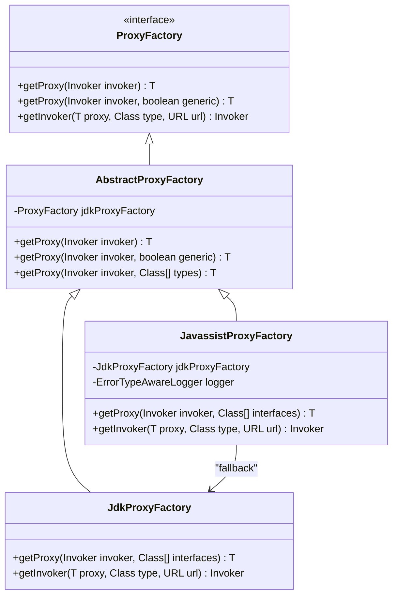

**Diagram sources**
- [ProxyFactory.java](file://dubbo-rpc\dubbo-rpc-api\src\main\java\org\apache\dubbo\rpc\ProxyFactory.java#L29-L60)
- [AbstractProxyFactory.java](file://dubbo-rpc\dubbo-rpc-api\src\main\java\org\apache\dubbo\rpc\proxy\AbstractProxyFactory.java#L41-L136)
- [JavassistProxyFactory.java](file://dubbo-rpc\dubbo-rpc-api\src\main\java\org\apache\dubbo\rpc\proxy\javassist\JavassistProxyFactory.java#L37-L124)
- [JdkProxyFactory.java](file://dubbo-rpc\dubbo-rpc-api\src\main\java\org\apache\dubbo\rpc\proxy\jdk\JdkProxyFactory.java#L31-L51)

**Section sources**
- [ProxyFactory.java](file://dubbo-rpc\dubbo-rpc-api\src\main\java\org\apache\dubbo\rpc\ProxyFactory.java#L29-L60)
- [AbstractProxyFactory.java](file://dubbo-rpc\dubbo-rpc-api\src\main\java\org\apache\dubbo\rpc\proxy\AbstractProxyFactory.java#L41-L136)

## 代理类生成机制

### 代理类缓存
Dubbo通过缓存机制避免重复生成相同的代理类，提高性能。Proxy类使用WeakHashMap作为缓存容器，以ClassLoader为键，存储不同类加载器下的代理类。

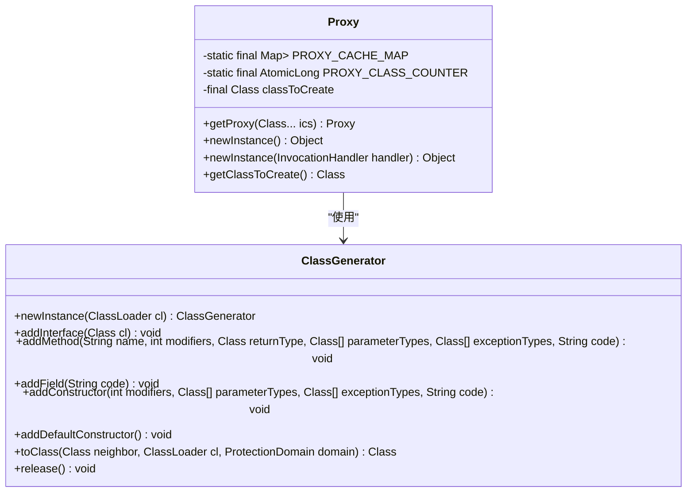

**Diagram sources**
- [Proxy.java](file://dubbo-common\src\main\java\org\apache\dubbo\common\bytecode\Proxy.java#L47-L257)
- [ClassGenerator](file://dubbo-common\src\main\java\org\apache\dubbo\common\bytecode\ClassGenerator.java)

**Section sources**
- [Proxy.java](file://dubbo-common\src\main\java\org\apache\dubbo\common\bytecode\Proxy.java#L47-L257)

### 代理类生成流程
代理类的生成过程包括接口验证、方法收集、字节码生成等步骤。系统首先验证所有接口的有效性，然后收集接口中的所有方法，最后使用字节码生成工具创建代理类。

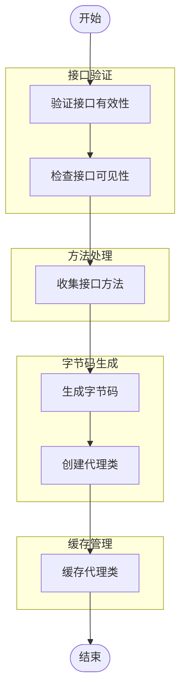

**Diagram sources**
- [Proxy.java](file://dubbo-common\src\main\java\org\apache\dubbo\common\bytecode\Proxy.java#L117-L198)

## 方法调用拦截机制

### InvocationHandler实现
InvokerInvocationHandler是Dubbo中核心的InvocationHandler实现，负责拦截所有方法调用并将其转换为RPC调用。它处理特殊方法（如toString、hashCode、equals）和业务方法调用。

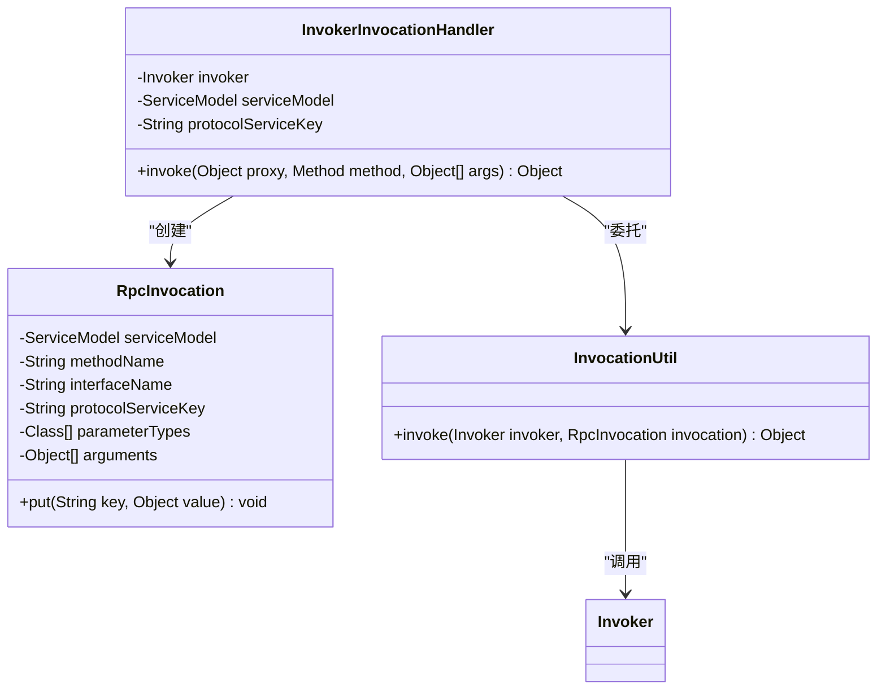

**Diagram sources**
- [InvokerInvocationHandler.java](file://dubbo-rpc\dubbo-rpc-api\src\main\java\org\apache\dubbo\rpc\proxy\InvokerInvocationHandler.java#L34-L83)
- [RpcInvocation.java](file://dubbo-rpc\dubbo-rpc-api\src\main\java\org\apache\dubbo\rpc\RpcInvocation.java)
- [InvocationUtil.java](file://dubbo-rpc\dubbo-rpc-api\src\main\java\org\apache\dubbo\rpc\InvocationUtil.java)

**Section sources**
- [InvokerInvocationHandler.java](file://dubbo-rpc\dubbo-rpc-api\src\main\java\org\apache\dubbo\rpc\proxy\InvokerInvocationHandler.java#L34-L83)

### 方法调用拦截流程
方法调用拦截流程从代理对象的方法调用开始，经过InvocationHandler处理，最终转换为RPC调用。

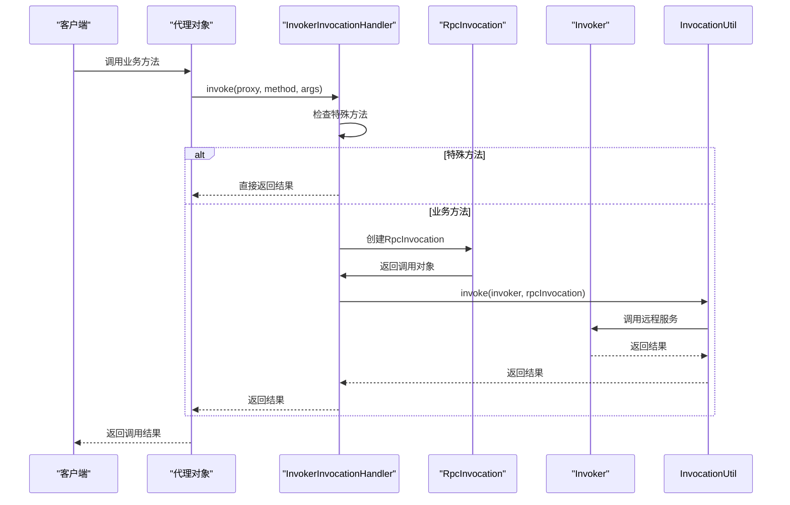

**Diagram sources**
- [InvokerInvocationHandler.java](file://dubbo-rpc\dubbo-rpc-api\src\main\java\org\apache\dubbo\rpc\proxy\InvokerInvocationHandler.java#L50-L82)

## 动态代理在Dubbo中的作用与优势

### 透明的远程调用
动态代理使得远程服务调用对开发者完全透明，开发者可以像调用本地方法一样调用远程服务。

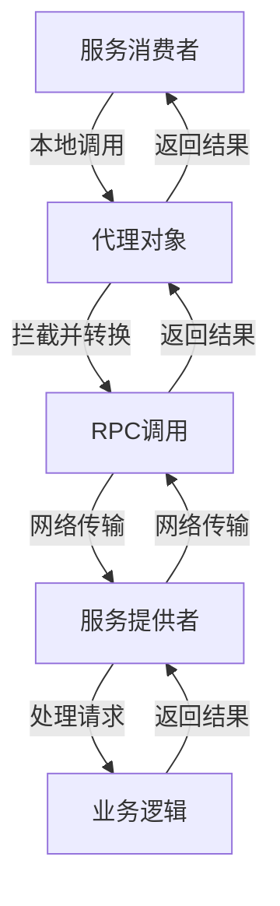

**Diagram sources**
- [InvokerInvocationHandler.java](file://dubbo-rpc\dubbo-rpc-api\src\main\java\org\apache\dubbo\rpc\proxy\InvokerInvocationHandler.java)

### AOP支持
动态代理为Dubbo提供了强大的AOP支持，可以在方法调用前后插入各种切面逻辑，如日志记录、性能监控、安全检查等。

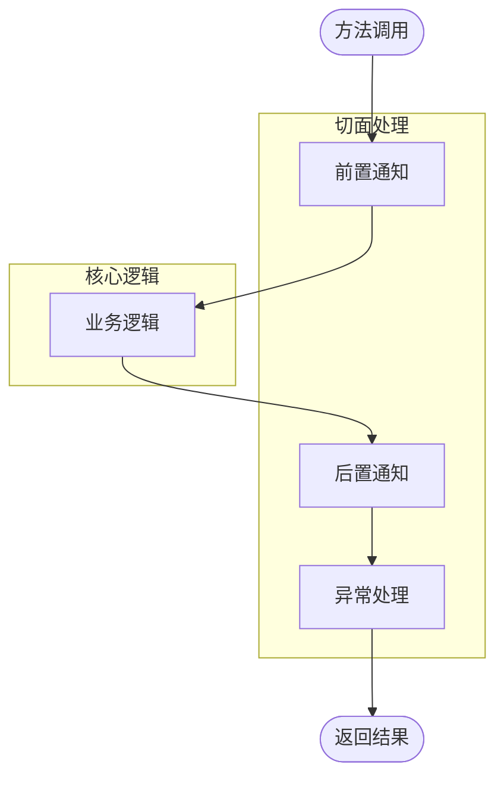

**Diagram sources**
- [AbstractProxyInvoker.java](file://dubbo-rpc\dubbo-rpc-api\src\main\java\org\apache\dubbo\rpc\proxy\AbstractProxyInvoker.java#L86-L147)

## 性能特点与优化策略

### 代理类缓存优化
Dubbo通过多级缓存机制优化代理类的生成和使用，避免重复创建相同的代理类。

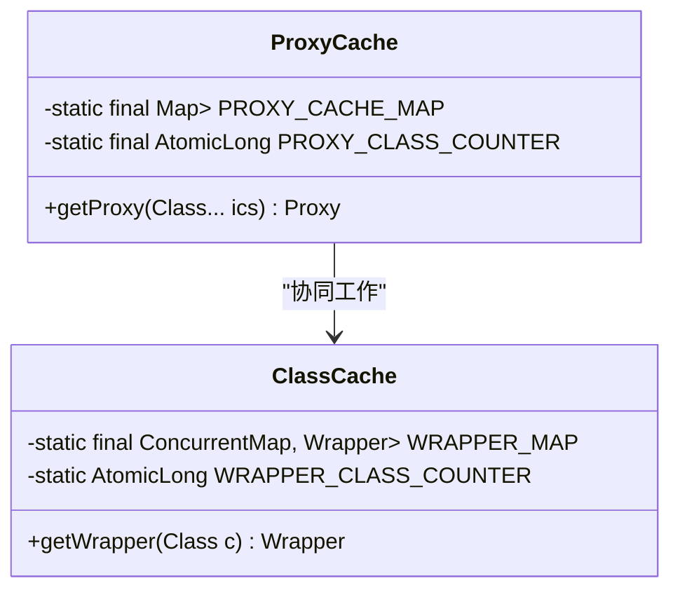

**Diagram sources**
- [Proxy.java](file://dubbo-common\src\main\java\org\apache\dubbo\common\bytecode\Proxy.java#L48-L48)
- [Wrapper.java](file://dubbo-common\src\main\java\org\apache\dubbo\common\bytecode\Wrapper.java#L46-L46)

### 方法调用优化
通过Wrapper机制优化方法调用性能，避免反射调用的开销。

```mermaid
classDiagram
class Wrapper {
<<abstract>>
-static final ConcurrentMap<Class<?>, Wrapper> WRAPPER_MAP
+getWrapper(Class<?> c) Wrapper
+invokeMethod(Object instance, String mn, Class<?>[] types, Object[] args) Object
+getPropertyValue(Object instance, String pn) Object
+setPropertyValue(Object instance, String pn, Object pv) void
}
class JavassistWrapper {
+invokeMethod(Object instance, String mn, Class<?>[] types, Object[] args) Object
+getPropertyValue(Object instance, String pn) Object
+setPropertyValue(Object instance, String pn, Object pv) void
}
Wrapper <|-- JavassistWrapper
JavassistWrapper --> "生成的字节码" : "直接调用"
```

**Diagram sources**
- [Wrapper.java](file://dubbo-common\src\main\java\org\apache\dubbo\common\bytecode\Wrapper.java#L44-L538)

## 与其他组件的集成

### 与Cluster组件的集成
动态代理与Cluster组件紧密集成，实现负载均衡和服务容错。

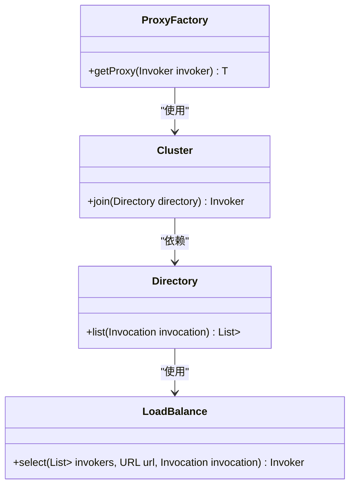

**Diagram sources**
- [ProxyFactory.java](file://dubbo-rpc\dubbo-rpc-api\src\main\java\org\apache\dubbo\rpc\ProxyFactory.java)
- [Cluster.java](file://dubbo-rpc\dubbo-rpc-api\src\main\java\org\apache\dubbo\rpc\cluster\Cluster.java)
- [Directory.java](file://dubbo-rpc\dubbo-rpc-api\src\main\java\org\apache\dubbo\rpc\cluster\Directory.java)
- [LoadBalance.java](file://dubbo-rpc\dubbo-rpc-api\src\main\java\org\apache\dubbo\rpc\cluster\LoadBalance.java)

### 与Protocol组件的集成
动态代理与Protocol组件集成，实现不同通信协议的支持。

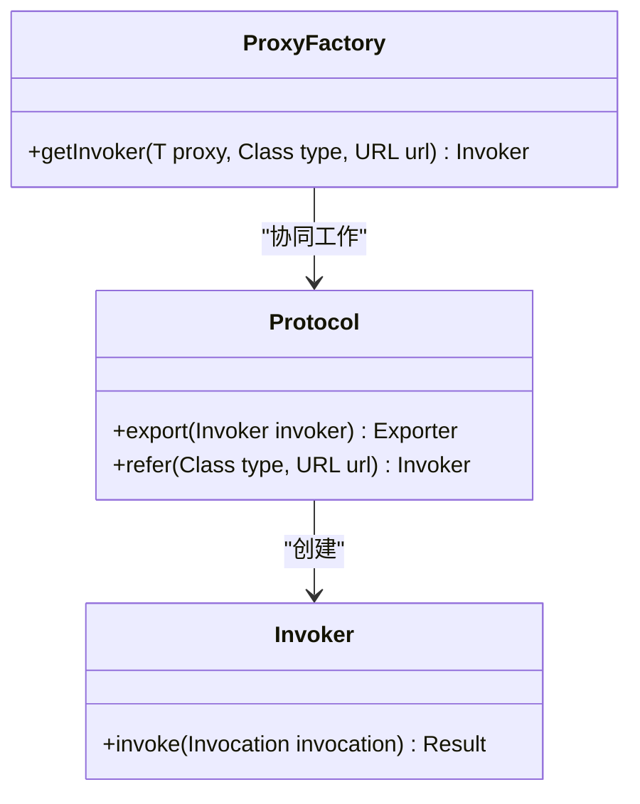

**Diagram sources**
- [ProxyFactory.java](file://dubbo-rpc\dubbo-rpc-api\src\main\java\org\apache\dubbo\rpc\ProxyFactory.java)
- [Protocol.java](file://dubbo-rpc\dubbo-rpc-api\src\main\java\org\apache\dubbo\rpc\Protocol.java)
- [Invoker.java](file://dubbo-rpc\dubbo-rpc-api\src\main\java\org\apache\dubbo\rpc\Invoker.java)

## 使用示例

### 服务消费者代理
创建服务消费者代理的示例代码。

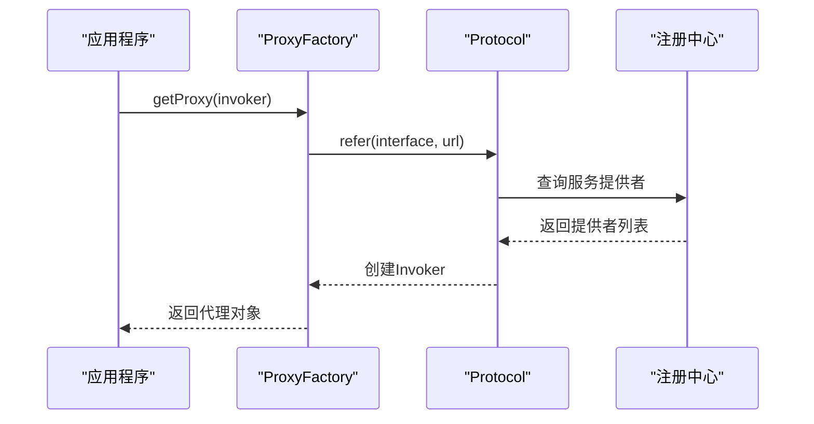

**Diagram sources**
- [ProxyFactory.java](file://dubbo-rpc\dubbo-rpc-api\src\main\java\org\apache\dubbo\rpc\ProxyFactory.java#L38-L39)
- [Protocol.java](file://dubbo-rpc\dubbo-rpc-api\src\main\java\org\apache\dubbo\rpc\Protocol.java)

### 过滤器链实现
通过动态代理实现过滤器链的示例。

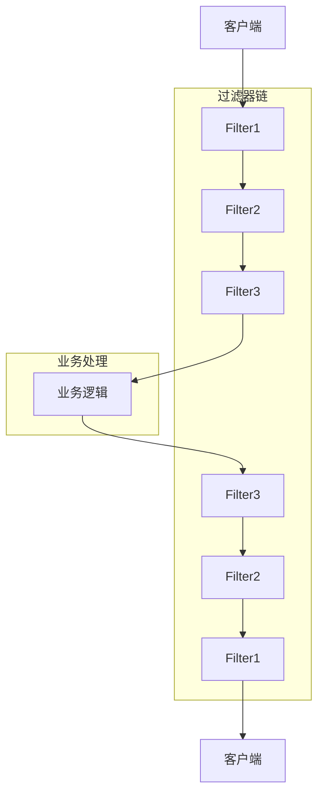

**Diagram sources**
- [Filter.java](file://dubbo-rpc\dubbo-rpc-api\src\main\java\org\apache\dubbo\rpc\Filter.java)

## 调用流程图与代理类结构图

### 动态代理调用流程图
完整的动态代理调用流程。

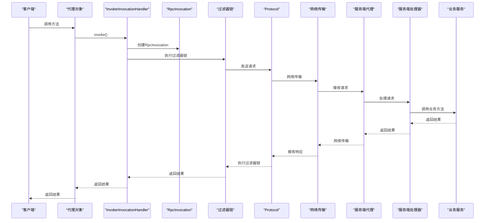

**Diagram sources**
- [InvokerInvocationHandler.java](file://dubbo-rpc\dubbo-rpc-api\src\main\java\org\apache\dubbo\rpc\proxy\InvokerInvocationHandler.java)
- [Filter.java](file://dubbo-rpc\dubbo-rpc-api\src\main\java\org\apache\dubbo\rpc\Filter.java)
- [Protocol.java](file://dubbo-rpc\dubbo-rpc-api\src\main\java\org\apache\dubbo\rpc\Protocol.java)

### 代理类结构图
代理类的完整结构。

```mermaid
classDiagram
class Proxy {
-static final Map<ClassLoader, Map<String, Proxy>> PROXY_CACHE_MAP
-static final AtomicLong PROXY_CLASS_COUNTER
-final Class<?> classToCreate
+getProxy(Class<?>... ics) Proxy
+newInstance() Object
+newInstance(InvocationHandler handler) Object
+getClassToCreate() Class<?>
}
class ProxyInstance {
+static Method[] methods
-InvocationHandler handler
+ProxyInstance(InvocationHandler handler)
+Object method1(args)
+Object method2(args)
+...
}
class InvokerInvocationHandler {
-Invoker<?> invoker
-ServiceModel serviceModel
-String protocolServiceKey
+invoke(Object proxy, Method method, Object[] args) Object
}
class Wrapper {
-static final ConcurrentMap<Class<?>, Wrapper> WRAPPER_MAP
+getWrapper(Class<?> c) Wrapper
+invokeMethod(Object instance, String mn, Class<?>[] types, Object[] args) Object
}
Proxy --> ProxyInstance : "创建"
ProxyInstance --> InvokerInvocationHandler : "使用"
InvokerInvocationHandler --> Wrapper : "可能使用"
Wrapper --> "生成的字节码" : "直接调用"
```

**Diagram sources**
- [Proxy.java](file://dubbo-common\src\main\java\org\apache\dubbo\common\bytecode\Proxy.java)
- [InvokerInvocationHandler.java](file://dubbo-rpc\dubbo-rpc-api\src\main\java\org\apache\dubbo\rpc\proxy\InvokerInvocationHandler.java)
- [Wrapper.java](file://dubbo-common\src\main\java\org\apache\dubbo\common\bytecode\Wrapper.java)

## 结论
Dubbo的动态代理机制是其核心功能之一，通过精心设计的Proxy、ProxyFactory、InvocationHandler和Wrapper等组件，实现了高效、灵活的远程服务调用。该机制不仅提供了透明的远程调用体验，还支持AOP、负载均衡、服务容错等高级功能。通过代理类缓存、方法调用优化等策略，Dubbo在保证功能完整性的同时，也实现了优异的性能表现。对于开发者而言，理解动态代理的实现机制有助于更好地使用Dubbo框架，优化系统性能，解决实际问题。