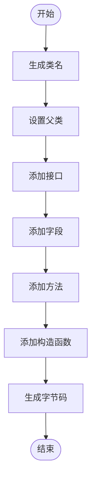
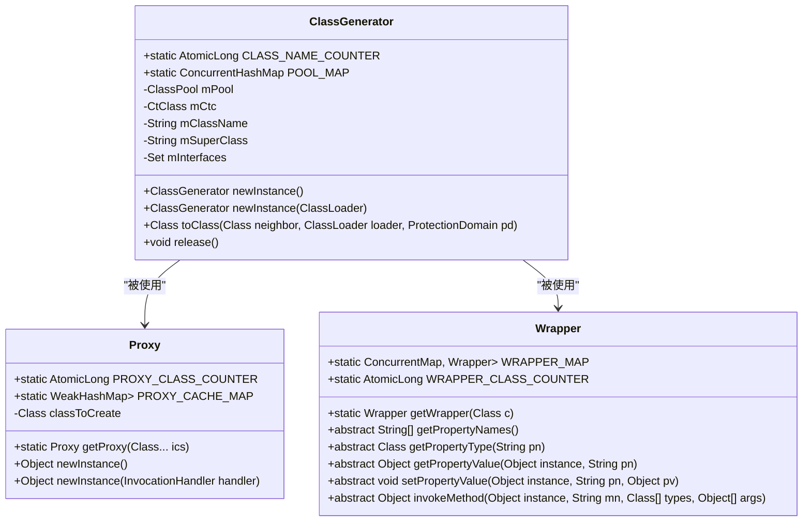
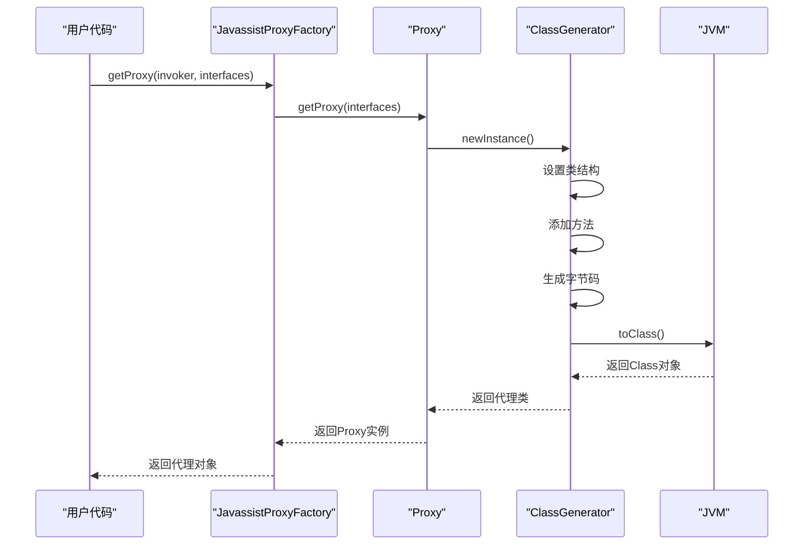

# 字节码生成

<cite>
**本文档引用的文件**   
- [ClassGenerator.java](file://dubbo-common\src\main\java\org\apache\dubbo\common\bytecode\ClassGenerator.java)
- [Proxy.java](file://dubbo-common\src\main\java\org\apache\dubbo\common\bytecode\Proxy.java)
- [Wrapper.java](file://dubbo-common\src\main\java\org\apache\dubbo\common\bytecode\Wrapper.java)
- [JavassistProxyFactory.java](file://dubbo-rpc\dubbo-rpc-api\src\main\java\org\apache\dubbo\rpc\proxy\javassist\JavassistProxyFactory.java)
- [AbstractProxyInvoker.java](file://dubbo-rpc\dubbo-rpc-api\src\main\java\org\apache\dubbo\rpc\proxy\AbstractProxyInvoker.java)
- [ClassGeneratorTest.java](file://dubbo-common\src\test\java\org\apache\dubbo\common\bytecode\ClassGeneratorTest.java)
</cite>

## 目录
1. [引言](#引言)
2. [ClassGenerator类实现原理](#classgenerator类实现原理)
3. [字节码生成流程](#字节码生成流程)
4. [性能特点与优化策略](#性能特点与优化策略)
5. [在Dubbo中的应用场景](#在dubbo中的应用场景)
6. [调试方法与工具](#调试方法与工具)
7. [示例与技巧](#示例与技巧)
8. [流程图与类结构图](#流程图与类结构图)

## 引言
字节码生成是Dubbo框架中的核心技术之一，它通过动态生成Java类来实现服务代理、方法调用等功能。ClassGenerator类作为字节码生成的核心组件，提供了灵活的类结构生成、方法生成和字段生成能力。本文档将深入解析ClassGenerator的实现原理，阐述字节码生成的完整流程，并分析其性能特点和优化策略。

## ClassGenerator类实现原理

ClassGenerator类是Dubbo中用于生成字节码的核心工具，基于Javassist库实现。它提供了构建类结构、添加字段、方法和构造函数的完整API。

### 类结构生成
ClassGenerator通过内部的CtClass对象来管理类的结构。当调用toClass方法时，会创建一个新的CtClass实例，并设置类名、父类和接口。

### 方法生成
ClassGenerator提供了多种方法生成的API：
- `addMethod(String code)`：直接添加方法代码
- `addMethod(String name, int mod, Class<?> rt, Class<?>[] pts, String body)`：通过参数定义方法
- `addMethod(Method m)`：复制现有方法

### 字段生成
字段生成通过addField方法实现，支持指定字段名、修饰符、类型和默认值。

**本节来源**
- [ClassGenerator.java](file://dubbo-common\src\main\java\org\apache\dubbo\common\bytecode\ClassGenerator.java#L134-L334)

## 字节码生成流程

字节码生成的完整流程包括类名生成、接口实现、方法体生成等关键步骤。

### 类名生成
类名生成采用计数器机制，确保每个生成的类都有唯一的名称。当未显式设置类名时，会根据父类或接口生成默认名称。

### 接口实现
通过addInterface方法添加接口，生成的类会实现所有指定的接口。Proxy类在生成代理时会自动添加InvocationHandler接口。

### 方法体生成
方法体生成是字节码生成的核心，通过构建Java代码字符串来定义方法逻辑。Proxy类生成的方法体包含参数转换、方法调用和结果返回的完整逻辑。



**图表来源**
- [ClassGenerator.java](file://dubbo-common\src\main\java\org\apache\dubbo\common\bytecode\ClassGenerator.java#L302-L334)
- [Proxy.java](file://dubbo-common\src\main\java\org\apache\dubbo\common\bytecode\Proxy.java#L118-L189)

**本节来源**
- [ClassGenerator.java](file://dubbo-common\src\main\java\org\apache\dubbo\common\bytecode\ClassGenerator.java#L302-L334)
- [Proxy.java](file://dubbo-common\src\main\java\org\apache\dubbo\common\bytecode\Proxy.java#L118-L189)

## 性能特点与优化策略

### 性能特点
字节码生成具有以下性能特点：
- 动态性：可以在运行时生成类
- 高效性：避免了反射调用的开销
- 灵活性：可以生成任意结构的类

### 优化策略
#### 缓存机制
ClassGenerator使用ClassLoader作为键的ConcurrentHashMap来缓存ClassPool，避免重复创建ClassPool实例。

#### 生成效率优化
- 复用ClassPool实例
- 使用WeakHashMap缓存生成的代理类
- 原子计数器生成唯一类名



**图表来源**
- [ClassGenerator.java](file://dubbo-common\src\main\java\org\apache\dubbo\common\bytecode\ClassGenerator.java#L48-L62)
- [Proxy.java](file://dubbo-common\src\main\java\org\apache\dubbo\common\bytecode\Proxy.java#L48-L50)
- [Wrapper.java](file://dubbo-common\src\main\java\org\apache\dubbo\common\bytecode\Wrapper.java#L46-L107)

**本节来源**
- [ClassGenerator.java](file://dubbo-common\src\main\java\org\apache\dubbo\common\bytecode\ClassGenerator.java#L48-L62)
- [Proxy.java](file://dubbo-common\src\main\java\org\apache\dubbo\common\bytecode\Proxy.java#L48-L50)

## 在Dubbo中的应用场景

### 服务代理类生成
JavassistProxyFactory使用ClassGenerator生成服务代理类，通过Proxy.getProxy方法创建代理实例。

### Invoker生成
AbstractProxyInvoker的子类使用字节码生成技术创建Invoker实例，Wrapper类用于优化方法调用性能。

**本节来源**
- [JavassistProxyFactory.java](file://dubbo-rpc\dubbo-rpc-api\src\main\java\org\apache\dubbo\rpc\proxy\javassist\JavassistProxyFactory.java#L42-L77)
- [AbstractProxyInvoker.java](file://dubbo-rpc\dubbo-rpc-api\src\main\java\org\apache\dubbo\rpc\proxy\AbstractProxyInvoker.java#L160-L162)

## 调试方法与工具

### 调试方法
1. 启用Javassist调试模式
2. 使用字节码查看工具分析生成的类
3. 通过日志跟踪类生成过程

### 调试工具
- Javassist自带的调试工具
- Java字节码反编译器
- JVM监控工具

**本节来源**
- [ClassGeneratorTest.java](file://dubbo-common\src\test\java\org\apache\dubbo\common\bytecode\ClassGeneratorTest.java#L56-L178)

## 示例与技巧

### 简单字节码生成示例
```java
ClassGenerator cg = ClassGenerator.newInstance();
cg.setClassName("com.example.TestClass");
cg.addInterface(Runnable.class);
cg.addDefaultConstructor();
cg.addMethod("public void run() { System.out.println(\"Hello World\"); }");
Class<?> clazz = cg.toClass();
```

### 字节码优化技巧
1. 复用ClassGenerator实例
2. 合理设置类加载器
3. 及时释放资源
4. 利用缓存机制

**本节来源**
- [ClassGeneratorTest.java](file://dubbo-common\src\test\java\org\apache\dubbo\common\bytecode\ClassGeneratorTest.java#L56-L178)

## 流程图与类结构图



**图表来源**
- [JavassistProxyFactory.java](file://dubbo-rpc\dubbo-rpc-api\src\main\java\org\apache\dubbo\rpc\proxy\javassist\JavassistProxyFactory.java#L42-L77)
- [Proxy.java](file://dubbo-common\src\main\java\org\apache\dubbo\common\bytecode\Proxy.java#L63-L92)
- [ClassGenerator.java](file://dubbo-common\src\main\java\org\apache\dubbo\common\bytecode\ClassGenerator.java#L302-L367)