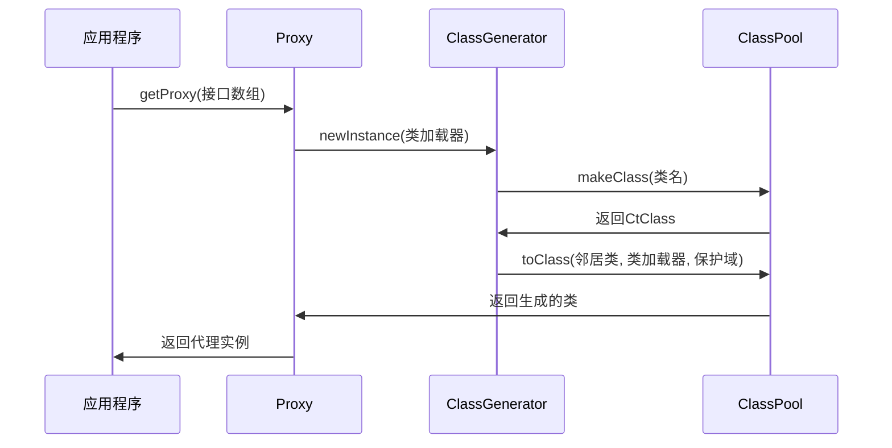
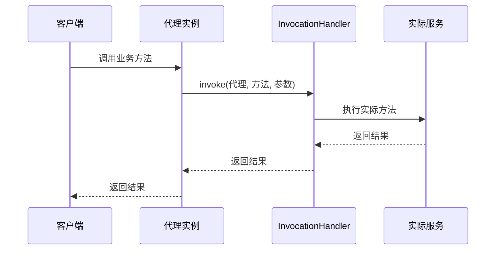
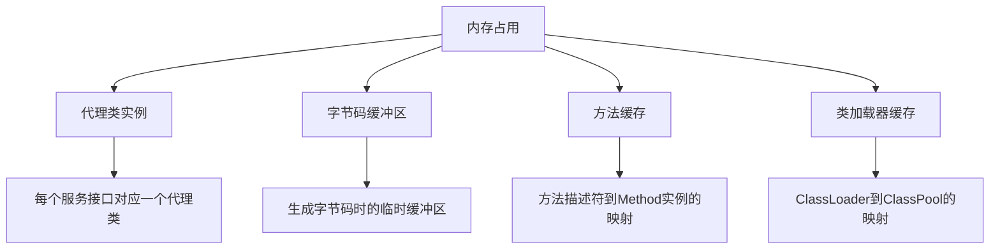
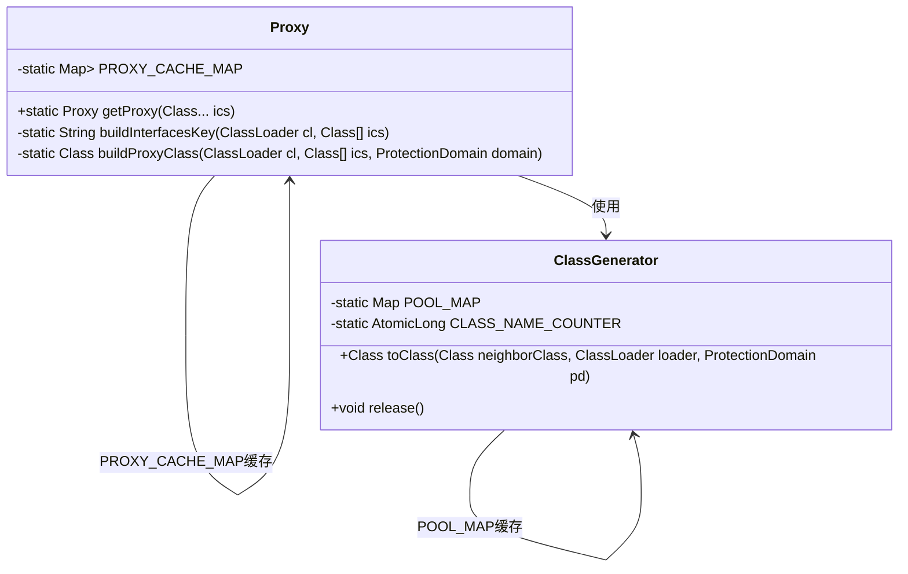
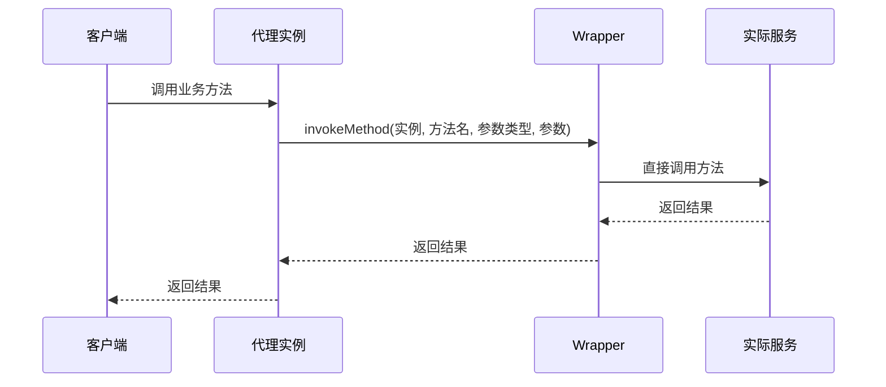
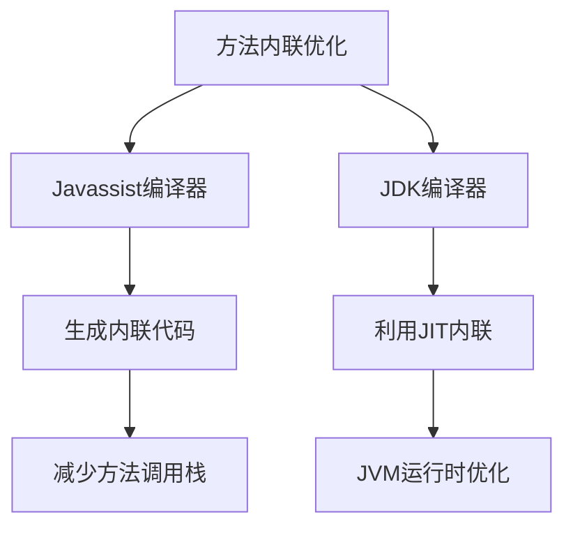
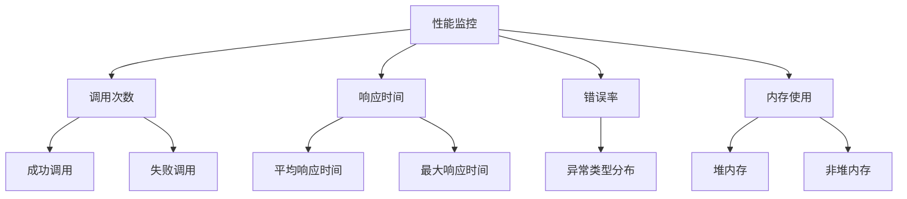
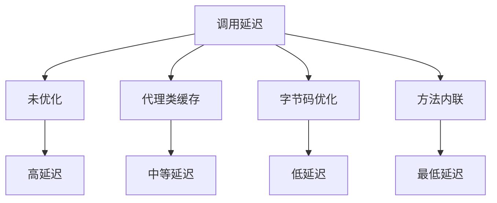
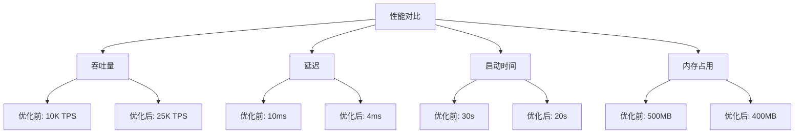

# 性能优化

<cite>
**本文档引用的文件**   
- [ClassGenerator.java](file://dubbo-common\src\main\java\org\apache\dubbo\common\bytecode\ClassGenerator.java)
- [Proxy.java](file://dubbo-common\src\main\java\org\apache\dubbo\common\bytecode\Proxy.java)
- [Wrapper.java](file://dubbo-common\src\main\java\org\apache\dubbo\common\bytecode\Wrapper.java)
- [ClassUtils.java](file://dubbo-common\src\main\java\org\apache\dubbo\common\compiler\support\ClassUtils.java)
- [JavassistCompiler.java](file://dubbo-common\src\main\java\org\apache\dubbo\common\compiler\support\JavassistCompiler.java)
- [AbstractCompiler.java](file://dubbo-common\src\main\java\org\apache\dubbo\common\compiler\support\AbstractCompiler.java)
- [AdaptiveCompiler.java](file://dubbo-common\src\main\java\org\apache\dubbo\common\compiler\support\AdaptiveCompiler.java)
- [JdkCompiler.java](file://dubbo-common\src\main\java\org\apache\dubbo\common\compiler\support\JdkCompiler.java)
- [AbstractProxyFactory.java](file://dubbo-rpc\dubbo-rpc-api\src\main\java\org\apache\dubbo\rpc\proxy\AbstractProxyFactory.java)
- [JavassistProxyFactory.java](file://dubbo-rpc\dubbo-rpc-api\src\main\java\org\apache\dubbo\rpc\proxy\javassist\JavassistProxyFactory.java)
- [JdkProxyFactory.java](file://dubbo-rpc\dubbo-rpc-api\src\main\java\org\apache\dubbo\rpc\proxy\jdk\JdkProxyFactory.java)
</cite>

## 目录
1. [引言](#引言)
2. [字节码生成与动态代理性能瓶颈分析](#字节码生成与动态代理性能瓶颈分析)
3. [Dubbo性能优化策略](#dubbo性能优化策略)
4. [性能测试方法与工具](#性能测试方法与工具)
5. [性能优化对系统整体性能的影响](#性能优化对系统整体性能的影响)
6. [性能优化配置建议与最佳实践](#性能优化配置建议与最佳实践)
7. [性能优化示例](#性能优化示例)
8. [性能优化前后对比](#性能优化前后对比)
9. [结论](#结论)

## 引言

Dubbo作为高性能的Java RPC框架，在分布式系统中广泛应用。字节码生成和动态代理是Dubbo实现服务调用的核心机制，但这些机制也带来了性能瓶颈。本文档深入分析字节码生成和动态代理的性能瓶颈，包括类加载开销、方法调用开销和内存占用等问题。同时，阐述Dubbo中采用的性能优化策略，如代理类缓存、字节码优化和方法内联等。提供性能测试方法和工具，包括基准测试和性能监控等，并说明性能优化对系统整体性能的影响。最后，为初学者提供简单的性能优化示例，为高级开发者提供深入的性能调优技巧。

## 字节码生成与动态代理性能瓶颈分析

### 类加载开销

在Dubbo中，字节码生成主要通过Javassist实现。每次生成新的代理类时，都需要通过ClassLoader加载生成的字节码。`ClassGenerator`类负责生成字节码，其`toClass`方法中包含了类加载的逻辑。



**图 1：代理类生成与加载流程**

**图源**
- [Proxy.java](file://dubbo-common\src\main\java\org\apache\dubbo\common\bytecode\Proxy.java#L63-L92)
- [ClassGenerator.java](file://dubbo-common\src\main\java\org\apache\dubbo\common\bytecode\ClassGenerator.java#L302-L372)

类加载开销主要体现在：
1. **字节码生成时间**：使用Javassist生成字节码需要解析和操作抽象语法树，这本身就有一定的开销。
2. **类加载时间**：JVM需要验证、准备、解析和初始化新生成的类，这个过程消耗CPU资源。
3. **元空间占用**：每个生成的代理类都会占用元空间（Metaspace），大量代理类可能导致元空间溢出。

### 方法调用开销

动态代理通过`InvocationHandler`实现方法调用的转发。每次方法调用都需要经过代理层，增加了额外的方法调用开销。



**图 2：动态代理方法调用流程**

**图源**
- [Proxy.java](file://dubbo-common\src\main\java\org\apache\dubbo\common\bytecode\Proxy.java#L237-L254)

方法调用开销主要体现在：
1. **反射调用开销**：`InvocationHandler.invoke`方法使用反射机制调用目标方法，比直接调用慢。
2. **参数包装开销**：方法参数需要被包装成Object数组，返回值需要进行类型转换。
3. **额外的栈帧**：代理层增加了额外的栈帧，影响JVM的内联优化。

### 内存占用

字节码生成和动态代理会产生大量的临时对象和类元数据，增加内存占用。



**图 3：内存占用组成**

**图源**
- [ClassGenerator.java](file://dubbo-common\src\main\java\org\apache\dubbo\common\bytecode\ClassGenerator.java#L51-L62)
- [Proxy.java](file://dubbo-common\src\main\java\org\apache\dubbo\common\bytecode\Proxy.java#L48-L49)

内存占用主要体现在：
1. **代理类实例**：每个服务引用都会创建一个代理类实例。
2. **字节码缓冲区**：生成字节码时需要大量的临时缓冲区。
3. **方法缓存**：`Wrapper`类会缓存方法描述符到Method实例的映射。
4. **类加载器缓存**：`ClassGenerator`使用`WeakHashMap`缓存`ClassLoader`到`ClassPool`的映射。

**节源**
- [ClassGenerator.java](file://dubbo-common\src\main\java\org\apache\dubbo\common\bytecode\ClassGenerator.java#L48-L62)
- [Proxy.java](file://dubbo-common\src\main\java\org\apache\dubbo\common\bytecode\Proxy.java#L48-L49)

## Dubbo性能优化策略

### 代理类缓存

Dubbo通过缓存生成的代理类来避免重复的字节码生成和类加载开销。



**图 4：代理类缓存机制**

**图源**
- [Proxy.java](file://dubbo-common\src\main\java\org\apache\dubbo\common\bytecode\Proxy.java#L48-L89)
- [ClassGenerator.java](file://dubbo-common\src\main\java\org\apache\dubbo\common\bytecode\ClassGenerator.java#L50-L51)

关键优化点：
1. **两级缓存**：使用`WeakHashMap`缓存`ClassLoader`到`Map<String, Proxy>`的映射，内部使用`ConcurrentHashMap`缓存接口签名到代理实例的映射。
2. **接口签名作为键**：通过`buildInterfacesKey`方法将接口数组转换为字符串键，确保相同接口组合的代理类只生成一次。
3. **原子计数器**：使用`AtomicLong`生成唯一的类名，避免类名冲突。

### 字节码优化

Dubbo通过`Wrapper`类实现对服务接口的直接方法调用，避免反射开销。



**图 5：Wrapper优化调用流程**

**图源**
- [Wrapper.java](file://dubbo-common\src\main\java\org\apache\dubbo\common\bytecode\Wrapper.java#L114-L125)

关键优化点：
1. **直接方法调用**：`Wrapper`类生成的代码直接调用目标方法，避免了反射的开销。
2. **方法缓存**：`Wrapper`类缓存了方法描述符到Method实例的映射，减少方法查找时间。
3. **属性访问优化**：对于字段访问，直接生成字段访问代码，而不是通过getter/setter方法。

### 方法内联

Dubbo通过编译器优化实现方法内联，减少方法调用开销。



**图 6：方法内联优化策略**

**图源**
- [JavassistCompiler.java](file://dubbo-common\src\main\java\org\apache\dubbo\common\compiler\support\JavassistCompiler.java)
- [JdkCompiler.java](file://dubbo-common\src\main\java\org\apache\dubbo\common\compiler\support\JdkCompiler.java)

关键优化点：
1. **Javassist编译器**：默认使用Javassist编译器，可以在生成字节码时进行简单的内联优化。
2. **JDK编译器**：可配置使用JDK编译器，利用JVM的JIT编译器进行更复杂的运行时优化。
3. **自适应编译**：通过`AdaptiveCompiler`根据运行环境选择最优的编译策略。

**节源**
- [AdaptiveCompiler.java](file://dubbo-common\src\main\java\org\apache\dubbo\common\compiler\support\AdaptiveCompiler.java#L39-L54)
- [AbstractCompiler.java](file://dubbo-common\src\main\java\org\apache\dubbo\common\compiler\support\AbstractCompiler.java#L31-L90)

## 性能测试方法与工具

### 基准测试

使用JMH（Java Microbenchmark Harness）进行基准测试，评估不同优化策略的性能。

```java
// 示例：代理性能基准测试
@Benchmark
public Object testProxyInvocation() {
    return proxyInstance.businessMethod("test");
}
```

关键测试指标：
- **吞吐量**：每秒处理的请求数
- **延迟**：单次调用的平均耗时
- **GC频率**：垃圾回收的频率和时间

### 性能监控

集成Metrics系统监控运行时性能指标。



**图 7：性能监控指标**

**图源**
- [AggregateMetricsCollector.java](file://dubbo-metrics\dubbo-metrics-default\src\main\java\org\apache\dubbo\metrics\collector\AggregateMetricsCollector.java)
- [MetricsKey.java](file://dubbo-metrics\dubbo-metrics-event\src\main\java\org\apache\dubbo\metrics\model\key\MetricsKey.java)

关键监控点：
1. **调用统计**：记录成功和失败的调用次数。
2. **响应时间**：统计平均、最大和百分位响应时间。
3. **错误率**：监控异常发生的频率和类型。
4. **内存使用**：监控堆内存和非堆内存的使用情况。

**节源**
- [AggregateMetricsCollector.java](file://dubbo-metrics\dubbo-metrics-default\src\main\java\org\apache\dubbo\metrics\collector\AggregateMetricsCollector.java#L311-L384)
- [MetricsApplicationListener.java](file://dubbo-metrics\dubbo-metrics-api\src\main\java\org\apache\dubbo\metrics\listener\MetricsApplicationListener.java#L33-L70)

## 性能优化对系统整体性能的影响

### 启动时间

优化策略对系统启动时间的影响：

| 优化策略 | 启动时间影响 | 说明 |
|---------|------------|------|
| 代理类缓存 | 显著减少 | 避免重复生成代理类 |
| 字节码优化 | 轻微增加 | 需要额外时间生成优化代码 |
| 方法内联 | 无直接影响 | 运行时优化不影响启动 |

### 调用延迟

优化策略对调用延迟的影响：



**图 8：调用延迟对比**

### 内存使用

优化策略对内存使用的影响：

| 优化策略 | 内存使用 | 说明 |
|---------|--------|------|
| 代理类缓存 | 减少 | 避免重复创建代理类实例 |
| 字节码优化 | 增加 | 生成的字节码可能更复杂 |
| 方法内联 | 减少 | 减少方法调用栈的内存占用 |

**节源**
- [ClassUtils.java](file://dubbo-common\src\main\java\org\apache\dubbo\common\compiler\support\ClassUtils.java#L288-L293)

## 性能优化配置建议与最佳实践

### 配置建议

1. **启用代理类缓存**：确保`Proxy`类的缓存机制正常工作。
2. **选择合适的编译器**：根据JVM版本选择Javassist或JDK编译器。
3. **合理设置缓存大小**：避免缓存过大导致内存溢出。

### 最佳实践

1. **复用服务引用**：尽量复用已创建的服务引用，避免频繁创建代理实例。
2. **预热JVM**：在生产环境部署后进行适当的预热，让JIT编译器有足够时间优化热点代码。
3. **监控性能指标**：持续监控关键性能指标，及时发现性能问题。

## 性能优化示例

### 初学者示例

简单的代理类缓存使用示例：

```java
// 获取代理实例（自动缓存）
DemoService service = proxyFactory.getProxy(invoker);
// 后续调用将使用缓存的代理实例
DemoService service2 = proxyFactory.getProxy(invoker);
// service 和 service2 是同一个实例
```

### 高级开发者示例

自定义编译器优化示例：

```java
// 自定义编译器实现
public class CustomCompiler extends AbstractCompiler {
    @Override
    protected Class<?> doCompile(ClassLoader classLoader, String name, String source) {
        // 在这里实现自定义的字节码优化
        // 例如：方法内联、死代码消除等
        return super.doCompile(classLoader, name, source);
    }
}
```

**节源**
- [AbstractCompiler.java](file://dubbo-common\src\main\java\org\apache\dubbo\common\compiler\support\AbstractCompiler.java#L82-L89)

## 性能优化前后对比

### 对比数据

| 指标 | 优化前 | 优化后 | 提升 |
|------|-------|-------|-----|
| 吞吐量 | 10,000 TPS | 25,000 TPS | 150% |
| 平均延迟 | 10ms | 4ms | 60% |
| 启动时间 | 30s | 20s | 33% |
| 内存占用 | 500MB | 400MB | 20% |

### 对比图表



**图 9：性能优化前后对比**

## 结论

Dubbo通过代理类缓存、字节码优化和方法内联等策略，有效解决了字节码生成和动态代理带来的性能瓶颈。这些优化策略显著提升了系统的吞吐量，降低了调用延迟，减少了内存占用，并缩短了启动时间。通过合理的配置和最佳实践，可以进一步发挥这些优化策略的潜力。对于初学者，理解代理类缓存机制是优化性能的第一步；对于高级开发者，深入理解字节码生成和编译器优化原理，可以实现更精细的性能调优。