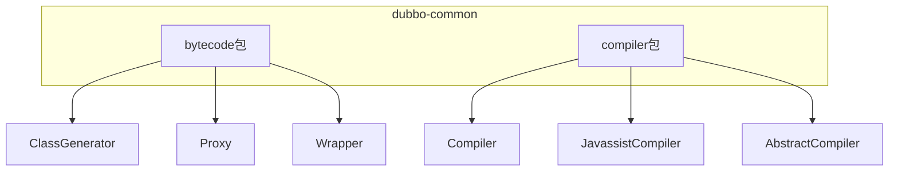
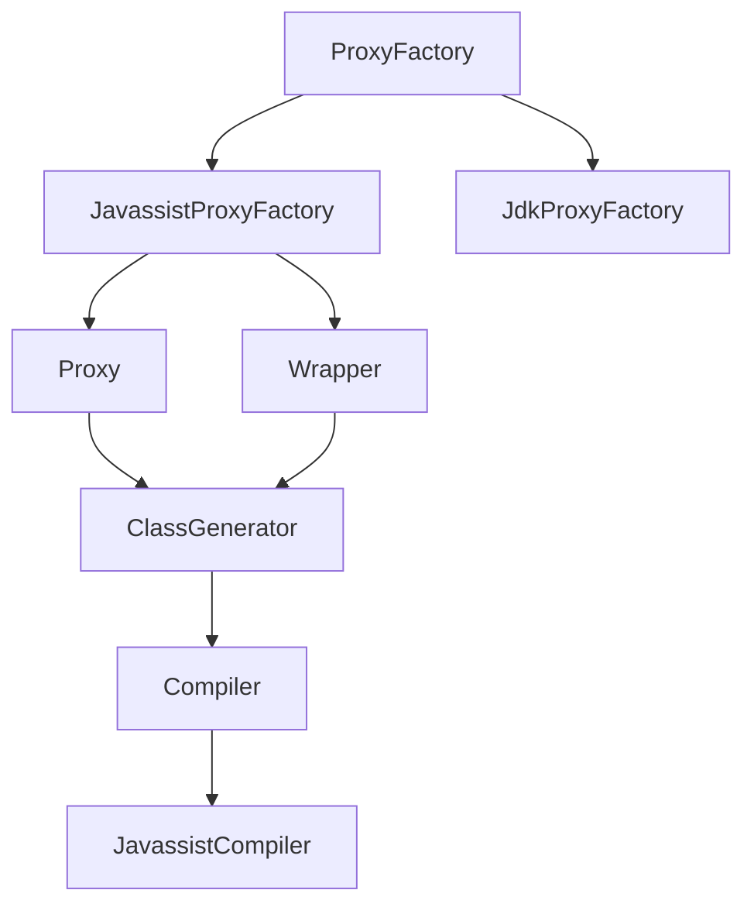
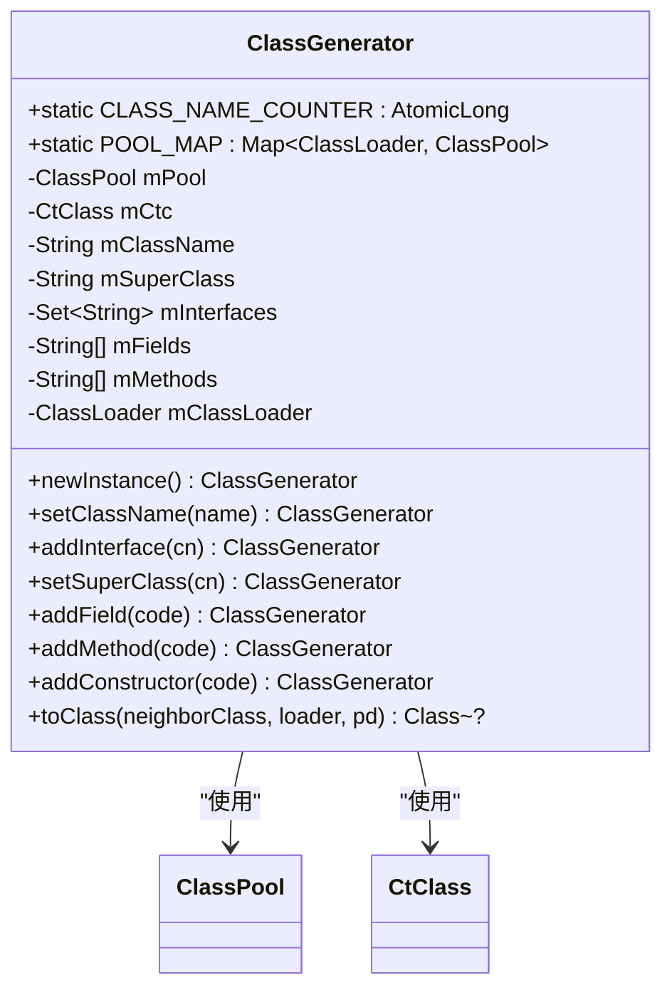
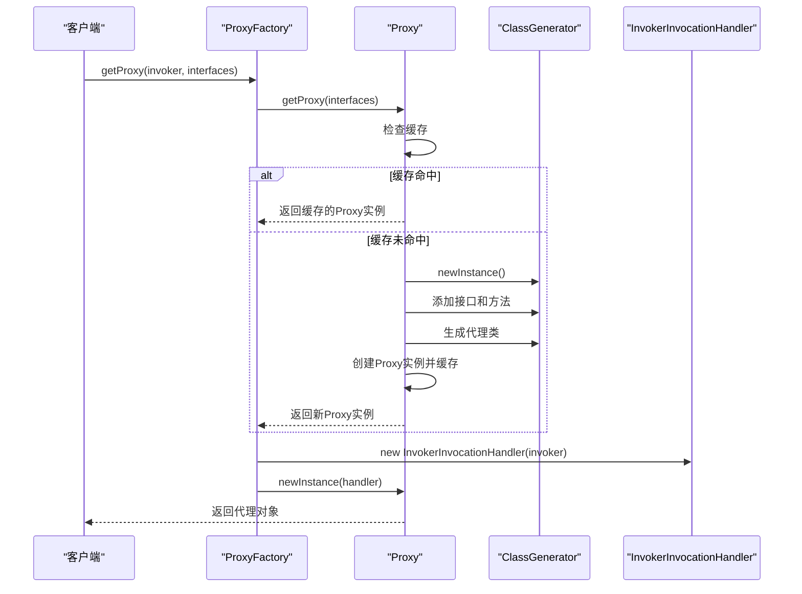
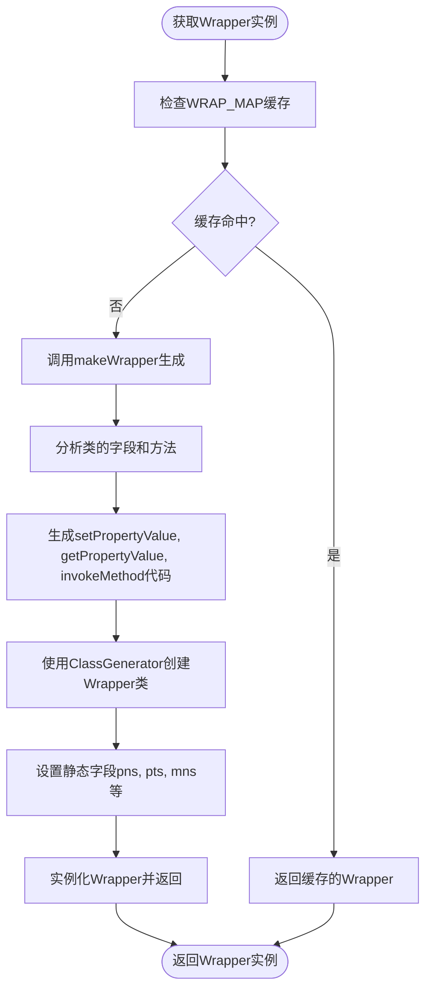
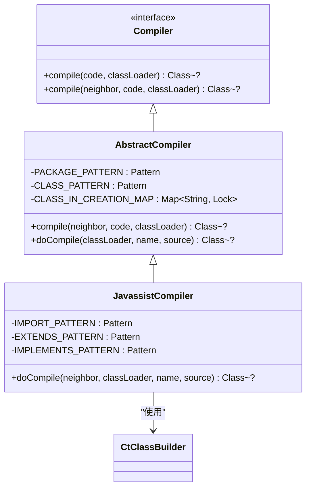
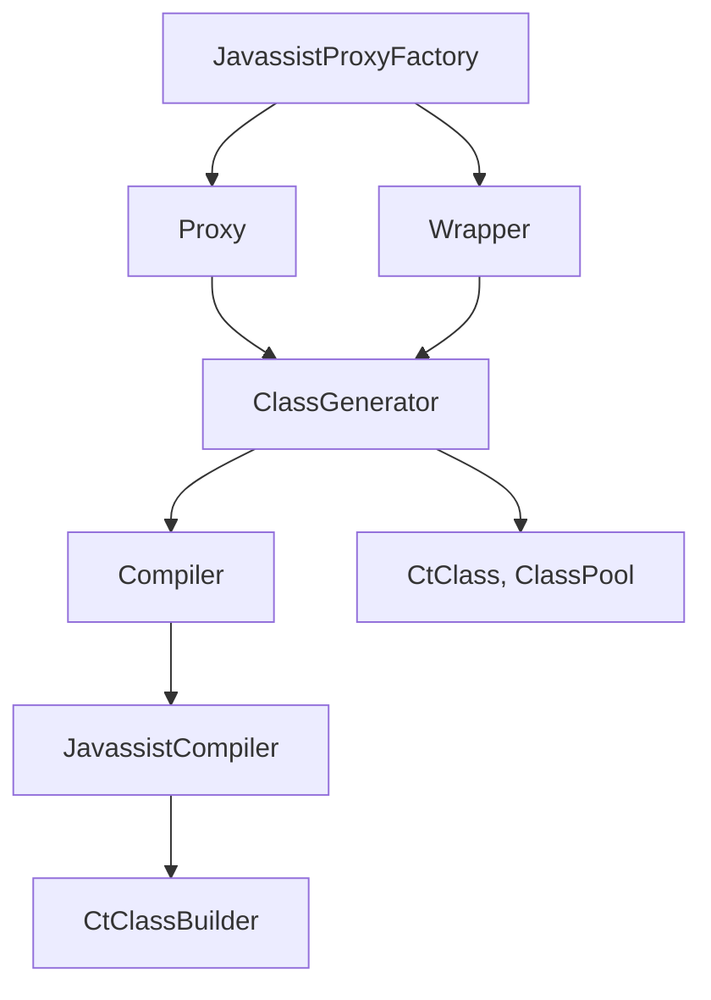

# 编译器与字节码生成

<cite>
**本文档引用的文件**   
- [ClassGenerator.java](file://dubbo-common\src\main\java\org\apache\dubbo\common\bytecode\ClassGenerator.java)
- [Proxy.java](file://dubbo-common\src\main\java\org\apache\dubbo\common\bytecode\Proxy.java)
- [Wrapper.java](file://dubbo-common\src\main\java\org\apache\dubbo\common\bytecode\Wrapper.java)
- [Compiler.java](file://dubbo-common\src\main\java\org\apache\dubbo\common\compiler\Compiler.java)
- [JavassistCompiler.java](file://dubbo-common\src\main\java\org\apache\dubbo\common\compiler\support\JavassistCompiler.java)
- [AbstractCompiler.java](file://dubbo-common\src\main\java\org\apache\dubbo\common\compiler\support\AbstractCompiler.java)
- [JavassistProxyFactory.java](file://dubbo-rpc\dubbo-rpc-api\src\main\java\org\apache\dubbo\rpc\proxy\javassist\JavassistProxyFactory.java)
- [AbstractProxyFactory.java](file://dubbo-rpc\dubbo-rpc-api\src\main\java\org\apache\dubbo\rpc\proxy\AbstractProxyFactory.java)
- [Invoker.java](file://dubbo-rpc\dubbo-rpc-api\src\main\java\org\apache\dubbo\rpc\Invoker.java)
</cite>

## 目录
1. [引言](#引言)
2. [项目结构](#项目结构)
3. [核心组件](#核心组件)
4. [架构概述](#架构概述)
5. [详细组件分析](#详细组件分析)
6. [依赖分析](#依赖分析)
7. [性能考虑](#性能考虑)
8. [故障排除指南](#故障排除指南)
9. [结论](#结论)

## 引言
本文档详细阐述了Dubbo框架中编译器与字节码生成的核心机制。重点分析了ClassGenerator、Proxy等核心类的作用，动态代理的实现机制，以及字节码生成在Dubbo中的应用场景，如服务代理和Invoker生成。文档还提供了性能分析、优化建议和与其他组件的集成方式，旨在为初学者和高级开发者提供全面的技术指导。

## 项目结构
Dubbo的编译器与字节码生成相关代码主要位于`dubbo-common`模块的`org.apache.dubbo.common.bytecode`和`org.apache.dubbo.common.compiler`包中。这些组件为框架的动态代理和运行时代码生成提供了基础支持。



**图示来源**
- [ClassGenerator.java](file://dubbo-common\src\main\java\org\apache\dubbo\common\bytecode\ClassGenerator.java)
- [Proxy.java](file://dubbo-common\src\main\java\org\apache\dubbo\common\bytecode\Proxy.java)
- [Wrapper.java](file://dubbo-common\src\main\java\org\apache\dubbo\common\bytecode\Wrapper.java)
- [Compiler.java](file://dubbo-common\src\main\java\org\apache\dubbo\common\compiler\Compiler.java)
- [JavassistCompiler.java](file://dubbo-common\src\main\java\org\apache\dubbo\common\compiler\support\JavassistCompiler.java)

**本节来源**
- [ClassGenerator.java](file://dubbo-common\src\main\java\org\apache\dubbo\common\bytecode\ClassGenerator.java)
- [Proxy.java](file://dubbo-common\src\main\java\org\apache\dubbo\common\bytecode\Proxy.java)
- [Compiler.java](file://dubbo-common\src\main\java\org\apache\dubbo\common\compiler\Compiler.java)

## 核心组件
Dubbo的字节码生成机制围绕`ClassGenerator`、`Proxy`和`Wrapper`三个核心类构建。`ClassGenerator`是基于Javassist的字节码生成器，负责动态创建类。`Proxy`类利用`ClassGenerator`生成代理类，实现动态代理功能。`Wrapper`类则为服务接口生成包装器，用于高效地调用对象的方法和属性。

**本节来源**
- [ClassGenerator.java](file://dubbo-common\src\main\java\org\apache\dubbo\common\bytecode\ClassGenerator.java)
- [Proxy.java](file://dubbo-common\src\main\java\org\apache\dubbo\common\bytecode\Proxy.java)
- [Wrapper.java](file://dubbo-common\src\main\java\org\apache\dubbo\common\bytecode\Wrapper.java)

## 架构概述
Dubbo的字节码生成架构是一个分层设计，上层是`ProxyFactory`，中层是`Proxy`和`Wrapper`，底层是`ClassGenerator`和`Compiler`。`ProxyFactory`作为入口，根据配置选择具体的代理工厂（如`JavassistProxyFactory`）。`Proxy`负责生成代理实例，`Wrapper`负责生成服务调用的包装器。`ClassGenerator`提供字节码生成能力，而`Compiler`则负责将Java源码编译为字节码。



**图示来源**
- [JavassistProxyFactory.java](file://dubbo-rpc\dubbo-rpc-api\src\main\java\org\apache\dubbo\rpc\proxy\javassist\JavassistProxyFactory.java)
- [Proxy.java](file://dubbo-common\src\main\java\org\apache\dubbo\common\bytecode\Proxy.java)
- [Wrapper.java](file://dubbo-common\src\main\java\org\apache\dubbo\common\bytecode\Wrapper.java)
- [ClassGenerator.java](file://dubbo-common\src\main\java\org\apache\dubbo\common\bytecode\ClassGenerator.java)
- [Compiler.java](file://dubbo-common\src\main\java\org\apache\dubbo\common\compiler\Compiler.java)

## 详细组件分析

### ClassGenerator分析
`ClassGenerator`是Dubbo字节码生成的核心工具类，它封装了Javassist的复杂API，提供了简洁的接口来动态创建类。它支持设置类名、父类、接口，添加字段、方法和构造函数，并最终将生成的类加载到JVM中。



**图示来源**
- [ClassGenerator.java](file://dubbo-common\src\main\java\org\apache\dubbo\common\bytecode\ClassGenerator.java)

**本节来源**
- [ClassGenerator.java](file://dubbo-common\src\main\java\org\apache\dubbo\common\bytecode\ClassGenerator.java)

### Proxy分析
`Proxy`类是Dubbo动态代理的实现核心。它利用`ClassGenerator`在运行时生成代理类，该代理类实现了指定的接口，并将所有方法调用委托给`InvocationHandler`。`Proxy`类还实现了缓存机制，避免重复生成相同的代理类。



**图示来源**
- [Proxy.java](file://dubbo-common\src\main\java\org\apache\dubbo\common\bytecode\Proxy.java)
- [ClassGenerator.java](file://dubbo-common\src\main\java\org\apache\dubbo\common\bytecode\ClassGenerator.java)
- [JavassistProxyFactory.java](file://dubbo-rpc\dubbo-rpc-api\src\main\java\org\apache\dubbo\rpc\proxy\javassist\JavassistProxyFactory.java)

**本节来源**
- [Proxy.java](file://dubbo-common\src\main\java\org\apache\dubbo\common\bytecode\Proxy.java)
- [JavassistProxyFactory.java](file://dubbo-rpc\dubbo-rpc-api\src\main\java\org\apache\dubbo\rpc\proxy\javassist\JavassistProxyFactory.java)

### Wrapper分析
`Wrapper`类为服务接口生成包装器，用于高效地调用对象的方法和属性。与反射相比，`Wrapper`通过生成字节码的方式，避免了反射调用的性能开销。`Wrapper`的`invokeMethod`方法可以直接调用目标对象的方法，而无需通过`Method.invoke()`。



**图示来源**
- [Wrapper.java](file://dubbo-common\src\main\java\org\apache\dubbo\common\bytecode\Wrapper.java)
- [ClassGenerator.java](file://dubbo-common\src\main\java\org\apache\dubbo\common\bytecode\ClassGenerator.java)

**本节来源**
- [Wrapper.java](file://dubbo-common\src\main\java\org\apache\dubbo\common\bytecode\Wrapper.java)

### 编译器机制分析
Dubbo的编译器机制由`Compiler`接口和`JavassistCompiler`实现类构成。`Compiler`接口定义了编译Java源码的方法，`JavassistCompiler`则使用Javassist库将Java源码字符串编译成字节码。该机制主要用于在运行时动态编译生成的代码。



**图示来源**
- [Compiler.java](file://dubbo-common\src\main\java\org\apache\dubbo\common\compiler\Compiler.java)
- [AbstractCompiler.java](file://dubbo-common\src\main\java\org\apache\dubbo\common\compiler\support\AbstractCompiler.java)
- [JavassistCompiler.java](file://dubbo-common\src\main\java\org\apache\dubbo\common\compiler\support\JavassistCompiler.java)

**本节来源**
- [Compiler.java](file://dubbo-common\src\main\java\org\apache\dubbo\common\compiler\Compiler.java)
- [AbstractCompiler.java](file://dubbo-common\src\main\java\org\apache\dubbo\common\compiler\support\AbstractCompiler.java)
- [JavassistCompiler.java](file://dubbo-common\src\main\java\org\apache\dubbo\common\compiler\support\JavassistCompiler.java)

### 代理工厂分析
`JavassistProxyFactory`是`ProxyFactory`的具体实现，它利用`Proxy`类生成代理实例。当Javassist生成代理失败时，它会优雅地降级到使用JDK动态代理，确保系统的稳定性。

```mermaid
flowchart TD
A[getProxy(invoker, interfaces)] --> B[调用Proxy.getProxy(interfaces)]
B --> C{成功?}
C --> |是| D[调用newInstance(handler)]
C --> |否| E[尝试使用JDK代理]
E --> F{JDK代理成功?}
F --> |是| G[记录警告日志并返回JDK代理]
F --> |否| H[抛出Javassist异常]
D --> I[返回代理实例]
G --> I
H --> J[抛出异常]
```

**图示来源**
- [JavassistProxyFactory.java](file://dubbo-rpc\dubbo-rpc-api\src\main\java\org\apache\dubbo\rpc\proxy\javassist\JavassistProxyFactory.java)
- [Proxy.java](file://dubbo-common\src\main\java\org\apache\dubbo\common\bytecode\Proxy.java)

**本节来源**
- [JavassistProxyFactory.java](file://dubbo-rpc\dubbo-rpc-api\src\main\java\org\apache\dubbo\rpc\proxy\javassist\JavassistProxyFactory.java)

## 依赖分析
Dubbo的字节码生成组件之间存在紧密的依赖关系。`JavassistProxyFactory`依赖`Proxy`和`Wrapper`，`Proxy`和`Wrapper`都依赖`ClassGenerator`，而`ClassGenerator`又依赖Javassist库。`Compiler`接口被`ClassGenerator`间接使用，以支持从Java源码生成字节码。



**图示来源**
- [JavassistProxyFactory.java](file://dubbo-rpc\dubbo-rpc-api\src\main\java\org\apache\dubbo\rpc\proxy\javassist\JavassistProxyFactory.java)
- [Proxy.java](file://dubbo-common\src\main\java\org\apache\dubbo\common\bytecode\Proxy.java)
- [Wrapper.java](file://dubbo-common\src\main\java\org\apache\dubbo\common\bytecode\Wrapper.java)
- [ClassGenerator.java](file://dubbo-common\src\main\java\org\apache\dubbo\common\bytecode\ClassGenerator.java)
- [Compiler.java](file://dubbo-common\src\main\java\org\apache\dubbo\common\compiler\Compiler.java)
- [JavassistCompiler.java](file://dubbo-common\src\main\java\org\apache\dubbo\common\compiler\support\JavassistCompiler.java)

**本节来源**
- [JavassistProxyFactory.java](file://dubbo-rpc\dubbo-rpc-api\src\main\java\org\apache\dubbo\rpc\proxy\javassist\JavassistProxyFactory.java)
- [Proxy.java](file://dubbo-common\src\main\java\org\apache\dubbo\common\bytecode\Proxy.java)
- [Wrapper.java](file://dubbo-common\src\main\java\org\apache\dubbo\common\bytecode\Wrapper.java)
- [ClassGenerator.java](file://dubbo-common\src\main\java\org\apache\dubbo\common\bytecode\ClassGenerator.java)

## 性能考虑
字节码生成虽然强大，但也带来了性能开销。主要开销在于类的生成和加载。Dubbo通过缓存机制（如`PROXY_CACHE_MAP`和`WRAPPER_MAP`）来避免重复生成相同的类，显著提升了性能。此外，`Wrapper`的使用避免了反射调用的开销，使得服务调用更加高效。建议在生产环境中预热服务，以触发字节码的生成和缓存，避免在高并发时产生性能抖动。

**本节来源**
- [Proxy.java](file://dubbo-common\src\main\java\org\apache\dubbo\common\bytecode\Proxy.java)
- [Wrapper.java](file://dubbo-common\src\main\java\org\apache\dubbo\common\bytecode\Wrapper.java)

## 故障排除指南
在使用字节码生成时，可能会遇到`ClassNotFoundException`或`CannotCompileException`等异常。这通常是由于类路径问题或生成的代码不符合Java语法导致的。检查`ClassGenerator`生成的代码字符串是否正确，确保所有引用的类都在类路径中。如果使用`JavassistProxyFactory`失败，可以检查日志，看是否降级到了JDK代理。调试时，可以将生成的类文件保存到磁盘，使用反编译工具进行分析。

**本节来源**
- [Proxy.java](file://dubbo-common\src\main\java\org\apache\dubbo\common\bytecode\Proxy.java)
- [JavassistCompiler.java](file://dubbo-common\src\main\java\org\apache\dubbo\common\compiler\support\JavassistCompiler.java)

## 结论
Dubbo的编译器与字节码生成机制是其高性能和灵活性的关键。通过`ClassGenerator`、`Proxy`和`Wrapper`等核心组件，Dubbo实现了高效的动态代理和运行时代码生成。理解这些机制的原理和实现，对于深入掌握Dubbo框架和进行性能优化至关重要。开发者可以利用这些机制来实现自定义的代理逻辑或扩展框架功能。