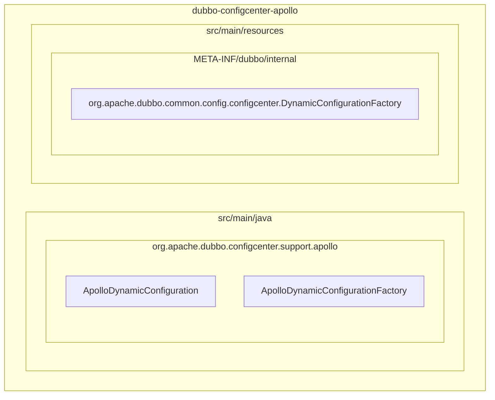
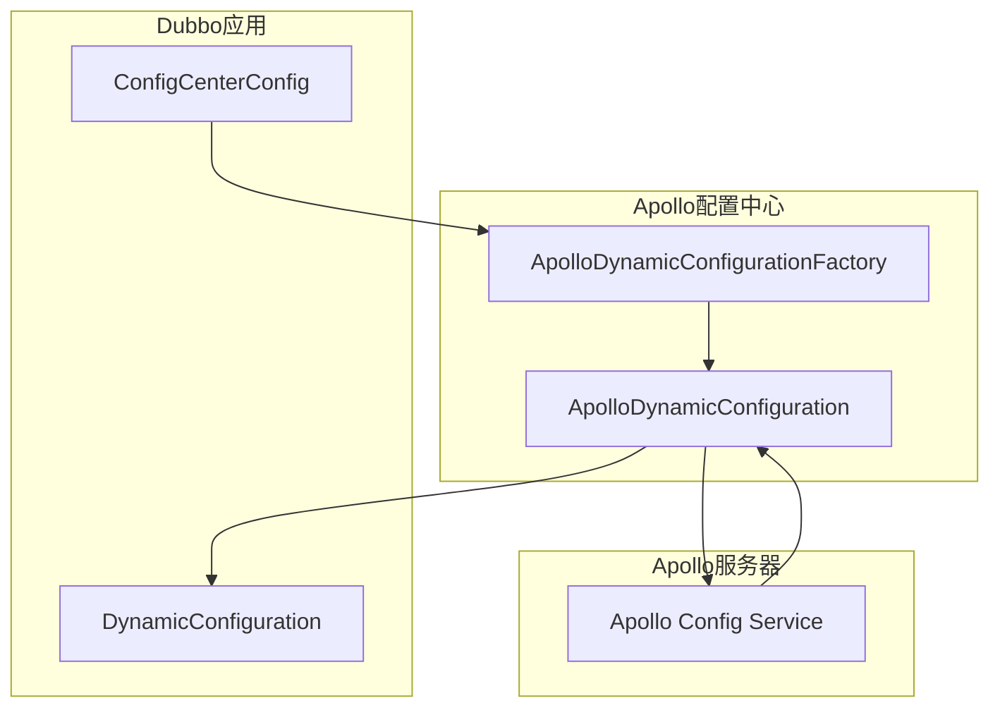
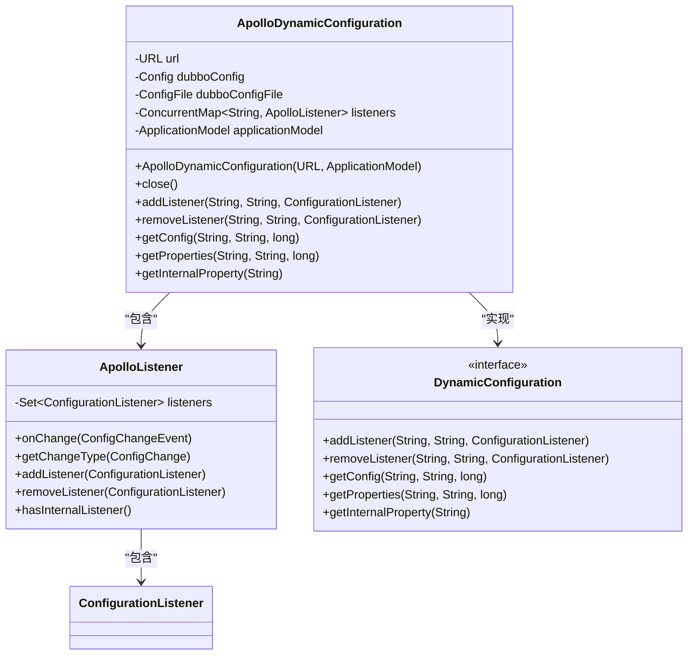
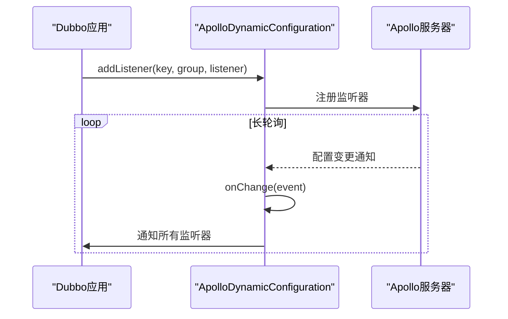
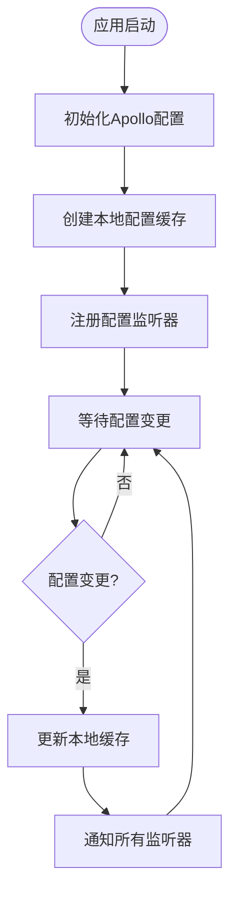
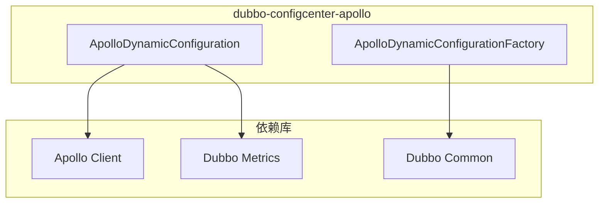

# Apollo配置中心

<cite>
**本文档引用的文件**  
- [ApolloDynamicConfiguration.java](file://dubbo-configcenter/dubbo-configcenter-apollo/src/main/java/org/apache/dubbo/configcenter/support/apollo/ApolloDynamicConfiguration.java)
- [ApolloDynamicConfigurationFactory.java](file://dubbo-configcenter/dubbo-configcenter-apollo/src/main/java/org/apache/dubbo/configcenter/support/apollo/ApolloDynamicConfigurationFactory.java)
- [DynamicConfiguration.java](file://dubbo-common/src/main/java/org/apache/dubbo/common/config/configcenter/DynamicConfiguration.java)
- [AbstractDynamicConfigurationFactory.java](file://dubbo-common/src/main/java/org/apache/dubbo/common/config/configcenter/AbstractDynamicConfigurationFactory.java)
- [ConfigCenterConfig.java](file://dubbo-common/src/main/java/org/apache/dubbo/config/ConfigCenterConfig.java)
- [application.yml](file://dubbo-demo/dubbo-demo-spring-boot/dubbo-demo-spring-boot-provider/src/main/resources/application.yml)
</cite>

## 目录
1. [简介](#简介)
2. [项目结构](#项目结构)
3. [核心组件](#核心组件)
4. [架构概述](#架构概述)
5. [详细组件分析](#详细组件分析)
6. [依赖分析](#依赖分析)
7. [性能考虑](#性能考虑)
8. [故障排除指南](#故障排除指南)
9. [结论](#结论)

## 简介
Apollo配置中心是Dubbo框架中用于集中管理配置的组件，它通过与携程Apollo配置服务集成，实现了配置的动态更新、灰度发布和多环境管理。本文档深入分析了Apollo配置中心的实现细节，包括长轮询机制、配置缓存更新策略和灰度发布支持。同时详细说明了Apollo命名空间、集群和环境的映射关系，以及权限控制、配置审计和发布历史查看功能的使用方法。为初学者提供了集成示例，为经验丰富的开发者提供了配置变更通知的精确控制方案，并涵盖了多数据中心部署模式和灾备方案。

## 项目结构
Apollo配置中心的实现位于dubbo-configcenter模块下的dubbo-configcenter-apollo子模块中，其主要结构包括核心实现类、工厂类和SPI配置文件。

**图表来源**  
- [ApolloDynamicConfiguration.java](file://dubbo-configcenter/dubbo-configcenter-apollo/src/main/java/org/apache/dubbo/configcenter/support/apollo/ApolloDynamicConfiguration.java)
- [ApolloDynamicConfigurationFactory.java](file://dubbo-configcenter/dubbo-configcenter-apollo/src/main/java/org/apache/dubbo/configcenter/support/apollo/ApolloDynamicConfigurationFactory.java)
- [org.apache.dubbo.common.config.configcenter.DynamicConfigurationFactory](file://dubbo-configcenter/dubbo-configcenter-apollo/src/main/resources/META-INF/dubbo/internal/org.apache.dubbo.common.config.configcenter.DynamicConfigurationFactory)

**章节来源**
- [ApolloDynamicConfiguration.java](file://dubbo-configcenter/dubbo-configcenter-apollo/src/main/java/org/apache/dubbo/configcenter/support/apollo/ApolloDynamicConfiguration.java)
- [ApolloDynamicConfigurationFactory.java](file://dubbo-configcenter/dubbo-configcenter-apollo/src/main/java/org/apache/dubbo/configcenter/support/apollo/ApolloDynamicConfigurationFactory.java)

## 核心组件
Apollo配置中心的核心组件包括ApolloDynamicConfiguration类和ApolloDynamicConfigurationFactory类。ApolloDynamicConfiguration实现了DynamicConfiguration接口，负责与Apollo配置服务的通信和配置管理。ApolloDynamicConfigurationFactory是工厂类，负责创建ApolloDynamicConfiguration实例。通过SPI机制，Dubbo框架可以动态加载Apollo配置中心的实现。

**章节来源**
- [ApolloDynamicConfiguration.java](file://dubbo-configcenter/dubbo-configcenter-apollo/src/main/java/org/apache/dubbo/configcenter/support/apollo/ApolloDynamicConfiguration.java)
- [ApolloDynamicConfigurationFactory.java](file://dubbo-configcenter/dubbo-configcenter-apollo/src/main/java/org/apache/dubbo/configcenter/support/apollo/ApolloDynamicConfigurationFactory.java)

## 架构概述
Apollo配置中心的架构基于Dubbo的扩展机制，通过SPI方式集成到Dubbo框架中。当Dubbo应用启动时，会根据配置加载相应的配置中心实现。Apollo配置中心通过长轮询机制与Apollo服务器保持连接，实时获取配置变更。配置变更通过监听器机制通知到Dubbo框架，实现配置的动态更新。

**图表来源**  
- [ApolloDynamicConfiguration.java](file://dubbo-configcenter/dubbo-configcenter-apollo/src/main/java/org/apache/dubbo/configcenter/support/apollo/ApolloDynamicConfiguration.java)
- [ApolloDynamicConfigurationFactory.java](file://dubbo-configcenter/dubbo-configcenter-apollo/src/main/java/org/apache/dubbo/configcenter/support/apollo/ApolloDynamicConfigurationFactory.java)
- [ConfigCenterConfig.java](file://dubbo-common/src/main/java/org/apache/dubbo/config/ConfigCenterConfig.java)

## 详细组件分析

### ApolloDynamicConfiguration分析
ApolloDynamicConfiguration是Apollo配置中心的核心实现类，它实现了DynamicConfiguration接口，提供了配置的获取、监听和更新功能。

#### 类图

**图表来源**  
- [ApolloDynamicConfiguration.java](file://dubbo-configcenter/dubbo-configcenter-apollo/src/main/java/org/apache/dubbo/configcenter/support/apollo/ApolloDynamicConfiguration.java)

**章节来源**
- [ApolloDynamicConfiguration.java](file://dubbo-configcenter/dubbo-configcenter-apollo/src/main/java/org/apache/dubbo/configcenter/support/apollo/ApolloDynamicConfiguration.java)

### 长轮询机制分析
Apollo配置中心通过Apollo客户端的长轮询机制实现配置的实时更新。当配置发生变化时，Apollo服务器会立即通知客户端，客户端通过监听器将变更事件传递给Dubbo框架。

**图表来源**  
- [ApolloDynamicConfiguration.java](file://dubbo-configcenter/dubbo-configcenter-apollo/src/main/java/org/apache/dubbo/configcenter/support/apollo/ApolloDynamicConfiguration.java)

**章节来源**
- [ApolloDynamicConfiguration.java](file://dubbo-configcenter/dubbo-configcenter-apollo/src/main/java/org/apache/dubbo/configcenter/support/apollo/ApolloDynamicConfiguration.java)

### 配置缓存更新策略
Apollo配置中心在本地维护配置缓存，当配置发生变化时，通过监听器机制更新缓存并通知相关组件。这种策略既保证了配置的实时性，又避免了频繁的远程调用。

**图表来源**  
- [ApolloDynamicConfiguration.java](file://dubbo-configcenter/dubbo-configcenter-apollo/src/main/java/org/apache/dubbo/configcenter/support/apollo/ApolloDynamicConfiguration.java)

**章节来源**
- [ApolloDynamicConfiguration.java](file://dubbo-configcenter/dubbo-configcenter-apollo/src/main/java/org/apache/dubbo/configcenter/support/apollo/ApolloDynamicConfiguration.java)

## 依赖分析
Apollo配置中心依赖于Apollo客户端库和Dubbo核心库，通过SPI机制与Dubbo框架集成。

**图表来源**  
- [pom.xml](file://dubbo-configcenter/dubbo-configcenter-apollo/pom.xml)
- [ApolloDynamicConfiguration.java](file://dubbo-configcenter/dubbo-configcenter-apollo/src/main/java/org/apache/dubbo/configcenter/support/apollo/ApolloDynamicConfiguration.java)
- [ApolloDynamicConfigurationFactory.java](file://dubbo-configcenter/dubbo-configcenter-apollo/src/main/java/org/apache/dubbo/configcenter/support/apollo/ApolloDynamicConfigurationFactory.java)

**章节来源**
- [pom.xml](file://dubbo-configcenter/dubbo-configcenter-apollo/pom.xml)

## 性能考虑
Apollo配置中心通过长轮询机制和本地缓存策略，在保证配置实时性的同时，最大限度地减少了网络开销。配置监听器的实现采用了线程安全的数据结构，确保了高并发场景下的性能表现。

## 故障排除指南
当Apollo配置中心无法正常工作时，可以检查以下方面：
1. 确认Apollo服务器地址和端口配置正确
2. 检查网络连接是否正常
3. 验证Apollo应用ID和命名空间配置是否正确
4. 查看日志中是否有连接失败或配置获取异常的记录

**章节来源**
- [ApolloDynamicConfiguration.java](file://dubbo-configcenter/dubbo-configcenter-apollo/src/main/java/org/apache/dubbo/configcenter/support/apollo/ApolloDynamicConfiguration.java)

## 结论
Apollo配置中心为Dubbo应用提供了强大的配置管理能力，通过与Apollo配置服务的深度集成，实现了配置的动态更新、灰度发布和多环境管理。其基于SPI的扩展机制和高效的长轮询策略，确保了配置管理的灵活性和性能表现。对于需要精细化配置管理的分布式应用，Apollo配置中心是一个理想的选择。