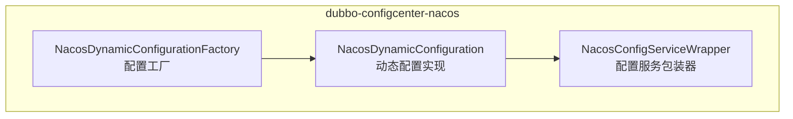
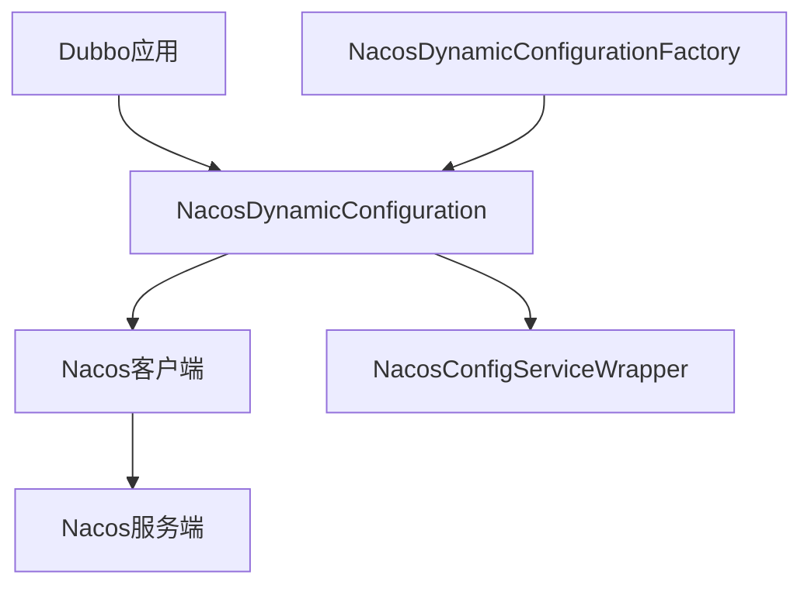
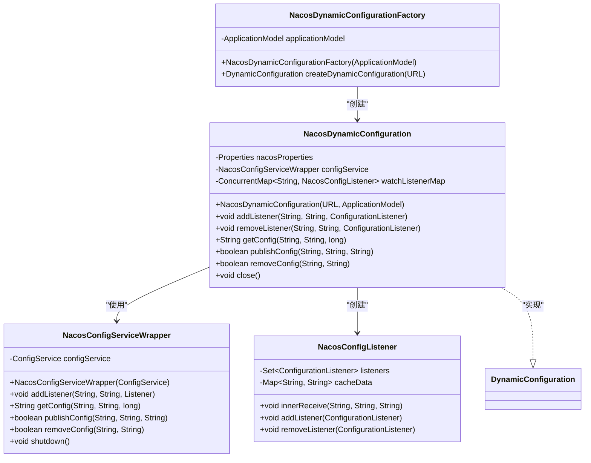
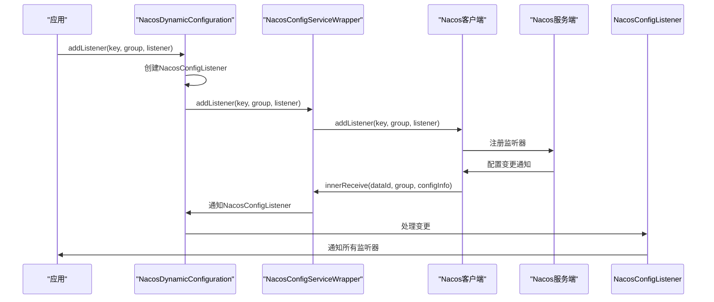
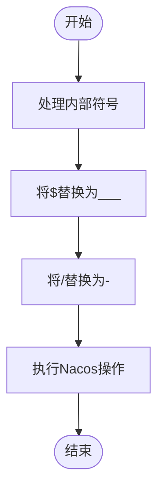
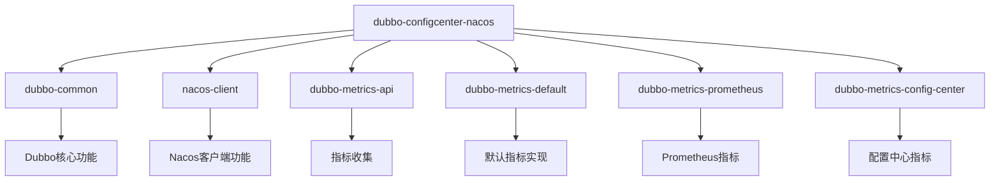

# Nacos配置中心

<cite>
**本文档中引用的文件**  
- [NacosDynamicConfiguration.java](file://dubbo-configcenter/dubbo-configcenter-nacos/src/main/java/org/apache/dubbo/configcenter/support/nacos/NacosDynamicConfiguration.java)
- [NacosConfigServiceWrapper.java](file://dubbo-configcenter/dubbo-configcenter-nacos/src/main/java/org/apache/dubbo/configcenter/support/nacos/NacosConfigServiceWrapper.java)
- [NacosDynamicConfigurationFactory.java](file://dubbo-configcenter/dubbo-configcenter-nacos/src/main/java/org/apache/dubbo/configcenter/support/nacos/NacosDynamicConfigurationFactory.java)
- [DynamicConfiguration.java](file://dubbo-common/src/main/java/org/apache/dubbo/common/config/configcenter/DynamicConfiguration.java)
- [NacosDynamicConfigurationTest.java](file://dubbo-configcenter/dubbo-configcenter-nacos/src/test/java/org/apache/dubbo/configcenter/support/nacos/NacosDynamicConfigurationTest.java)
- [pom.xml](file://dubbo-configcenter/dubbo-configcenter-nacos/pom.xml)
</cite>

## 目录
1. [简介](#简介)
2. [项目结构](#项目结构)
3. [核心组件](#核心组件)
4. [架构概述](#架构概述)
5. [详细组件分析](#详细组件分析)
6. [依赖分析](#依赖分析)
7. [性能考虑](#性能考虑)
8. [故障排除指南](#故障排除指南)
9. [结论](#结论)

## 简介
本文档详细介绍了Nacos配置中心在Dubbo框架中的实现，重点分析了NacosDynamicConfiguration类的实现细节，包括与Nacos服务端的连接管理、配置监听机制和心跳检测。文档详细说明了配置的命名空间、分组和数据ID的映射规则，提供了Nacos配置中心的初始化配置参数和最佳实践。同时展示了如何通过Nacos进行动态配置推送和批量配置管理，为初学者提供了快速入门示例，并为经验丰富的开发者提供了高并发场景下的性能调优建议。此外，文档还涵盖了Nacos配置中心的故障恢复机制和容错策略。

## 项目结构
Nacos配置中心的实现位于dubbo-configcenter模块下的dubbo-configcenter-nacos子模块中。该模块提供了Dubbo与Nacos配置中心的集成实现，主要包括NacosDynamicConfiguration、NacosConfigServiceWrapper和NacosDynamicConfigurationFactory三个核心类。

**图表来源**  
- [NacosDynamicConfiguration.java](file://dubbo-configcenter/dubbo-configcenter-nacos/src/main/java/org/apache/dubbo/configcenter/support/nacos/NacosDynamicConfiguration.java)
- [NacosConfigServiceWrapper.java](file://dubbo-configcenter/dubbo-configcenter-nacos/src/main/java/org/apache/dubbo/configcenter/support/nacos/NacosConfigServiceWrapper.java)
- [NacosDynamicConfigurationFactory.java](file://dubbo-configcenter/dubbo-configcenter-nacos/src/main/java/org/apache/dubbo/configcenter/support/nacos/NacosDynamicConfigurationFactory.java)

**章节来源**  
- [NacosDynamicConfiguration.java](file://dubbo-configcenter/dubbo-configcenter-nacos/src/main/java/org/apache/dubbo/configcenter/support/nacos/NacosDynamicConfiguration.java)
- [pom.xml](file://dubbo-configcenter/dubbo-configcenter-nacos/pom.xml)

## 核心组件
Nacos配置中心的核心组件包括NacosDynamicConfiguration、NacosConfigServiceWrapper和NacosDynamicConfigurationFactory。NacosDynamicConfiguration实现了DynamicConfiguration接口，提供了与Nacos配置中心交互的主要功能。NacosConfigServiceWrapper封装了Nacos客户端的ConfigService，提供了符号处理等额外功能。NacosDynamicConfigurationFactory负责创建NacosDynamicConfiguration实例。

**章节来源**  
- [NacosDynamicConfiguration.java](file://dubbo-configcenter/dubbo-configcenter-nacos/src/main/java/org/apache/dubbo/configcenter/support/nacos/NacosDynamicConfiguration.java)
- [NacosConfigServiceWrapper.java](file://dubbo-configcenter/dubbo-configcenter-nacos/src/main/java/org/apache/dubbo/configcenter/support/nacos/NacosConfigServiceWrapper.java)
- [NacosDynamicConfigurationFactory.java](file://dubbo-configcenter/dubbo-configcenter-nacos/src/main/java/org/apache/dubbo/configcenter/support/nacos/NacosDynamicConfigurationFactory.java)

## 架构概述
Nacos配置中心的架构基于Dubbo的动态配置抽象，通过NacosDynamicConfiguration实现与Nacos服务端的通信。架构分为三层：最上层是Dubbo应用，中间层是NacosDynamicConfiguration，底层是Nacos客户端。

**图表来源**  
- [NacosDynamicConfiguration.java](file://dubbo-configcenter/dubbo-configcenter-nacos/src/main/java/org/apache/dubbo/configcenter/support/nacos/NacosDynamicConfiguration.java)
- [NacosConfigServiceWrapper.java](file://dubbo-configcenter/dubbo-configcenter-nacos/src/main/java/org/apache/dubbo/configcenter/support/nacos/NacosConfigServiceWrapper.java)
- [NacosDynamicConfigurationFactory.java](file://dubbo-configcenter/dubbo-configcenter-nacos/src/main/java/org/apache/dubbo/configcenter/support/nacos/NacosDynamicConfigurationFactory.java)

## 详细组件分析

### NacosDynamicConfiguration分析
NacosDynamicConfiguration是Nacos配置中心的核心实现类，实现了DynamicConfiguration接口。该类负责管理与Nacos服务端的连接，处理配置的读取、写入和监听。

#### 类图

**图表来源**  
- [NacosDynamicConfiguration.java](file://dubbo-configcenter/dubbo-configcenter-nacos/src/main/java/org/apache/dubbo/configcenter/support/nacos/NacosDynamicConfiguration.java)
- [NacosConfigServiceWrapper.java](file://dubbo-configcenter/dubbo-configcenter-nacos/src/main/java/org/apache/dubbo/configcenter/support/nacos/NacosConfigServiceWrapper.java)
- [NacosDynamicConfigurationFactory.java](file://dubbo-configcenter/dubbo-configcenter-nacos/src/main/java/org/apache/dubbo/configcenter/support/nacos/NacosDynamicConfigurationFactory.java)

#### 配置监听序列图

**图表来源**  
- [NacosDynamicConfiguration.java](file://dubbo-configcenter/dubbo-configcenter-nacos/src/main/java/org/apache/dubbo/configcenter/support/nacos/NacosDynamicConfiguration.java)
- [NacosConfigServiceWrapper.java](file://dubbo-configcenter/dubbo-configcenter-nacos/src/main/java/org/apache/dubbo/configcenter/support/nacos/NacosConfigServiceWrapper.java)

**章节来源**  
- [NacosDynamicConfiguration.java](file://dubbo-configcenter/dubbo-configcenter-nacos/src/main/java/org/apache/dubbo/configcenter/support/nacos/NacosDynamicConfiguration.java)
- [NacosDynamicConfigurationTest.java](file://dubbo-configcenter/dubbo-configcenter-nacos/src/test/java/org/apache/dubbo/configcenter/support/nacos/NacosDynamicConfigurationTest.java)

### NacosConfigServiceWrapper分析
NacosConfigServiceWrapper是对Nacos客户端ConfigService的包装器，主要功能是处理内部符号的兼容性问题。

#### 流程图

**图表来源**  
- [NacosConfigServiceWrapper.java](file://dubbo-configcenter/dubbo-configcenter-nacos/src/main/java/org/apache/dubbo/configcenter/support/nacos/NacosConfigServiceWrapper.java)

**章节来源**  
- [NacosConfigServiceWrapper.java](file://dubbo-configcenter/dubbo-configcenter-nacos/src/main/java/org/apache/dubbo/configcenter/support/nacos/NacosConfigServiceWrapper.java)

## 依赖分析
Nacos配置中心的依赖关系清晰，主要依赖于Dubbo核心模块和Nacos客户端。

**图表来源**  
- [pom.xml](file://dubbo-configcenter/dubbo-configcenter-nacos/pom.xml)

**章节来源**  
- [pom.xml](file://dubbo-configcenter/dubbo-configcenter-nacos/pom.xml)

## 性能考虑
Nacos配置中心在设计时考虑了性能优化，包括连接池管理、配置缓存和异步监听等机制。默认的配置获取超时时间为5000毫秒，可以通过配置进行调整。在高并发场景下，建议合理设置连接重试次数和等待时间，避免对Nacos服务端造成过大压力。

## 故障排除指南
当Nacos配置中心出现问题时，可以按照以下步骤进行排查：
1. 检查Nacos服务端是否正常运行
2. 检查网络连接是否正常
3. 检查配置的地址、端口、命名空间等参数是否正确
4. 查看日志中的错误信息，特别是连接失败和配置获取失败的情况
5. 检查Nacos客户端版本与服务端版本的兼容性

**章节来源**  
- [NacosDynamicConfiguration.java](file://dubbo-configcenter/dubbo-configcenter-nacos/src/main/java/org/apache/dubbo/configcenter/support/nacos/NacosDynamicConfiguration.java)
- [NacosDynamicConfigurationTest.java](file://dubbo-configcenter/dubbo-configcenter-nacos/src/test/java/org/apache/dubbo/configcenter/support/nacos/NacosDynamicConfigurationTest.java)

## 结论
Nacos配置中心为Dubbo应用提供了强大的动态配置管理能力。通过NacosDynamicConfiguration的实现，Dubbo应用可以方便地与Nacos服务端进行交互，实现配置的动态更新和监听。该实现具有良好的扩展性和稳定性，能够满足大多数应用场景的需求。对于需要高可用和高性能的场景，建议结合具体的业务需求进行相应的调优和配置。