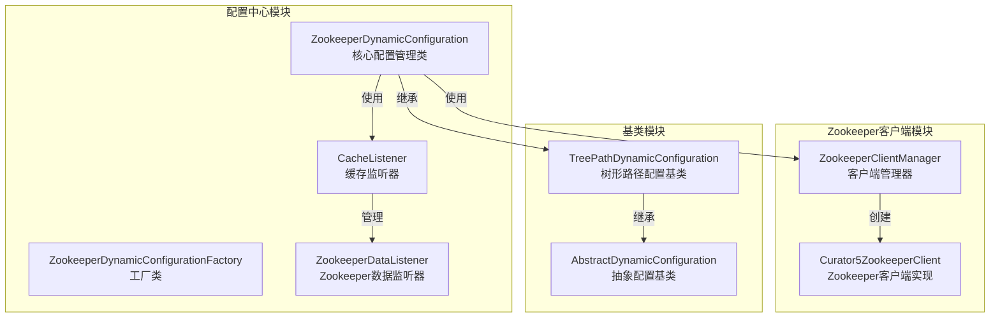
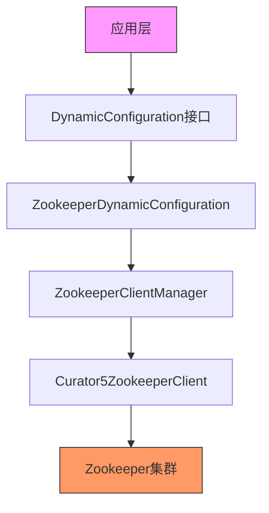
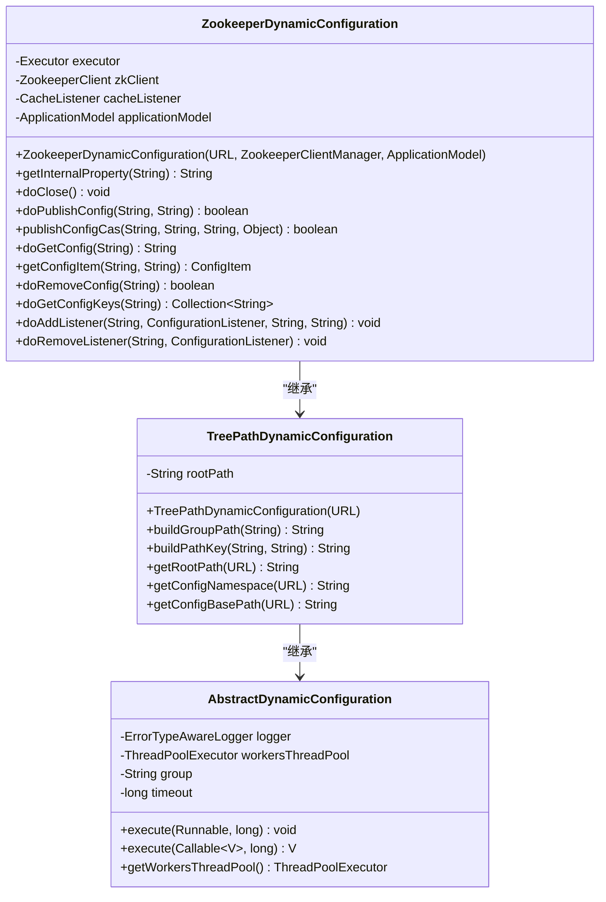
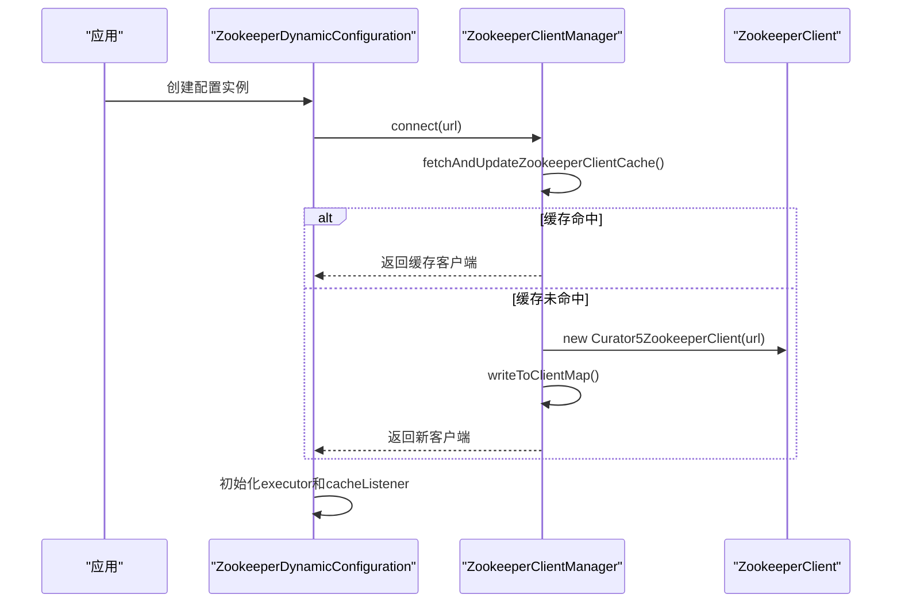
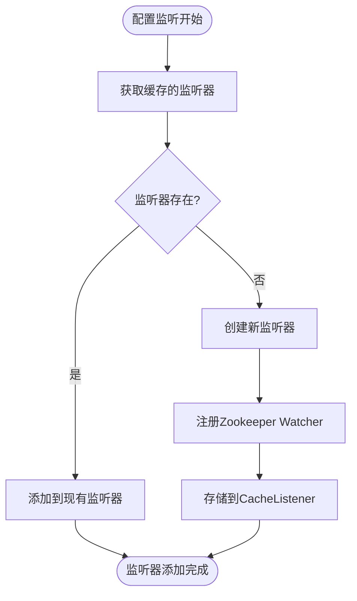
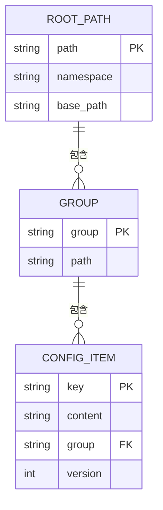
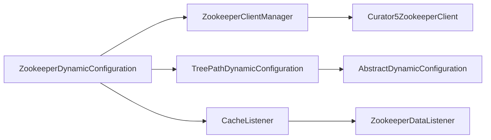
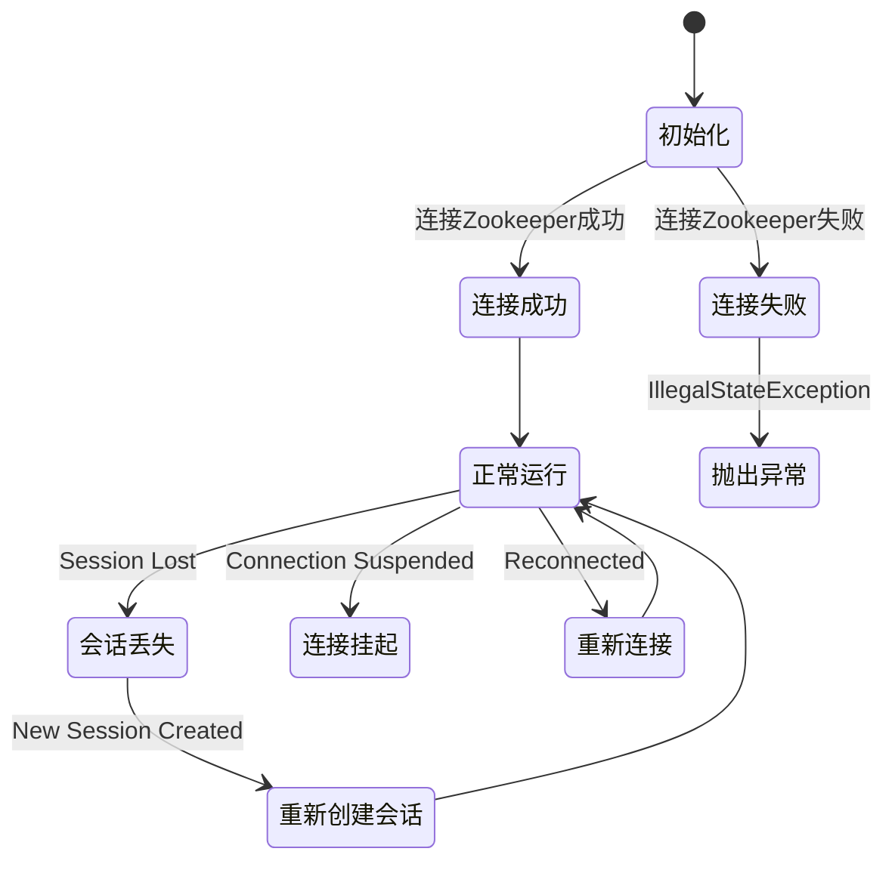

# Zookeeper配置中心

<cite>
**本文档引用的文件**  
- [ZookeeperDynamicConfiguration.java](file://dubbo-configcenter/dubbo-configcenter-zookeeper/src/main/java/org/apache/dubbo/configcenter/support/zookeeper/ZookeeperDynamicConfiguration.java)
- [ZookeeperDynamicConfigurationFactory.java](file://dubbo-configcenter/dubbo-configcenter-zookeeper/src/main/java/org/apache/dubbo/configcenter/support/zookeeper/ZookeeperDynamicConfigurationFactory.java)
- [ZookeeperDataListener.java](file://dubbo-configcenter/dubbo-configcenter-zookeeper/src/main/java/org/apache/dubbo/configcenter/support/zookeeper/ZookeeperDataListener.java)
- [CacheListener.java](file://dubbo-configcenter/dubbo-configcenter-zookeeper/src/main/java/org/apache/dubbo/configcenter/support/zookeeper/CacheListener.java)
- [TreePathDynamicConfiguration.java](file://dubbo-common/src/main/java/org/apache/dubbo/common/config/configcenter/TreePathDynamicConfiguration.java)
- [AbstractDynamicConfiguration.java](file://dubbo-common/src/main/java/org/apache/dubbo/common/config/configcenter/AbstractDynamicConfiguration.java)
- [ZookeeperClientManager.java](file://dubbo-remoting/dubbo-remoting-zookeeper-curator5/src/main/java/org/apache/dubbo/remoting/zookeeper/curator5/ZookeeperClientManager.java)
- [Curator5ZookeeperClient.java](file://dubbo-remoting/dubbo-remoting-zookeeper-curator5/src/main/java/org/apache/dubbo/remoting/zookeeper/curator5/Curator5ZookeeperClient.java)
- [ZookeeperDynamicConfigurationTest.java](file://dubbo-configcenter/dubbo-configcenter-zookeeper/src/test/java/org/apache/dubbo/configcenter/support/zookeeper/ZookeeperDynamicConfigurationTest.java)
</cite>

## 目录
1. [简介](#简介)
2. [项目结构](#项目结构)
3. [核心组件](#核心组件)
4. [架构概述](#架构概述)
5. [详细组件分析](#详细组件分析)
6. [依赖分析](#依赖分析)
7. [性能考虑](#性能考虑)
8. [故障排除指南](#故障排除指南)
9. [结论](#结论)

## 简介
Zookeeper配置中心是Dubbo框架中用于集中管理分布式系统配置的核心组件。它基于Apache Zookeeper实现，提供了高可用、强一致性的配置存储和动态更新能力。本文档深入分析ZookeeperDynamicConfiguration类的实现机制，包括会话管理、Watcher监听、节点路径组织等核心功能，同时详细说明配置存储结构、连接重试策略、会话失效处理、性能监控指标以及最佳实践。

## 项目结构
Zookeeper配置中心的代码结构遵循模块化设计原则，主要包含配置中心支持、Zookeeper客户端实现和测试验证三个部分。核心实现位于dubbo-configcenter-zookeeper模块中，通过SPI机制与Dubbo框架集成。

**图表来源**
- [ZookeeperDynamicConfiguration.java](file://dubbo-configcenter/dubbo-configcenter-zookeeper/src/main/java/org/apache/dubbo/configcenter/support/zookeeper/ZookeeperDynamicConfiguration.java)
- [ZookeeperClientManager.java](file://dubbo-remoting/dubbo-remoting-zookeeper-curator5/src/main/java/org/apache/dubbo/remoting/zookeeper/curator5/ZookeeperClientManager.java)
- [TreePathDynamicConfiguration.java](file://dubbo-common/src/main/java/org/apache/dubbo/common/config/configcenter/TreePathDynamicConfiguration.java)

**章节来源**
- [ZookeeperDynamicConfiguration.java](file://dubbo-configcenter/dubbo-configcenter-zookeeper/src/main/java/org/apache/dubbo/configcenter/support/zookeeper/ZookeeperDynamicConfiguration.java)
- [ZookeeperClientManager.java](file://dubbo-remoting/dubbo-remoting-zookeeper-curator5/src/main/java/org/apache/dubbo/remoting/zookeeper/curator5/ZookeeperClientManager.java)

## 核心组件
Zookeeper配置中心的核心组件包括ZookeeperDynamicConfiguration、ZookeeperClientManager和ZookeeperDataListener。ZookeeperDynamicConfiguration作为主要入口，实现了DynamicConfiguration接口，提供配置的读取、发布、监听等核心功能。ZookeeperClientManager负责Zookeeper客户端的生命周期管理，实现连接池和会话复用。ZookeeperDataListener处理Zookeeper的Watcher事件，将Zookeeper的变更事件转换为Dubbo的配置变更事件。

**章节来源**
- [ZookeeperDynamicConfiguration.java](file://dubbo-configcenter/dubbo-configcenter-zookeeper/src/main/java/org/apache/dubbo/configcenter/support/zookeeper/ZookeeperDynamicConfiguration.java)
- [ZookeeperClientManager.java](file://dubbo-remoting/dubbo-remoting-zookeeper-curator5/src/main/java/org/apache/dubbo/remoting/zookeeper/curator5/ZookeeperClientManager.java)
- [ZookeeperDataListener.java](file://dubbo-configcenter/dubbo-configcenter-zookeeper/src/main/java/org/apache/dubbo/configcenter/support/zookeeper/ZookeeperDataListener.java)

## 架构概述
Zookeeper配置中心采用分层架构设计，从上到下分为接口层、实现层、客户端层和Zookeeper服务层。接口层定义了DynamicConfiguration接口，实现层提供Zookeeper-specific的实现，客户端层封装Zookeeper的Curator客户端，服务层是Zookeeper集群本身。

**图表来源**
- [ZookeeperDynamicConfiguration.java](file://dubbo-configcenter/dubbo-configcenter-zookeeper/src/main/java/org/apache/dubbo/configcenter/support/zookeeper/ZookeeperDynamicConfiguration.java)
- [ZookeeperClientManager.java](file://dubbo-remoting/dubbo-remoting-zookeeper-curator5/src/main/java/org/apache/dubbo/remoting/zookeeper/curator5/ZookeeperClientManager.java)

## 详细组件分析

### ZookeeperDynamicConfiguration分析
ZookeeperDynamicConfiguration是Zookeeper配置中心的核心实现类，负责与Zookeeper交互的所有操作。它通过继承TreePathDynamicConfiguration基类，实现了基于树形路径的配置管理。

#### 类结构分析

**图表来源**
- [ZookeeperDynamicConfiguration.java](file://dubbo-configcenter/dubbo-configcenter-zookeeper/src/main/java/org/apache/dubbo/configcenter/support/zookeeper/ZookeeperDynamicConfiguration.java)
- [TreePathDynamicConfiguration.java](file://dubbo-common/src/main/java/org/apache/dubbo/common/config/configcenter/TreePathDynamicConfiguration.java)
- [AbstractDynamicConfiguration.java](file://dubbo-common/src/main/java/org/apache/dubbo/common/config/configcenter/AbstractDynamicConfiguration.java)

#### 会话管理机制
ZookeeperDynamicConfiguration通过ZookeeperClientManager获取Zookeeper客户端实例，实现了会话的统一管理和复用。ZookeeperClientManager使用ConcurrentHashMap缓存客户端连接，避免创建过多连接。

**图表来源**
- [ZookeeperDynamicConfiguration.java](file://dubbo-configcenter/dubbo-configcenter-zookeeper/src/main/java/org/apache/dubbo/configcenter/support/zookeeper/ZookeeperDynamicConfiguration.java)
- [ZookeeperClientManager.java](file://dubbo-remoting/dubbo-remoting-zookeeper-curator5/src/main/java/org/apache/dubbo/remoting/zookeeper/curator5/ZookeeperClientManager.java)

#### Watcher监听机制
Zookeeper配置中心通过CacheListener和ZookeeperDataListener实现高效的Watcher管理。CacheListener作为缓存层，避免重复注册相同的Watcher。

**图表来源**
- [CacheListener.java](file://dubbo-configcenter/dubbo-configcenter-zookeeper/src/main/java/org/apache/dubbo/configcenter/support/zookeeper/CacheListener.java)
- [ZookeeperDataListener.java](file://dubbo-configcenter/dubbo-configcenter-zookeeper/src/main/java/org/apache/dubbo/configcenter/support/zookeeper/ZookeeperDataListener.java)

**章节来源**
- [ZookeeperDynamicConfiguration.java](file://dubbo-configcenter/dubbo-configcenter-zookeeper/src/main/java/org/apache/dubbo/configcenter/support/zookeeper/ZookeeperDynamicConfiguration.java)
- [CacheListener.java](file://dubbo-configcenter/dubbo-configcenter-zookeeper/src/main/java/org/apache/dubbo/configcenter/support/zookeeper/CacheListener.java)

### 配置存储结构
Zookeeper配置中心采用树形层级结构组织配置数据，根路径由namespace和base path组成。

**章节来源**
- [TreePathDynamicConfiguration.java](file://dubbo-common/src/main/java/org/apache/dubbo/common/config/configcenter/TreePathDynamicConfiguration.java)
- [ZookeeperDynamicConfiguration.java](file://dubbo-configcenter/dubbo-configcenter-zookeeper/src/main/java/org/apache/dubbo/configcenter/support/zookeeper/ZookeeperDynamicConfiguration.java)

## 依赖分析
Zookeeper配置中心的依赖关系清晰，主要依赖Zookeeper客户端模块和公共配置模块。

**图表来源**
- [ZookeeperDynamicConfiguration.java](file://dubbo-configcenter/dubbo-configcenter-zookeeper/src/main/java/org/apache/dubbo/configcenter/support/zookeeper/ZookeeperDynamicConfiguration.java)
- [ZookeeperClientManager.java](file://dubbo-remoting/dubbo-remoting-zookeeper-curator5/src/main/java/org/apache/dubbo/remoting/zookeeper/curator5/ZookeeperClientManager.java)

## 性能考虑
Zookeeper配置中心在性能方面进行了多项优化：

1. **连接复用**：通过ZookeeperClientManager实现客户端连接池，避免频繁创建和销毁连接。
2. **线程池管理**：为Watcher事件处理创建专用线程池，避免阻塞Zookeeper客户端线程。
3. **缓存优化**：CacheListener缓存已注册的Watcher，避免重复注册。
4. **批量操作**：支持批量获取配置项，减少网络往返次数。

**章节来源**
- [ZookeeperDynamicConfiguration.java](file://dubbo-configcenter/dubbo-configcenter-zookeeper/src/main/java/org/apache/dubbo/configcenter/support/zookeeper/ZookeeperDynamicConfiguration.java)
- [ZookeeperClientManager.java](file://dubbo-remoting/dubbo-remoting-zookeeper-curator5/src/main/java/org/apache/dubbo/remoting/zookeeper/curator5/ZookeeperClientManager.java)

## 故障排除指南
Zookeeper配置中心提供了完善的错误处理和日志记录机制。

**章节来源**
- [Curator5ZookeeperClient.java](file://dubbo-remoting/dubbo-remoting-zookeeper-curator5/src/main/java/org/apache/dubbo/remoting/zookeeper/curator5/Curator5ZookeeperClient.java)
- [ZookeeperDynamicConfiguration.java](file://dubbo-configcenter/dubbo-configcenter-zookeeper/src/main/java/org/apache/dubbo/configcenter/support/zookeeper/ZookeeperDynamicConfiguration.java)

## 结论
Zookeeper配置中心通过精心设计的架构和实现，提供了稳定可靠的配置管理服务。其核心优势包括：
- 基于Zookeeper的强一致性保证
- 高效的Watcher事件处理机制
- 完善的会话管理和重连策略
- 清晰的分层架构和模块化设计
- 丰富的性能优化措施

对于初学者，建议从简单的配置读写开始，逐步理解Watcher机制；对于经验丰富的开发者，在大规模集群场景下应重点关注连接复用和线程池调优，以确保系统的稳定性和性能。