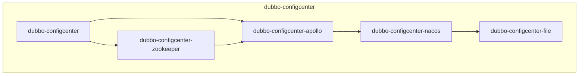
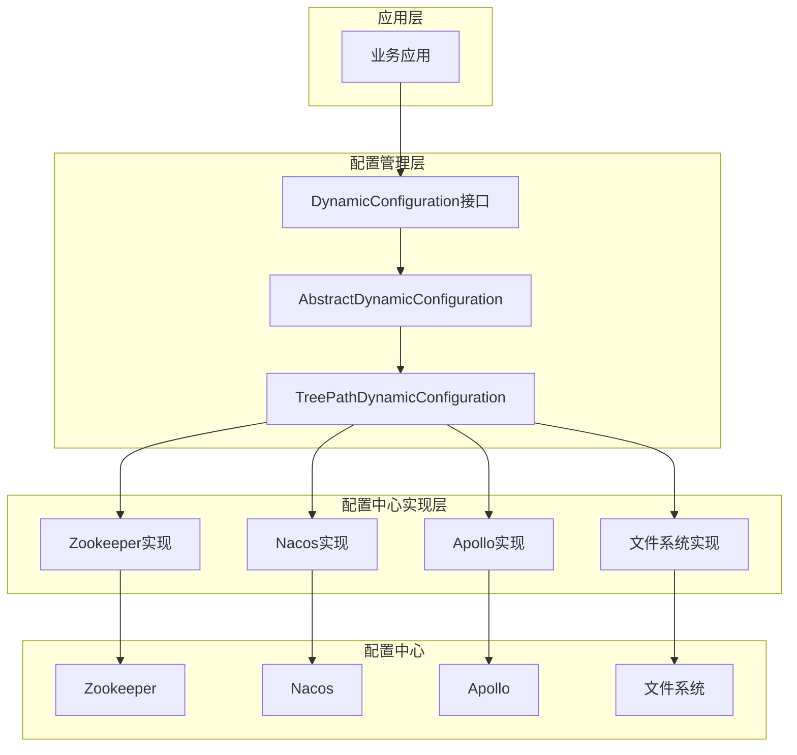
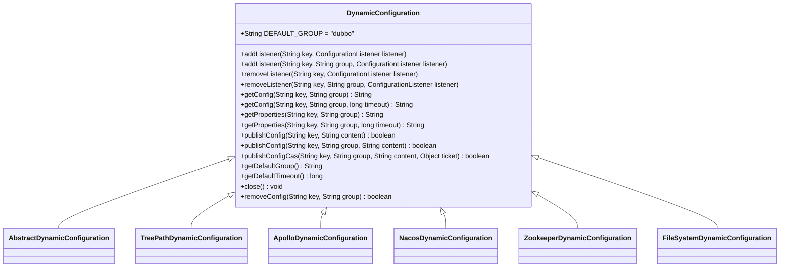
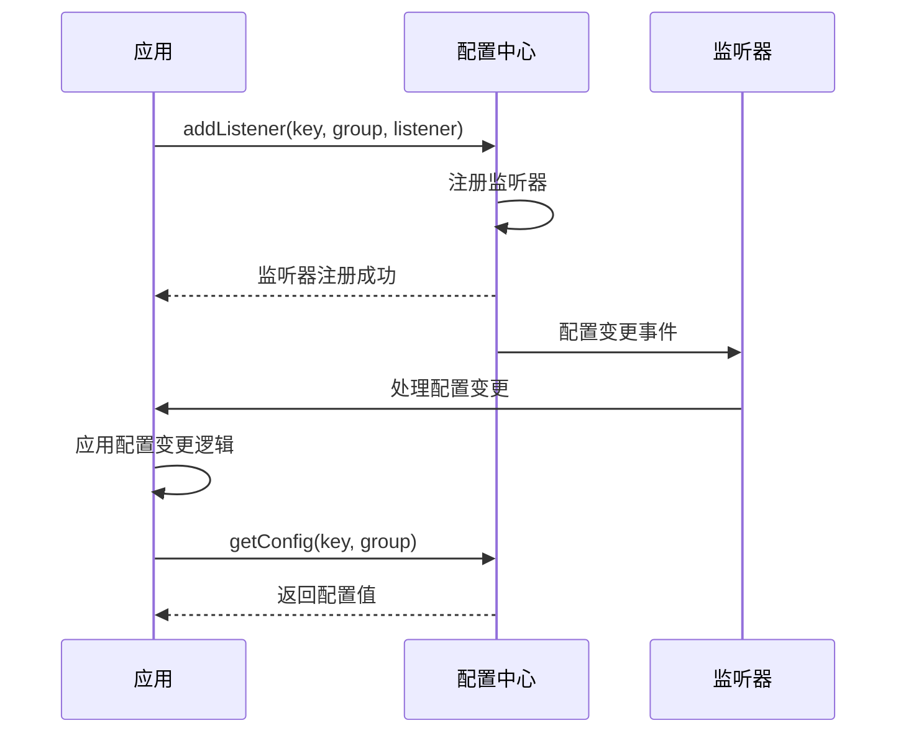
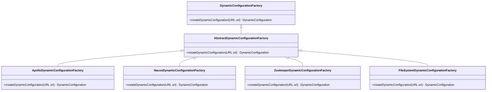
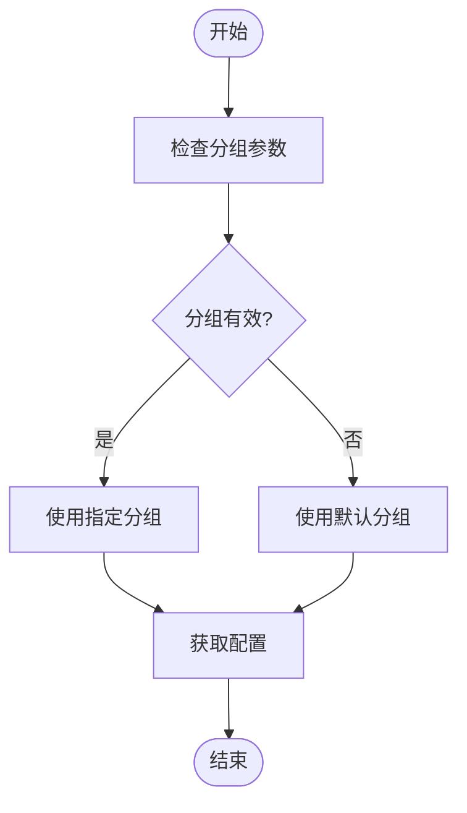
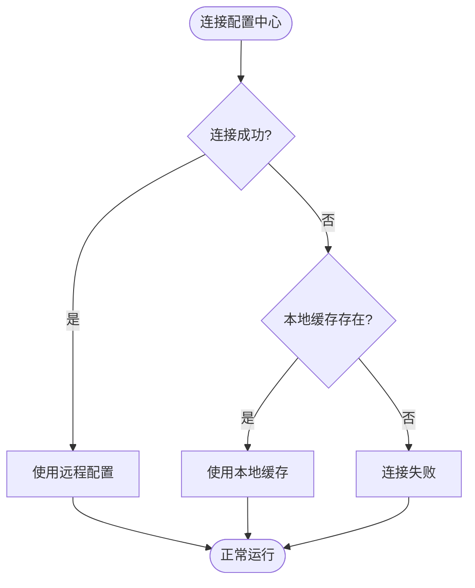
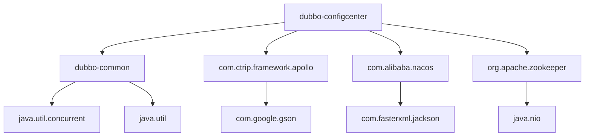

# dubbo-configcenter模块

<cite>
**本文档引用的文件**
- [DynamicConfiguration.java](file://dubbo-common\src\main\java\org\apache\dubbo\common\config\configcenter\DynamicConfiguration.java)
- [ApolloDynamicConfiguration.java](file://dubbo-configcenter\dubbo-configcenter-apollo\src\main\java\org\apache\dubbo\configcenter\support\apollo\ApolloDynamicConfiguration.java)
- [NacosDynamicConfiguration.java](file://dubbo-configcenter\dubbo-configcenter-nacos\src\main\java\org\apache\dubbo\configcenter\support\nacos\NacosDynamicConfiguration.java)
- [ZookeeperDynamicConfiguration.java](file://dubbo-configcenter\dubbo-configcenter-zookeeper\src\main\java\org\apache\dubbo\configcenter\support\zookeeper\ZookeeperDynamicConfiguration.java)
- [FileSystemDynamicConfiguration.java](file://dubbo-configcenter\dubbo-configcenter-file\src\main\java\org\apache\dubbo\common\config\configcenter\file\FileSystemDynamicConfiguration.java)
- [ApolloDynamicConfigurationFactory.java](file://dubbo-configcenter\dubbo-configcenter-apollo\src\main\java\org\apache\dubbo\configcenter\support\apollo\ApolloDynamicConfigurationFactory.java)
- [NacosDynamicConfigurationFactory.java](file://dubbo-configcenter\dubbo-configcenter-nacos\src\main\java\org\apache\dubbo\configcenter\support\nacos\NacosDynamicConfigurationFactory.java)
- [ZookeeperDynamicConfigurationFactory.java](file://dubbo-configcenter\dubbo-configcenter-zookeeper\src\main\java\org\apache\dubbo\configcenter\support\zookeeper\ZookeeperDynamicConfigurationFactory.java)
- [FileSystemDynamicConfigurationFactory.java](file://dubbo-configcenter\dubbo-configcenter-file\src\main\java\org\apache\dubbo\common\config\configcenter\file\FileSystemDynamicConfigurationFactory.java)
</cite>

## 目录
1. [简介](#简介)
2. [项目结构](#项目结构)
3. [核心组件](#核心组件)
4. [架构概述](#架构概述)
5. [详细组件分析](#详细组件分析)
6. [依赖分析](#依赖分析)
7. [性能考虑](#性能考虑)
8. [故障排除指南](#故障排除指南)
9. [结论](#结论)

## 简介
dubbo-configcenter模块是Dubbo框架中负责动态配置管理的核心组件。该模块提供了统一的接口和实现，支持多种配置中心（如Nacos、Zookeeper、Apollo等），实现了配置的获取、监听和更新机制。通过动态配置能力，Dubbo应用可以在运行时动态调整服务治理规则、参数配置等，而无需重启服务。该模块还提供了本地缓存和容错机制，确保在配置中心不可用时系统仍能正常运行。

## 项目结构
dubbo-configcenter模块采用多模块结构，每个子模块对应一种配置中心的实现。这种设计遵循了开闭原则，便于扩展新的配置中心支持。

**图表来源**
- [pom.xml](file://dubbo-configcenter\pom.xml#L31-L36)

**章节来源**
- [pom.xml](file://dubbo-configcenter\pom.xml#L1-L42)

## 核心组件

dubbo-configcenter模块的核心是DynamicConfiguration接口，它定义了动态配置的基本操作。该接口提供了配置的获取、监听、发布和删除等方法，为上层应用提供了统一的配置管理API。各个配置中心的实现类都继承了这个接口，提供了具体的实现。

**章节来源**
- [DynamicConfiguration.java](file://dubbo-common\src\main\java\org\apache\dubbo\common\config\configcenter\DynamicConfiguration.java#L36-L225)

## 架构概述

dubbo-configcenter模块采用分层架构设计，将配置管理的核心逻辑与具体配置中心的实现分离。这种设计提高了代码的可维护性和可扩展性。

**图表来源**
- [DynamicConfiguration.java](file://dubbo-common\src\main\java\org\apache\dubbo\common\config\configcenter\DynamicConfiguration.java#L36-L225)
- [ZookeeperDynamicConfiguration.java](file://dubbo-configcenter\dubbo-configcenter-zookeeper\src\main\java\org\apache\dubbo\configcenter\support\zookeeper\ZookeeperDynamicConfiguration.java#L42-L177)
- [NacosDynamicConfiguration.java](file://dubbo-configcenter\dubbo-configcenter-nacos\src\main\java\org\apache\dubbo\configcenter\support\nacos\NacosDynamicConfiguration.java#L63-L397)
- [ApolloDynamicConfiguration.java](file://dubbo-configcenter\dubbo-configcenter-apollo\src\main\java\org\apache\dubbo\configcenter\support\apollo\ApolloDynamicConfiguration.java#L76-L303)
- [FileSystemDynamicConfiguration.java](file://dubbo-configcenter\dubbo-configcenter-file\src\main\java\org\apache\dubbo\common\config\configcenter\file\FileSystemDynamicConfiguration.java#L82-L650)

## 详细组件分析

### DynamicConfiguration接口分析
DynamicConfiguration接口是dubbo-configcenter模块的核心，定义了动态配置管理的基本操作。该接口继承自Configuration和AutoCloseable接口，提供了配置的获取、监听、发布和删除等方法。

**图表来源**
- [DynamicConfiguration.java](file://dubbo-common\src\main\java\org\apache\dubbo\common\config\configcenter\DynamicConfiguration.java#L36-L225)

**章节来源**
- [DynamicConfiguration.java](file://dubbo-common\src\main\java\org\apache\dubbo\common\config\configcenter\DynamicConfiguration.java#L36-L225)

### 配置获取与监听机制
dubbo-configcenter模块提供了灵活的配置获取和监听机制。应用可以通过getConfig方法获取单个配置项，通过getProperties方法获取整个配置文件。同时，通过addListener方法可以注册配置监听器，在配置发生变化时收到通知。

**图表来源**
- [DynamicConfiguration.java](file://dubbo-common\src\main\java\org\apache\dubbo\common\config\configcenter\DynamicConfiguration.java#L36-L225)
- [NacosDynamicConfiguration.java](file://dubbo-configcenter\dubbo-configcenter-nacos\src\main\java\org\apache\dubbo\configcenter\support\nacos\NacosDynamicConfiguration.java#L226-L265)
- [ApolloDynamicConfiguration.java](file://dubbo-configcenter\dubbo-configcenter-apollo\src\main\java\org\apache\dubbo\configcenter\support\apollo\ApolloDynamicConfiguration.java#L169-L186)

**章节来源**
- [DynamicConfiguration.java](file://dubbo-common\src\main\java\org\apache\dubbo\common\config\configcenter\DynamicConfiguration.java#L36-L225)

### 多配置中心支持
dubbo-configcenter模块通过工厂模式支持多种配置中心。每种配置中心都有对应的工厂类和实现类，通过SPI机制进行扩展。

**图表来源**
- [ApolloDynamicConfigurationFactory.java](file://dubbo-configcenter\dubbo-configcenter-apollo\src\main\java\org\apache\dubbo\configcenter\support\apollo\ApolloDynamicConfigurationFactory.java#L24-L36)
- [NacosDynamicConfigurationFactory.java](file://dubbo-configcenter\dubbo-configcenter-nacos\src\main\java\org\apache\dubbo\configcenter\support\nacos\NacosDynamicConfigurationFactory.java#L30-L47)
- [ZookeeperDynamicConfigurationFactory.java](file://dubbo-configcenter\dubbo-configcenter-zookeeper\src\main\java\org\apache\dubbo\configcenter\support\zookeeper\ZookeeperDynamicConfigurationFactory.java#L25-L40)
- [FileSystemDynamicConfigurationFactory.java](file://dubbo-configcenter\dubbo-configcenter-file\src\main\java\org\apache\dubbo\common\config\configcenter\file\FileSystemDynamicConfigurationFactory.java#L29-L35)

**章节来源**
- [ApolloDynamicConfigurationFactory.java](file://dubbo-configcenter\dubbo-configcenter-apollo\src\main\java\org\apache\dubbo\configcenter\support\apollo\ApolloDynamicConfigurationFactory.java#L24-L36)
- [NacosDynamicConfigurationFactory.java](file://dubbo-configcenter\dubbo-configcenter-nacos\src\main\java\org\apache\dubbo\configcenter\support\nacos\NacosDynamicConfigurationFactory.java#L30-L47)
- [ZookeeperDynamicConfigurationFactory.java](file://dubbo-configcenter\dubbo-configcenter-zookeeper\src\main\java\org\apache\dubbo\configcenter\support\zookeeper\ZookeeperDynamicConfigurationFactory.java#L25-L40)
- [FileSystemDynamicConfigurationFactory.java](file://dubbo-configcenter\dubbo-configcenter-file\src\main\java\org\apache\dubbo\common\config\configcenter\file\FileSystemDynamicConfigurationFactory.java#L29-L35)

### 配置分组与命名空间管理
dubbo-configcenter模块通过分组和命名空间机制对配置进行组织管理。默认分组为"dubbo"，可以通过getDefaultGroup()方法获取。不同配置中心对分组和命名空间的处理方式有所不同。

**图表来源**
- [DynamicConfiguration.java](file://dubbo-common\src\main\java\org\apache\dubbo\common\config\configcenter\DynamicConfiguration.java#L38-L184)
- [NacosDynamicConfiguration.java](file://dubbo-configcenter\dubbo-configcenter-nacos\src\main\java\org\apache\dubbo\configcenter\support\nacos\NacosDynamicConfiguration.java#L257-L259)
- [ApolloDynamicConfiguration.java](file://dubbo-configcenter\dubbo-configcenter-apollo\src\main\java\org\apache\dubbo\configcenter\support\apollo\ApolloDynamicConfiguration.java#L112-L114)

**章节来源**
- [DynamicConfiguration.java](file://dubbo-common\src\main\java\org\apache\dubbo\common\config\configcenter\DynamicConfiguration.java#L38-L184)

### 本地缓存与容错机制
dubbo-configcenter模块提供了本地缓存和容错机制，确保在配置中心不可用时系统仍能正常运行。当无法连接到配置中心时，系统会使用本地缓存的配置值。

**图表来源**
- [ApolloDynamicConfiguration.java](file://dubbo-configcenter\dubbo-configcenter-apollo\src\main\java\org\apache\dubbo\configcenter\support\apollo\ApolloDynamicConfiguration.java#L119-L133)
- [NacosDynamicConfiguration.java](file://dubbo-configcenter\dubbo-configcenter-nacos\src\main\java\org\apache\dubbo\configcenter\support\nacos\NacosDynamicConfiguration.java#L108-L149)
- [ZookeeperDynamicConfiguration.java](file://dubbo-configcenter\dubbo-configcenter-zookeeper\src\main\java\org\apache\dubbo\configcenter\support\zookeeper\ZookeeperDynamicConfiguration.java#L71-L87)

**章节来源**
- [ApolloDynamicConfiguration.java](file://dubbo-configcenter\dubbo-configcenter-apollo\src\main\java\org\apache\dubbo\configcenter\support\apollo\ApolloDynamicConfiguration.java#L119-L133)
- [NacosDynamicConfiguration.java](file://dubbo-configcenter\dubbo-configcenter-nacos\src\main\java\org\apache\dubbo\configcenter\support\nacos\NacosDynamicConfiguration.java#L108-L149)
- [ZookeeperDynamicConfiguration.java](file://dubbo-configcenter\dubbo-configcenter-zookeeper\src\main\java\org\apache\dubbo\configcenter\support\zookeeper\ZookeeperDynamicConfiguration.java#L71-L87)

## 依赖分析

dubbo-configcenter模块依赖于dubbo-common模块中的基础类和接口，同时依赖于各个配置中心的客户端库。

**图表来源**
- [pom.xml](file://dubbo-configcenter\pom.xml#L31-L36)
- [ApolloDynamicConfiguration.java](file://dubbo-configcenter\dubbo-configcenter-apollo\src\main\java\org\apache\dubbo\configcenter\support\apollo\ApolloDynamicConfiguration.java#L41-L49)
- [NacosDynamicConfiguration.java](file://dubbo-configcenter\dubbo-configcenter-nacos\src\main\java\org\apache\dubbo\configcenter\support\nacos\NacosDynamicConfiguration.java#L43-L48)
- [ZookeeperDynamicConfiguration.java](file://dubbo-configcenter\dubbo-configcenter-zookeeper\src\main\java\org\apache\dubbo\configcenter\support\zookeeper\ZookeeperDynamicConfiguration.java#L37-L38)

**章节来源**
- [pom.xml](file://dubbo-configcenter\pom.xml#L1-L42)

## 性能考虑

dubbo-configcenter模块在设计时充分考虑了性能因素。通过异步监听、本地缓存、连接池等机制，确保配置管理不会成为系统性能瓶颈。对于高并发场景，建议合理设置监听器和缓存策略，避免频繁的配置查询操作。

## 故障排除指南

当遇到配置中心连接问题时，可以按照以下步骤进行排查：
1. 检查配置中心服务是否正常运行
2. 检查网络连接是否正常
3. 检查配置中心地址和端口是否正确
4. 检查认证信息是否正确
5. 查看日志中的错误信息

**章节来源**
- [ApolloDynamicConfiguration.java](file://dubbo-configcenter\dubbo-configcenter-apollo\src\main\java\org\apache\dubbo\configcenter\support\apollo\ApolloDynamicConfiguration.java#L119-L133)
- [NacosDynamicConfiguration.java](file://dubbo-configcenter\dubbo-configcenter-nacos\src\main\java\org\apache\dubbo\configcenter\support\nacos\NacosDynamicConfiguration.java#L108-L149)
- [ZookeeperDynamicConfiguration.java](file://dubbo-configcenter\dubbo-configcenter-zookeeper\src\main\java\org\apache\dubbo\configcenter\support\zookeeper\ZookeeperDynamicConfiguration.java#L71-L87)

## 结论

dubbo-configcenter模块为Dubbo框架提供了强大的动态配置管理能力。通过统一的接口设计和灵活的实现机制，支持多种配置中心，满足了不同场景下的配置管理需求。该模块的本地缓存和容错机制确保了系统的高可用性，而异步监听和高效的数据结构则保证了良好的性能表现。对于开发者来说，该模块提供了简单易用的API，同时保留了足够的扩展性，可以根据具体需求进行定制和优化。