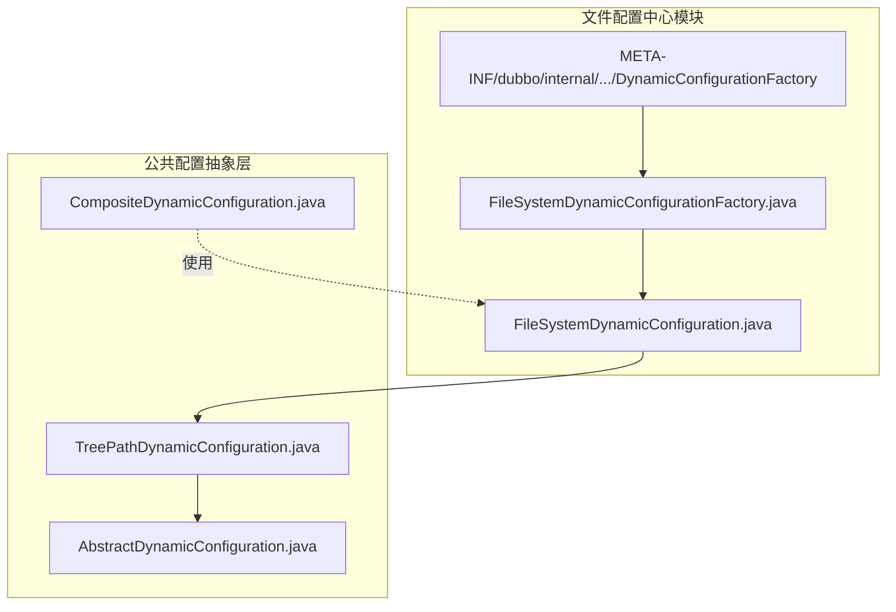
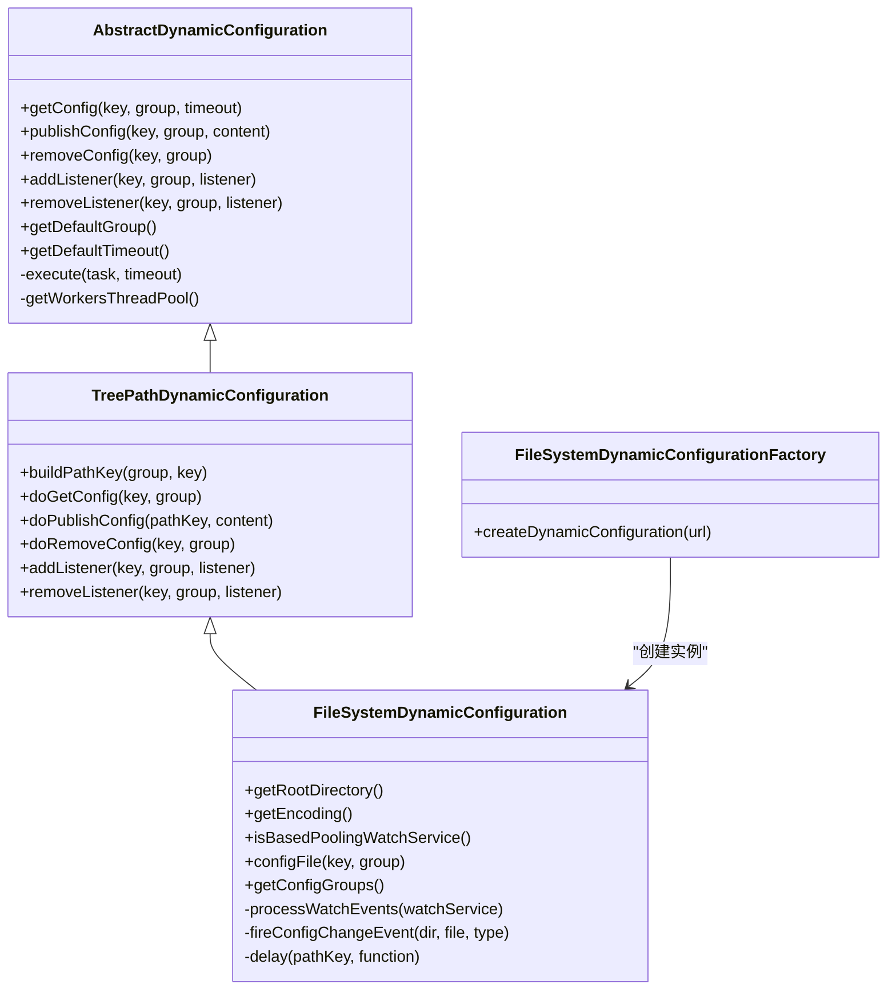
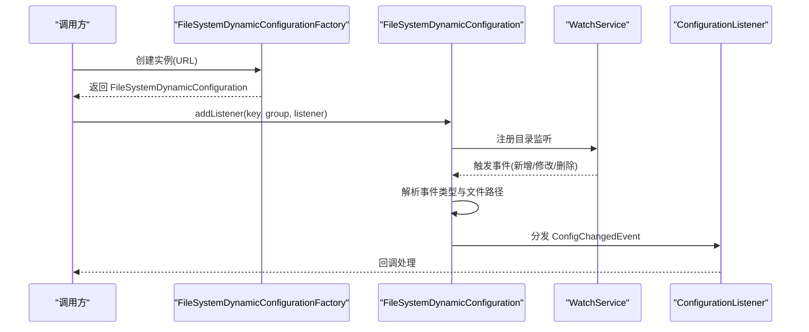
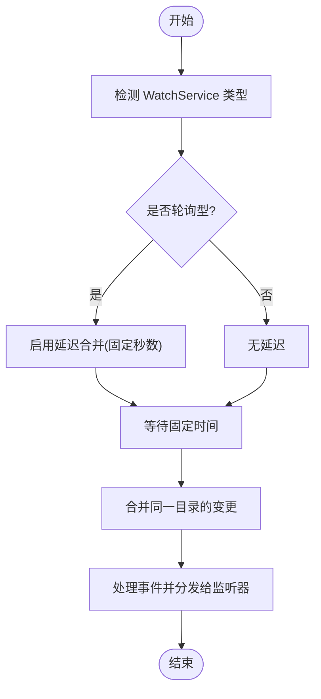
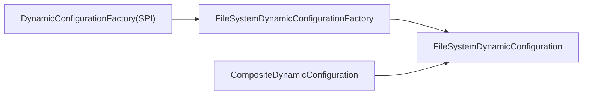

# 文件配置中心

<cite>
**本文引用的文件列表**
- [FileSystemDynamicConfiguration.java](file://dubbo-configcenter/dubbo-configcenter-file/src/main/java/org/apache/dubbo/common/config/configcenter/file/FileSystemDynamicConfiguration.java)
- [FileSystemDynamicConfigurationFactory.java](file://dubbo-configcenter/dubbo-configcenter-file/src/main/java/org/apache/dubbo/common/config/configcenter/file/FileSystemDynamicConfigurationFactory.java)
- [TreePathDynamicConfiguration.java](file://dubbo-common/src/main/java/org/apache/dubbo/common/config/configcenter/TreePathDynamicConfiguration.java)
- [AbstractDynamicConfiguration.java](file://dubbo-common/src/main/java/org/apache/dubbo/common/config/configcenter/AbstractDynamicConfiguration.java)
- [FileSystemDynamicConfigurationTest.java](file://dubbo-configcenter/dubbo-configcenter-file/src/test/java/org/apache/dubbo/common/config/configcenter/file/FileSystemDynamicConfigurationTest.java)
- [FileSystemDynamicConfigurationFactoryTest.java](file://dubbo-configcenter/dubbo-configcenter-file/src/test/java/org/apache/dubbo/common/config/configcenter/file/FileSystemDynamicConfigurationFactoryTest.java)
- [CompositeDynamicConfiguration.java](file://dubbo-common/src/main/java/org/apache/dubbo/common/config/configcenter/wrapper/CompositeDynamicConfiguration.java)
- [org.apache.dubbo.common.config.configcenter.DynamicConfigurationFactory](file://dubbo-configcenter/dubbo-configcenter-file/src/main/resources/META-INF/dubbo/internal/org.apache.dubbo.common.config.configcenter.DynamicConfigurationFactory)
</cite>

## 目录
1. [简介](#简介)
2. [项目结构](#项目结构)
3. [核心组件](#核心组件)
4. [架构总览](#架构总览)
5. [详细组件分析](#详细组件分析)
6. [依赖关系分析](#依赖关系分析)
7. [性能与优化](#性能与优化)
8. [故障排查指南](#故障排查指南)
9. [结论](#结论)
10. [附录：快速配置与最佳实践](#附录快速配置与最佳实践)

## 简介
本文件配置中心基于文件系统实现动态配置能力，通过操作系统级文件监听（WatchService）实现配置变更的热加载，并提供发布、查询、删除、监听等能力。其核心特性包括：
- 文件系统监听：自动感知新增、修改、删除事件并触发回调。
- 树形路径模型：按“组/键”构建文件路径，便于组织与隔离。
- 编码与线程池可配：支持自定义编码与工作线程池参数。
- 延迟合并策略：在轮询型 WatchService 下对同一目录的连续变更进行延迟合并，降低抖动。
- 跨平台适配：检测是否为轮询型 WatchService 并相应调整行为。

## 项目结构
文件配置中心位于 dubbo-configcenter 模块下的 file 子模块中，核心类与 SPI 配置如下：
- 实现类：FileSystemDynamicConfiguration
- 工厂类：FileSystemDynamicConfigurationFactory
- SPI 注册：org.apache.dubbo.common.config.configcenter.DynamicConfigurationFactory
- 抽象基类：AbstractDynamicConfiguration、TreePathDynamicConfiguration
- 测试类：FileSystemDynamicConfigurationTest、FileSystemDynamicConfigurationFactoryTest
- 组合包装器：CompositeDynamicConfiguration（用于多配置中心聚合）

图表来源
- [FileSystemDynamicConfiguration.java](file://dubbo-configcenter/dubbo-configcenter-file/src/main/java/org/apache/dubbo/common/config/configcenter/file/FileSystemDynamicConfiguration.java#L1-L120)
- [FileSystemDynamicConfigurationFactory.java](file://dubbo-configcenter/dubbo-configcenter-file/src/main/java/org/apache/dubbo/common/config/configcenter/file/FileSystemDynamicConfigurationFactory.java#L1-L36)
- [org.apache.dubbo.common.config.configcenter.DynamicConfigurationFactory](file://dubbo-configcenter/dubbo-configcenter-file/src/main/resources/META-INF/dubbo/internal/org.apache.dubbo.common.config.configcenter.DynamicConfigurationFactory#L1-L1)
- [AbstractDynamicConfiguration.java](file://dubbo-common/src/main/java/org/apache/dubbo/common/config/configcenter/AbstractDynamicConfiguration.java#L1-L120)
- [TreePathDynamicConfiguration.java](file://dubbo-common/src/main/java/org/apache/dubbo/common/config/configcenter/TreePathDynamicConfiguration.java#L1-L103)
- [CompositeDynamicConfiguration.java](file://dubbo-common/src/main/java/org/apache/dubbo/common/config/configcenter/wrapper/CompositeDynamicConfiguration.java#L73-L123)

章节来源
- [FileSystemDynamicConfiguration.java](file://dubbo-configcenter/dubbo-configcenter-file/src/main/java/org/apache/dubbo/common/config/configcenter/file/FileSystemDynamicConfiguration.java#L1-L120)
- [FileSystemDynamicConfigurationFactory.java](file://dubbo-configcenter/dubbo-configcenter-file/src/main/java/org/apache/dubbo/common/config/configcenter/file/FileSystemDynamicConfigurationFactory.java#L1-L36)
- [org.apache.dubbo.common.config.configcenter.DynamicConfigurationFactory](file://dubbo-configcenter/dubbo-configcenter-file/src/main/resources/META-INF/dubbo/internal/org.apache.dubbo.common.config.configcenter.DynamicConfigurationFactory#L1-L1)

## 核心组件
- FileSystemDynamicConfiguration：文件系统动态配置实现，负责监听、发布、读取、删除、监听注册与事件分发。
- FileSystemDynamicConfigurationFactory：工厂类，根据 URL 创建 FileSystemDynamicConfiguration 实例。
- AbstractDynamicConfiguration：通用动态配置抽象，提供线程池、超时、默认组等通用能力。
- TreePathDynamicConfiguration：树形路径模型抽象，将“组/键”映射到文件路径。
- CompositeDynamicConfiguration：组合式动态配置，支持多个配置源聚合。

章节来源
- [FileSystemDynamicConfiguration.java](file://dubbo-configcenter/dubbo-configcenter-file/src/main/java/org/apache/dubbo/common/config/configcenter/file/FileSystemDynamicConfiguration.java#L77-L120)
- [AbstractDynamicConfiguration.java](file://dubbo-common/src/main/java/org/apache/dubbo/common/config/configcenter/AbstractDynamicConfiguration.java#L40-L120)
- [TreePathDynamicConfiguration.java](file://dubbo-common/src/main/java/org/apache/dubbo/common/config/configcenter/TreePathDynamicConfiguration.java#L29-L103)
- [CompositeDynamicConfiguration.java](file://dubbo-common/src/main/java/org/apache/dubbo/common/config/configcenter/wrapper/CompositeDynamicConfiguration.java#L73-L123)

## 架构总览
文件配置中心采用“工厂 + 抽象 + 具体实现”的分层设计：
- 工厂层：根据 URL 参数创建具体实现。
- 抽象层：统一线程池、超时、默认组、路径构建等。
- 实现层：文件系统监听、事件处理、文件读写、延迟合并策略。

图表来源
- [AbstractDynamicConfiguration.java](file://dubbo-common/src/main/java/org/apache/dubbo/common/config/configcenter/AbstractDynamicConfiguration.java#L100-L220)
- [TreePathDynamicConfiguration.java](file://dubbo-common/src/main/java/org/apache/dubbo/common/config/configcenter/TreePathDynamicConfiguration.java#L64-L103)
- [FileSystemDynamicConfiguration.java](file://dubbo-configcenter/dubbo-configcenter-file/src/main/java/org/apache/dubbo/common/config/configcenter/file/FileSystemDynamicConfiguration.java#L200-L448)
- [FileSystemDynamicConfigurationFactory.java](file://dubbo-configcenter/dubbo-configcenter-file/src/main/java/org/apache/dubbo/common/config/configcenter/file/FileSystemDynamicConfigurationFactory.java#L29-L35)

## 详细组件分析

### FileSystemDynamicConfiguration 类分析
- 目录与编码
  - 默认根目录：用户主目录下的隐藏目录，便于隔离与持久化。
  - 编码：默认 UTF-8，可通过 URL 参数覆盖。
- 监听机制
  - 使用 WatchService 监听目录变更（新增、修改、删除），并将事件转换为配置变更事件。
  - 在轮询型 WatchService 场景下，通过延迟合并避免频繁抖动。
- 事件处理流程
  - 监听注册时，若首次注册则创建父目录并注册监听。
  - 事件到达后，按文件粒度分发给已注册的监听器。
- 发布/读取/删除
  - 发布：写入文件；删除：读取内容后删除；读取：按编码读取文本。
- 线程与资源
  - 单线程 Watch 事件循环线程池，保证事件顺序处理。
  - 注册 JVM 关闭钩子，确保 WatchService 与线程池安全关闭。

图表来源
- [FileSystemDynamicConfigurationFactory.java](file://dubbo-configcenter/dubbo-configcenter-file/src/main/java/org/apache/dubbo/common/config/configcenter/file/FileSystemDynamicConfigurationFactory.java#L29-L35)
- [FileSystemDynamicConfiguration.java](file://dubbo-configcenter/dubbo-configcenter-file/src/main/java/org/apache/dubbo/common/config/configcenter/file/FileSystemDynamicConfiguration.java#L294-L339)
- [FileSystemDynamicConfiguration.java](file://dubbo-configcenter/dubbo-configcenter-file/src/main/java/org/apache/dubbo/common/config/configcenter/file/FileSystemDynamicConfiguration.java#L365-L378)

章节来源
- [FileSystemDynamicConfiguration.java](file://dubbo-configcenter/dubbo-configcenter-file/src/main/java/org/apache/dubbo/common/config/configcenter/file/FileSystemDynamicConfiguration.java#L88-L120)
- [FileSystemDynamicConfiguration.java](file://dubbo-configcenter/dubbo-configcenter-file/src/main/java/org/apache/dubbo/common/config/configcenter/file/FileSystemDynamicConfiguration.java#L294-L339)
- [FileSystemDynamicConfiguration.java](file://dubbo-configcenter/dubbo-configcenter-file/src/main/java/org/apache/dubbo/common/config/configcenter/file/FileSystemDynamicConfiguration.java#L365-L378)
- [FileSystemDynamicConfiguration.java](file://dubbo-configcenter/dubbo-configcenter-file/src/main/java/org/apache/dubbo/common/config/configcenter/file/FileSystemDynamicConfiguration.java#L390-L411)
- [FileSystemDynamicConfiguration.java](file://dubbo-configcenter/dubbo-configcenter-file/src/main/java/org/apache/dubbo/common/config/configcenter/file/FileSystemDynamicConfiguration.java#L423-L448)

### 目录结构与命名规范
- 根目录
  - 可通过 URL 参数指定；若未指定或不存在，则使用默认用户主目录下的隐藏目录。
- 组与键
  - 采用“组/键”的树形路径模型，键即为文件名，组即为目录名。
- 文件内容
  - 以纯文本形式存储，编码由配置决定。
- 目录组织
  - 每个组对应一个目录，目录内每个文件代表一个键值项。

章节来源
- [TreePathDynamicConfiguration.java](file://dubbo-common/src/main/java/org/apache/dubbo/common/config/configcenter/TreePathDynamicConfiguration.java#L64-L103)
- [FileSystemDynamicConfiguration.java](file://dubbo-configcenter/dubbo-configcenter-file/src/main/java/org/apache/dubbo/common/config/configcenter/file/FileSystemDynamicConfiguration.java#L620-L635)

### 热加载机制与延迟合并
- 轮询型 WatchService
  - 当检测到轮询型实现时，启用延迟合并策略：同一目录在短时间内多次变更会等待固定时间后再统一处理，减少抖动。
- 事件循环
  - 单线程循环从 WatchService 取出事件，逐个处理并唤醒等待的目录，确保顺序一致性。
- 监听注册
  - 首次注册监听时，自动创建父目录并注册监听，避免遗漏。

图表来源
- [FileSystemDynamicConfiguration.java](file://dubbo-configcenter/dubbo-configcenter-file/src/main/java/org/apache/dubbo/common/config/configcenter/file/FileSystemDynamicConfiguration.java#L577-L603)
- [FileSystemDynamicConfiguration.java](file://dubbo-configcenter/dubbo-configcenter-file/src/main/java/org/apache/dubbo/common/config/configcenter/file/FileSystemDynamicConfiguration.java#L458-L492)
- [FileSystemDynamicConfiguration.java](file://dubbo-configcenter/dubbo-configcenter-file/src/main/java/org/apache/dubbo/common/config/configcenter/file/FileSystemDynamicConfiguration.java#L294-L339)

章节来源
- [FileSystemDynamicConfiguration.java](file://dubbo-configcenter/dubbo-configcenter-file/src/main/java/org/apache/dubbo/common/config/configcenter/file/FileSystemDynamicConfiguration.java#L577-L603)
- [FileSystemDynamicConfiguration.java](file://dubbo-configcenter/dubbo-configcenter-file/src/main/java/org/apache/dubbo/common/config/configcenter/file/FileSystemDynamicConfiguration.java#L458-L492)

### 配置校验与数据解析
- 配置校验
  - 仓库中存在通用的配置校验工具，可用于验证键名、路径、长度等规则，但文件配置中心本身不直接执行业务校验逻辑。
- 数据解析
  - 文件配置中心以纯文本方式读取与写入，不内置特定格式解析器（如 YAML/Properties）。如需解析复杂格式，请在应用侧自行处理或扩展监听器逻辑。

章节来源
- [ConfigValidationUtils.java](file://dubbo-config/dubbo-config-api/src/main/java/org/apache/dubbo/config/utils/ConfigValidationUtils.java#L153-L200)
- [FileSystemDynamicConfiguration.java](file://dubbo-configcenter/dubbo-configcenter-file/src/main/java/org/apache/dubbo/common/config/configcenter/file/FileSystemDynamicConfiguration.java#L398-L401)

### 权限管理、文件锁与跨平台兼容
- 权限与可见性
  - 通过 canRead 判断文件是否存在且可读，避免不可见文件导致的异常。
- 文件锁
  - 代码未显式使用文件锁；在高并发写入场景建议结合外部锁或原子写入策略（例如临时文件 + 原子重命名）。
- 跨平台兼容
  - 自动检测 WatchService 是否为轮询实现，非轮询平台采用更稳健的延迟合并策略；线程池与编码均采用平台无关实现。

章节来源
- [FileSystemDynamicConfiguration.java](file://dubbo-configcenter/dubbo-configcenter-file/src/main/java/org/apache/dubbo/common/config/configcenter/file/FileSystemDynamicConfiguration.java#L380-L387)
- [FileSystemDynamicConfiguration.java](file://dubbo-configcenter/dubbo-configcenter-file/src/main/java/org/apache/dubbo/common/config/configcenter/file/FileSystemDynamicConfiguration.java#L599-L603)

## 依赖关系分析
- 工厂与 SPI
  - 通过 SPI 将 file 协议映射到 FileSystemDynamicConfigurationFactory，从而创建具体实现。
- 组合配置中心
  - CompositeDynamicConfiguration 支持多配置中心聚合，文件配置中心可与其他实现共存。

图表来源
- [org.apache.dubbo.common.config.configcenter.DynamicConfigurationFactory](file://dubbo-configcenter/dubbo-configcenter-file/src/main/resources/META-INF/dubbo/internal/org.apache.dubbo.common.config.configcenter.DynamicConfigurationFactory#L1-L1)
- [FileSystemDynamicConfigurationFactory.java](file://dubbo-configcenter/dubbo-configcenter-file/src/main/java/org/apache/dubbo/common/config/configcenter/file/FileSystemDynamicConfigurationFactory.java#L29-L35)
- [CompositeDynamicConfiguration.java](file://dubbo-common/src/main/java/org/apache/dubbo/common/config/configcenter/wrapper/CompositeDynamicConfiguration.java#L73-L123)

章节来源
- [org.apache.dubbo.common.config.configcenter.DynamicConfigurationFactory](file://dubbo-configcenter/dubbo-configcenter-file/src/main/resources/META-INF/dubbo/internal/org.apache.dubbo.common.config.configcenter.DynamicConfigurationFactory#L1-L1)
- [CompositeDynamicConfiguration.java](file://dubbo-common/src/main/java/org/apache/dubbo/common/config/configcenter/wrapper/CompositeDynamicConfiguration.java#L73-L123)

## 性能与优化
- 线程池与超时
  - 工作线程池大小与保活时间可配置，默认单线程，适合小规模配置中心。
- 目录级延迟合并
  - 在轮询型 WatchService 下启用延迟合并，减少高频变更带来的抖动。
- 大文件建议
  - 对于大文件，建议：
    - 控制写入频率，合并多次变更后再落盘。
    - 使用原子写入策略（临时文件 + 原子重命名）避免部分写入。
    - 合理设置监听目录范围，避免过多文件导致监听开销增大。
- 监听粒度
  - 仅在首次注册监听时创建父目录并注册监听，避免重复注册带来的额外开销。

章节来源
- [AbstractDynamicConfiguration.java](file://dubbo-common/src/main/java/org/apache/dubbo/common/config/configcenter/AbstractDynamicConfiguration.java#L238-L247)
- [FileSystemDynamicConfiguration.java](file://dubbo-configcenter/dubbo-configcenter-file/src/main/java/org/apache/dubbo/common/config/configcenter/file/FileSystemDynamicConfiguration.java#L577-L603)
- [FileSystemDynamicConfiguration.java](file://dubbo-configcenter/dubbo-configcenter-file/src/main/java/org/apache/dubbo/common/config/configcenter/file/FileSystemDynamicConfiguration.java#L423-L448)

## 故障排查指南
- 监听无效
  - 检查根目录是否存在且可写；确认首次注册监听时已创建父目录并成功注册监听。
- 事件未触发
  - 确认操作系统支持原生 WatchService；在轮询型实现下，可能存在延迟。
- 编码问题
  - 确认文件编码与配置一致；读取失败时检查 canRead 与文件权限。
- 资源清理
  - 确保正确关闭配置中心实例，以便释放 WatchService 与线程池。

章节来源
- [FileSystemDynamicConfiguration.java](file://dubbo-configcenter/dubbo-configcenter-file/src/main/java/org/apache/dubbo/common/config/configcenter/file/FileSystemDynamicConfiguration.java#L423-L448)
- [FileSystemDynamicConfiguration.java](file://dubbo-configcenter/dubbo-configcenter-file/src/main/java/org/apache/dubbo/common/config/configcenter/file/FileSystemDynamicConfiguration.java#L380-L387)
- [FileSystemDynamicConfigurationTest.java](file://dubbo-configcenter/dubbo-configcenter-file/src/test/java/org/apache/dubbo/common/config/configcenter/file/FileSystemDynamicConfigurationTest.java#L82-L97)

## 结论
文件配置中心通过简洁的文件系统监听与树形路径模型，提供了稳定可靠的动态配置能力。其延迟合并策略与跨平台适配使其在不同环境下均能保持良好表现。对于复杂格式与严格校验需求，可在应用层扩展监听器或引入外部解析器。

## 附录：快速配置与最佳实践

### 快速配置示例（初学者）
- 使用 SPI 获取文件配置中心工厂
  - 通过 SPI 名称为 file 的工厂创建实例。
- 设置根目录与编码
  - 通过 URL 参数设置根目录与编码；若未设置，将使用默认用户主目录下的隐藏目录与 UTF-8。
- 发布与监听
  - 发布配置即写入文件；添加监听后即可收到变更事件。

章节来源
- [FileSystemDynamicConfigurationFactoryTest.java](file://dubbo-configcenter/dubbo-configcenter-file/src/test/java/org/apache/dubbo/common/config/configcenter/file/FileSystemDynamicConfigurationFactoryTest.java#L31-L40)
- [FileSystemDynamicConfigurationTest.java](file://dubbo-configcenter/dubbo-configcenter-file/src/test/java/org/apache/dubbo/common/config/configcenter/file/FileSystemDynamicConfigurationTest.java#L58-L97)
- [org.apache.dubbo.common.config.configcenter.DynamicConfigurationFactory](file://dubbo-configcenter/dubbo-configcenter-file/src/main/resources/META-INF/dubbo/internal/org.apache.dubbo.common.config.configcenter.DynamicConfigurationFactory#L1-L1)

### 大文件配置的性能优化建议（经验者）
- 写入策略
  - 使用临时文件 + 原子重命名，避免部分写入与并发读取冲突。
- 监听范围
  - 合理划分组与键，避免单目录下文件过多导致监听开销上升。
- 合并策略
  - 在轮询型 WatchService 下利用延迟合并，减少高频变更的处理次数。
- 线程池与超时
  - 根据业务负载调整工作线程池大小与超时时间，平衡吞吐与响应。

章节来源
- [FileSystemDynamicConfiguration.java](file://dubbo-configcenter/dubbo-configcenter-file/src/main/java/org/apache/dubbo/common/config/configcenter/file/FileSystemDynamicConfiguration.java#L577-L603)
- [AbstractDynamicConfiguration.java](file://dubbo-common/src/main/java/org/apache/dubbo/common/config/configcenter/AbstractDynamicConfiguration.java#L238-L247)