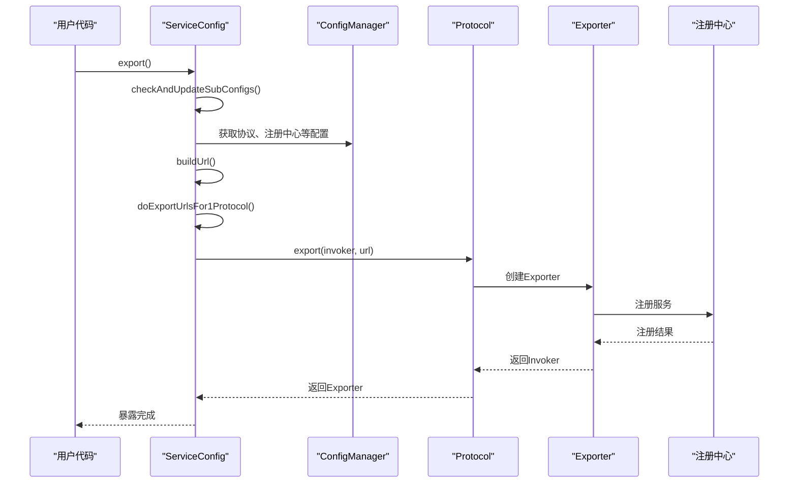
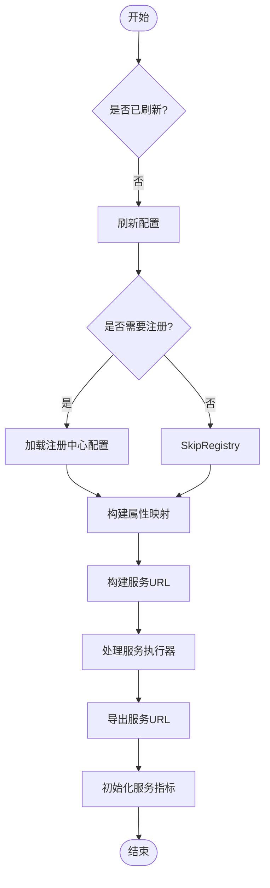
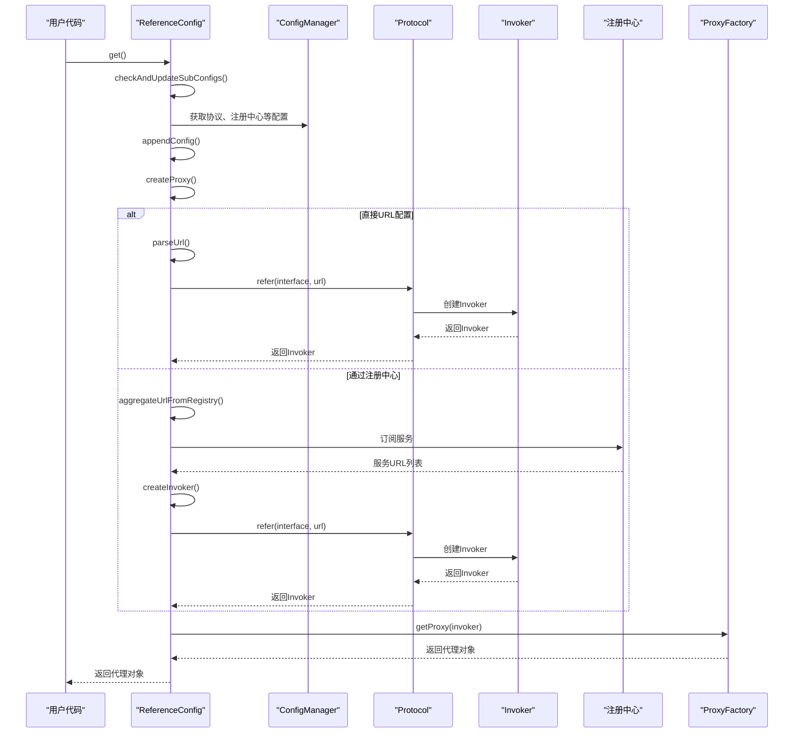
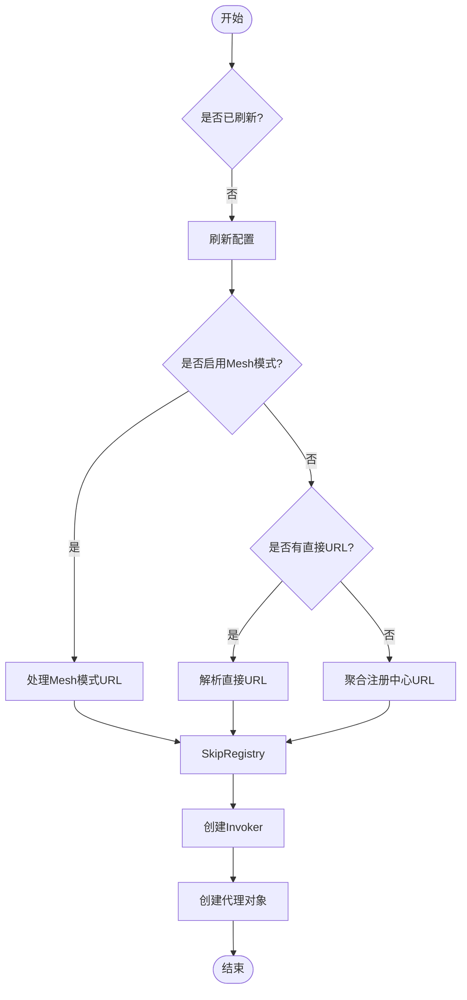
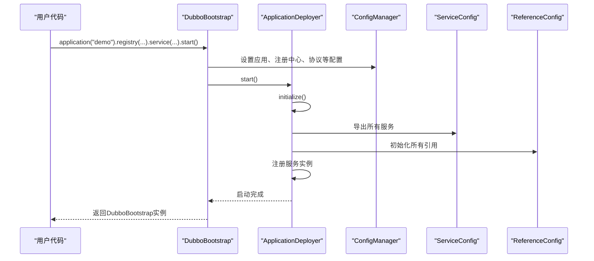
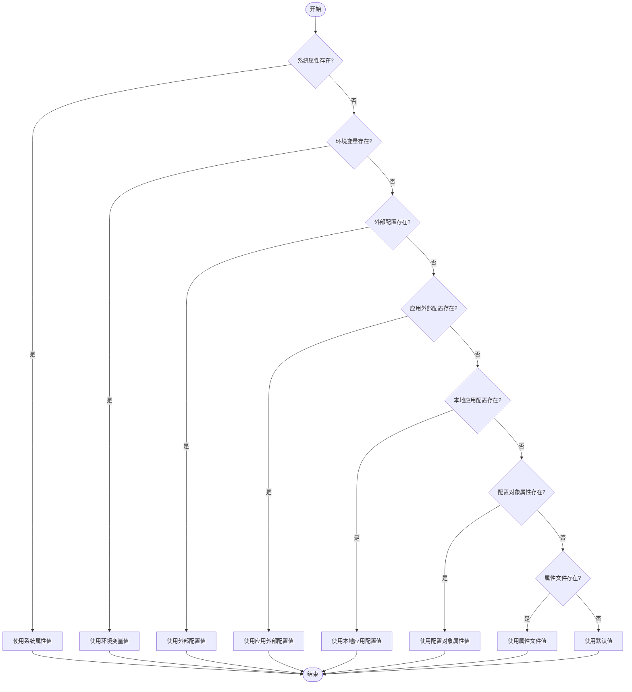
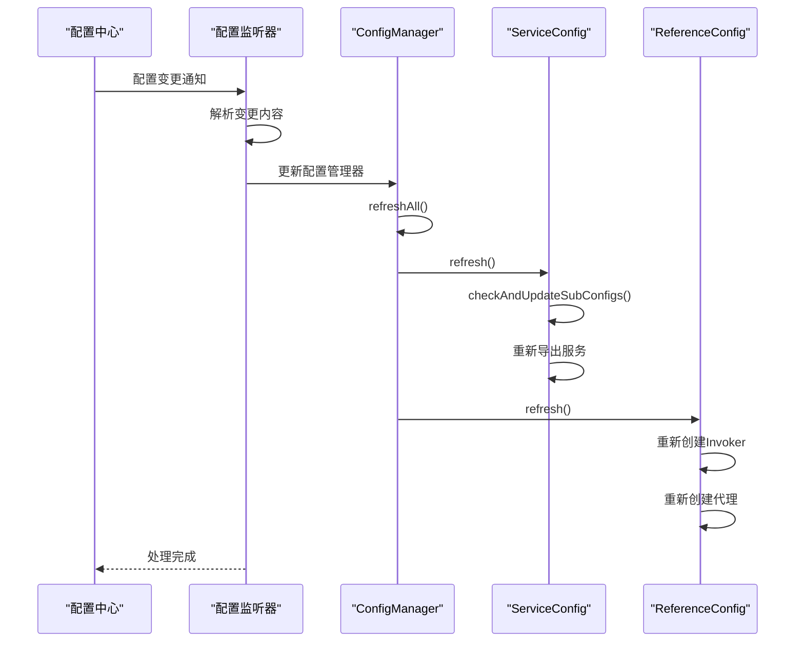
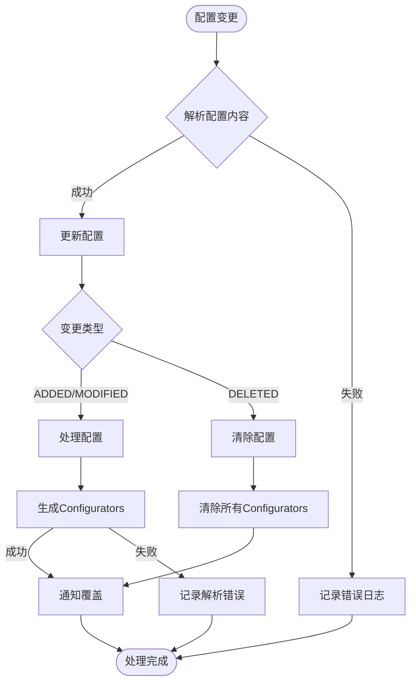
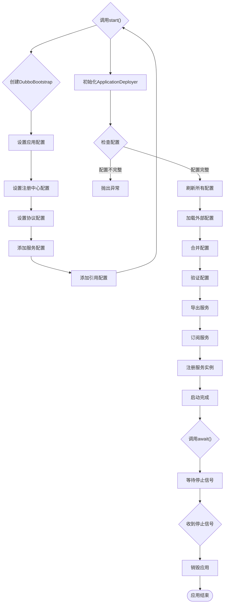
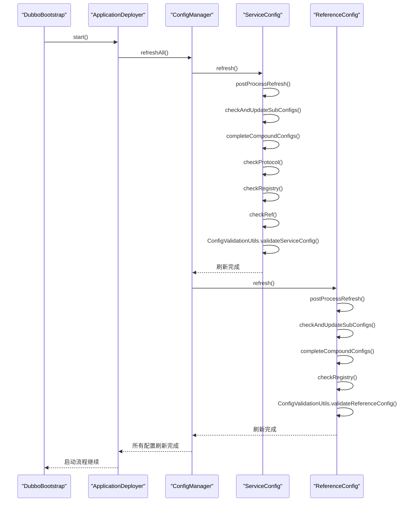

# dubbo-config模块

<cite>
**本文档引用的文件**   
- [ServiceConfig.java](file://dubbo-config\dubbo-config-api\src\main\java\org\apache\dubbo\config\ServiceConfig.java)
- [ReferenceConfig.java](file://dubbo-config\dubbo-config-api\src\main\java\org\apache\dubbo\config\ReferenceConfig.java)
- [DubboBootstrap.java](file://dubbo-config\dubbo-config-api\src\main\java\org\apache\dubbo\config\bootstrap\DubboBootstrap.java)
- [AbstractConfig.java](file://dubbo-common\src\main\java\org\apache\dubbo\config\AbstractConfig.java)
- [ConfigManager.java](file://dubbo-common\src\main\java\org\apache\dubbo\config\context\ConfigManager.java)
- [Environment.java](file://dubbo-common\src\main\java\org\apache\dubbo\common\config\Environment.java)
</cite>

## 目录
1. [简介](#简介)
2. [配置管理核心组件](#配置管理核心组件)
3. [ServiceConfig设计与实现](#serviceconfig设计与实现)
4. [ReferenceConfig设计与实现](#referenceconfig设计与实现)
5. [DubboBootstrap引导类](#dubbobootstrap引导类)
6. [配置优先级与覆盖规则](#配置优先级与覆盖规则)
7. [配置动态更新机制](#配置动态更新机制)
8. [配置加载流程](#配置加载流程)
9. [配置示例](#配置示例)
10. [总结](#总结)

## 简介

dubbo-config模块是Apache Dubbo框架的核心配置管理组件，负责服务提供者和消费者的配置管理。该模块提供了完整的配置生命周期管理，包括配置的定义、加载、验证、优先级处理和动态更新。通过ServiceConfig和ReferenceConfig两个核心类，开发者可以方便地配置和管理Dubbo服务的提供和引用。DubboBootstrap作为引导类，提供了统一的API来管理整个Dubbo应用的生命周期。

## 配置管理核心组件

dubbo-config模块的核心是配置管理机制，它通过一系列组件协同工作来实现配置的统一管理。这些组件包括配置对象、配置管理器、环境配置和配置加载器等。

### 配置对象体系

Dubbo的配置对象体系以AbstractConfig为基类，所有具体的配置类都继承自这个抽象类。这种设计模式使得所有配置类都具有统一的属性和行为，便于统一管理和处理。

```mermaid
classDiagram
class AbstractConfig {
+String id
+AtomicBoolean refreshed
+Boolean isDefault
+ScopeModel scopeModel
+refresh() void
+checkAndUpdateSubConfigs() void
+postProcessRefresh() void
}
class ServiceConfig {
+boolean exported
+boolean unexported
+AtomicBoolean initialized
+ConcurrentHashMap exporters
+export(RegisterTypeEnum) void
+unexport() void
+init() void
}
class ReferenceConfig {
+T ref
+Invoker<?> invoker
+boolean initialized
+boolean destroyed
+get(boolean) T
+destroy() void
+init() void
}
class AbstractInterfaceConfig {
+List<URL> urls
+String interfaceName
+String version
+String group
+String path
+Map<String, String> parameters
+toUrl() URL
+toUrls() List<URL>
}
AbstractConfig <|-- ServiceConfig
AbstractConfig <|-- ReferenceConfig
AbstractConfig <|-- AbstractInterfaceConfig
AbstractInterfaceConfig <|-- ServiceConfig
AbstractInterfaceConfig <|-- ReferenceConfig
note right of AbstractConfig
所有配置类的基类，提供统一的
配置处理方法和属性
end note
note right of ServiceConfig
服务提供者配置，负责服务
暴露和管理
end note
note right of ReferenceConfig
服务消费者配置，负责服务
引用和代理创建
end note
```

**图源**
- [AbstractConfig.java](file://dubbo-common\src\main\java\org\apache\dubbo\config\AbstractConfig.java)
- [ServiceConfig.java](file://dubbo-config\dubbo-config-api\src\main\java\org\apache\dubbo\config\ServiceConfig.java)
- [ReferenceConfig.java](file://dubbo-config\dubbo-config-api\src\main\java\org\apache\dubbo\config\ReferenceConfig.java)

### 配置管理器

ConfigManager是Dubbo配置管理的核心，它负责管理应用级别的所有配置对象。该管理器采用无锁设计（通过ConcurrentHashMap），以实现快速的读操作，同时在写操作时使用配置类型级别的锁确保安全性。

```mermaid
classDiagram
class ConfigManager {
+ApplicationModel applicationModel
+Environment environment
+Map<String, Map<String, AbstractConfig>> configs
+addConfig(AbstractConfig) void
+getConfig(Class, String) Optional
+getSingleConfig(String) AbstractConfig
+getOrAddProtocol(String) ProtocolConfig
}
class AbstractConfigManager {
+ScopeModel scopeModel
+ApplicationModel applicationModel
+Environment environment
+Collection<Class> supportedConfigTypes
+Set<Class> uniqueConfigTypes
+initialize() void
+refreshAll() void
}
class Environment {
+SystemConfiguration systemConfiguration
+EnvironmentConfiguration environmentConfiguration
+InmemoryConfiguration externalConfiguration
+InmemoryConfiguration appExternalConfiguration
+InmemoryConfiguration appConfiguration
+PropertiesConfiguration propertiesConfiguration
+CompositeConfiguration globalConfiguration
+DynamicConfiguration dynamicConfiguration
+getConfigurationMaps(AbstractConfig, String) Map[]
+getPrefixedConfiguration(AbstractConfig, String) Configuration
}
AbstractConfigManager <|-- ConfigManager
ConfigManager --> Environment : "uses"
note right of ConfigManager
应用级配置管理器，统一管理
所有配置对象
end note
note right of Environment
环境配置，管理不同来源的
配置数据
end note
```

**图源**
- [ConfigManager.java](file://dubbo-common\src\main\java\org\apache\dubbo\config\context\ConfigManager.java)
- [Environment.java](file://dubbo-common\src\main\java\org\apache\dubbo\common\config\Environment.java)

## ServiceConfig设计与实现

ServiceConfig是Dubbo服务提供者的核心配置类，负责服务的暴露和管理。它通过一系列复杂的处理流程，将服务接口暴露为可远程调用的服务。

### 核心功能

ServiceConfig的主要功能包括：
- 服务接口的暴露和注册
- 协议配置和URL生成
- 服务元数据管理
- 生命周期管理（导出、取消导出）
- 配置验证和初始化

### 服务暴露流程

服务暴露是ServiceConfig的核心功能，它通过一系列步骤将服务接口暴露为可远程调用的服务。



**图源**
- [ServiceConfig.java](file://dubbo-config\dubbo-config-api\src\main\java\org\apache\dubbo\config\ServiceConfig.java)

### 配置构建流程

ServiceConfig在暴露服务之前，需要构建完整的配置信息，包括协议、注册中心、方法参数等。



**图源**
- [ServiceConfig.java](file://dubbo-config\dubbo-config-api\src\main\java\org\apache\dubbo\config\ServiceConfig.java)

## ReferenceConfig设计与实现

ReferenceConfig是Dubbo服务消费者的核心配置类，负责服务的引用和代理创建。它通过一系列复杂的处理流程，创建服务接口的代理对象，使消费者可以像调用本地方法一样调用远程服务。

### 核心功能

ReferenceConfig的主要功能包括：
- 服务引用的创建和管理
- 代理对象的生成
- 调用器(Invoker)的创建
- 配置验证和初始化
- 生命周期管理（销毁）

### 服务引用流程

服务引用是ReferenceConfig的核心功能，它通过一系列步骤创建服务接口的代理对象。



**图源**
- [ReferenceConfig.java](file://dubbo-config\dubbo-config-api\src\main\java\org\apache\dubbo\config\ReferenceConfig.java)

### 配置构建流程

ReferenceConfig在创建代理对象之前，需要构建完整的配置信息，包括协议、注册中心、方法参数等。



**图源**
- [ReferenceConfig.java](file://dubbo-config\dubbo-config-api\src\main\java\org\apache\dubbo\config\ReferenceConfig.java)

## DubboBootstrap引导类

DubboBootstrap是Dubbo应用的引导类，提供了统一的API来管理整个Dubbo应用的生命周期。它简化了Dubbo的使用，使开发者可以通过流畅的API链式调用来配置和启动Dubbo应用。

### 核心功能

DubboBootstrap的主要功能包括：
- 应用生命周期管理（启动、停止、销毁）
- 配置管理（应用、协议、注册中心等）
- 服务管理（服务、引用）
- 状态监控（运行状态、等待完成）

### API设计

DubboBootstrap采用了流畅的API设计模式，允许开发者通过链式调用来配置和启动Dubbo应用。

```mermaid
classDiagram
class DubboBootstrap {
+ApplicationModel applicationModel
+ConfigManager configManager
+ApplicationDeployer applicationDeployer
+start() DubboBootstrap
+start(boolean) DubboBootstrap
+stop() DubboBootstrap
+destroy() void
+await() DubboBootstrap
+application(String) DubboBootstrap
+registry(Consumer) DubboBootstrap
+protocol(Consumer) DubboBootstrap
+service(Consumer) DubboBootstrap
+reference(Consumer) DubboBootstrap
+isRunning() boolean
+isStarted() boolean
}
class ApplicationBuilder {
+String name
+String version
+String owner
+build() ApplicationConfig
}
class RegistryBuilder {
+String address
+String protocol
+int port
+build() RegistryConfig
}
class ProtocolBuilder {
+String name
+int port
+build() ProtocolConfig
}
class ServiceBuilder {
+String interfaceName
+Object ref
+String version
+String group
+build() ServiceConfig
}
class ReferenceBuilder {
+String interfaceName
+String version
+String group
+build() ReferenceConfig
}
DubboBootstrap --> ApplicationBuilder : "创建"
DubboBootstrap --> RegistryBuilder : "创建"
DubboBootstrap --> ProtocolBuilder : "创建"
DubboBootstrap --> ServiceBuilder : "创建"
DubboBootstrap --> ReferenceBuilder : "创建"
note right of DubboBootstrap
引导类，提供流畅的API
来配置和管理Dubbo应用
end note
note right of ApplicationBuilder
应用配置构建器
end note
note right of RegistryBuilder
注册中心配置构建器
end note
note right of ProtocolBuilder
协议配置构建器
end note
note right of ServiceBuilder
服务配置构建器
end note
note right of ReferenceBuilder
引用配置构建器
end note
```

**图源**
- [DubboBootstrap.java](file://dubbo-config\dubbo-config-api\src\main\java\org\apache\dubbo\config\bootstrap\DubboBootstrap.java)

### 启动流程

DubboBootstrap的启动流程涉及多个组件的协同工作，确保应用能够正确启动并提供服务。



**图源**
- [DubboBootstrap.java](file://dubbo-config\dubbo-config-api\src\main\java\org\apache\dubbo\config\bootstrap\DubboBootstrap.java)

## 配置优先级与覆盖规则

Dubbo的配置系统支持多种配置来源，每种来源都有不同的优先级。当同一配置项在多个来源中出现时，高优先级的配置会覆盖低优先级的配置。

### 配置来源优先级

Dubbo的配置来源按照优先级从高到低排列如下：

1. **JVM系统属性** - 通过System.setProperty()设置的属性
2. **环境变量** - 操作系统环境变量
3. **外部配置** - 配置中心（如Nacos、Zookeeper）的全局配置
4. **应用外部配置** - 配置中心的应用级配置
5. **本地应用配置** - Spring Environment/PropertySources/application.properties
6. **配置对象属性** - 通过API或注解设置的配置
7. **属性文件配置** - dubbo.properties文件

```mermaid
flowchart TD
A[JVM系统属性] --> B[环境变量]
B --> C[外部配置]
C --> D[应用外部配置]
D --> E[本地应用配置]
E --> F[配置对象属性]
F --> G[属性文件配置]
style A fill:#f9f,stroke:#333,stroke-width:2px
style B fill:#f9f,stroke:#333,stroke-width:2px
style C fill:#f9f,stroke:#333,stroke-width:2px
style D fill:#f9f,stroke:#333,stroke-width:2px
style E fill:#f9f,stroke:#333,stroke-width:2px
style F fill:#f9f,stroke:#333,stroke-width:2px
style G fill:#f9f,stroke:#333,stroke-width:2px
subgraph "高优先级"
A
end
subgraph "低优先级"
G
end
note right of A
优先级最高，会覆盖
所有其他来源的配置
end note
note right of G
优先级最低，会被
所有其他来源覆盖
end note
```

**图源**
- [Environment.java](file://dubbo-common\src\main\java\org\apache\dubbo\common\config\Environment.java)

### 配置覆盖模式

Dubbo支持多种配置覆盖模式，允许开发者根据需要选择合适的覆盖策略。

```mermaid
classDiagram
class ConfigMode {
<<enumeration>>
OVERRIDE
OVERRIDE_ALL
OVERRIDE_IF_ABSENT
IGNORE
}
class AbstractConfigManager {
+ConfigMode configMode
+addConfig(AbstractConfig) void
+overrideWithConfig(AbstractConfig, boolean) void
}
AbstractConfigManager --> ConfigMode : "使用"
note right of ConfigMode
配置覆盖模式枚举
end note
note right of AbstractConfigManager
根据配置模式处理
配置覆盖逻辑
end note
```

**图源**
- [ConfigMode.java](file://dubbo-common\src\main\java\org\apache\dubbo\config\context\ConfigMode.java)

### 配置决策树

当Dubbo需要确定某个配置项的最终值时，会按照以下决策树进行判断：



**图源**
- [Environment.java](file://dubbo-common\src\main\java\org\apache\dubbo\common\config\Environment.java)

## 配置动态更新机制

Dubbo支持配置的动态更新，允许在应用运行时修改配置而无需重启。这一机制对于实现服务治理、流量控制等功能至关重要。

### 动态配置架构

Dubbo的动态配置机制基于观察者模式，当配置发生变化时，配置中心会通知所有监听者。

```mermaid
classDiagram
class DynamicConfiguration {
+getConfig(String, String, long) String
+addListener(String, String, ConfigurationListener) void
+removeListener(String, String, ConfigurationListener) void
+publishConfig(String, String, String) boolean
}
class ConfigurationListener {
+process(ConfigChangedEvent) void
}
class ConfigChangedEvent {
+String content
+ConfigChangeType changeType
+String key
+String group
}
class ConfiguratorListener {
+process(ConfigChangedEvent) void
+notifyOverrides() void
}
class AbstractConfiguratorListener {
+genConfiguratorsFromRawRule(String) boolean
}
DynamicConfiguration <|-- NacosDynamicConfiguration
DynamicConfiguration <|-- ZookeeperDynamicConfiguration
DynamicConfiguration <|-- ApolloDynamicConfiguration
ConfigurationListener <|-- ConfiguratorListener
ConfiguratorListener <|-- AbstractConfiguratorListener
AbstractConfiguratorListener --> ConfigChangedEvent : "处理"
DynamicConfiguration --> ConfigurationListener : "通知"
note right of DynamicConfiguration
动态配置接口，定义了
配置的读取、监听和发布
end note
note right of ConfigurationListener
配置变更监听器接口
end note
note right of ConfigChangedEvent
配置变更事件，包含
变更内容和类型
end note
```

**图源**
- [DynamicConfiguration.java](file://dubbo-common\src\main\java\org\apache\dubbo\common\config\configcenter\DynamicConfiguration.java)

### 配置更新流程

当配置发生变化时，Dubbo会按照以下流程处理配置更新：



**图源**
- [AbstractConfiguratorListener.java](file://dubbo-registry\dubbo-registry-api\src\main\java\org\apache\dubbo\registry\integration\AbstractConfiguratorListener.java)

### 配置监听实现

Dubbo通过实现ConfigurationListener接口来监听配置变化，并在配置变化时执行相应的处理逻辑。



**图源**
- [AbstractConfiguratorListener.java](file://dubbo-registry\dubbo-registry-api\src\main\java\org\apache\dubbo\registry\integration\AbstractConfiguratorListener.java)

## 配置加载流程

Dubbo的配置加载是一个复杂的过程，涉及多个组件的协同工作。理解配置加载的完整流程对于正确使用和调试Dubbo应用至关重要。

### 完整配置加载流程



**图源**
- [DubboBootstrap.java](file://dubbo-config\dubbo-config-api\src\main\java\org\apache\dubbo\config\bootstrap\DubboBootstrap.java)

### 配置刷新机制

配置刷新是配置加载过程中的关键步骤，它确保所有配置都处于最新状态。



**图源**
- [ServiceConfig.java](file://dubbo-config\dubbo-config-api\src\main\java\org\apache\dubbo\config\ServiceConfig.java)
- [ReferenceConfig.java](file://dubbo-config\dubbo-config-api\src\main\java\org\apache\dubbo\config\ReferenceConfig.java)

## 配置示例

### 简单配置示例

以下是一个简单的Dubbo配置示例，展示了如何使用Java API配置和启动一个Dubbo应用。

```java
// 创建DubboBootstrap实例
DubboBootstrap bootstrap = DubboBootstrap.getInstance();

// 配置应用信息
bootstrap.application("simple-demo")
          .registry(registry -> registry.setAddress("zookeeper://127.0.0.1:2181"))
          .protocol(protocol -> protocol.setName("dubbo").setPort(20880));

// 配置服务提供者
bootstrap.service(service -> service.setInterface(DemoService.class)
                                   .setRef(new DemoServiceImpl()));

// 配置服务消费者
bootstrap.reference(reference -> reference.setInterface(DemoService.class));

// 启动Dubbo应用
bootstrap.start().await();
```

**代码路径**
- [DubboBootstrap.java](file://dubbo-config\dubbo-config-api\src\main\java\org\apache\dubbo\config\bootstrap\DubboBootstrap.java)

### 复杂配置管理方案

以下是一个复杂的配置管理方案，展示了如何在生产环境中使用Dubbo的高级配置功能。

```java
// 创建DubboBootstrap实例
DubboBootstrap bootstrap = DubboBootstrap.getInstance();

// 配置应用信息
bootstrap.application("complex-demo")
          .setOwner("team-a")
          .setOrganization("company")
          .setVersion("1.0.0");

// 配置多个注册中心
bootstrap.registry("zookeeper", registry -> registry.setAddress("zookeeper://192.168.1.100:2181")
                                                .setRegister(true)
                                                .setSubscribe(true))
          .registry("nacos", registry -> registry.setAddress("nacos://192.168.1.101:8848")
                                            .setRegister(false)
                                            .setSubscribe(true));

// 配置多个协议
bootstrap.protocol("dubbo", protocol -> protocol.setPort(20880)
                                             .setThreads(200)
                                             .setAccepts(1000))
          .protocol("rest", protocol -> protocol.setPort(8080)
                                           .setServer("tomcat")
                                           .setContextpath("/api"));

// 配置服务提供者
bootstrap.service("demoService", service -> service.setInterface(DemoService.class)
                                                 .setRef(new DemoServiceImpl())
                                                 .setVersion("1.0.0")
                                                 .setGroup("production")
                                                 .setDelay(-1)
                                                 .setExport(true)
                                                 .setDynamic(true)
                                                 .addMethod("sayHello", method -> method.setRetries(3)
                                                                                     .setTimeout(5000)
                                                                                     .setLoadbalance("roundrobin")));

// 配置服务消费者
bootstrap.reference("demoService", reference -> reference.setInterface(DemoService.class)
                                                       .setVersion("1.0.0")
                                                       .setGroup("production")
                                                       .setCheck(false)
                                                       .setLazy(true)
                                                       .setSticky(false)
                                                       .setTimeout(3000)
                                                       .setRetries(2)
                                                       .setLoadbalance("random")
                                                       .addMethod("sayHello", method -> method.setTimeout(5000)
                                                                                           .setRetries(1)));

// 配置监控
bootstrap.monitor(monitor -> monitor.setProtocol("dubbo")
                                   .setAddress("192.168.1.102:50050"));

// 配置配置中心
bootstrap.configCenter(configCenter -> configCenter.setAddress("nacos://192.168.1.101:8848")
                                                 .setNamespace("demo-namespace")
                                                 .setGroup("DEFAULT_GROUP"));

// 启动Dubbo应用
bootstrap.start().await();
```

**代码路径**
- [DubboBootstrap.java](file://dubbo-config\dubbo-config-api\src\main\java\org\apache\dubbo\config\bootstrap\DubboBootstrap.java)

## 总结

dubbo-config模块是Apache Dubbo框架的核心组件，提供了完整的配置管理能力。通过对ServiceConfig和ReferenceConfig的设计与实现分析，我们可以看到Dubbo如何通过复杂的配置处理流程来管理服务的提供和消费。DubboBootstrap作为引导类，提供了简洁的API来管理整个Dubbo应用的生命周期。

配置的优先级和覆盖规则确保了配置的灵活性和可管理性，而动态更新机制则支持了服务治理和流量控制等高级功能。配置加载的完整流程展示了Dubbo如何在启动时协调各个组件，确保应用能够正确启动并提供服务。

无论是初学者还是经验丰富的开发者，都可以通过dubbo-config模块提供的丰富配置选项来满足不同的应用场景需求。从简单的配置示例到复杂的配置管理方案，dubbo-config模块都提供了相应的支持，使得Dubbo成为一个强大而灵活的分布式服务框架。