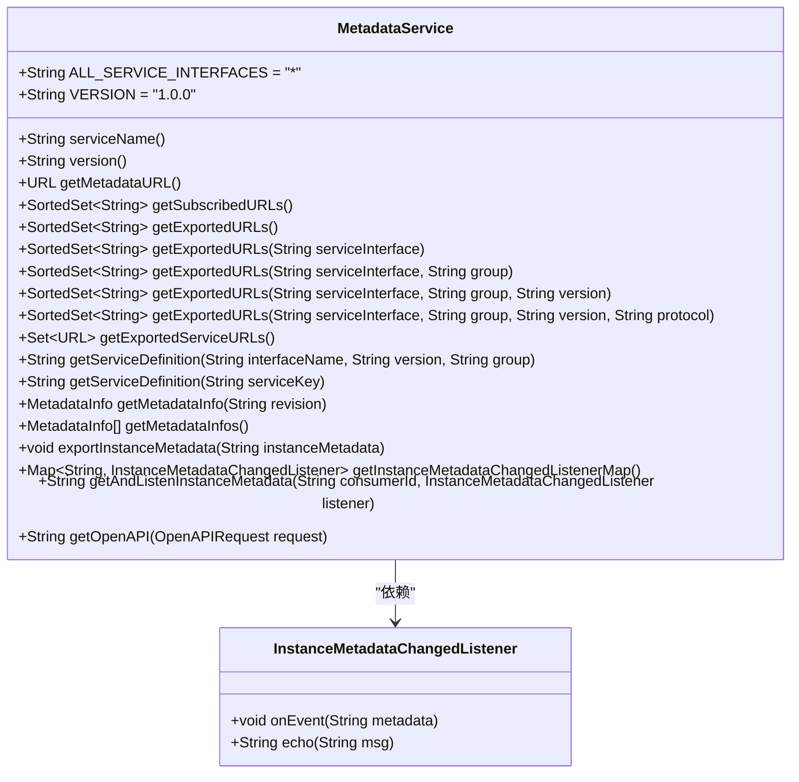
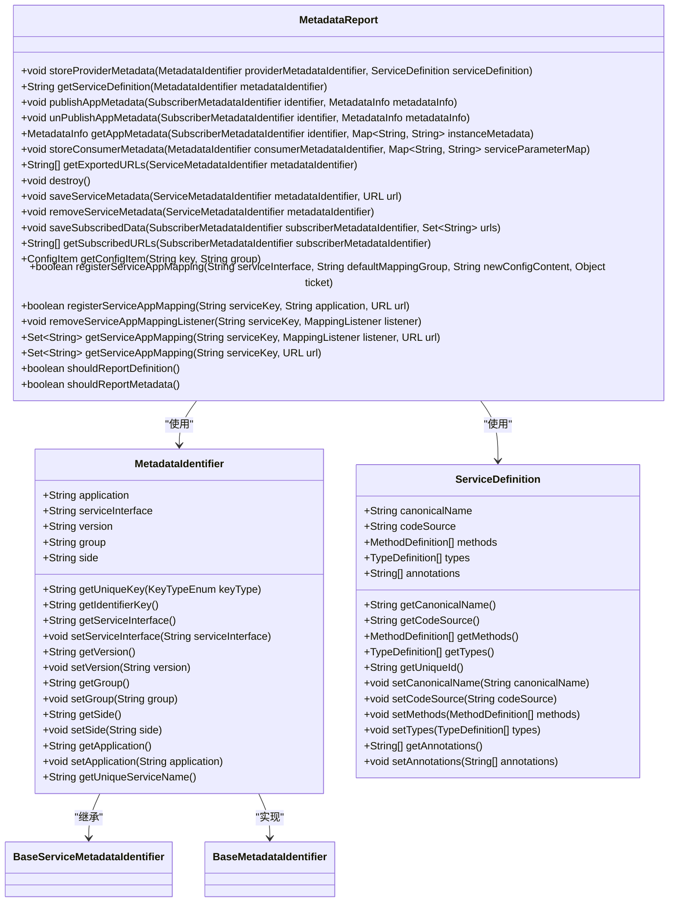
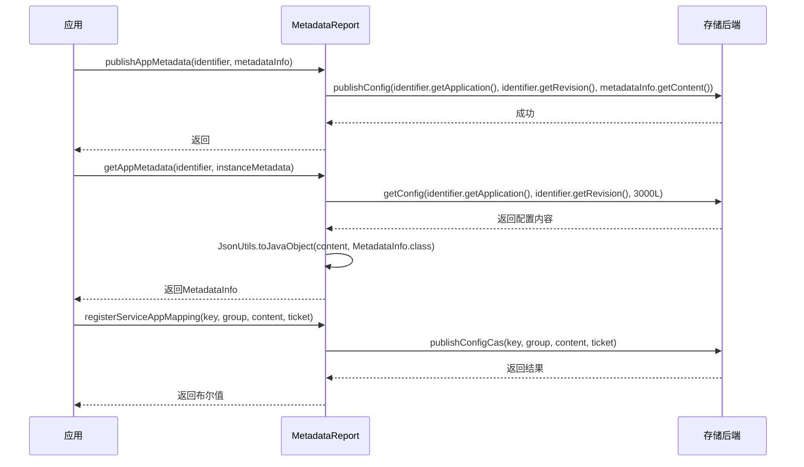
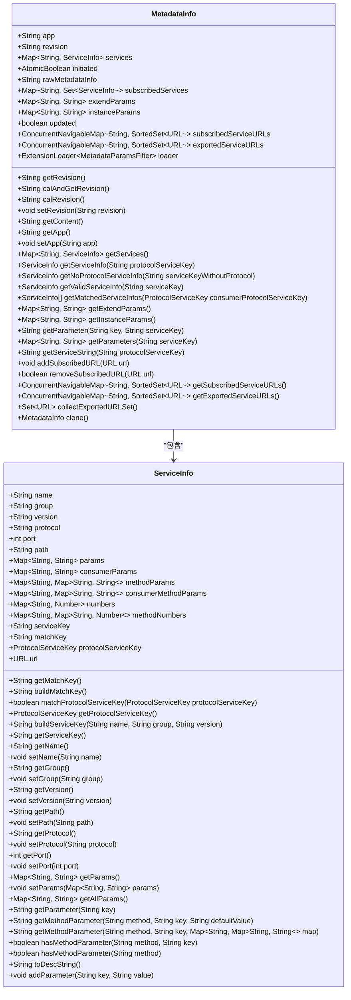
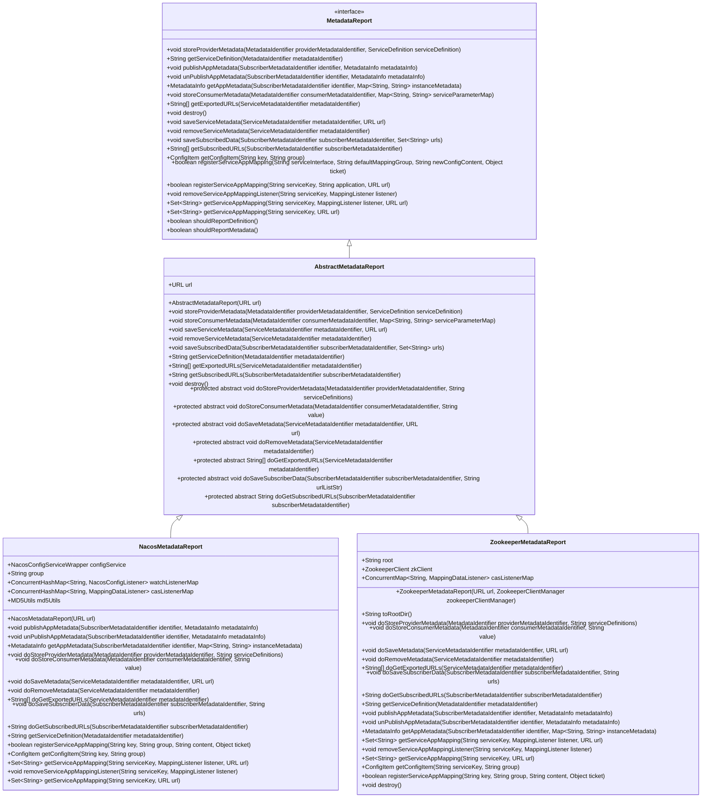
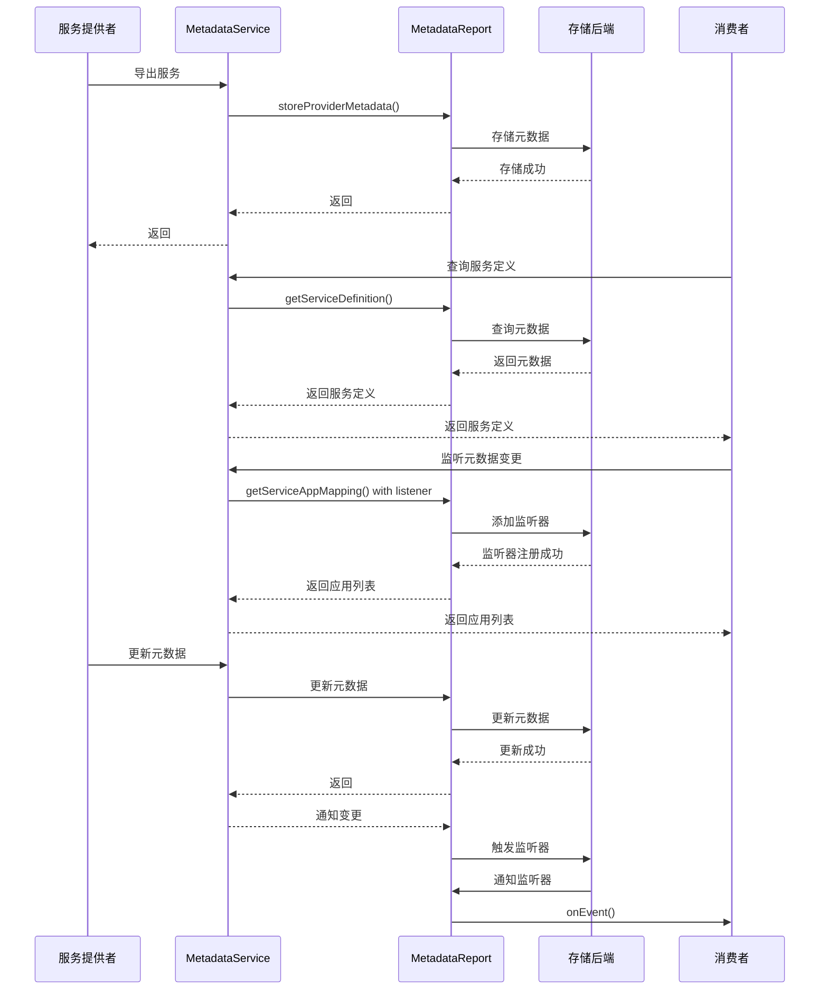

# dubbo-metadata模块

<cite>
**本文档中引用的文件**
- [MetadataService.java](file://dubbo-metadata\dubbo-metadata-api\src\main\java\org\apache\dubbo\metadata\MetadataService.java)
- [MetadataReport.java](file://dubbo-metadata\dubbo-metadata-api\src\main\java\org\apache\dubbo\metadata\report\MetadataReport.java)
- [ServiceDefinition.java](file://dubbo-common\src\main\java\org\apache\dubbo\metadata\definition\model\ServiceDefinition.java)
- [MetadataIdentifier.java](file://dubbo-metadata\dubbo-metadata-api\src\main\java\org\apache\dubbo\metadata\report\identifier\MetadataIdentifier.java)
- [NacosMetadataReport.java](file://dubbo-metadata\dubbo-metadata-report-nacos\src\main\java\org\apache\dubbo\metadata\store\nacos\NacosMetadataReport.java)
- [ZookeeperMetadataReport.java](file://dubbo-metadata\dubbo-metadata-report-zookeeper\src\main\java\org\apache\dubbo\metadata\store\zookeeper\ZookeeperMetadataReport.java)
- [InstanceMetadataChangedListener.java](file://dubbo-metadata\dubbo-metadata-api\src\main\java\org\apache\dubbo\metadata\InstanceMetadataChangedListener.java)
- [MetadataInfo.java](file://dubbo-metadata\dubbo-metadata-api\src\main\java\org\apache\dubbo\metadata\MetadataInfo.java)
</cite>

## 目录
1. [引言](#引言)
2. [核心组件](#核心组件)
3. [MetadataService接口设计](#metadataservice接口设计)
4. [元数据存储与查询机制](#元数据存储与查询机制)
5. [MetadataReport上报与同步](#metadatareport上报与同步)
6. [元数据版本管理与变更通知](#元数据版本管理与变更通知)
7. [多存储后端支持](#多存储后端支持)
8. [元数据查询示例](#元数据查询示例)
9. [元数据治理方案](#元数据治理方案)
10. [架构图与流程图](#架构图与流程图)

## 引言

dubbo-metadata模块是Apache Dubbo框架中负责元数据管理的核心组件，为服务治理提供了强大的元数据支持能力。该模块通过统一的接口和实现，实现了服务元数据的存储、查询、上报和同步功能，支持多种存储后端，包括Nacos、Zookeeper等主流注册中心。本文档将全面介绍dubbo-metadata模块的设计原理和实现细节，为开发者提供从入门到精通的完整指南。

**本节不分析具体源文件，因此不提供源文件引用**

## 核心组件

dubbo-metadata模块由多个核心组件构成，这些组件协同工作以实现完整的元数据管理功能。主要组件包括MetadataService接口、MetadataReport接口、MetadataIdentifier标识符、ServiceDefinition服务定义以及MetadataInfo元数据信息等。这些组件共同构成了一个完整的元数据管理体系，支持服务发现、配置管理和治理决策。

**本节不分析具体源文件，因此不提供源文件引用**

## MetadataService接口设计

MetadataService接口是dubbo-metadata模块的核心接口，定义了元数据服务的基本功能。该接口提供了获取导出URL、订阅URL、服务定义等关键方法，为消费者查询提供者元数据和管理控制台查询进程元数据提供了标准途径。

接口中定义了VERSION常量，确保契约版本的兼容性。通过getExportedURLs系列方法，可以按服务接口、分组、版本和协议等维度查询导出的URL信息。getServiceDefinition方法用于获取接口定义，支持通过服务键查询服务定义信息。

MetadataService还提供了元数据变更监听功能，通过exportInstanceMetadata、getInstanceMetadataChangedListenerMap和getAndListenInstanceMetadata等方法，实现了服务实例元数据的导出和监听机制，支持消费者获取服务实例元数据。



**Diagram sources**
- [MetadataService.java](file://dubbo-metadata\dubbo-metadata-api\src\main\java\org\apache\dubbo\metadata\MetadataService.java#L43-L243)
- [InstanceMetadataChangedListener.java](file://dubbo-metadata\dubbo-metadata-api\src\main\java\org\apache\dubbo\metadata\InstanceMetadataChangedListener.java#L19-L35)

**Section sources**
- [MetadataService.java](file://dubbo-metadata\dubbo-metadata-api\src\main\java\org\apache\dubbo\metadata\MetadataService.java#L43-L243)

## 元数据存储与查询机制

dubbo-metadata模块通过MetadataReport接口定义了元数据存储和查询的抽象层。该接口提供了storeProviderMetadata、getServiceDefinition等方法，用于存储和查询服务提供者的元数据信息。对于消费者元数据，提供了storeConsumerMetadata方法进行存储。

元数据存储基于MetadataIdentifier标识符进行定位，每个元数据项都有唯一的标识符。服务元数据通过ServiceMetadataIdentifier进行标识，订阅元数据通过SubscriberMetadataIdentifier进行标识。这种设计使得元数据的存储和查询具有良好的结构化和可扩展性。

查询机制支持按服务键、分组、版本等维度进行精确查询，同时也支持批量查询和监听变更。通过getExportedURLs方法可以获取导出的服务URL列表，通过getSubscribedURLs方法可以获取订阅的服务URL列表。



**Diagram sources**
- [MetadataReport.java](file://dubbo-metadata\dubbo-metadata-api\src\main\java\org\apache\dubbo\metadata\report\MetadataReport.java#L33-L98)
- [MetadataIdentifier.java](file://dubbo-metadata\dubbo-metadata-api\src\main\java\org\apache\dubbo\metadata\report\identifier\MetadataIdentifier.java#L28-L111)
- [ServiceDefinition.java](file://dubbo-common\src\main\java\org\apache\dubbo\metadata\definition\model\ServiceDefinition.java#L30-L136)

**Section sources**
- [MetadataReport.java](file://dubbo-metadata\dubbo-metadata-api\src\main\java\org\apache\dubbo\metadata\report\MetadataReport.java#L33-L98)
- [MetadataIdentifier.java](file://dubbo-metadata\dubbo-metadata-api\src\main\java\org\apache\dubbo\metadata\report\identifier\MetadataIdentifier.java#L28-L111)
- [ServiceDefinition.java](file://dubbo-common\src\main\java\org\apache\dubbo\metadata\definition\model\ServiceDefinition.java#L30-L136)

## MetadataReport上报与同步

MetadataReport接口的实现负责元数据的上报和同步功能。通过publishAppMetadata和unPublishAppMetadata方法，可以发布和取消发布应用级别的元数据信息。getAppMetadata方法用于获取应用元数据，支持实例元数据的传递。

上报机制采用异步方式进行，确保不影响主业务流程的性能。同步机制通过监听器模式实现，当元数据发生变化时，通知所有注册的监听器。registerServiceAppMapping方法支持服务到应用的映射注册，支持CAS（Compare-And-Swap）操作，确保数据一致性。

元数据的存储和删除操作通过saveServiceMetadata和removeServiceMetadata方法实现，支持服务元数据的持久化管理。saveSubscribedData方法用于保存订阅数据，支持消费者端的元数据同步。



**Diagram sources**
- [MetadataReport.java](file://dubbo-metadata\dubbo-metadata-api\src\main\java\org\apache\dubbo\metadata\report\MetadataReport.java#L44-L98)

**Section sources**
- [MetadataReport.java](file://dubbo-metadata\dubbo-metadata-api\src\main\java\org\apache\dubbo\metadata\report\MetadataReport.java#L44-L98)

## 元数据版本管理与变更通知

dubbo-metadata模块通过MetadataInfo类实现了元数据的版本管理。MetadataInfo包含revision字段，用于标识元数据的版本。calAndGetRevision方法负责计算和获取最新的元数据版本，确保版本信息的准确性和一致性。

变更通知机制通过监听器模式实现。当元数据发生变化时，通过MappingListener监听器通知所有订阅方。getServiceAppMapping方法支持添加监听器，当服务到应用的映射关系发生变化时，触发监听器的onEvent方法。

MetadataInfo类还包含updated标志位，用于标识元数据是否已更新。当添加或删除服务时，updated标志位被设置为true，触发版本重新计算。这种设计确保了元数据版本的精确控制和高效更新。



**Diagram sources**
- [MetadataInfo.java](file://dubbo-metadata\dubbo-metadata-api\src\main\java\org\apache\dubbo\metadata\MetadataInfo.java#L58-L800)

**Section sources**
- [MetadataInfo.java](file://dubbo-metadata\dubbo-metadata-api\src\main\java\org\apache\dubbo\metadata\MetadataInfo.java#L58-L800)

## 多存储后端支持

dubbo-metadata模块通过SPI机制支持多种存储后端，包括Nacos、Zookeeper等。每种存储后端都有对应的MetadataReport实现，如NacosMetadataReport和ZookeeperMetadataReport。这些实现类继承自AbstractMetadataReport抽象类，实现了具体的存储和查询逻辑。

Nacos作为配置中心，提供了高可用的元数据存储服务。NacosMetadataReport通过Nacos的配置管理功能，实现了元数据的持久化存储和变更监听。Zookeeper作为分布式协调服务，提供了强一致性的元数据存储。ZookeeperMetadataReport通过Zookeeper的节点管理功能，实现了元数据的树形结构存储。

存储后端的选择通过URL参数配置，支持灵活的部署方案。不同的存储后端在性能、可用性和一致性方面有不同的特点，可以根据实际需求进行选择和配置。



**Diagram sources**
- [MetadataReport.java](file://dubbo-metadata\dubbo-metadata-api\src\main\java\org\apache\dubbo\metadata\report\MetadataReport.java#L33-L98)
- [NacosMetadataReport.java](file://dubbo-metadata\dubbo-metadata-report-nacos\src\main\java\org\apache\dubbo\metadata\store\nacos\NacosMetadataReport.java#L74-L550)
- [ZookeeperMetadataReport.java](file://dubbo-metadata\dubbo-metadata-report-zookeeper\src\main\java\org\apache\dubbo\metadata\store\zookeeper\ZookeeperMetadataReport.java#L56-L268)

**Section sources**
- [MetadataReport.java](file://dubbo-metadata\dubbo-metadata-api\src\main\java\org\apache\dubbo\metadata\report\MetadataReport.java#L33-L98)
- [NacosMetadataReport.java](file://dubbo-metadata\dubbo-metadata-report-nacos\src\main\java\org\apache\dubbo\metadata\store\nacos\NacosMetadataReport.java#L74-L550)
- [ZookeeperMetadataReport.java](file://dubbo-metadata\dubbo-metadata-report-zookeeper\src\main\java\org\apache\dubbo\metadata\store\zookeeper\ZookeeperMetadataReport.java#L56-L268)

## 元数据查询示例

对于初学者，可以通过MetadataService接口进行简单的元数据查询。以下是一些常见的查询示例：

1. 查询所有导出的服务URL：
```java
SortedSet<String> exportedURLs = metadataService.getExportedURLs();
```

2. 按服务接口查询导出的URL：
```java
SortedSet<String> exportedURLs = metadataService.getExportedURLs("com.example.DemoService");
```

3. 按服务接口、分组和版本查询导出的URL：
```java
SortedSet<String> exportedURLs = metadataService.getExportedURLs("com.example.DemoService", "demo", "1.0.0");
```

4. 查询服务定义信息：
```java
String serviceDefinition = metadataService.getServiceDefinition("com.example.DemoService", "1.0.0", "demo");
```

5. 获取元数据信息：
```java
MetadataInfo metadataInfo = metadataService.getMetadataInfo("revision-123");
```

这些查询方法提供了灵活的元数据访问能力，支持按不同维度进行精确查询。

**本节不分析具体源文件，因此不提供源文件引用**

## 元数据治理方案

对于经验丰富的开发者，dubbo-metadata模块提供了丰富的元数据治理方案。通过MetadataReport接口，可以实现元数据的精细化管理。例如，通过registerServiceAppMapping方法可以注册服务到应用的映射关系，支持服务治理决策。

元数据版本管理方案通过MetadataInfo的revision机制实现，支持元数据的版本控制和变更追踪。通过calAndGetRevision方法可以获取最新的元数据版本，确保治理决策的准确性。

变更通知方案通过监听器模式实现，支持实时感知元数据变化。通过getServiceAppMapping方法可以添加监听器，当服务到应用的映射关系发生变化时，触发相应的治理逻辑。

存储后端治理方案支持多后端选择和配置，可以根据性能、可用性和一致性需求进行优化。Nacos适合高可用场景，Zookeeper适合强一致性场景，可以根据实际需求进行选择。

**本节不分析具体源文件，因此不提供源文件引用**

## 架构图与流程图

```mermaid
graph TD
subgraph "应用层"
A[服务提供者]
B[服务消费者]
C[管理控制台]
end
subgraph "元数据层"
D[MetadataService]
E[MetadataReport]
F[MetadataInfo]
G[ServiceDefinition]
end
subgraph "存储层"
H[Nacos]
I[Zookeeper]
J[其他存储]
end
A --> D: 导出元数据
B --> D: 查询元数据
C --> D: 管理元数据
D --> E: 上报元数据
E --> F: 存储元数据
E --> G: 查询元数据
F --> H: Nacos存储
F --> I: Zookeeper存储
F --> J: 其他存储
G --> H: Nacos查询
G --> I: Zookeeper查询
G --> J: 其他查询
style A fill:#f9f,stroke:#333
style B fill:#f9f,stroke:#333
style C fill:#f9f,stroke:#333
style D fill:#bbf,stroke:#333
style E fill:#bbf,stroke:#333
style F fill:#bbf,stroke:#333
style G fill:#bbf,stroke:#333
style H fill:#9f9,stroke:#333
style I fill:#9f9,stroke:#333
style J fill:#9f9,stroke:#333
```



**Diagram sources**
- [MetadataService.java](file://dubbo-metadata\dubbo-metadata-api\src\main\java\org\apache\dubbo\metadata\MetadataService.java#L43-L243)
- [MetadataReport.java](file://dubbo-metadata\dubbo-metadata-api\src\main\java\org\apache\dubbo\metadata\report\MetadataReport.java#L33-L98)

**Section sources**
- [MetadataService.java](file://dubbo-metadata\dubbo-metadata-api\src\main\java\org\apache\dubbo\metadata\MetadataService.java#L43-L243)
- [MetadataReport.java](file://dubbo-metadata\dubbo-metadata-api\src\main\java\org\apache\dubbo\metadata\report\MetadataReport.java#L33-L98)