# 元数据上报

<cite>
**本文档引用的文件**   
- [MetadataReport.java](file://dubbo-metadata\dubbo-metadata-api\src\main\java\org\apache\dubbo\metadata\report\MetadataReport.java)
- [AbstractMetadataReport.java](file://dubbo-metadata\dubbo-metadata-api\src\main\java\org\apache\dubbo\metadata\report\support\AbstractMetadataReport.java)
- [NacosMetadataReport.java](file://dubbo-metadata\dubbo-metadata-report-nacos\src\main\java\org\apache\dubbo\metadata\store\nacos\NacosMetadataReport.java)
- [ZookeeperMetadataReport.java](file://dubbo-metadata\dubbo-metadata-report-zookeeper\src\main\java\org\apache\dubbo\metadata\store\zookeeper\ZookeeperMetadataReport.java)
- [MetadataInfo.java](file://dubbo-metadata\dubbo-metadata-api\src\main\java\org\apache\dubbo\metadata\MetadataInfo.java)
- [MetadataIdentifier.java](file://dubbo-metadata\dubbo-metadata-api\src\main\java\org\apache\dubbo\metadata\report\identifier\MetadataIdentifier.java)
- [ServiceMetadataIdentifier.java](file://dubbo-metadata\dubbo-metadata-api\src\main\java\org\apache\dubbo\metadata\report\identifier\ServiceMetadataIdentifier.java)
- [SubscriberMetadataIdentifier.java](file://dubbo-metadata\dubbo-metadata-api\src\main\java\org\apache\dubbo\metadata\report\identifier\SubscriberMetadataIdentifier.java)
- [MetadataReportInstance.java](file://dubbo-metadata\dubbo-metadata-api\src\main\java\org\apache\dubbo\metadata\report\MetadataReportInstance.java)
- [MetadataReportConfig.java](file://dubbo-common\src\main\java\org\apache\dubbo\config\MetadataReportConfig.java)
</cite>

## 目录
1. [引言](#引言)
2. [元数据上报核心组件](#元数据上报核心组件)
3. [元数据版本管理与变更通知](#元数据版本管理与变更通知)
4. [多环境同步策略](#多环境同步策略)
5. [存储后端支持](#存储后端支持)
6. [可靠性保障机制](#可靠性保障机制)
7. [配置示例](#配置示例)
8. [错误处理机制](#错误处理机制)
9. [结论](#结论)

## 引言
元数据上报是Dubbo框架中实现服务治理的关键功能之一，它负责将服务的元数据信息上报到远程元数据中心，实现服务信息的集中管理和动态同步。本文档详细介绍了元数据上报的功能、实现机制和配置方法，为开发者提供全面的技术指导。

## 元数据上报核心组件

元数据上报功能由多个核心组件构成，主要包括元数据报告接口、抽象实现类、具体存储实现以及元数据信息模型。

### 元数据报告接口
`MetadataReport`接口定义了元数据上报的核心功能，包括服务定义存储、应用元数据发布、消费者元数据存储等操作。该接口是所有元数据上报实现的基础。

**元数据报告接口功能**
- 服务定义存储与查询
- 应用元数据发布与订阅
- 消费者元数据存储
- 服务元数据保存与删除
- 订阅数据保存与查询

### 抽象实现类
`AbstractMetadataReport`类提供了元数据上报的通用实现，包括本地磁盘缓存、失败重试机制、周期性上报等功能。该类通过模板方法模式，将具体的存储操作留给子类实现。

**抽象实现类特性**
- 支持本地磁盘缓存
- 实现失败重试机制
- 提供周期性上报功能
- 管理上报执行器和定时器

### 具体存储实现
具体存储实现包括Nacos和Zookeeper两种，分别对应`NacosMetadataReport`和`ZookeeperMetadataReport`类。这些实现类负责与具体的注册中心进行交互，完成元数据的持久化存储。

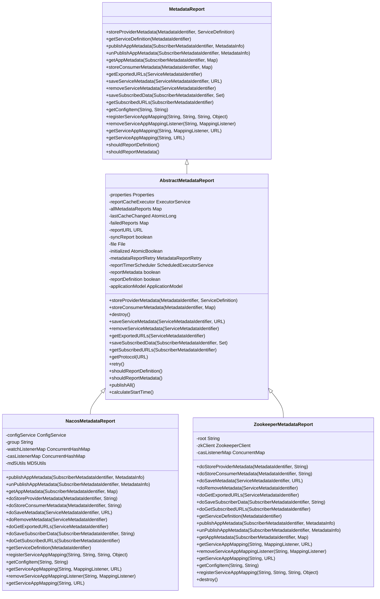

**图表来源**
- [MetadataReport.java](file://dubbo-metadata\dubbo-metadata-api\src\main\java\org\apache\dubbo\metadata\report\MetadataReport.java)
- [AbstractMetadataReport.java](file://dubbo-metadata\dubbo-metadata-api\src\main\java\org\apache\dubbo\metadata\report\support\AbstractMetadataReport.java)
- [NacosMetadataReport.java](file://dubbo-metadata\dubbo-metadata-report-nacos\src\main\java\org\apache\dubbo\metadata\store\nacos\NacosMetadataReport.java)
- [ZookeeperMetadataReport.java](file://dubbo-metadata\dubbo-metadata-report-zookeeper\src\main\java\org\apache\dubbo\metadata\store\zookeeper\ZookeeperMetadataReport.java)

**章节来源**
- [MetadataReport.java](file://dubbo-metadata\dubbo-metadata-api\src\main\java\org\apache\dubbo\metadata\report\MetadataReport.java)
- [AbstractMetadataReport.java](file://dubbo-metadata\dubbo-metadata-api\src\main\java\org\apache\dubbo\metadata\report\support\AbstractMetadataReport.java)
- [NacosMetadataReport.java](file://dubbo-metadata\dubbo-metadata-report-nacos\src\main\java\org\apache\dubbo\metadata\store\nacos\NacosMetadataReport.java)
- [ZookeeperMetadataReport.java](file://dubbo-metadata\dubbo-metadata-report-zookeeper\src\main\java\org\apache\dubbo\metadata\store\zookeeper\ZookeeperMetadataReport.java)

## 元数据版本管理与变更通知

元数据版本管理是确保服务信息一致性的关键机制，通过版本号来标识元数据的变更状态，实现变更通知和同步。

### 元数据信息模型
`MetadataInfo`类是元数据信息的核心模型，包含了应用名称、版本号、服务信息等关键属性。版本号通过`calAndGetRevision`方法计算生成，确保每次元数据变更都能产生唯一的版本标识。

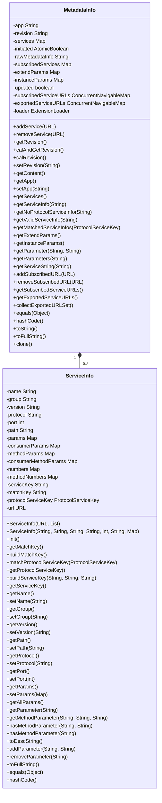

**图表来源**
- [MetadataInfo.java](file://dubbo-metadata\dubbo-metadata-api\src\main\java\org\apache\dubbo\metadata\MetadataInfo.java)

**章节来源**
- [MetadataInfo.java](file://dubbo-metadata\dubbo-metadata-api\src\main\java\org\apache\dubbo\metadata\MetadataInfo.java)

### 版本计算机制
版本号的计算基于应用名称和服务信息的组合，通过MD5算法生成唯一的哈希值。当服务信息发生变化时，版本号也会相应更新，从而触发变更通知。

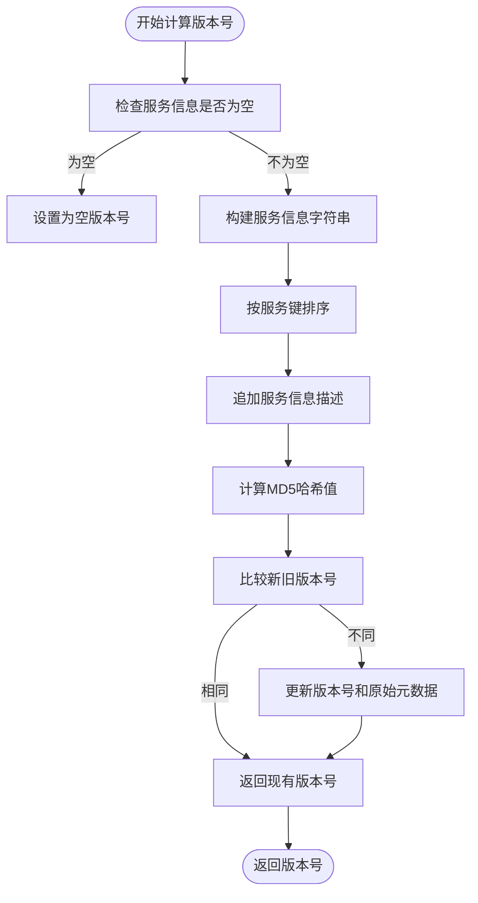

**图表来源**
- [MetadataInfo.java](file://dubbo-metadata\dubbo-metadata-api\src\main\java\org\apache\dubbo\metadata\MetadataInfo.java)

**章节来源**
- [MetadataInfo.java](file://dubbo-metadata\dubbo-metadata-api\src\main\java\org\apache\dubbo\metadata\MetadataInfo.java)

### 变更通知流程
当元数据发生变化时，系统会通过事件总线发布变更事件，通知相关组件进行处理。变更通知包括服务注册、服务注销等操作。

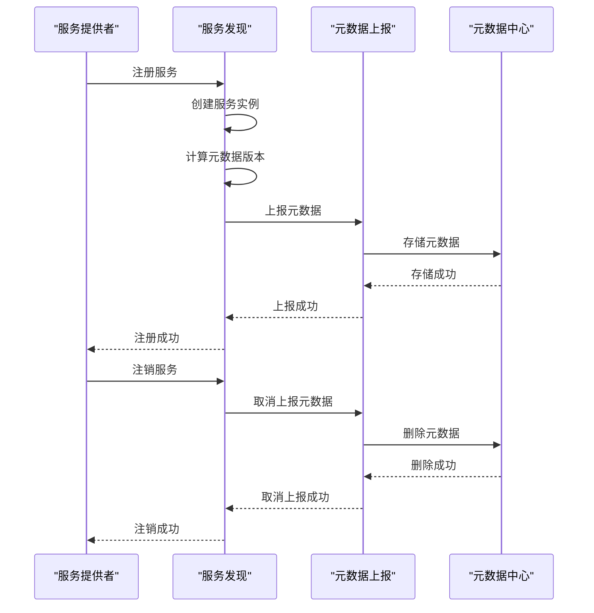

**图表来源**
- [AbstractServiceDiscovery.java](file://dubbo-registry\dubbo-registry-api\src\main\java\org\apache\dubbo\registry\client\AbstractServiceDiscovery.java)
- [MetadataReport.java](file://dubbo-metadata\dubbo-metadata-api\src\main\java\org\apache\dubbo\metadata\report\MetadataReport.java)

**章节来源**
- [AbstractServiceDiscovery.java](file://dubbo-registry\dubbo-registry-api\src\main\java\org\apache\dubbo\registry\client\AbstractServiceDiscovery.java)
- [MetadataReport.java](file://dubbo-metadata\dubbo-metadata-api\src\main\java\org\apache\dubbo\metadata\report\MetadataReport.java)

## 多环境同步策略

元数据上报支持多环境同步，通过不同的标识符来区分不同环境的元数据，实现环境间的隔离和同步。

### 标识符体系
元数据上报使用多种标识符来唯一标识不同的元数据实体，包括服务元数据标识符、订阅者元数据标识符等。

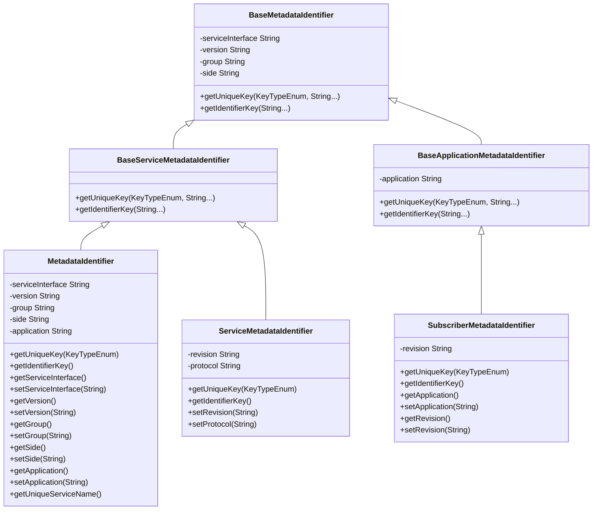

**图表来源**
- [MetadataIdentifier.java](file://dubbo-metadata\dubbo-metadata-api\src\main\java\org\apache\dubbo\metadata\report\identifier\MetadataIdentifier.java)
- [ServiceMetadataIdentifier.java](file://dubbo-metadata\dubbo-metadata-api\src\main\java\org\apache\dubbo\metadata\report\identifier\ServiceMetadataIdentifier.java)
- [SubscriberMetadataIdentifier.java](file://dubbo-metadata\dubbo-metadata-api\src\main\java\org\apache\dubbo\metadata\report\identifier\SubscriberMetadataIdentifier.java)

**章节来源**
- [MetadataIdentifier.java](file://dubbo-metadata\dubbo-metadata-api\src\main\java\org\apache\dubbo\metadata\report\identifier\MetadataIdentifier.java)
- [ServiceMetadataIdentifier.java](file://dubbo-metadata\dubbo-metadata-api\src\main\java\org\apache\dubbo\metadata\report\identifier\ServiceMetadataIdentifier.java)
- [SubscriberMetadataIdentifier.java](file://dubbo-metadata\dubbo-metadata-api\src\main\java\org\apache\dubbo\metadata\report\identifier\SubscriberMetadataIdentifier.java)

### 环境隔离机制
通过应用名称和命名空间来实现不同环境的隔离，确保各环境的元数据互不干扰。

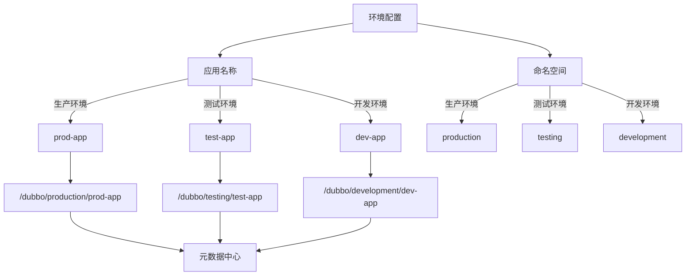

**图表来源**
- [NacosMetadataReport.java](file://dubbo-metadata\dubbo-metadata-report-nacos\src\main\java\org\apache\dubbo\metadata\store\nacos\NacosMetadataReport.java)
- [ZookeeperMetadataReport.java](file://dubbo-metadata\dubbo-metadata-report-zookeeper\src\main\java\org\apache\dubbo\metadata\store\zookeeper\ZookeeperMetadataReport.java)

**章节来源**
- [NacosMetadataReport.java](file://dubbo-metadata\dubbo-metadata-report-nacos\src\main\java\org\apache\dubbo\metadata\store\nacos\NacosMetadataReport.java)
- [ZookeeperMetadataReport.java](file://dubbo-metadata\dubbo-metadata-report-zookeeper\src\main\java\org\apache\dubbo\metadata\store\zookeeper\ZookeeperMetadataReport.java)

## 存储后端支持

元数据上报支持多种存储后端，包括Nacos、Zookeeper等注册中心，通过适配器模式实现统一的接口。

### Nacos存储实现
Nacos作为元数据存储后端，提供了配置管理和服务发现功能。`NacosMetadataReport`类实现了与Nacos的交互，包括配置的发布、获取和监听。

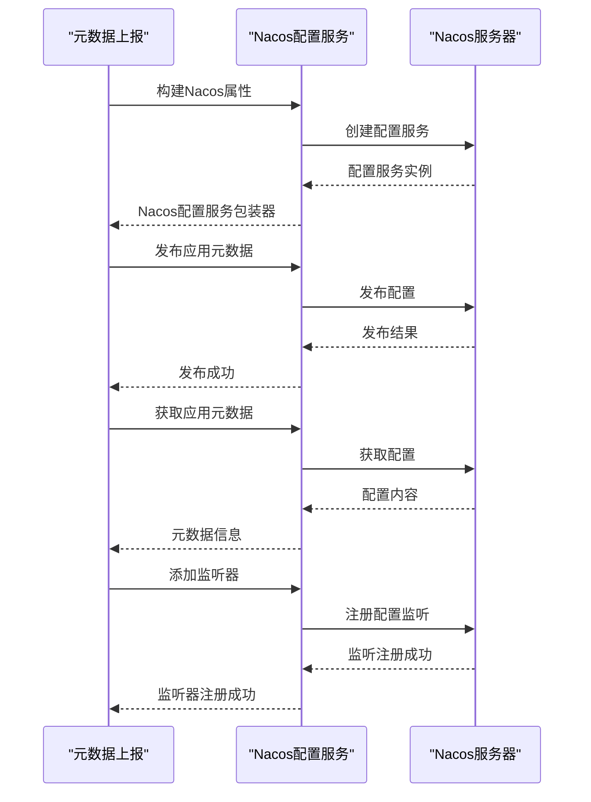

**图表来源**
- [NacosMetadataReport.java](file://dubbo-metadata\dubbo-metadata-report-nacos\src\main\java\org\apache\dubbo\metadata\store\nacos\NacosMetadataReport.java)

**章节来源**
- [NacosMetadataReport.java](file://dubbo-metadata\dubbo-metadata-report-nacos\src\main\java\org\apache\dubbo\metadata\store\nacos\NacosMetadataReport.java)

### Zookeeper存储实现
Zookeeper作为分布式协调服务，提供了可靠的元数据存储能力。`ZookeeperMetadataReport`类通过Curator客户端与Zookeeper进行交互，实现元数据的持久化存储。

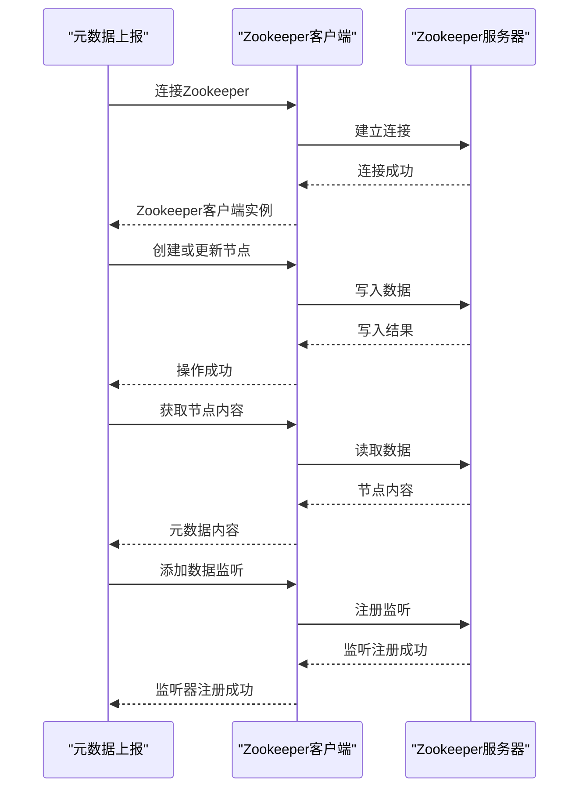

**图表来源**
- [ZookeeperMetadataReport.java](file://dubbo-metadata\dubbo-metadata-report-zookeeper\src\main\java\org\apache\dubbo\metadata\store\zookeeper\ZookeeperMetadataReport.java)

**章节来源**
- [ZookeeperMetadataReport.java](file://dubbo-metadata\dubbo-metadata-report-zookeeper\src\main\java\org\apache\dubbo\metadata\store\zookeeper\ZookeeperMetadataReport.java)

### 存储适配器模式
通过`MetadataReportFactory`接口和`@SPI`注解，实现了存储后端的可扩展性，允许用户自定义存储实现。

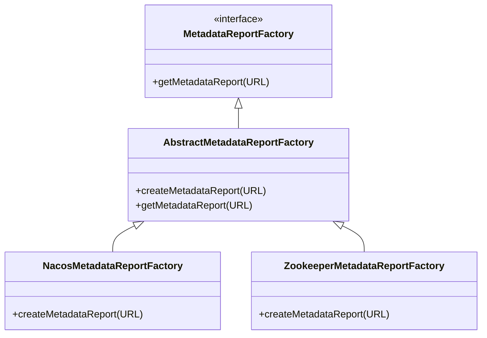

**图表来源**
- [NacosMetadataReportFactory.java](file://dubbo-metadata\dubbo-metadata-report-nacos\src\main\java\org\apache\dubbo\metadata\store\nacos\NacosMetadataReportFactory.java)
- [ZookeeperMetadataReportFactory.java](file://dubbo-metadata\dubbo-metadata-report-zookeeper\src\main\resources\META-INF\dubbo\internal\org.apache.dubbo.metadata.report.MetadataReportFactory)

**章节来源**
- [NacosMetadataReportFactory.java](file://dubbo-metadata\dubbo-metadata-report-nacos\src\main\java\org\apache\dubbo\metadata\store\nacos\NacosMetadataReportFactory.java)
- [ZookeeperMetadataReportFactory.java](file://dubbo-metadata\dubbo-metadata-report-zookeeper\src\main\resources\META-INF\dubbo\internal\org.apache.dubbo.metadata.report.MetadataReportFactory)

## 可靠性保障机制

元数据上报提供了完善的可靠性保障机制，包括重试策略、故障恢复和本地缓存等功能。

### 重试机制
当元数据上报失败时，系统会自动进行重试，确保数据最终能够成功上报。

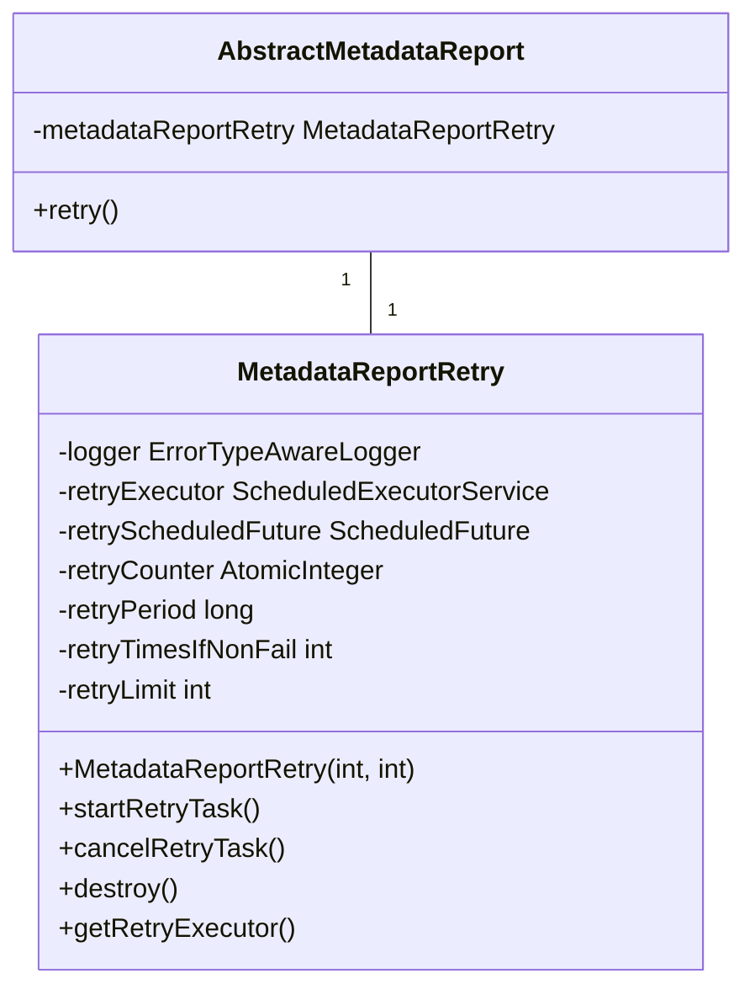

**图表来源**
- [AbstractMetadataReport.java](file://dubbo-metadata\dubbo-metadata-api\src\main\java\org\apache\dubbo\metadata\report\support\AbstractMetadataReport.java)

**章节来源**
- [AbstractMetadataReport.java](file://dubbo-metadata\dubbo-metadata-api\src\main\java\org\apache\dubbo\metadata\report\support\AbstractMetadataReport.java)

### 重试流程
重试流程通过定时任务实现，定期检查失败的上报任务并尝试重新上报。

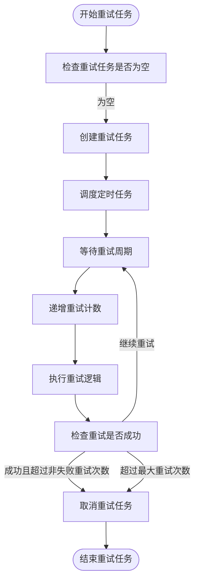

**图表来源**
- [AbstractMetadataReport.java](file://dubbo-metadata\dubbo-metadata-api\src\main\java\org\apache\dubbo\metadata\report\support\AbstractMetadataReport.java)

**章节来源**
- [AbstractMetadataReport.java](file://dubbo-metadata\dubbo-metadata-api\src\main\java\org\apache\dubbo\metadata\report\support\AbstractMetadataReport.java)

### 本地缓存机制
为了提高性能和可靠性，元数据上报实现了本地磁盘缓存，即使远程存储不可用，也能保证数据不丢失。

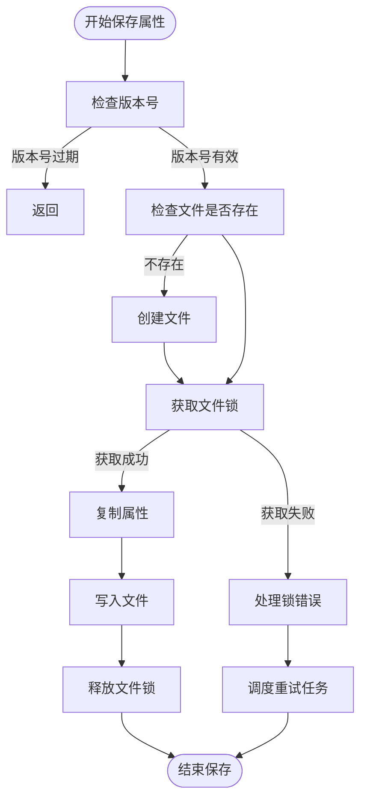

**图表来源**
- [AbstractMetadataReport.java](file://dubbo-metadata\dubbo-metadata-api\src\main\java\org\apache\dubbo\metadata\report\support\AbstractMetadataReport.java)

**章节来源**
- [AbstractMetadataReport.java](file://dubbo-metadata\dubbo-metadata-api\src\main\java\org\apache\dubbo\metadata\report\support\AbstractMetadataReport.java)

## 配置示例

### 基础配置
以下是一个简单的元数据上报配置示例，适用于初学者快速上手。

```xml
<dubbo:metadata-report address="nacos://127.0.0.1:8848" />
```

**章节来源**
- [MetadataReportConfig.java](file://dubbo-common\src\main\java\org\apache\dubbo\config\MetadataReportConfig.java)

### 高级配置
对于经验丰富的开发者，可以使用更详细的配置来优化元数据上报行为。

```xml
<dubbo:metadata-report 
    id="nacos-metadata"
    address="nacos://127.0.0.1:8848"
    group="dubbo"
    namespace="public"
    username="nacos"
    password="nacos"
    report-metadata="true"
    report-definition="true"
    retry-times="3"
    retry-period="3000"
    cycle-report="true"
    sync-report="false" />
```

**章节来源**
- [MetadataReportConfig.java](file://dubbo-common\src\main\java\org\apache\dubbo\config\MetadataReportConfig.java)

### 配置参数说明
| 参数 | 说明 | 默认值 |
|------|------|--------|
| address | 元数据上报地址 | 无 |
| group | 存储组 | dubbo |
| namespace | 命名空间 | 无 |
| username | 用户名 | 无 |
| password | 密码 | 无 |
| report-metadata | 是否上报元数据 | false |
| report-definition | 是否上报定义 | true |
| retry-times | 重试次数 | 3 |
| retry-period | 重试周期（毫秒） | 3000 |
| cycle-report | 是否周期性上报 | false |
| sync-report | 是否同步上报 | false |

**章节来源**
- [MetadataReportConfig.java](file://dubbo-common\src\main\java\org\apache\dubbo\config\MetadataReportConfig.java)

## 错误处理机制

### 错误处理流程
当元数据上报过程中发生错误时，系统会按照预定义的流程进行处理，确保系统的稳定性和数据的完整性。

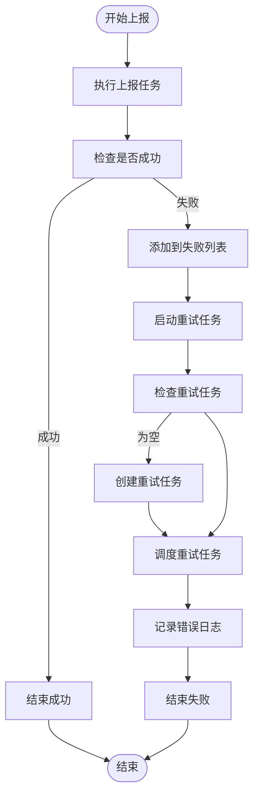

**图表来源**
- [AbstractMetadataReport.java](file://dubbo-metadata\dubbo-metadata-api\src\main\java\org\apache\dubbo\metadata\report\support\AbstractMetadataReport.java)

**章节来源**
- [AbstractMetadataReport.java](file://dubbo-metadata\dubbo-metadata-api\src\main\java\org\apache\dubbo\metadata\report\support\AbstractMetadataReport.java)

### 异常处理策略
系统对不同类型的异常采用不同的处理策略，确保关键操作的可靠性。

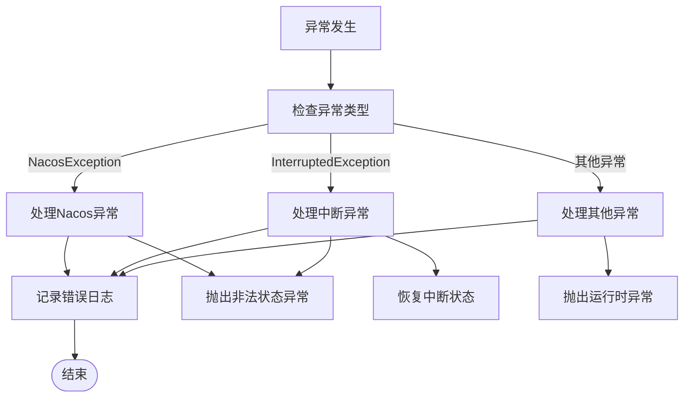

**图表来源**
- [NacosMetadataReport.java](file://dubbo-metadata\dubbo-metadata-report-nacos\src\main\java\org\apache\dubbo\metadata\store\nacos\NacosMetadataReport.java)
- [ZookeeperMetadataReport.java](file://dubbo-metadata\dubbo-metadata-report-zookeeper\src\main\java\org\apache\dubbo\metadata\store\zookeeper\ZookeeperMetadataReport.java)

**章节来源**
- [NacosMetadataReport.java](file://dubbo-metadata\dubbo-metadata-report-nacos\src\main\java\org\apache\dubbo\metadata\store\nacos\NacosMetadataReport.java)
- [ZookeeperMetadataReport.java](file://dubbo-metadata\dubbo-metadata-report-zookeeper\src\main\java\org\apache\dubbo\metadata\store\zookeeper\ZookeeperMetadataReport.java)

## 结论
元数据上报是Dubbo框架中实现服务治理的重要组成部分，通过完善的版本管理、多环境同步、多种存储后端支持和可靠性保障机制，确保了服务信息的准确性和一致性。本文档详细介绍了元数据上报的各个方面，为开发者提供了全面的技术指导和实践参考。