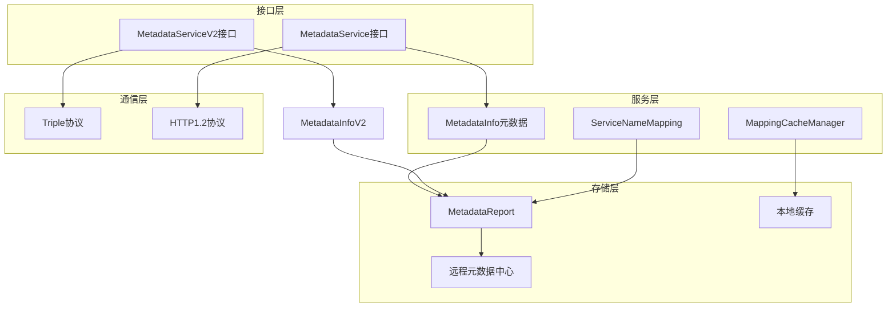
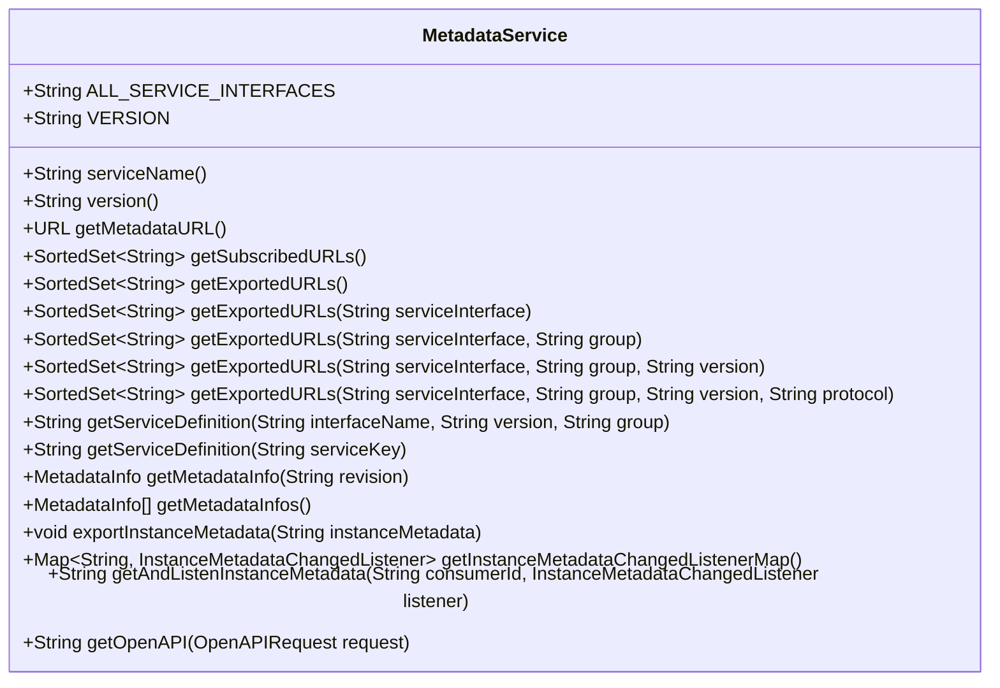
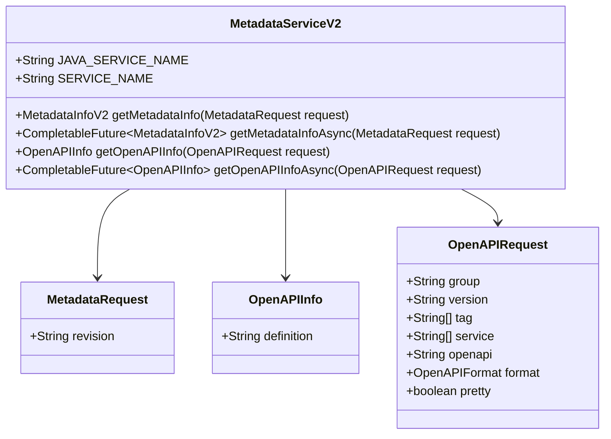
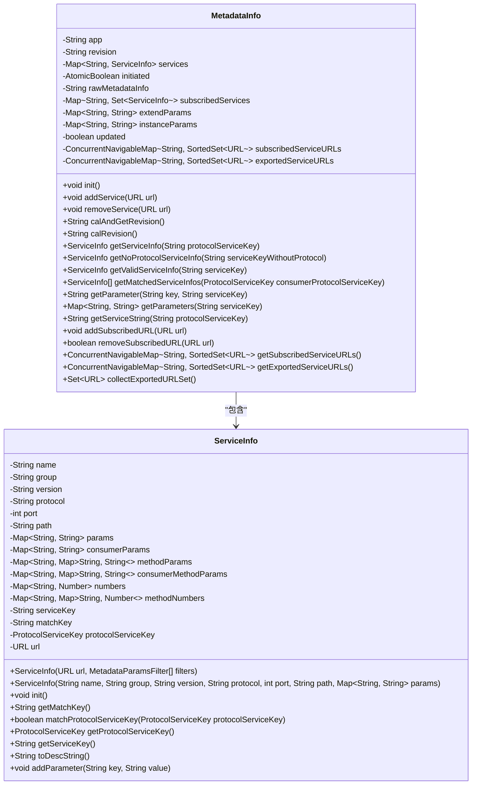
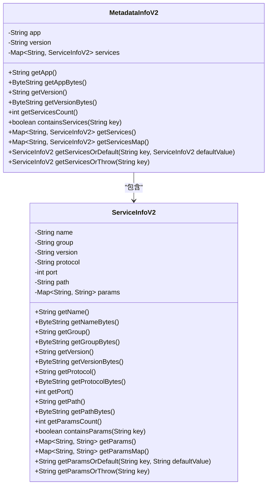
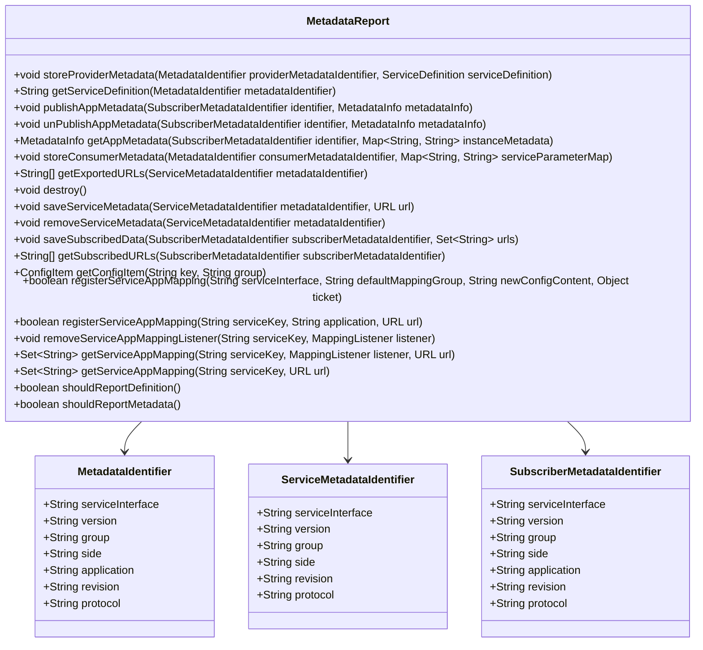
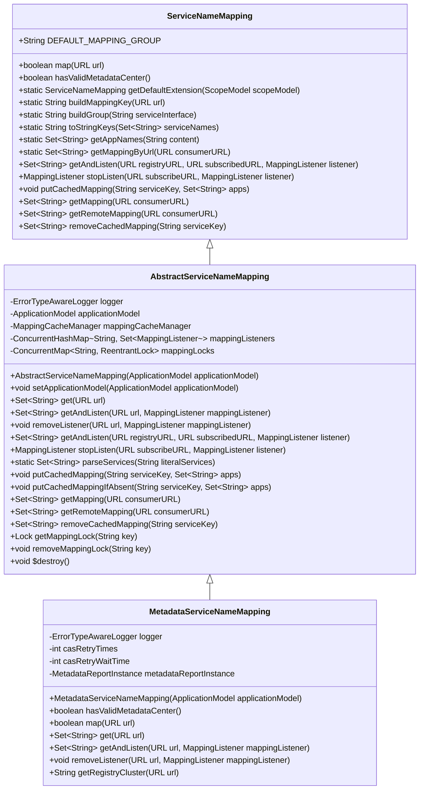
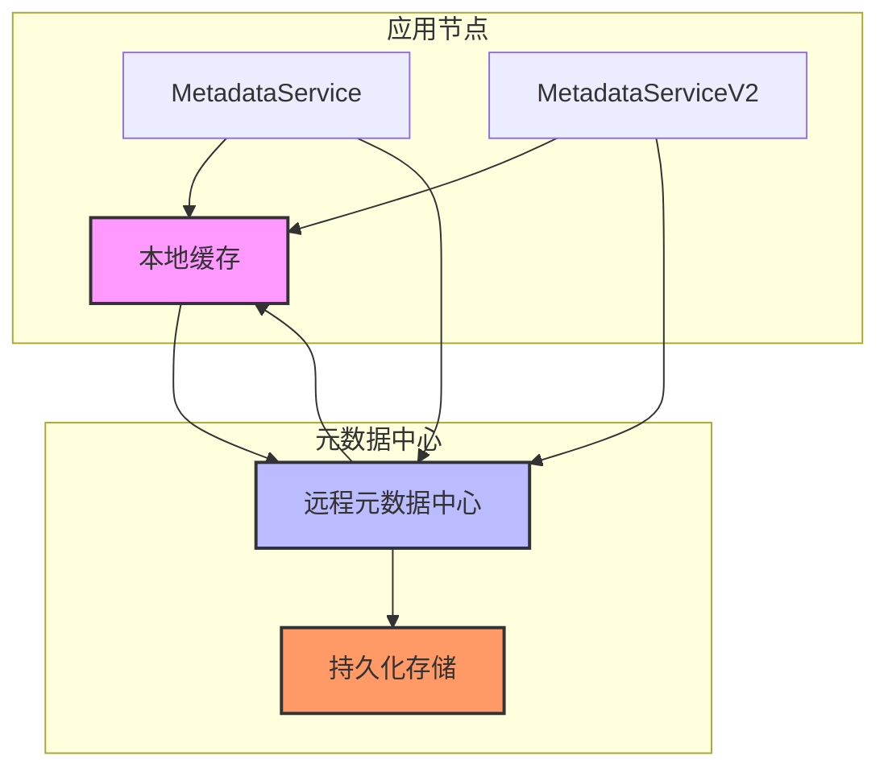
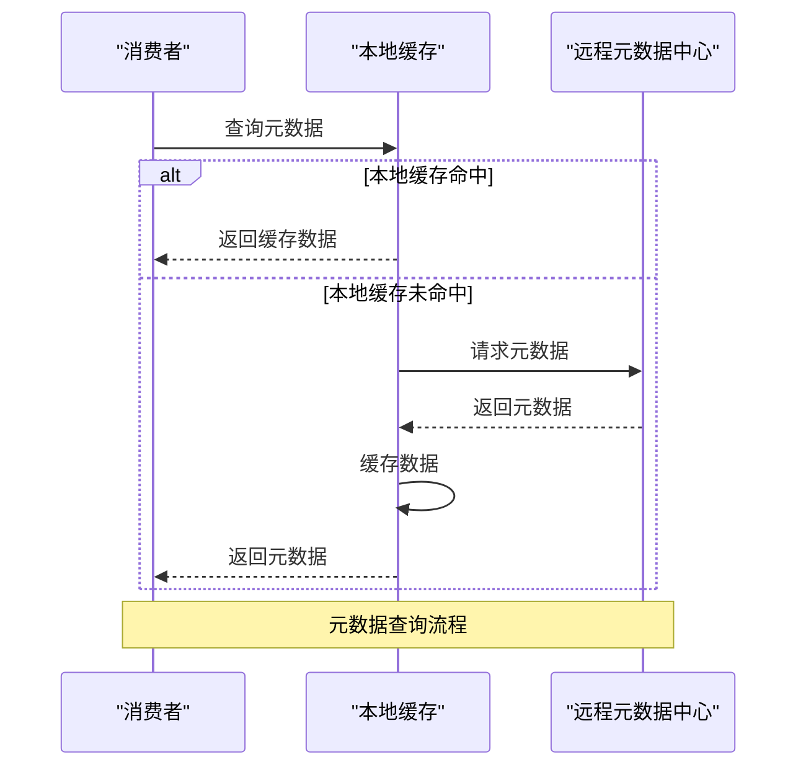
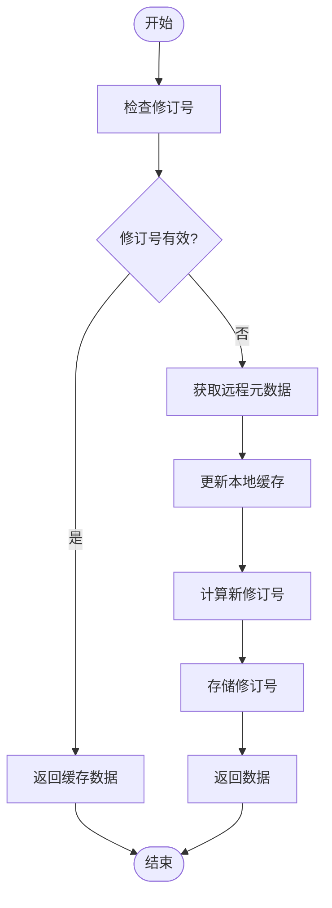

# 元数据服务

<cite>
**本文档引用的文件**   
- [MetadataService.java](file://dubbo-metadata\dubbo-metadata-api\src\main\java\org\apache\dubbo\metadata\MetadataService.java)
- [MetadataServiceV2.java](file://dubbo-metadata\dubbo-metadata-api\src\main\java\org\apache\dubbo\metadata\MetadataServiceV2.java)
- [MetadataInfo.java](file://dubbo-metadata\dubbo-metadata-api\src\main\java\org\apache\dubbo\metadata\MetadataInfo.java)
- [MetadataInfoV2.java](file://dubbo-metadata\dubbo-metadata-api\src\main\java\org\apache\dubbo\metadata\MetadataInfoV2.java)
- [ServiceInfoV2.java](file://dubbo-metadata\dubbo-metadata-api\src\main\java\org\apache\dubbo\metadata\ServiceInfoV2.java)
- [MetadataReport.java](file://dubbo-metadata\dubbo-metadata-api\src\main\java\org\apache\dubbo\metadata\report\MetadataReport.java)
- [ServiceNameMapping.java](file://dubbo-metadata\dubbo-metadata-api\src\main\java\org\apache\dubbo\metadata\ServiceNameMapping.java)
- [MetadataServiceNameMapping.java](file://dubbo-registry\dubbo-registry-api\src\main\java\org\apache\dubbo\registry\client\metadata\MetadataServiceNameMapping.java)
- [MetadataServiceV2OuterClass.java](file://dubbo-metadata\dubbo-metadata-api\src\main\java\org\apache\dubbo\metadata\MetadataServiceV2OuterClass.java)
- [DubboMetadataServiceV2Triple.java](file://dubbo-metadata\dubbo-metadata-api\src\main\java\org\apache\dubbo\metadata\DubboMetadataServiceV2Triple.java)
</cite>

## 目录
1. [简介](#简介)
2. [核心组件](#核心组件)
3. [架构概览](#架构概览)
4. [详细组件分析](#详细组件分析)
5. [元数据存储架构](#元数据存储架构)
6. [元数据查询流程](#元数据查询流程)
7. [元数据治理方案](#元数据治理方案)
8. [结论](#结论)

## 简介
元数据服务是Dubbo框架中的核心组件，负责管理和暴露服务的元数据信息。该服务使消费者能够查询提供者的元数据，包括接口列表和配置信息，同时也支持管理控制台查询特定进程或所有进程的聚合数据。本文档详细介绍了MetadataService接口的设计与实现，阐述了服务元数据的存储结构和查询机制，以及MetadataServiceV2对OpenAPI规范的支持能力。

**Section sources**
- [MetadataService.java](file://dubbo-metadata\dubbo-metadata-api\src\main\java\org\apache\dubbo\metadata\MetadataService.java#L37-L42)

## 核心组件

元数据服务的核心组件包括MetadataService接口、MetadataInfo数据结构、MetadataReport报告机制和ServiceNameMapping服务名称映射。这些组件共同构成了完整的元数据管理体系，支持服务发现、配置管理和动态治理等功能。

**Section sources**
- [MetadataService.java](file://dubbo-metadata\dubbo-metadata-api\src\main\java\org\apache\dubbo\metadata\MetadataService.java#L43-L243)
- [MetadataInfo.java](file://dubbo-metadata\dubbo-metadata-api\src\main\java\org\apache\dubbo\metadata\MetadataInfo.java#L58-L896)
- [MetadataReport.java](file://dubbo-metadata\dubbo-metadata-api\src\main\java\org\apache\dubbo\metadata\report\MetadataReport.java#L33-L98)

## 架构概览

元数据服务采用分层架构设计，包括接口层、服务层、存储层和通信层。接口层提供统一的API访问，服务层处理业务逻辑，存储层负责元数据的持久化，通信层实现跨节点的数据同步。

**Diagram sources **
- [MetadataService.java](file://dubbo-metadata\dubbo-metadata-api\src\main\java\org\apache\dubbo\metadata\MetadataService.java)
- [MetadataServiceV2.java](file://dubbo-metadata\dubbo-metadata-api\src\main\java\org\apache\dubbo\metadata\MetadataServiceV2.java)
- [MetadataInfo.java](file://dubbo-metadata\dubbo-metadata-api\src\main\java\org\apache\dubbo\metadata\MetadataInfo.java)
- [MetadataReport.java](file://dubbo-metadata\dubbo-metadata-api\src\main\java\org\apache\dubbo\metadata\report\MetadataReport.java)

## 详细组件分析

### MetadataService接口分析
MetadataService接口是元数据服务的核心，提供了获取导出URL、订阅URL、服务定义和元数据信息等方法。该接口支持版本控制，当前版本为1.0.0。

**Diagram sources **
- [MetadataService.java](file://dubbo-metadata\dubbo-metadata-api\src\main\java\org\apache\dubbo\metadata\MetadataService.java#L43-L243)

### MetadataServiceV2接口分析
MetadataServiceV2接口是MetadataService的升级版本，基于Dubbo Stub框架实现，支持异步调用和OpenAPI规范。该接口使用Protobuf进行数据序列化，提高了性能和兼容性。

**Diagram sources **
- [MetadataServiceV2.java](file://dubbo-metadata\dubbo-metadata-api\src\main\java\org\apache\dubbo\metadata\MetadataServiceV2.java#L21-L43)
- [MetadataServiceV2OuterClass.java](file://dubbo-metadata\dubbo-metadata-api\src\main\java\org\apache\dubbo\metadata\MetadataServiceV2OuterClass.java#L28-L93)

### 元数据存储结构分析
元数据存储结构采用分层设计，包括MetadataInfo、ServiceInfo等核心数据结构。MetadataInfo存储应用级别的元数据，包括应用名称、版本和所有服务信息；ServiceInfo存储单个服务的详细信息，包括名称、分组、版本、协议和参数等。

**Diagram sources **
- [MetadataInfo.java](file://dubbo-metadata\dubbo-metadata-api\src\main\java\org\apache\dubbo\metadata\MetadataInfo.java#L58-L896)

### MetadataInfoV2结构分析
MetadataInfoV2是MetadataInfo的Protobuf版本，用于MetadataServiceV2接口的数据传输。该结构采用Protobuf进行序列化，提高了性能和跨语言兼容性。

**Diagram sources **
- [MetadataInfoV2.java](file://dubbo-metadata\dubbo-metadata-api\src\main\java\org\apache\dubbo\metadata\MetadataInfoV2.java#L26-L800)
- [ServiceInfoV2.java](file://dubbo-metadata\dubbo-metadata-api\src\main\java\org\apache\dubbo\metadata\ServiceInfoV2.java#L26-L800)

### MetadataReport机制分析
MetadataReport是元数据报告机制的核心接口，负责与远程元数据中心交互，存储和查询元数据。该接口支持服务定义、应用元数据和服务-应用映射的存储与查询。

**Diagram sources **
- [MetadataReport.java](file://dubbo-metadata\dubbo-metadata-api\src\main\java\org\apache\dubbo\metadata\report\MetadataReport.java#L33-L98)

### ServiceNameMapping实现分析
ServiceNameMapping是服务名称映射的核心实现，负责管理服务接口与应用名称之间的映射关系。该组件通过与远程元数据中心交互，获取和缓存映射数据，支持动态更新和监听。

**Diagram sources **
- [ServiceNameMapping.java](file://dubbo-metadata\dubbo-metadata-api\src\main\java\org\apache\dubbo\metadata\ServiceNameMapping.java#L43-L123)
- [AbstractServiceNameMapping.java](file://dubbo-metadata\dubbo-metadata-api\src\main\java\org\apache\dubbo\metadata\AbstractServiceNameMapping.java#L49-L271)
- [MetadataServiceNameMapping.java](file://dubbo-registry\dubbo-registry-api\src\main\java\org\apache\dubbo\registry\client\metadata\MetadataServiceNameMapping.java#L49-L207)

## 元数据存储架构

元数据存储架构采用分布式设计，包括本地缓存、远程元数据中心和持久化存储三层。本地缓存提供快速访问，远程元数据中心实现跨节点同步，持久化存储确保数据可靠性。

**Diagram sources **
- [MetadataInfo.java](file://dubbo-metadata\dubbo-metadata-api\src\main\java\org\apache\dubbo\metadata\MetadataInfo.java#L58-L896)
- [MetadataReport.java](file://dubbo-metadata\dubbo-metadata-api\src\main\java\org\apache\dubbo\metadata\report\MetadataReport.java#L33-L98)

## 元数据查询流程

元数据查询流程包括本地查询、远程查询和缓存更新三个阶段。当消费者请求元数据时，首先查询本地缓存，如果未命中则向远程元数据中心发起请求，并将结果缓存到本地。

**Diagram sources **
- [MetadataService.java](file://dubbo-metadata\dubbo-metadata-api\src\main\java\org\apache\dubbo\metadata\MetadataService.java#L167-L169)
- [MetadataInfo.java](file://dubbo-metadata\dubbo-metadata-api\src\main\java\org\apache\dubbo\metadata\MetadataInfo.java#L127-L144)

## 元数据治理方案

元数据治理方案包括元数据版本控制、一致性校验和变更通知机制。通过修订号(revision)实现版本控制，确保元数据的一致性；通过监听器机制实现变更通知，支持动态更新。

**Diagram sources **
- [MetadataInfo.java](file://dubbo-metadata\dubbo-metadata-api\src\main\java\org\apache\dubbo\metadata\MetadataInfo.java#L186-L208)

## 结论
元数据服务是Dubbo框架的核心组件，通过MetadataService接口和相关实现，提供了完整的元数据管理能力。该服务支持服务发现、配置管理和动态治理等功能，为微服务架构提供了重要的基础设施支持。通过合理的架构设计和实现，元数据服务能够满足不同规模和复杂度的应用需求。