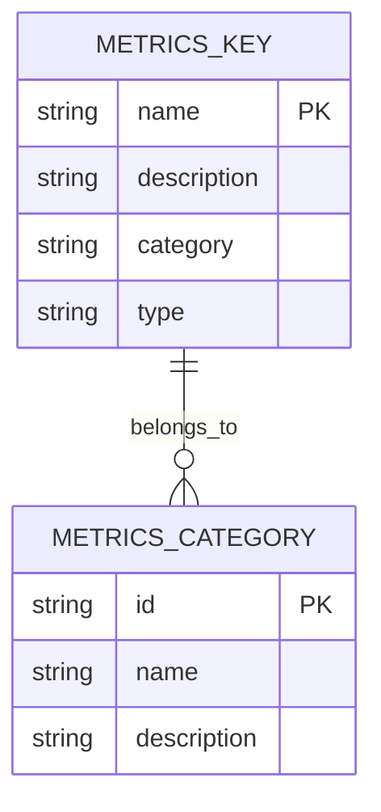
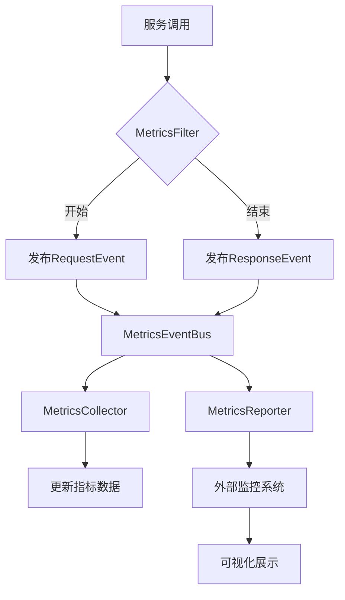
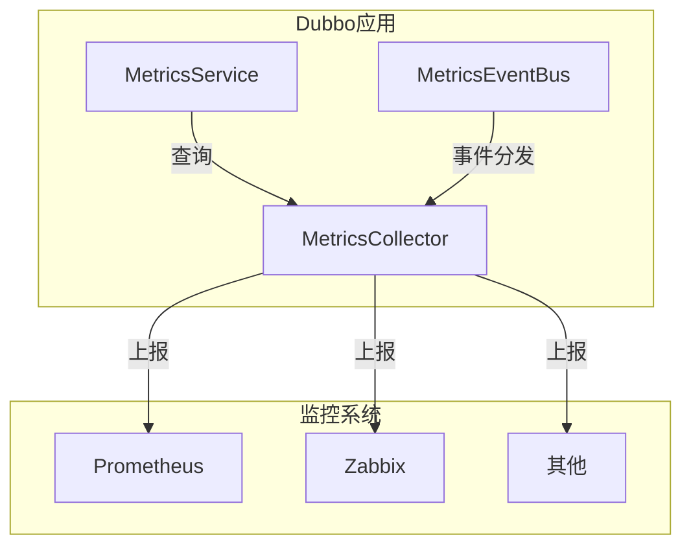

# dubbo-metrics模块

<cite>
**本文档引用的文件**  
- [MetricsService.java](file://dubbo-metrics/dubbo-metrics-api/src/main/java/org/apache/dubbo/metrics/service/MetricsService.java)
- [MetricsKey.java](file://dubbo-metrics/dubbo-metrics-event/src/main/java/org/apache/dubbo/metrics/model/key/MetricsKey.java)
- [MetricsEvent.java](file://dubbo-metrics/dubbo-metrics-event/src/main/java/org/apache/dubbo/metrics/event/MetricsEvent.java)
- [MetricsEventBus.java](file://dubbo-metrics/dubbo-metrics-event/src/main/java/org/apache/dubbo/metrics/event/MetricsEventBus.java)
- [MetricsEventMulticaster.java](file://dubbo-metrics/dubbo-metrics-event/src/main/java/org/apache/dubbo/metrics/event/MetricsEventMulticaster.java)
</cite>

## 目录
1. [简介](#简介)
2. [核心组件](#核心组件)
3. [指标收集机制](#指标收集机制)
4. [指标上报机制](#指标上报机制)
5. [监控系统集成](#监控系统集成)
6. [指标分类与命名规范](#指标分类与命名规范)
7. [使用示例](#使用示例)
8. [监控告警配置](#监控告警配置)
9. [流程图与架构图](#流程图与架构图)

## 简介
dubbo-metrics模块为Dubbo框架提供了全面的指标监控能力，通过Metrics接口设计和实现，支持对服务调用、注册中心、线程池等关键组件的指标收集、聚合和上报。该模块采用事件驱动架构，通过MetricsCollector进行指标收集，MetricsReporter负责指标上报，并支持多种监控系统集成，包括Prometheus等。

## 核心组件

dubbo-metrics模块的核心组件包括MetricsService、MetricsCollector、MetricsReporter以及相关的事件和监听器机制。MetricsService作为指标服务接口，提供了获取各类指标的方法；MetricsCollector负责具体的指标收集策略；MetricsReporter则负责将收集到的指标上报到外部监控系统。

**本节来源**  
- [MetricsService.java](file://dubbo-metrics/dubbo-metrics-api/src/main/java/org/apache/dubbo/metrics/service/MetricsService.java)

## 指标收集机制

dubbo-metrics模块通过MetricsCollector实现指标收集，采用事件驱动的方式监听系统中的各种事件。当特定事件发生时，如服务调用开始或结束，MetricsEvent会被发布到MetricsEventBus，由注册的MetricsListener进行处理并更新相应的指标数据。

MetricsCollector的收集策略基于时间窗口和聚合计算，支持对请求次数、响应时间、错误率等关键指标进行实时统计。收集到的指标数据会被分类存储，便于后续的查询和上报。

**本节来源**  
- [MetricsEvent.java](file://dubbo-metrics/dubbo-metrics-event/src/main/java/org/apache/dubbo/metrics/event/MetricsEvent.java)
- [MetricsEventBus.java](file://dubbo-metrics/dubbo-metrics-event/src/main/java/org/apache/dubbo/metrics/event/MetricsEventBus.java)

## 指标上报机制

指标上报由MetricsReporter负责，通过实现不同的上报策略支持多种监控系统。上报机制采用异步方式，避免对业务逻辑造成性能影响。MetricsReporter会定期从MetricsCollector获取最新的指标数据，并将其格式化为目标监控系统所需的格式进行上报。

上报过程支持配置化，可以根据需要调整上报频率、数据过滤规则等参数。同时，上报机制具备失败重试和错误处理能力，确保指标数据的可靠传输。

**本节来源**  
- [MetricsEventMulticaster.java](file://dubbo-metrics/dubbo-metrics-event/src/main/java/org/apache/dubbo/metrics/event/MetricsEventMulticaster.java)

## 监控系统集成

dubbo-metrics模块支持与多种监控系统的集成，包括Prometheus、Zabbix等。通过插件化设计，可以方便地扩展对新的监控系统的支持。对于Prometheus集成，模块提供了HTTP端点暴露指标数据，符合Prometheus的抓取规范。

集成架构采用适配器模式，每个监控系统对应一个特定的Reporter实现，负责将通用的指标数据转换为目标系统的特定格式。这种设计保证了核心指标收集逻辑的独立性，同时提供了良好的扩展性。

**本节来源**  
- [MetricsKey.java](file://dubbo-metrics/dubbo-metrics-event/src/main/java/org/apache/dubbo/metrics/model/key/MetricsKey.java)

## 指标分类与命名规范

dubbo-metrics模块对指标进行了系统的分类，主要包括应用级指标、服务级指标、方法级指标等。每类指标都有明确的命名规范，采用分层的命名空间结构，便于组织和查询。

指标命名遵循"dubbo.[组件].[指标名].[后缀]"的模式，其中组件表示指标所属的系统组件，指标名描述具体的度量内容，后缀表示统计方式或单位。例如，"dubbo.provider.requests.total"表示服务提供方的总请求数。

**图表来源**  
- [MetricsKey.java](file://dubbo-metrics/dubbo-metrics-event/src/main/java/org/apache/dubbo/metrics/model/key/MetricsKey.java)

## 使用示例

对于初学者，dubbo-metrics模块提供了简单的指标收集示例。通过配置启用指标收集功能后，系统会自动收集基本的性能指标。开发者也可以通过MetricsService接口查询特定的指标数据，用于监控和分析。

示例代码展示了如何获取服务级别的请求统计指标，包括总请求数、成功请求数和失败请求数等。这些指标可以帮助开发者快速了解服务的运行状况。

**本节来源**  
- [MetricsService.java](file://dubbo-metrics/dubbo-metrics-api/src/main/java/org/apache/dubbo/metrics/service/MetricsService.java)

## 监控告警配置

对于经验丰富的开发者，dubbo-metrics模块支持复杂的监控告警配置。可以通过配置文件定义告警规则，包括阈值条件、告警级别、通知方式等。告警规则支持基于时间窗口的复杂计算，如滑动平均、百分位数等。

告警配置还支持动态更新，无需重启应用即可生效。同时，提供了告警抑制和去重机制，避免告警风暴。开发者可以根据业务需求定制个性化的监控告警策略，提高系统的可观测性。

**本节来源**  
- [MetricsEvent.java](file://dubbo-metrics/dubbo-metrics-event/src/main/java/org/apache/dubbo/metrics/event/MetricsEvent.java)

## 流程图与架构图

**图表来源**  
- [MetricsEventBus.java](file://dubbo-metrics/dubbo-metrics-event/src/main/java/org/apache/dubbo/metrics/event/MetricsEventBus.java)
- [MetricsEventMulticaster.java](file://dubbo-metrics/dubbo-metrics-event/src/main/java/org/apache/dubbo/metrics/event/MetricsEventMulticaster.java)

**图表来源**  
- [MetricsService.java](file://dubbo-metrics/dubbo-metrics-api/src/main/java/org/apache/dubbo/metrics/service/MetricsService.java)
- [MetricsReporter.java](file://dubbo-metrics/dubbo-metrics-default/src/main/java/org/apache/dubbo/metrics/reporter/MetricsReporter.java)