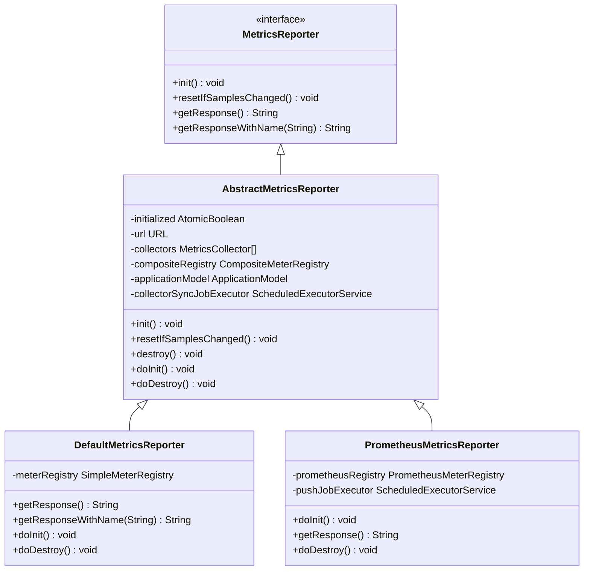
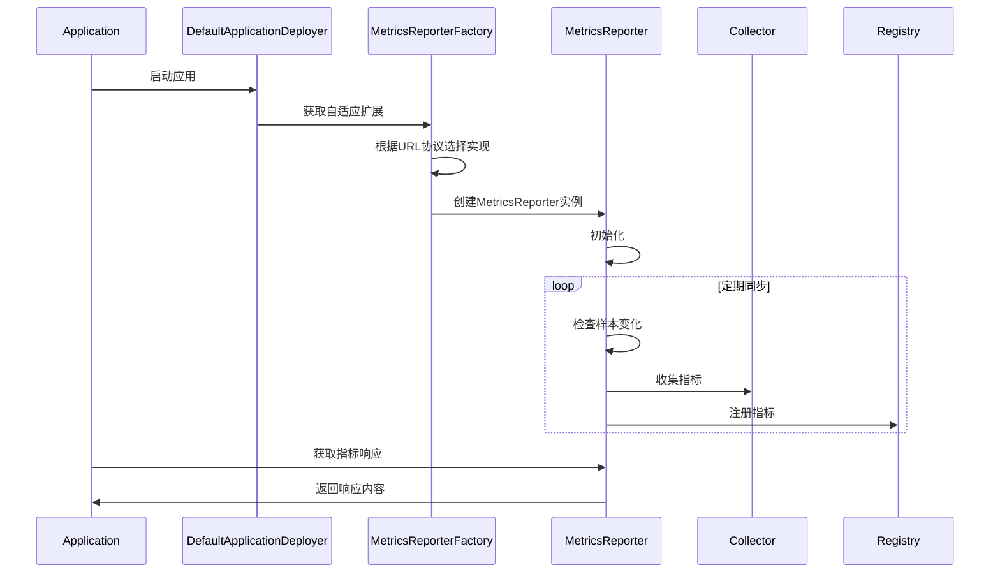

# MetricsReporter接口

<cite>
**本文档中引用的文件**   
- [MetricsReporter.java](file://dubbo-metrics\dubbo-metrics-api\src\main\java\org\apache\dubbo\metrics\report\MetricsReporter.java)
- [MetricsReporterFactory.java](file://dubbo-metrics\dubbo-metrics-api\src\main\java\org\apache\dubbo\metrics\report\MetricsReporterFactory.java)
- [AbstractMetricsReporter.java](file://dubbo-metrics\dubbo-metrics-default\src\main\java\org\apache\dubbo\metrics\report\AbstractMetricsReporter.java)
- [DefaultMetricsReporter.java](file://dubbo-metrics\dubbo-metrics-default\src\main\java\org\apache\dubbo\metrics\report\DefaultMetricsReporter.java)
- [PrometheusMetricsReporter.java](file://dubbo-metrics\dubbo-metrics-prometheus\src\main\java\org\apache\dubbo\metrics\prometheus\PrometheusMetricsReporter.java)
- [DefaultMetricsReporterFactory.java](file://dubbo-metrics\dubbo-metrics-default\src\main\java\org\apache\dubbo\metrics\report\DefaultMetricsReporterFactory.java)
- [PrometheusMetricsReporterFactory.java](file://dubbo-metrics\dubbo-metrics-prometheus\src\main\java\org\apache\dubbo\metrics\prometheus\PrometheusMetricsReporterFactory.java)
- [DefaultApplicationDeployer.java](file://dubbo-config\dubbo-config-api\src\main\java\org\apache\dubbo\config\deploy\DefaultApplicationDeployer.java)
</cite>

## 目录
1. [引言](#引言)
2. [核心方法详解](#核心方法详解)
3. [接口角色与责任](#接口角色与责任)
4. [与其他组件的协同工作](#与其他组件的协同工作)
5. [使用示例](#使用示例)
6. [扩展点与SPI机制](#扩展点与spi机制)
7. [初学者使用指导](#初学者使用指导)
8. [最佳实践与性能考虑](#最佳实践与性能考虑)
9. [架构与实现分析](#架构与实现分析)

## 引言

MetricsReporter接口是Dubbo框架中用于指标上报的核心接口，负责将收集到的性能指标数据上报到特定的监控服务器（如Prometheus）。该接口定义了指标上报的基本行为，包括初始化、重置和获取响应等操作。通过该接口，Dubbo能够灵活地支持多种监控系统，实现指标数据的统一管理和展示。

**接口来源**
- [MetricsReporter.java](file://dubbo-metrics\dubbo-metrics-api\src\main\java\org\apache\dubbo\metrics\report\MetricsReporter.java#L22-L37)

## 核心方法详解

### init方法

`init`方法用于初始化MetricsReporter实例。该方法在MetricsReporter创建后调用，负责设置必要的配置和资源。初始化过程包括添加JVM指标、初始化收集器、调度指标收集同步任务等。该方法确保MetricsReporter在开始工作前处于正确的状态。

**方法来源**
- [MetricsReporter.java](file://dubbo-metrics\dubbo-metrics-api\src\main\java\org\apache\dubbo\metrics\report\MetricsReporter.java#L28)

### resetIfSamplesChanged方法

`resetIfSamplesChanged`方法用于检查并重置指标样本的变化状态。该方法会遍历所有MetricsCollector，检查其样本是否发生变化。如果发生变化，则收集新的样本并注册到Micrometer注册表中。该方法通过CAS操作确保线程安全，避免重复处理。

**方法来源**
- [MetricsReporter.java](file://dubbo-metrics\dubbo-metrics-api\src\main\java\org\apache\dubbo\metrics\report\MetricsReporter.java#L30)

### getResponse方法

`getResponse`方法用于获取指标上报的响应内容。该方法返回一个字符串，包含所有指标的当前值。不同的实现类会根据其上报目标（如Prometheus）生成相应的响应格式。例如，PrometheusMetricsReporter会返回Prometheus格式的指标数据。

**方法来源**
- [MetricsReporter.java](file://dubbo-metrics\dubbo-metrics-api\src\main\java\org\apache\dubbo\metrics\report\MetricsReporter.java#L32)

### getResponseWithName方法

`getResponseWithName`方法是一个默认方法，用于根据指标名称获取特定指标的响应内容。该方法允许用户查询特定指标的值，便于调试和监控。默认实现返回null，具体实现类可以根据需要重写此方法。

**方法来源**
- [MetricsReporter.java](file://dubbo-metrics\dubbo-metrics-api\src\main\java\org\apache\dubbo\metrics\report\MetricsReporter.java#L34-L36)

## 接口角色与责任

MetricsReporter接口在指标上报过程中扮演着核心角色。它负责协调MetricsCollector和外部监控系统之间的数据流动。具体责任包括：

1. **初始化和配置**：在启动时初始化必要的资源和配置。
2. **数据同步**：定期同步MetricsCollector中的指标数据。
3. **格式转换**：将内部指标数据转换为外部监控系统所需的格式。
4. **错误处理**：处理上报过程中的异常情况，确保系统的稳定性。

**责任来源**
- [AbstractMetricsReporter.java](file://dubbo-metrics\dubbo-metrics-default\src\main\java\org\apache\dubbo\metrics\report\AbstractMetricsReporter.java#L89-L99)

## 与其他组件的协同工作

MetricsReporter与MetricsCollector等组件紧密协作，共同完成指标的收集和上报。MetricsCollector负责收集具体的指标数据，而MetricsReporter负责将这些数据上报到外部系统。两者通过MetricSample对象进行数据交换，确保数据的一致性和完整性。

**协同工作来源**
- [AbstractMetricsReporter.java](file://dubbo-metrics\dubbo-metrics-default\src\main\java\org\apache\dubbo\metrics\report\AbstractMetricsReporter.java#L157-L177)

## 使用示例

以下是一个自定义MetricsReporter的实现示例：

```java
public class CustomMetricsReporter implements MetricsReporter {
    private final URL url;
    private final ApplicationModel applicationModel;
    private final CompositeMeterRegistry compositeRegistry;

    public CustomMetricsReporter(URL url, ApplicationModel applicationModel) {
        this.url = url;
        this.applicationModel = applicationModel;
        this.compositeRegistry = MetricsGlobalRegistry.getCompositeRegistry(applicationModel);
    }

    @Override
    public void init() {
        // 初始化逻辑
        addJvmMetrics();
        initCollectors();
        scheduleMetricsCollectorSyncJob();
        doInit();
        registerDubboShutdownHook();
    }

    @Override
    public void resetIfSamplesChanged() {
        collectors.forEach(collector -> {
            if (!collector.calSamplesChanged()) {
                return;
            }
            List<MetricSample> samples = collector.collect();
            for (MetricSample sample : samples) {
                try {
                    registerSample(sample);
                } catch (Exception e) {
                    logger.error(COMMON_METRICS_COLLECTOR_EXCEPTION, "", "", "error occurred when synchronize metrics collector.", e);
                }
            }
        });
    }

    @Override
    public String getResponse() {
        // 生成响应内容
        return "Custom metrics response";
    }
}
```

**使用示例来源**
- [DefaultMetricsReporter.java](file://dubbo-metrics\dubbo-metrics-default\src\main\java\org\apache\dubbo\metrics\report\DefaultMetricsReporter.java#L33-L99)

## 扩展点与SPI机制

MetricsReporter通过SPI机制实现扩展。用户可以通过实现MetricsReporter接口并配置相应的MetricsReporterFactory来添加自定义的指标上报实现。SPI配置文件位于`META-INF/dubbo/internal/org.apache.dubbo.metrics.report.MetricsReporterFactory`，定义了不同协议对应的工厂类。

**扩展点来源**
- [MetricsReporterFactory.java](file://dubbo-metrics\dubbo-metrics-api\src\main\java\org\apache\dubbo\metrics\report\MetricsReporterFactory.java#L28-L38)

## 初学者使用指导

对于初学者，建议从以下几个方面入手：

1. **理解基本概念**：熟悉MetricsReporter、MetricsCollector和MetricSample等核心概念。
2. **阅读文档**：仔细阅读官方文档，了解接口的使用方法和注意事项。
3. **参考示例**：参考DefaultMetricsReporter和PrometheusMetricsReporter的实现，学习最佳实践。
4. **动手实践**：尝试实现一个简单的MetricsReporter，加深理解。

**使用指导来源**
- [DefaultMetricsReporter.java](file://dubbo-metrics\dubbo-metrics-default\src\main\java\org\apache\dubbo\metrics\report\DefaultMetricsReporter.java#L33-L99)

## 最佳实践与性能考虑

在使用MetricsReporter时，应注意以下几点：

1. **线程安全**：确保在多线程环境下正确处理共享资源。
2. **性能优化**：避免在关键路径上执行耗时操作，合理使用缓存。
3. **错误处理**：妥善处理异常情况，防止影响主业务流程。
4. **资源管理**：及时释放不再使用的资源，避免内存泄漏。

**性能考虑来源**
- [AbstractMetricsReporter.java](file://dubbo-metrics\dubbo-metrics-default\src\main\java\org\apache\dubbo\metrics\report\AbstractMetricsReporter.java#L230-L235)

## 架构与实现分析

### 类图



**类图来源**
- [AbstractMetricsReporter.java](file://dubbo-metrics\dubbo-metrics-default\src\main\java\org\apache\dubbo\metrics\report\AbstractMetricsReporter.java#L62-L240)
- [DefaultMetricsReporter.java](file://dubbo-metrics\dubbo-metrics-default\src\main\java\org\apache\dubbo\metrics\report\DefaultMetricsReporter.java#L33-L99)
- [PrometheusMetricsReporter.java](file://dubbo-metrics\dubbo-metrics-prometheus\src\main\java\org\apache\dubbo\metrics\prometheus\PrometheusMetricsReporter.java#L50-L131)

### 序列图



**序列图来源**
- [DefaultApplicationDeployer.java](file://dubbo-config\dubbo-config-api\src\main\java\org\apache\dubbo\config\deploy\DefaultApplicationDeployer.java#L518-L564)