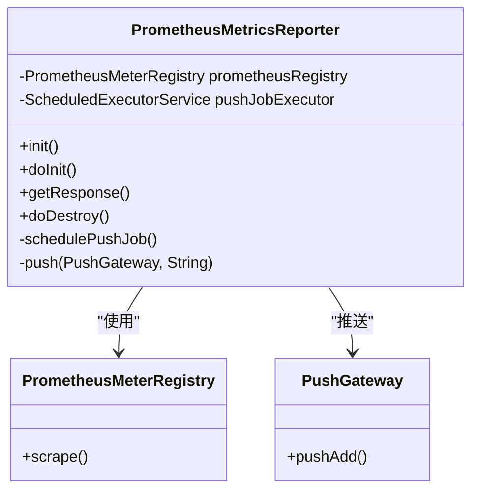
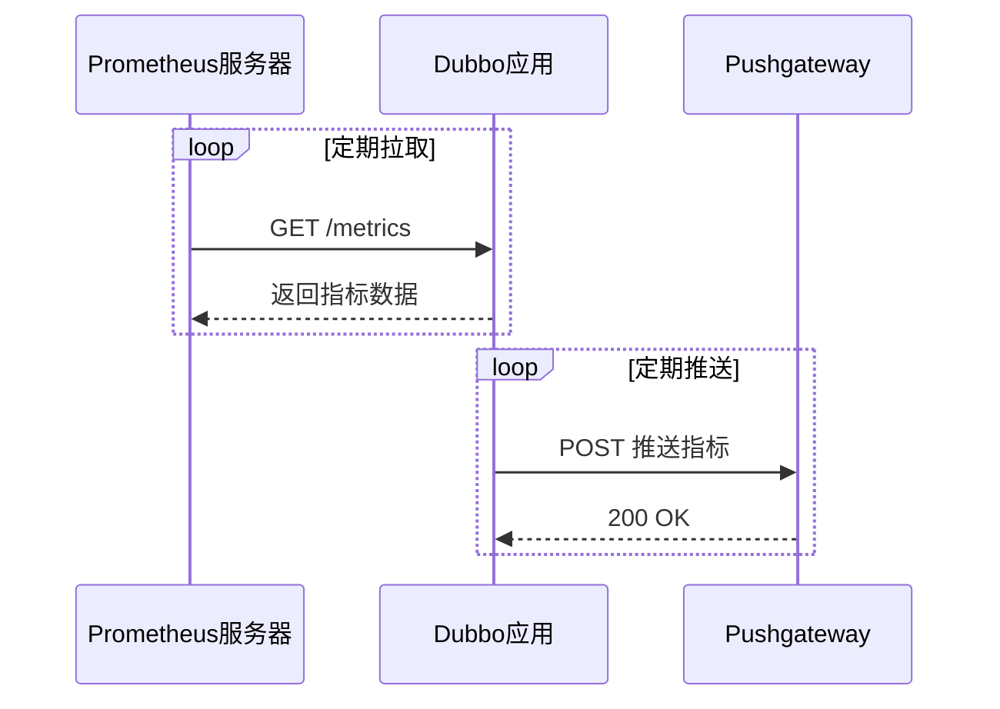
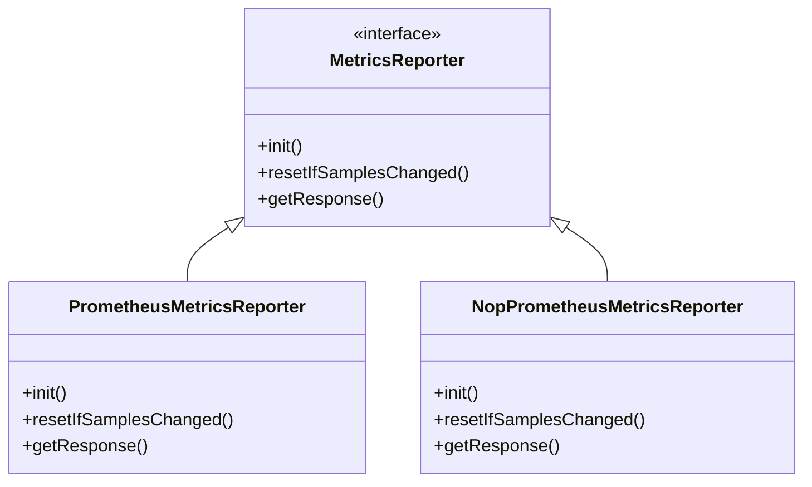
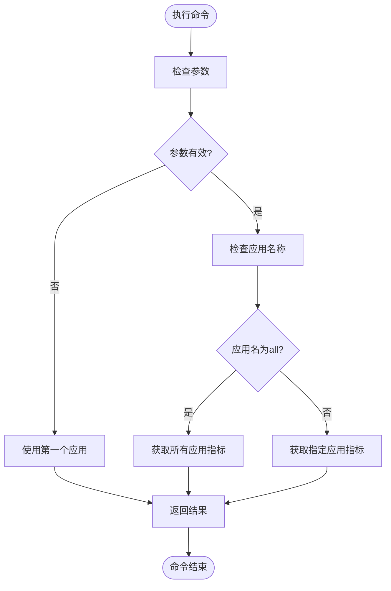
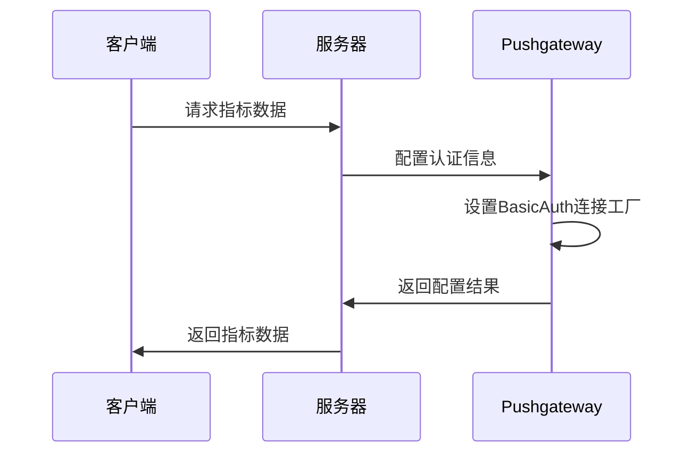

# Prometheus上报器

<cite>
**本文档引用的文件**   
- [PrometheusMetricsReporter.java](file://dubbo-metrics\dubbo-metrics-prometheus\src\main\java\org\apache\dubbo\metrics\prometheus\PrometheusMetricsReporter.java)
- [NopPrometheusMetricsReporter.java](file://dubbo-metrics\dubbo-metrics-prometheus\src\main\java\org\apache\dubbo\metrics\prometheus\NopPrometheusMetricsReporter.java)
- [PrometheusMetricsReporterCmd.java](file://dubbo-metrics\dubbo-metrics-prometheus\src\main\java\org\apache\dubbo\metrics\prometheus\PrometheusMetricsReporterCmd.java)
- [PrometheusMetricsReporterFactory.java](file://dubbo-metrics\dubbo-metrics-prometheus\src\main\java\org\apache\dubbo\metrics\prometheus\PrometheusMetricsReporterFactory.java)
- [MetricsConstants.java](file://dubbo-common\src\main\java\org\apache\dubbo\common\constants\MetricsConstants.java)
- [PrometheusConfig.java](file://dubbo-common\src\main\java\org\apache\dubbo\config\nested\PrometheusConfig.java)
</cite>

## 目录
1. [简介](#简介)
2. [核心组件](#核心组件)
3. [实现原理](#实现原理)
4. [HTTP端点暴露机制](#http端点暴露机制)
5. [NopPrometheusMetricsReporter的作用](#nopprometheusmetricsreporter的作用)
6. [QoS命令功能](#qos命令功能)
7. [配置示例](#配置示例)
8. [安全配置](#安全配置)
9. [快速入门指南](#快速入门指南)
10. [性能调优与最佳实践](#性能调优与最佳实践)

## 简介
Prometheus上报器是Dubbo框架中用于将服务调用指标数据转换为Prometheus兼容格式并暴露给Prometheus服务器的核心组件。该模块通过`PrometheusMetricsReporter`实现指标收集、转换和暴露功能，支持通过HTTP端点拉取或推送到Pushgateway两种模式。本文档详细解释其实现原理，提供配置示例，并为不同层次的用户提供使用指南。

## 核心组件

**Section sources**
- [PrometheusMetricsReporter.java](file://dubbo-metrics\dubbo-metrics-prometheus\src\main\java\org\apache\dubbo\metrics\prometheus\PrometheusMetricsReporter.java)
- [NopPrometheusMetricsReporter.java](file://dubbo-metrics\dubbo-metrics-prometheus\src\main\java\org\apache\dubbo\metrics\prometheus\NopPrometheusMetricsReporter.java)
- [PrometheusMetricsReporterFactory.java](file://dubbo-metrics\dubbo-metrics-prometheus\src\main\java\org\apache\dubbo\metrics\prometheus\PrometheusMetricsReporterFactory.java)

## 实现原理

`PrometheusMetricsReporter`基于Micrometer库实现，通过`PrometheusMeterRegistry`收集和管理指标数据。当初始化时，系统会创建一个`PrometheusMeterRegistry`实例，并将其添加到复合注册表中。指标数据的转换和暴露通过`scrape()`方法实现，该方法返回符合Prometheus文本格式的指标数据。



**Diagram sources **
- [PrometheusMetricsReporter.java](file://dubbo-metrics\dubbo-metrics-prometheus\src\main\java\org\apache\dubbo\metrics\prometheus\PrometheusMetricsReporter.java)

**Section sources**
- [PrometheusMetricsReporter.java](file://dubbo-metrics\dubbo-metrics-prometheus\src\main\java\org\apache\dubbo\metrics\prometheus\PrometheusMetricsReporter.java)

## HTTP端点暴露机制

`PrometheusMetricsReporter`通过HTTP端点暴露指标数据，支持两种模式：HTTP服务发现和Pushgateway推送。HTTP服务发现模式下，系统会启动一个HTTP服务器，在指定端口和路径上暴露`/metrics`端点。Pushgateway模式下，系统会定期将指标数据推送到指定的Pushgateway服务器。



**Diagram sources **
- [PrometheusMetricsReporter.java](file://dubbo-metrics\dubbo-metrics-prometheus\src\main\java\org\apache\dubbo\metrics\prometheus\PrometheusMetricsReporter.java)

**Section sources**
- [PrometheusMetricsReporter.java](file://dubbo-metrics\dubbo-metrics-prometheus\src\main\java\org\apache\dubbo\metrics\prometheus\PrometheusMetricsReporter.java)

## NopPrometheusMetricsReporter的作用

`NopPrometheusMetricsReporter`是一个空操作实现，当Micrometer核心包不存在时使用。它实现了`MetricsReporter`接口但不执行任何实际操作，确保在缺少依赖时系统仍能正常运行而不会抛出异常。



**Diagram sources **
- [NopPrometheusMetricsReporter.java](file://dubbo-metrics\dubbo-metrics-prometheus\src\main\java\org\apache\dubbo\metrics\prometheus\NopPrometheusMetricsReporter.java)

**Section sources**
- [NopPrometheusMetricsReporter.java](file://dubbo-metrics\dubbo-metrics-prometheus\src\main\java\org\apache\dubbo\metrics\prometheus\NopPrometheusMetricsReporter.java)

## QoS命令功能

`PrometheusMetricsReporterCmd`提供了QoS命令功能，允许通过命令行查询指标数据。支持的应用包括：获取默认应用指标、指定应用指标、获取所有应用指标等。该命令通过`execute`方法处理输入参数，并根据应用名称返回相应的指标数据。



**Diagram sources **
- [PrometheusMetricsReporterCmd.java](file://dubbo-metrics\dubbo-metrics-prometheus\src\main\java\org\apache\dubbo\metrics\prometheus\PrometheusMetricsReporterCmd.java)

**Section sources**
- [PrometheusMetricsReporterCmd.java](file://dubbo-metrics\dubbo-metrics-prometheus\src\main\java\org\apache\dubbo\metrics\prometheus\PrometheusMetricsReporterCmd.java)

## 配置示例

在Spring Boot应用中启用Prometheus指标上报的配置示例：

```java
@Configuration
public class MetricsConfig {
    
    @Bean
    public MetricsConfig metricsConfig() {
        MetricsConfig metrics = new MetricsConfig();
        metrics.setProtocol("prometheus");
        
        PrometheusConfig prometheus = new PrometheusConfig();
        PrometheusConfig.Exporter exporter = new PrometheusConfig.Exporter();
        exporter.setEnabled(true);
        prometheus.setExporter(exporter);
        
        PrometheusConfig.Pushgateway pushgateway = new PrometheusConfig.Pushgateway();
        pushgateway.setEnabled(true);
        pushgateway.setBaseUrl("localhost:9091");
        pushgateway.setJob("dubbo-service");
        pushgateway.setPushInterval(30);
        prometheus.setPushgateway(pushgateway);
        
        metrics.setPrometheus(prometheus);
        return metrics;
    }
}
```

**Section sources**
- [PrometheusConfig.java](file://dubbo-common\src\main\java\org\apache\dubbo\config\nested\PrometheusConfig.java)
- [MetricsConstants.java](file://dubbo-common\src\main\java\org\apache\dubbo\common\constants\MetricsConstants.java)

## 安全配置

HTTP端点的安全配置通过用户名和密码认证实现。在Pushgateway配置中，可以设置`username`和`password`参数来启用基本认证。系统会使用`BasicAuthHttpConnectionFactory`创建带有认证信息的HTTP连接。



**Diagram sources **
- [PrometheusMetricsReporter.java](file://dubbo-metrics\dubbo-metrics-prometheus\src\main\java\org\apache\dubbo\metrics\prometheus\PrometheusMetricsReporter.java)

**Section sources**
- [PrometheusMetricsReporter.java](file://dubbo-metrics\dubbo-metrics-prometheus\src\main\java\org\apache\dubbo\metrics\prometheus\PrometheusMetricsReporter.java)

## 快速入门指南

1. 添加依赖：确保项目中包含micrometer-core和prometheus-client依赖
2. 配置Metrics：在Spring Boot应用中配置PrometheusMetricsReporter
3. 启用JVM指标：通过`enable.jvm`参数启用JVM相关指标收集
4. 配置HTTP端点：设置`prometheus.exporter.enabled`为true以启用HTTP服务发现
5. 验证配置：通过访问`/metrics`端点验证指标数据是否正确暴露

**Section sources**
- [PrometheusMetricsReporter.java](file://dubbo-metrics\dubbo-metrics-prometheus\src\main\java\org\apache\dubbo\metrics\prometheus\PrometheusMetricsReporter.java)
- [PrometheusConfig.java](file://dubbo-common\src\main\java\org\apache\dubbo\config\nested\PrometheusConfig.java)

## 性能调优与最佳实践

1. **合理设置推送间隔**：Pushgateway的推送间隔不宜过短，建议设置为30秒以上以减少网络开销
2. **选择合适的指标收集模式**：对于稳定的服务，建议使用HTTP拉取模式；对于临时或动态的服务，使用Pushgateway模式
3. **监控资源使用**：定期监控`PrometheusMetricsReporter`的内存和CPU使用情况，避免影响主业务性能
4. **错误处理**：妥善处理推送失败的情况，实现重试机制和告警通知
5. **标签优化**：合理设计指标标签，避免标签组合爆炸导致内存消耗过大

**Section sources**
- [PrometheusMetricsReporter.java](file://dubbo-metrics\dubbo-metrics-prometheus\src\main\java\org\apache\dubbo\metrics\prometheus\PrometheusMetricsReporter.java)
- [PrometheusMetricsReporterFactory.java](file://dubbo-metrics\dubbo-metrics-prometheus\src\main\java\org\apache\dubbo\metrics\prometheus\PrometheusMetricsReporterFactory.java)