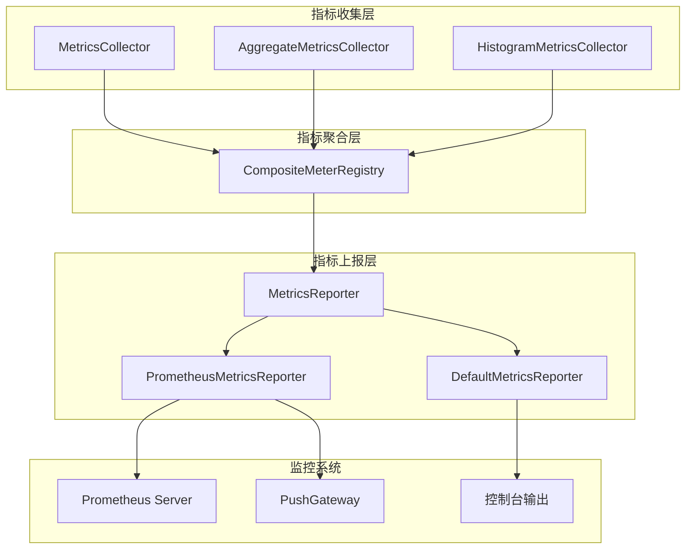
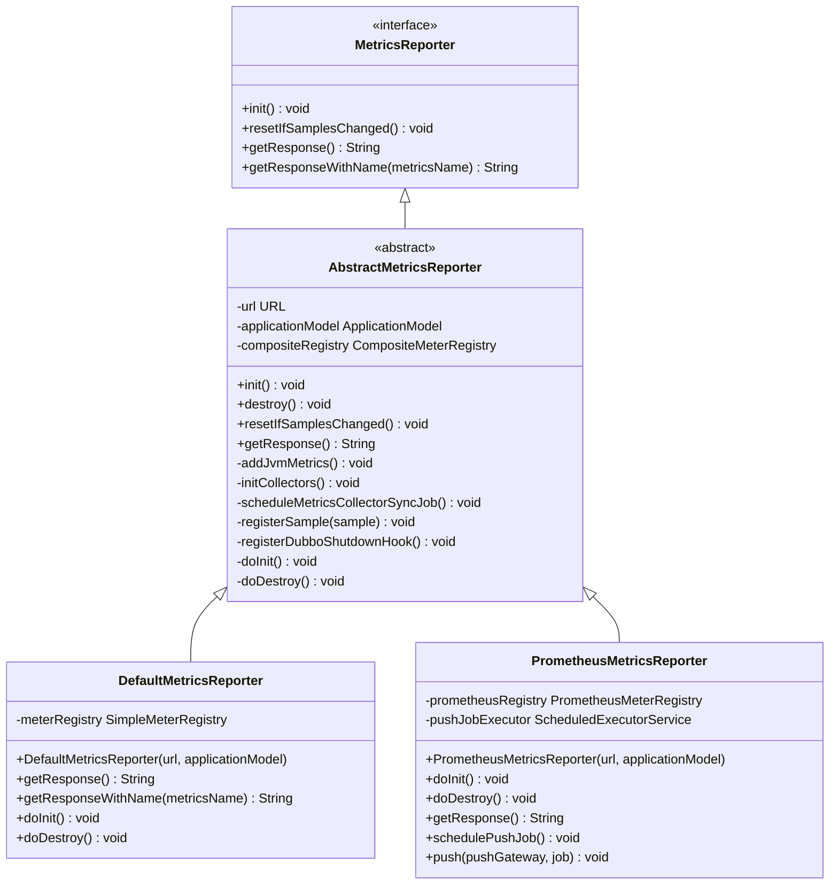
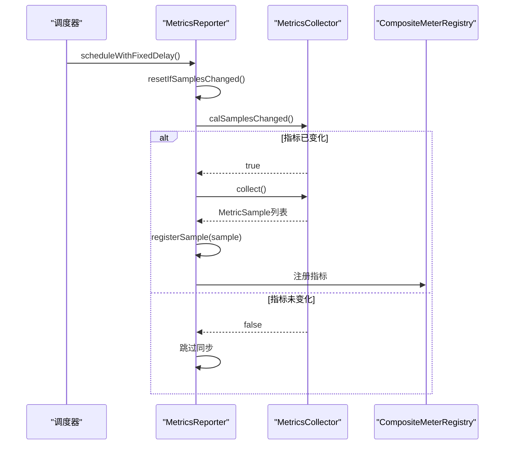
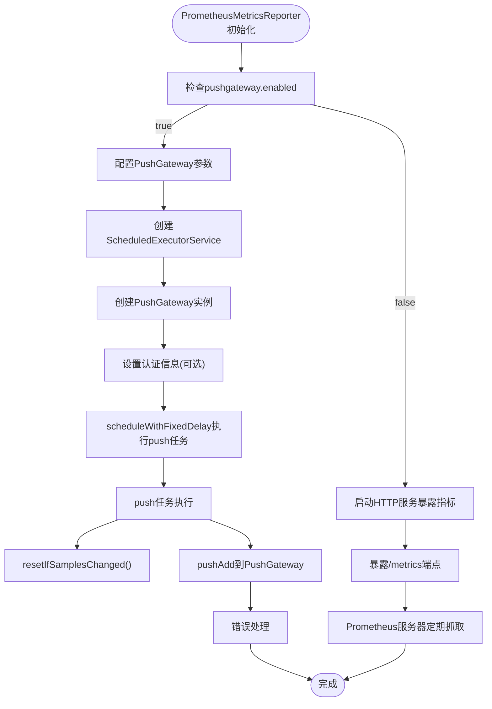
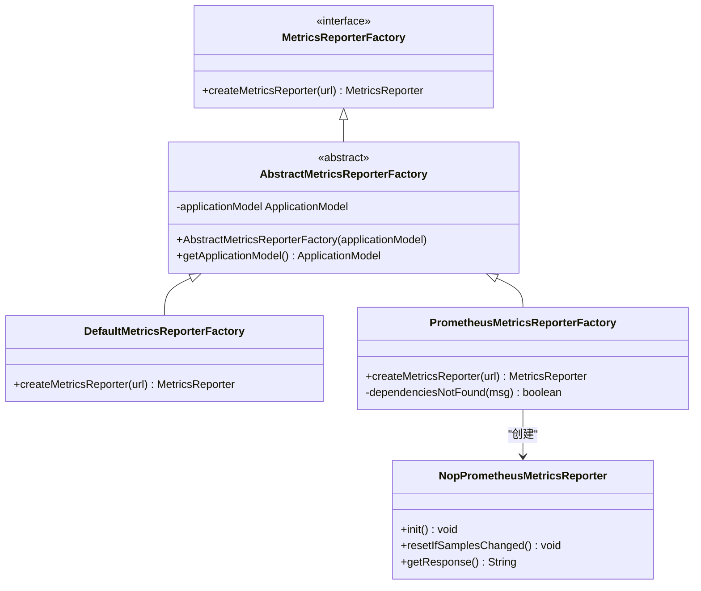
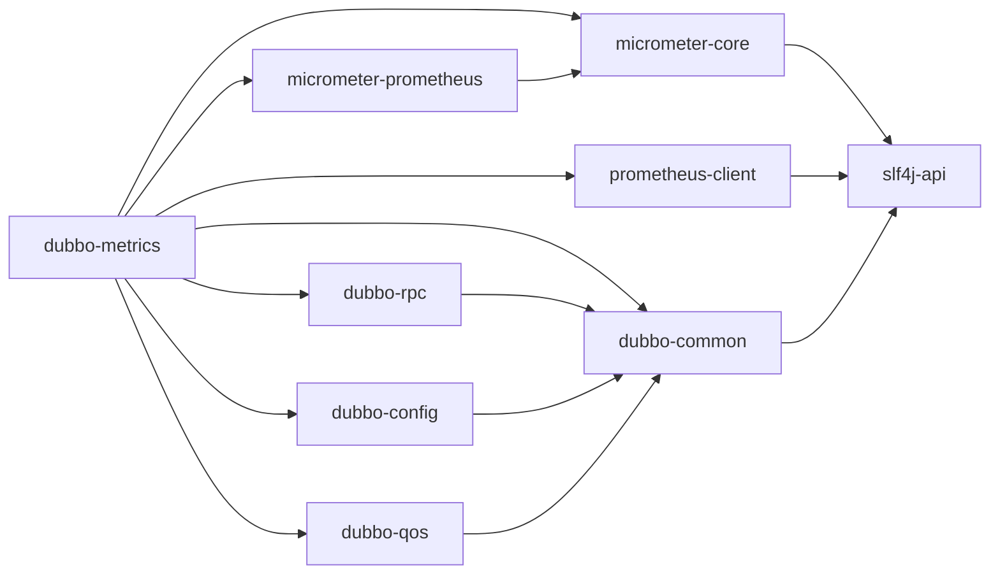

# 指标上报

<cite>
**本文档中引用的文件**  
- [MetricsReporter.java](file://dubbo-metrics\dubbo-metrics-api\src\main\java\org\apache\dubbo\metrics\report\MetricsReporter.java)
- [DefaultMetricsReporter.java](file://dubbo-metrics\dubbo-metrics-default\src\main\java\org\apache\dubbo\metrics\report\DefaultMetricsReporter.java)
- [PrometheusMetricsReporter.java](file://dubbo-metrics\dubbo-metrics-prometheus\src\main\java\org\apache\dubbo\metrics\prometheus\PrometheusMetricsReporter.java)
- [AbstractMetricsReporter.java](file://dubbo-metrics\dubbo-metrics-default\src\main\java\org\apache\dubbo\metrics\report\AbstractMetricsReporter.java)
- [MetricsReporterFactory.java](file://dubbo-metrics\dubbo-metrics-api\src\main\java\org\apache\dubbo\metrics\report\MetricsReporterFactory.java)
- [PrometheusMetricsReporterFactory.java](file://dubbo-metrics\dubbo-metrics-prometheus\src\main\java\org\apache\dubbo\metrics\prometheus\PrometheusMetricsReporterFactory.java)
- [DefaultMetricsReporterFactory.java](file://dubbo-metrics\dubbo-metrics-default\src\main\java\org\apache\dubbo\metrics\report\DefaultMetricsReporterFactory.java)
- [MetricsConstants.java](file://dubbo-common\src\main\java\org\apache\dubbo\common\constants\MetricsConstants.java)
- [PrometheusMetricsReporterCmd.java](file://dubbo-metrics\dubbo-metrics-prometheus\src\main\java\org\apache\dubbo\metrics\prometheus\PrometheusMetricsReporterCmd.java)
</cite>

## 目录
1. [引言](#引言)
2. [核心组件](#核心组件)
3. [架构概述](#架构概述)
4. [详细组件分析](#详细组件分析)
5. [依赖分析](#依赖分析)
6. [性能考虑](#性能考虑)
7. [故障排除指南](#故障排除指南)
8. [结论](#结论)

## 引言
本文档详细介绍了Dubbo框架中dubbo-metrics模块的指标上报功能。重点阐述了MetricsReporter接口的设计原理和实现机制，描述了指标数据的上报方式、上报频率和上报格式。特别说明了PrometheusMetricsReporter如何将指标数据暴露给Prometheus监控系统，包括HTTP端点的暴露和指标格式的转换。同时介绍了DefaultMetricsReporter的默认上报行为。为开发者提供了配置和使用不同指标上报器的具体示例，解释了指标上报过程中的错误处理机制和重试策略。为初学者提供了简单的监控系统集成示例，同时为高级用户提供上报性能优化建议。

## 核心组件
dubbo-metrics模块的核心是MetricsReporter接口及其各种实现。该模块基于Micrometer框架构建，提供了一套灵活的指标收集和上报机制。核心组件包括MetricsReporter接口、AbstractMetricsReporter抽象基类、DefaultMetricsReporter默认实现和PrometheusMetricsReporter Prometheus专用实现。这些组件共同构成了一个可扩展的指标上报系统，支持多种监控后端。

**核心组件**
- [MetricsReporter.java](file://dubbo-metrics\dubbo-metrics-api\src\main\java\org\apache\dubbo\metrics\report\MetricsReporter.java#L23-L37)
- [AbstractMetricsReporter.java](file://dubbo-metrics\dubbo-metrics-default\src\main\java\org\apache\dubbo\metrics\report\AbstractMetricsReporter.java#L62-L241)
- [DefaultMetricsReporter.java](file://dubbo-metrics\dubbo-metrics-default\src\main\java\org\apache\dubbo\metrics\report\DefaultMetricsReporter.java#L33-L98)
- [PrometheusMetricsReporter.java](file://dubbo-metrics\dubbo-metrics-prometheus\src\main\java\org\apache\dubbo\metrics\prometheus\PrometheusMetricsReporter.java#L50-L131)

## 架构概述
dubbo-metrics模块采用分层架构设计，将指标收集、聚合和上报分离。该架构基于SPI（Service Provider Interface）机制，允许用户根据需要选择不同的指标上报器。系统通过MetricsReporterFactory工厂创建具体的MetricsReporter实例，这些实例负责将收集到的指标数据上报到指定的监控系统。

**图表来源**
- [AbstractMetricsReporter.java](file://dubbo-metrics\dubbo-metrics-default\src\main\java\org\apache\dubbo\metrics\report\AbstractMetricsReporter.java#L74-L75)
- [PrometheusMetricsReporter.java](file://dubbo-metrics\dubbo-metrics-prometheus\src\main\java\org\apache\dubbo\metrics\prometheus\PrometheusMetricsReporter.java#L54-L55)

## 详细组件分析

### MetricsReporter接口分析
MetricsReporter接口是dubbo-metrics模块的核心接口，定义了指标上报器的基本行为。该接口提供了初始化、获取响应等基本方法，是所有具体上报器实现的基础。

**图表来源**
- [MetricsReporter.java](file://dubbo-metrics\dubbo-metrics-api\src\main\java\org\apache\dubbo\metrics\report\MetricsReporter.java#L23-L37)
- [AbstractMetricsReporter.java](file://dubbo-metrics\dubbo-metrics-default\src\main\java\org\apache\dubbo\metrics\report\AbstractMetricsReporter.java#L62-L241)
- [DefaultMetricsReporter.java](file://dubbo-metrics\dubbo-metrics-default\src\main\java\org\apache\dubbo\metrics\report\DefaultMetricsReporter.java#L33-L98)
- [PrometheusMetricsReporter.java](file://dubbo-metrics\dubbo-metrics-prometheus\src\main\java\org\apache\dubbo\metrics\prometheus\PrometheusMetricsReporter.java#L50-L131)

**组件来源**
- [MetricsReporter.java](file://dubbo-metrics\dubbo-metrics-api\src\main\java\org\apache\dubbo\metrics\report\MetricsReporter.java#L23-L37)
- [AbstractMetricsReporter.java](file://dubbo-metrics\dubbo-metrics-default\src\main\java\org\apache\dubbo\metrics\report\AbstractMetricsReporter.java#L62-L241)

### 上报机制分析
指标上报机制通过AbstractMetricsReporter基类实现，该类负责管理指标收集器、注册表和上报任务。系统定期同步指标收集器的状态，并将最新的指标数据注册到Micrometer的MeterRegistry中。

**图表来源**
- [AbstractMetricsReporter.java](file://dubbo-metrics\dubbo-metrics-default\src\main\java\org\apache\dubbo\metrics\report\AbstractMetricsReporter.java#L144-L153)
- [AbstractMetricsReporter.java](file://dubbo-metrics\dubbo-metrics-default\src\main\java\org\apache\dubbo\metrics\report\AbstractMetricsReporter.java#L157-L177)

**组件来源**
- [AbstractMetricsReporter.java](file://dubbo-metrics\dubbo-metrics-default\src\main\java\org\apache\dubbo\metrics\report\AbstractMetricsReporter.java#L144-L177)

### Prometheus上报器分析
PrometheusMetricsReporter专门用于将指标数据上报到Prometheus监控系统。它支持两种上报模式：Pull模式（通过HTTP端点暴露指标）和Push模式（通过PushGateway推送指标）。

**图表来源**
- [PrometheusMetricsReporter.java](file://dubbo-metrics\dubbo-metrics-prometheus\src\main\java\org\apache\dubbo\metrics\prometheus\PrometheusMetricsReporter.java#L71-L90)
- [PrometheusMetricsReporter.java](file://dubbo-metrics\dubbo-metrics-prometheus\src\main\java\org\apache\dubbo\metrics\prometheus\PrometheusMetricsReporter.java#L67-L69)

**组件来源**
- [PrometheusMetricsReporter.java](file://dubbo-metrics\dubbo-metrics-prometheus\src\main\java\org\apache\dubbo\metrics\prometheus\PrometheusMetricsReporter.java#L50-L131)

### 工厂模式分析
MetricsReporterFactory接口和其实现类采用工厂模式创建具体的MetricsReporter实例。系统通过SPI机制自动发现和加载合适的工厂类，实现了上报器的可插拔性。

**图表来源**
- [MetricsReporterFactory.java](file://dubbo-metrics\dubbo-metrics-api\src\main\java\org\apache\dubbo\metrics\report\MetricsReporterFactory.java#L28-L39)
- [AbstractMetricsReporterFactory.java](file://dubbo-metrics\dubbo-metrics-api\src\main\java\org\apache\dubbo\metrics\report\AbstractMetricsReporterFactory.java#L24-L35)
- [DefaultMetricsReporterFactory.java](file://dubbo-metrics\dubbo-metrics-default\src\main\java\org\apache\dubbo\metrics\report\DefaultMetricsReporterFactory.java#L22-L34)
- [PrometheusMetricsReporterFactory.java](file://dubbo-metrics\dubbo-metrics-prometheus\src\main\java\org\apache\dubbo\metrics\prometheus\PrometheusMetricsReporterFactory.java#L31-L82)

**组件来源**
- [MetricsReporterFactory.java](file://dubbo-metrics\dubbo-metrics-api\src\main\java\org\apache\dubbo\metrics\report\MetricsReporterFactory.java#L28-L39)
- [AbstractMetricsReporterFactory.java](file://dubbo-metrics\dubbo-metrics-api\src\main\java\org\apache\dubbo\metrics\report\AbstractMetricsReporterFactory.java#L24-L35)

## 依赖分析
dubbo-metrics模块依赖于多个外部库和内部模块，形成了一个复杂的依赖网络。主要依赖包括Micrometer核心库、Prometheus客户端库以及Dubbo框架的其他模块。

**图表来源**
- [pom.xml](file://dubbo-metrics\pom.xml)
- [PrometheusMetricsReporter.java](file://dubbo-metrics\dubbo-metrics-prometheus\src\main\java\org\apache\dubbo\metrics\prometheus\PrometheusMetricsReporter.java#L32-L35)

**组件来源**
- [PrometheusMetricsReporter.java](file://dubbo-metrics\dubbo-metrics-prometheus\src\main\java\org\apache\dubbo\metrics\prometheus\PrometheusMetricsReporter.java#L32-L35)

## 性能考虑
在使用dubbo-metrics模块时，需要考虑以下几个性能方面：

1. **指标收集频率**：通过`collector.sync.period`参数控制指标同步的频率，默认为60秒。过于频繁的同步会影响系统性能，而过于稀疏的同步可能导致指标数据不准确。

2. **JVM指标收集**：通过`enable.jvm`参数控制是否收集JVM相关指标。启用JVM指标收集会增加一定的性能开销，但在生产环境中通常建议启用，以便全面监控系统状态。

3. **上报模式选择**：Pull模式适合指标数据量较小的场景，而Push模式适合指标数据量大或网络环境复杂的场景。选择合适的上报模式可以优化监控系统的性能。

4. **线程池配置**：指标同步和上报任务使用独立的线程池执行，避免影响主业务线程。可以通过线程池大小和调度策略优化性能。

5. **内存使用**：Micrometer的MeterRegistry会缓存指标数据，需要注意内存使用情况，特别是在指标数量较多的场景下。

**性能考虑**
- [MetricsConstants.java](file://dubbo-common\src\main\java\org\apache\dubbo\common\constants\MetricsConstants.java#L56-L57)
- [AbstractMetricsReporter.java](file://dubbo-metrics\dubbo-metrics-default\src\main\java\org\apache\dubbo\metrics\report\AbstractMetricsReporter.java#L144-L153)

## 故障排除指南
在使用dubbo-metrics模块时，可能会遇到以下常见问题：

1. **指标数据未更新**：检查`collector.sync.period`参数设置是否合理，确保指标同步任务正常执行。

2. **Prometheus无法抓取指标**：检查HTTP端点配置，确保`prometheus.exporter.enabled`设置为true，并且端口和路径配置正确。

3. **PushGateway连接失败**：检查PushGateway的URL、用户名和密码配置，确保网络连接正常。

4. **类找不到异常**：如果出现NoClassDefFoundError，检查是否正确引入了micrometer-core和prometheus-client等依赖库。

5. **指标数据格式错误**：检查指标名称、标签和值的格式是否符合Prometheus的要求。

6. **性能下降**：如果发现系统性能下降，可以尝试降低指标收集频率，或者禁用不必要的JVM指标收集。

**故障排除指南**
- [PrometheusMetricsReporter.java](file://dubbo-metrics\dubbo-metrics-prometheus\src\main\java\org\apache\dubbo\metrics\prometheus\PrometheusMetricsReporter.java#L97-L104)
- [PrometheusMetricsReporterFactory.java](file://dubbo-metrics\dubbo-metrics-prometheus\src\main\java\org\apache\dubbo\metrics\prometheus\PrometheusMetricsReporterFactory.java#L44-L65)

## 结论
dubbo-metrics模块提供了一套完整且灵活的指标上报解决方案。通过MetricsReporter接口和工厂模式，系统支持多种监控后端，特别是对Prometheus的深度集成。模块采用分层架构设计，将指标收集、聚合和上报分离，提高了代码的可维护性和可扩展性。通过合理的配置和使用，可以有效地监控Dubbo应用的运行状态，及时发现和解决性能问题。对于初学者，可以使用默认配置快速集成监控功能；对于高级用户，可以通过自定义配置和优化策略，满足复杂的监控需求。