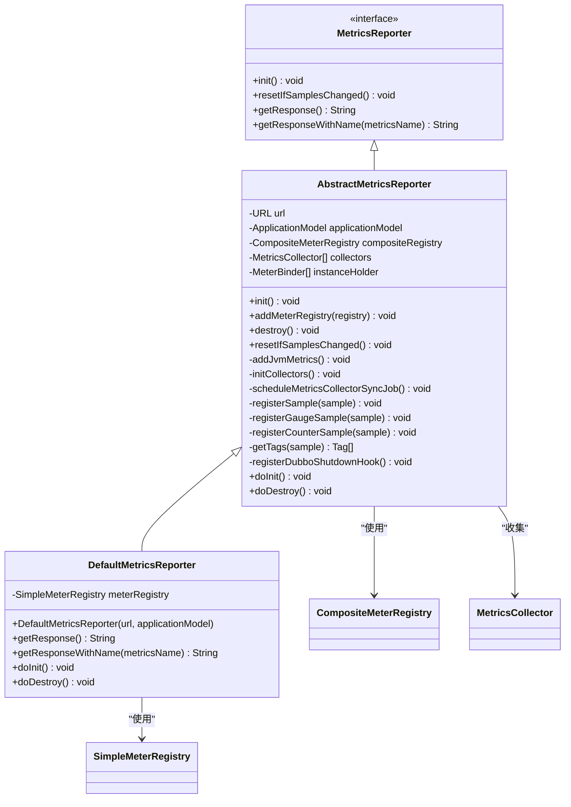
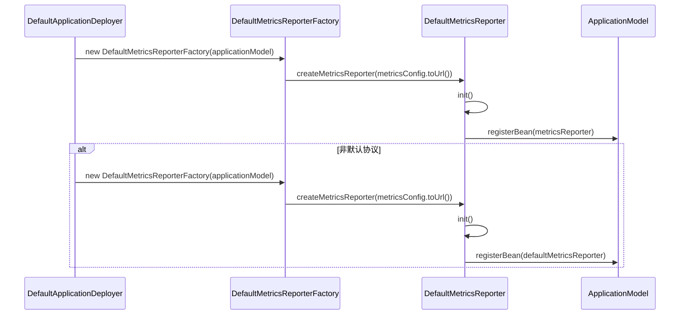
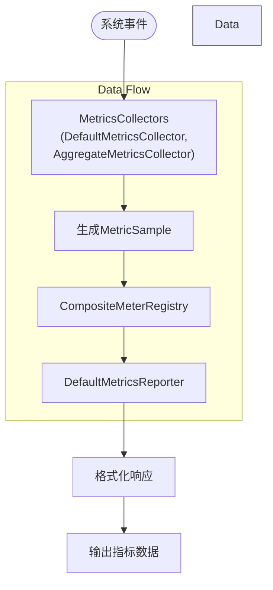
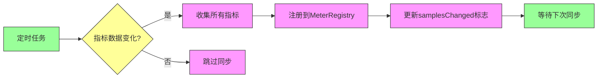
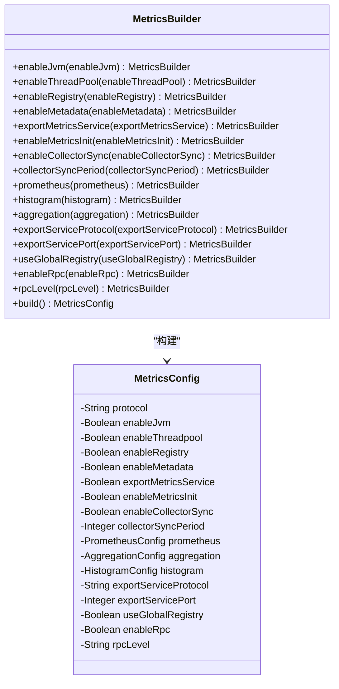
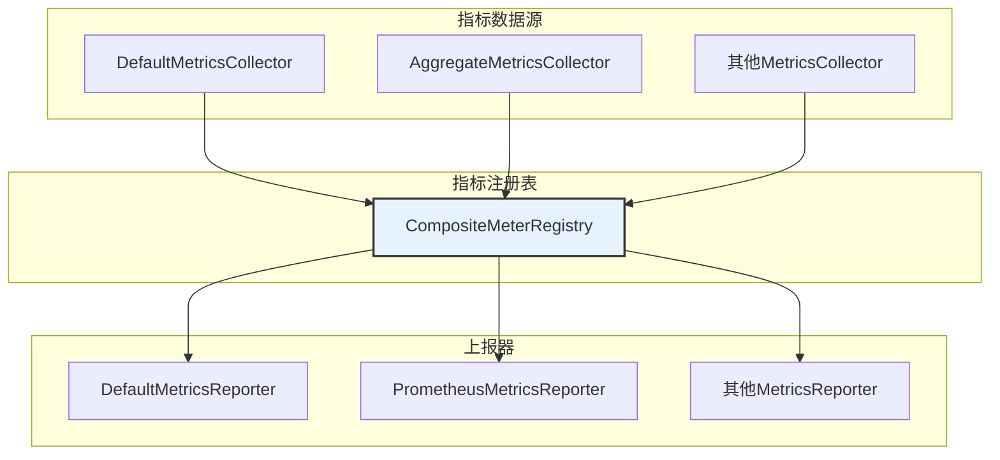
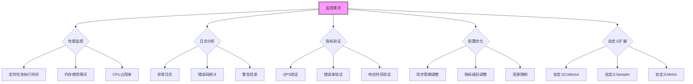

# 默认上报器

<cite>
**本文档引用的文件**   
- [DefaultMetricsReporter.java](file://dubbo-metrics\dubbo-metrics-default\src\main\java\org\apache\dubbo\metrics\report\DefaultMetricsReporter.java)
- [DefaultMetricsReporterFactory.java](file://dubbo-metrics\dubbo-metrics-default\src\main\java\org\apache\dubbo\metrics\report\DefaultMetricsReporterFactory.java)
- [AbstractMetricsReporter.java](file://dubbo-metrics\dubbo-metrics-default\src\main\java\org\apache\dubbo\metrics\report\AbstractMetricsReporter.java)
- [DefaultMetricsCollector.java](file://dubbo-metrics\dubbo-metrics-default\src\main\java\org\apache\dubbo\metrics\collector\DefaultMetricsCollector.java)
- [AggregateMetricsCollector.java](file://dubbo-metrics\dubbo-metrics-default\src\main\java\org\apache\dubbo\metrics\collector\AggregateMetricsCollector.java)
- [MetricsReporter.java](file://dubbo-metrics\dubbo-metrics-api\src\main\java\org\apache\dubbo\metrics\report\MetricsReporter.java)
- [MetricsBuilder.java](file://dubbo-config\dubbo-config-api\src\main\java\org\apache\dubbo\config\bootstrap\builders\MetricsBuilder.java)
- [DefaultApplicationDeployer.java](file://dubbo-config\dubbo-config-api\src\main\java\org\apache\dubbo\config\deploy\DefaultApplicationDeployer.java)
- [org.apache.dubbo.metrics.report.MetricsReporterFactory](file://dubbo-metrics\dubbo-metrics-default\src\main\resources\META-INF\dubbo\internal\org.apache.dubbo.metrics.report.MetricsReporterFactory)
</cite>

## 目录
1. [简介](#简介)
2. [核心实现机制](#核心实现机制)
3. [自动注册过程](#自动注册过程)
4. [指标数据收集与处理](#指标数据收集与处理)
5. [上报频率控制与数据聚合策略](#上报频率控制与数据聚合策略)
6. [配置选项说明](#配置选项说明)
7. [与其他上报器的共存机制](#与其他上报器的共存机制)
8. [初学者指导](#初学者指导)
9. [高级用户监控方法](#高级用户监控方法)
10. [总结](#总结)

## 简介

默认上报器（DefaultMetricsReporter）是Dubbo框架中用于收集和上报系统指标的核心组件。作为dubbo-metrics模块的默认实现，它负责在系统启动时自动注册，并持续收集来自不同MetricsCollector的指标数据。该上报器基于Micrometer框架构建，通过SimpleMeterRegistry管理指标数据，并提供灵活的配置选项来控制其行为。

**Section sources**
- [DefaultMetricsReporter.java](file://dubbo-metrics\dubbo-metrics-default\src\main\java\org\apache\dubbo\metrics\report\DefaultMetricsReporter.java#L1-L99)
- [DefaultMetricsReporterFactory.java](file://dubbo-metrics\dubbo-metrics-default\src\main\java\org\apache\dubbo\metrics\report\DefaultMetricsReporterFactory.java#L1-L35)

## 核心实现机制

默认上报器的核心实现基于AbstractMetricsReporter抽象类，继承了其基本的初始化、销毁和指标同步机制。DefaultMetricsReporter通过SimpleMeterRegistry实例来管理所有收集到的指标数据，该实例被注册到全局的CompositeMeterRegistry中，确保指标数据可以在多个上报器之间共享。

**Diagram sources **
- [DefaultMetricsReporter.java](file://dubbo-metrics\dubbo-metrics-default\src\main\java\org\apache\dubbo\metrics\report\DefaultMetricsReporter.java#L32-L98)
- [AbstractMetricsReporter.java](file://dubbo-metrics\dubbo-metrics-default\src\main\java\org\apache\dubbo\metrics\report\AbstractMetricsReporter.java#L62-L240)
- [MetricsReporter.java](file://dubbo-metrics\dubbo-metrics-api\src\main\java\org\apache\dubbo\metrics\report\MetricsReporter.java#L23-L37)

**Section sources**
- [DefaultMetricsReporter.java](file://dubbo-metrics\dubbo-metrics-default\src\main\java\org\apache\dubbo\metrics\report\DefaultMetricsReporter.java#L32-L98)
- [AbstractMetricsReporter.java](file://dubbo-metrics\dubbo-metrics-default\src\main\java\org\apache\dubbo\metrics\report\AbstractMetricsReporter.java#L62-L240)

## 自动注册过程

默认上报器的自动注册过程由DefaultApplicationDeployer在应用启动时触发。当系统检测到metrics配置存在时，会创建DefaultMetricsReporterFactory实例，并通过SPI机制加载默认的上报器实现。注册过程包括以下几个关键步骤：

1. 从MetricsConfig创建URL配置
2. 通过DefaultMetricsReporterFactory创建DefaultMetricsReporter实例
3. 调用init()方法初始化上报器
4. 将上报器注册到ApplicationModel的BeanFactory中

**Diagram sources **
- [DefaultApplicationDeployer.java](file://dubbo-config\dubbo-config-api\src\main\java\org\apache\dubbo\config\deploy\DefaultApplicationDeployer.java#L550-L563)
- [DefaultMetricsReporterFactory.java](file://dubbo-metrics\dubbo-metrics-default\src\main\java\org\apache\dubbo\metrics\report\DefaultMetricsReporterFactory.java#L21-L34)
- [DefaultMetricsReporter.java](file://dubbo-metrics\dubbo-metrics-default\src\main\java\org\apache\dubbo\metrics\report\DefaultMetricsReporter.java#L36-L39)

**Section sources**
- [DefaultApplicationDeployer.java](file://dubbo-config\dubbo-config-api\src\main\java\org\apache\dubbo\config\deploy\DefaultApplicationDeployer.java#L550-L563)
- [DefaultMetricsReporterFactory.java](file://dubbo-metrics\dubbo-metrics-default\src\main\java\org\apache\dubbo\metrics\report\DefaultMetricsReporterFactory.java#L21-L34)

## 指标数据收集与处理

默认上报器通过MetricsCollector组件收集指标数据，主要依赖DefaultMetricsCollector和AggregateMetricsCollector两个核心收集器。数据收集与处理流程如下：

DefaultMetricsCollector负责收集基础指标，如请求计数、错误码统计等，而AggregateMetricsCollector则负责聚合指标的计算，如QPS、响应时间百分位等。所有收集器通过事件监听机制接收RequestEvent、TimeCounterEvent等事件，并在事件发生时更新相应的指标数据。

**Diagram sources **
- [DefaultMetricsCollector.java](file://dubbo-metrics\dubbo-metrics-default\src\main\java\org\apache\dubbo\metrics\collector\DefaultMetricsCollector.java#L58-L244)
- [AggregateMetricsCollector.java](file://dubbo-metrics\dubbo-metrics-default\src\main\java\org\apache\dubbo\metrics\collector\AggregateMetricsCollector.java#L59-L406)
- [AbstractMetricsReporter.java](file://dubbo-metrics\dubbo-metrics-default\src\main\java\org\apache\dubbo\metrics\report\AbstractMetricsReporter.java#L157-L177)

**Section sources**
- [DefaultMetricsCollector.java](file://dubbo-metrics\dubbo-metrics-default\src\main\java\org\apache\dubbo\metrics\collector\DefaultMetricsCollector.java#L58-L244)
- [AggregateMetricsCollector.java](file://dubbo-metrics\dubbo-metrics-default\src\main\java\org\apache\dubbo\metrics\collector\AggregateMetricsCollector.java#L59-L406)

## 上报频率控制与数据聚合策略

默认上报器采用定时任务机制控制指标数据的同步频率，默认情况下每60秒同步一次。这一频率可以通过配置参数`collector.sync.period`进行调整。上报频率控制的核心实现位于AbstractMetricsReporter的scheduleMetricsCollectorSyncJob方法中。

数据聚合策略主要由AggregateMetricsCollector实现，采用时间窗口算法进行指标计算。对于QPS指标，使用TimeWindowCounter在指定时间窗口内统计请求数量；对于响应时间指标，使用TimeWindowQuantile计算百分位值。聚合配置可通过MetricsConfig进行调整，包括时间窗口大小、桶数量等参数。

**Diagram sources **
- [AbstractMetricsReporter.java](file://dubbo-metrics\dubbo-metrics-default\src\main\java\org\apache\dubbo\metrics\report\AbstractMetricsReporter.java#L144-L153)
- [AggregateMetricsCollector.java](file://dubbo-metrics\dubbo-metrics-default\src\main\java\org\apache\dubbo\metrics\collector\AggregateMetricsCollector.java#L60-L71)
- [AggregateMetricsCollector.java](file://dubbo-metrics\dubbo-metrics-default\src\main\java\org\apache\dubbo\metrics\collector\AggregateMetricsCollector.java#L132-L145)

**Section sources**
- [AbstractMetricsReporter.java](file://dubbo-metrics\dubbo-metrics-default\src\main\java\org\apache\dubbo\metrics\report\AbstractMetricsReporter.java#L144-L153)
- [AggregateMetricsCollector.java](file://dubbo-metrics\dubbo-metrics-default\src\main\java\org\apache\dubbo\metrics\collector\AggregateMetricsCollector.java#L60-L71)

## 配置选项说明

默认上报器提供了丰富的配置选项，可以通过MetricsConfig进行设置。主要配置项包括：

| 配置项 | 描述 | 默认值 |
|-------|------|-------|
| `enable-jvm` | 是否启用JVM指标收集 | false |
| `enable-threadpool` | 是否启用线程池指标收集 | true |
| `enable-registry` | 是否启用注册中心指标收集 | true |
| `enable-metadata` | 是否启用元数据指标收集 | true |
| `enable-collector-sync` | 是否启用收集器同步 | true |
| `collector-sync-period` | 收集器同步周期（秒） | 60 |
| `enable-rpc` | 是否启用RPC指标收集 | true |
| `rpc-level` | RPC指标级别 | METHOD |

**Diagram sources **
- [MetricsBuilder.java](file://dubbo-config\dubbo-config-api\src\main\java\org\apache\dubbo\config\bootstrap\builders\MetricsBuilder.java#L111-L220)
- [MetricsConfig.java](file://dubbo-config\dubbo-config-api\src\main\java\org\apache\dubbo\config\MetricsConfig.java)

**Section sources**
- [MetricsBuilder.java](file://dubbo-config\dubbo-config-api\src\main\java\org\apache\dubbo\config\bootstrap\builders\MetricsBuilder.java#L111-L220)

## 与其他上报器的共存机制

默认上报器设计为与其他上报器（如Prometheus上报器）共存。这种共存机制通过CompositeMeterRegistry实现，所有上报器共享同一个指标注册表。当多个上报器同时存在时，它们都会从同一个CompositeMeterRegistry中获取指标数据，但以不同的格式和协议上报到各自的监控系统。

SPI配置文件`org.apache.dubbo.metrics.report.MetricsReporterFactory`定义了默认上报器工厂，允许通过配置切换不同的上报器实现。当配置了非默认协议（如prometheus）时，系统会同时初始化默认上报器和指定协议的上报器，实现多上报器共存。

**Diagram sources **
- [org.apache.dubbo.metrics.report.MetricsReporterFactory](file://dubbo-metrics\dubbo-metrics-default\src\main\resources\META-INF\dubbo\internal\org.apache.dubbo.metrics.report.MetricsReporterFactory)
- [DefaultApplicationDeployer.java](file://dubbo-config\dubbo-config-api\src\main\java\org\apache\dubbo\config\deploy\DefaultApplicationDeployer.java#L556-L563)

**Section sources**
- [org.apache.dubbo.metrics.report.MetricsReporterFactory](file://dubbo-metrics\dubbo-metrics-default\src\main\resources\META-INF\dubbo\internal\org.apache.dubbo.metrics.report.MetricsReporterFactory)
- [DefaultApplicationDeployer.java](file://dubbo-config\dubbo-config-api\src\main\java\org\apache\dubbo\config\deploy\DefaultApplicationDeployer.java#L556-L563)

## 初学者指导

对于初学者来说，理解默认上报器的行为可以从以下几个方面入手：

1. **启用与禁用**：通过设置`metrics.enable`配置项来控制默认上报器的启用状态。默认情况下，上报器是启用的。

2. **基本配置**：了解主要的配置选项，如`enable-jvm`、`enable-threadpool`等，这些选项控制着不同类型的指标收集。

3. **查看指标**：通过QoS命令`default-metrics-reporter`可以查看当前上报器收集的指标数据，这是验证配置是否生效的最直接方式。

4. **日志观察**：关注应用启动日志，观察默认上报器的初始化过程，确保没有错误信息。

5. **默认行为**：理解默认上报器的默认行为，如每60秒同步一次指标数据，收集基础的RPC调用指标等。

**Section sources**
- [DefaultMetricsReporterCmd.java](file://dubbo-plugin\dubbo-qos\src\main\java\org\apache\dubbo\qos\command\impl\DefaultMetricsReporterCmd.java)

## 高级用户监控方法

对于高级用户，监控默认上报器的性能和行为可以通过以下方法：

1. **性能监控**：通过JVM指标监控上报器自身的性能开销，特别是定时任务执行时间和内存使用情况。

2. **日志分析**：分析`COMMON_METRICS_COLLECTOR_EXCEPTION`类型的日志，这些日志记录了指标收集过程中的异常情况。

3. **指标验证**：定期验证关键指标的准确性，如QPS、错误率等，确保数据的可靠性。

4. **配置优化**：根据实际需求调整`collector-sync-period`等参数，平衡指标实时性和系统性能。

5. **自定义扩展**：通过实现MetricsCollector接口，添加自定义的指标收集逻辑，扩展默认上报器的功能。

**Diagram sources **
- [AbstractMetricsReporter.java](file://dubbo-metrics\dubbo-metrics-default\src\main\java\org\apache\dubbo\metrics\report\AbstractMetricsReporter.java#L169-L174)
- [DefaultMetricsCollector.java](file://dubbo-metrics\dubbo-metrics-default\src\main\java\org\apache\dubbo\metrics\collector\DefaultMetricsCollector.java#L58-L244)

**Section sources**
- [AbstractMetricsReporter.java](file://dubbo-metrics\dubbo-metrics-default\src\main\java\org\apache\dubbo\metrics\report\AbstractMetricsReporter.java#L169-L174)
- [DefaultMetricsCollector.java](file://dubbo-metrics\dubbo-metrics-default\src\main\java\org\apache\dubbo\metrics\collector\DefaultMetricsCollector.java#L58-L244)

## 总结

默认上报器作为Dubbo框架中指标收集的核心组件，提供了稳定可靠的指标上报功能。通过深入理解其实现机制、自动注册过程、数据收集与处理流程，以及配置选项和共存机制，开发者可以更好地利用这一功能来监控和优化分布式系统的性能。对于初学者，建议从基本配置和日志观察入手；对于高级用户，则可以通过性能监控、日志分析和自定义扩展来深入挖掘其潜力。

**Section sources**
- [DefaultMetricsReporter.java](file://dubbo-metrics\dubbo-metrics-default\src\main\java\org\apache\dubbo\metrics\report\DefaultMetricsReporter.java)
- [DefaultMetricsReporterFactory.java](file://dubbo-metrics\dubbo-metrics-default\src\main\java\org\apache\dubbo\metrics\report\DefaultMetricsReporterFactory.java)
- [AbstractMetricsReporter.java](file://dubbo-metrics\dubbo-metrics-default\src\main\java\org\apache\dubbo\metrics\report\AbstractMetricsReporter.java)