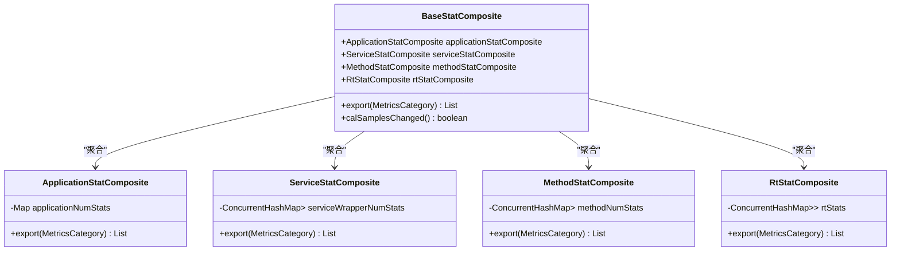
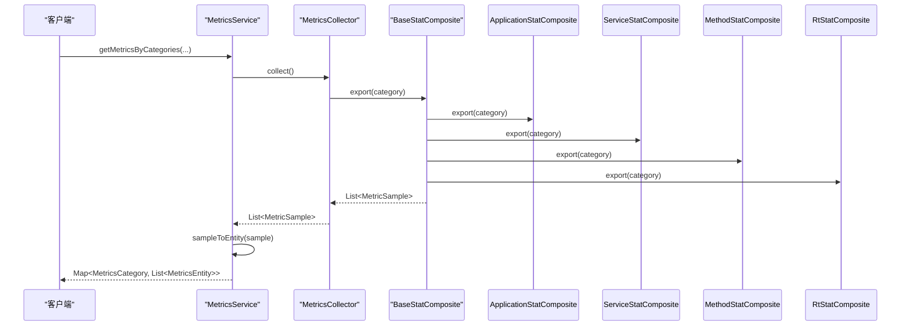

# 存储管理

<cite>
**本文档中引用的文件**  
- [ApplicationStatComposite.java](file://dubbo-metrics/dubbo-metrics-api/src/main/java/org/apache/dubbo/metrics/data/ApplicationStatComposite.java)
- [BaseStatComposite.java](file://dubbo-metrics/dubbo-metrics-api/src/main/java/org/apache/dubbo/metrics/data/BaseStatComposite.java)
- [ServiceStatComposite.java](file://dubbo-metrics/dubbo-metrics-api/src/main/java/org/apache/dubbo/metrics/data/ServiceStatComposite.java)
- [MethodStatComposite.java](file://dubbo-metrics/dubbo-metrics-api/src/main/java/org/apache/dubbo/metrics/data/MethodStatComposite.java)
- [RtStatComposite.java](file://dubbo-metrics/dubbo-metrics-api/src/main/java/org/apache/dubbo/metrics/data/RtStatComposite.java)
- [MetricsEntity.java](file://dubbo-metrics/dubbo-metrics-api/src/main/java/org/apache/dubbo/metrics/service/MetricsEntity.java)
- [MetricsService.java](file://dubbo-metrics/dubbo-metrics-api/src/main/java/org/apache/dubbo/metrics/service/MetricsService.java)
- [DefaultMetricsService.java](file://dubbo-metrics/dubbo-metrics-default/src/main/java/org/apache/dubbo/metrics/service/DefaultMetricsService.java)
- [MetricsCollector.java](file://dubbo-metrics/dubbo-metrics-api/src/main/java/org/apache/dubbo/metrics/collector/MetricsCollector.java)
- [MetricSample.java](file://dubbo-metrics/dubbo-metrics-api/src/main/java/org/apache/dubbo/metrics/model/sample/MetricSample.java)
- [GaugeMetricSample.java](file://dubbo-metrics/dubbo-metrics-api/src/main/java/org/apache/dubbo/metrics/model/sample/GaugeMetricSample.java)
- [CounterMetricSample.java](file://dubbo-metrics/dubbo-metrics-api/src/main/java/org/apache/dubbo/metrics/model/sample/CounterMetricSample.java)
</cite>

## 目录
1. [引言](#引言)
2. [核心数据结构与存储模型](#核心数据结构与存储模型)
3. [指标数据存储结构与索引方式](#指标数据存储结构与索引方式)
4. [查询接口与数据访问](#查询接口与数据访问)
5. [数据存储生命周期管理](#数据存储生命周期管理)
6. [性能优化措施](#性能优化措施)
7. [配置示例与调优建议](#配置示例与调优建议)
8. [总结](#总结)

## 引言

Dubbo的dubbo-metrics模块提供了全面的指标监控功能，其核心在于对指标数据的高效存储与管理。本文档将深入解析该模块中指标数据的存储管理机制，重点阐述其设计原理、实现细节和性能优化策略。通过分析`MetricsData`类（在代码中体现为一系列`*StatComposite`类）的设计，我们将揭示指标数据如何被组织、存储、索引和查询。同时，文档将详细说明数据的生命周期管理，包括内存回收和数据导出机制，并为开发者提供实用的配置示例和调优建议。

## 核心数据结构与存储模型

dubbo-metrics模块并未使用一个单一的`MetricsData`类，而是采用了一种分层聚合的设计模式，通过多个`*StatComposite`类来分别管理不同维度的指标数据。这种设计将复杂的指标数据分解为应用级、服务级、方法级和响应时间（RT）级四个主要部分，每个部分由一个专门的复合类负责。

### 存储模型设计原理

该设计的核心思想是**职责分离**和**数据聚合**。`BaseStatComposite`作为基类，聚合了`ApplicationStatComposite`、`ServiceStatComposite`、`MethodStatComposite`和`RtStatComposite`四个子组件。当需要导出指标时，`BaseStatComposite`会调用所有子组件的`export`方法，将分散的数据统一收集并返回。这种模式使得数据的收集、计算和导出过程清晰且易于扩展。



**图表来源**
- [BaseStatComposite.java](file://dubbo-metrics/dubbo-metrics-api/src/main/java/org/apache/dubbo/metrics/data/BaseStatComposite.java#L40-L150)
- [ApplicationStatComposite.java](file://dubbo-metrics/dubbo-metrics-api/src/main/java/org/apache/dubbo/metrics/data/ApplicationStatComposite.java#L40-L98)
- [ServiceStatComposite.java](file://dubbo-metrics/dubbo-metrics-api/src/main/java/org/apache/dubbo/metrics/data/ServiceStatComposite.java#L41-L127)
- [MethodStatComposite.java](file://dubbo-metrics/dubbo-metrics-api/src/main/java/org/apache/dubbo/metrics/data/MethodStatComposite.java#L44-L119)
- [RtStatComposite.java](file://dubbo-metrics/dubbo-metrics-api/src/main/java/org/apache/dubbo/metrics/data/RtStatComposite.java#L53-L252)

**本节来源**
- [BaseStatComposite.java](file://dubbo-metrics/dubbo-metrics-api/src/main/java/org/apache/dubbo/metrics/data/BaseStatComposite.java#L40-L150)

## 指标数据存储结构与索引方式

指标数据的存储结构高度依赖于其所属的维度，每种`*StatComposite`类都采用了最适合其场景的数据结构。

### 应用级存储结构

`ApplicationStatComposite`用于存储应用级别的计数器指标，如注册中心操作次数。它使用一个`ConcurrentHashMap<MetricsKey, AtomicLong>`作为核心存储。`MetricsKey`是指标的唯一标识（如`METADATA_PUSH_METRIC_NUM`），`AtomicLong`则存储该指标的当前值。这种结构确保了对计数器的原子性增减操作。

### 服务级与方法级存储结构

`ServiceStatComposite`和`MethodStatComposite`的结构相似，都采用了**双重映射**的模式。其核心是一个`ConcurrentHashMap`，其键为`MetricsKeyWrapper`，值为另一个`ConcurrentHashMap`。

- **第一层映射**：`MetricsKeyWrapper`封装了具体的`MetricsKey`和一个`type`（例如`subscribe`或`register`），用于区分同一类指标的不同操作。
- **第二层映射**：键为`ServiceKeyMetric`或`MethodMetric`，代表了具体的微服务或方法，值为`AtomicLong`，存储该服务或方法的指标值。

这种结构实现了高效的多维索引，可以快速定位到特定服务或方法的特定指标。

### 响应时间（RT）存储结构

`RtStatComposite`的结构最为复杂，用于存储响应时间的统计信息（如最大值、最小值、平均值、总和）。它使用`ConcurrentHashMap<String, List<LongContainer<? extends Number>>>`作为主存储。

- **键**：`String`类型，代表操作类型（如`subscribe`）。
- **值**：`List<LongContainer>`，每个`LongContainer`实例负责存储一个具体的RT指标（如`METRIC_RT_MAX`）。`LongContainer`内部使用`ConcurrentHashMap<Metric, Number>`来存储不同服务或方法的RT值，其中`Metric`是`ServiceKeyMetric`或`MethodMetric`的基类。

这种设计通过`LongContainer`的抽象，统一了对最大值、最小值、总和等不同统计量的处理逻辑。

```mermaid
erDiagram
METRICS_KEY {
string name PK
string description
}
METRICS_KEY_WRAPPER {
string type PK
ref<MetricsKey> metricsKey FK
}
SERVICE_KEY_METRIC {
string serviceKey PK
map<string, string> tags
}
METHOD_METRIC {
string methodName PK
string serviceKey FK
map<string, string> tags
}
LONG_CONTAINER {
string containerType PK
list<Number> values
}
METRICS_KEY ||--o{ METRICS_KEY_WRAPPER : "包含"
METRICS_KEY_WRAPPER ||--o{ LONG_CONTAINER : "管理"
SERVICE_KEY_METRIC ||--o{ LONG_CONTAINER : "存储"
METHOD_METRIC ||--o{ LONG_CONTAINER : "存储"
```

**图表来源**
- [ServiceStatComposite.java](file://dubbo-metrics/dubbo-metrics-api/src/main/java/org/apache/dubbo/metrics/data/ServiceStatComposite.java#L49-L127)
- [MethodStatComposite.java](file://dubbo-metrics/dubbo-metrics-api/src/main/java/org/apache/dubbo/metrics/data/MethodStatComposite.java#L52-L119)
- [RtStatComposite.java](file://dubbo-metrics/dubbo-metrics-api/src/main/java/org/apache/dubbo/metrics/data/RtStatComposite.java#L61-L252)

**本节来源**
- [ApplicationStatComposite.java](file://dubbo-metrics/dubbo-metrics-api/src/main/java/org/apache/dubbo/metrics/data/ApplicationStatComposite.java#L46-L90)
- [ServiceStatComposite.java](file://dubbo-metrics/dubbo-metrics-api/src/main/java/org/apache/dubbo/metrics/data/ServiceStatComposite.java#L49-L127)
- [MethodStatComposite.java](file://dubbo-metrics/dubbo-metrics-api/src/main/java/org/apache/dubbo/metrics/data/MethodStatComposite.java#L52-L119)
- [RtStatComposite.java](file://dubbo-metrics/dubbo-metrics-api/src/main/java/org/apache/dubbo/metrics/data/RtStatComposite.java#L61-L252)

## 查询接口与数据访问

指标数据的查询和访问主要通过`MetricsService`接口及其默认实现`DefaultMetricsService`来完成。

### 查询接口设计

`MetricsService`接口定义了三个主要的查询方法，支持不同粒度的数据访问：
1.  `getMetricsByCategories(List<MetricsCategory>)`：获取指定类别的所有指标。
2.  `getMetricsByCategories(String serviceUniqueName, List<MetricsCategory>)`：获取指定服务的指标。
3.  `getMetricsByCategories(String serviceUniqueName, String methodName, Class<?>[] parameterTypes, List<MetricsCategory>)`：获取指定服务和方法的指标。

这些方法的返回值是一个`Map<MetricsCategory, List<MetricsEntity>>`，将指标按类别进行分组。

### 数据访问流程

1.  **收集**：`DefaultMetricsService`会遍历所有注册的`MetricsCollector`实例，调用它们的`collect()`方法。`MetricsCollector`会从`BaseStatComposite`等数据聚合器中收集原始的`MetricSample`对象。
2.  **转换**：`DefaultMetricsService`将`MetricSample`对象转换为更通用的`MetricsEntity`对象。`MetricsEntity`是一个简单的POJO，包含指标的名称、标签、类别和值，便于序列化和传输。
3.  **过滤与返回**：根据查询条件过滤`MetricsEntity`列表，并按类别组织后返回给调用者。



**图表来源**
- [MetricsService.java](file://dubbo-metrics/dubbo-metrics-api/src/main/java/org/apache/dubbo/metrics/service/MetricsService.java#L34-L76)
- [DefaultMetricsService.java](file://dubbo-metrics/dubbo-metrics-default/src/main/java/org/apache/dubbo/metrics/service/DefaultMetricsService.java#L33-L93)
- [MetricsCollector.java](file://dubbo-metrics/dubbo-metrics-api/src/main/java/org/apache/dubbo/metrics/collector/MetricsCollector.java#L32-L56)

**本节来源**
- [MetricsService.java](file://dubbo-metrics/dubbo-metrics-api/src/main/java/org/apache/dubbo/metrics/service/MetricsService.java#L34-L76)
- [DefaultMetricsService.java](file://dubbo-metrics/dubbo-metrics-default/src/main/java/org/apache/dubbo/metrics/service/DefaultMetricsService.java#L33-L93)

## 数据存储生命周期管理

dubbo-metrics模块通过一系列机制来管理指标数据的生命周期，确保内存使用效率和数据的实时性。

### 数据过期与内存回收

该模块并未实现传统的“数据过期”策略（如TTL），而是采用了一种**增量更新**和**按需创建**的模式。

- **增量更新**：对于计数器类型的指标，只有在发生相关事件（如一次注册操作）时，才会对`AtomicLong`进行`incrementAndGet`操作。未发生变化的指标不会被频繁更新。
- **按需创建**：对于服务级和方法级的指标，`ConcurrentHashMapUtils.computeIfAbsent`方法确保了只有在首次访问某个服务或方法时，才会为其创建对应的`AtomicLong`实例。这避免了为不存在的服务或方法预分配内存。

### 内存回收机制

内存回收主要依赖于Java的垃圾回收机制（GC）。当一个服务或方法被销毁，且不再有引用指向其对应的`ServiceKeyMetric`或`MethodMetric`对象时，GC会自动回收其占用的内存。`ConcurrentHashMap`的`keySet`和`values`不会阻止其内部元素的回收。

### 持久化选项

dubbo-metrics模块本身主要关注内存中的指标收集和管理。持久化功能由外部系统实现。模块通过`MetricsCollector`接口将数据导出为`MetricSample`格式，这些数据可以被不同的`MetricsCollector`实现（如`dubbo-metrics-prometheus`）推送到外部监控系统（如Prometheus）进行持久化存储和可视化。

**本节来源**
- [ApplicationStatComposite.java](file://dubbo-metrics/dubbo-metrics-api/src/main/java/org/apache/dubbo/metrics/data/ApplicationStatComposite.java#L60-L72)
- [ServiceStatComposite.java](file://dubbo-metrics/dubbo-metrics-api/src/main/java/org/apache/dubbo/metrics/data/ServiceStatComposite.java#L77-L81)
- [MethodStatComposite.java](file://dubbo-metrics/dubbo-metrics-api/src/main/java/org/apache/dubbo/metrics/data/MethodStatComposite.java#L83-L88)
- [MetricsCollector.java](file://dubbo-metrics/dubbo-metrics-api/src/main/java/org/apache/dubbo/metrics/collector/MetricsCollector.java#L43-L44)

## 性能优化措施

为了在高并发场景下保持高性能，dubbo-metrics模块在多个层面进行了优化。

### 内存占用优化

- **使用轻量级数据结构**：核心存储大量使用`ConcurrentHashMap`和`AtomicLong`，这些是Java并发包中经过高度优化的线程安全数据结构。
- **避免不必要的对象创建**：通过`computeIfAbsent`等方法，确保只在必要时才创建对象，减少了内存分配和GC压力。
- **缓存计算结果**：`RtStatComposite`中的`avgContainer`通过`setValueSupplier`缓存了平均值的计算逻辑，避免了每次查询时都进行`sum/times`的除法运算。

### 查询性能优化

- **分层聚合**：`BaseStatComposite`的聚合模式使得数据导出过程可以并行化。虽然代码中是顺序调用，但这种结构为未来的并行优化提供了基础。
- **高效的索引**：双重映射结构（`MetricsKeyWrapper` -> `ServiceKeyMetric` -> `AtomicLong`）提供了O(1)的平均时间复杂度查找，确保了快速定位数据。

### 数据压缩策略

该模块本身不涉及数据压缩。其优化重点在于**减少数据冗余**和**高效的数据表示**。例如，`MetricsEntity`中的`tags`是一个`Map<String, String>`，虽然不是压缩格式，但通过使用字符串键值对，清晰地表达了指标的维度信息，便于下游系统（如Prometheus）进行高效的存储和查询。

**本节来源**
- [ApplicationStatComposite.java](file://dubbo-metrics/dubbo-metrics-api/src/main/java/org/apache/dubbo/metrics/data/ApplicationStatComposite.java#L46-L48)
- [ServiceStatComposite.java](file://dubbo-metrics/dubbo-metrics-api/src/main/java/org/apache/dubbo/metrics/data/ServiceStatComposite.java#L49-L50)
- [RtStatComposite.java](file://dubbo-metrics/dubbo-metrics-api/src/main/java/org/apache/dubbo/metrics/data/RtStatComposite.java#L91-L104)

## 配置示例与调优建议

### 简单配置示例

对于初学者，dubbo-metrics模块通常开箱即用。只需在项目中引入`dubbo-metrics-default`依赖，框架会自动启用默认的指标收集器。

```xml
<dependency>
    <groupId>org.apache.dubbo</groupId>
    <artifactId>dubbo-metrics-default</artifactId>
    <version>${dubbo.version}</version>
</dependency>
```

### 高级调优建议

1.  **选择合适的MetricsCollector**：根据监控需求选择合适的`MetricsCollector`实现。例如，使用`dubbo-metrics-prometheus`可以将指标暴露给Prometheus进行长期存储和告警。
2.  **控制指标粒度**：避免为所有服务和方法都开启细粒度的指标收集，这会增加内存和CPU开销。可以通过配置只对关键服务进行监控。
3.  **监控内存使用**：在生产环境中，应监控应用的内存使用情况。如果发现`ConcurrentHashMap`占用内存过大，可能需要调整指标收集的范围或频率。
4.  **利用缓存机制**：理解`RtStatComposite`中`ServiceKeyRt`和`MethodKeyRt`缓存的使用，避免在高并发场景下因缓存未命中而导致的性能抖动。

**本节来源**
- [MetricsCollector.java](file://dubbo-metrics/dubbo-metrics-api/src/main/java/org/apache/dubbo/metrics/collector/MetricsCollector.java#L31-L56)
- [DefaultMetricsService.java](file://dubbo-metrics/dubbo-metrics-default/src/main/java/org/apache/dubbo/metrics/service/DefaultMetricsService.java#L38-L40)

## 总结

dubbo-metrics模块的指标数据存储管理功能设计精巧，通过分层聚合的`*StatComposite`类实现了对应用、服务、方法和响应时间等多维度指标的有效管理。其核心存储结构基于`ConcurrentHashMap`和`AtomicLong`，确保了高并发下的线程安全和高性能。数据的查询通过`MetricsService`接口统一提供，流程清晰。虽然模块本身不直接处理数据过期和持久化，但其设计为与外部监控系统集成提供了良好的基础。通过理解其内部机制，开发者可以更好地配置和调优指标监控功能，以满足不同场景下的需求。