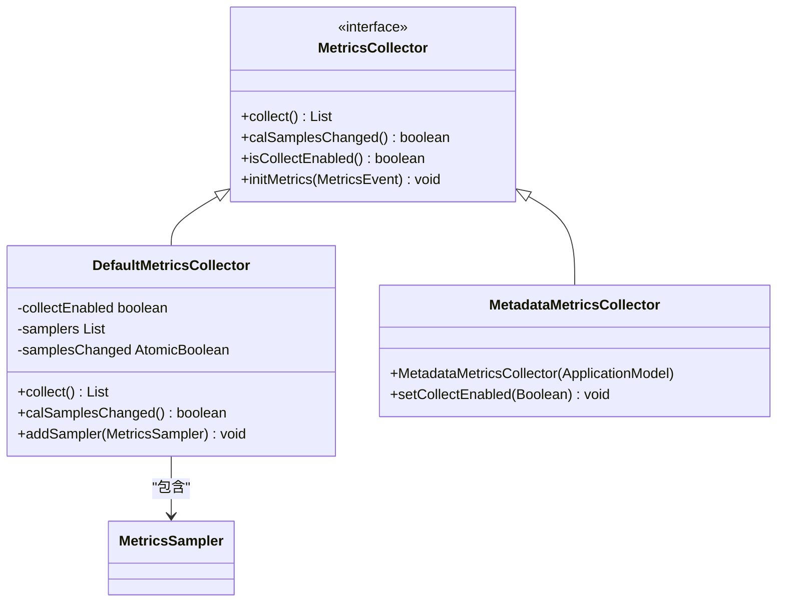
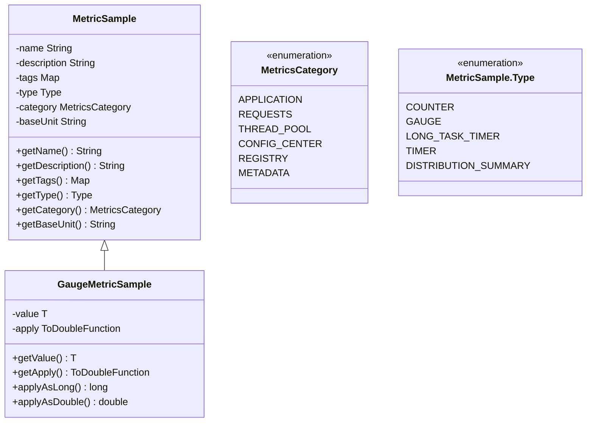
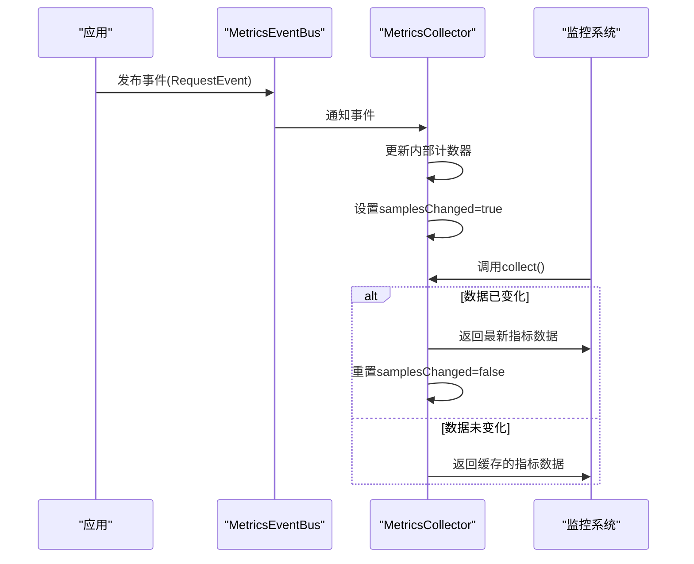
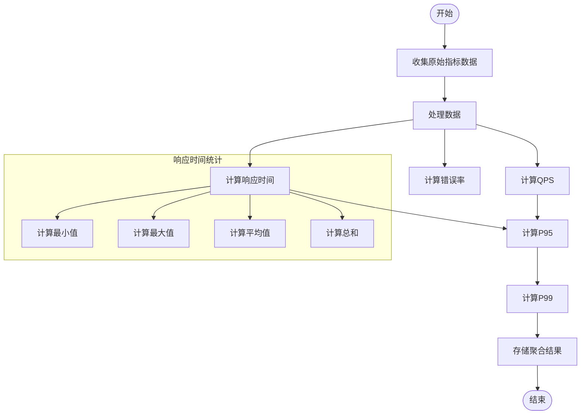
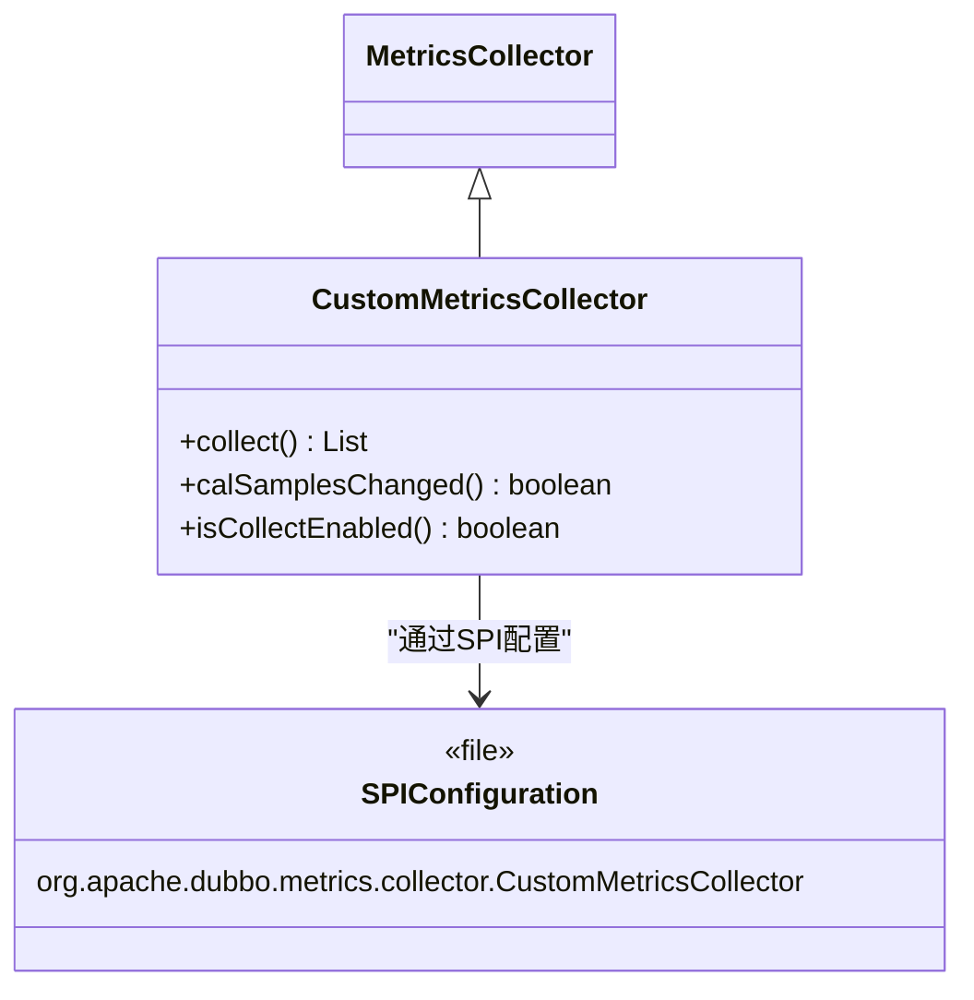
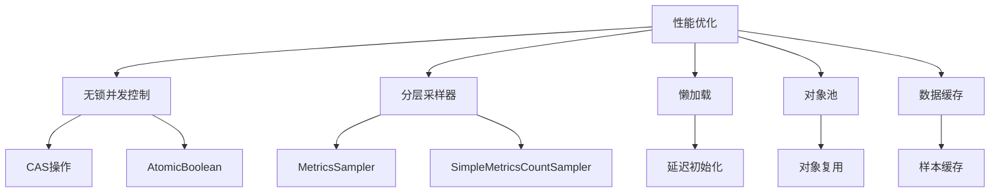

# 指标收集

<cite>
**本文档中引用的文件**  
- [MetricsCollector.java](file://dubbo-metrics/dubbo-metrics-api/src/main/java/org/apache/dubbo/metrics/collector/MetricsCollector.java)
- [MetricSample.java](file://dubbo-metrics/dubbo-metrics-api/src/main/java/org/apache/dubbo/metrics/model/sample/MetricSample.java)
- [GaugeMetricSample.java](file://dubbo-metrics/dubbo-metrics-api/src/main/java/org/apache/dubbo/metrics/model/sample/GaugeMetricSample.java)
- [DefaultMetricsCollector.java](file://dubbo-metrics/dubbo-metrics-default/src/main/java/org/apache/dubbo/metrics/collector/DefaultMetricsCollector.java)
- [MetadataMetricsCollector.java](file://dubbo-metrics/dubbo-metrics-metadata/src/main/java/org/apache/dubbo/metrics/metadata/collector/MetadataMetricsCollector.java)
- [MetricsConstants.java](file://dubbo-metrics/dubbo-metrics-event/src/main/java/org/apache/dubbo/metrics/MetricsConstants.java)
- [MetadataMetricsConstants.java](file://dubbo-metrics/dubbo-metrics-metadata/src/main/java/org/apache/dubbo/metrics/metadata/MetadataMetricsConstants.java)
</cite>

## 目录
1. [引言](#引言)
2. [核心组件](#核心组件)
3. [指标收集器设计原理](#指标收集器设计原理)
4. [指标数据模型](#指标数据模型)
5. [采集策略与周期](#采集策略与周期)
6. [聚合计算机制](#聚合计算机制)
7. [自定义指标收集器注册](#自定义指标收集器注册)
8. [性能优化与资源管理](#性能优化与资源管理)
9. [配置示例与调优建议](#配置示例与调优建议)
10. [结论](#结论)

## 引言
Dubbo框架中的指标收集功能为系统监控和性能分析提供了重要支持。本文档深入解析dubbo-metrics模块的指标收集机制，涵盖MetricsCollector接口的设计原理、指标数据的采集策略、聚合计算过程以及性能优化措施。通过详细的技术分析和代码示例，为开发者提供全面的指导，帮助其理解和使用Dubbo的指标收集功能。

## 核心组件
dubbo-metrics模块的核心组件包括MetricsCollector接口、MetricSample数据模型、DefaultMetricsCollector实现类以及各种特定场景的指标收集器。这些组件共同构成了一个灵活、可扩展的指标收集系统，能够满足不同应用场景的监控需求。

**本节来源**  
- [MetricsCollector.java](file://dubbo-metrics/dubbo-metrics-api/src/main/java/org/apache/dubbo/metrics/collector/MetricsCollector.java)
- [MetricSample.java](file://dubbo-metrics/dubbo-metrics-api/src/main/java/org/apache/dubbo/metrics/model/sample/MetricSample.java)
- [DefaultMetricsCollector.java](file://dubbo-metrics/dubbo-metrics-default/src/main/java/org/apache/dubbo/metrics/collector/DefaultMetricsCollector.java)

## 指标收集器设计原理
MetricsCollector接口是dubbo-metrics模块的核心，定义了指标收集的基本契约。该接口通过SPI机制实现可扩展性，允许用户注册自定义的指标收集器。接口主要包含两个关键方法：collect()用于收集指标数据，calSamplesChanged()用于检测指标样本是否发生变化。



**图示来源**  
- [MetricsCollector.java](file://dubbo-metrics/dubbo-metrics-api/src/main/java/org/apache/dubbo/metrics/collector/MetricsCollector.java)
- [DefaultMetricsCollector.java](file://dubbo-metrics/dubbo-metrics-default/src/main/java/org/apache/dubbo/metrics/collector/DefaultMetricsCollector.java)
- [MetadataMetricsCollector.java](file://dubbo-metrics/dubbo-metrics-metadata/src/main/java/org/apache/dubbo/metrics/metadata/collector/MetadataMetricsCollector.java)

**本节来源**  
- [MetricsCollector.java](file://dubbo-metrics/dubbo-metrics-api/src/main/java/org/apache/dubbo/metrics/collector/MetricsCollector.java)
- [DefaultMetricsCollector.java](file://dubbo-metrics/dubbo-metrics-default/src/main/java/org/apache/dubbo/metrics/collector/DefaultMetricsCollector.java)

## 指标数据模型
指标数据模型以MetricSample类为核心，封装了指标的名称、描述、标签、类型、分类和基本单位等元数据。该模型支持多种指标类型，包括计数器(COUNTER)、仪表(GAUGE)、长任务计时器(LONG_TASK_TIMER)、计时器(TIMER)和分布摘要(DISTRIBUTION_SUMMARY)。



**图示来源**  
- [MetricSample.java](file://dubbo-metrics/dubbo-metrics-api/src/main/java/org/apache/dubbo/metrics/model/sample/MetricSample.java)
- [GaugeMetricSample.java](file://dubbo-metrics/dubbo-metrics-api/src/main/java/org/apache/dubbo/metrics/model/sample/GaugeMetricSample.java)

**本节来源**  
- [MetricSample.java](file://dubbo-metrics/dubbo-metrics-api/src/main/java/org/apache/dubbo/metrics/model/sample/MetricSample.java)
- [GaugeMetricSample.java](file://dubbo-metrics/dubbo-metrics-api/src/main/java/org/apache/dubbo/metrics/model/sample/GaugeMetricSample.java)

## 采集策略与周期
指标采集采用事件驱动和轮询相结合的策略。系统通过MetricsEventBus发布各种事件（如请求事件、初始化事件等），指标收集器监听这些事件并更新内部状态。同时，外部监控系统可以定期调用collect()方法获取最新的指标数据。

采集周期由监控系统的轮询频率决定，通常为15-60秒。对于实时性要求较高的场景，可以通过调整轮询间隔来提高数据更新频率。DefaultMetricsCollector中的samplesChanged标志位用于优化性能，只有当指标数据发生变化时才重新生成样本。



**图示来源**  
- [MetricsCollector.java](file://dubbo-metrics/dubbo-metrics-api/src/main/java/org/apache/dubbo/metrics/collector/MetricsCollector.java)
- [DefaultMetricsCollector.java](file://dubbo-metrics/dubbo-metrics-default/src/main/java/org/apache/dubbo/metrics/collector/DefaultMetricsCollector.java)
- [MetricsConstants.java](file://dubbo-metrics/dubbo-metrics-event/src/main/java/org/apache/dubbo/metrics/MetricsConstants.java)

**本节来源**  
- [DefaultMetricsCollector.java](file://dubbo-metrics/dubbo-metrics-default/src/main/java/org/apache/dubbo/metrics/collector/DefaultMetricsCollector.java)
- [MetricsConstants.java](file://dubbo-metrics/dubbo-metrics-event/src/main/java/org/apache/dubbo/metrics/MetricsConstants.java)

## 聚合计算机制
聚合计算主要由AggregateMetricsCollector负责，它从多个MetricsCollector实例收集原始数据，并进行跨维度的聚合分析。聚合过程包括QPS计算、响应时间统计（最小值、最大值、平均值、P95、P99等）以及错误率分析。

聚合计算采用增量式算法，避免了对历史数据的全量扫描，提高了计算效率。对于响应时间等需要统计分布的指标，系统使用滑动窗口算法来维护最近一段时间内的数据样本。



**图示来源**  
- [DefaultMetricsCollector.java](file://dubbo-metrics/dubbo-metrics-default/src/main/java/org/apache/dubbo/metrics/collector/DefaultMetricsCollector.java)
- [MetadataMetricsCollector.java](file://dubbo-metrics/dubbo-metrics-metadata/src/main/java/org/apache/dubbo/metrics/metadata/collector/MetadataMetricsCollector.java)
- [MetadataMetricsConstants.java](file://dubbo-metrics/dubbo-metrics-metadata/src/main/java/org/apache/dubbo/metrics/metadata/MetadataMetricsConstants.java)

**本节来源**  
- [DefaultMetricsCollector.java](file://dubbo-metrics/dubbo-metrics-default/src/main/java/org/apache/dubbo/metrics/collector/DefaultMetricsCollector.java)
- [MetadataMetricsCollector.java](file://dubbo-metrics/dubbo-metrics-metadata/src/main/java/org/apache/dubbo/metrics/metadata/collector/MetadataMetricsCollector.java)

## 自定义指标收集器注册
通过SPI机制，用户可以轻松注册自定义的指标收集器。只需实现MetricsCollector接口，并在META-INF/dubbo/internal/org.apache.dubbo.metrics.collector.MetricsCollector文件中声明实现类即可。



**图示来源**  
- [MetricsCollector.java](file://dubbo-metrics/dubbo-metrics-api/src/main/java/org/apache/dubbo/metrics/collector/MetricsCollector.java)
- [DefaultMetricsCollector.java](file://dubbo-metrics/dubbo-metrics-default/src/main/java/org/apache/dubbo/metrics/collector/DefaultMetricsCollector.java)

**本节来源**  
- [MetricsCollector.java](file://dubbo-metrics/dubbo-metrics-api/src/main/java/org/apache/dubbo/metrics/collector/MetricsCollector.java)
- [DefaultMetricsCollector.java](file://dubbo-metrics/dubbo-metrics-default/src/main/java/org/apache/dubbo/metrics/collector/DefaultMetricsCollector.java)

## 性能优化与资源管理
指标收集系统采用了多项性能优化措施。首先，使用AtomicBoolean和CAS操作来高效管理samplesChanged标志位，避免了锁竞争。其次，通过分层采样器(MetricsSampler)机制，将不同类型的指标分离管理，提高了数据访问效率。

资源管理方面，系统采用懒加载策略，只有在启用指标收集功能时才初始化相关资源。同时，通过对象池和缓存机制减少对象创建开销，确保在高并发场景下的性能稳定性。



**图示来源**  
- [DefaultMetricsCollector.java](file://dubbo-metrics/dubbo-metrics-default/src/main/java/org/apache/dubbo/metrics/collector/DefaultMetricsCollector.java)
- [MetricsNameCountSampler.java](file://dubbo-metrics/dubbo-metrics-default/src/main/java/org/apache/dubbo/metrics/collector/sample/MetricsNameCountSampler.java)

**本节来源**  
- [DefaultMetricsCollector.java](file://dubbo-metrics/dubbo-metrics-default/src/main/java/org/apache/dubbo/metrics/collector/DefaultMetricsCollector.java)
- [MetricsNameCountSampler.java](file://dubbo-metrics/dubbo-metrics-default/src/main/java/org/apache/dubbo/metrics/collector/sample/MetricsNameCountSampler.java)

## 配置示例与调优建议
对于初学者，可以通过简单的配置启用基本的指标收集功能：

```properties
# 启用指标收集
dubbo.metrics.collect-enabled=true
# 设置采集周期（秒）
dubbo.metrics.collect-interval=30
```

高级用户可以根据具体需求进行调优：
- 调整采集周期以平衡监控实时性和系统开销
- 选择性启用特定类型的指标收集器以减少资源消耗
- 配置采样率以降低高流量场景下的性能影响
- 使用自定义标签对指标进行更细粒度的分类

**本节来源**  
- [DefaultMetricsCollector.java](file://dubbo-metrics/dubbo-metrics-default/src/main/java/org/apache/dubbo/metrics/collector/DefaultMetricsCollector.java)
- [MetricsConstants.java](file://dubbo-metrics/dubbo-metrics-event/src/main/java/org/apache/dubbo/metrics/MetricsConstants.java)

## 结论
Dubbo的指标收集功能通过精心设计的接口和高效的实现机制，为分布式系统的监控提供了强大支持。其模块化架构和SPI扩展机制使得系统既灵活又易于定制。通过合理配置和调优，可以在保证系统性能的同时获得丰富的监控数据，为系统优化和故障排查提供有力支持。