# 数据聚合

<cite>
**本文档引用的文件**   
- [TimeWindowAggregator.java](file://dubbo-metrics/dubbo-metrics-api/src/main/java/org/apache/dubbo/metrics/aggregate/TimeWindowAggregator.java)
- [SlidingWindow.java](file://dubbo-metrics/dubbo-metrics-api/src/main/java/org/apache/dubbo/metrics/aggregate/SlidingWindow.java)
- [Pane.java](file://dubbo-metrics/dubbo-metrics-api/src/main/java/org/apache/dubbo/metrics/aggregate/Pane.java)
- [SampleAggregatedEntry.java](file://dubbo-metrics/dubbo-metrics-api/src/main/java/org/apache/dubbo/metrics/aggregate/SampleAggregatedEntry.java)
- [AggregateMetricsCollector.java](file://dubbo-metrics/dubbo-metrics-default/src/main/java/org/apache/dubbo/metrics/collector/AggregateMetricsCollector.java)
- [TimeWindowCounter.java](file://dubbo-metrics/dubbo-metrics-api/src/main/java/org/apache/dubbo/metrics/aggregate/TimeWindowCounter.java)
- [TimeWindowQuantile.java](file://dubbo-metrics/dubbo-metrics-api/src/main/java/org/apache/dubbo/metrics/aggregate/TimeWindowQuantile.java)
- [GaugeMetricSample.java](file://dubbo-metrics/dubbo-metrics-api/src/main/java/org/apache/dubbo/metrics/model/sample/GaugeMetricSample.java)
- [AggregationConfig.java](file://dubbo-common/src/main/java/org/apache/dubbo/config/nested/AggregationConfig.java)
</cite>

## 目录
1. [引言](#引言)
2. [核心组件分析](#核心组件分析)
3. [聚合机制设计原理](#聚合机制设计原理)
4. [时间窗口管理](#时间窗口管理)
5. [数据分组策略](#数据分组策略)
6. [聚合结果存储](#聚合结果存储)
7. [性能优化措施](#性能优化措施)
8. [配置示例与调优建议](#配置示例与调优建议)
9. [结论](#结论)

## 引言
Dubbo指标数据聚合功能是监控系统的核心组件，负责对原始指标数据进行统计计算和聚合处理。该功能通过滑动窗口算法实现高效的时间序列数据聚合，支持求和、平均值、最大值、最小值等多种统计方式，为系统性能监控和故障排查提供关键数据支持。

## 核心组件分析

### MetricsAggregator接口设计
Dubbo的指标数据聚合功能主要通过`TimeWindowAggregator`类实现，该类采用滑动窗口算法对指标数据进行聚合计算。核心组件包括：

- **TimeWindowAggregator**: 主要聚合器，负责计算平均值、最大值、最小值和总和
- **SlidingWindow**: 滑动窗口基类，管理时间窗口的生命周期和数据分片
- **Pane**: 时间窗口的基本单元，存储特定时间段内的指标数据
- **SampleAggregatedEntry**: 聚合结果的封装类，包含各种统计指标

**代码路径**
- [TimeWindowAggregator.java](file://dubbo-metrics/dubbo-metrics-api/src/main/java/org/apache/dubbo/metrics/aggregate/TimeWindowAggregator.java#L25-L150)
- [SlidingWindow.java](file://dubbo-metrics/dubbo-metrics-api/src/main/java/org/apache/dubbo/metrics/aggregate/SlidingWindow.java#L34-L300)

### 原始指标数据聚合计算
聚合计算支持多种统计方式：

1. **求和计算**: 累加所有窗口内的指标值
2. **平均值计算**: 总和除以样本数量，结果保留两位小数
3. **最大值计算**: 找出所有窗口中的最大值
4. **最小值计算**: 找出所有窗口中的最小值

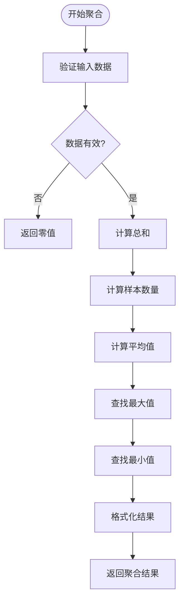

**聚合计算流程**
- 遍历所有有效时间窗口
- 累加各窗口的总值和样本数量
- 计算全局平均值
- 确定全局最大值和最小值
- 返回包含所有统计指标的结果对象

**代码路径**
- [TimeWindowAggregator.java](file://dubbo-metrics/dubbo-metrics-api/src/main/java/org/apache/dubbo/metrics/aggregate/TimeWindowAggregator.java#L42-L73)

## 聚合机制设计原理

### 滑动窗口算法
滑动窗口算法是Dubbo指标聚合的核心机制，具有以下特点：

- **时间分片**: 将总时间窗口划分为多个小的时间片（pane）
- **动态更新**: 窗口随时间推移自动滑动，旧数据被新数据替换
- **原子操作**: 使用原子引用和累加器确保线程安全

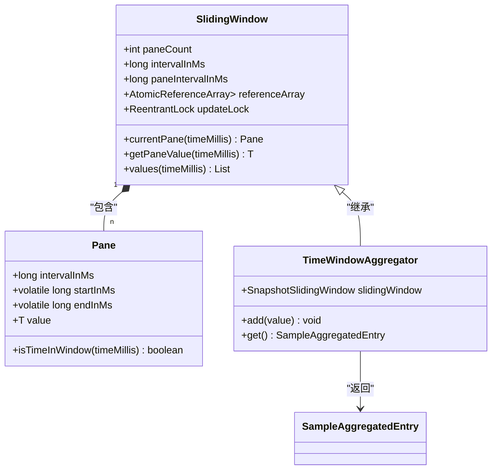

**代码路径**
- [SlidingWindow.java](file://dubbo-metrics/dubbo-metrics-api/src/main/java/org/apache/dubbo/metrics/aggregate/SlidingWindow.java#L34-L300)
- [Pane.java](file://dubbo-metrics/dubbo-metrics-api/src/main/java/org/apache/dubbo/metrics/aggregate/Pane.java#L24-L126)

### 并发安全设计
为确保高并发场景下的数据一致性，聚合器采用以下并发控制机制：

- **原子引用**: 使用`AtomicReference`存储最小值和最大值
- **双累加器**: 使用`DoubleAccumulator`和`LongAdder`进行数值累加
- **重入锁**: 在窗口重置时使用`ReentrantLock`进行同步

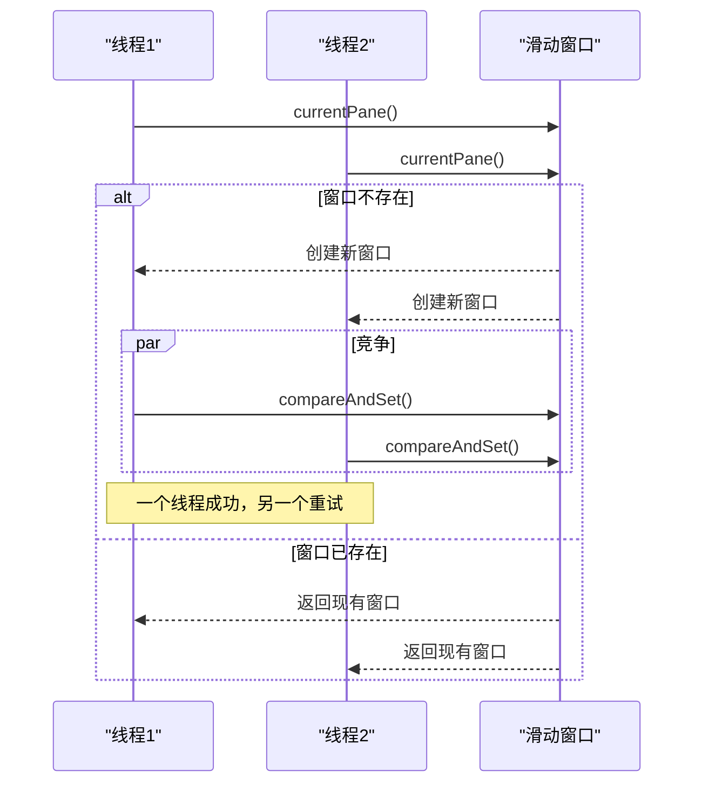

**代码路径**
- [TimeWindowAggregator.java](file://dubbo-metrics/dubbo-metrics-api/src/main/java/org/apache/dubbo/metrics/aggregate/TimeWindowAggregator.java#L96-L124)
- [SlidingWindow.java](file://dubbo-metrics/dubbo-metrics-api/src/main/java/org/apache/dubbo/metrics/aggregate/SlidingWindow.java#L95-L125)

## 时间窗口管理

### 窗口配置参数
时间窗口的配置通过`AggregationConfig`类进行管理，主要参数包括：

- **bucketNum**: 窗口分片数量，默认10个
- **timeWindowSeconds**: 总时间窗口长度，默认120秒
- **qpsTimeWindowMillSeconds**: QPS统计窗口长度，默认3000毫秒

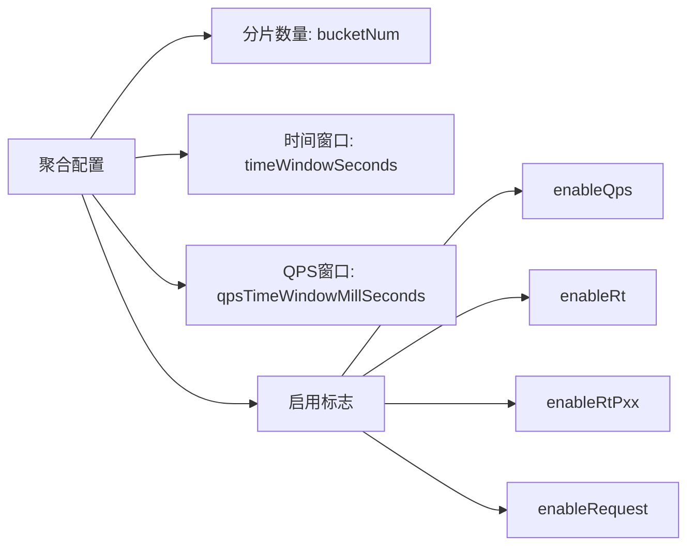

**代码路径**
- [AggregationConfig.java](file://dubbo-common/src/main/java/org/apache/dubbo/config/nested/AggregationConfig.java#L24-L46)
- [AggregateMetricsCollector.java](file://dubbo-metrics/dubbo-metrics-default/src/main/java/org/apache/dubbo/metrics/collector/AggregateMetricsCollector.java#L60-L71)

### 窗口生命周期
滑动窗口的生命周期管理包括：

1. **创建**: 当访问的时间点没有对应窗口时创建新窗口
2. **更新**: 当窗口过期时重置窗口状态
3. **废弃**: 当窗口超出总时间范围时标记为废弃

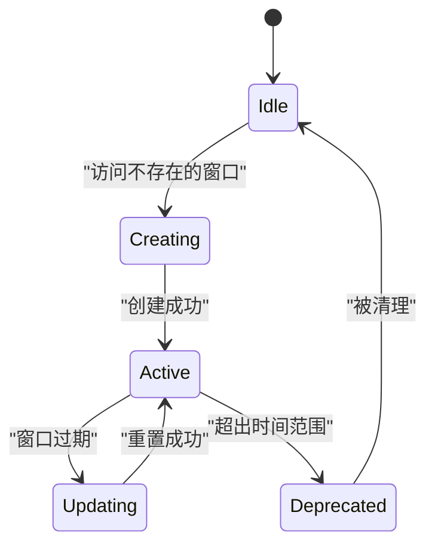

**代码路径**
- [SlidingWindow.java](file://dubbo-metrics/dubbo-metrics-api/src/main/java/org/apache/dubbo/metrics/aggregate/SlidingWindow.java#L77-L131)

## 数据分组策略

### 分组维度
指标数据按照以下维度进行分组：

- **服务级别**: 区分不同服务的指标
- **方法级别**: 区分同一服务内不同方法的指标
- **调用方/提供方**: 区分消费者和提供者的指标
- **错误类型**: 按异常类型分组统计

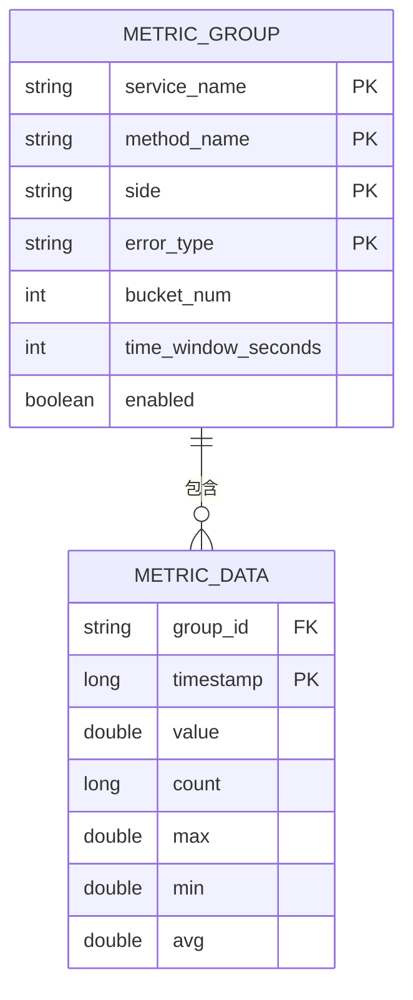

**代码路径**
- [AggregateMetricsCollector.java](file://dubbo-metrics/dubbo-metrics-default/src/main/java/org/apache/dubbo/metrics/collector/AggregateMetricsCollector.java#L63-L66)

### 分组实现
分组通过`ConcurrentHashMap`实现，使用`MethodMetric`作为键：

- **methodTypeCounter**: 按方法类型和指标类型分组的计数器
- **rt**: 响应时间分位数统计
- **qps**: 每秒查询率统计
- **rtAgr**: 响应时间聚合统计

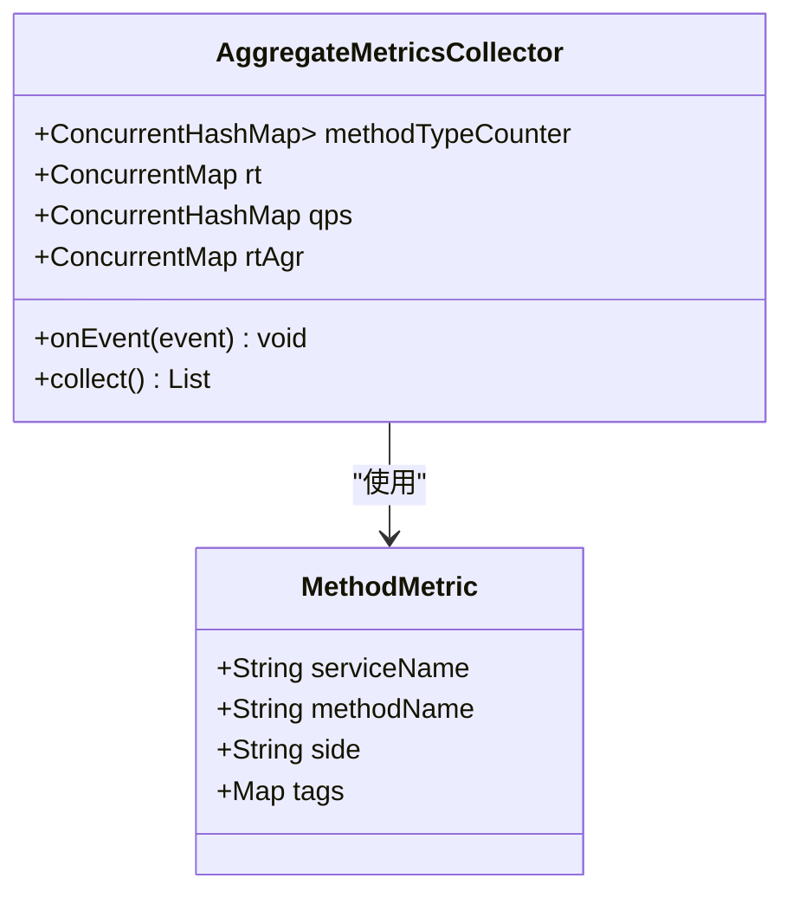

**代码路径**
- [AggregateMetricsCollector.java](file://dubbo-metrics/dubbo-metrics-default/src/main/java/org/apache/dubbo/metrics/collector/AggregateMetricsCollector.java#L63-L80)

## 聚合结果存储

### 存储结构
聚合结果通过`GaugeMetricSample`类进行封装和存储：

- **名称**: 指标名称，如"rt.avg.milliseconds.aggregate"
- **描述**: 指标描述信息
- **标签**: 包含服务、方法、调用方等维度信息
- **值**: 聚合计算结果
- **应用函数**: 用于获取最终数值的函数

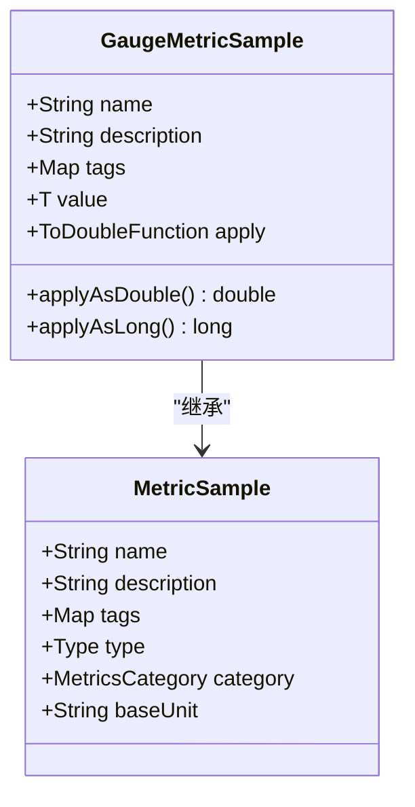

**代码路径**
- [GaugeMetricSample.java](file://dubbo-metrics/dubbo-metrics-api/src/main/java/org/apache/dubbo/metrics/model/sample/GaugeMetricSample.java#L35-L115)

### 存储流程
聚合结果的存储和导出流程：

1. **收集**: 从各个聚合器收集原始数据
2. **转换**: 将原始数据转换为标准的`MetricSample`
3. **导出**: 提供统一的导出接口供监控系统使用

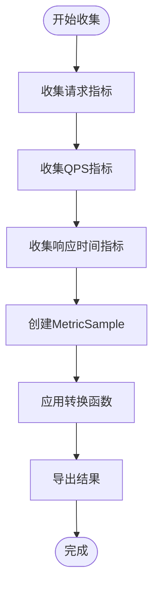

**代码路径**
- [AggregateMetricsCollector.java](file://dubbo-metrics/dubbo-metrics-default/src/main/java/org/apache/dubbo/metrics/collector/AggregateMetricsCollector.java#L220-L230)

## 性能优化措施

### 增量计算
采用增量计算避免重复遍历所有数据：

- **实时更新**: 每次新增数据时立即更新统计值
- **避免全量计算**: 只在需要时进行最终聚合
- **缓存中间结果**: 保持窗口内的统计中间值

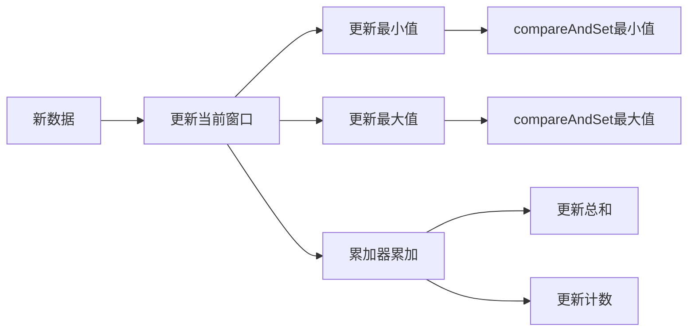

**代码路径**
- [TimeWindowAggregator.java](file://dubbo-metrics/dubbo-metrics-api/src/main/java/org/apache/dubbo/metrics/aggregate/TimeWindowAggregator.java#L101-L106)

### 缓存机制
使用高效的并发数据结构作为缓存：

- **LongAdder**: 高性能的长整型累加器
- **DoubleAccumulator**: 线程安全的双精度累加器
- **ConcurrentHashMap**: 并发哈希映射存储分组数据

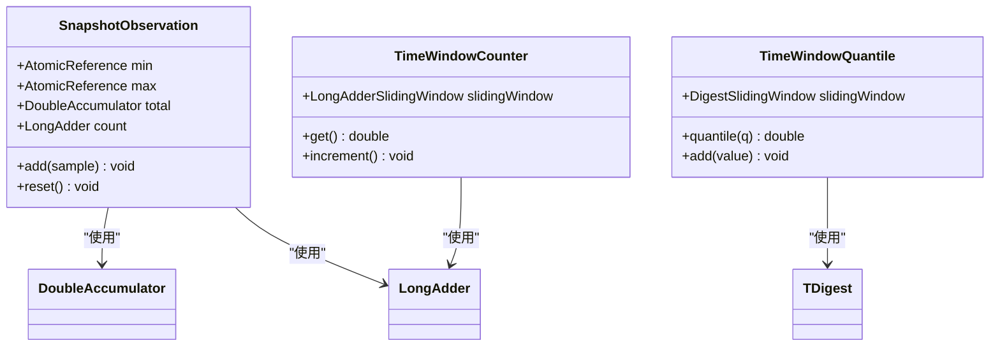

**代码路径**
- [TimeWindowAggregator.java](file://dubbo-metrics/dubbo-metrics-api/src/main/java/org/apache/dubbo/metrics/aggregate/TimeWindowAggregator.java#L96-L100)
- [TimeWindowCounter.java](file://dubbo-metrics/dubbo-metrics-api/src/main/java/org/apache/dubbo/metrics/aggregate/TimeWindowCounter.java#L72-L90)

### 并发处理
优化并发处理性能：

- **无锁设计**: 大部分操作使用CAS实现无锁并发
- **细粒度锁**: 仅在必要时使用重入锁
- **线程安全**: 所有数据结构都保证线程安全

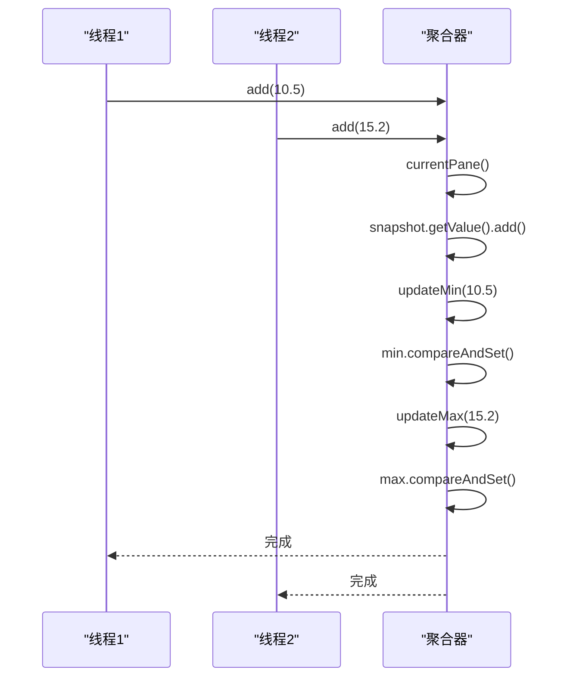

**代码路径**
- [TimeWindowAggregator.java](file://dubbo-metrics/dubbo-metrics-api/src/main/java/org/apache/dubbo/metrics/aggregate/TimeWindowAggregator.java#L108-L124)

## 配置示例与调优建议

### 基础配置示例
简单的数据聚合配置示例：

```java
// 启用指标聚合
MetricsConfig metricsConfig = new MetricsConfig();
AggregationConfig aggregationConfig = new AggregationConfig();
aggregationConfig.setEnabled(true);
aggregationConfig.setBucketNum(10);
aggregationConfig.setTimeWindowSeconds(120);
metricsConfig.setAggregation(aggregationConfig);
```

**代码路径**
- [AggregateMetricsCollectorTest.java](file://dubbo-metrics/dubbo-metrics-default/src/test/java/org/apache/dubbo/metrics/collector/AggregateMetricsCollectorTest.java#L107-L114)

### 高级调优建议
针对不同场景的调优建议：

1. **高并发场景**: 增加分片数量以减少锁竞争
2. **长周期监控**: 增加时间窗口长度以获取更平滑的趋势
3. **实时性要求高**: 减少时间窗口长度以提高响应速度
4. **内存敏感环境**: 适当减少分片数量以降低内存占用

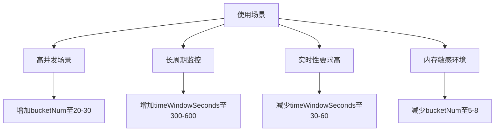

**代码路径**
- [AggregateMetricsCollector.java](file://dubbo-metrics/dubbo-metrics-default/src/main/java/org/apache/dubbo/metrics/collector/AggregateMetricsCollector.java#L83-L105)

## 结论
Dubbo的指标数据聚合功能通过精心设计的滑动窗口算法和高效的并发控制机制，实现了高性能、高可用的指标统计。该功能不仅支持多种统计方式，还提供了灵活的配置选项和优化策略，能够满足不同场景下的监控需求。通过合理的配置和调优，可以有效提升系统的可观测性和稳定性。