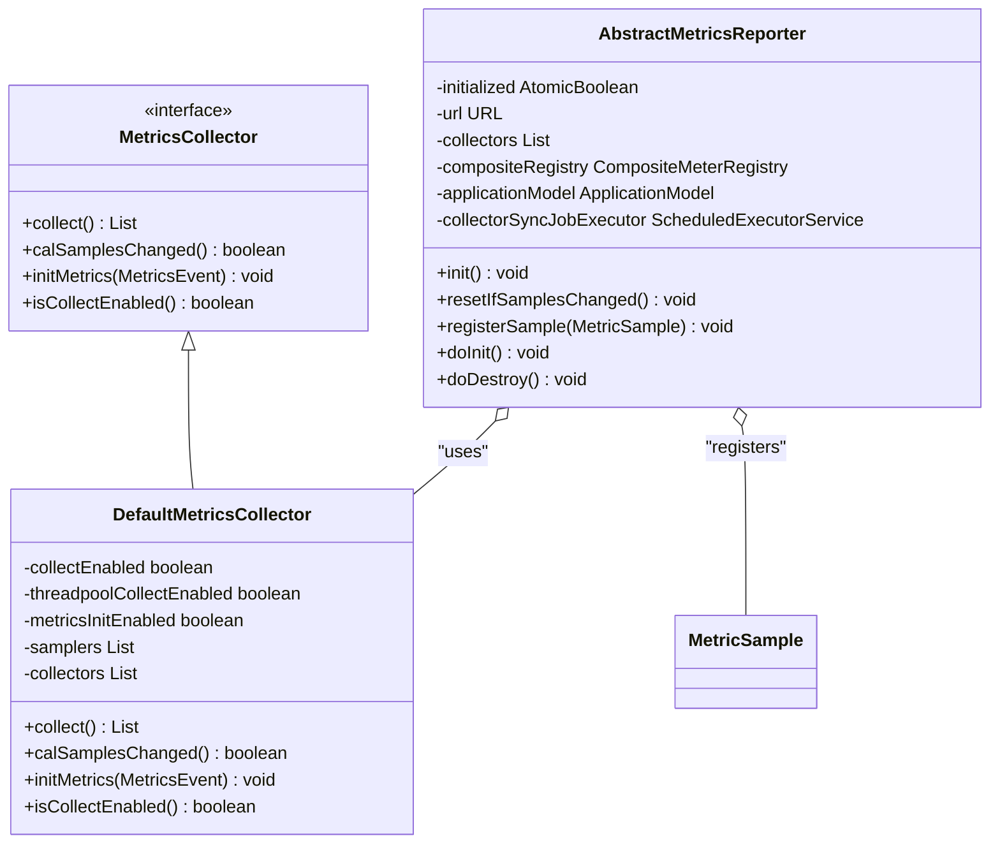
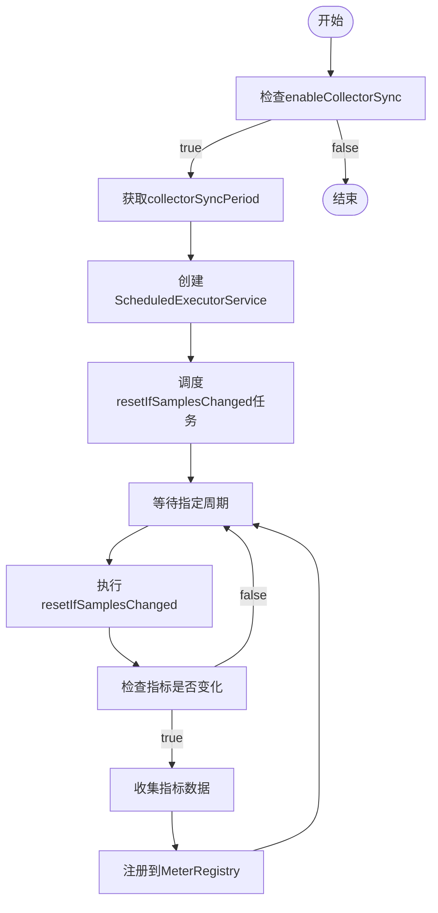
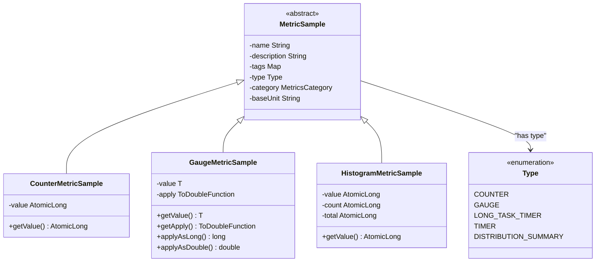
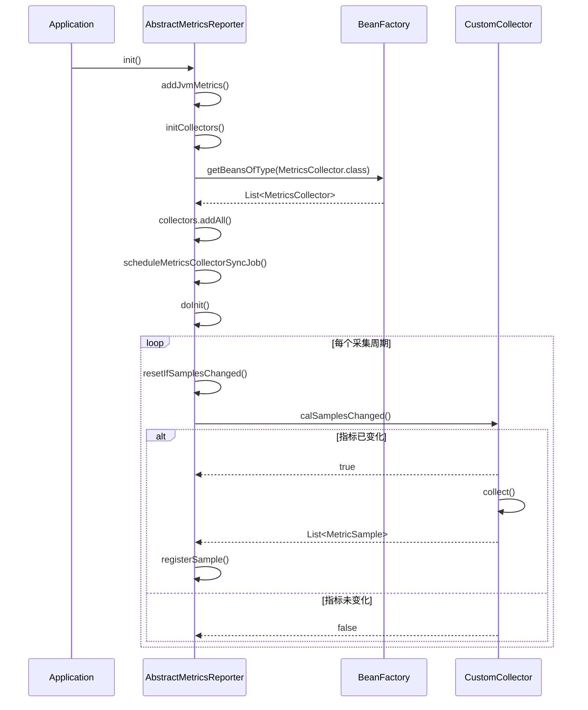
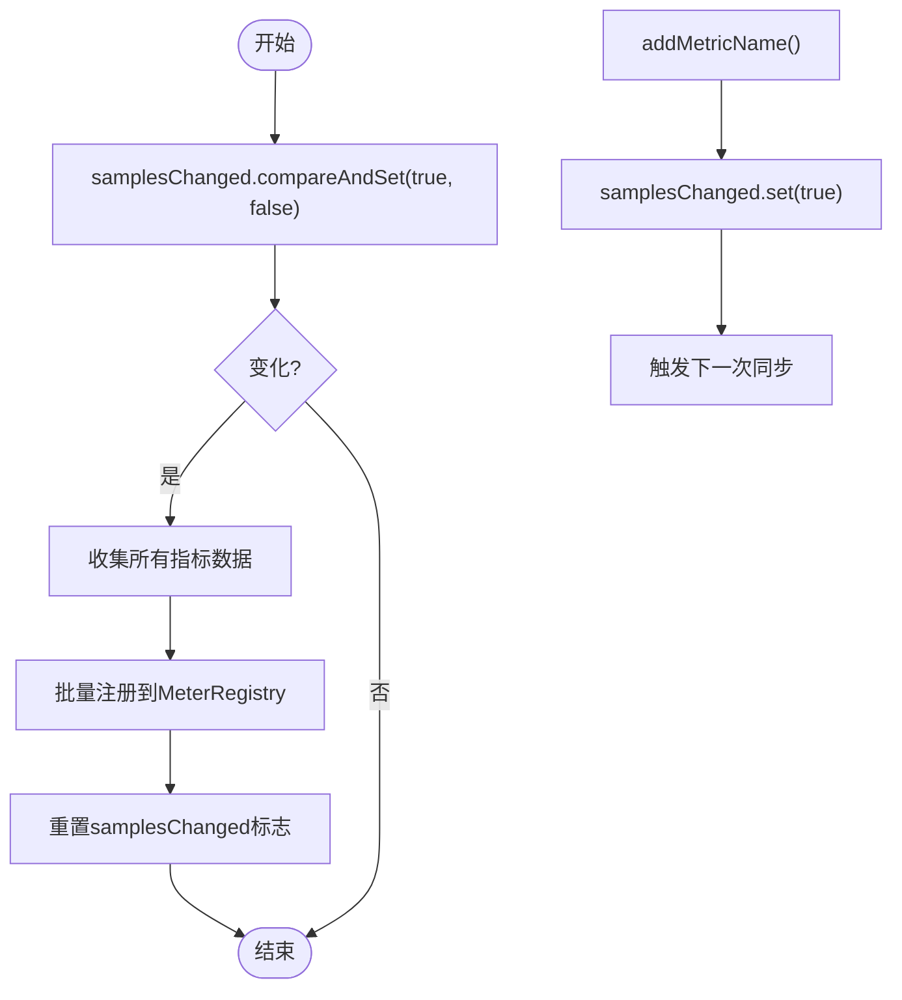
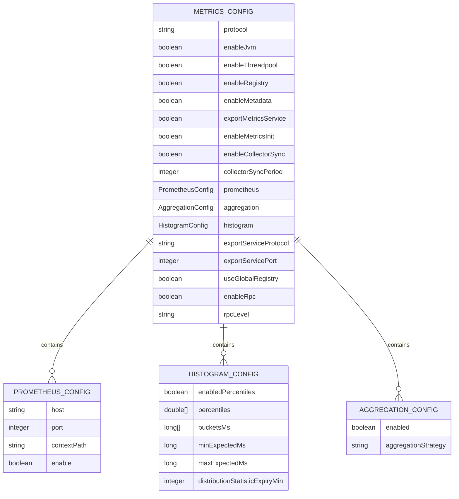

# 采集策略

<cite>
**本文档引用的文件**
- [MetricsCollector.java](file://dubbo-metrics\dubbo-metrics-api\src\main\java\org\apache\dubbo\metrics\collector\MetricsCollector.java)
- [DefaultMetricsCollector.java](file://dubbo-metrics\dubbo-metrics-default\src\main\java\org\apache\dubbo\metrics\collector\DefaultMetricsCollector.java)
- [AbstractMetricsReporter.java](file://dubbo-metrics\dubbo-metrics-default\src\main\java\org\apache\dubbo\metrics\report\AbstractMetricsReporter.java)
- [MetricsConfig.java](file://dubbo-common\src\main\java\org\apache\dubbo\config\MetricsConfig.java)
- [MetricSample.java](file://dubbo-metrics\dubbo-metrics-api\src\main\java\org\apache\dubbo\metrics\model\sample\MetricSample.java)
- [MetricsNameCountSampler.java](file://dubbo-metrics\dubbo-metrics-default\src\main\java\org\apache\dubbo\metrics\collector\sample\MetricsNameCountSampler.java)
- [GaugeMetricSample.java](file://dubbo-metrics\dubbo-metrics-api\src\main\java\org\apache\dubbo\metrics\model\sample\GaugeMetricSample.java)
- [HistogramMetricRegister.java](file://dubbo-metrics\dubbo-metrics-default\src\main\java\org\apache\dubbo\metrics\register\HistogramMetricRegister.java)
- [MetricsBuilder.java](file://dubbo-config\dubbo-config-api\src\main\java\org\apache\dubbo\config\bootstrap\builders\MetricsBuilder.java)
</cite>

## 目录
1. [引言](#引言)
2. [核心组件分析](#核心组件分析)
3. [MetricsCollector接口设计原理](#metricscollector接口设计原理)
4. [指标采集周期与频率](#指标采集周期与频率)
5. [不同指标类型的采集策略](#不同指标类型的采集策略)
6. [自定义指标收集器注册](#自定义指标收集器注册)
7. [性能优化与资源管理](#性能优化与资源管理)
8. [配置示例与调优建议](#配置示例与调优建议)
9. [结论](#结论)

## 引言

Dubbo的metrics模块提供了全面的指标采集功能，用于监控和分析Dubbo服务的运行状态。本文档深入探讨了指标采集策略，重点分析了MetricsCollector接口的设计原理和实现机制。文档详细描述了指标数据的采集周期、频率和范围，解释了不同类型指标（如计数器、计量器、定时器）的采集策略差异。同时，文档还提供了性能优化措施和资源管理策略，包括异步采集、批量处理和内存管理，为开发者提供了完整的指标采集解决方案。

## 核心组件分析

Dubbo metrics模块的核心组件包括MetricsCollector接口、DefaultMetricsCollector实现类、AbstractMetricsReporter报告器以及相关的采样器和配置类。MetricsCollector接口定义了指标采集的基本契约，通过collect()方法收集指标数据，通过calSamplesChanged()方法检测指标是否发生变化。DefaultMetricsCollector作为默认实现，继承了CombMetricsCollector并实现了具体的采集逻辑。AbstractMetricsReporter负责将采集到的指标数据同步到外部监控系统，如Prometheus。这些组件协同工作，构成了完整的指标采集和报告体系。

**本节来源**
- [MetricsCollector.java](file://dubbo-metrics\dubbo-metrics-api\src\main\java\org\apache\dubbo\metrics\collector\MetricsCollector.java#L38-L55)
- [DefaultMetricsCollector.java](file://dubbo-metrics\dubbo-metrics-default\src\main\java\org\apache\dubbo\metrics\collector\DefaultMetricsCollector.java#L58-L245)
- [AbstractMetricsReporter.java](file://dubbo-metrics\dubbo-metrics-default\src\main\java\org\apache\dubbo\metrics\report\AbstractMetricsReporter.java#L62-L241)

## MetricsCollector接口设计原理

MetricsCollector接口是Dubbo metrics模块的核心，它定义了指标采集的基本契约。该接口通过SPI（Service Provider Interface）机制实现扩展，允许开发者提供自定义的指标采集实现。接口的主要方法包括collect()用于收集指标数据，calSamplesChanged()用于检测指标是否发生变化，以及initMetrics()用于初始化指标。

**图表来源**
- [MetricsCollector.java](file://dubbo-metrics\dubbo-metrics-api\src\main\java\org\apache\dubbo\metrics\collector\MetricsCollector.java#L31-L55)
- [DefaultMetricsCollector.java](file://dubbo-metrics\dubbo-metrics-default\src\main\java\org\apache\dubbo\metrics\collector\DefaultMetricsCollector.java#L58-L245)
- [AbstractMetricsReporter.java](file://dubbo-metrics\dubbo-metrics-default\src\main\java\org\apache\dubbo\metrics\report\AbstractMetricsReporter.java#L62-L241)

**本节来源**
- [MetricsCollector.java](file://dubbo-metrics\dubbo-metrics-api\src\main\java\org\apache\dubbo\metrics\collector\MetricsCollector.java#L31-L55)

## 指标采集周期与频率

Dubbo metrics模块通过配置参数控制指标采集的周期和频率。核心配置参数包括enableCollectorSync和collectorSyncPeriod，分别用于启用/禁用采集器同步和设置同步周期。默认情况下，采集器同步是启用的，同步周期为60秒。通过AbstractMetricsReporter中的scheduleMetricsCollectorSyncJob()方法，系统会创建一个定时任务，按照指定的周期执行指标同步。

**图表来源**
- [AbstractMetricsReporter.java](file://dubbo-metrics\dubbo-metrics-default\src\main\java\org\apache\dubbo\metrics\report\AbstractMetricsReporter.java#L144-L154)
- [MetricsConfig.java](file://dubbo-common\src\main\java\org\apache\dubbo\config\MetricsConfig.java#L77-L85)

**本节来源**
- [AbstractMetricsReporter.java](file://dubbo-metrics\dubbo-metrics-default\src\main\java\org\apache\dubbo\metrics\report\AbstractMetricsReporter.java#L144-L154)
- [MetricsConfig.java](file://dubbo-common\src\main\java\org\apache\dubbo\config\MetricsConfig.java#L77-L85)

## 不同指标类型的采集策略

Dubbo metrics模块支持多种指标类型，包括计数器(COUNTER)、计量器(GAUGE)、定时器(TIMER)等。每种指标类型有不同的采集策略。计数器用于记录事件发生的次数，其值只能递增；计量器用于记录瞬时值，可以任意增减；定时器用于记录事件的持续时间。

**图表来源**
- [MetricSample.java](file://dubbo-metrics\dubbo-metrics-api\src\main\java\org\apache\dubbo\metrics\model\sample\MetricSample.java#L27-L140)
- [GaugeMetricSample.java](file://dubbo-metrics\dubbo-metrics-api\src\main\java\org\apache\dubbo\metrics\model\sample\GaugeMetricSample.java#L35-L114)
- [HistogramMetricRegister.java](file://dubbo-metrics\dubbo-metrics-default\src\main\java\org\apache\dubbo\metrics\register\HistogramMetricRegister.java#L36-L83)

**本节来源**
- [MetricSample.java](file://dubbo-metrics\dubbo-metrics-api\src\main\java\org\apache\dubbo\metrics\model\sample\MetricSample.java#L132-L138)
- [GaugeMetricSample.java](file://dubbo-metrics\dubbo-metrics-api\src\main\java\org\apache\dubbo\metrics\model\sample\GaugeMetricSample.java#L39-L41)
- [HistogramMetricRegister.java](file://dubbo-metrics\dubbo-metrics-default\src\main\java\org\apache\dubbo\metrics\register\HistogramMetricRegister.java#L52-L81)

## 自定义指标收集器注册

开发者可以通过实现MetricsCollector接口来注册自定义的指标收集器。系统会自动发现并注册通过SPI机制声明的MetricsCollector实现。在AbstractMetricsReporter的initCollectors()方法中，系统会从BeanFactory中获取所有MetricsCollector类型的Bean，并将其添加到collectors列表中。这种方式使得自定义指标收集器能够无缝集成到现有的指标采集体系中。

**图表来源**
- [AbstractMetricsReporter.java](file://dubbo-metrics\dubbo-metrics-default\src\main\java\org\apache\dubbo\metrics\report\AbstractMetricsReporter.java#L136-L142)
- [MetricsCollector.java](file://dubbo-metrics\dubbo-metrics-api\src\main\java\org\apache\dubbo\metrics\collector\MetricsCollector.java#L31-L32)

**本节来源**
- [AbstractMetricsReporter.java](file://dubbo-metrics\dubbo-metrics-default\src\main\java\org\apache\dubbo\metrics\report\AbstractMetricsReporter.java#L136-L142)

## 性能优化与资源管理

Dubbo metrics模块在性能优化和资源管理方面采用了多种策略。首先，通过CAS（Compare-And-Swap）操作实现无锁的线程安全，避免了传统锁机制带来的性能开销。其次，采用批量处理机制，在固定周期内批量同步指标数据，减少了频繁的I/O操作。此外，系统还实现了变化检测机制，只有当指标数据发生变化时才进行同步，避免了不必要的资源消耗。

**图表来源**
- [DefaultMetricsCollector.java](file://dubbo-metrics\dubbo-metrics-default\src\main\java\org\apache\dubbo\metrics\collector\DefaultMetricsCollector.java#L234-L243)
- [MetricsNameCountSampler.java](file://dubbo-metrics\dubbo-metrics-default\src\main\java\org\apache\dubbo\metrics\collector\sample\MetricsNameCountSampler.java#L75-L78)
- [AbstractMetricsReporter.java](file://dubbo-metrics\dubbo-metrics-default\src\main\java\org\apache\dubbo\metrics\report\AbstractMetricsReporter.java#L157-L177)

**本节来源**
- [DefaultMetricsCollector.java](file://dubbo-metrics\dubbo-metrics-default\src\main\java\org\apache\dubbo\metrics\collector\DefaultMetricsCollector.java#L234-L243)
- [MetricsNameCountSampler.java](file://dubbo-metrics\dubbo-metrics-default\src\main\java\org\apache\dubbo\metrics\collector\sample\MetricsNameCountSampler.java#L75-L78)

## 配置示例与调优建议

Dubbo metrics模块提供了丰富的配置选项，可以通过MetricsConfig类进行配置。对于初学者，建议使用默认配置快速启用指标采集功能。对于高级用户，可以根据具体需求进行调优。例如，可以通过调整collectorSyncPeriod来平衡指标实时性和系统性能，通过enableJvm参数控制JVM指标的采集。

**图表来源**
- [MetricsConfig.java](file://dubbo-common\src\main\java\org\apache\dubbo\config\MetricsConfig.java#L33-L291)
- [MetricsBuilder.java](file://dubbo-config\dubbo-config-api\src\main\java\org\apache\dubbo\config\bootstrap\builders\MetricsBuilder.java#L111-L154)

**本节来源**
- [MetricsConfig.java](file://dubbo-common\src\main\java\org\apache\dubbo\config\MetricsConfig.java#L33-L291)
- [MetricsBuilder.java](file://dubbo-config\dubbo-config-api\src\main\java\org\apache\dubbo\config\bootstrap\builders\MetricsBuilder.java#L111-L154)

## 结论

Dubbo metrics模块提供了一套完整、灵活且高性能的指标采集解决方案。通过MetricsCollector接口的设计，系统实现了高度的可扩展性，允许开发者轻松集成自定义的指标采集逻辑。采集周期和频率的可配置性使得系统能够适应不同的监控需求和性能要求。对不同类型指标的差异化处理确保了数据的准确性和有效性。通过异步采集、批量处理和变化检测等优化策略，系统在保证指标实时性的同时，最大限度地减少了对业务性能的影响。整体而言，Dubbo metrics模块为微服务架构下的监控和运维提供了强有力的支持。