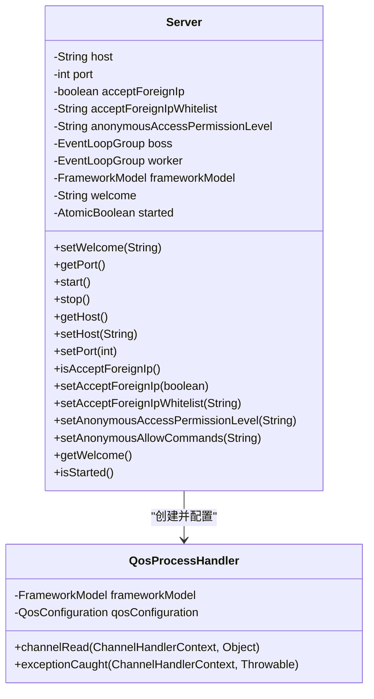
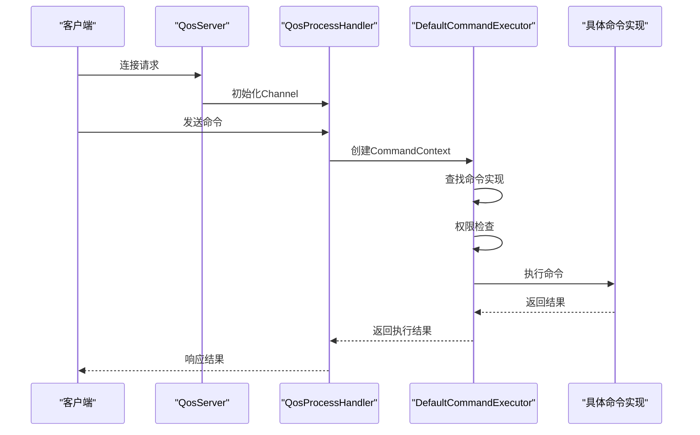
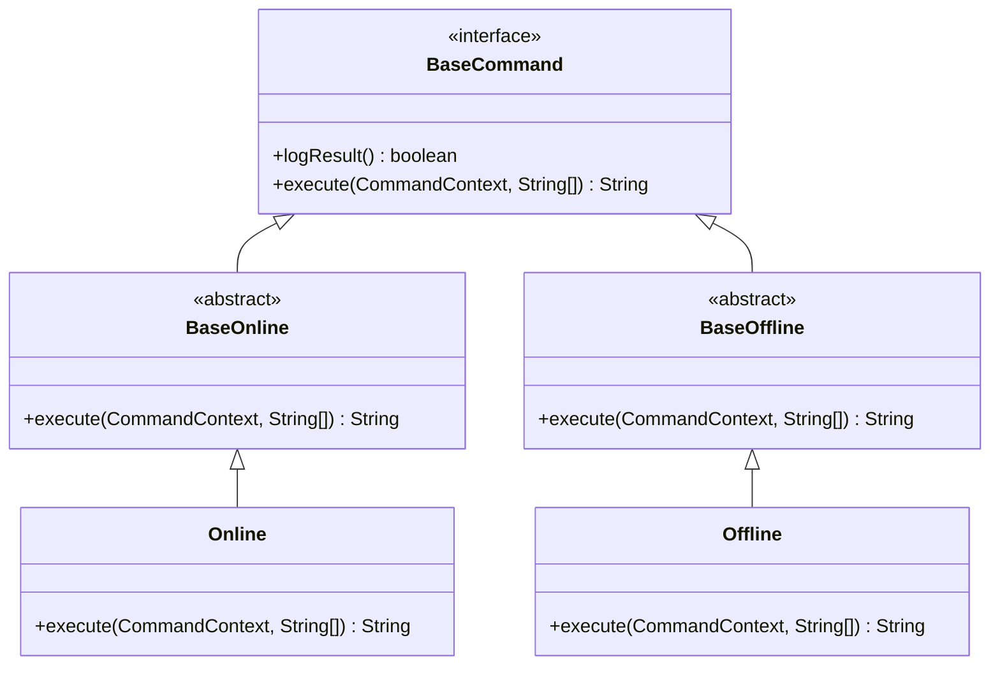
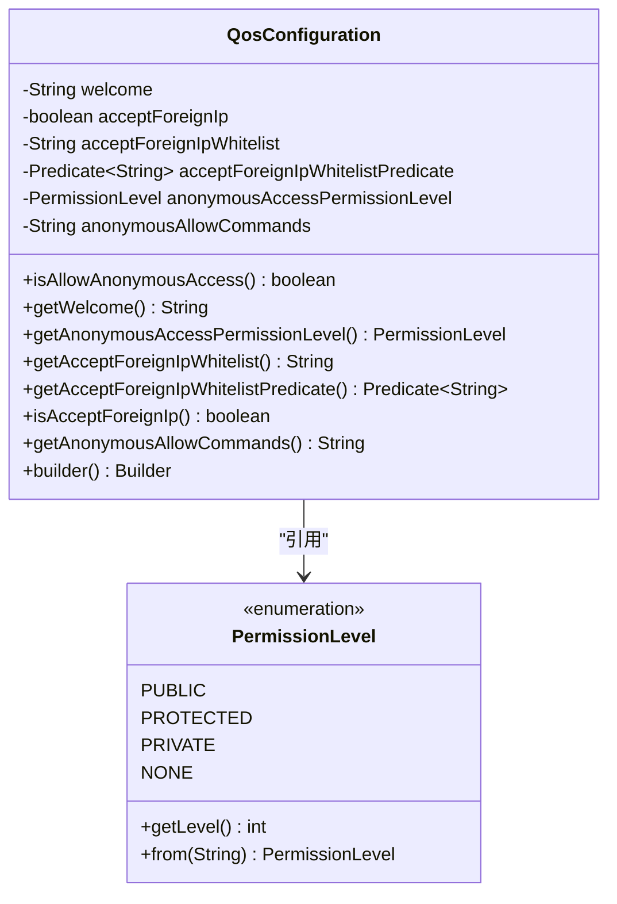
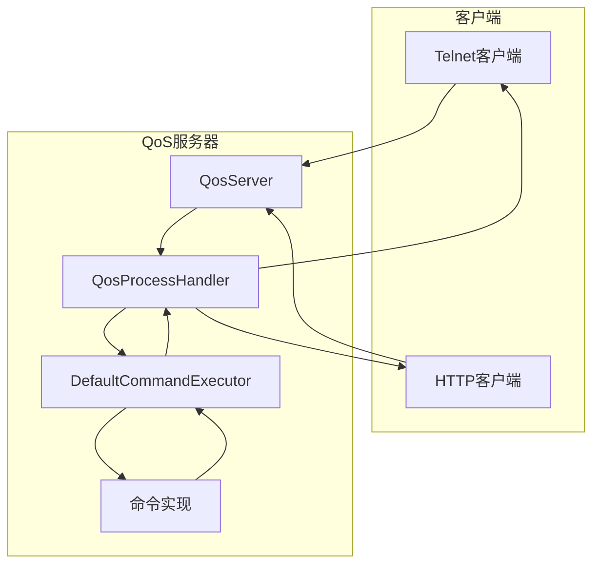
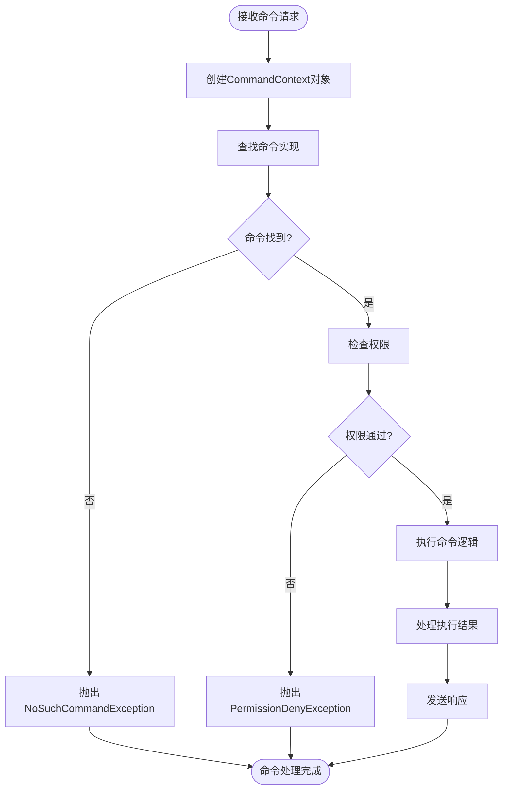

# QoS控制台

<cite>
**本文档中引用的文件**   
- [BaseCommand.java](file://dubbo-plugin/dubbo-qos-api/src/main/java/org/apache/dubbo/qos/api/BaseCommand.java)
- [Cmd.java](file://dubbo-plugin/dubbo-qos-api/src/main/java/org/apache/dubbo/qos/api/Cmd.java)
- [CommandContext.java](file://dubbo-plugin/dubbo-qos-api/src/main/java/org/apache/dubbo/qos/api/CommandContext.java)
- [PermissionLevel.java](file://dubbo-plugin/dubbo-qos-api/src/main/java/org/apache/dubbo/qos/api/PermissionLevel.java)
- [QosConfiguration.java](file://dubbo-plugin/dubbo-qos-api/src/main/java/org/apache/dubbo/qos/api/QosConfiguration.java)
- [Server.java](file://dubbo-plugin/dubbo-qos/src/main/java/org/apache/dubbo/qos/server/Server.java)
- [DefaultCommandExecutor.java](file://dubbo-plugin/dubbo-qos/src/main/java/org/apache/dubbo/qos/command/DefaultCommandExecutor.java)
- [CommandExecutor.java](file://dubbo-plugin/dubbo-qos/src/main/java/org/apache/dubbo/qos/command/CommandExecutor.java)
- [Online.java](file://dubbo-plugin/dubbo-qos/src/main/java/org/apache/dubbo/qos/command/impl/Online.java)
- [Offline.java](file://dubbo-plugin/dubbo-qos/src/main/java/org/apache/dubbo/qos/command/impl/Offline.java)
- [BaseOnline.java](file://dubbo-plugin/dubbo-qos/src/main/java/org/apache/dubbo/qos/command/impl/BaseOnline.java)
- [BaseOffline.java](file://dubbo-plugin/dubbo-qos/src/main/java/org/apache/dubbo/qos/command/impl/BaseOffline.java)
</cite>

## 目录
1. [QoS控制台概述](#qos控制台概述)
2. [QosServer设计原理与实现](#qosserver设计原理与实现)
3. [命令行接口(Command)注册与执行机制](#命令行接口command注册与执行机制)
4. [内置命令实现与使用](#内置命令实现与使用)
5. [自定义QoS命令开发](#自定义qos命令开发)
6. [安全配置与访问控制](#安全配置与访问控制)
7. [QoS控制台架构图](#qos控制台架构图)
8. [命令处理流程图](#命令处理流程图)

## QoS控制台概述

QoS（Quality of Service）控制台是Dubbo框架提供的一个运维管理工具，允许开发者通过Telnet或HTTP方式连接到Dubbo服务，执行各种运维命令。QoS控制台提供了丰富的内置命令，如服务上下线、状态查询、性能诊断等，同时也支持用户自定义命令扩展功能。

**本节来源**
- [Server.java](file://dubbo-plugin/dubbo-qos/src/main/java/org/apache/dubbo/qos/server/Server.java#L38-L45)

## QosServer设计原理与实现

QosServer是QoS控制台的核心组件，负责启动服务器、监听端口并处理客户端连接。它基于Netty框架实现，支持同时处理Telnet和HTTP请求。QosServer通过ServerBootstrap配置Netty服务端，使用NioEventLoopGroup处理I/O事件，并通过QosProcessHandler处理具体的命令请求。

QosServer的设计采用了单例模式，确保在整个应用生命周期中只有一个实例运行。服务器启动时会绑定指定的主机和端口，默认情况下绑定到localhost的22222端口。通过acceptForeignIp配置可以控制是否接受外部IP的连接请求。

**图示来源**
- [Server.java](file://dubbo-plugin/dubbo-qos/src/main/java/org/apache/dubbo/qos/server/Server.java)
- [QosProcessHandler.java](file://dubbo-plugin/dubbo-qos/src/main/java/org/apache/dubbo/qos/server/handler/QosProcessHandler.java)

**本节来源**
- [Server.java](file://dubbo-plugin/dubbo-qos/src/main/java/org/apache/dubbo/qos/server/Server.java)

## 命令行接口(Command)注册与执行机制

QoS控制台的命令行接口基于SPI（Service Provider Interface）机制实现。所有命令都实现了BaseCommand接口，并通过@Cmd注解进行配置。命令的注册和发现由FrameworkModel的扩展加载器负责管理。

命令执行流程如下：当客户端发送命令请求时，QosServer接收到请求后创建CommandContext对象，包含命令名称、参数、远程连接信息等。然后通过DefaultCommandExecutor执行命令，首先查找对应的命令实现，然后进行权限检查，最后调用命令的execute方法执行具体逻辑。

**图示来源**
- [Server.java](file://dubbo-plugin/dubbo-qos/src/main/java/org/apache/dubbo/qos/server/Server.java)
- [DefaultCommandExecutor.java](file://dubbo-plugin/dubbo-qos/src/main/java/org/apache/dubbo/qos/command/DefaultCommandExecutor.java)
- [CommandContext.java](file://dubbo-plugin/dubbo-qos-api/src/main/java/org/apache/dubbo/qos/api/CommandContext.java)

**本节来源**
- [BaseCommand.java](file://dubbo-plugin/dubbo-qos-api/src/main/java/org/apache/dubbo/qos/api/BaseCommand.java)
- [Cmd.java](file://dubbo-plugin/dubbo-qos-api/src/main/java/org/apache/dubbo/qos/api/Cmd.java)
- [CommandContext.java](file://dubbo-plugin/dubbo-qos-api/src/main/java/org/apache/dubbo/qos/api/CommandContext.java)
- [DefaultCommandExecutor.java](file://dubbo-plugin/dubbo-qos/src/main/java/org/apache/dubbo/qos/command/DefaultCommandExecutor.java)

## 内置命令实现与使用

QoS控制台提供了丰富的内置命令，其中Online和Offline命令用于服务的上下线操作。这些命令都继承自BaseOnline和BaseOffline基类，实现了具体的服务管理逻辑。

### Online命令

Online命令用于将服务重新上线，使其可以接收新的请求。该命令会检查服务的当前状态，如果服务处于离线状态，则将其状态更改为在线，并通知注册中心更新服务状态。

### Offline命令

Offline命令用于将服务下线，停止接收新的请求。该命令会检查服务的当前状态，如果服务处于在线状态，则将其状态更改为离线，并通知注册中心更新服务状态。下线操作通常用于服务升级或维护。

**图示来源**
- [BaseCommand.java](file://dubbo-plugin/dubbo-qos-api/src/main/java/org/apache/dubbo/qos/api/BaseCommand.java)
- [BaseOnline.java](file://dubbo-plugin/dubbo-qos/src/main/java/org/apache/dubbo/qos/command/impl/BaseOnline.java)
- [BaseOffline.java](file://dubbo-plugin/dubbo-qos/src/main/java/org/apache/dubbo/qos/command/impl/BaseOffline.java)
- [Online.java](file://dubbo-plugin/dubbo-qos/src/main/java/org/apache/dubbo/qos/command/impl/Online.java)
- [Offline.java](file://dubbo-plugin/dubbo-qos/src/main/java/org/apache/dubbo/qos/command/impl/Offline.java)

**本节来源**
- [Online.java](file://dubbo-plugin/dubbo-qos/src/main/java/org/apache/dubbo/qos/command/impl/Online.java)
- [Offline.java](file://dubbo-plugin/dubbo-qos/src/main/java/org/apache/dubbo/qos/command/impl/Offline.java)
- [BaseOnline.java](file://dubbo-plugin/dubbo-qos/src/main/java/org/apache/dubbo/qos/command/impl/BaseOnline.java)
- [BaseOffline.java](file://dubbo-plugin/dubbo-qos/src/main/java/org/apache/dubbo/qos/command/impl/BaseOffline.java)

## 自定义QoS命令开发

开发自定义QoS命令需要实现BaseCommand接口，并使用@Cmd注解进行配置。以下是一个简单的状态查询命令示例：

1. 创建新的命令类，实现BaseCommand接口
2. 使用@Cmd注解配置命令名称、描述、示例和权限级别
3. 实现execute方法，处理命令逻辑并返回结果

对于高级开发者，可以开发复杂的性能诊断命令，通过分析系统指标、调用链路等信息，提供深入的性能分析功能。

**本节来源**
- [BaseCommand.java](file://dubbo-plugin/dubbo-qos-api/src/main/java/org/apache/dubbo/qos/api/BaseCommand.java)
- [Cmd.java](file://dubbo-plugin/dubbo-qos-api/src/main/java/org/apache/dubbo/qos/api/Cmd.java)

## 安全配置与访问控制

QoS控制台提供了完善的安全配置和访问控制机制。通过QosConfiguration类可以配置匿名访问权限级别、允许的命令列表、IP白名单等安全策略。

权限级别分为三个等级：PUBLIC（公开）、PROTECTED（受保护）和PRIVATE（私有）。默认情况下，只有本地回环地址可以访问PROTECTED和PRIVATE级别的命令。通过配置acceptForeignIp和acceptForeignIpWhitelist，可以控制外部IP的访问权限。

**图示来源**
- [QosConfiguration.java](file://dubbo-plugin/dubbo-qos-api/src/main/java/org/apache/dubbo/qos/api/QosConfiguration.java)
- [PermissionLevel.java](file://dubbo-plugin/dubbo-qos-api/src/main/java/org/apache/dubbo/qos/api/PermissionLevel.java)

**本节来源**
- [QosConfiguration.java](file://dubbo-plugin/dubbo-qos-api/src/main/java/org/apache/dubbo/qos/api/QosConfiguration.java)
- [PermissionLevel.java](file://dubbo-plugin/dubbo-qos-api/src/main/java/org/apache/dubbo/qos/api/PermissionLevel.java)

## QoS控制台架构图

**图示来源**
- [Server.java](file://dubbo-plugin/dubbo-qos/src/main/java/org/apache/dubbo/qos/server/Server.java)
- [DefaultCommandExecutor.java](file://dubbo-plugin/dubbo-qos/src/main/java/org/apache/dubbo/qos/command/DefaultCommandExecutor.java)

## 命令处理流程图

**图示来源**
- [DefaultCommandExecutor.java](file://dubbo-plugin/dubbo-qos/src/main/java/org/apache/dubbo/qos/command/DefaultCommandExecutor.java)
- [CommandContext.java](file://dubbo-plugin/dubbo-qos-api/src/main/java/org/apache/dubbo/qos/api/CommandContext.java)