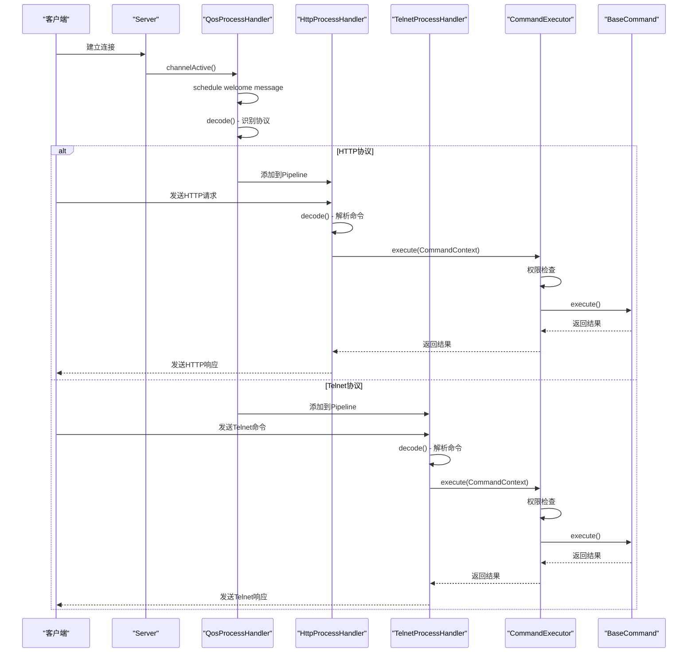
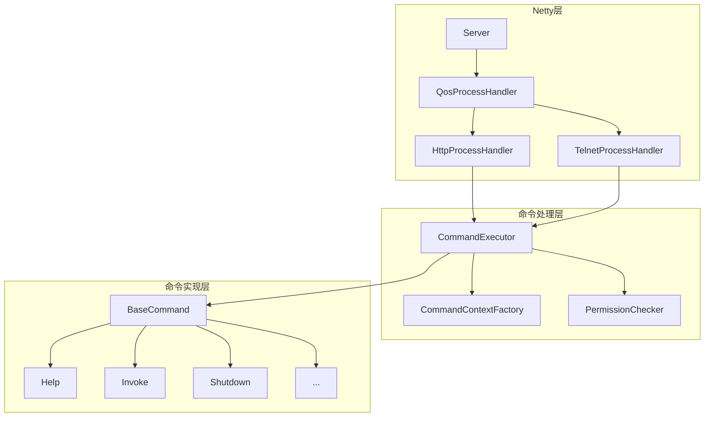

# QoS控制台架构

<cite>
**本文档引用的文件**   
- [Server.java](file://dubbo-plugin\dubbo-qos\src\main\java\org\apache\dubbo\qos\server\Server.java)
- [QosConfiguration.java](file://dubbo-plugin\dubbo-qos-api\src\main\java\org\apache\dubbo\qos\api\QosConfiguration.java)
- [QosProcessHandler.java](file://dubbo-plugin\dubbo-qos\src\main\java\org\apache\dubbo\qos\server\handler\QosProcessHandler.java)
- [HttpProcessHandler.java](file://dubbo-plugin\dubbo-qos\src\main\java\org\apache\dubbo\qos\server\handler\HttpProcessHandler.java)
- [TelnetProcessHandler.java](file://dubbo-plugin\dubbo-qos\src\main\java\org\apache\dubbo\qos\server\handler\TelnetProcessHandler.java)
- [DefaultCommandExecutor.java](file://dubbo-plugin\dubbo-qos\src\main\java\org\apache\dubbo\qos\command\DefaultCommandExecutor.java)
- [CommandContextFactory.java](file://dubbo-plugin\dubbo-qos\src\main\java\org\apache\dubbo\qos\command\CommandContextFactory.java)
- [HttpCommandDecoder.java](file://dubbo-plugin\dubbo-qos\src\main\java\org\apache\dubbo\qos\command\decoder\HttpCommandDecoder.java)
- [TelnetCommandDecoder.java](file://dubbo-plugin\dubbo-qos\src\main\java\org\apache\dubbo\qos\command\decoder\TelnetCommandDecoder.java)
- [ApplicationConfig.java](file://dubbo-common\src\main\java\org\apache\dubbo\config\ApplicationConfig.java)
- [DefaultAnonymousAccessPermissionChecker.java](file://dubbo-plugin\dubbo-qos\src\main\java\org\apache\dubbo\qos\permission\DefaultAnonymousAccessPermissionChecker.java)
</cite>

## 目录
1. [简介](#简介)
2. [QoS服务器启动流程与配置参数](#qos服务器启动流程与配置参数)
3. [Netty服务器初始化过程](#netty服务器初始化过程)
4. [端口绑定与连接处理机制](#端口绑定与连接处理机制)
5. [QoS控制台整体架构设计](#qos控制台整体架构设计)
6. [核心组件协作关系](#核心组件协作关系)
7. [QoS服务器生命周期管理](#qos服务器生命周期管理)
8. [架构框图](#架构框图)
9. [性能优化建议](#性能优化建议)

## 简介
QoS（Quality of Service）控制台是Dubbo框架提供的一个运维管理工具，通过Telnet或HTTP协议提供服务，用于监控和管理Dubbo服务的运行状态。QoS控制台允许开发者通过简单的命令行操作来查看服务信息、执行管理命令、进行性能调优等操作。本文档将详细阐述QoS控制台的架构设计、启动流程、配置参数、Netty服务器初始化过程、端口绑定与连接处理机制、核心组件协作关系以及服务器生命周期管理，并为初学者提供架构框图，为高级开发者提供性能优化建议。

## QoS服务器启动流程与配置参数
QoS服务器的启动流程始于`Server`类的`start()`方法。该方法首先检查服务器是否已经启动，如果未启动，则创建两个Netty的`EventLoopGroup`：`boss`用于接受客户端连接，`worker`用于处理已建立连接的I/O操作。接着，配置`ServerBootstrap`，设置`boss`和`worker`组、服务器通道类型为`NioServerSocketChannel`，并配置一些通道选项，如`SO_REUSEADDR`和`TCP_NODELAY`。然后，设置`childHandler`，该处理器负责为每个新连接初始化其`ChannelPipeline`。最后，调用`bind()`方法绑定指定的主机和端口，完成服务器的启动。

QoS服务器的配置参数主要通过`QosConfiguration`类进行管理，这些参数可以通过`ApplicationConfig`在应用级别进行配置。主要配置参数包括：
- **qosEnable**: 是否启用QoS服务。
- **qosPort**: QoS服务监听的端口，默认为22222。
- **qosHost**: QoS服务绑定的主机地址，如果为空则绑定到localhost。
- **qosAcceptForeignIp**: 是否接受来自外部IP的连接，默认为true。
- **qosAcceptForeignIpWhitelist**: 当`qosAcceptForeignIp`为false时，允许连接的外部IP白名单，支持CIDR格式。
- **qosAnonymousAccessPermissionLevel**: 匿名访问的权限级别，可选值为`NONE`、`PUBLIC`、`PROTECTED`、`PRIVATE`。
- **qosAnonymousAllowCommands**: 匿名用户允许执行的命令列表。

这些配置参数在`ApplicationConfig`类中通过相应的getter和setter方法进行访问和设置，并在QoS服务器启动时传递给`QosConfiguration`对象。

**Section sources**
- [Server.java](file://dubbo-plugin\dubbo-qos\src\main\java\org\apache\dubbo\qos\server\Server.java#L90-L128)
- [QosConfiguration.java](file://dubbo-plugin\dubbo-qos-api\src\main\java\org\apache\dubbo\qos\api\QosConfiguration.java#L26-L168)
- [ApplicationConfig.java](file://dubbo-common\src\main\java\org\apache\dubbo\config\ApplicationConfig.java#L560-L696)

## Netty服务器初始化过程
QoS控制台使用Netty作为其底层网络通信框架。Netty服务器的初始化过程在`Server`类的`start()`方法中完成。首先，创建`NioEventLoopGroup`实例作为`boss`和`worker`线程组。`boss`线程组负责监听和接受新的连接，通常只需要一个线程；`worker`线程组负责处理所有已建立连接的I/O操作，其线程数由Netty根据CPU核心数自动确定。

接着，创建`ServerBootstrap`实例并进行配置：
- 调用`group(boss, worker)`方法将`boss`和`worker`线程组关联到`ServerBootstrap`。
- 调用`channel(NioServerSocketChannel.class)`方法指定服务器通道的实现类。
- 调用`option(ChannelOption.SO_REUSEADDR, true)`方法允许端口重用。
- 调用`childOption(ChannelOption.TCP_NODELAY, true)`方法禁用Nagle算法，以减少小数据包的延迟。

最关键的一步是设置`childHandler`，它是一个`ChannelInitializer`的匿名实现。当一个新的连接被接受时，Netty会调用`initChannel()`方法来初始化该连接的`ChannelPipeline`。在QoS控制台中，`initChannel()`方法会向`ChannelPipeline`中添加一个`QosProcessHandler`处理器，该处理器负责后续的协议识别和处理。

**Section sources**
- [Server.java](file://dubbo-plugin\dubbo-qos\src\main\java\org\apache\dubbo\qos\server\Server.java#L94-L116)

## 端口绑定与连接处理机制
端口绑定是通过`ServerBootstrap`的`bind()`方法完成的。该方法会异步地绑定到指定的主机和端口。如果指定了主机地址，则调用`bind(host, port)`；否则调用`bind(port)`绑定到localhost。绑定成功后，服务器开始监听该端口上的连接请求。

连接处理机制的核心是`QosProcessHandler`。当一个新的连接建立时，`QosProcessHandler`的`channelActive()`方法会被调用，它会安排一个500毫秒后执行的定时任务，向客户端发送欢迎信息和提示符。`QosProcessHandler`继承自`ByteToMessageDecoder`，它的`decode()`方法负责读取输入流的第一个字节来猜测协议类型。如果第一个字节是'G'（GET）或'P'（POST），则认为是HTTP协议；否则认为是Telnet协议。

根据协议类型，`QosProcessHandler`会动态地修改`ChannelPipeline`：
- 对于HTTP协议，它会移除自己，并添加`HttpServerCodec`、`HttpObjectAggregator`和`HttpProcessHandler`处理器。
- 对于Telnet协议，它会移除自己，并添加`CtrlCHandler`、`LineBasedFrameDecoder`、`StringDecoder`、`StringEncoder`、`IdleStateHandler`、`TelnetIdleEventHandler`和`TelnetProcessHandler`处理器。

这种动态修改`ChannelPipeline`的机制使得一个端口可以同时支持HTTP和Telnet两种协议。

**Section sources**
- [Server.java](file://dubbo-plugin\dubbo-qos\src\main\java\org\apache\dubbo\qos\server\Server.java#L118-L122)
- [QosProcessHandler.java](file://dubbo-plugin\dubbo-qos\src\main\java\org\apache\dubbo\qos\server\handler\QosProcessHandler.java#L72-L115)

## QoS控制台整体架构设计
QoS控制台的整体架构设计遵循了Netty的事件驱动模型和责任链模式。其核心组件包括`Server`、`QosProcessHandler`、`HttpProcessHandler`、`TelnetProcessHandler`、`CommandExecutor`、`CommandContextFactory`和`BaseCommand`。

`Server`是QoS服务的入口点，负责Netty服务器的启动和停止。`QosProcessHandler`是连接处理的起点，负责协议识别和`ChannelPipeline`的初始化。`HttpProcessHandler`和`TelnetProcessHandler`分别处理HTTP和Telnet协议的请求。`CommandExecutor`负责命令的执行和权限检查。`CommandContextFactory`负责创建`CommandContext`对象。`BaseCommand`是所有命令的接口，具体的命令实现类通过SPI机制进行扩展。

整个架构的设计目标是高内聚、低耦合，每个组件都有明确的职责，便于维护和扩展。

**Section sources**
- [Server.java](file://dubbo-plugin\dubbo-qos\src\main\java\org\apache\dubbo\qos\server\Server.java)
- [QosProcessHandler.java](file://dubbo-plugin\dubbo-qos\src\main\java\org\apache\dubbo\qos\server\handler\QosProcessHandler.java)
- [HttpProcessHandler.java](file://dubbo-plugin\dubbo-qos\src\main\java\org\apache\dubbo\qos\server\handler\HttpProcessHandler.java)
- [TelnetProcessHandler.java](file://dubbo-plugin\dubbo-qos\src\main\java\org\apache\dubbo\qos\server\handler\TelnetProcessHandler.java)
- [DefaultCommandExecutor.java](file://dubbo-plugin\dubbo-qos\src\main\java\org\apache\dubbo\qos\command\DefaultCommandExecutor.java)
- [CommandContextFactory.java](file://dubbo-plugin\dubbo-qos\src\main\java\org\apache\dubbo\qos\command\CommandContextFactory.java)
- [BaseCommand.java](file://dubbo-plugin\dubbo-qos-api\src\main\java\org\apache\dubbo\qos\api\BaseCommand.java)

## 核心组件协作关系
QoS控制台的核心组件通过事件驱动的方式紧密协作。当客户端发起连接时，`Server`接受连接并触发`QosProcessHandler`的`channelActive()`方法。`QosProcessHandler`的`decode()`方法被调用，根据协议类型动态配置`ChannelPipeline`。

对于HTTP请求，`HttpProcessHandler`的`channelRead0()`方法被调用。它首先使用`HttpCommandDecoder`从`HttpRequest`中解析出命令名和参数，创建`CommandContext`对象。然后，`HttpProcessHandler`将`CommandContext`传递给`CommandExecutor`执行。`CommandExecutor`通过SPI机制加载对应的`BaseCommand`实现，并检查执行权限。如果权限检查通过，则调用`BaseCommand`的`execute()`方法执行命令，并将结果封装成`FullHttpResponse`返回给客户端。

对于Telnet请求，`TelnetProcessHandler`的`channelRead0()`方法被调用。它使用`TelnetCommandDecoder`从字符串消息中解析出命令，创建`CommandContext`，然后同样交给`CommandExecutor`执行。执行结果通过`writeAndFlush()`方法发送回客户端。

`CommandContextFactory`在整个过程中负责创建`CommandContext`对象，而`DefaultAnonymousAccessPermissionChecker`则负责实现默认的权限检查逻辑。

**Diagram sources **
- [Server.java](file://dubbo-plugin\dubbo-qos\src\main\java\org\apache\dubbo\qos\server\Server.java)
- [QosProcessHandler.java](file://dubbo-plugin\dubbo-qos\src\main\java\org\apache\dubbo\qos\server\handler\QosProcessHandler.java)
- [HttpProcessHandler.java](file://dubbo-plugin\dubbo-qos\src\main\java\org\apache\dubbo\qos\server\handler\HttpProcessHandler.java)
- [TelnetProcessHandler.java](file://dubbo-plugin\dubbo-qos\src\main\java\org\apache\dubbo\qos\server\handler\TelnetProcessHandler.java)
- [DefaultCommandExecutor.java](file://dubbo-plugin\dubbo-qos\src\main\java\org\apache\dubbo\qos\command\DefaultCommandExecutor.java)

## QoS服务器生命周期管理
QoS服务器的生命周期管理主要包括启动、运行和关闭三个阶段。

**启动阶段**：通过调用`Server`类的`start()`方法启动服务器。该方法会初始化Netty的`EventLoopGroup`和`ServerBootstrap`，并绑定到指定的端口。启动成功后，服务器开始监听连接请求。

**运行阶段**：服务器在`EventLoop`线程的驱动下持续运行。每当有新的连接建立或数据到达时，Netty会触发相应的事件处理器（如`channelRead0`）来处理请求。`CommandExecutor`负责协调命令的执行流程，包括命令查找、权限检查和实际执行。

**关闭阶段**：通过调用`Server`类的`stop()`方法关闭服务器。该方法会记录日志，然后调用`boss`和`worker`线程组的`shutdownGracefully()`方法，优雅地关闭所有连接和线程。最后，将`started`标志设置为false，完成服务器的关闭。

整个生命周期管理确保了服务器能够稳定地启动、高效地运行和安全地关闭。

**Section sources**
- [Server.java](file://dubbo-plugin\dubbo-qos\src\main\java\org\apache\dubbo\qos\server\Server.java#L90-L142)

## 架构框图
以下是QoS控制台的架构框图，展示了各核心组件之间的关系。

**Diagram sources **
- [Server.java](file://dubbo-plugin\dubbo-qos\src\main\java\org\apache\dubbo\qos\server\Server.java)
- [QosProcessHandler.java](file://dubbo-plugin\dubbo-qos\src\main\java\org\apache\dubbo\qos\server\handler\QosProcessHandler.java)
- [HttpProcessHandler.java](file://dubbo-plugin\dubbo-qos\src\main\java\org\apache\dubbo\qos\server\handler\HttpProcessHandler.java)
- [TelnetProcessHandler.java](file://dubbo-plugin\dubbo-qos\src\main\java\org\apache\dubbo\qos\server\handler\TelnetProcessHandler.java)
- [DefaultCommandExecutor.java](file://dubbo-plugin\dubbo-qos\src\main\java\org\apache\dubbo\qos\command\DefaultCommandExecutor.java)
- [CommandContextFactory.java](file://dubbo-plugin\dubbo-qos\src\main\java\org\apache\dubbo\qos\command\CommandContextFactory.java)
- [DefaultAnonymousAccessPermissionChecker.java](file://dubbo-plugin\dubbo-qos\src\main\java\org\apache\dubbo\qos\permission\DefaultAnonymousAccessPermissionChecker.java)
- [BaseCommand.java](file://dubbo-plugin\dubbo-qos-api\src\main\java\org\apache\dubbo\qos\api\BaseCommand.java)

## 性能优化建议
为了优化QoS服务器的性能，可以考虑以下几点建议：

1. **线程模型调优**：`boss`线程组通常只需要一个线程，因为它只负责接受连接。`worker`线程组的线程数可以根据CPU核心数和预期的并发连接数进行调整。默认情况下，Netty会根据CPU核心数的两倍来设置线程数，这在大多数情况下是合适的。如果服务器的I/O操作非常轻量，可以适当增加线程数以提高并发处理能力。

2. **连接池配置**：QoS控制台本身不直接管理连接池，但可以通过调整Netty的`EventLoopGroup`来间接影响连接处理能力。确保有足够的`worker`线程来处理并发连接，避免线程饥饿。同时，合理设置`ChannelOption.SO_BACKLOG`参数，控制等待连接队列的大小。

3. **内存管理**：Netty使用直接内存（Direct Memory）来提高I/O性能。确保JVM有足够的直接内存，并监控其使用情况，避免`OutOfMemoryError`。可以通过`-XX:MaxDirectMemorySize`参数来限制直接内存的大小。

4. **空闲连接处理**：`TelnetProcessHandler`中使用了`IdleStateHandler`来检测空闲连接，并在5分钟后关闭它们。这个超时时间可以根据实际需求进行调整。对于需要长时间保持连接的场景，可以适当增加超时时间；对于高并发短连接的场景，可以减少超时时间以更快地释放资源。

5. **命令执行优化**：对于执行时间较长的命令，应考虑异步执行，避免阻塞Netty的I/O线程。可以将耗时操作提交到业务线程池中执行，并通过回调机制将结果返回给客户端。

通过以上优化措施，可以显著提升QoS控制台的性能和稳定性。

**Section sources**
- [Server.java](file://dubbo-plugin\dubbo-qos\src\main\java\org\apache\dubbo\qos\server\Server.java)
- [QosProcessHandler.java](file://dubbo-plugin\dubbo-qos\src\main\java\org\apache\dubbo\qos\server\handler\QosProcessHandler.java)