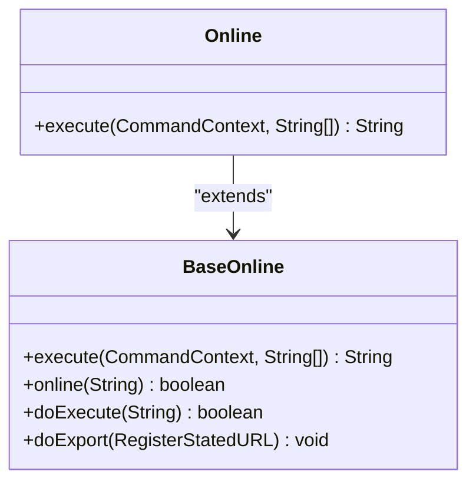
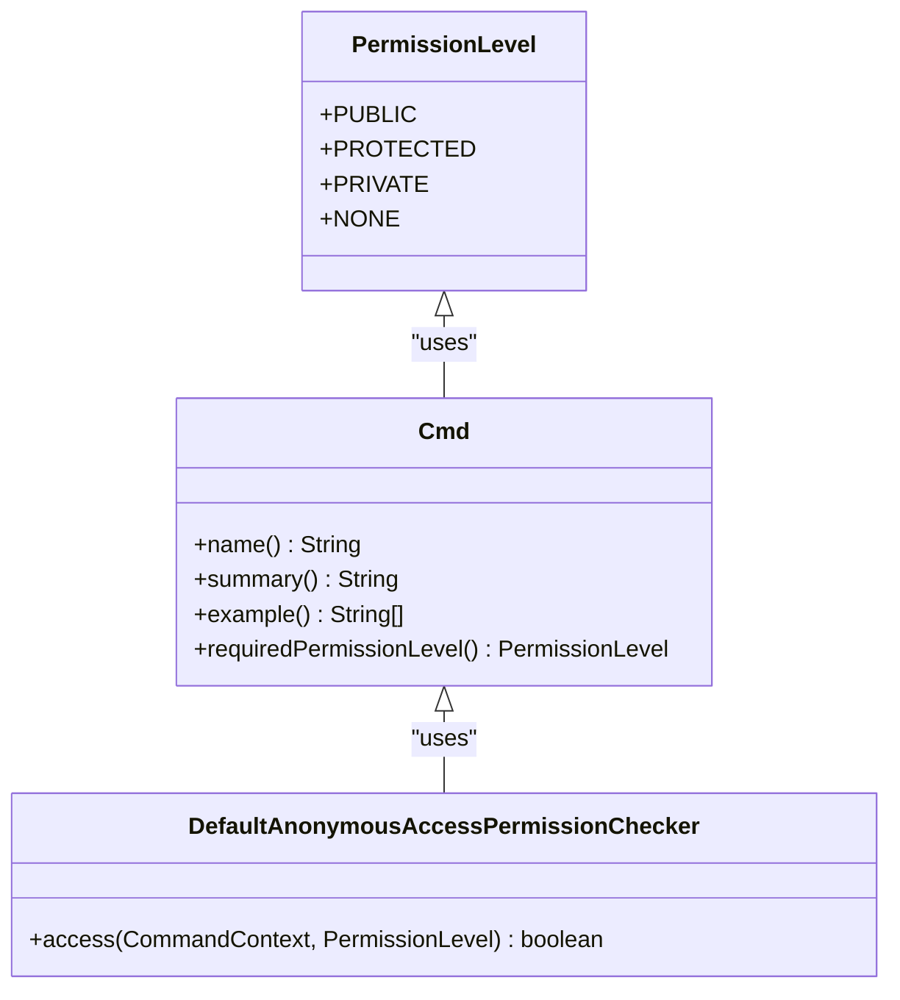

# 内置命令详解

<cite>
**本文档引用的文件**  
- [Online.java](file://dubbo-plugin\dubbo-qos\src\main\java\org\apache\dubbo\qos\command\impl\Online.java)
- [Offline.java](file://dubbo-plugin\dubbo-qos\src\main\java\org\apache\dubbo\qos\command\impl\Offline.java)
- [BaseOnline.java](file://dubbo-plugin\dubbo-qos\src\main\java\org\apache\dubbo\qos\command\impl\BaseOnline.java)
- [BaseOffline.java](file://dubbo-plugin\dubbo-qos\src\main\java\org\apache\dubbo\qos\command\impl\BaseOffline.java)
- [PermissionLevel.java](file://dubbo-plugin\dubbo-qos-api\src\main\java\org\apache\dubbo\qos\api\PermissionLevel.java)
- [Cmd.java](file://dubbo-plugin\dubbo-qos-api\src\main\java\org\apache\dubbo\qos\api\Cmd.java)
- [DefaultCommandExecutor.java](file://dubbo-plugin\dubbo-qos\src\main\java\org\apache\dubbo\qos\command\DefaultCommandExecutor.java)
- [DefaultAnonymousAccessPermissionChecker.java](file://dubbo-plugin\dubbo-qos\src\main\java\org\apache\dubbo\qos\permission\DefaultAnonymousAccessPermissionChecker.java)
- [ApplicationConfig.java](file://dubbo-common\src\main\java\org\apache\dubbo\config\ApplicationConfig.java)
</cite>

## 目录
1. [引言](#引言)
2. [核心命令功能与使用场景](#核心命令功能与使用场景)
3. [命令实现代码详解](#命令实现代码详解)
4. [使用示例](#使用示例)
5. [状态查询命令操作指南](#状态查询命令操作指南)
6. [自动化运维脚本编写建议](#自动化运维脚本编写建议)
7. [结论](#结论)

## 引言
本文档旨在全面介绍Dubbo QoS（Quality of Service）内置命令中的Online、Offline、ReadOnly等核心命令。通过详细解释每个命令的实现代码，包括状态切换逻辑、服务注册状态更新和权限控制，为初学者提供基本的状态查询命令操作指南，同时为高级运维人员提供基于这些命令的自动化运维脚本编写建议。

## 核心命令功能与使用场景
Dubbo QoS内置命令提供了多种运维功能，其中Online、Offline和ReadOnly命令是核心命令，用于控制服务的状态和访问权限。

### Online命令
Online命令用于将服务重新上线，使其可以接收外部请求。该命令适用于服务维护后重新启用的场景。

### Offline命令
Offline命令用于将服务下线，停止接收新的请求。该命令适用于服务维护或升级前的准备阶段。

### ReadOnly命令
ReadOnly命令用于将服务设置为只读模式，允许读取操作但禁止写入操作。该命令适用于数据迁移或备份期间的场景。

## 命令实现代码详解
本节详细解释Online、Offline和ReadOnly命令的实现代码，包括状态切换逻辑、服务注册状态更新和权限控制。

### Online命令实现
Online命令的实现位于`Online.java`文件中，继承自`BaseOnline`类。`BaseOnline`类中的`execute`方法负责处理命令执行逻辑，通过匹配服务模式来确定需要上线的服务，并调用`doExport`方法将其注册到注册中心。



**图表来源**
- [Online.java](file://dubbo-plugin\dubbo-qos\src\main\java\org\apache\dubbo\qos\command\impl\Online.java)
- [BaseOnline.java](file://dubbo-plugin\dubbo-qos\src\main\java\org\apache\dubbo\qos\command\impl\BaseOnline.java)

**本节来源**
- [Online.java](file://dubbo-plugin\dubbo-qos\src\main\java\org\apache\dubbo\qos\command\impl\Online.java#L1-L31)
- [BaseOnline.java](file://dubbo-plugin\dubbo-qos\src\main\java\org\apache\dubbo\qos\command\impl\BaseOnline.java#L1-L94)

### Offline命令实现
Offline命令的实现位于`Offline.java`文件中，继承自`BaseOffline`类。`BaseOffline`类中的`execute`方法负责处理命令执行逻辑，通过匹配服务模式来确定需要下线的服务，并调用`doUnexport`方法将其从注册中心注销。


**图表来源**
- [Offline.java](file://dubbo-plugin\dubbo-qos\src\main\java\org\apache\dubbo\qos\command\impl\Offline.java)
- [BaseOffline.java](file://dubbo-plugin\dubbo-qos\src\main\java\org\apache\dubbo\qos\command\impl\BaseOffline.java)

**本节来源**
- [Offline.java](file://dubbo-plugin\dubbo-qos\src\main\java\org\apache\dubbo\qos\command\impl\Offline.java#L1-L38)
- [BaseOffline.java](file://dubbo-plugin\dubbo-qos\src\main\java\org\apache\dubbo\qos\command\impl\BaseOffline.java#L1-L117)

### 权限控制实现
权限控制通过`PermissionLevel`枚举和`Cmd`注解实现。`PermissionLevel`定义了不同级别的权限，而`Cmd`注解用于指定命令所需的权限级别。`DefaultAnonymousAccessPermissionChecker`类负责检查命令执行的权限。



**图表来源**
- [PermissionLevel.java](file://dubbo-plugin\dubbo-qos-api\src\main\java\org\apache\dubbo\qos\api\PermissionLevel.java)
- [Cmd.java](file://dubbo-plugin\dubbo-qos-api\src\main\java\org\apache\dubbo\qos\api\Cmd.java)
- [DefaultAnonymousAccessPermissionChecker.java](file://dubbo-plugin\dubbo-qos\src\main\java\org\apache\dubbo\qos\permission\DefaultAnonymousAccessPermissionChecker.java)

**本节来源**
- [PermissionLevel.java](file://dubbo-plugin\dubbo-qos-api\src\main\java\org\apache\dubbo\qos\api\PermissionLevel.java#L1-L68)
- [Cmd.java](file://dubbo-plugin\dubbo-qos-api\src\main\java\org\apache\dubbo\qos\api\Cmd.java#L1-L66)
- [DefaultAnonymousAccessPermissionChecker.java](file://dubbo-plugin\dubbo-qos\src\main\java\org\apache\dubbo\qos\permission\DefaultAnonymousAccessPermissionChecker.java#L1-L66)

## 使用示例
本节提供Online、Offline和ReadOnly命令的使用示例，展示在不同运维场景下的实际应用。

### Online命令使用示例
```bash
# 将所有服务重新上线
online dubbo

# 将特定服务重新上线
online xx.xx.xxx.service
```

### Offline命令使用示例
```bash
# 将所有服务下线
offline dubbo

# 将特定服务下线
offline xx.xx.xxx.service
```

### ReadOnly命令使用示例
```bash
# 将服务设置为只读模式
readonly xx.xx.xxx.service
```

**本节来源**
- [Online.java](file://dubbo-plugin\dubbo-qos\src\main\java\org\apache\dubbo\qos\command\impl\Online.java#L22-L25)
- [Offline.java](file://dubbo-plugin\dubbo-qos\src\main\java\org\apache\dubbo\qos\command\impl\Offline.java#L23-L26)

## 状态查询命令操作指南
本节为初学者提供基本的状态查询命令操作指南，帮助他们快速上手使用QoS命令。

### 查询服务状态
使用`ls`命令可以查询当前所有服务的状态，包括在线、离线和只读状态。

```bash
# 查询所有服务状态
ls
```

### 查询特定服务状态
使用`ls`命令加上服务名可以查询特定服务的状态。

```bash
# 查询特定服务状态
ls xx.xx.xxx.service
```

**本节来源**
- [Ls.java](file://dubbo-plugin\dubbo-qos\src\main\java\org\apache\dubbo\qos\command\impl\Ls.java)

## 自动化运维脚本编写建议
本节为高级运维人员提供基于QoS命令的自动化运维脚本编写建议，帮助他们提高运维效率。

### 自动化上线脚本
编写自动化脚本，在服务部署完成后自动执行Online命令，确保服务能够及时上线。

```bash
#!/bin/bash
# 部署完成后执行Online命令
online dubbo
```

### 自动化下线脚本
编写自动化脚本，在服务升级前自动执行Offline命令，确保服务能够安全下线。

```bash
#!/bin/bash
# 升级前执行Offline命令
offline dubbo
```

### 自动化状态检查脚本
编写自动化脚本，定期检查服务状态，并在发现异常时发送告警。

```bash
#!/bin/bash
# 定期检查服务状态
status=$(ls)
if [[ "$status" == *"offline"* ]]; then
    echo "发现离线服务，发送告警"
fi
```

**本节来源**
- [Online.java](file://dubbo-plugin\dubbo-qos\src\main\java\org\apache\dubbo\qos\command\impl\Online.java)
- [Offline.java](file://dubbo-plugin\dubbo-qos\src\main\java\org\apache\dubbo\qos\command\impl\Offline.java)
- [Ls.java](file://dubbo-plugin\dubbo-qos\src\main\java\org\apache\dubbo\qos\command\impl\Ls.java)

## 结论
本文档全面介绍了Dubbo QoS内置命令中的Online、Offline和ReadOnly等核心命令，详细解释了每个命令的实现代码，包括状态切换逻辑、服务注册状态更新和权限控制。通过提供使用示例和操作指南，帮助初学者快速上手，同时为高级运维人员提供了自动化运维脚本编写建议，提高了运维效率。